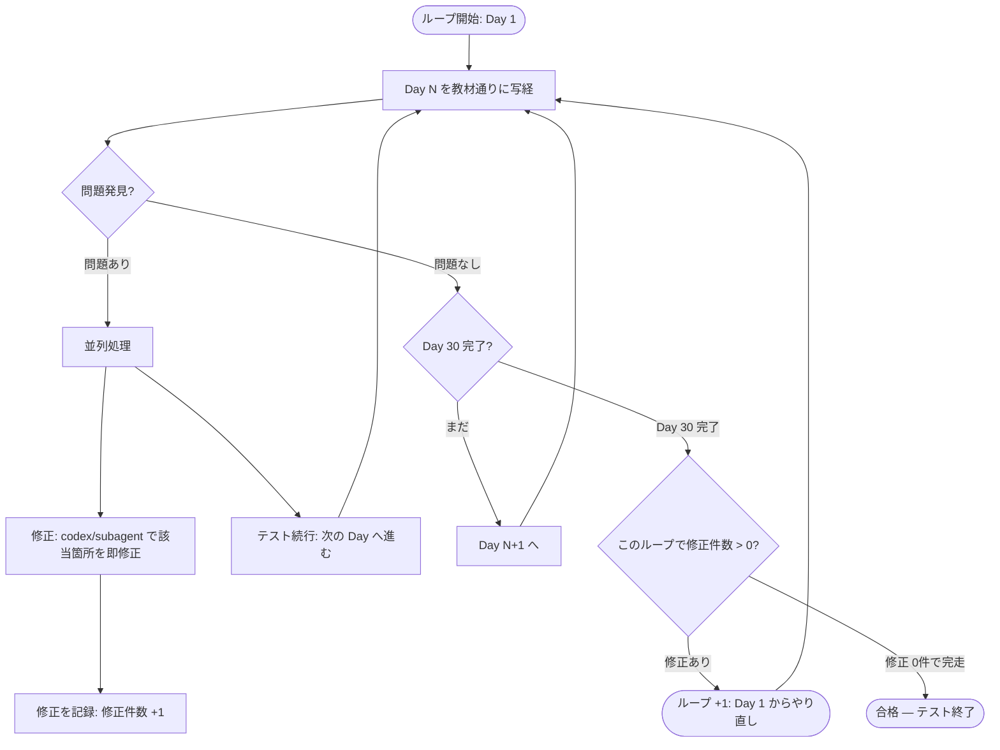

# /test-loop — 教材写経ループテスト

Day 1〜30 を読者目線で実際に写経するループテストを実行せよ。

## フロー

## ルール

1. **並列修正**: 問題発見 → 修正用 codex を別で立てる → テストは止めずに次の Day へ
2. **ループ判定**: 1箇所でも修正が入ったら Day 1 からやり直し
3. **合格条件**: 修正 0件で Day 1〜30 を完走

## 100点満点の最低条件

- 1回のループで一度も問題を発見できない状態
- 対象読者（プログラミング初学者）が教材を見るだけで迷わずにアプリを完成できる
- スクショ等の添付物がプレースホルダーではなく、実物の完全なものが添付されている
- 各Day で npm run dev / npm run build が通る
- 確認ポイントが全て実際に動作する

## 作業委譲

codex → subagent → agentteam → 自分の順で委譲。各Day のテストは codex に投げろ。
