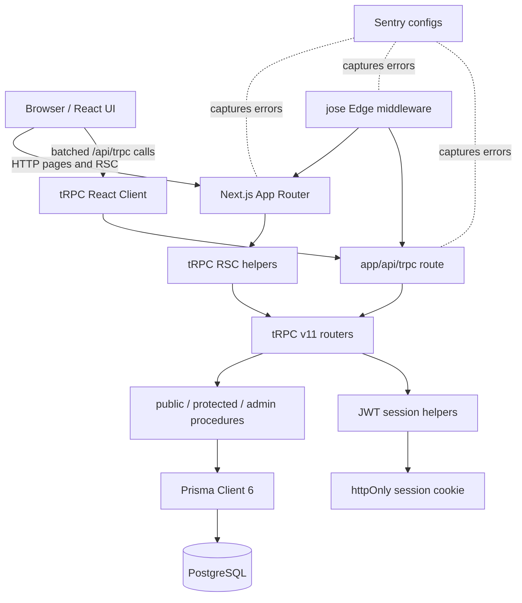

# Architecture

task-app is a Next.js 15 application that uses tRPC v11 for typed application APIs, Prisma 6 for PostgreSQL access, and a jose-signed JWT session cookie for authentication.

## Component Diagram

## Runtime Layers

| Layer | Main files | Responsibility |
| --- | --- | --- |
| UI and routes | `src/app/**`, `src/component/**` | Render pages, forms, dashboards, and user flows. |
| tRPC client | `src/trpc/react.tsx`, `src/trpc/server.ts` | Provide typed client calls from Client Components and RSC helpers. |
| tRPC server | `src/server/api/root.ts`, `src/server/api/trpc.ts`, `src/server/api/routers/**` | Validate inputs, enforce auth boundaries, and execute business logic. |
| Session | `src/lib/session.ts` | Sign and verify HS256 JWTs, set/delete the `session` cookie, expose current session. |
| Edge auth gate | `src/middleware.ts` | Redirect unauthenticated page requests and verify JWTs with jose in Edge Runtime. |
| Database | `prisma/schema.prisma`, `src/lib/prisma.ts` | Persist users, projects, tasks, comments, sessions, login attempts, and relations. |
| Observability | `sentry.*.config.ts` | Enable Sentry server, edge, and browser reporting when DSNs are configured. |

## Data Flow

1. The browser requests a page or calls `/api/trpc`.
2. `src/middleware.ts` allows public pages (`/login`, `/register`) and skips redirects for `/api/trpc`.
3. Page requests with a `session` cookie are verified in Edge Runtime using `jose.jwtVerify`.
4. tRPC requests enter the route handler and create context through `createTRPCContext`.
5. `createTRPCContext` reads the cookie via `getSession()` from `src/lib/session.ts`.
6. Routers use `publicProcedure`, `protectedProcedure`, or `adminProcedure`.
7. Protected/admin procedures re-read the user through Prisma and reject missing or inactive users.
8. Routers call Prisma Client to read/write PostgreSQL and return superjson-serialized responses.
9. React Query caches client-side tRPC responses using the query client in `src/trpc/react.tsx`.

## Auth Boundaries

| Boundary | Enforcement | Notes |
| --- | --- | --- |
| Public pages | `src/middleware.ts` public path list | `/login` and `/register` do not require a session. |
| Protected pages | `src/middleware.ts` | Missing or invalid JWT redirects to `/login`. |
| tRPC public APIs | `publicProcedure` | Login/register/session lookup can run without a JWT. |
| tRPC protected APIs | `protectedProcedure` | Requires session, existing user, and `isActive = true`. |
| Admin APIs | `adminProcedure` | Requires protected user plus `role = ADMIN`. |
| Cookie storage | `src/lib/session.ts` | `httpOnly`, `sameSite: strict`, secure in production except Playwright mode. |

The Edge middleware is a coarse page gate. The tRPC procedure middleware is the authoritative API authorization layer because `/api/trpc` must support both public and protected procedures.

## Persistence Model

Prisma maps application records to PostgreSQL tables:

- `User`, `Account`, `Session`, `VerificationToken`
- `Project`, `ProjectMember`
- `Task`, `Comment`
- `LoginAttempt`

Project deletion cascades to project members and tasks; task deletion cascades to comments. User deletion is intentionally restrictive for task/comment history unless the relation is explicitly configured with cascade.

## Error Reporting

Sentry is optional and activates only when `SENTRY_DSN` or `NEXT_PUBLIC_SENTRY_DSN` is set. Server and Edge configs prefer `SENTRY_DSN` and fall back to the public DSN. Browser config uses `NEXT_PUBLIC_SENTRY_DSN` and enables replay integration.
