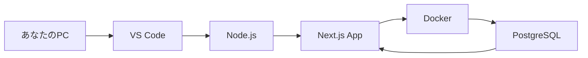
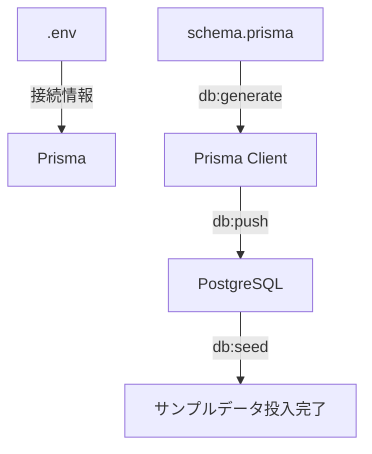

# Day 01: 開発環境を整えて、初めてのアプリを動かそう

## このDayについて

| 項目 | 内容 |
|------|------|
| 所要時間 | 60〜90分 |
| 対応OS | Windows 10/11、macOS 12以降、Ubuntu 22.04以降 |
| 想定シェル | bash / zsh（Mac/Linux）、PowerShell / Git Bash（Windows） |
| ネット接続 | 必須（パッケージダウンロードのため） |

### このDayでやること / やらないこと

| やること | やらないこと |
|---------|-------------|
| Node.js、Docker、VS Codeのインストール | コードの書き方の詳細説明 |
| GitHubからコードを取得 | Gitの詳しい使い方 |
| データベースをDockerで起動 | Docker内部構造の説明 |
| アプリをローカルで動かしてブラウザ確認 | 機能の実装変更 |

### 必要インストール物一覧

| ツール | 用途 | インストールStep |
|--------|------|-----------------|
| Node.js 20.x以上（LTS） | JavaScript実行環境 | Step 1 |
| npm 10.x以上 | パッケージ管理（Node.jsに同梱） | Step 1 |
| Docker Desktop | データベースコンテナ実行 | Step 2 |
| VS Code | コードエディタ | Step 3 |
| Git 2.x以上 | バージョン管理 | Step 4で使用（未インストール時は手順あり） |

### 完了条件（これができたらDay01は完了）

- [ ] `node --version` で v20.x 以上が表示される
- [ ] `docker compose ps` で `taskapp-postgres` が `running` と表示される
- [ ] ブラウザで `http://localhost:3000` にアクセスしてログイン画面が表示される
- [ ] `admin@example.com` / `password123` でログインしてダッシュボードが表示される

---

## 事前チェック表（まず最初に確認！）

始める前に、あなたの環境を確認しましょう。以下の表で自分がどれに当てはまるかチェックしてください。

### OS・CPU・権限チェック

| あなたの環境 | 確認方法 | この教材での対応 |
|-------------|---------|-----------------|
| **Windows 10/11** | 「設定」→「システム」→「バージョン情報」 | 対応（PowerShell使用） |
| **macOS（Intel）** | 左上のりんご→「このMacについて」→「Intel」表記 | 対応 |
| **macOS（Apple Silicon/M1/M2/M3）** | 左上のりんご→「このMacについて」→「Apple M1/M2/M3」表記 | 対応 |
| **Ubuntu/Linux** | ターミナルで `uname -a` | 対応 |

### Windowsユーザー向け追加チェック

| チェック項目 | 確認方法 | 必要な対応 |
|-------------|---------|-----------|
| **WSL2がインストール済みか** | PowerShellで `wsl --version` | 未インストールなら下記手順で導入 |
| **管理者権限があるか** | アプリインストール時に許可を求められるか | 会社PC等で制限がある場合は管理者に相談 |

**WSL2（Windows Subsystem for Linux 2）とは？**
Windowsの中でLinuxを動かす仕組みです。Docker Desktopが内部で使います。「Windowsの中にLinuxの部屋を作る」イメージです。

**WSL2が未インストールの場合：**

```powershell
# filepath: PowerShell（管理者として実行）
# WSL2をインストールするコマンド
wsl --install
```

**確認ポイント:**
- 保存不要（コマンド実行のみ）
- 実行後「インストールが完了しました」と表示される
- **インストール後、PCを再起動してください**

### 既存のNode.jsがある場合

| 状況 | 確認方法 | 対応 |
|------|---------|------|
| Node.jsが入っているか不明 | ターミナルで `node --version` | エラーが出れば未インストール。Step 1へ進む |
| v20未満が入っている | `node --version` で v18.x 等と表示 | 公式サイトから最新LTS版を上書きインストール |
| v20以上が入っている | `node --version` で v20.x や v22.x と表示 | Step 1はスキップ可能 |

---

## 詰まった時の戻り先

| 症状 | 戻るStep | 確認コマンド |
|------|---------|-------------|
| nodeコマンドが使えない | Step 1 | `node --version` |
| dockerコマンドが使えない | Step 2 | `docker --version` |
| DBに接続できない | Step 4 | `docker compose ps` |
| npm installが失敗する | Step 6 | `ls node_modules` |
| ブラウザに表示されない | Step 8 | ターミナルで `npm run dev` の状態を確認 |

---

## Step一覧

| Step | タイトル | 目安時間 | 触るファイル | 成功状態 |
|------|---------|---------|-------------|---------|
| 1 | Node.jsとnpmをインストール | 5〜10分 | なし | `node --version` でv20以上が表示 |
| 2 | Docker Desktopをインストール | 5〜10分 | なし | `docker --version` でバージョン表示 |
| 3 | VS Codeをインストール | 3〜7分 | なし | VS Codeが起動する |
| 4 | プロジェクトを取得・DBを起動 | 5〜10分 | なし | `docker compose ps` でrunning表示 |
| 5 | 環境変数ファイルを作成 | 3〜5分 | .env | .envファイルが存在する |
| 6 | 依存パッケージをインストール | 3〜7分 | なし | `node_modules` フォルダが存在 |
| 7 | データベースをセットアップ | 3〜7分 | なし | `db:push` が成功メッセージ表示 |
| 8 | 開発サーバーを起動・確認 | 5〜10分 | なし | ブラウザでログイン画面が表示 |

---

## 今日学ぶこと

| 項目 | 説明 | 例え話 |
|------|------|--------|
| Node.js | JavaScriptを動かす土台 | 電気を通す「コンセント」 |
| npm | パッケージ管理ツール | 図書館の「司書さん」 |
| Docker | アプリを箱に詰める技術 | 引っ越しの「段ボール」 |
| VS Code | コードを書くエディタ | 料理の「まな板と包丁」 |
| .env | 秘密情報を置くファイル | 金庫の「暗証番号メモ」 |
| Prisma | データベースの通訳ツール | 外国語の「通訳さん」 |



---

### Step 1: Node.jsとnpmをインストールする（5〜10分）

**目的:**
Node.js（ノードジェイエス）は、JavaScriptをパソコン上で動かすための土台です。「コンセント」のようなもので、これがないとアプリに「電気」が通りません。

npm（エヌピーエム：Node Package Manager）は、Node.jsと一緒にインストールされるパッケージ管理ツールです。「図書館の司書さん」のように、必要なライブラリを集めてくれます。

**進捗の目安:**

| 到達点 | 目安経過時間 |
|--------|-------------|
| 公式サイトを開いた | 1分 |
| インストーラーをダウンロード中 | 2分 |
| インストーラーを実行中 | 3〜7分（回線速度による） |
| バージョン確認完了 | 8〜10分 |

ダウンロードやインストールの時間は、お使いの回線速度やPCの性能で変わります。少し時間がかかっても心配ありません。

**操作手順（Windows / Mac 共通）:**

1. 公式サイトにアクセス: https://nodejs.org/
2. **「LTS」と書かれた緑色のボタン**をクリック（v20.x または v22.x）
3. ダウンロードしたファイルを実行し、指示に従ってインストール

インストール完了後、ターミナルを開いてバージョンを確認します。

```bash
# filepath: ターミナル（Windows: PowerShell / Mac: ターミナル）
# Node.jsのバージョンを確認する
node --version
```

**確認ポイント:**
- 保存不要（コマンド実行のみ）
- `v20.18.0` や `v22.14.0` のように `v20` 以上が表示されればOK

```bash
# filepath: ターミナル（Windows: PowerShell / Mac: ターミナル）
# npmのバージョンを確認する（Node.jsと一緒にインストールされる）
npm --version
```

**確認ポイント:**
- 保存不要（コマンド実行のみ）
- `10.8.2` や `11.0.0` のように数字が表示されればOK

**✅ 成功状態（これが見えたらOK）**

| コマンド | 期待される出力例 |
|---------|----------------|
| `node --version` | `v20.18.0` や `v22.14.0` |
| `npm --version` | `10.8.2` や `11.0.0` |

数字は多少違っても問題ありません。v20以上であれば成功です。

**つまずき救済:**

| よくある原因 | 対処法 |
|-------------|--------|
| `command not found: node` と表示される | ターミナルを一度閉じて再度開く。それでもダメならPCを再起動 |
| バージョンが古い（v18以下） | 公式サイトから最新LTS版を再インストール |

| OS | ターミナルの開き方 |
|----|-------------------|
| Windows | 「スタート」→「cmd」または「PowerShell」と検索 |
| Mac | 「Spotlight（⌘+Space）」→「ターミナル」と検索 |
| Linux | Ctrl + Alt + T |

---

### Step 2: Docker Desktopをインストールする（5〜10分）

**目的:**
Docker（ドッカー）は、アプリケーションを「段ボール箱」に詰めて、どのパソコンでも同じように動くようにする技術です。今回は、データベース（PostgreSQL）をDockerで動かします。

**コンテナ（container）とは？**
Dockerの「段ボール箱」のことです。アプリと必要なファイルをすべて詰め込んで、どの環境でも同じ状態で動かせます。

**進捗の目安:**

| 到達点 | 目安経過時間 |
|--------|-------------|
| 公式サイトを開いた | 1分 |
| インストーラーをダウンロード中 | 2〜4分 |
| インストーラーを実行中 | 3〜6分 |
| Docker Desktopを起動した | 7〜9分 |
| バージョン確認完了 | 8〜10分 |

Docker Desktopのダウンロードサイズは約500MBあります。回線速度によっては時間がかかりますが、焦らず待ちましょう。

**なぜDockerを使うのか:**

| 問題 | Dockerなし | Dockerあり |
|------|-----------|-----------|
| 環境差異 | 「私のPCでは動いたのに…」 | 全員同じ環境で動く |
| セットアップ | 手順書を見て手動設定 | コマンド1つで完了 |
| 削除 | 設定ファイルが残る | コンテナ削除で完全消去 |

**操作手順:**

1. 公式サイトにアクセス: https://www.docker.com/products/docker-desktop/
2. お使いのOS用をダウンロード（Windows / Mac Intel / Mac Apple Silicon）
3. インストーラーを実行
4. **インストール後、Docker Desktopアプリを起動する**（重要！）

**Docker Desktop起動確認（GUI確認）:**

| OS | 確認場所 | 表示 |
|----|---------|------|
| Windows | タスクバー右下（システムトレイ） | クジラアイコン🐳が表示されている |
| Mac | メニューバー右上 | クジラアイコン🐳が表示されている |

【スクリーンショット: Docker Desktopのクジラアイコンが表示されている状態】

```bash
# filepath: ターミナル（Windows: PowerShell / Mac: ターミナル）
# Dockerのバージョンを確認する
docker --version
```

**確認ポイント:**
- 保存不要（コマンド実行のみ）
- `Docker version 24.0.0` や `Docker version 27.3.1` のように表示されればOK

```bash
# filepath: ターミナル（Windows: PowerShell / Mac: ターミナル）
# Docker Composeのバージョンを確認する
docker compose version
```

**確認ポイント:**
- 保存不要（コマンド実行のみ）
- `Docker Compose version v2.x.x` のように表示されればOK

**✅ 成功状態（これが見えたらOK）**

- ターミナルに `Docker version 24.0.0` 以上のバージョンが表示される
- タスクバー（Windows）またはメニューバー（Mac）にクジラのアイコン🐳が表示されている
- `docker compose version` で `v2.x.x` が表示される

**つまずき救済:**

| よくある原因 | 対処法 |
|-------------|--------|
| `command not found: docker` と表示される | Docker Desktopアプリを起動してから再度コマンドを実行 |
| クジラアイコンが見つからない | アプリ一覧から「Docker Desktop」を探して起動 |
| Windowsで「WSL2が必要」と表示 | 事前チェック表のWSL2インストール手順を実行後、PCを再起動 |
| Windowsで「Hyper-Vが必要」と表示 | BIOSで仮想化を有効化（PC再起動→F2/DEL押下→Virtualization有効化） |

---

### Step 3: VS Codeをインストールする（3〜7分）

**目的:**
VS Code（ブイエスコード：Visual Studio Code）は、コードを書くための専用エディタです。メモ帳でも書けますが、VS Codeは「補助輪付き自転車」のように開発を助けてくれます。

**進捗の目安:**

| 到達点 | 目安経過時間 |
|--------|-------------|
| 公式サイトを開いた | 1分 |
| インストール完了 | 2〜4分 |
| 拡張機能をインストール中 | 4〜6分 |
| 日本語化完了 | 5〜7分 |

**操作手順:**

1. 公式サイトにアクセス: https://code.visualstudio.com/
2. 「Download」ボタンをクリック
3. ダウンロードしたファイルを実行

VS Codeを開いたら、左側の四角いアイコン（拡張機能）をクリックして、以下をインストールします。

| 拡張機能名 | 用途 | 検索キーワード |
|-----------|------|---------------|
| Japanese Language Pack | 日本語化 | japanese |
| Prisma | データベース定義のハイライト | prisma |
| Tailwind CSS IntelliSense | スタイルの補完 | tailwind |
| Docker | Docker関連ファイルのサポート | docker |

インストール後、VS Codeが正常に起動しているか確認します。

```bash
# filepath: ターミナル（Windows: PowerShell / Mac: ターミナル）
# VS Codeがインストールされているか確認する（バージョン表示）
code --version
```

**確認ポイント:**
- 保存不要（コマンド実行のみ）
- `1.96.0` のようにバージョン番号が表示されればOK
- 各拡張機能の「Install」ボタンをクリック後、ボタンが「Uninstall」に変われば成功

**✅ 成功状態（これが見えたらOK）**

- VS Codeが起動し、左側サイドバーに「エクスプローラー」「検索」「ソース管理」などのアイコンが表示される
- 拡張機能インストール後、VS Codeを再起動するとメニューが日本語になる

【スクリーンショット: VS Codeの拡張機能インストール画面で「Japanese Language Pack」をインストール後の状態】

**つまずき救済:**

| よくある原因 | 対処法 |
|-------------|--------|
| 拡張機能が見つからない | 検索ボックスにキーワードを入力して検索 |
| 日本語にならない | VS Codeを再起動（⌘+Q / Alt+F4 で終了して再度開く） |

---

### Step 4: プロジェクトを取得してDBを起動する（5〜10分）

**目的:**
GitHub（ギットハブ）からプロジェクトのコードをダウンロードし、データベースを起動します。

**Git（ギット）とは？**
コードの変更履歴を管理するツールです。「タイムマシン」のように、過去のコードに戻れます。

**クローン（clone）とは？**
リポジトリ（コードの保管庫）の完全なコピーを作ることです。「本を丸ごとコピーする」イメージです。

**compose（コンポーズ）とは？**
Docker Composeの略で、複数のコンテナを一括管理する仕組みです。「引っ越しトラックに複数の段ボールを積む」イメージです。

**進捗の目安:**

| 到達点 | 目安経過時間 |
|--------|-------------|
| ターミナルでフォルダに移動 | 1分 |
| クローン完了 | 2〜4分 |
| VS Codeで開いた | 3〜5分 |
| DBコンテナ起動完了 | 5〜10分 |

**操作手順:**

まず、作業フォルダに移動します。

```bash
# filepath: ターミナル（Windows: PowerShell / Mac: ターミナル）
# 作業フォルダに移動する（例：デスクトップ）
cd ~/Desktop
```

**確認ポイント:**
- 保存不要（コマンド実行のみ）
- エラーなく次の行に進めばOK

```bash
# filepath: ターミナル（Windows: PowerShell / Mac: ターミナル）
# プロジェクトをクローンする
git clone https://github.com/your-org/task-app.git
```

**確認ポイント:**
- 保存不要（コマンド実行のみ）
- `Cloning into 'task-app'...` → `done.` と表示されればOK

```bash
# filepath: ターミナル（Windows: PowerShell / Mac: ターミナル）
# プロジェクトフォルダに移動する
cd task-app
```

**確認ポイント:**
- 保存不要（コマンド実行のみ）
- エラーなく次の行に進めばOK

```bash
# filepath: ターミナル（Windows: PowerShell / Mac: ターミナル）
# VS Codeでフォルダを開く
code .
```

**確認ポイント:**
- 保存不要（コマンド実行のみ）
- VS Codeが起動し、左側に `src`、`prisma`、`package.json` が見えればOK

「このフォルダーの作成者を信頼しますか？」と聞かれたら「信頼する」を選択してください。

**次に、データベースを起動します。**

```bash
# filepath: ターミナル（task-appフォルダ内で実行）
# Dockerコンテナをバックグラウンド（-d）で起動する
docker compose up -d db
```

**確認ポイント:**
- 保存不要（コマンド実行のみ）
- 初回は `Pulling` と表示されてイメージダウンロードが始まる
- 最後に `Container taskapp-postgres Started` と表示されればOK

```bash
# filepath: ターミナル（task-appフォルダ内で実行）
# 起動中のコンテナを確認する
docker compose ps
```

**確認ポイント:**
- 保存不要（コマンド実行のみ）
- `taskapp-postgres` が `running` または `healthy` と表示されればOK

**✅ 成功状態（これが見えたらOK）**

| 確認項目 | 期待される状態 |
|---------|---------------|
| `git clone` | `Cloning into 'task-app'...` → `done.` |
| `code .` | VS Codeが起動し、左側に `src`、`prisma`、`package.json` が見える |
| `docker compose ps` | `taskapp-postgres` が `running` または `healthy` |

【スクリーンショット: docker compose ps コマンドの出力で taskapp-postgres が running と表示されている状態】

**プロジェクト構造を理解する:**

```
task-app/                       # プロジェクトルート
├── src/                        # ソースコード本体
│   ├── app/                    # ページ・ルーティング（ブラウザに表示する画面）
│   ├── components/             # 再利用可能なUI部品（ボタン、カードなど）
│   └── server/                 # サーバーサイドロジック（API処理）
├── prisma/
│   └── schema.prisma           # データベース設計図
├── docker-compose.yml          # Docker設定ファイル（コンテナの定義）
├── package.json                # 依存関係リスト（必要なパッケージ一覧）
└── .env.example                # 環境変数のサンプル（.envの見本）
```

| フォルダ | 役割 |
|---------|------|
| src/app/ | ブラウザに表示するページ |
| src/components/ | ボタンやカードなどの部品 |
| prisma/ | データベースの設計図 |

**つまずき救済:**

| よくある原因 | 対処法 |
|-------------|--------|
| `git: command not found` | Gitをインストール: https://git-scm.com/ |
| ポート5432が使用中（Error: bind: address already in use） | 下記「ポート競合時の復帰手順」を参照 |
| Docker Desktopが起動していない | Step 2に戻り、Docker Desktopアプリを起動 |

**ポート競合時の復帰手順:**

```bash
# filepath: ターミナル（task-appフォルダ内で実行）
# 既存のコンテナを停止して削除する
docker compose down
```

**確認ポイント:**
- 保存不要（コマンド実行のみ）
- `Container taskapp-postgres Removed` と表示されればOK

```bash
# filepath: ターミナル（task-appフォルダ内で実行）
# 再度コンテナを起動する
docker compose up -d db
```

**確認ポイント:**
- 保存不要（コマンド実行のみ）
- `Container taskapp-postgres Started` と表示されればOK

**それでもポートが競合する場合（ポート変更手順）:**

`.env`ファイルで別のポートを指定できます（Step 5で作成後に編集）。

```bash
# filepath: .env（Step 5で作成後に編集）
# ポート5432が他で使われている場合、5433に変更
_DOCKER_COMPOSE_HOST_PORT_DB=5433
```

---

### Step 5: 環境変数ファイルを作成する（3〜5分）

**目的:**
.env（ドットイーエヌブイ）ファイルを作成します。このファイルには、データベースの接続先やアプリの秘密情報を記載します。

**.env（環境変数ファイル）とは？**
環境変数（かんきょうへんすう）を書くファイルです。「金庫の暗証番号メモ」のように、外部に漏らしてはいけない情報を置きます。

**なぜ.envが必要なのか:**

| ファイル | 役割 | Gitにコミット |
|----------|------|--------------|
| .env.example | 設定のテンプレート（サンプル） | する |
| .env | 実際の秘密情報（本物） | **しない**（.gitignoreで除外済み） |

`.env.example`は「こういう項目を設定してね」という見本です。これをコピーして`.env`を作り、実際の値を入れます。

**【重要】Git管理方針:**
`.env`ファイルには秘密情報が含まれるため、Gitにはコミットしません。`.gitignore`ファイルで自動的に除外されているので、誤ってコミットされる心配はありません。

**操作手順（OS別）:**

**Mac / Linux の場合:**

```bash
# filepath: ターミナル（task-appフォルダ内で実行）
# サンプルファイルをコピーして.envを作成する
cp .env.example .env
```

**確認ポイント:**
- `.env`ファイルが作成される
- エラーなし（何も表示されなければ正常）

**Windows PowerShell の場合:**

```powershell
# filepath: PowerShell（task-appフォルダ内で実行）
# サンプルファイルをコピーして.envを作成する
Copy-Item .env.example .env
```

**確認ポイント:**
- `.env`ファイルが作成される
- エラーなし（何も表示されなければ正常）

**.envファイルが作成されたことを確認:**

```bash
# filepath: ターミナル（task-appフォルダ内で実行）
# .envファイルが存在するか確認する
ls -la | grep .env
```

**確認ポイント:**
- 保存不要（コマンド実行のみ）
- 以下のように2行表示されればOK

```
-rw-r--r--  1 user  staff   xxx  x月 xx xx:xx .env
-rw-r--r--  1 user  staff   xxx  x月 xx xx:xx .env.example
```

**✅ 成功状態（これが見えたらOK）**

| 確認項目 | 期待される状態 |
|---------|---------------|
| コマンド実行 | エラーなし（何も表示されなければ正常） |
| ファイル確認 | `ls -la` で `.env` と `.env.example` の2つが表示される |

**.envファイルの中身を理解する:**

VS Codeで`.env`ファイルを開いて、中身を確認しましょう。

| 項目 | 説明 | 開発環境での変更 |
|------|------|-----------------|
| `DATABASE_URL` | データベースの接続先 | 通常は変更不要 |
| `NEXTAUTH_SECRET` | 認証用の秘密鍵（ランダムな文字列） | 開発環境では変更不要 |
| `NEXTAUTH_URL` | アプリのURL | 開発環境では変更不要 |
| `_DOCKER_COMPOSE_HOST_PORT_DB` | DBのポート番号 | ポート競合時のみ変更 |
| `_DOCKER_COMPOSE_HOST_PORT_BACKEND` | アプリのポート番号 | ポート競合時のみ変更 |

**開発環境では`.env.example`の内容をそのまま使えます。** 本番環境にデプロイする際は、適切な値に変更してください。

**つまずき救済:**

| よくある原因 | 対処法 |
|-------------|--------|
| `cp: cannot stat '.env.example': No such file or directory` | `ls` でファイル一覧を確認。task-appフォルダにいるか確認（`pwd`コマンドで確認） |
| .envがVS Codeに表示されない | VS Codeの左側ファイル一覧で、`.`で始まるファイルが非表示になっている可能性。`ls -la`で確認 |

---

### Step 6: 依存パッケージをインストールする（3〜7分）

**目的:**
npm（エヌピーエム）を使って、プロジェクトに必要なパッケージをインストールします。「司書さんが必要な本を全部集めてくる」作業です。

**パッケージとは？**
他の開発者が作った便利なコードの塊です。これを組み合わせてアプリを作ります。「レゴブロック」のように、既存のパーツを組み合わせるイメージです。

**進捗の目安:**

| 到達点 | 目安経過時間 |
|--------|-------------|
| npm install 実行開始 | 1分 |
| ダウンロード中（進捗バーが動く） | 2〜5分 |
| インストール完了 | 3〜7分 |

パッケージの数が多いため、初回は時間がかかります。進捗バーが動いていれば正常に処理中です。

**操作手順:**

```bash
# filepath: ターミナル（task-appフォルダ内で実行）
# 依存パッケージをインストールする
npm install
```

**確認ポイント:**
- 保存不要（コマンド実行のみ）
- 最後に `added XXX packages in YYs` のようなメッセージが表示される（XXXは数字）
- `WARN` で始まる警告は無視してOK（`ERR!` のみ対処が必要）

```bash
# filepath: ターミナル（task-appフォルダ内で実行）
# node_modulesフォルダが作成されたことを確認する
ls node_modules | head -5
```

**確認ポイント:**
- 保存不要（コマンド実行のみ）
- いくつかのフォルダ名が表示されれば成功

**✅ 成功状態（これが見えたらOK）**

- 最後に `added XXX packages in YYs` と表示される
- `node_modules` フォルダが作成されている

| フォルダ/ファイル | 役割 |
|------------------|------|
| node_modules/ | ダウンロードしたパッケージの実体（数千ファイル） |
| package.json | 必要なパッケージの一覧（設計図） |
| package-lock.json | パッケージのバージョン固定（同じ環境を再現するため） |

**つまずき救済:**

| よくある原因 | 対処法 |
|-------------|--------|
| `WARN` で始まる警告 | 無視してOK。`ERR!` のみ対処が必要 |
| `EACCES` 権限エラー | 下記「権限エラー時の復帰手順」を参照 |

**権限エラー時の復帰手順:**

```bash
# filepath: ターミナル（task-appフォルダ内で実行）
# node_modulesとロックファイルを削除して再インストールする
rm -rf node_modules package-lock.json
npm install
```

**確認ポイント:**
- 保存不要（コマンド実行のみ）
- 最後に `added XXX packages` と表示されればOK

---

### Step 7: データベースをセットアップする（3〜7分）

**目的:**
Prisma（プリズマ）を使ってデータベースにテーブルを作成し、サンプルデータを投入します。

**Prisma（プリズマ）とは？**
データベースの「通訳さん」です。JavaScriptのコードをデータベースが理解できる言葉（SQL）に変換してくれます。

**操作手順:**

```bash
# filepath: ターミナル（task-appフォルダ内で実行）
# Prismaクライアント（データベース操作用のコード）を生成する
npm run db:generate
```

**確認ポイント:**
- 保存不要（コマンド実行のみ）
- `✔ Generated Prisma Client` と表示されればOK

```bash
# filepath: ターミナル（task-appフォルダ内で実行）
# スキーマ（設計図）をデータベースに反映する
npm run db:push
```

**確認ポイント:**
- 保存不要（コマンド実行のみ）
- `Your database is now in sync with your Prisma schema.` と表示されればOK

```bash
# filepath: ターミナル（task-appフォルダ内で実行）
# サンプルデータ（テスト用ユーザーなど）を投入する
npm run db:seed
```

**確認ポイント:**
- 保存不要（コマンド実行のみ）
- `Seeding completed!` または `✔ Seed` と表示されればOK

**✅ 成功状態（これが見えたらOK）**

| コマンド | 期待されるメッセージ |
|---------|---------------------|
| `npm run db:generate` | `✔ Generated Prisma Client` |
| `npm run db:push` | `Your database is now in sync with your Prisma schema.` |
| `npm run db:seed` | `Seeding completed!` または `✔ Seed` |



**投入されるサンプルデータ:**

| データ種別 | 件数 | 説明 |
|-----------|------|------|
| ユーザー | 3人 | 管理者1人 + 一般ユーザー2人 |
| プロジェクト | 2件 | Webサイトリニューアル、モバイルアプリ開発 |
| タスク | 5件 | 各プロジェクトに紐づくタスク |

**つまずき救済:**

| よくある原因 | 対処法 |
|-------------|--------|
| `Can't reach database server` | Step 4に戻り、`docker compose ps` でDBがrunningか確認 |
| `.env` が見つからない | Step 5に戻り、`cp .env.example .env` を実行 |
| `P1001: Can't reach database` | Docker Desktopを再起動し、`docker compose up -d db` を再実行 |

**DBコンテナの状態を確認する（復帰用）:**

```bash
# filepath: ターミナル（task-appフォルダ内で実行）
# コンテナのログを確認する
docker compose logs db
```

**確認ポイント:**
- 保存不要（コマンド実行のみ）
- `database system is ready to accept connections` と表示されていればDBは正常

---

### Step 8: 開発サーバーを起動して確認する（5〜10分）

**目的:**
いよいよ、アプリケーションを起動してブラウザで確認します。

**開発サーバーとは？**
ローカル（自分のPC）でアプリを動かすためのサーバーです。「コードを変更すると自動的に反映される」ホットリロード機能があります。

**操作手順:**

```bash
# filepath: ターミナル（task-appフォルダ内で実行）
# 開発サーバーを起動する
npm run dev
```

**確認ポイント:**
- 保存不要（コマンド実行のみ）
- `▲ Next.js 15.x.x` と `Local: http://localhost:3000` が表示される
- **ターミナルは開いたままにする**（閉じるとサーバーが停止します）

**期待される出力:**

```
▲ Next.js 15.x.x
- Local:        http://localhost:3000
- Ready in XXXms
```

ブラウザを開いて、アドレスバーに `http://localhost:3000` と入力してEnterキーを押します。

【スクリーンショット: npm run dev 実行後のターミナル画面で「Local: http://localhost:3000」と表示されている状態】

**✅ 成功状態（これが見えたらOK）**

**ターミナル:**
- `▲ Next.js 15.x.x` と `Local: http://localhost:3000` が表示される

**ブラウザ:**
- ログイン画面が表示される
- 「Login」というタイトルと、メールアドレス・パスワードの入力フォームが見える

【スクリーンショット: ブラウザでログイン画面が表示された状態（メールアドレスとパスワードの入力欄がある）】

| 表示されるURL | 意味 |
|--------------|------|
| localhost:3000 | 自分のPC内でアクセスするURL |
| 0.0.0.0:3000 | 同じネットワーク内からアクセス可能 |

**ログインしてみる:**

シードデータで作成したユーザーでログインできます。

| 項目 | 値 |
|------|-----|
| メールアドレス | admin@example.com |
| パスワード | password123 |

ダッシュボードが表示され、「Total Projects」「Total Tasks」などの統計カードが見えれば、**Day01は完了です！**

【スクリーンショット: ダッシュボード画面が表示された状態（統計カードが見える）】

**つまずき救済:**

| よくある原因 | 対処法 |
|-------------|--------|
| 白い画面が表示される | ターミナルで `npm run dev` が動いているか確認。エラーが出ていないか確認 |
| ポート3000が使用中 | 下記「ポート3000が使用中の場合」を参照 |
| ログイン画面でエラー | Step 7に戻り、`npm run db:seed` が成功したか確認 |

**ポート3000が使用中の場合:**

**Mac/Linux:**

```bash
# filepath: ターミナル
# ポート3000を使っているプロセスを終了する
kill $(lsof -t -i:3000)
```

**確認ポイント:**
- 保存不要（コマンド実行のみ）
- エラーなく実行されればOK。その後 `npm run dev` を再実行

**Windows PowerShell:**

```powershell
# filepath: PowerShell
# ポート3000を使っているプロセスを確認する
netstat -ano | findstr :3000
```

**確認ポイント:**
- 表示されたPID（最後の数字）をメモ
- 次のコマンドでそのプロセスを終了する

```powershell
# filepath: PowerShell
# プロセスを終了する（例: PIDが1234の場合）
taskkill /PID 1234 /F
```

**確認ポイント:**
- 「成功: プロセスは強制終了されました」と表示されればOK
- その後 `npm run dev` を再実行

**開発サーバーを停止する方法:**

```bash
# filepath: ターミナル（npm run dev を実行中のターミナル）
# Ctrl + C を押すとサーバーが停止する
# 「^C」と表示され、コマンド入力待ちに戻る
```

---

## よくあるエラーと解決法

初心者がつまずきやすいエラーと、その解決方法をまとめました。

| エラー番号 | エラー内容 | 主な原因 | 戻るStep |
|-----------|-----------|---------|---------|
| 1 | `node: command not found` | Node.js未インストール/パス未設定 | Step 1 |
| 2 | `docker: command not found` | Docker Desktop未起動 | Step 2 |
| 3 | ポート5432が使用中 | 他のPostgreSQLが動作中 | Step 4 |
| 4 | `.env`が見つからない | .envファイル未作成 | Step 5 |
| 5 | `npm install` 失敗（EACCES） | 権限不足 | Step 6 |
| 6 | データベース接続エラー | Dockerコンテナ未起動 | Step 4 |
| 7 | ポート3000が使用中 | 他のアプリがポート使用中 | Step 8 |
| 8 | Windowsでパスエラー | パス区切り文字の問題 | - |

---

### エラー1: node: command not found

```
bash: node: command not found
'node' は、内部コマンドまたは外部コマンドとして認識されていません
```

| 原因 | 解決策 |
|------|--------|
| Node.jsがインストールされていない | Step 1に戻ってNode.jsをインストール |
| ターミナルを再起動していない | ターミナルを閉じて再度開く |
| PATHが設定されていない | PC自体を再起動する |

```bash
# filepath: ターミナル（Mac/Linux）
# インストール場所を確認する
which node
```

**確認ポイント:**
- `/usr/local/bin/node` のようにパスが表示されればインストール済み
- 何も表示されなければ未インストール

---

### エラー2: docker: command not found

```
command not found: docker compose
zsh: command not found: docker
```

| 原因 | 解決策 |
|------|--------|
| Docker Desktopが起動していない | Docker Desktopアプリを起動する |
| Dockerがインストールされていない | Step 2に戻ってDockerをインストール |
| 古いバージョンのDocker | `docker-compose`（ハイフンあり）を試す |

タスクバー（Windows）またはメニューバー（Mac）にクジラのアイコン🐳があるか確認してください。

---

### エラー3: ポート5432が使用中

```
Error: bind: address already in use
```

| 原因 | 解決策 |
|------|--------|
| 他のPostgreSQLが動いている | 既存のPostgreSQLを停止する |
| 前回のDockerが残っている | `docker compose down` を実行 |

```bash
# filepath: ターミナル（task-appフォルダ内で実行）
# 既存のコンテナを停止して削除する
docker compose down
```

**確認ポイント:**
- `Container taskapp-postgres Removed` と表示されればOK

```bash
# filepath: ターミナル（task-appフォルダ内で実行）
# 再度起動する
docker compose up -d db
```

**確認ポイント:**
- `Container taskapp-postgres Started` と表示されればOK

---

### エラー4: .envが見つからない

```
Error: Could not find a `.env` file
```

| 原因 | 解決策 |
|------|--------|
| .envファイルを作成していない | Step 5に戻って `cp .env.example .env` を実行 |
| 別のフォルダにいる | `pwd` でtask-appフォルダにいるか確認 |

```bash
# filepath: ターミナル
# 現在のフォルダを確認する
pwd
```

**確認ポイント:**
- `.../task-app` で終わるパスが表示されればOK
- 違う場所にいる場合は `cd task-app` で移動

```bash
# filepath: ターミナル（task-appフォルダ内で実行）
# .envファイルを作成する
cp .env.example .env
```

**確認ポイント:**
- エラーなし（何も表示されなければ正常）

---

### エラー5: npm installが失敗（権限エラー）

```
npm ERR! code EACCES
npm ERR! syscall access
```

| 原因 | 解決策 |
|------|--------|
| 権限不足（Mac/Linux） | node_modulesを削除して再実行 |
| 管理者権限が必要（Windows） | PowerShellを管理者として実行 |

```bash
# filepath: ターミナル（task-appフォルダ内で実行）
# node_modulesを削除して再インストールする
rm -rf node_modules package-lock.json
npm install
```

**確認ポイント:**
- 最後に `added XXX packages` と表示されればOK

---

### エラー6: データベース接続エラー

```
Can't reach database server at `localhost:5432`
```

| 原因 | 解決策 |
|------|--------|
| Dockerコンテナが起動していない | `docker compose up -d db` を実行 |
| .envファイルがない | Step 5に戻って `cp .env.example .env` を実行 |
| DATABASE_URLが間違っている | .envファイルの内容を確認 |

```bash
# filepath: ターミナル（task-appフォルダ内で実行）
# Dockerコンテナの状態を確認する
docker compose ps
```

**確認ポイント:**
- `taskapp-postgres` が `running` になっているか確認

---

### エラー7: ポート3000が使用中

```
Error: listen EADDRINUSE: address already in use :::3000
```

| 原因 | 解決策 |
|------|--------|
| 他のアプリがポート3000を使用中 | 他のターミナルでnpm run devが動いていないか確認 |
| 前回のプロセスが残っている | ターミナルを全て閉じて再度開く |

Step 8の「ポート3000が使用中の場合」を参照してください。

---

### エラー8: Windowsでパスエラー

```
Error: EPERM: operation not permitted
Error: ENOENT: no such file or directory
```

| 原因 | 解決策 |
|------|--------|
| ファイルパスにスペースがある | スペースを含まないフォルダで作業 |
| OneDrive同期フォルダ内 | ローカルフォルダ（C:\dev など）に移動 |
| ウイルス対策ソフトのブロック | node_modulesフォルダを除外設定 |

Windowsでは `C:\dev\task-app` のように、シンプルなパスで作業することをお勧めします。

---

## 今日のまとめ

今日は開発環境を構築し、タスク管理アプリを起動するところまで完了しました。

### 学んだコマンド一覧

| コマンド | 役割 |
|---------|------|
| `node --version` | Node.jsのバージョン確認 |
| `npm --version` | npmのバージョン確認 |
| `docker --version` | Dockerのバージョン確認 |
| `docker compose version` | Docker Composeのバージョン確認 |
| `docker compose up -d db` | データベースコンテナ起動 |
| `docker compose ps` | コンテナの状態確認 |
| `docker compose logs db` | データベースのログ確認 |
| `docker compose down` | コンテナ停止・削除 |
| `cp .env.example .env` | 環境変数ファイルの作成 |
| `npm install` | 依存パッケージのインストール |
| `npm run db:generate` | Prismaクライアント生成 |
| `npm run db:push` | DBスキーマ反映 |
| `npm run db:seed` | シードデータ投入 |
| `npm run dev` | 開発サーバー起動 |

### 学んだ用語

| 用語 | 意味 | 例え話 |
|------|------|--------|
| Node.js | JavaScriptの実行環境 | 電気を通す「コンセント」 |
| npm | パッケージ管理ツール | 図書館の「司書さん」 |
| Docker | コンテナ化技術 | 引っ越しの「段ボール」 |
| コンテナ | アプリを動かす箱 | 段ボール箱の中身 |
| compose | 複数コンテナを一括管理 | 引っ越しトラックに複数の段ボールを積む |
| .env | 環境変数ファイル | 金庫の「暗証番号メモ」 |
| Prisma | データベースORM | 外国語の「通訳さん」 |
| WSL2 | Windows上のLinux環境 | Windowsの中の「Linux部屋」 |

### 作成・変更したファイル

| ファイル | 操作 |
|----------|------|
| .env | .env.exampleからコピーして作成 |

---

## 今日できたことチェックリスト

Day 01の完了を確認しましょう。以下のすべてにチェックが入れば、今日の目標達成です！

- [ ] Node.js v20以上がインストールされ、`node --version` で確認できる
- [ ] Docker Desktopがインストールされ、クジラアイコンが表示されている
- [ ] VS Codeがインストールされ、日本語化されている
- [ ] `docker compose ps` で `taskapp-postgres` が `running` と表示される
- [ ] `http://localhost:3000` でログイン画面が表示される
- [ ] `admin@example.com` でログインしてダッシュボードが表示される

---

## 明日の予告

**Day 02: アプリケーションのコードを読んでみよう**

明日は、今日動かしたアプリケーションのコードを読みながら、Next.jsの基本構造を理解します。

| 明日できるようになること |
|------------------------|
| `src/app/` フォルダの役割がわかる |
| ページとコンポーネントの関係がわかる |
| トップページを編集して変化を確認できる |
| 開発サーバーの「ホットリロード」を体験できる |

明日もこの調子で進めていきましょう！

---

## 付録: 環境構築チェックリスト

| 項目 | 確認 |
|------|------|
| Node.js v20以上がインストールされている | □ |
| npmのバージョンが確認できる | □ |
| VS Codeがインストールされている | □ |
| Docker Desktopがインストールされている | □ |
| プロジェクトがクローンされている | □ |
| .envファイルが作成されている | □ |
| `docker compose up -d db` が成功している | □ |
| `npm install` が成功している | □ |
| `npm run db:generate` が成功している | □ |
| `npm run db:push` が成功している | □ |
| `npm run db:seed` が成功している | □ |
| `npm run dev` が成功している | □ |
| http://localhost:3000 でログイン画面が表示される | □ |
| ログインしてダッシュボードが表示される | □ |
