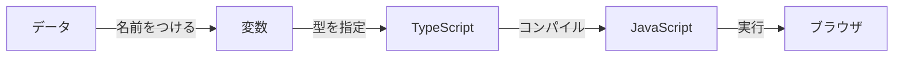
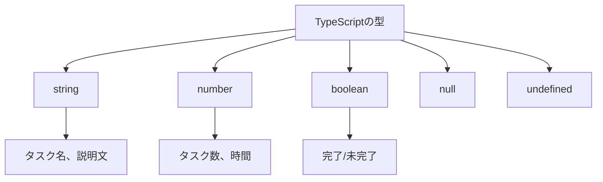
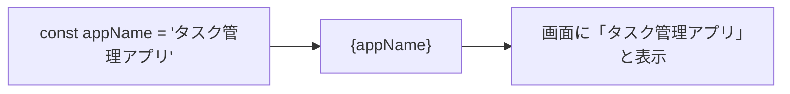
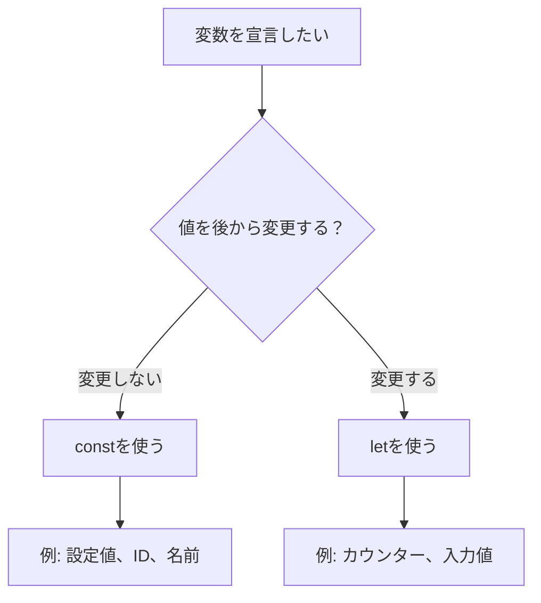

# Day 02: データに名札をつけて管理しよう

## このDayについて

| 項目 | 内容 |
|------|------|
| 所要時間 | 60〜90分 |
| 前提知識 | Day01完了（開発環境が動作していること） |
| 使用ツール | VS Code、ターミナル、ブラウザ |
| 学習形式 | コードを読む → 書き換える → 動作確認 |

### このDayでやること（3つ）

1. **変数の基本を理解する** - `const`と`let`の違いを学び、データに名前をつける方法を習得する
2. **TypeScriptの型を学ぶ** - 文字列、数値、真偽値などの基本的な型を理解する
3. **実際のコードを読む** - task-appで使われている変数と型の実例を確認する

### 完了条件（これができたらDay02は完了）

- [ ] `const`と`let`の違いを説明できる
- [ ] 基本的な型（string, number, boolean）が何かわかる
- [ ] 実際のコードで型エラーを修正できる
- [ ] 自分で変数を宣言して使うことができる

### 詰まった時の戻り先

| 症状 | 戻るStep | 確認事項 |
|------|---------|----------|
| 開発サーバーが起動しない | Day01 Step7 | `npm run dev` が動作するか |
| 型エラーの意味がわからない | Step 4 | 型の基本を再確認 |
| constとletの使い分けがわからない | Step 2 | 再代入の可否を確認 |

---

## Step一覧

| Step | タイトル | 目安時間 | 触るファイル | 成功状態 |
|------|---------|---------|-------------|---------|
| 1 | 変数とは何かを理解する | 5分 | なし | 変数の役割を説明できる |
| 2 | constとletの違いを知る | 7分 | なし | 使い分けができる |
| 3 | 基本的な型を学ぶ | 7分 | なし | 5つの型を言える |
| 4 | 型注釈の書き方を覚える | 5分 | なし | 型注釈が書ける |
| 5 | 実際のコードを読む（type/） | 7分 | src/type/user.ts | 型定義が理解できる |
| 6 | 実際のコードを読む（constant/） | 7分 | src/lib/constant/status.ts | 定数の使い方がわかる |
| 7 | 変数を使ったコードを書く | 10分 | src/app/page.tsx | 変数が画面に表示される |
| 8 | 型エラーを体験・修正する | 7分 | src/app/page.tsx | エラーを自力で直せる |

---

## 今日学ぶこと

| 項目 | 説明 | 例え話 |
|------|------|--------|
| 変数（へんすう） | データを入れる「箱」 | 引き出しに名前シールを貼る |
| const | 中身を変えられない箱 | 鍵付きの金庫 |
| let | 中身を入れ替えられる箱 | 普通の引き出し |
| 型（かた） | 箱に入れられるものの種類 | 「文房具」「おやつ」のラベル |



---

## Step 1: 変数とは何かを理解する（5分）

### 目的

変数（へんすう）とは、プログラムでデータを保存しておく「箱」のことです。引き出しに「文房具」「おやつ」と名前シールを貼るように、データに名前をつけて管理します。

### なぜ変数が必要なのか

| 変数なし | 変数あり |
|---------|---------|
| 毎回同じ値を書く | 一度書いて使い回す |
| 値を変えたい時に全部書き換え | 変数の中身だけ変える |
| 何の値かわからない | 名前で意味がわかる |

### 変数のイメージ

```
┌─────────────────┐
│  userName       │  ← 箱の名前（変数名）
│  ┌───────────┐  │
│  │ "田中"    │  │  ← 箱の中身（値）
│  └───────────┘  │
└─────────────────┘
```

変数を使うと「田中」という文字列に`userName`という名前がつきます。プログラムの中で「ユーザー名」と言いたい時は、`userName`と書けば良いのです。

確認ポイント:
- 変数が「データに名前をつける箱」だとイメージできた
- 変数があると便利な理由がわかった

---

## Step 2: constとletの違いを知る（7分）

### 目的

JavaScriptには変数を宣言する方法が2つあります。`const`（コンスト）と`let`（レット）です。

### 2つの違い

| 宣言 | 再代入 | 使う場面 | イメージ |
|------|--------|---------|---------|
| const | できない | 変わらない値 | 鍵付きの金庫 |
| let | できる | 変わる値 | 普通の引き出し |

### constの例

```typescript
// filepath: 説明用サンプル（実行不要）
// constは一度入れたら変えられない
const appName = "タスク管理アプリ";

// これはエラーになる！
// appName = "別のアプリ"; // Error: Cannot assign to 'appName'
```

確認ポイント:
- constで宣言した変数は再代入できないことがわかった
- 変わらない値にはconstを使うことがわかった

### letの例

```typescript
// filepath: 説明用サンプル（実行不要）
// letは後から変えられる
let taskCount = 0;

// これはOK！
taskCount = 1;
taskCount = 2;
```

確認ポイント:
- letで宣言した変数は再代入できることがわかった
- 変わる値にはletを使うことがわかった

### 使い分けの基本ルール

**まずconstを使う。変更が必要な時だけletを使う。**

| 場面 | 使う宣言 | 理由 |
|------|---------|------|
| 設定値・定数 | const | 変わるべきでない |
| ループのカウンター | let | 増減するから |
| ユーザー入力値 | let | 書き換わるから |
| APIレスポンス保存 | const | 取得後は変わらない |

確認ポイント:
- 「まずconst、必要ならlet」のルールを理解した

---

## Step 3: 基本的な型を学ぶ（7分）

### 目的

TypeScript（タイプスクリプト）は、変数にどんな種類のデータが入るか「型」で指定できます。箱に「文房具専用」「おやつ専用」とラベルを貼るようなものです。

### なぜ型が必要なのか

| 型なし（JavaScript） | 型あり（TypeScript） |
|---------------------|---------------------|
| 文字列に数値計算してもエラーにならない | 事前にエラーがわかる |
| 実行してみないと間違いに気づかない | コードを書いた瞬間にわかる |
| バグの原因を探しにくい | バグを未然に防げる |

### 基本の5つの型

| 型名 | 意味 | 例 |
|------|------|-----|
| string | 文字列 | "こんにちは"、"タスク" |
| number | 数値 | 42、3.14、-10 |
| boolean | 真偽値（はい/いいえ） | true、false |
| null | 値が「ない」 | null |
| undefined | 値が「未定義」 | undefined |



### 具体例

```typescript
// filepath: 説明用サンプル（実行不要）
// 文字列型（string）：テキストを扱う
const taskTitle = "買い物リストを作る";

// 数値型（number）：計算に使う数字
const estimatedHours = 2.5;

// 真偽値型（boolean）：はい/いいえの2択
const isCompleted = false;
```

確認ポイント:
- string、number、booleanの3つの型が言える
- それぞれどんなデータに使うかイメージできた

---

## Step 4: 型注釈の書き方を覚える（5分）

### 目的

TypeScriptでは、変数に「この型のデータが入ります」と明示的に書くことができます。これを「型注釈（かたちゅうしゃく）」と呼びます。

### 型注釈の書き方

```
変数名: 型 = 値;
```

コロン（`:`）の後に型を書きます。

### 具体例

```typescript
// filepath: 説明用サンプル（実行不要）
// 型注釈あり：「この変数にはstringが入る」と明示
const userName: string = "田中太郎";
const age: number = 25;
const isAdmin: boolean = true;
```

確認ポイント:
- 型注釈の書き方「変数名: 型 = 値」を理解した
- コロンの後に型を書くことがわかった

### 型推論について

TypeScriptは賢いので、値から型を推測してくれます。これを「型推論（かたすいろん）」と呼びます。

```typescript
// filepath: 説明用サンプル（実行不要）
// 型注釈なし：TypeScriptが自動で型を推測
const taskCount = 5; // number型と推測される
const projectName = "Webサイト制作"; // string型と推測される
```

### 型注釈と型推論の使い分け

| 場面 | 推奨 | 理由 |
|------|------|------|
| 初期値が明確 | 型推論でOK | 冗長な記述を避ける |
| 関数の引数 | 型注釈を書く | 何を渡すべきか明確にする |
| 複雑なオブジェクト | 型注釈を書く | 構造を明示する |

確認ポイント:
- 型推論があるため、常に型注釈を書く必要はないことがわかった

---

## Step 5: 実際のコードを読む（type/）（7分）

### 目的

task-appの`src/type/`フォルダには、プロジェクト全体で使う型が定義されています。実際のコードを見て、型がどう使われているか確認しましょう。

### 操作手順

VS Codeで`src/type/user.ts`を開いてください。

```typescript
// filepath: src/type/user.ts（抜粋）
// ユーザーの役割を表す型（2種類のどちらか）
export type UserRole = 'USER' | 'ADMIN';

// ユーザー選択時の情報を表す型
export type UserSelectInfo = {
  id: string;        // ユーザーID（文字列）
  name: string | null; // 名前（文字列または未設定）
  email: string;     // メールアドレス（文字列）
  avatar: string | null; // アバター画像URL（文字列または未設定）
};
```

確認ポイント:
- `src/type/user.ts`ファイルを開けた
- 型定義の書き方が確認できた

### コードの読み方

| 記号 | 意味 | 例 |
|------|------|-----|
| `type` | 型を定義する | `type UserRole = ...` |
| `\|` | または（OR） | `'USER' \| 'ADMIN'` |
| `string \| null` | 文字列か空 | 名前が未設定の場合に対応 |
| `export` | 他ファイルで使える | 共有する型に付ける |

### なぜ型を別ファイルにまとめるのか

| 方法 | メリット | デメリット |
|------|---------|-----------|
| 各ファイルに直接書く | その場でわかる | 同じ定義が散らばる |
| type/にまとめる | 一箇所で管理 | ファイルを開く手間 |

task-appでは「type/にまとめる」方式を採用しています。型を変更する時、1箇所を直せば全体に反映されます。

確認ポイント:
- `|`が「または」を意味することがわかった
- 型を別ファイルにまとめる理由がわかった

---

## Step 6: 実際のコードを読む（constant/）（7分）

### 目的

`src/lib/constant/`フォルダには、アプリ全体で使う定数が定義されています。`const`と型がどう組み合わさっているか見てみましょう。

### 操作手順

VS Codeで`src/lib/constant/status.ts`を開いてください。

```typescript
// filepath: src/lib/constant/status.ts（抜粋）
// タスクのステータスを定義するオブジェクト
export const TASK_STATUS = {
  TODO: 'TODO',           // 未着手
  IN_PROGRESS: 'IN_PROGRESS', // 進行中
  DONE: 'DONE',           // 完了
} as const;

// ステータスに対応する日本語ラベル
export const TASK_STATUS_LABELS: Record<TaskStatus, string> = {
  TODO: 'To Do',
  IN_PROGRESS: 'In Progress',
  DONE: 'Done',
};
```

確認ポイント:
- `src/lib/constant/status.ts`ファイルを開けた
- 定数オブジェクトの書き方が確認できた

### as constとは

| 書き方 | 型 | 意味 |
|--------|-----|------|
| `{ TODO: 'TODO' }` | `{ TODO: string }` | 中身はなんでもstring |
| `{ TODO: 'TODO' } as const` | `{ TODO: 'TODO' }` | 中身は'TODO'固定 |

`as const`をつけると、オブジェクトの中身が「書き換え不可」になります。定数として扱いたい時に使います。

### Recordとは

`Record<キー型, 値型>`は「キーと値の対応表」を表す型です。

```typescript
// filepath: 説明用サンプル（実行不要）
// TaskStatus型をキー、string型を値とする対応表
type TaskStatus = 'TODO' | 'IN_PROGRESS' | 'DONE';

const labels: Record<TaskStatus, string> = {
  TODO: '未着手',
  IN_PROGRESS: '作業中',
  DONE: '完了',
};
```

確認ポイント:
- `as const`が値を固定することがわかった
- `Record`が対応表を表すことがわかった

---

## Step 7: 変数を使ったコードを書く（10分）

### 目的

実際に変数を宣言して、画面に表示してみましょう。トップページに自分の情報を表示するコードを追加します。

### 操作手順

開発サーバーが起動していることを確認してください。

```bash
# filepath: ターミナル
# 開発サーバーを起動（まだ起動していない場合）
npm run dev
```

確認ポイント:
- ターミナルに「Ready」と表示されている
- ブラウザで http://localhost:3000 が開ける

### コードを編集する

VS Codeで`src/app/page.tsx`を開いてください。ファイルの中身を確認したら、以下のように編集します。

```typescript
// filepath: src/app/page.tsx
// トップページのコンポーネント
export default function Home() {
  // 変数を宣言する（const = 変更しない値）
  const appName: string = "タスク管理アプリ";
  const version: number = 1.0;
  const isProduction: boolean = false;

  // 画面に表示する
  return (
    <div style={{ padding: '20px' }}>
      <h1>{appName}</h1>
      <p>バージョン: {version}</p>
      <p>本番環境: {isProduction ? 'はい' : 'いいえ'}</p>
    </div>
  );
}
```

確認ポイント:
- ファイルを保存した（Ctrl+S / Cmd+S）
- ターミナルにエラーが出ていない
- ブラウザに「タスク管理アプリ」「バージョン: 1」と表示される

【スクリーンショット: 変数の値が画面に表示された状態】

### コードの解説

| 部分 | 意味 |
|------|------|
| `const appName: string` | string型の変数appNameを宣言 |
| `{appName}` | 変数の中身を画面に表示（JSX記法） |
| `{isProduction ? 'はい' : 'いいえ'}` | 三項演算子（trueなら'はい'、falseなら'いいえ'） |



---

## Step 8: 型エラーを体験・修正する（7分）

### 目的

わざと型が合わないコードを書いて、TypeScriptのエラーを体験します。エラーメッセージを読んで修正する練習をしましょう。

### エラーを起こしてみる

Step 7で編集した`src/app/page.tsx`を、以下のように変更してください。

```typescript
// filepath: src/app/page.tsx
export default function Home() {
  // わざと型が合わない値を入れる
  const appName: string = "タスク管理アプリ";
  const version: number = "1.0"; // ← 型エラー！
  const isProduction: boolean = false;

  return (
    <div style={{ padding: '20px' }}>
      <h1>{appName}</h1>
      <p>バージョン: {version}</p>
      <p>本番環境: {isProduction ? 'はい' : 'いいえ'}</p>
    </div>
  );
}
```

確認ポイント:
- `"1.0"`の部分に赤い波線が表示される
- VS Codeのエラーメッセージが確認できる

### エラーメッセージを読む

VS Codeで赤い波線の上にマウスを置くと、エラーメッセージが表示されます。

```
Type 'string' is not assignable to type 'number'.
（string型をnumber型に代入することはできません）
```

| エラーの意味 | 対処法 |
|-------------|--------|
| numberと書いたのにstringを入れた | 型か値を修正する |

### エラーを修正する

型に合った値に修正してください。

```typescript
// filepath: src/app/page.tsx
export default function Home() {
  const appName: string = "タスク管理アプリ";
  const version: number = 1.0; // ← 修正：文字列→数値に変更
  const isProduction: boolean = false;

  return (
    <div style={{ padding: '20px' }}>
      <h1>{appName}</h1>
      <p>バージョン: {version}</p>
      <p>本番環境: {isProduction ? 'はい' : 'いいえ'}</p>
    </div>
  );
}
```

確認ポイント:
- 赤い波線が消えた
- ターミナルにエラーが出ていない
- ブラウザが正常に表示される

### 型エラーから学ぶこと

| TypeScriptのメリット | 説明 |
|---------------------|------|
| 実行前にミスがわかる | ブラウザで確認する前にエラー発見 |
| エラー箇所が明確 | 赤い波線で場所がわかる |
| 修正方法のヒント | エラーメッセージに原因が書いてある |

【スクリーンショット: 型エラーが表示されたVS Code画面】

---

## よくある型エラーと解決法

初心者がつまずきやすい型エラーと、その解決方法をまとめました。

| エラー番号 | エラー内容 | 主な原因 |
|-----------|-----------|---------|
| 1 | Type 'X' is not assignable to type 'Y' | 型が一致しない |
| 2 | Object is possibly 'undefined' | nullチェックが必要 |
| 3 | Property 'X' does not exist | プロパティ名のタイプミス |

---

### エラー1: Type 'X' is not assignable to type 'Y'

```typescript
// filepath: 説明用サンプル
// エラー例
const count: number = "five"; // string型をnumber型に入れようとした
```

| 原因 | 解決策 |
|------|--------|
| 型と値が一致しない | 値を正しい型に変える |
| 型注釈が間違っている | 型注釈を修正する |

```typescript
// filepath: 説明用サンプル
// 解決例
const count: number = 5; // 数値を入れる
```

---

### エラー2: Object is possibly 'undefined'

```typescript
// filepath: 説明用サンプル
// エラー例
const user = { name: "田中" };
console.log(user.age.toString()); // ageが存在しない
```

| 原因 | 解決策 |
|------|--------|
| 存在しないプロパティにアクセス | オプショナルチェイニングを使う |
| null/undefinedの可能性 | 条件分岐でチェックする |

```typescript
// filepath: 説明用サンプル
// 解決例：オプショナルチェイニング（?.）を使う
const user = { name: "田中" };
console.log(user.age?.toString()); // ageがなければundefined
```

---

### エラー3: Property 'X' does not exist

```typescript
// filepath: 説明用サンプル
// エラー例
const task = { title: "買い物" };
console.log(task.name); // nameではなくtitle
```

| 原因 | 解決策 |
|------|--------|
| プロパティ名のスペルミス | 正しい名前を確認する |
| 存在しないプロパティ | 型定義を確認する |

```typescript
// filepath: 説明用サンプル
// 解決例
const task = { title: "買い物" };
console.log(task.title); // 正しいプロパティ名を使う
```

【スクリーンショット: VS Codeで型エラーを修正した後の状態】

---

## 今日のまとめ

今日は変数と型の基本を学び、実際のコードで使い方を確認しました。

### 学んだ概念一覧

| 概念 | 説明 |
|------|------|
| 変数 | データに名前をつける箱 |
| const | 再代入できない変数宣言 |
| let | 再代入できる変数宣言 |
| 型 | 変数に入れられるデータの種類 |
| 型注釈 | 変数に型を明示する書き方 |
| 型推論 | TypeScriptが型を自動推測 |

### 基本の5つの型

| 型名 | 説明 | 例 |
|------|------|-----|
| string | 文字列 | "タスク" |
| number | 数値 | 42 |
| boolean | 真偽値 | true/false |
| null | 値がない | null |
| undefined | 未定義 | undefined |

### 作成・変更したファイル

| ファイル | 操作 |
|----------|------|
| src/app/page.tsx | 変数を使った表示を追加 |

### 明日の予告

明日は、GitHubにコードを保存する方法を学びます。Gitの基本操作（add、commit、push）を使って、自分の変更をオンラインに保存しましょう。

---

## 付録: 型チェックリスト

| 項目 | 確認 |
|------|------|
| constとletの違いを説明できる | □ |
| string型の変数を宣言できる | □ |
| number型の変数を宣言できる | □ |
| boolean型の変数を宣言できる | □ |
| 型エラーのメッセージが読める | □ |
| 型エラーを自分で修正できる | □ |
| src/type/user.tsの型定義が読める | □ |
| src/lib/constant/status.tsの定数が読める | □ |

## 付録: constとlet判断チャート


