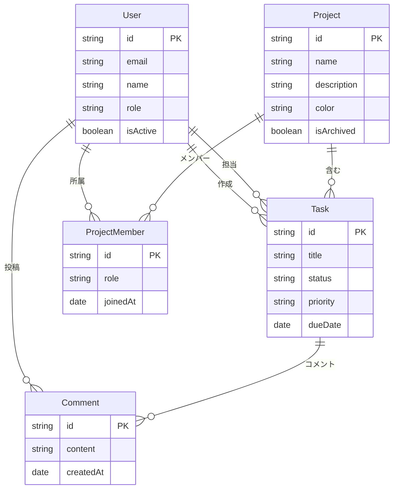

# Day 09: プロジェクト一覧画面を作ろう

## 🎯 今日のゴール

プロジェクトの一覧を表示する画面を作ります。カード形式でプロジェクトを表示し、クリックで詳細ページに遷移できるようにします。

【スクリーンショット: プロジェクト一覧画面】

## 🤔 なぜこれを作るのか？

タスク管理アプリの基本となるプロジェクト一覧画面です。複数のプロジェクトを視覚的に整理して表示することで、ユーザーは自分が関わっているプロジェクトを一目で把握できます。

> 💡 **例え話**: プロジェクト一覧は本棚のようなものです。本棚に本が整理されていれば、読みたい本をすぐに見つけられます。同様に、プロジェクトが一覧で表示されていれば、作業したいプロジェクトにすぐアクセスできます。

### 📐 データベース構造図（ER図）



この図は、User（ユーザー）、Project（プロジェクト）、Task（タスク）、Comment（コメント）の関係を示しています。

## 📊 実装ステップ一覧

| ステップ | 作業内容 | 所要時間 |
|---------|---------|---------|
| Step 1 | プロジェクト一覧ページ作成 | 10分 |
| Step 2 | tRPC APIで取得 | 15分 |
| Step 3 | カード表示 | 15分 |
| Step 4 | レイアウト調整 | 10分 |

**合計時間**: 約50分

---

### Step 1: プロジェクト一覧ページ作成（10分）

💻 **実装**:

```typescript
// filepath: src/app/projects/page.tsx
'use client';

import { Box, Typography } from '@mui/material';

export default function ProjectsPage() {
  return (
    <Box>
      <Typography variant="h4">プロジェクト一覧</Typography>
    </Box>
  );
}
```

✅ **確認ポイント**: /projectsにアクセスして「プロジェクト一覧」が表示される

【スクリーンショット: 確認画面】

---

### Step 2: tRPC APIで取得（15分）

💻 **実装**:

```typescript
// filepath: src/app/projects/page.tsx
import { api } from '@/trpc/react';

export default function ProjectsPage() {
  const { data: projects, isLoading } = api.project.getAll.useQuery();

  if (isLoading) {
    return <Typography>読み込み中...</Typography>;
  }

  return (
    <Box>
      <Typography variant="h4">プロジェクト一覧</Typography>
      {projects?.map((project) => (
        <div key={project.id}>{project.name}</div>
      ))}
    </Box>
  );
}
```

✅ **確認ポイント**: プロジェクト名が一覧表示される

【スクリーンショット: 確認画面】

---

### Step 3: カード表示（15分）

💻 **実装**:

```typescript
// filepath: src/app/projects/page.tsx
import { Card, CardContent, CardActionArea } from '@mui/material';
import Link from 'next/link';

export default function ProjectsPage() {
  return (
    <Box>
      {projects?.map((project) => (
        <Card key={project.id} sx={{ mb: 2 }}>
          <CardActionArea component={Link} href={`/projects/${project.id}`}>
            <CardContent>
              <Typography variant="h6">{project.name}</Typography>
              <Typography variant="body2" color="text.secondary">
                {project.description}
              </Typography>
            </CardContent>
          </CardActionArea>
        </Card>
      ))}
    </Box>
  );
}
```

✅ **確認ポイント**: プロジェクトがカード形式で表示される

【スクリーンショット: 確認画面】

---

## 📋 今日のまとめ

- [ ] プロジェクト一覧ページを作成できた
- [ ] tRPCでデータを取得できた
- [ ] カード形式で表示できた

## 🔗 次回予告

Day 10では、プロジェクト新規作成機能を実装します。
