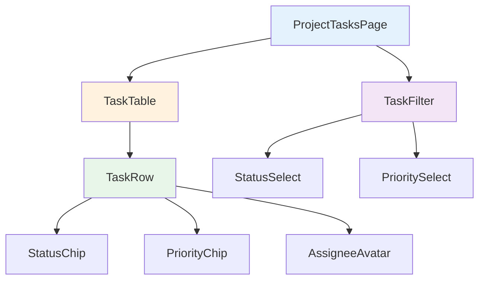

# Day 13: タスク一覧画面を作ろう

## 🎯 今日のゴール

プロジェクト内のタスクを一覧表示する画面を作ります。テーブル形式で表示し、ステータスや優先度でフィルタできるようにします。

【スクリーンショット: タスク一覧画面】

## 🤔 なぜこれを作るのか?

タスク管理アプリの核となる機能です。**タスク一覧は図書館の本棚のようなもの**。本棚があれば、どこに何の本があるか一目でわかり、探している本をすぐに見つけられます。同様に、タスク一覧があれば、プロジェクトの全タスクを俯瞰でき、今何をすべきかが明確になります。

### 📐 コンポーネント階層図



この図は、タスク一覧画面のコンポーネント構成を示しています。ページ（ProjectTasksPage）がフィルター（TaskFilter）とテーブル（TaskTable）を含み、テーブルが個々のタスク行（TaskRow）を含む階層構造になっています。

## 📊 実装ステップ一覧

| ステップ | 作業内容 | 所要時間 |
|---------|---------|---------|
| Step 1 | タスク一覧ページ作成 | 10分 |
| Step 2 | tRPCでタスク取得 | 15分 |
| Step 3 | テーブル表示 | 20分 |
| Step 4 | ステータスフィルタ | 15分 |

**合計時間**: 約60分

---

### Step 1: タスク一覧ページ作成（10分）

💻 **実装**:

```typescript
// filepath: src/app/projects/[id]/tasks/page.tsx
'use client';

import { useParams } from 'next/navigation';
import { Box, Typography } from '@mui/material';

export default function ProjectTasksPage() {
  const params = useParams();
  const projectId = params.id as string;

  return (
    <Box sx={{ p: 3 }}>
      <Typography variant="h4">タスク一覧</Typography>
    </Box>
  );
}
```

✅ **確認ポイント**: /projects/[id]/tasksにアクセスして「タスク一覧」が表示される

【スクリーンショット: 確認画面】

---

### Step 2: tRPCでタスク取得（15分）

💻 **実装**:

```typescript
// filepath: src/app/projects/[id]/tasks/page.tsx（パート1/2）
import { api } from '@/trpc/react';
import { CircularProgress } from '@mui/material';

export default function ProjectTasksPage() {
  const params = useParams();
  const projectId = params.id as string;

  const { data: tasks, isLoading } = api.task.getByProject.useQuery({
    projectId,
  });

  if (isLoading) {
    return (
      <Box sx={{ display: 'flex', justifyContent: 'center', p: 3 }}>
        <CircularProgress />
      </Box>
    );
  }

  return (
    <Box sx={{ p: 3 }}>
      <Typography variant="h4">タスク一覧</Typography>
      <Typography>タスク数: {tasks?.length}</Typography>
```

```typescript
// filepath: src/app/projects/[id]/tasks/page.tsx（パート2/2）
    </Box>
  );
}
```

✅ **確認ポイント**: タスク数が表示される

【スクリーンショット: 確認画面】

---

### Step 3: テーブル表示（20分）

💻 **実装**:

```typescript
// filepath: src/app/projects/[id]/tasks/page.tsx（パート1/3）
import {
  Table,
  TableBody,
  TableCell,
  TableContainer,
  TableHead,
  TableRow,
  Paper,
  Chip,
} from '@mui/material';

const statusColors = {
  TODO: 'default',
  IN_PROGRESS: 'primary',
  IN_REVIEW: 'warning',
  DONE: 'success',
};

export default function ProjectTasksPage() {
  // ...取得処理

  return (
    <Box sx={{ p: 3 }}>
```

```typescript
// filepath: src/app/projects/[id]/tasks/page.tsx（パート2/3）
      <Typography variant="h4" sx={{ mb: 3 }}>タスク一覧</Typography>
      <TableContainer component={Paper}>
        <Table>
          <TableHead>
            <TableRow>
              <TableCell>タイトル</TableCell>
              <TableCell>ステータス</TableCell>
              <TableCell>優先度</TableCell>
              <TableCell>担当者</TableCell>
              <TableCell>期限</TableCell>
            </TableRow>
          </TableHead>
          <TableBody>
            {tasks?.map((task) => (
              <TableRow key={task.id}>
                <TableCell>{task.title}</TableCell>
                <TableCell>
                  <Chip
                    label={task.status}
                    color={statusColors[task.status]}
                    size="small"
                  />
                </TableCell>
```

```typescript
// filepath: src/app/projects/[id]/tasks/page.tsx（パート3/3）
                <TableCell>{task.priority}</TableCell>
                <TableCell>{task.assignee?.name || '未割当'}</TableCell>
                <TableCell>
                  {task.dueDate
                    ? new Date(task.dueDate).toLocaleDateString('ja-JP')
                    : '-'}
                </TableCell>
              </TableRow>
            ))}
          </TableBody>
        </Table>
      </TableContainer>
    </Box>
  );
}
```

✅ **確認ポイント**: タスクがテーブル形式で表示される

【スクリーンショット: 確認画面】

---

### Step 4: ステータスフィルタ（15分）

💻 **実装**:

```typescript
// filepath: src/app/projects/[id]/tasks/page.tsx（パート1/2）
import { useState } from 'react';
import { ToggleButton, ToggleButtonGroup } from '@mui/material';

export default function ProjectTasksPage() {
  const [statusFilter, setStatusFilter] = useState<string | null>(null);

  const filteredTasks = tasks?.filter(
    (task) => !statusFilter || task.status === statusFilter
  );

  return (
    <Box sx={{ p: 3 }}>
      <Typography variant="h4" sx={{ mb: 3 }}>タスク一覧</Typography>

      <ToggleButtonGroup
        value={statusFilter}
        exclusive
        onChange={(e, value) => setStatusFilter(value)}
        sx={{ mb: 2 }}
      >
        <ToggleButton value={null}>すべて</ToggleButton>
        <ToggleButton value="TODO">TODO</ToggleButton>
        <ToggleButton value="IN_PROGRESS">進行中</ToggleButton>
```

```typescript
// filepath: src/app/projects/[id]/tasks/page.tsx（パート2/2）
        <ToggleButton value="DONE">完了</ToggleButton>
      </ToggleButtonGroup>

      <TableContainer component={Paper}>
        {/* テーブル内容は同じ、filteredTasksを使用 */}
      </TableContainer>
    </Box>
  );
}
```

✅ **確認ポイント**: フィルタボタンでタスクが絞り込まれる

【スクリーンショット: 確認画面】

---

## 📝 学んだこと

- **MUI Table**: テーブル表示の基本構造（TableContainer, Table, TableHead, TableBody）
- **Chip コンポーネント**: ステータス表示に適したUIパーツ
- **配列フィルタリング**: filter()で条件に合うデータを絞り込む
- **日付フォーマット**: toLocaleDateString()で日本語表示
- **ToggleButtonGroup**: 複数の選択肢から1つを選ぶUI

## 📋 今日のまとめ

- [ ] タスク一覧ページを作成できた
- [ ] tRPCでタスクを取得できた
- [ ] テーブル形式で表示できた
- [ ] ステータスフィルタを実装できた

## ⚠️ つまずきポイント

| 問題 | 原因 | 解決策 |
|------|------|--------|
| タスクが表示されない | tRPCのクエリが失敗 | ブラウザのコンソールでエラー確認 |
| 日付が変な形式 | toLocaleDateString()のロケール未指定 | 'ja-JP'を引数に渡す |
| フィルタが効かない | statusFilterの型がstring \| null | 条件式で`!statusFilter`をチェック |

## 🔗 次回予告

Day 14では、タスクの新規作成機能を実装します。
