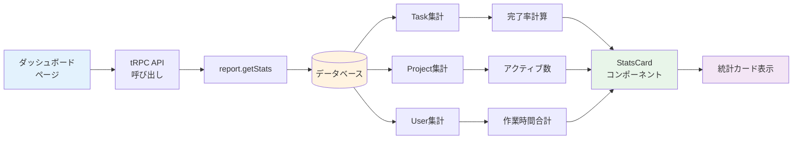

# Day 21: 統計カードを表示しよう

## 🎯 今日のゴール

ダッシュボードに統計情報を表示するカードを実装します。タスク総数、完了率、進行中タスク数などを一目で確認できるようにします。

【スクリーンショット: 統計カード4枚】

## 🤔 なぜこれを作るのか?

プロジェクトの全体像を把握するための機能です。**ダッシュボードは車の計器盤のようなもの**。速度計や燃料計を見れば、今の状態がすぐわかります。それと同じく、統計カードを見れば、プロジェクトの進捗状況が一目で把握できます。

### 📐 ダッシュボードデータフロー図



この図は、ダッシュボードでデータを取得してから統計カードに表示するまでの流れを示しています。

## 📊 実装ステップ一覧

| ステップ | 作業内容 | 所要時間 |
|---------|---------|---------|
| Step 1 | 統計カードコンポーネント作成 | 15分 |
| Step 2 | 統計データ取得API | 15分 |
| Step 3 | カード4種類を配置 | 15分 |
| Step 4 | レスポンシブ対応 | 10分 |

**合計時間**: 約55分

---

### Step 1: 統計カードコンポーネント作成（15分）

💻 **実装**:

```typescript
// filepath: src/components/dashboard/StatsCard.tsx（パート1/2）
'use client';

import { Card, CardContent, Typography, Box } from '@mui/material';

interface StatsCardProps {
  title: string;
  value: string | number;
  icon: React.ReactNode;
  color: string;
}

export function StatsCard({ title, value, icon, color }: StatsCardProps) {
  return (
    <Card sx={{ height: '100%' }}>
      <CardContent>
        <Box sx={{ display: 'flex', justifyContent: 'space-between' }}>
          <Box>
            <Typography variant="body2" color="text.secondary">
              {title}
            </Typography>
            <Typography variant="h4" sx={{ mt: 1 }}>
              {value}
            </Typography>
```

```typescript
// filepath: src/components/dashboard/StatsCard.tsx（パート2/2）
          </Box>
          <Box
            sx={{
              width: 60,
              height: 60,
              borderRadius: '50%',
              bgcolor: color,
              display: 'flex',
              alignItems: 'center',
              justifyContent: 'center',
              color: 'white',
            }}
          >
            {icon}
          </Box>
        </Box>
      </CardContent>
    </Card>
  );
}
```

✅ **確認ポイント**: カードコンポーネントが作成される

【スクリーンショット: 確認画面】

---

### Step 2: 統計データ取得API（15分）

💻 **実装**:

```typescript
// filepath: src/app/dashboard/page.tsx
'use client';

import { api } from '@/trpc/react';
import { Box, Typography, Grid, CircularProgress } from '@mui/material';

export default function DashboardPage() {
  const { data: stats, isLoading } = api.report.getStats.useQuery();

  if (isLoading) {
    return (
      <Box sx={{ display: 'flex', justifyContent: 'center', p: 3 }}>
        <CircularProgress />
      </Box>
    );
  }

  return (
    <Box sx={{ p: 3 }}>
      <Typography variant="h4" sx={{ mb: 3 }}>ダッシュボード</Typography>
      <Typography>統計データ: {JSON.stringify(stats)}</Typography>
    </Box>
  );
}
```

✅ **確認ポイント**: 統計データが取得できる

【スクリーンショット: 確認画面】

---

### Step 3: カード4種類を配置（15分）

💻 **実装**:

```typescript
// filepath: src/app/dashboard/page.tsx（パート1/3）
import { StatsCard } from '@/components/dashboard/StatsCard';
import AssignmentIcon from '@mui/icons-material/Assignment';
import CheckCircleIcon from '@mui/icons-material/CheckCircle';
import HourglassEmptyIcon from '@mui/icons-material/HourglassEmpty';
import TrendingUpIcon from '@mui/icons-material/TrendingUp';

export default function DashboardPage() {
  const { data: stats } = api.report.getStats.useQuery();

  return (
    <Box sx={{ p: 3 }}>
      <Typography variant="h4" sx={{ mb: 3 }}>ダッシュボード</Typography>

      <Grid container spacing={3}>
        <Grid item xs={12} sm={6} md={3}>
          <StatsCard
            title="総タスク数"
            value={stats?.totalTasks ?? 0}
            icon={<AssignmentIcon fontSize="large" />}
            color="#1976d2"
          />
        </Grid>

```

```typescript
// filepath: src/app/dashboard/page.tsx（パート2/3）
        <Grid item xs={12} sm={6} md={3}>
          <StatsCard
            title="完了タスク"
            value={stats?.completedTasks ?? 0}
            icon={<CheckCircleIcon fontSize="large" />}
            color="#2e7d32"
          />
        </Grid>

        <Grid item xs={12} sm={6} md={3}>
          <StatsCard
            title="進行中"
            value={stats?.inProgressTasks ?? 0}
            icon={<HourglassEmptyIcon fontSize="large" />}
            color="#ed6c02"
          />
        </Grid>

        <Grid item xs={12} sm={6} md={3}>
          <StatsCard
            title="完了率"
            value={`${stats?.completionRate ?? 0}%`}
            icon={<TrendingUpIcon fontSize="large" />}
```

```typescript
// filepath: src/app/dashboard/page.tsx（パート3/3）
            color="#9c27b0"
          />
        </Grid>
      </Grid>
    </Box>
  );
}
```

✅ **確認ポイント**: 4枚のカードが横並びで表示される

【スクリーンショット: 確認画面】

---

### Step 4: レスポンシブ対応（10分）

💻 **実装**:

```typescript
// filepath: src/app/dashboard/page.tsx
export default function DashboardPage() {
  return (
    <Box sx={{ p: 3 }}>
      <Typography variant="h4" sx={{ mb: 3 }}>ダッシュボード</Typography>

      <Grid container spacing={3}>
        <Grid item xs={12} sm={6} md={3}>
          <StatsCard
            title="総タスク数"
            value={stats?.totalTasks ?? 0}
            icon={<AssignmentIcon fontSize="large" />}
            color="#1976d2"
          />
        </Grid>
        {/* 他のカードも同様 */}
      </Grid>
    </Box>
  );
}
```

📱 **ブレークポイント**:
- xs (モバイル): 1列
- sm (タブレット): 2列
- md 以上 (PC): 4列

✅ **確認ポイント**: 画面幅に応じてカードの列数が変わる

【スクリーンショット: 確認画面】

---

## 📝 学んだこと

- **Grid システム**: MUIのレスポンシブレイアウト
- **xs, sm, md プロパティ**: ブレークポイントごとの列数指定
- **Nullish coalescing (??)**:  undefined/null の場合のデフォルト値
- **MUI Icons**: @mui/icons-material のアイコン使用
- **borderRadius: '50%'**: 円形のアイコン背景

## 📋 今日のまとめ

- [ ] 統計カードコンポーネントを作成できた
- [ ] 統計データ取得APIを呼び出せた
- [ ] 4種類のカードを配置できた
- [ ] レスポンシブ対応できた

## ⚠️ つまずきポイント

| 問題 | 原因 | 解決策 |
|------|------|--------|
| カードの高さがバラバラ | height 指定がない | Card に height: '100%' を追加 |
| モバイルで崩れる | Grid の xs 指定がない | xs={12} を追加 |
| データが undefined でエラー | stats が null の可能性 | stats?.totalTasks ?? 0 で安全にアクセス |

## 🔗 次回予告

Day 22では、グラフを表示して進捗を可視化します。
