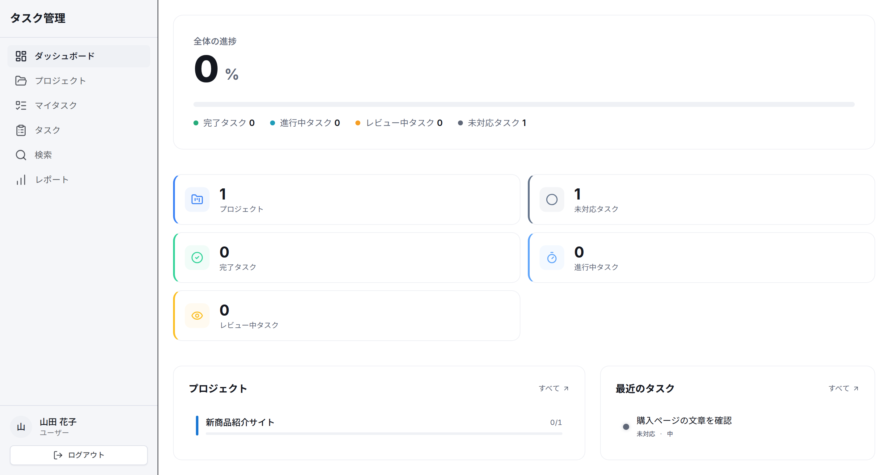
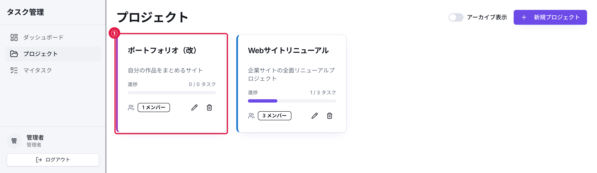
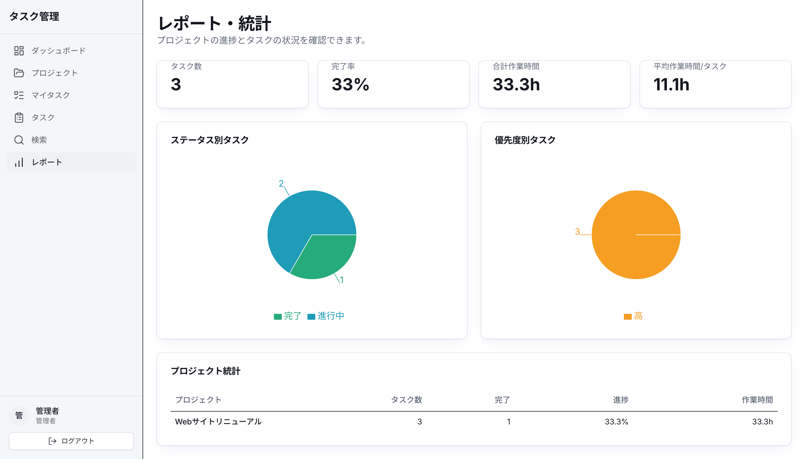

# さらなる学習のために

30日間のカリキュラムお疲れさまでした。次に取り組む機能や学習テーマの候補を紹介します。







---

## レベル1: Task-Appを拡張する

まずはこのカリキュラムで作ったTask-Appに新機能を追加してみましょう。本編で書いたコードを使いながら取り組めます。

### おすすめの拡張機能

| 機能 | 難易度 | 学べること |
|------|--------|------------|
| アプリ内通知 | 中級 | 再読み込みを待たずに更新を届けるリアルタイム通信、通知の状態管理 |
| ファイル添付 | 中級 | 画像などを送るファイルアップロード、DBの外へ保存するクラウドストレージ連携 |
| カンバンボード表示 | 上級 | カードをつかんで移すドラッグ&ドロップ、移動中のUI状態管理 |
| メール通知 | 中級 | 外部APIの連携、非同期処理（処理の完了を待つ間に、ほかの処理を進める書き方） |
| ダークモード | 初級 | 配色をまとめて切り替えるテーマ、色を共有するCSS変数 |
| 多言語対応（i18n。表示言語と翻訳文を切り替える仕組み） | 中級 | 国際化ライブラリ、翻訳管理 |
| ガントチャート | 上級 | 作業期間を横棒で並べる日付計算、図形を描くSVG・Canvas |
| アクティビティログ | 中級 | 操作をきっかけに記録するイベント駆動、誰がいつ何をしたか残すログ |

### 取り組み方

1. まず仕様を紙やメモに書き出します
2. 必要なデータベース変更を考えます（Prismaスキーマ）
3. APIを設計します（tRPCルーター）
4. UIを実装します（Reactコンポーネント）
5. テストを書きます

---

## レベル2: 新しいプロジェクトに挑戦

Task-Appで学んだ技術スタックを使ってゼロから新しいアプリを作ってみましょう。

### プロジェクトアイデア

| プロジェクト | 概要 | 新しく学べること |
|-------------|------|------------------|
| ブログプラットフォーム | 記事のCRUD、マークダウン対応 | 文字を装飾しながら書くエディタ、検索結果で見つけてもらうSEO対策 |
| 家計簿アプリ | 収支管理、グラフ表示 | データ集計、チャート応用 |
| レシピ管理アプリ | レシピのCRUD、検索、カテゴリ | 画像管理、文章全体から語句を探す全文検索 |
| チャットアプリ | リアルタイムメッセージング | WebSocket（ブラウザとサーバーが接続を保ち、互いにすぐ通知を送る通信方式） |
| ECサイト | 商品管理、カート、決済 | 決済API連携、トランザクション管理（複数のDB操作を全部成功か全部取消のどちらかに揃える仕組み） |

### ゼロから始めるときの手順

```bash
# 1. Next.jsプロジェクトの作成
npx create-next-app@15.5.24 my-new-app \
  --typescript --tailwind --app --src-dir --import-alias "@/*" --yes --use-npm
cd my-new-app

# 2. React 18へ切り替えて主要ライブラリの版を固定する
npm install --save-exact react@18.3.1 react-dom@18.3.1
npm install --save-dev --save-exact \
  @types/react@18.3.31 @types/react-dom@18.3.7
npm install --save-exact @trpc/server@11.19.0 @trpc/client@11.19.0 \
  @trpc/react-query@11.19.0 @tanstack/react-query@5.104.0
npm install --save-exact @prisma/client@6.19.3 zod@3.25.76 superjson@2.2.6
npm install --save-dev --save-exact prisma@6.19.3

# 3. 版の確認とPrismaの初期化
npm ls next react react-dom @types/react @types/react-dom \
  @trpc/server @trpc/client @trpc/react-query \
  @tanstack/react-query prisma @prisma/client zod superjson
npm audit --omit=dev
npx prisma init
npm run build
npm run dev
```

1番の `create-next-app` がフォルダと設定ファイルを作ります。ただし、`create-next-app@15.5.24` の初期値は React 19.1.0 と型定義19（TypeScriptが型を確認するための情報）です。2番で React・React DOM・型定義を教材と同じ18系へ置き換えます。この付録では、2026年10月2日に動作を確認した版を使います。`superjson` は Day 07 の tRPC 接続でデータを変換するために必要です。版を省略せず、`--save-exact` で `package.json` に固定します。

`npm ls` で表示される13個の版が、すべて次の表と一致するか確認します。

| パッケージ | 表示される版 |
|---|---|
| `next` | `15.5.24` |
| `react` / `react-dom` | `18.3.1` |
| `@types/react` | `18.3.31` |
| `@types/react-dom` | `18.3.7` |
| `@trpc/server` / `@trpc/client` / `@trpc/react-query` | `11.19.0` |
| `@tanstack/react-query` | `5.104.0` |
| `prisma` / `@prisma/client` | `6.19.3` |
| `zod` | `3.25.76` |
| `superjson` | `2.2.6` |

`invalid` や `missing` が出た場合は、2番の該当する `npm install` をもう一度実行します。
`npm run build` が成功すれば、この固定の組み合わせで初期画面をコンパイルできたことを確認できます。

教材本編のセットアップは、一部のパッケージで版の範囲を指定しています。インストールする日によって、この表より新しい版になる場合があります。ここで固定した版は、新しい本番アプリへそのまま勧める最新版ではありません。`npm audit --omit=dev` に警告が出たら、表示された advisory（脆弱性の影響条件や対応状況をまとめた情報）を読みます。

上の `my-new-app` の手順を2026年10月2日に実行したときは、moderate（中程度）1件とhigh（高危険度）4件が表示され、コマンドは終了コード1になりました。件数は後から更新されるため、自分の端末に出た結果を確認してください。

終了コード1は依存パッケージの警告があることを示します。ローカルで初期画面を確かめる学習は、次の `npx prisma init` へ進めます。外部へ公開する前には、警告の影響と対応を確認してください。

この手順では、自分自身をたどって元へ戻る入れ子データを処理する場合の `deepmerge-ts` に警告が残りました。外部から制御されたCSSやsource map（生成後のCSSを元ファイルへ対応付ける情報）を処理する場合のPostCSSにも警告があります。

この初期画面だけで攻撃経路があるとは断定できませんが、警告を安全確認済みとも扱えません。対応版の候補を調べ、互換性を確かめてから更新してください。更新後は `npm run build` と必要なテストをやり直します。互換性を確認せず `npm audit fix --force` は実行しないでください。

教材付属のスターターZIPでは、セットアップ用スクリプトがnpmのoverride（依存パッケージの版を指定し直す設定）を追加します。対象は `@prisma/config` が使う `deepmerge-ts` だけで、8.0.2に指定します。上の手動セットアップには、この設定は含まれていません。

2026年10月3日に、既存のスターター検証環境へこの設定を追加して通常インストールを行ったところ、Prisma 6.19.3が解決されました。設定の読み込み、Prisma Clientの生成、スキーマ検証、型検査、ビルドが成功し、`npm audit --omit=dev` は警告0件・終了コード0でした。開発用ツールを含む `npm audit` にはmoderate（中程度）3件が残りました。これは上の手動セットアップや、空のフォルダからの初回実行を検証した結果ではありません。

`prisma init` は `prisma/schema.prisma`、`prisma.config.ts`、`.env` を作ります。引数を付けない実行は、ローカル開発用の Prisma Postgres を始められる初期設定です。`--db` を付けたときだけ、Prisma Data Platform に管理対象のDBを作ります。`schema.prisma` はモデルと接続先の種類を記録し、`.env` は `DATABASE_URL` を保存します。`prisma.config.ts` はスキーマとmigration（DB変更履歴）の場所、および環境変数の読み込み方を指定します。
Day 01 のセットアップ用スクリプトは配布済みの `schema.prisma` と `prisma.config.ts` をコピーします。`.env.example` から `.env` を作って Docker の PostgreSQL を使います。今回は `prisma init` が作った3ファイルを1つずつ確認します。

`npm run dev` は終了せずに開発サーバーを待ち受けます。ターミナルに表示されたローカルURL（通常は `http://localhost:3000`）をブラウザで開き、`Get started by editing` と `src/app/page.tsx` が見えれば初期画面の確認は成功です。確認後はターミナルへ戻り、`Ctrl+C` で止めてください。

この手順で作るのは新しいアプリの土台だけです。認証、Provider（設定を子のコンポーネントへ渡す部品）、ルーター、APIはまだありません。Day 07〜09を参考に追加してください。

コードを追加した後に `Cannot find module 'superjson'` と表示された場合は、ターミナルが `my-new-app` フォルダにあるか確認します。`npm ls superjson` に `superjson@2.2.6` が表示されない場合は、2番のインストールが完了していません。`npm install --save-exact superjson@2.2.6` を実行し、もう一度 `npm run build` を実行してください。この確認は初期画面のビルドまでで、認証フロー全体の動作確認ではありません。

---

## レベル3: 技術を深掘りする

関心のある技術領域を選んで詳しく学びましょう。

### フロントエンド特化

- **パフォーマンス最適化**（再描画や再計算を抑えるReact.memo・useMemo・useCallback、必要な画面だけ後から読み込むコード分割）
- **アクセシビリティ（a11y。障害の有無を問わず操作できるようにする考え方）**（WAI-ARIAで部品の役割を読み上げソフトへ伝える、キーボードだけで操作する、スクリーンリーダーで確認する）
- **アニメーション**（Framer MotionはReact部品の動きを状態に合わせて書くライブラリ、CSS AnimationsはCSSだけで見た目を動かす機能）
- **状態管理の深化**（Zustand・Jotaiは複数の部品で共有する画面状態をまとめるライブラリ、React Query（TanStack Query）はサーバーから取得したデータを管理する道具）

### バックエンド特化

- **データベース設計**（データの重複を減らす正規化、インデックス（検索を速くするための索引）の設計、クエリ最適化）
- **認証・認可の深化**（OAuth 2.0（外部サービスへ「このアプリに操作を任せる」権限を渡す仕組み）と、その上で本人確認する OpenID Connect、ロール（役割）ごとに操作権限を決めるRBAC）
- **API設計**（URLごとに対象を分けるREST、画面が必要な項目を指定するGraphQL、TypeScriptの型を共有するtRPCを比較する。ページネーションは結果を分割し、レートリミットは一定時間のリクエスト数を制限する）
- **セキュリティ**（OWASP Top 10でWebアプリの代表的な危険を知る。CSRFは本人の意図しない送信、XSSは悪意あるスクリプトの混入、SQLインジェクションは入力によるSQLの改変を狙う攻撃）

「Googleでログイン」は OAuth 2.0 と OpenID Connect を組み合わせたものです。

### インフラ・DevOps

- **CI/CD**（変更のたびにテストや公開を自動実行する流れ。GitHub Actionsで処理を動かす）
- **コンテナ**（Docker ComposeでアプリとDBをまとめて起動し、マルチステージビルドで公開に必要なファイルだけを成果物へ残す）
- **モニタリング**（エラートラッキング（Sentry）、ログ管理）
- **スケーリング**（Redis（メモリ上の高速データストア）でキャッシュ、ロードバランシング（アクセスを複数のサーバーへ振り分ける仕組み）、CDN（静的ファイルを各地から配信）で高速化）

---

## レベル4: チーム開発を経験する

一人での開発を経験したらチームでの開発にも挑戦してみましょう。

### チーム開発で重要なスキル

- **コードレビュー**（Pull Requestのレビュー方法、建設的なフィードバック）
- **ブランチ戦略**（Git Flowは開発用と公開用の複数ブランチを長く保つ方法、GitHub Flowは短い作業ブランチをPull Requestでmainへ取り込む方法）
- **Issue管理**（要件の分割、見積もり、優先度付け）
- **ドキュメント**（READMEの書き方、APIドキュメント、アーキテクチャ文書）

### おすすめの活動

1. OSS（オープンソースソフトウェア）に貢献する
   - `good first issue`ラベルのIssueから始める
   - ドキュメントの修正や誤字脱字の修正も立派な貢献

2. ハッカソンに参加する
   - 短期間でチーム開発を経験できる
   - 異なるスキルセットのメンバーとの協働を学ぶ

3. 勉強会に参加する
   - connpassやmeetupでイベントを探す
   - LT（ライトニングトーク）で発表すると学びが深まる

---

## 継続的な学習のために

### 情報収集のおすすめ

- **Zenn**（日本語の技術記事プラットフォーム）
- **Qiita**（日本語の技術情報共有サービス）
- **dev.to**（英語の技術コミュニティ）
- **YouTube**（Web Dev Simplified、Fireship などのチャンネル）

### 学習を続けるコツ

1. **毎日少しずつ**（1日30分でも継続することが大切）
2. **アウトプットする**（学んだことをブログや記事にまとめる）
3. **実際に作る**（チュートリアルで学んだことを自分のプロジェクトで試す）
4. **コミュニティに参加する**（質問することや他の人の質問に答えることから始める）
5. **完璧を求めない**（まず動くものを作ってから改善する）

---

次に作りたい機能を1つ選んで試してみましょう。

---

## 戻る

- 目次: [カリキュラム目次](./00_カリキュラム目次.md)
- 全体の地図: [学びのロードマップ](./00-1_学びのロードマップ.md)

<!-- textlint-disable ja-technical-writing/ja-no-mixed-period, ja-technical-writing/no-doubled-conjunction, ja-technical-writing/no-exclamation-question-mark -->

---

## 奥付

| | |
|---|---|
| タイトル | さらなる学習のために |
| 著者 | 磯貝光佑 |
| 版 | 第1版（2026年9月19日） |

© 2026 磯貝光佑

本書は購入者個人の利用に限ります。本書に掲載されたコードの写経、および自分のプロジェクトへの転用・改変は自由です。本書（PDF・Markdown）および付属コードの再配布・転売・第三者との共有は、形態を問わず禁止します。

<!-- textlint-enable ja-technical-writing/ja-no-mixed-period, ja-technical-writing/no-doubled-conjunction, ja-technical-writing/no-exclamation-question-mark -->
