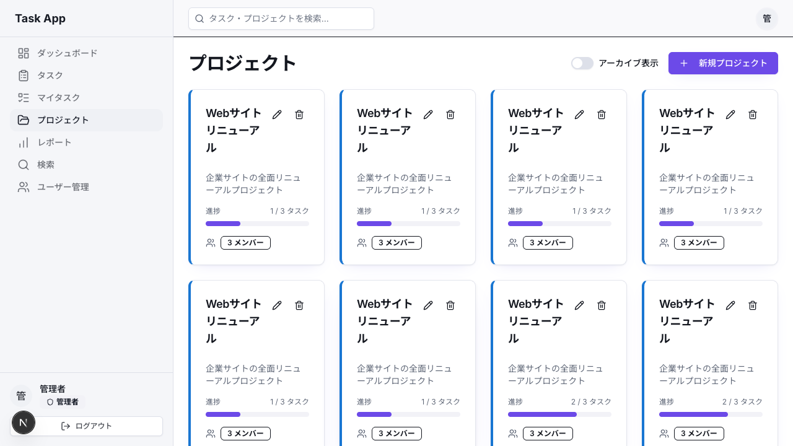

# 用語集

このカリキュラムに登場する主要な技術用語を、日常の例えを交えて解説します。

## カテゴリ早見表

| カテゴリ | 主な用語 | 主に登場するPhase |
|---|---|---|
| フロントエンド | React / Next.js / Tailwind / shadcn/ui | Phase 1-8(全カリキュラム) |
| 認証 | JWT / Cookie / bcryptjs / jose | Phase 2 (Day 05-08) |
| バックエンド | tRPC / Prisma / PostgreSQL | Phase 3-5 (Day 09-20) |
| データベース | Table / Relation / CRUD / CUID | Phase 3-4 (Day 09-17) |
| レポート・可視化 | Recharts | Phase 6 (Day 21-23) |
| 開発ツール | Git / npm / TypeScript / Biome | Phase 1 (Day 01) + 随時 |
| アーキテクチャ | Server/Client Component / Edge Runtime | Day全般 |

---

## フロントエンド関連

### フロントエンド用語サマリー

| 用語 | 役割 | 身近な例え |
|---|---|---|
| React | UIライブラリ | レゴブロックの組み立てキット |
| Next.js | Webフレームワーク | 車(エンジンはReact) |
| コンポーネント | UIパーツ | 使い回せる部品(ボタン/カード) |
| Props | データ伝達 | 店員に渡す注文票 |
| State | 内部状態 | フォームの入力値 |
| Hook | 状態管理関数 | useState / useEffect |
| Tailwind CSS | ユーティリティCSS | 組み合わせ式のスタイル辞書 |
| shadcn/ui | UIコンポーネント集 | コピペで使える部品箱 |

### React

UIを構築するためのJavaScriptライブラリ。レゴブロックのように小さな「コンポーネント」を組み合わせて画面を作ります。

### Next.js

Reactの上に構築されたフレームワーク。Reactが「エンジン」なら、Next.jsは「車」のようなもの。ルーティング、サーバーサイドレンダリング、APIルートなど、Webアプリに必要な機能が最初から揃っています。

### App Router

Next.js 13以降で導入されたルーティング方式。`app/`フォルダの構造がそのままURLになります。`app/dashboard/page.tsx`→`/dashboard`。

### コンポーネント

UIの再利用可能なパーツ。たとえば「ボタン」「カード」「ナビゲーションバー」などです。一度作っておけば、ほかの画面から同じ部品を何度でも使い回せます。

### Props

コンポーネントに渡すデータ。関数の引数にあたります。親コンポーネントから子コンポーネントへデータを渡すときに使います。

### State（状態）

コンポーネント内で管理する変化するデータ。例：フォームの入力値、ダイアログの開閉状態。`useState`フックで管理します。

### Hook（フック）

React 16.8で導入された関数群。`useState`（状態管理）、`useEffect`（副作用処理）、`useMemo`（計算結果のキャッシュ）など。

### JSX / TSX

JavaScriptの中にHTMLのような構文を書ける拡張記法。TSXはTypeScript版です。見た目はHTMLですが、ビルド時にJavaScriptのコードへ変換されます。変換後は、Reactの要素（画面に表示する部品の設計データ）を組み立てる関数の呼び出しになります。

### Tailwind CSS

ユーティリティファーストのCSSフレームワーク。`className="text-red-500 font-bold"`のように、クラス名を組み合わせてスタイルを適用します。CSSファイルを別に書く必要がありません。

### shadcn/ui

Radix UIをベースにした、コピー&ペースト方式のコンポーネントライブラリ。ボタン、ダイアログ、セレクトボックスなど、よく使うUIパーツが揃っています。

---

## バックエンド関連

### バックエンド用語サマリー

| 用語 | 役割 | 身近な例え |
|---|---|---|
| API | データ交換の窓口 | レストランのメニュー |
| tRPC | 型安全API | フロント/バック共通語 |
| Prisma | TypeScript ORM | DB操作の通訳 |
| PostgreSQL | RDBMS | 大容量のエクセル |
| Schema | DB設計図 | 建物の設計図面 |
| Migration | 変更履歴 | DB構造のGit |
| Middleware | 前処理 | ビル入り口の警備員 |
| Router | API束ね | API目次 |

### API（Application Programming Interface）

アプリケーション間でデータをやり取りする仕組み。レストランで言えば「メニュー（何ができるか）」と「注文方法（どうやってリクエストするか）」を定義したもの。

### tRPC

TypeScriptで型安全なAPIを構築するライブラリ。フロントエンドとバックエンドで型を共有するので、型の不一致によるバグが起きません。

### Prisma

データベースとTypeScriptコードの間を取り持つORM（Object-Relational Mapping）。SQLを直接書く代わりに、TypeScriptのコードでデータベース操作ができます。

### PostgreSQL

信頼性の高いオープンソースのリレーショナルデータベース。エクセルの表のように行と列でデータを管理するが、大量のデータを高速に処理できます。

### スキーマ（Schema）

データベースの設計図。どんなテーブルがあり、各テーブルにどんなカラムがあるかを定義します。Prismaでは`schema.prisma`ファイルに記述します。

### マイグレーション（Migration）

データベースのスキーマ変更を管理する仕組み。Gitがコードの変更履歴を管理するように、マイグレーションはデータベース構造の変更履歴を管理します。

### ミドルウェア（Middleware）

リクエストが処理される前に実行される処理。ビルの入り口の警備員のように、すべてのリクエストをチェックして認証済みかどうか確認します。

### ルーター（Router）

APIのエンドポイントをまとめたもの。`projectRouter`ならプロジェクト関連のAPI、`taskRouter`ならタスク関連のAPIを定義します。

---

## 認証関連

### JWT（JSON Web Token）

ユーザーの認証情報に署名を付けたトークン。遊園地の「フリーパスチケット」のようなもの。一度ログインすると発行され、以降はこのトークンを見せるだけでアクセスできます。中身は暗号化されていないので、受け取った人は`userId`や`email`をそのまま読めます。署名は中身を隠すためではなく、書き換えられていないことを示すために付いています。だからパスワードなど他人に見せられない値は入れません。

### Cookie（クッキー）

ブラウザに保存される小さなデータ。このカリキュラムではJWTトークンの保存に使います。有効期限を設定でき、HTTPリクエスト時に自動でサーバーへ送信されます。

### bcryptjs

パスワードをハッシュ化するライブラリ。ハッシュ化とは、元のパスワードへは戻せない要約値に変換することです。データベースには変換後の値だけを保存するので、保存データが盗まれてもパスワードそのものは読み取られません。

### jose

JWTを生成・検証するライブラリ。Edge Runtime（サーバーレス環境）でも動作する軽量な実装です。

### セッション（Session）

ユーザーのログイン状態を管理する仕組み。「ログイン中」「どのユーザーか」「権限は何か」といった情報を保持します。

---

## 開発ツール関連

### Git

ソースコードのバージョン管理システム。ファイルの変更履歴を記録し、いつでも過去の状態に戻せます。複数人での共同開発を可能にします。

### GitHub

Gitリポジトリのホスティングサービス。コードの保存、共有、レビュー、Issue管理などの機能を提供します。

### npm（Node Package Manager）

Node.jsのパッケージマネージャー。他の開発者が作ったライブラリをインストール・管理するツール。`package.json`で依存関係を管理します。

### TypeScript

JavaScriptに「型」を追加した言語。変数や関数の引数・返り値にどんなデータが入るかを明示できます。エディタの補完やエラー検出が強力になります。

### Biome

コードのリンティング（品質チェック）とフォーマット（整形）を行うツール。チームで統一されたコードスタイルを維持するために使います。

### Vitest

テストフレームワーク。書いたコードが期待通りに動くか自動で確認します。`expect(1 + 1).toBe(2)`のようにテストを書きます。

### Vercel

Next.jsの開発元が提供するホスティングサービス。GitHubにプッシュするだけで自動デプロイされます。

### 環境変数（Environment Variables）

アプリケーションの設定値を外部から注入する仕組み。パスワードやAPIキーなど、コードに直接書きたくない値を`.env`ファイルで管理します。

---

## データベース関連

### テーブル（Table）

データベース内のデータを格納する構造。エクセルのシートに相当します。例：`users`テーブル、`tasks`テーブル。

### リレーション（Relation）

テーブル間の関連付け。例：タスクはプロジェクトに所属する（多対一）、プロジェクトには複数のメンバーがいる（多対多）。

### CRUD

Create（作成）、Read（読み取り）、Update（更新）、Delete（削除）の頭文字。データを扱うときの基本となる4つの操作です。

### CUID

衝突しにくいユニークなIDを生成するアルゴリズム。データベースの主キーに使います。生成されるIDは`cm1abc2def3ghi4jkl5mno6pqr`のような文字列です。

---

## アーキテクチャ関連

### クライアントサイド / サーバーサイド

クライアントサイドは、ブラウザ上で実行される処理です。`'use client'`と書いたコンポーネントのうち、クリックへの反応や値の記憶といった、ブラウザに届いてから動く部分が該当します。

サーバーサイドは、サーバー上で実行される処理です。データベースアクセスやAPIルートが該当します。

### Server Component / Client Component

Server Componentは、サーバーで描画されるコンポーネントです。データベースに直接アクセスできますが、`useState`などのフックは使えません。

Client Componentは、`'use client'`を書いたコンポーネントです。インタラクティブなUI（クリック、フォーム入力）を扱います。名前とは違って、最初に表示するHTMLはこちらもサーバーで組み立てられます。Server Componentと分かれるのは、そのファイルのJavaScriptがブラウザへも送られる点です。届いたあとは、クリックに反応したり値を覚えたりできるようになります。

### Edge Runtime

サーバーレス環境の一種。世界中のエッジサーバーで実行され、ユーザーに近い場所で高速にレスポンスを返します。このカリキュラムではNext.jsのミドルウェアで使います。

---

[← カリキュラム目次に戻る](./00_カリキュラム目次.md)
