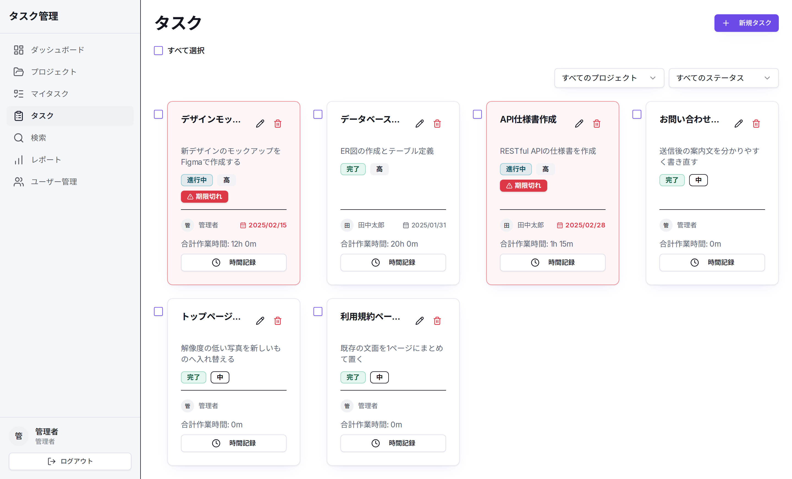

# 用語集

このカリキュラムに登場する主要な技術用語を日常の例えを交えて解説します。

## カテゴリ早見表

| カテゴリ | 主な用語 | 主に登場するPhase |
|---|---|---|
| フロントエンド | React / Next.js / Tailwind / shadcn/ui | Phase 1-8(全カリキュラム) |
| 認証 | JWT / Cookie / bcryptjs / jose | Phase 2 (Day 05-08) |
| バックエンド | tRPC / Prisma / PostgreSQL | Phase 3-5 (Day 09-20) |
| データベース | Table / Relation / CRUD / CUID | Phase 3-4 (Day 09-17) |
| フォーム | react-hook-form / zod / zodResolver | Phase 2 (Day 05) から随時 |
| レポート・可視化 | Recharts | Phase 6 (Day 21-23) |
| 開発ツール | Git / npm / TypeScript / Biome | Phase 1 (Day 01) + 随時 |
| アーキテクチャ | Server/Client Component | Day 02で学習、Day 08・21・27・29・30で再確認 |
| アーキテクチャ | Edge Runtime | Day 07 |

---

## フロントエンド関連

### フロントエンド用語サマリー

| 用語 | 役割 | 例え・代表例 |
|---|---|---|
| React | UIライブラリ | レゴブロックの組み立てキット |
| Next.js | Webフレームワーク | 車(エンジンはReact) |
| コンポーネント | UIパーツ | 使い回せる部品(ボタン/カード) |
| Props | データ伝達 | 店員に渡す注文票 |
| State | 内部状態 | フォームの入力値 |
| Hook | 状態や副作用を扱う関数群 | useState / useEffect |
| Tailwind CSS | ユーティリティCSS | 組み合わせ式のスタイル辞書 |
| shadcn/ui | UIコンポーネント集 | コピペで使える部品箱 |

赤枠①はプロジェクト1件を表示するカードです。名前・進捗・メンバー数をひとまとまりにし、右のプロジェクトにも同じ形の部品を使っています。

### React

Reactは、UIを構築するためのJavaScriptライブラリです。レゴブロックのように小さな「コンポーネント」を組み合わせて画面を作ります。

### Next.js

Next.jsは、Reactの上に構築されたフレームワークです。Reactをエンジンに例えるとNext.jsは車にあたります。ルーティング、サーバーサイドレンダリング（サーバー側で画面のHTMLを作る処理）、Route Handler（App RouterでAPIへの要求を受け取る処理）などの機能を備えています。

### App Router

App Routerは、Next.js 13以降で導入されたルーティング方式です。`app/`フォルダの構造がそのままURLになります。この教材では`src/app/dashboard/page.tsx`が`/dashboard`に対応します。`--src-dir`を使わないプロジェクトでは、`app/`がプロジェクト直下に置かれる場合もあります。

### コンポーネント

コンポーネントは、UIの再利用可能なパーツです。たとえば「ボタン」「カード」「ナビゲーションバー」などです。作った部品はほかの画面でも使えます。

### Props

Propsは、コンポーネントに渡すデータです。関数の引数にあたります。親コンポーネントから子コンポーネントへデータを渡すときに使います。

### State（状態）

Stateは、コンポーネント内で管理する変化するデータです。フォームの入力値やダイアログの開閉状態が該当します。`useState`フックで管理します。

### Hook（フック）

Hookは、React 16.8で導入された関数群です。`useState`（状態管理）、`useEffect`（副作用処理）、`useMemo`（計算結果のキャッシュ）などがあります。

### JSX / TSX

JSXは、JavaScriptの中にHTMLのような構文を書ける拡張記法です。TSXはTypeScript版です。見た目はHTMLに似ています。ビルド時にJavaScriptのコードへ変換されます。変換後はReactの要素（画面に表示する部品の設計データ）を組み立てる関数の呼び出しになります。

### Tailwind CSS

Tailwind CSSは、ユーティリティファーストのCSSフレームワークです。`className="text-red-500 font-bold"`のようにクラス名を組み合わせてスタイルを適用します。用意されたクラスを使う場合はCSSの規則を自分で書かずに指定できます。

### shadcn/ui

shadcn/uiは、Radix UIをベースにしたコピー&ペースト方式のコンポーネントライブラリです。ボタン、ダイアログ、セレクトボックスなどのUIパーツが揃っています。

---

## フォーム関連

### フォーム用語サマリー

| 用語 | 役割 | 例え・代表例 |
|---|---|---|
| react-hook-form | 入力値とエラーの管理 | 記入中の申込書を預かる受付 |
| zod | 入力ルールの定義 | 申込書の記入例と条件 |
| zodResolver | 2つをつなぐ部品 | 受付に記入例を渡す係 |

### react-hook-form

入力欄の値と入力の誤りをまとめて管理する仕組みです。
`useState` を欄の数だけ書く代わりに `register` で欄を登録します。入力した文字は react-hook-form が保持します。
初出は Day 05 です。

### zod

入力の形を先に決めておくためのライブラリです。「1文字以上」「メールアドレスの形」のような
条件を定義して入力を検査します。
サーバー側の入力検査にも同じものを使います。初出は Day 05 です。

### zodResolver

react-hook-form に zod のルールを渡すための部品です。
`useForm({ resolver: zodResolver(loginSchema) })` の形で使います。

---

## バックエンド関連

### バックエンド用語サマリー

| 用語 | 役割 | 例え・代表例 |
|---|---|---|
| API | データ交換の窓口 | レストランのメニュー |
| tRPC | 型安全API | フロント/バック共通語 |
| Prisma | TypeScript ORM | DB操作の通訳 |
| PostgreSQL | リレーショナルDB | 大容量のエクセル |
| Schema | DB設計図 | 建物の設計図面 |
| Migration | 変更履歴 | DB構造のGit |
| Middleware | 前処理 | ビル入り口の警備員 |
| Router | API束ね | API目次 |

### API（Application Programming Interface）

APIは、アプリケーション間でデータをやり取りする仕組みです。レストランで言えば「メニュー（何ができるか）」と「注文方法（どうやってリクエストするか）」を定めたものです。

### tRPC

tRPCは、TypeScriptで型安全なAPIを構築するライブラリです。フロントエンドとバックエンドで型を共有し、引数や戻り値の型の食い違いを開発中に見つけやすくします。ただし型が通ることと入力が正しいことは別です。文字列として妥当でも業務ルール上は許されない値（たとえば他人のプロジェクトID）や、ログインしていない利用者からの要求は、型だけでは止められません。届いた値の検証（Zod）、誰が何をできるかの確認（認証・認可）、保存時の整合（DB制約）が別に必要です。

### Prisma

Prismaは、データベースとTypeScriptコードの間を取り持つORM（Object-Relational Mapping）です。SQLを直接書く代わりにTypeScriptのコードでデータベース操作ができます。

### PostgreSQL

PostgreSQLは、信頼性の高いオープンソースのリレーショナルデータベースです。エクセルの表のように行と列でデータを管理します。大量のデータを処理する用途にも使われます。

### スキーマ（Schema）

スキーマは、データベースの設計図です。テーブルと各テーブルのカラム（列）を定義します。Prismaでは`schema.prisma`ファイルに記述します。

### マイグレーション（Migration）

マイグレーションは、データベースのスキーマ変更を管理する仕組みです。コードの変更履歴をGitで管理するのに対してデータベース構造の変更履歴はマイグレーションで管理します。

### ミドルウェア（Middleware）

ミドルウェアは、リクエストが処理される前に実行される処理です。ビルの入り口の警備員にあたります。このアプリでは `config.matcher` で指定した対象ルートへのリクエストをチェックします。ログインしていなければログイン画面へ送り返します。

### ルーター（Router）

ルーターは、APIの窓口（エンドポイント）をまとめたものです。`projectRouter`にはプロジェクト関連のAPIを定義します。`taskRouter`にはタスク関連のAPIを定義します。

---

## レポート・可視化関連

### Recharts

Reactでグラフを描くためのライブラリです。Day 22では集計データをグラフ用のコンポーネントへ渡して円グラフで表示します。Day 23では週ごとの完了数を折れ線グラフで、高・緊急の完了タスク数と完了タスクの優先度別内訳を棒グラフで表示します。

---

## 認証関連

### JWT（JSON Web Token）

このアプリでは、ユーザーの認証情報を入れて署名したJWTをログイン時に発行します。遊園地の「フリーパスチケット」のようなものです。その後のアクセスではサーバーがトークンを検証して利用者を識別します。この教材で発行する署名付きJWTの中身は暗号化されていません。受け取った人は`userId`や`email`をそのまま読めます。署名は内容の改変を検出するために付いています。だからパスワードなど他人に見せられない値は入れません。

### Cookie（クッキー）

Cookieは、ブラウザに保存される小さなデータです。このカリキュラムではJWTトークンの保存に使います。有効期限を設定できます。HTTPリクエスト時に自動でサーバーへ送信されます。

### bcryptjs

bcryptjsは、パスワードをハッシュ化するライブラリです。ハッシュ化は元のパスワードへ戻す操作を持たない要約値への変換です。データベースには元のパスワードを保存せず変換後の値を保存します。

### jose

JWTを生成・検証するライブラリです。Web標準のAPI（ブラウザにも備わっている共通の機能）のうち、暗号の計算を担当する Web Crypto API を使い、Node.jsやEdge Runtimeで利用できます。この教材では、ミドルウェアでログイン用のトークンを検証します。

### セッション（Session）

セッションは、ユーザーのログイン状態を管理する仕組みです。「ログイン中」「どのユーザーか」「権限は何か」といった情報を保持します。

---

## 開発ツール関連

### Git

Gitは、ソースコードのバージョン管理システムです。ファイルの変更履歴を記録します。記録した過去の状態を取り出せます。複数人での共同開発を可能にします。

### GitHub

GitHubは、Gitリポジトリのホスティングサービスです。コードの保存、共有、レビュー、Issue管理などの機能を提供します。

### Node.js

ブラウザの外でJavaScriptを動かす実行環境です。開発サーバーやnpmはこの上で動きます。

### npm（Node Package Manager）

npmは、Node.jsのパッケージマネージャーです。他の開発者が作ったライブラリをインストール・管理するツールで、`package.json`で依存関係を管理します。

### TypeScript

TypeScriptは、JavaScriptに「型」を追加した言語です。変数や関数の引数・返り値にどんなデータが入るかを明示できます。エディタの補完やエラー検出が強力になります。

### Biome

Biomeは、コードのリンティング（品質チェック）とフォーマット（整形）を行うツールです。チームで統一されたコードスタイルを維持するために使います。

### Vitest

Vitestは、テストフレームワークです。書いたコードが期待通りに動くか自動で確認します。`expect(1 + 1).toBe(2)`のようにテストを書きます。

### Vercel

Vercelは、Next.jsの開発元が提供するホスティングサービスです。GitHubのリポジトリと連携すると、プッシュに応じて自動デプロイされます。

### 環境変数（Environment Variables）

環境変数は、アプリケーションの設定値を外部から渡す仕組みです。パスワードやAPIキーなどのコードに直接書きたくない値を`.env`ファイルで管理します。

---

## データベース関連

### テーブル（Table）

テーブルは、データベース内のデータを格納する構造です。エクセルのシートに相当します。`users`テーブルや`tasks`テーブルが該当します。

### リレーション（Relation）

リレーションは、テーブル間の関連付けです。たとえば、タスクはプロジェクトに所属します（多対一）。プロジェクトには複数のメンバーがいて、メンバーも複数のプロジェクトに参加できます（多対多）。

### CRUD

CRUDは、Create（作成）、Read（読み取り）、Update（更新）、Delete（削除）の頭文字です。データを扱うときの基本となる4つの操作です。

### CUID

CUIDは、衝突しにくいユニークなIDを生成するアルゴリズムです。データベースの主キー（各行を一意に識別する列）に使います。生成されるIDは`cm1abc2def3ghi4jkl5mno6pqr`のような文字列です。

---

## アーキテクチャ関連

### クライアントサイド / サーバーサイド

クライアントサイドはブラウザ上で実行される処理です。`'use client'`と書いたコンポーネントがブラウザに届いてから行う処理が該当します。クリックへの反応や値の記憶がその例です。

サーバーサイドはサーバー上で実行される処理です。データベースアクセスやAPIルートが該当します。

### Server Component / Client Component

Server Componentはサーバーで描画されるコンポーネントです。データベースに直接アクセスできます。`useState`などのフックは使えません。

Client Componentはブラウザでも動くコンポーネントです。`'use client'` は、Client Componentの入口となるファイルへ書きます。そこから読み込むコンポーネントへ同じ宣言を重ねる必要はありません。クリックやフォーム入力を扱えます。最初に表示するHTMLはClient Componentもサーバーで組み立てられます。Server Componentとの違いはそのファイルのJavaScriptがブラウザへも送られる点です。ブラウザに届いたJavaScriptがクリックへの反応や値の記憶を担います。

### Edge Runtime

Web標準のAPI（`fetch` など、ブラウザでも使える共通の機能）の一部を使える JavaScript の実行環境です。Node.js のすべてのAPIを使えるわけではなく、たとえばファイルを読む `fs` モジュールは使えません。このカリキュラムではNext.jsのミドルウェアで使います。

サーバーを自分で管理するかは、利用するデプロイ先によって変わります。どの地域で実行するかも、デプロイ先やその設定によって決まります。Edge Runtime を選ぶだけで、必ずユーザーの近くで実行されるわけではありません。

---

## 戻る

- 目次: [カリキュラム目次](./00_カリキュラム目次.md)
- 全体の地図: [学びのロードマップ](./00-1_学びのロードマップ.md)

<!-- textlint-disable ja-technical-writing/ja-no-mixed-period, ja-technical-writing/no-doubled-conjunction, ja-technical-writing/no-exclamation-question-mark -->

---

## 奥付

| | |
|---|---|
| タイトル | 用語集 |
| 著者 | 磯貝光佑 |
| 版 | 第1版（2026年9月19日） |

© 2026 磯貝光佑

本書は購入者個人の利用に限ります。本書に掲載されたコードの写経、および自分のプロジェクトへの転用・改変は自由です。本書（PDF・Markdown）および付属コードの再配布・転売・第三者との共有は、形態を問わず禁止します。

<!-- textlint-enable ja-technical-writing/ja-no-mixed-period, ja-technical-writing/no-doubled-conjunction, ja-technical-writing/no-exclamation-question-mark -->
