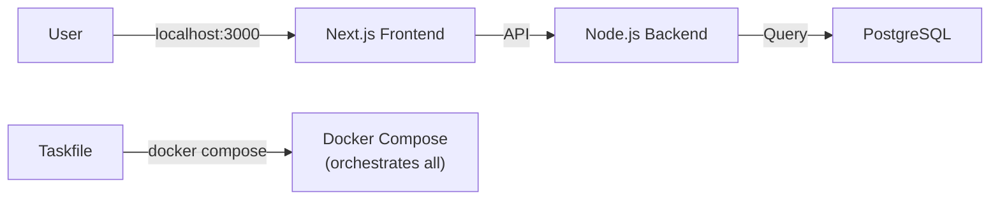

# 環境構築の第一歩 〜プログラミングの「キッチン」を準備しよう〜

## はじめに

プログラミングを始めたばかりの頃、「何をどこに入力すれば動くのか」「エラーが出たときにどうすればいいのか」と迷いませんか？

多くの人が最初の環境構築でつまずき、プログラミングを諦めてしまいます。この章では、プログラミングを始めるための「キッチン」を準備し、最初のコードを動かすまでの手順を解説します。

プログラミングを始めたばかりのあなたは、以下のような悩みを抱えているかもしれません。

- 「インストールしたけど、どこをクリックすればいいかわからない」
- 「何をタイプすれば動くのかわからない」
- 「動いているかどうか、どう判断すればいいかわからない」

この章では、これらの悩みを解決し、以下のことを学びます。

- 「環境構築」とは何か
- プログラミングに必要な最低限のツール
- プロジェクトを実行して動作確認する方法
- コードを修正して、変更が反映されることを確認する方法

環境構築がうまくいかないのは、あなたがプログラミングに向いていないからではありません。まるで、キッチンが整っていないのに料理をしようとするようなものです。

この章を読み終える頃には、あなたのプログラミングの「キッチン」が準備完了し、スムーズに開発を進められるようになります。

## Kitchen メタファーで理解する

プログラミングの環境構築は、料理をする前のキッチンの準備に似ています。

| キッチン | 技術 | 役割 |
|---|---|---|
| コンロ | Node.js（ノード・ジェーエス） | プログラムを「調理」する |
| キッチン一式 | Docker（ドッカー） | 全ての道具を箱に詰めて持ち運ぶ |
| 冷蔵庫 | PostgreSQL（ポストグレスキューエル） | 食材（データ）を保存 |
| レシピカード | Taskfile（タスクファイル） | 複雑な手順を1ステップに |
| まな板と包丁 | VS Code（ブイエスコード） | コードを書いたり編集したりする |
| コンロの操作パネル | ターミナル | プログラムの実行や停止を指示する |
| 食材配達サービス | npm（エヌピーエム） | 必要なプログラムの部品を届ける |
| キッチンの作業台 | プロジェクトフォルダ | コードや設定ファイルをまとめて管理する場所 |

プログラミング開発も、キッチンでの調理と同じです。必要なツールを揃えて初めて、スムーズに開発を進めることができます。上記の表を参考に、各ツールの役割をイメージしてみてください。

## Taskfileの使い方

Taskfile（タスクファイル）は、複雑なコマンドをまとめて実行できる便利なツールです。ここでは、Taskfileを使って環境構築を簡単にする方法を説明します。

```yaml
# filepath: taskfile.yaml
version: '3'

tasks:
  init:
    desc: Setup the project
    cmds:
      - docker compose down --volumes
      - npm ci --legacy-peer-deps
      - npx prisma migrate deploy
      - npm run seed
  dev:
    desc: Start the development server
    cmds:
      - docker compose up -d && npm run dev
  seed:
    desc: Seed the database with initial data
    cmds:
      - npx prisma migrate dev
      - npx prisma db seed
```

確認ポイント:
- 上記はTaskfile.yamlの例です。
- init, dev, seedといったタスクが定義されています。
- 各タスクは複数のコマンドをまとめて実行します。

Taskfileを使うことで、複雑なコマンドを覚える必要はありません。`task init`、`task dev`、`task seed`といったコマンドを実行するだけで、環境構築、開発サーバーの起動、データベースの初期化が完了します。

以下の表は、このチュートリアルで使用するTaskfileコマンドの一覧です。

| コマンド | 説明 | 使うタイミング |
|---|---|---|
| `task init` | Dockerとnpmを一括でセットアップします。 | 最初の環境構築時 |
| `task dev` | 開発サーバーを起動します。 | 開発中にアプリケーションを起動するとき |
| `task seed` | テストデータをデータベースに投入します。 | データベースを初期化するとき |

## セットアップステップバイステップ

それでは、実際にTaskfileを使って環境構築を行いましょう。

### Step 1: 前提条件の確認

**何をしているか**: 開発に必要なツール（Node.js、npm、Docker）がパソコンにインストールされているかを確認します。

**なぜ必要か**: これらのツールがないと、プロジェクトを動かすことができません。料理で言えば、コンロや包丁がないのと同じです。

まず、必要なツールがインストールされているか確認します。ターミナルを開き、以下のコマンドを順番に実行してください。

```
$ node -v
v24.11.1

$ npm -v
10.9.0

$ docker --version
Docker version 27.0.0
```

**期待される出力**: 各コマンドでバージョン番号が表示されれば成功です。

確認ポイント:
- `node -v` は Node.js のバージョンを表示します。
- `npm -v` は npm のバージョンを表示します。
- `docker --version` は Docker のバージョンを表示します。

- `node -v` は Node.js（ノード・ジェーエス：JavaScriptを実行するための環境）のバージョンを表示します。`v24.11.1` は「バージョン24系の最新版」という意味です。もし `v20.xx.xx` のように表示されても、このチュートリアルは問題なく進められます。
- `npm -v` は npm（エヌピーエム：Node.jsのパッケージ管理ツール）のバージョンを表示します。`10.9.0` は「バージョン10系の最新版」という意味です。
- `docker --version` は Docker（ドッカー：アプリケーションをコンテナという「箱」に入れて実行する技術）のバージョンを表示します。`Docker version 27.0.0` は「バージョン27系のDockerがインストールされている」という意味です。

もし、これらのコマンドがエラーになる場合は、Node.js、npm、Dockerが正しくインストールされていません。それぞれの公式サイトからインストールしてください。

### Step 2: `task init` コマンドの実行

**何をしているか**: プロジェクトに必要なすべてのパッケージをインストールし、データベースを初期化します。

**なぜ必要か**: プロジェクトは多くの外部ライブラリに依存しています。これらをダウンロードしないと、アプリケーションは動きません。料理で言えば、食材を冷蔵庫に入れる作業です。

次に、`task init` コマンドを実行して、プロジェクトの初期設定を行います。ターミナルで以下のコマンドを実行してください。

```
$ task init
task: [init] docker compose down --volumes
task: [init] npm ci --legacy-peer-deps
task: [init] npx prisma migrate deploy
task: [init] npm run seed
All setup complete!
```

**期待される出力**: 最後に `All setup complete!` と表示されます。

確認ポイント:
- ターミナルに上記のようなログが表示されることを確認してください。
- 最後に `All setup complete!` と表示されれば成功です。

このコマンドは、以下の処理を順番に実行します。

1. `docker compose down --volumes`: 以前に起動していたDockerコンテナを停止し、関連するデータを削除します。
2. `npm ci --legacy-peer-deps`: プロジェクトに必要なnpmパッケージをインストールします。
3. `npx prisma migrate deploy`: データベースのスキーマを最新の状態に更新します。
4. `npm run seed`: データベースに初期データを投入します。

`All setup complete!` と表示されたら、初期設定は完了です。

### Step 3: `task dev` コマンドの実行

**何をしているか**: Dockerコンテナを起動し、Next.jsの開発サーバーを立ち上げます。

**なぜ必要か**: 開発サーバーがないと、ブラウザでアプリケーションを確認できません。料理で言えば、コンロに火をつける作業です。

次に、`task dev` コマンドを実行して、開発サーバーを起動します。ターミナルで以下のコマンドを実行してください。

```
$ task dev
task: [dev] docker compose up -d && npm run dev
Waiting for healthcheck...
Next.js 15.1.6 (starting)
Local:   http://localhost:3000
```

**期待される出力**: `http://localhost:3000` というURLが表示されます。

確認ポイント:
- ターミナルに上記のようなログが表示されることを確認してください。
- `http://localhost:3000` と表示されれば、サーバーが起動しています。

このコマンドは、以下の処理を実行します。

1. `docker compose up -d`: Dockerコンテナをバックグラウンドで起動します。
2. `npm run dev`: Next.jsの開発サーバーを起動します。

`http://localhost:3000` が表示されたら、開発サーバーは正常に起動しています。ブラウザで `http://localhost:3000` を開くと、初期画面が表示されます。まだアプリケーションが実装されていないため、真っ白なページが表示されることがありますが、これは正常な状態です。

## 動作確認

環境が正しく構築されたことを確認するために、以下の手順を実行してください。

1. **Docker Desktopの確認:**

   Docker Desktop（ドッカー・デスクトップ：Dockerコンテナを管理するためのツール）を開くと、2つのコンテナ（`postgres-db` と `backend`）が緑色の「Running」状態で表示されます。

   【スクリーンショット】Docker Desktopの実行状態

   図1: Docker Desktopの実行状態
   図1のように、`taskapp-postgres`と`taskapp-backend`が緑色（Running）で表示されていることを確認してください。

2. **ブラウザの確認:**

   ブラウザで`http://localhost:3000`にアクセスすると、真っ白なページが表示されます（これは正常です。アプリがまだ実装されていないため）。

   【スクリーンショット】ブラウザにlocalhost:3000を表示した画面

3. **データベースの確認:**

   データベースが正しく起動していることを確認します。別のターミナルを開き、以下のコマンドを実行してください。

   ```bash
   $ docker exec -it taskapp-postgres psql -U postgres
   psql (16.3)
   Type "help" for help.

   postgres=#
   ```

   確認ポイント:
   - 上記のコマンドを実行すると、PostgreSQLのプロンプトが表示されます。
   - `postgres=#` と表示されれば、データベースに接続できています。

   このコマンドは、`taskapp-postgres`コンテナ内でPostgreSQL（ポストグレスキューエル：オープンソースのデータベース）に接続します。`postgres=#` が表示されれば、データベースが正常に起動し、接続できていることを確認できます。`exit` と入力してEnterキーを押すと、PostgreSQLのプロンプトから抜けられます。

## Mermaid Diagram: Docker Compose Architecture

以下の図は、Docker Composeで構築されたアプリケーションのアーキテクチャを示しています。



この図は、以下の関係性を示しています。

- ユーザー（A）は、ブラウザを通じて`localhost:3000`にアクセスし、Next.js（ネクストジェーエス：Reactをベースとしたフレームワーク）のフロントエンド（B）と通信します。
- Next.jsのフロントエンド（B）は、API（C）を通じてNode.jsのバックエンド（C）と通信します。
- Node.jsのバックエンド（C）は、データベース（D）に対してクエリ（データの要求）を実行します。
- Taskfile（E）は、`docker compose`コマンドを通じて、これらのすべてのコンポーネントをオーケストレーション（連携）します。

## まとめ

Taskfileを使えば、複雑なセットアップも1コマンドで完了します。コンロ、キッチン一式、冷蔵庫、レシピカード...すべてが揃って、初めて調理ができます。次のチャプターでは、Taskfileの仕組みを詳しく説明します。

## 付録

### トラブルシューティング

| 問題 | 解決策 |
|---|---|
| `task` コマンドが見つからない | Taskfileが正しくインストールされているか確認してください。 |
| ポート3000が使用中 | 他のアプリケーションがポート3000を使用していないか確認してください。 |
| ブラウザにページが表示されない | 開発サーバーが正しく起動しているか確認してください。 |

### コマンドリファレンス

| コマンド | 説明 |
|---|---|
| `node -v` | Node.jsのバージョンを表示します。 |
| `npm -v` | npmのバージョンを表示します。 |
| `docker --version` | Dockerのバージョンを表示します。 |
| `task init` | プロジェクトの初期設定を行います。 |
| `task dev` | 開発サーバーを起動します。 |
| `task seed` | データベースに初期データを投入します。 |

### ファイルの役割

| ファイル | 役割 |
|---|---|
| `taskfile.yaml` | Taskfileの設定ファイルです。 |
| `package.json` | npmのパッケージ管理ファイルです。 |
| `docker-compose.yml` | Docker Composeの設定ファイルです。 |
