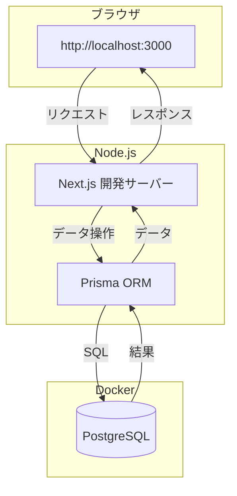
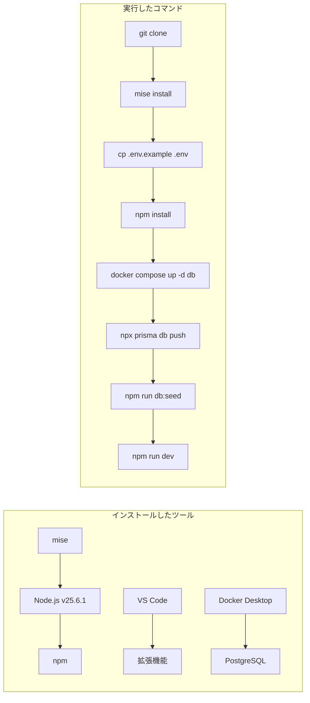

# Day 01: 開発環境を整えて、初めてのアプリを動かそう

ようこそ、30日間カリキュラムへ！今日はこれから30日間で作り上げていくタスク管理アプリを、あなたのパソコンで実際に動かすところまで進めます。

最初のセットアップは少し手順が多く感じるかもしれませんが、ひとつずつ進めれば大丈夫です。今日の終わりには、ブラウザに自分だけのアプリが表示される達成感を味わえます。

## このDayについて

| 項目 | 内容 |
|------|------|
| 所要時間 | 80〜100分 |
| 前提知識 | パソコンの基本操作（ファイル作成、ブラウザ利用） |
| 使用ツール | ターミナル、VS Code、Docker Desktop、mise、ブラウザ |
| 学習形式 | 手順に従ってインストール → 設定 → 動作確認 |

### このDayでやること（3つ）

1. **開発に必要なツールをインストールする** - mise、Node.js、VS Code、Docker Desktopをセットアップする
2. **プロジェクトを取得して設定する** - GitHubからコードをダウンロードし、環境変数とデータベースを準備する
3. **アプリを起動してブラウザで確認する** - 開発サーバーを起動し、実際にアプリが動くことを確認する

### 完了条件（これができたらDay01は完了）

- [ ] miseがインストールされている
- [ ] Node.js v25がインストールされている（mise経由）
- [ ] VS Codeが起動し、推奨拡張機能が入っている
- [ ] Docker Desktopが起動している
- [ ] `npm run dev` で開発サーバーが起動する
- [ ] ブラウザで http://localhost:3000 にアクセスしてアプリが表示される

### 詰まった時の戻り先

| 症状 | 戻るStep | 確認事項 |
|------|---------|----------|
| `mise` コマンドが見つからない | Step 1 | miseのインストールを確認 |
| `node` コマンドが見つからない | Step 1 | `mise install` を再実行 |
| `git clone` できない | Step 4 | Gitのインストール状態を確認 |
| `npm install` でエラーが出る | Step 8 | `node -v` でv25か確認、違えば `mise install` |
| データベースに接続できない | Step 9 | Docker Desktopが起動しているか確認 |
| `npm run dev` で `.env` 関連エラー | Step 7 | `.env` ファイルの内容を確認 |
| `npm run dev` で `MODULE_NOT_FOUND` | Step 8 | `npm install` を再実行 |
| `npm run dev` で `P1001` エラー | Step 9 | Docker が起動しているか確認 |

---

## Step一覧

| Step | タイトル | 目安時間 | 触るファイル | 成功状態 |
|------|---------|---------|-------------|---------|
| 1 | miseをインストールする | 7分 | なし | `mise --version` でバージョンが表示される |
| 2 | VS Codeをインストール＆拡張機能を設定する | 10分 | なし | VS Codeが起動し、4つの拡張機能が入っている |
| 3 | Docker Desktopをインストールする | 7分 | なし | `docker --version` でバージョンが表示される |
| 4 | プロジェクトをクローンする | 5分 | なし | `task-app` フォルダが作成される |
| 5 | VS Codeでプロジェクトを開く | 3分 | なし | VS Codeにファイル一覧が表示される |
| 6 | Node.jsをセットアップする | 7分 | なし | `node -v` で `v25.6.1` が表示される |
| 7 | 環境変数を設定する | 5分 | .env | `.env` ファイルが作成される |
| 8 | 依存関係をインストールする | 5分 | なし | `node_modules` フォルダが作成される |
| 9 | データベースを起動する | 5分 | なし | PostgreSQLコンテナが起動する |
| 10 | データベースをセットアップする | 5分 | なし | テーブルとサンプルデータが作成される |
| 11 | 開発サーバーを起動する | 5分 | なし | ターミナルに「Ready」と表示される |
| 12 | ブラウザでアプリを確認する | 5分 | なし | ログイン画面が表示される |

---

## 今日学ぶこと

| 項目 | 説明 | 例え話 |
|------|------|--------|
| mise | 開発ツールのバージョンを自動管理するツール | 「レシピに合った道具セット」を自動で揃えてくれるアシスタント |
| Node.js | JavaScriptをパソコン上で動かす実行環境 | 料理をするための「キッチン」 |
| npm | パッケージ（部品）を管理するツール | キッチンに食材を届ける「宅配サービス」 |
| Docker | アプリの動作環境をまるごとパッケージ化するツール | 料理道具一式が入った「引っ越しダンボール」 |
| PostgreSQL | データを保存するデータベース | 食材を保管する「冷蔵庫」 |
| Prisma | TypeScriptからデータベースを操作するツール | 冷蔵庫の中身を整理する「収納ケース」 |
| Next.js | Webアプリを作るためのフレームワーク | レシピに沿って料理を作る「クッキングガイド」 |



---

### Step 1: miseをインストールする（7分）

🎯 **ゴール**: `mise --version` コマンドでバージョンが表示される状態にする。

> 💡 **例え話**: **mise**は「レシピに合った道具を自動で揃えてくれるアシスタント」です。プロジェクトフォルダに入るだけで、正しいバージョンのNode.jsを自動的に使ってくれます。

#### miseとは

| 項目 | 内容 |
|------|------|
| 正式名称 | mise（ミーズ） |
| 役割 | Node.jsなどの開発ツールのバージョンを自動管理する |
| 設定ファイル | `.mise.toml`（プロジェクトのルートにある） |
| なぜ必要か | 全員が同じバージョンのNode.jsを使えるようにするため |

#### なぜバージョン管理が大切なのか

| 状況 | バージョン管理なし | バージョン管理あり（mise） |
|------|------------------|------------------------|
| Aさんのパソコン | Node.js v22（古い） | Node.js v25.6.1（正確） |
| Bさんのパソコン | Node.js v24（違う） | Node.js v25.6.1（正確） |
| 結果 | 「Aさんだけエラーになる」 | 全員同じ環境で動く |

このプロジェクトは `package.json` で Node.js v25 を要求しています。違うバージョンだと `npm install` の時点でエラーになります。miseを使えば、このような「バージョン違い事故」を完全に防げます。

#### miseのインストール（Mac）

> 💡 **安全性について**: 以下のコマンドはmise公式サイト（https://mise.run）のインストールスクリプトをダウンロードして実行します。信頼できる公式ソースからのみ実行してください。

```bash
# filepath: ターミナル（Mac）
# miseの公式インストールスクリプトを実行する
curl https://mise.run | sh
```

✅ **確認ポイント**:
- エラーなくインストールが完了した
- `mise is installed!` または `mise` に関するメッセージが表示された

インストールが完了したら、シェルにmiseを有効化する設定を追加します。

```bash
# filepath: ターミナル（Mac）
# miseをzshで自動有効化する設定を追加する
echo 'eval "$(~/.local/bin/mise activate zsh)"' >> ~/.zshrc
source ~/.zshrc
```

✅ **確認ポイント**:
- コマンドがエラーなく実行できた

> ⚠️ **bashを使っている場合**（WSL2など）は、`~/.zshrc` の代わりに `~/.bashrc` に書いてください:
>
> ```bash
> # filepath: ターミナル（bash / WSL2）
> # miseをbashで自動有効化する設定を追加する
> echo 'eval "$(~/.local/bin/mise activate bash)"' >> ~/.bashrc
> source ~/.bashrc
> ```
>
> ✅ 確認ポイント: コマンドがエラーなく実行できた

#### miseのインストール（Windows）

PowerShellを**管理者として**開き、以下を実行してください。

```powershell
# filepath: PowerShell（Windows・管理者）
# wingetを使ってmiseをインストールする
winget install jdx.mise
```

✅ **確認ポイント**:
- インストールが完了した

インストール後、miseの有効化設定をPowerShellプロファイルに追加します。

> ⚠️ `$PROFILE` ファイルが存在しない場合は、先に以下のコマンドで作成してください:
>
> ```powershell
> # filepath: PowerShell（Windows）
> # PowerShellプロファイルファイルを新規作成する
> New-Item -Path $PROFILE -Force
> ```
>
> ✅ 確認ポイント: コマンドがエラーなく実行できた

```powershell
# filepath: PowerShell（Windows）
# PowerShellプロファイルにmiseの有効化を追記する
$cmd = 'mise activate powershell | Out-String | Invoke-Expression'
Add-Content -Path $PROFILE -Value $cmd
```

✅ **確認ポイント**:
- コマンドがエラーなく実行できた

設定後、PowerShellを一度閉じて開き直してください。

#### miseの動作確認

💻 **実装**:

```bash
# filepath: ターミナル
mise --version
```

🔍 **コード解説**:

| コマンド | 意味 | 期待する結果 |
|---------|------|------------|
| `mise --version` | miseのバージョンを表示 | バージョン番号が表示される |

✅ **確認ポイント**:
- バージョン番号が表示されていればmiseのインストール成功

【スクリーンショット】`mise --version` の出力にバージョン番号が表示されていることを確認してください。

> ⚠️ `mise: command not found` と表示される場合は、ターミナルを一度閉じて開き直してください。

📝 **学んだこと**: miseを使うと、プロジェクトごとに正しいバージョンのNode.jsが自動で使われます。チーム全員が同じ環境で開発できるので、「自分のパソコンでは動くのに…」という問題がなくなります。

---

### Step 2: VS Codeをインストール＆拡張機能を設定する（10分）

🎯 **ゴール**: VS Codeが起動し、このプロジェクトの推奨拡張機能4つが入っている状態にする。

> 💡 **例え話**: VS Codeは「超高機能なメモ帳」です。普通のメモ帳と違い、コードの色分け、エラーの検知、自動補完といった、プログラミングを快適にする機能がたくさんあります。拡張機能は「VS Codeのプラグイン」で、料理の道具に例えると、VS Code本体は包丁、拡張機能は皮むき器や計量カップのような専用道具です。

#### VS Codeとは

| 項目 | 内容 |
|------|------|
| 正式名称 | Visual Studio Code |
| 役割 | コードを書くためのエディター |
| 特徴 | 無料・軽量・拡張機能が豊富 |
| ダウンロード | https://code.visualstudio.com/ |

#### インストール手順

公式サイト（ https://code.visualstudio.com/ ）から、自分のOS（Windows / Mac）に合ったインストーラーをダウンロードして実行してください。

インストール後、ターミナルで以下を実行してバージョンを確認してください。

💻 **実装**:

```bash
# filepath: ターミナル
code --version
```

✅ **確認ポイント**:
- VS Codeが起動する
- `code --version` を実行するとバージョン番号が表示される（例: `1.90.0`）

#### 推奨拡張機能をインストールする

VS Codeを起動し、左側のサイドバーにある四角いアイコン（拡張機能）をクリックします。検索窓に拡張機能名を入力して、「Install」ボタンを押してください。

> 💡 まとめてインストールしたい場合は、ターミナルで以下のコマンドを実行する方法もあります。

💻 **実装**:

```bash
# filepath: ターミナル
# このプロジェクトの推奨拡張機能を4つインストールする
code --install-extension EditorConfig.EditorConfig
code --install-extension biomejs.biome
code --install-extension stylelint.vscode-stylelint
code --install-extension wayou.vscode-todo-highlight
```

🔍 **コード解説**:

| 拡張機能 | 役割 | なぜ必要か |
|---------|------|----------|
| EditorConfig | エディター設定の統一 | チーム全員のインデントや改行コードを揃える |
| Biome | コードの品質チェック | 書き方のミスを自動で指摘してくれる |
| stylelint | CSSの品質チェック | スタイルの書き方のミスを自動で指摘してくれる |
| TODO Highlight | TODOコメントの強調表示 | コード内の「あとで直す」メモを見逃さない |

> 💡 **ポイント**: このプロジェクトでは `.vscode/extensions.json` に推奨拡張機能が定義されています。VS Codeでプロジェクトを開くと「推奨拡張機能をインストールしますか？」と表示されるので、そこからまとめてインストールすることもできます。

✅ **確認ポイント**:
- 拡張機能一覧に上記の4つが表示されている

📝 **学んだこと**: VS Codeは世界中の開発者が使っている無料のコードエディターです。拡張機能を入れることで、プロジェクトに合った開発環境にカスタマイズできます。

---

### Step 3: Docker Desktopをインストールする（7分）

🎯 **ゴール**: `docker --version` でバージョンが表示される状態にする。

> 💡 **例え話**: Dockerは「引っ越しダンボール」です。データベースのような必要なソフトウェアを箱に詰めて、どのパソコンでもすぐ使える状態にしてくれます。

#### Dockerとは

| 項目 | 内容 |
|------|------|
| 正式名称 | Docker Desktop |
| 役割 | アプリの実行環境をコンテナとして管理する |
| 今回の用途 | PostgreSQL（データベース）を動かす |
| ダウンロード | https://www.docker.com/products/docker-desktop/ |

#### インストール手順

1. 公式サイト（ https://www.docker.com/products/docker-desktop/ ）にアクセスします
2. 自分のOS（Windows / Mac）に合ったインストーラーをダウンロードします
3. ダウンロードしたファイルを実行してインストールします
4. インストール完了後、Docker Desktopアプリを起動します

> ⚠️ **初回起動時**: 利用規約への同意画面が表示されます。「Accept」をクリックしてください。

> WindowsではWSL2のインストールを求められることがあります。画面の指示に従ってください。

#### バージョン確認

💻 **実装**:

```bash
# filepath: ターミナル
docker --version
```

🔍 **コード解説**:

| コマンド | 意味 | 期待する結果 |
|---------|------|------------|
| `docker --version` | Dockerのバージョンを表示 | `Docker version 2x.x.x` と表示 |

✅ **確認ポイント**:
- Docker Desktopアプリが起動している（タスクバー/メニューバーにクジラのアイコンが表示されている）
- バージョン番号が表示される

📝 **学んだこと**: Dockerを使うと、PostgreSQLのようなソフトウェアをパソコンに直接インストールせずにコンテナとして動かせます。環境を汚さずに開発できるのが大きなメリットです。

---

### Step 4: プロジェクトをクローンする（5分）

🎯 **ゴール**: `task-app` フォルダがパソコンに作成される。

> 💡 **例え話**: `git clone` は「テンプレートのコピー」です。GitHubという倉庫に置いてある設計図一式を、自分のパソコンにまるごとコピーしてくる操作です。

#### Gitとは

| 項目 | 内容 |
|------|------|
| 正式名称 | Git |
| 役割 | コードの変更履歴を管理するツール |
| GitHub | Gitのリポジトリをオンラインに保管するサービス |
| clone | リポジトリを自分のパソコンにコピーする操作 |

#### Gitのインストール確認

まず、Gitがインストールされているか確認します。

```bash
# filepath: ターミナル
# Gitのバージョンを確認する
git --version
```

✅ **確認ポイント**:
- `git version 2.x.x` のようにバージョンが表示されればOK

> ⚠️ `git: command not found` と表示される場合は、Gitのインストールが必要です。
> - **Mac**: ターミナルで `xcode-select --install` を実行してください（コマンドラインツールに含まれています）。
> - **Windows**: https://git-scm.com/ から Git for Windows をダウンロードしてインストールしてください。

#### クローン手順

💻 **実装**:

まず、プロジェクトを保存する場所に移動します。デスクトップでなくても構いません。

```bash
# filepath: ターミナル（Mac / Linux）
# 任意の作業フォルダに移動（例: デスクトップ）
cd ~/Desktop
```

> ⚠️ **Windows（PowerShell）の場合**: `cd ~/Desktop` の代わりに `cd $HOME\Desktop` を実行してください。

✅ **確認ポイント**:
- エラーなく移動できた

```bash
# filepath: ターミナル
# GitHubからプロジェクトをコピーする
git clone https://github.com/kouiso/task-app.git
```

✅ **確認ポイント**:
- `Cloning into 'task-app'...` と表示されてダウンロードが進む

クローンが完了したら、プロジェクトフォルダに移動します。

```bash
# filepath: ターミナル
# プロジェクトフォルダに移動する
cd task-app
```

🔍 **コード解説**:

| コマンド | 意味 | 例え |
|---------|------|------|
| `cd ~/Desktop` | 作業フォルダに移動（例） | 作業場所に向かう |
| `git clone <URL>` | リポジトリをコピー | 設計図を取り寄せる |
| `cd task-app` | プロジェクトフォルダに移動 | 作業場所に入る |

✅ **確認ポイント**:
- 選択した場所に `task-app` フォルダが作成されている
- フォルダの中に `package.json` ファイルがある

📝 **学んだこと**: `git clone` でGitHubからプロジェクトのソースコード一式を取得できます。これでソースコードが自分のパソコンにコピーされました。

---

### Step 5: VS Codeでプロジェクトを開く（3分）

🎯 **ゴール**: VS Codeに `task-app` のファイル一覧が表示される。

> 💡 **例え話**: `code .` は「作業台の上にレシピと材料を広げる」操作です。ターミナルだけでもコードは書けますが、VS Codeを使うと色分け・補完・エラー表示が効いて格段に効率が上がります。

💻 **実装**:

```bash
# filepath: ターミナル（task-appフォルダ内で実行）
code .
```

🔍 **コード解説**:

| コマンド | 意味 | 例え |
|---------|------|------|
| `code .` | 今いるフォルダをVS Codeで開く | 作業台にレシピを広げる |

✅ **確認ポイント**:
- VS Codeが起動している
- 左サイドバー（エクスプローラー）に `package.json` や `src/` フォルダが表示されている

【スクリーンショット】VS Code のエクスプローラー（左サイドバー）に `task-app` フォルダが開き、`package.json` や `src/` といったファイルが表示されていることを確認してください。

> ⚠️ `code` コマンドが見つからない場合は、VS Codeを開いて `Cmd+Shift+P`（Macの場合）→「Shell Command: Install 'code' command in PATH」を実行してください。

📝 **学んだこと**: `code .` でカレントディレクトリをVS Codeで開けます。プロジェクトのファイル構造を視覚的に確認できるようになりました。

---

### Step 6: Node.jsをセットアップする（7分）

🎯 **ゴール**: `node -v` で `v25.6.1`、`npm -v` でバージョン番号が表示される。

> 💡 **例え話**: Step 1でインストールしたmise（アシスタント）に、「このプロジェクトに必要な道具を揃えて」とお願いする操作です。`.mise.toml` というメモを読んで、Node.js v25.6.1を自動でインストールしてくれます。

#### Node.jsとは

| 項目 | 内容 |
|------|------|
| 正式名称 | Node.js |
| 役割 | JavaScriptをブラウザの外で動かす |
| 含まれるもの | `node`（実行環境）と `npm`（パッケージ管理） |
| 必要バージョン | v25.6.1（`.mise.toml` で指定済み） |

#### miseでNode.jsをインストールする

💻 **実装**:

```bash
# filepath: ターミナル（task-appフォルダ内で実行）
mise install
```

🔍 **コード解説**:

| コマンド | 意味 | 例え |
|---------|------|------|
| `mise install` | `.mise.toml` に書かれたツールをインストール | レシピの材料を自動で買い揃える |

このコマンドは `.mise.toml` ファイルを読み取り、Node.js v25.6.1 を自動でダウンロード・インストールします。

#### Node.jsのバージョンを確認する

```bash
# filepath: ターミナル（task-appフォルダ内で実行）
node -v
```

✅ **確認ポイント**:
- `v25.6.1` と表示されている

【スクリーンショット】ターミナルに `v25.6.1` と表示されていることを確認してください。

```bash
# filepath: ターミナル（task-appフォルダ内で実行）
npm -v
```

✅ **確認ポイント**:
- バージョン番号が表示されていれば成功

> ⚠️ `v25.6.1` と表示されない場合は、ターミナルを一度閉じて開き直してから、`task-app` フォルダで再度 `node -v` を試してください。

📝 **学んだこと**: `mise install` でプロジェクトが必要とする正確なバージョンのNode.jsがインストールされます。チーム全員が同じバージョンを使えるので安心です。

---

### Step 7: 環境変数を設定する（5分）

🎯 **ゴール**: `.env` ファイルが作成され、正しい設定値が入っている。

> 💡 **例え話**: 環境変数は「お店の暗証番号」です。データベースの接続先やパスワードといった、コードに直接書くと危険な情報を、別ファイル（`.env`）で安全に管理します。

#### 環境変数とは

| 項目 | 説明 |
|------|------|
| 環境変数 | アプリの設定情報をコードの外で管理する仕組み |
| `.env` ファイル | 環境変数を書くためのファイル |
| `.env.example` | `.env` のテンプレート（見本） |
| なぜ必要か | パスワードや秘密鍵をコードに書かないため |

#### 設定手順

`.env.example` をコピーして `.env` ファイルを作成します。

💻 **実装**:

```bash
# filepath: ターミナル（task-appフォルダ内で実行）
# テンプレートから環境変数ファイルを作成する
cp .env.example .env
```

🔍 **コード解説**:

| コマンド | 意味 | 例え |
|---------|------|------|
| `cp` | ファイルをコピーする | テンプレートを複製 |
| `.env.example` | コピー元（見本） | 記入例付きの申請書 |
| `.env` | コピー先（実際に使うファイル） | 記入済みの申請書 |

✅ **確認ポイント**:
- `task-app` フォルダ直下に `.env` ファイルが作成されている

#### `.env` ファイルを編集する

VS Codeの左サイドバー（エクスプローラー）で `.env` ファイルをクリックして開いてください。ドット（`.`）で始まるファイルは通常のファイルマネージャーでは非表示ですが、VS Codeでは表示されます。

変更が必要なのは開発者情報の3行だけです。`DATABASE_URL` の内容はNext.jsの環境変数読み込み機能が同ファイル内の変数参照を展開してくれるため、変更不要です。

> 💡 **このステップでは3行だけ変更します**: `.env` ファイルには多数の変数がありますが、コピーしたテンプレートのほとんどはそのままでOKです。以下の3行だけ入力してください。

```bash
# filepath: .env（変更する行のみ表示 — ファイル全体ではありません）
# 開発者情報（シードデータの管理者アカウントに使用）
_DEVELOPER_EMAIL=admin@example.com
_DEVELOPER_FIRSTNAME=Admin
_DEVELOPER_LASTNAME=User
```

✅ **確認ポイント**:
- 3つの開発者情報に値が入力されている

> 💡 **他の変数はそのままでOK**: `DATABASE_URL`、`JWT_SECRET`、`NODE_ENV` などはテンプレートの値のままで問題ありません。

🔍 **コード解説**:

| 変数名 | 役割 | 変更 |
|--------|------|------|
| `_DEVELOPER_EMAIL` | 管理者のメールアドレス | 要入力 |
| `_DEVELOPER_FIRSTNAME` | 管理者の名前 | 要入力 |
| `_DEVELOPER_LASTNAME` | 管理者の姓 | 要入力 |
| `DATABASE_URL` | DBの接続先（自動解決） | 不要 |
| `JWT_SECRET` | 認証トークンの暗号鍵 | 不要 |
| `NODE_ENV` | 実行環境の区分 | 不要 |

> 💡 **JWT_SECRETとは**: JWT（JSON Web Token）はログイン状態を管理する仕組みです。`JWT_SECRET` はトークンの署名に使う秘密鍵で、この値を知らない人はトークンを偽造できません。本番環境では必ずランダムな長い文字列に変更してください。

✅ **確認ポイント**:
- `.env` ファイルが `task-app` フォルダ直下に存在する
- `_DEVELOPER_EMAIL` に値が入っている
- `DATABASE_URL` はテンプレートのまま（変更不要）

> 💡 **セキュリティ**: `.gitignore` に `*.env*` というパターンが設定されているため、`.env` ファイルは Git に追跡されません。ただし `!.env.example` という例外ルールにより、テンプレートファイル `.env.example` だけはGitで管理されています。秘密情報がGitHubに公開される心配はありません。

📝 **学んだこと**: 秘密情報は `.env` ファイルで管理し、コードに直接書かないのがセキュリティの基本です。`.gitignore` で `.env` をGitの管理対象外にすることで、うっかり公開してしまう事故を防げます。

---

### Step 8: 依存関係をインストールする（5分）

🎯 **ゴール**: `node_modules` フォルダが作成される。

> 💡 **例え話**: `npm install` は「食材の買い出し」です。レシピ（`package.json`）に書かれた材料（ライブラリ）を、スーパー（npmレジストリ）からまとめて買ってくる操作です。

#### package.jsonとは

プロジェクトに必要なライブラリの一覧が書かれたファイルです。`npm install` はこのファイルを読み取り、必要なライブラリをすべてダウンロードします。

| 用語 | 意味 | 例え |
|------|------|------|
| package.json | 必要なライブラリの一覧表 | 買い物リスト |
| node_modules | ダウンロードされたライブラリの保管場所 | 冷蔵庫・食材棚 |
| npm install | ライブラリを一括ダウンロード | まとめ買い |

> 💡 **ポイント**: Step 7で `.env` を先に設定したのは、`npm install` の完了時に `prisma generate` が自動実行されるためです（`package.json` の `postinstall` スクリプトで定義されています）。`.env` の `DATABASE_URL` が設定されていないと、このステップでエラーになります。

#### インストール実行

💻 **実装**:

```bash
# filepath: ターミナル（task-appフォルダ内で実行）
# ライブラリを一括インストールする
npm install
```

この処理には1〜3分ほどかかります。

🔍 **コード解説**:

| 出力 | 意味 |
|------|------|
| `added XXX packages` | XXX個のライブラリがインストールされた |
| `found 0 vulnerabilities` | セキュリティ上の問題が0件 |

✅ **確認ポイント**:
- ターミナルにエラーが表示されていない
- `node_modules` フォルダが作成されている
- `added` と表示されてインストールが完了している

【スクリーンショット】ターミナルに `added XXX packages` と表示され、エラーがないことを確認してください。

📝 **学んだこと**: `npm install` で `package.json` に記載されたライブラリを一括ダウンロードできます。

---

### Step 9: データベースを起動する（5分）

🎯 **ゴール**: PostgreSQLコンテナが起動し、データベースに接続できる状態にする。

> 💡 **例え話**: `docker compose up` は「冷蔵庫の電源を入れる」操作です。食材（データ）を保管するためには、まず冷蔵庫（PostgreSQL）の電源を入れて動かす必要があります。

#### Docker Composeとは

| 項目 | 内容 |
|------|------|
| Docker Compose | 複数のコンテナをまとめて管理するツール |
| `docker-compose.yml` | コンテナの設定を書いたファイル |
| コンテナ | 独立した小さな仮想環境 |
| 今回起動するもの | PostgreSQL（データベース） |

#### データベースを起動する

💻 **実装**:

```bash
# filepath: ターミナル（task-appフォルダ内で実行）
docker compose up -d db
```

🔍 **コード解説**:

| コマンド部分 | 意味 | 例え |
|-------------|------|------|
| `docker compose up` | コンテナを起動する | 電源を入れる |
| `-d` | バックグラウンドで実行 | 裏で動かし続ける |
| `db` | dbサービスだけ起動 | 冷蔵庫だけ電源ON |

#### 起動確認

```bash
# filepath: ターミナル（task-appフォルダ内で実行）
docker compose ps
```

🔍 **コード解説**:

| 表示項目 | 意味 | 正常な状態 |
|---------|------|----------|
| `taskapp-postgres` | コンテナ名 | 表示されている |
| `running` | 状態 | 「running」と表示 |
| `0.0.0.0:5432->5432/tcp` | ポートマッピング | 5432ポートが使える |

✅ **確認ポイント**:
- `taskapp-postgres` コンテナが `running` 状態になっている
- Docker Desktopの画面でもコンテナが緑色（実行中）になっている

【スクリーンショット】Docker Desktop を開き、`taskapp-postgres` コンテナが緑色の「Running」状態になっていることを確認してください。

📝 **学んだこと**: `docker compose up -d` でデータベースをバックグラウンドで起動できます。`-d` をつけないとターミナルがデータベースのログで埋まってしまいます。

---

### Step 10: データベースをセットアップする（5分）

🎯 **ゴール**: データベースにテーブルが作成され、サンプルデータが投入される。

> 💡 **例え話**: この作業は「冷蔵庫に棚を入れて、食材を補充する」操作です。`db push` で棚（テーブル）を設置し、`db seed` で食材（サンプルデータ）を入れます。

#### Prismaとは

| 項目 | 内容 |
|------|------|
| Prisma | TypeScriptからデータベースを操作するツール（ORM） |
| `schema.prisma` | テーブルの設計図 |
| `db push` | 設計図通りにテーブルを作る |
| `db seed` | サンプルデータを投入する |

#### テーブルを作成する

💻 **実装**:

```bash
# filepath: ターミナル（task-appフォルダ内で実行）
npx prisma db push
```

🔍 **コード解説**:

| コマンド | 意味 | 例え |
|---------|------|------|
| `npx` | パッケージを一時的に実行 | 道具を一回だけ借りる |
| `prisma db push` | テーブルを作成・更新 | 冷蔵庫に棚を入れる |

✅ **確認ポイント**:
- `Your database is now in sync with your Prisma schema.` と表示される

【スクリーンショット】ターミナルに `Your database is now in sync with your Prisma schema.` と表示されていることを確認してください。

#### サンプルデータを投入する

```bash
# filepath: ターミナル（task-appフォルダ内で実行）
npm run db:seed
```

🔍 **コード解説**:

| コマンド | 意味 | 例え |
|---------|------|------|
| `npm run db:seed` | サンプルデータを投入 | 食材を冷蔵庫に入れる |

✅ **確認ポイント**:
- エラーが表示されず正常に完了する

> 💡 **ポイント**: このシードスクリプトは成功時にメッセージを表示しません。何も表示されずにコマンドが終了すれば成功です（「沈黙は成功のサイン（No news is good news）」）。エラーがあれば必ず赤い文字で表示されます。

📝 **学んだこと**: Prismaを使うと、`schema.prisma` に書いたテーブル定義をコマンド一つでデータベースに反映できます。

---

### Step 11: 開発サーバーを起動する（5分）

🎯 **ゴール**: ターミナルに「Ready」と表示され、開発サーバーが起動した状態にする。

> 💡 **例え話**: `npm run dev` は「お店をオープンする」操作です。キッチン（Node.js）で料理（アプリ）の準備が整い、お客さん（ブラウザ）を迎え入れる体制になります。

#### 開発サーバーとは

| 項目 | 内容 |
|------|------|
| 開発サーバー | 開発中のアプリをブラウザで確認するための仕組み |
| ホットリロード | コードを保存すると自動でブラウザが更新される |
| Turbopack | Next.js 15のデフォルト開発バンドラー（webpackの後継）。高速なコンパイルが特徴 |
| ポート番号 | 3000（http://localhost:3000） |

#### サーバーを起動する

💻 **実装**:

```bash
# filepath: ターミナル（task-appフォルダ内で実行）
npm run dev
```

🔍 **コード解説**:

| 表示内容 | 意味 |
|---------|------|
| `▲ Next.js 15.x.x` | Next.jsのバージョン |
| `Turbopack` | 高速バンドラー（Next.js 15のデフォルト）が有効 |
| `- Local: http://localhost:3000` | アクセスするURL |
| `✓ Ready` | 起動完了 |

✅ **確認ポイント**:
- ターミナルに `Ready` が表示されている
- エラーメッセージが出ていない

【スクリーンショット】ターミナルに `▲ Next.js 15.x.x` と `✓ Ready` が表示されていることを確認してください。エラーが出ていなければ起動成功です。

#### 注意事項

開発サーバーは起動中ずっとターミナルを占有します。サーバーを停止するには `Ctrl + C` を押してください。別のコマンドを実行したい場合は、新しいターミナルタブを開きます。

📝 **学んだこと**: `npm run dev` で開発サーバーを起動すると、コードの変更がリアルタイムでブラウザに反映されます。

---

### Step 12: ブラウザでアプリを確認する（5分）

🎯 **ゴール**: ブラウザにタスク管理アプリのログイン画面が表示される。

> 💡 **例え話**: ブラウザでURLを開くのは「お店に入る」操作です。お店（サーバー）がオープンしていれば、お客さん（ブラウザ）は入り口（URL）からアクセスできます。

#### アプリにアクセスする

💻 **実装**:

ブラウザ（Chrome推奨）を開き、アドレスバーに以下のURLを入力してEnterキーを押してください。

`http://localhost:3000`

🔍 **コード解説**:

| URL部分 | 意味 | 例え |
|---------|------|------|
| `http://` | 通信プロトコル | 配達方法 |
| `localhost` | 自分のパソコン | 自分のお店 |
| `:3000` | ポート番号 | 入り口の番号 |

✅ **確認ポイント**:
- ブラウザにアプリの画面が表示される
- ログイン画面またはトップページが見える
- 「ページが見つかりません」エラーが出ていない

【スクリーンショット】ブラウザにログイン画面（メールアドレスとパスワードの入力欄）が表示されている状態


#### ログインを試す

シードデータで作成されたテスト用アカウントでログインしてみてください。

| 項目 | 値 |
|------|-----|
| メールアドレス | `admin@example.com` |
| パスワード | `password123` |

> 💡 Step 7で `_DEVELOPER_EMAIL` を別の値に変更した場合は、その値を使ってください。`admin@example.com` はデフォルト設定時のメールアドレスです。他にも `user1@example.com`（パスワード: `password123`）といったテストユーザーがいます。

✅ **確認ポイント**:
- ログイン後、ダッシュボード画面が表示される
- タスク一覧が確認できる

【スクリーンショット】ログイン後にダッシュボード画面が表示され、タスク一覧が見えていることを確認してください。

📝 **学んだこと**: 開発サーバーが起動していれば、ブラウザから `http://localhost:3000` でアプリにアクセスできます。`localhost` は「自分のパソコン」を意味する特別なアドレスです。

---

## 📋 今日のまとめ

今日は開発環境を一からセットアップし、タスク管理アプリを実際に動かすところまで到達しました。

### セットアップした全体像



### 学んだコマンド一覧

| コマンド | 役割 |
|---------|------|
| `mise install` | プロジェクトが必要なツールを自動インストール |
| `node -v` | Node.jsのバージョン確認 |
| `cp .env.example .env` | 環境変数ファイルの作成 |
| `npm install` | ライブラリの一括インストール |
| `docker compose up -d db` | データベースの起動 |
| `npx prisma db push` | テーブルの作成 |
| `npm run db:seed` | サンプルデータの投入 |
| `npm run dev` | 開発サーバーの起動 |

### 作成・変更したファイル

| ファイル | 操作 |
|----------|------|
| `.env` | `.env.example` からコピーして作成 |

---

## ⚠️ つまずきポイント

| エラー/問題 | 原因 | 解決方法 |
|------------|------|---------|
| `mise: command not found` | miseがインストールされていない | Step 1に戻ってmiseをインストール |
| `node: command not found` | miseでNode.jsが未インストール | `task-app` フォルダで `mise install` を実行 |
| `npm install` で `EACCES` エラー | npmグローバルディレクトリの権限問題 | miseでNode.jsを管理しているため通常発生しません。発生した場合は `mise install` を再実行してください |
| `docker: command not found` | Docker Desktopが起動していない | Docker Desktopアプリを起動してから再実行 |
| `port 5432 already in use` | 5432ポートが他のアプリに使われている | 既存のPostgreSQLを停止するか、`.env` のポート番号を変更 |
| `P1001: Can't reach database` | データベースが起動していない | `docker compose up -d db` を実行してから再試行 |
| `npm run dev` で `.env` 関連エラー | `.env` ファイルがないか内容が不正 | Step 7に戻って `.env` を再確認 |
| `npm run dev` で `MODULE_NOT_FOUND` | `npm install` が未完了 | Step 8に戻って `npm install` を再実行 |
| `npm run dev` で `P1001` エラー | データベースが起動していない | Step 9に戻って `docker compose up -d db` を実行 |

---

## 🔄 次回プロジェクトを再開するとき

パソコンを再起動した後や、Day 02に進む際は以下の手順でプロジェクトを再開できます。

```bash
# filepath: ターミナル（task-appフォルダ内で実行）
# 1. Docker Desktopアプリを起動する（手動）
# 2. データベースを起動する
docker compose up -d db
```

✅ **確認ポイント**:
- `taskapp-postgres` コンテナが `running` 状態

```bash
# filepath: ターミナル（task-appフォルダ内で実行）
# 3. 開発サーバーを起動する
npm run dev
```

✅ **確認ポイント**:
- ブラウザで http://localhost:3000 にアクセスして画面が表示される

> 💡 たった3ステップで再開できます。Docker Desktopの起動 → `docker compose up -d db` → `npm run dev` の順番を覚えておきましょう。

---

## 🔜 次回予告

Day 02では、**ダッシュボードに自分だけのメッセージを追加**します。実際のコードを編集して、画面に変化を起こす体験をしましょう。「コードを変えると画面が変わる」という開発の醍醐味を味わってください。
