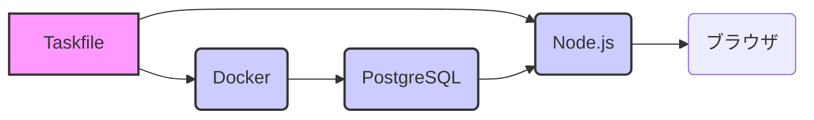
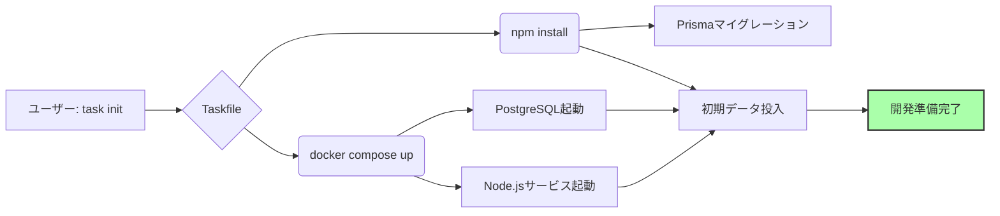

# 開発環境を整える 〜プログラミングの「キッチン」を準備しよう〜

🤔 はじめに

プログラミングを始めるのはワクワクしますが、最初の環境設定でつまずく人も多いのではないでしょうか？
必要なツールをインストールしたり、設定ファイルを編集したりするのは、まるで複雑な料理のレシピを理解するかのようです。
でも、ご安心ください！　この章では、Taskfileという便利なツールを使って、**たった5分**で開発環境を整える方法を解説します。
Taskfileを使えば、まるで魔法のように、複雑な設定を意識せずにプログラミングを始めることができます。

🏗️ アーキテクチャ図とメタファー

プログラミングの開発環境は、料理をするキッチンに例えられます。

*   **Node.js**：コンロや調理台です。プログラムを動かすための土台となります。
*   **Docker**：調理器具セットが入った箱です。必要なツールをまとめて管理します。
*   **PostgreSQL**：冷蔵庫です。データを保存しておく場所です。
*   **Taskfile**：レシピカードです。料理の手順（開発環境のセットアップ手順）が書かれています。



この図は、開発環境の全体像を表しています。Taskfileを中心に、Docker、Node.js、PostgreSQLが連携して動きます。

| コンポーネント    | 役割                                 | Task Command                      |
| :---------------- | :----------------------------------- | :-------------------------------- |
| Node.js（ノード・ジェイエス） | アプリケーションの実行環境                 | `task init` (npm install)         |
| Docker（ドッカー）    | コンテナによる環境構築と管理                 | `task init` (docker compose up)   |
| PostgreSQL（ポストグレスキューエル） | データベース                             | `task seed` (データ投入)          |
| Taskfile（タスクファイル）    | 開発作業を自動化するレシピ                 | `task init`, `task dev`, `task seed` |

💡 Taskfileの使い方

Taskfile（タスクファイル）は、開発に必要な様々なコマンドをまとめて実行できる便利なツールです。
まるで料理のレシピのように、必要な手順が順番に記述されています。

```yaml
# Taskfile.yaml (例)
version: '3'
tasks:
  init:
    cmds:
      - docker compose down --volumes --remove-orphans
      - npm ci --legacy-peer-deps
      - npx prisma migrate deploy
      - npm run seed
  dev:
    cmds:
      - docker compose up -d
      - npm run dev
  seed:
    cmds:
      - npx prisma db seed
```

上記の例では、`init`、`dev`、`seed`という3つのタスクが定義されています。
`task init`コマンドを実行すると、上記の`init`タスクに記述されたコマンドが順番に実行されます。

ターミナル（terminal）で`task --list`コマンドを実行すると、利用可能なタスクの一覧が表示されます。

```
$ task --list
init      Dockerとnpmをセットアップします
dev       開発サーバーを起動します
seed      データベースに初期データを投入します
```

このように、複雑なコマンドが`task`コマンド1つにまとまっているため、簡単に開発環境を操作できます。
この章では、主に以下の3つのコマンドを使用します。

*   `task init`：開発環境の初期設定を行います。
*   `task dev`：開発サーバーを起動します。
*   `task seed`：データベースに初期データを投入します。

👨‍💻 セットアップステップバイステップ

開発環境を構築する手順をステップごとに解説します。

**ステップ1：前提条件の確認**

まず、Node.js（ノード・ジェイエス）、npm（エヌピーエム）、Docker（ドッカー）がインストールされているか確認します。
それぞれのバージョンを確認するために、以下のコマンドをターミナルで実行してください。

```
$ node -v
v24.11.1

$ npm -v
10.9.0

$ docker --version
Docker version 27.0.0, build abcdef1
```

*   **Node.js**：JavaScriptを実行するための環境です。
*   **npm**：Node.jsのパッケージを管理するツールです。
*   **Docker**：アプリケーションをコンテナという「箱」に入れて、どこでも同じように動かすための技術です。

| ツール      | バージョン                               |
| :---------- | :------------------------------------- |
| Node.js   | v20.0.0 以上                           |
| npm       | 最新版                                 |
| Docker    | 最新版                                 |

**ステップ2：`task init`コマンドの実行**

次に、`task init`コマンドを実行して、開発環境の初期設定を行います。
このコマンドを実行すると、必要なパッケージのインストールやデータベースの初期化などが自動的に行われます。

```
$ task init
task: [init] docker compose down --volumes --remove-orphans
task: [init] npm ci --legacy-peer-deps
task: [init] npx prisma migrate deploy
task: [init] npm run seed
✓ Setup complete!
```

1行目の`docker compose down --volumes --remove-orphans`は、以前の環境を削除するコマンドです。
2行目の`npm ci --legacy-peer-deps`は、必要なNode.jsのパッケージをインストールするコマンドです。
3行目の`npx prisma migrate deploy`は、データベースのスキーマを最新の状態に更新するコマンドです。
4行目の`npm run seed`は、データベースに初期データを投入するコマンドです。

**ステップ3：`task dev`コマンドの実行**

`task dev`コマンドを実行して、開発サーバーを起動します。

```
$ task dev
task: [dev] docker compose up -d && npm run dev
...waiting for healthcheck...
> next-app@0.1.0 dev
> next dev
▲ Next.js 15.1.6
▲ Local:   http://localhost:3000
```

`localhost:3000`というメッセージが表示されたら、開発サーバーが正常に起動しています。

✅ 動作確認

開発環境が正しく設定されているか確認しましょう。

a) Docker Desktopの確認

Docker Desktopを開くと、`postgres-db`と`backend`という2つのコンテナが緑色の「Running」状態で表示されます。

```mermaid
graph LR
    A[postgres-db (Running)] --> B(backend (Running));
    style A fill:#afa,stroke:#333,stroke-width:2px
    style B fill:#afa,stroke:#333,stroke-width:2px
```

b) ブラウザでの確認

ブラウザで`http://localhost:3000`にアクセスすると、Next.jsの初期画面が表示されます。

c) データベースの確認

`task status`コマンドを実行するか、データベース管理ツールでPostgreSQLに接続して、データが正しく投入されているか確認します。

📈 アーキテクチャフロー図



この図は、`task init`コマンドが実行された際に、内部でどのような処理が行われているかを示しています。

🎯 まとめ

Taskfileを使えば、複雑な開発環境のセットアップも、たった1つのコマンドで完了します。
次のチャプターでは、Taskfileの仕組みを詳しく解説します。