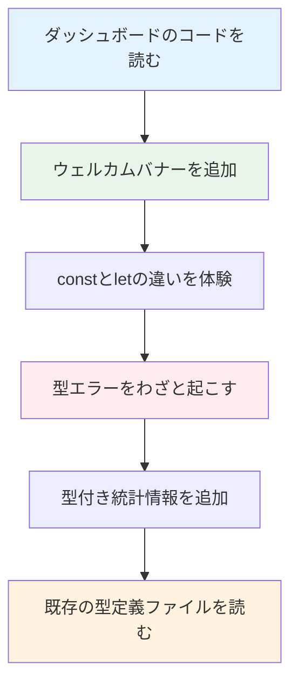

# Day 02: ダッシュボードに自分だけのメッセージを追加しよう

## 🎯 今日のゴール

ダッシュボードにウェルカムバナー（歓迎メッセージのカード）を追加します。この作業を通じて、変数（`const`/`let`）と型（`string`/`number`/`boolean`）の基本を体験します。


## 🤔 なぜこれを作るのか？

変数と型は、全てのプログラムの「土台」です。理論だけ学んでも眠くなるだけなので、実際にダッシュボードを改造しながら体で覚えましょう。

> 💡 **例え話**: 変数は「ラベル付きの箱」です。引き出しに「文房具」「おやつ」とシールを貼るように、データに名前をつけて管理します。TypeScriptの型は「箱に入れていいものの種類」を決めるルールです。

### 📐 今日の作業の流れ



### やること / やらないこと

| やること | やらないこと |
|---------|-------------|
| ダッシュボードにウェルカムバナーを追加 | 新しいページを作る |
| `const`と`let`を実際に使って違いを体験 | 理論だけの暗記 |
| 型エラーをわざと起こして読み方を学ぶ | エラーを避けて通る |
| 既存コードの型定義を読む | 型定義ファイルを新規作成する |

### 🆕 新しく学ぶ概念

| 概念 | 読み方 | 役割 | 例え |
|------|--------|------|------|
| const | コンスト | 変更できない変数を宣言する | 鍵付きの金庫。一度入れたら変えられない |
| let | レット | 変更できる変数を宣言する | 普通の引き出し。中身を自由に入れ替えられる |
| 型注釈 | かたちゅうしゃく | 変数にどんな種類のデータが入るか明示する | 箱に「文房具専用」とラベルを貼る |

## 📊 実装ステップ一覧

| ステップ | 作業内容 | 所要時間 | 触るファイル | 成功状態 |
|---------|---------|---------|-------------|---------|
| Step 1 | ダッシュボードのコードを読む | 5分 | なし（読むのみ） | コードの構造がわかる |
| Step 2 | ウェルカムメッセージの変数を作る | 5分 | dashboard/page.tsx | 変数が表示される |
| Step 3 | Cardコンポーネントでバナーにする | 5分 | dashboard/page.tsx | バナーが表示される |
| Step 4 | letに変えて違いを体験する | 4分 | dashboard/page.tsx | constが推奨な理由がわかる |
| Step 5 | 型エラーをわざと起こす | 5分 | dashboard/page.tsx | エラーメッセージが読める |
| Step 6 | 型エラーを修正する | 4分 | dashboard/page.tsx | エラーが消える |
| Step 7 | バナーに統計情報を型付きで追加 | 7分 | dashboard/page.tsx | 統計が表示される |
| Step 8 | 既存の型定義を読む（status.ts） | 5分 | なし（読むのみ） | as constの意味がわかる |
| Step 9 | 既存の型定義を読む（priority.ts） | 3分 | なし（読むのみ） | Recordの意味がわかる |

**合計時間**: 約48分

---

### Step 1: ダッシュボードのコードを読む（5分）

🎯 **ゴール**: 現在のダッシュボードがどう作られているか把握します。

VS Codeで`src/app/dashboard/page.tsx`を開いてください。先頭部分を確認しましょう。

💻 **確認するコード**:

```typescript
// filepath: src/app/dashboard/page.tsx（先頭部分・読むのみ）
'use client';

import {
  CheckCircle, ClipboardList, Clock, FolderOpen
} from 'lucide-react';
import { useRouter } from 'next/navigation';
import { AppLayout } from '@/component/layout/app-layout';
import { Badge } from '@/component/ui/badge';
import {
  Card, CardContent, CardHeader, CardTitle
} from '@/component/ui/card';
```

🔍 **コード解説**:

| コード | 意味 | 例え |
|--------|------|------|
| `'use client'` | このファイルはブラウザで動く | 「この書類は現場用」の印 |
| `import ... from` | 他のファイルから部品を持ってくる | 工具箱から道具を取り出す |
| `@/component/ui/card` | Cardコンポーネントの場所 | 「棚のUI引き出しからCardを取る」 |

✅ **確認ポイント**:
1. VS Codeで`src/app/dashboard/page.tsx`が開けた
2. `import`文でCardやBadgeを読み込んでいることが確認できた

📝 **学んだこと**: Reactのページは`import`で必要な部品を集めてから、画面を組み立てます。

---

### Step 2: ウェルカムメッセージの変数を作る（5分）

🎯 **ゴール**: `const`を使って変数を作り、画面に表示します。

`src/app/dashboard/page.tsx`を開いて、`return`文の中（`<h1>`の直前）にウェルカムメッセージを追加します。

💻 **実装**:

```typescript
// filepath: src/app/dashboard/page.tsx（return内を変更）
// ↓ この3行をreturnの<div>の先頭に追加
const greeting: string = "こんにちは！";
const userName: string = "開発者";
const message: string = `${greeting}${userName}さん`;
```

具体的には、`return`文の`<AppLayout>`の中を以下のように変更してください。

```typescript
// filepath: src/app/dashboard/page.tsx（return文の変更箇所）
  return (
    <AppLayout>
      <div className="space-y-6">
        {/* ↓ ウェルカムメッセージを追加 */}
        <p className="text-lg text-muted-foreground">
          {`こんにちは！開発者さん`}
        </p>
        <h1 className="text-3xl font-bold tracking-tight">
          ダッシュボード
        </h1>
```

🔍 **コード解説**:

| コード | 意味 | 例え |
|--------|------|------|
| `const greeting: string` | string型の変数`greeting`を宣言 | 「文房具専用」のラベル付き箱 |
| `` `${greeting}${userName}さん` `` | テンプレートリテラル（文字列の結合） | 差し込み印刷。枠に変数の値を埋め込む |
| `{message}` | JSXで変数の中身を表示する | 箱を開けて中身を見せる |

✅ **確認ポイント**:
1. ファイルを保存した（Cmd+S / Ctrl+S）
2. ブラウザで`http://localhost:3000/dashboard`を確認
3. 「こんにちは！開発者さん」と表示されている


📝 **学んだこと**: `const`で変数を宣言し、`{変数名}`でJSXに表示できます。

---

### Step 3: Cardコンポーネントでバナーにする（5分）

🎯 **ゴール**: メッセージをCardコンポーネントで囲んで、見た目を整えます。

Step 2で追加した`<p>`タグを、`Card`コンポーネントに置き換えます。

💻 **実装**:

```typescript
// filepath: src/app/dashboard/page.tsx（return文の変更箇所）
        {/* ↓ Step 2のpタグをCardに置き換え */}
        <Card className="bg-primary/5 border-primary/20">
          <CardHeader className="pb-2">
            <CardTitle className="text-lg">
              こんにちは！開発者さん 👋
            </CardTitle>
          </CardHeader>
          <CardContent>
            <p className="text-sm text-muted-foreground">
              今日もタスク管理を頑張りましょう！
            </p>
          </CardContent>
        </Card>
```

🔍 **コード解説**:

| コード | 意味 | 例え |
|--------|------|------|
| `<Card>` | カードの外枠 | 名刺のフレーム |
| `<CardHeader>` | カードの上部 | 名刺のタイトル行 |
| `<CardContent>` | カードの本文 | 名刺の本文エリア |
| `bg-primary/5` | 薄い背景色（5%の濃さ） | うっすら色がついた紙 |

✅ **確認ポイント**:
1. ブラウザでダッシュボードを確認
2. ウェルカムメッセージがカードの中に表示されている
3. 薄い背景色がついている


📝 **学んだこと**: shadcn/uiの`Card`コンポーネントで、見た目を整えられます。

---

### Step 4: letに変えて違いを体験する（4分）

🎯 **ゴール**: `const`を`let`に変えた時の違いを体験します。

CardTitleの中身を変数で管理してみましょう。`return`の前に以下を追加してください。

💻 **実装**:

```typescript
// filepath: src/app/dashboard/page.tsx（returnの直前に追加）
  // constで宣言 → 再代入しようとするとエラー
  const welcomeText = "こんにちは！開発者さん 👋";
  // welcomeText = "別のテキスト"; // ← この行のコメントを外すとエラー！

  // letで宣言 → 再代入OK
  let dynamicText = "今日もタスク管理を頑張りましょう！";
  dynamicText = "今日のタスクをチェックしましょう！"; // ← OK
```

🔍 **コード解説**:

| 宣言 | 再代入 | 使う場面 | イメージ |
|------|--------|---------|---------|
| `const` | できない | 変わらない値（名前、設定） | 鍵付きの金庫 |
| `let` | できる | 変わる値（カウンター、入力値） | 普通の引き出し |

✅ **確認ポイント**:
1. `welcomeText = "別のテキスト";`のコメントを外すと赤い波線が出る
2. エラーメッセージ「Cannot assign to 'welcomeText' because it is a constant.」が表示される
3. コメントを戻してエラーを解消する

📝 **学んだこと**: `const`は再代入できないので、うっかり値を変えてしまうミスを防げます。**迷ったら`const`を使う**のがルールです。

---

### Step 5: 型エラーをわざと起こす（5分）

🎯 **ゴール**: 型が合わないコードを書いて、TypeScriptのエラーメッセージを読む練習をします。

Step 4のコードの下に、わざと間違ったコードを追加してください。

💻 **実装**:

```typescript
// filepath: src/app/dashboard/page.tsx（returnの直前に追加）
  // わざと型エラーを起こす ↓
  const taskCount: number = "たくさん";
  // ↑ number型なのにstring値を入れている！
```

VS Codeで`"たくさん"`の部分に赤い波線が表示されるはずです。波線の上にマウスを置いて、エラーメッセージを確認してください。

🔍 **エラーメッセージの読み方**:

| エラー文（英語） | 日本語訳 | 対処法 |
|----------------|---------|--------|
| Type 'string' is not assignable to type 'number' | string型をnumber型に代入できません | 値を数値に変える、または型をstringに変える |

✅ **確認ポイント**:
1. `"たくさん"`に赤い波線が表示されている
2. マウスを置くとエラーメッセージが読める
3. エラーの意味が理解できた

📝 **学んだこと**: TypeScriptは**コードを書いた瞬間**に型の間違いを教えてくれます。実行してからバグを探す必要がありません。

---

### Step 6: 型エラーを修正する（4分）

🎯 **ゴール**: Step 5で起こした型エラーを正しく修正します。

💻 **実装**:

```typescript
// filepath: src/app/dashboard/page.tsx（Step 5のコードを修正）
  // 修正：number型には数値を入れる
  const taskCount: number = 5;

  // 他の基本型も試してみよう
  const projectName: string = "Webサイト制作";
  const isCompleted: boolean = false;
```

🔍 **基本の3つの型**:

| 型名 | 読み方 | 入れられる値 | 使う場面 |
|------|--------|------------|---------|
| `string` | ストリング | テキスト（`"文字列"`） | 名前、タイトル、メッセージ |
| `number` | ナンバー | 数値（`42`、`3.14`） | 個数、金額、スコア |
| `boolean` | ブーリアン | `true`（はい）または`false`（いいえ） | 完了/未完了、表示/非表示 |

✅ **確認ポイント**:
1. 赤い波線が消えた
2. ターミナルにエラーが出ていない
3. 3つの型（string、number、boolean）を変数で使えた

📝 **学んだこと**: 型注釈は`変数名: 型 = 値`の形式で書きます。正しい型の値を入れないとエラーになります。

---

### Step 7: バナーに統計情報を型付きで追加する（7分）

🎯 **ゴール**: ウェルカムバナーに「今日の統計」を追加し、型付き変数を実践的に使います。

既存のstats配列のすぐ下で、バナー用の統計情報を作ります。

💻 **実装**:

```typescript
// filepath: src/app/dashboard/page.tsx（stats配列の下に追加）
  // バナー用の統計サマリー
  const completionRate: number =
    totalTasks > 0
      ? Math.round((completedTasks / totalTasks) * 100)
      : 0;
  const statusText: string =
    completionRate >= 80
      ? "素晴らしい進捗です！"
      : "コツコツ進めていきましょう！";
```

次に、CardContentの中身を更新します。

```typescript
// filepath: src/app/dashboard/page.tsx（CardContent内を変更）
          <CardContent>
            <p className="text-sm text-muted-foreground">
              タスク完了率: {completionRate}%
              — {statusText}
            </p>
          </CardContent>
```

🔍 **コード解説**:

| コード | 意味 | 例え |
|--------|------|------|
| `Math.round(...)` | 小数を四捨五入 | 「23.7% → 24%」に丸める |
| `条件 ? A : B` | 三項演算子（条件分岐） | 「80%以上なら褒める、未満なら励ます」 |
| `completionRate >= 80` | 80以上か判定 | テストで80点以上かチェック |

✅ **確認ポイント**:
1. ブラウザでダッシュボードを確認
2. バナーに「タスク完了率: XX% — メッセージ」が表示されている
3. 完了率に応じてメッセージが変わることを理解できた


📝 **学んだこと**: 型付き変数と三項演算子を組み合わせて、動的なメッセージを作れます。

---

### Step 8: 既存の型定義を読む — status.ts（5分）

🎯 **ゴール**: プロジェクトで実際に使われている型定義を読み、`as const`と`Record`を理解します。

VS Codeで`src/lib/constant/status.ts`を開いてください。

💻 **確認するコード**:

```typescript
// filepath: src/lib/constant/status.ts（読むのみ）
export const TASK_STATUS = {
  TODO: 'TODO',
  IN_PROGRESS: 'IN_PROGRESS',
  IN_REVIEW: 'IN_REVIEW',
  DONE: 'DONE',
  CANCELLED: 'CANCELLED',
  BLOCKED: 'BLOCKED',
} as const;

export type TaskStatus =
  (typeof TASK_STATUS)[keyof typeof TASK_STATUS];
```

🔍 **コード解説**:

| コード | 意味 | 例え |
|--------|------|------|
| `as const` | オブジェクトの値を「固定」する | 金庫に入れて鍵をかける |
| `typeof TASK_STATUS` | オブジェクトの型を取得 | 金庫の中身リストを取り出す |
| `keyof` | オブジェクトのキー一覧を取得 | リストの「見出し」だけ取り出す |
| `export` | 他ファイルから使えるようにする | 書類を共有フォルダに入れる |

`as const`なしと`as const`ありの違い:

| 書き方 | 型 | 意味 |
|--------|-----|------|
| `{ TODO: 'TODO' }` | `{ TODO: string }` | 中身は何でもstringならOK |
| `{ TODO: 'TODO' } as const` | `{ readonly TODO: 'TODO' }` | 中身は`'TODO'`固定 |

✅ **確認ポイント**:
1. `src/lib/constant/status.ts`を開けた
2. `as const`が値を固定する仕組みがわかった
3. `TASK_STATUS`が6種類のステータスを定義していることを確認した

📝 **学んだこと**: `as const`を使うと、オブジェクトの値が「変更不可の固定値」として扱われます。

---

### Step 9: 既存の型定義を読む — priority.ts（3分）

🎯 **ゴール**: `Record`型ユーティリティの使い方を理解します。

VS Codeで`src/lib/constant/priority.ts`を開いてください。

💻 **確認するコード**:

```typescript
// filepath: src/lib/constant/priority.ts（読むのみ）
export const TASK_PRIORITY_LABELS:
  Record<TaskPriority, string> = {
  LOW: '低',
  MEDIUM: '中',
  HIGH: '高',
  URGENT: '緊急',
};
```

🔍 **コード解説**:

| コード | 意味 | 例え |
|--------|------|------|
| `Record<A, B>` | 「キーがA型、値がB型」の対応表 | 辞書。見出し語（A）と意味（B）のペア |
| `Record<TaskPriority, string>` | 優先度→日本語ラベルの対応表 | 「LOW→低、HIGH→高」の辞書 |

✅ **確認ポイント**:
1. `src/lib/constant/priority.ts`を開けた
2. `Record`が「キーと値の対応表」を表すことがわかった
3. ダッシュボードで使われている定数の定義元がわかった

📝 **学んだこと**: `Record<キー型, 値型>`で、辞書のような型を定義できます。

---

## 📋 今日のまとめ

- [ ] `const`で変数を宣言し、画面に表示できた
- [ ] `const`と`let`の違いを体験した（`const`は再代入不可）
- [ ] 型エラーをわざと起こし、エラーメッセージを読めた
- [ ] `string`、`number`、`boolean`の3つの型が使えた
- [ ] 型付きの統計情報をバナーに追加できた
- [ ] 既存コード（status.ts、priority.ts）の型定義を読めた

### 今日学んだ概念

| 概念 | まとめ |
|------|--------|
| `const` | 再代入できない変数。迷ったらこれを使う |
| `let` | 再代入できる変数。値が変わる時だけ使う |
| 型注釈 | `変数名: 型 = 値`で型を明示する書き方 |
| `string` | テキストを表す型 |
| `number` | 数値を表す型 |
| `boolean` | true/falseの2択を表す型 |
| `as const` | オブジェクトの値を固定する |
| `Record` | キーと値の対応表を表す型ユーティリティ |

## ⚠️ つまずきポイント

| エラー/問題 | 原因 | 解決方法 |
|------------|------|---------|
| `Cannot assign to 'X' because it is a constant` | `const`変数に再代入しようとした | `let`に変更するか、新しい`const`変数を作る |
| `Type 'string' is not assignable to type 'number'` | 型と値が一致しない | 値を正しい型に変える |
| 保存してもブラウザに反映されない | Hot Reloadが止まっている | ターミナルでCtrl+Cして`npm run dev`を再実行 |
| `import`に赤い波線が出る | ファイルパスが間違っている | `@/component/ui/card`のように`@/`始まりか確認 |

## 🔜 次回予告

明日はGitHubにコードを保存する方法を学びます。今日追加したウェルカムバナーの変更を、Gitで記録して、GitHubにアップロードしましょう。
