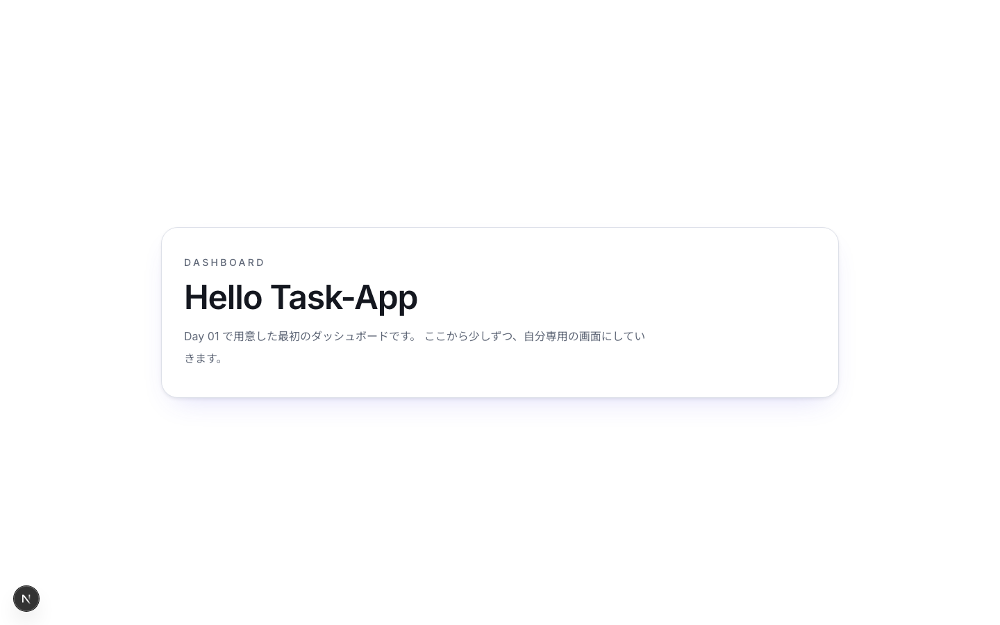
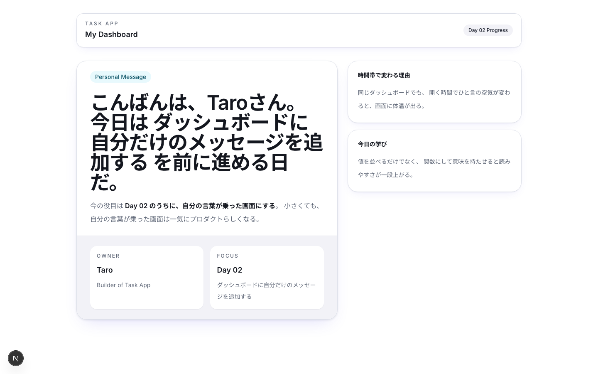

# Day 02: ダッシュボードに自分だけのメッセージを追加しよう

このカリキュラムでは、30日かけて自分専用のタスク管理アプリを作ります。Day 01 では、アプリの土台と、トップページから入れる最小のダッシュボードまで用意できました。

今日は、その土台に自分だけの情報を載せていきます。ダッシュボードに自分の名前や今日の集中テーマが表示されるだけで、画面は「教材の見本」から「自分のプロダクト」へと近づきます。

今日触るのは `src/app/dashboard/page.tsx` の1ファイルだけです。
そのぶん、
「どういう情報を持たせるか」
「どう見せるか」
「どこまでをサーバー側で動く部品（Server Component）のまま保つか」
を1ファイルの中で丁寧に見ていきます。Server Component が何なのかは、この日の後半の Before/After のところで具体的に説明します。

## この日でできるようになること

Day 01 の最後に作った最小ダッシュボードをベースにして、
「Hello Task-App」だけだった画面を自分専用のダッシュボードへ育てます。

- 画面の主役になるメッセージカードをつくれるようになる
- 自分の名前・時間帯に合ったあいさつ・今日の集中テーマなど、メッセージに意味のある情報を添えられるようになる
- design token を崩さず見た目を整えられるようになる
- いらない `"use client"` を付けないで仕上げられるようになる

ここまでやると、
次の Day で GitHub に保存するときも
「ちゃんと自分で開発している」と実感しやすいです。

【スクリーンショット】Day 02 完成時のダッシュボード






## 今日のゴール

- [ ] Day 01 の完成状態から作業を再開する
- [ ] `src/app/dashboard/page.tsx` の現在地を確認する
- [ ] 自分だけのメッセージカードをダッシュボードに追加する
- [ ] 時間帯に応じたあいさつを関数で組み立てる
- [ ] 小さな情報カードも添えて、ダッシュボードらしい密度にする
- [ ] Server Component のまま書く意味を Before/After で理解する

### 新しく学ぶ概念

| 概念 | 読み方 | 役割 | 例え |
|------|--------|------|------|
| use client | ユーズクライアント | ブラウザ側で動くと宣言する | 「窓口で記入してください」という指示 |
| const | コンスト | 変更できない変数を宣言する | 名札。一度つけたら付け替えない |
| Tailwind CSS | テイルウィンド | クラス名でスタイルを指定する CSS フレームワーク | 見た目シール |
| import / export | インポート / エクスポート | 他ファイルから部品を持ってくる / 渡す | 別の部屋から道具を借りる / 貸す |

## 前提（Day 01 完了していること）

今日は Day 01 の続きから進めます。
なので、次の状態になっていることが前提です。

- `~/workspace/task-app` みたいな自分の作業ディレクトリに `task-app` がある
- `npm install` 済みで、`npm run dev` が動く
- `src/app/globals.css` に token ベースの色や radius が入っている
- `src/app/page.tsx` から `/dashboard` に入れる
- ダッシュボードに `Hello Task-App` と出る最初の画面がある

まだこの状態になっていなければ、
先に Day 01 を完了させてから戻ってきてください。

### 新しく学ぶ概念

| 概念 | 読み方 | 役割 | 例え |
|------|--------|------|------|
| React コンポーネント | — | `export default function` で定義する画面の部品。1ファイル = 1コンポーネントが基本 | レゴの完成ブロック。他のページからも呼び出せる |
| TypeScript | タイプスクリプト | JavaScript に「型」（変数に入る値の種類）を付けた言語 | 「この箱には文字しか入れてはいけない」という注意書き付き JavaScript |
| Tailwind CSS | テイルウィンド | クラス名でスタイルを当てる CSS フレームワーク | `text-red-500` と書くだけで赤い文字になる便利ツール |

> **React のコードを初めて自分で書く日。** `export default function` や `className` は今日から何度も出てくる「定番の形」。今日はこの形に慣れるだけで OK。

## 今日の見どころ

ダッシュボードは、その日いちばん最初に見る場所です。
朝開いたときに
「今日はこれを進める日だ」
と分かる画面になっていれば、
最高です。

## 前日からの状態確認

まずは、Day 01 で作った状態を確認しましょう。
今日は新しいプロジェクトを作り直したりしません。
**昨日の続きの `task-app` を、そのまま育てる** のが今日のテーマです。

先に `http://localhost:3000` を開いて、
`ダッシュボードへ入る` ボタンから `/dashboard` に移動できることも見ておきましょう。

### 起動確認

まだ開発サーバーを立ち上げていなければ、
プロジェクトのルートで起動します。

```bash
npm run dev
```

### Day 01 直後の `src/app/dashboard/page.tsx`

この Day では、
Day 01 の最後に作った次のようなシンプルな状態から始める想定で進めます。

`~/workspace/task-app/src/app/dashboard/page.tsx` を開いて、
まずは「今ここにいるのだな」という基準を揃えましょう。

```tsx
export default function DashboardPage() {
  return (
    <main className="min-h-screen bg-background text-foreground">
      <div className="mx-auto flex min-h-screen max-w-5xl items-center justify-center px-6 py-10">
        <section className="w-full rounded-3xl border border-border bg-card px-8 py-10 shadow-md">
          <p className="text-sm font-medium uppercase tracking-[0.24em] text-muted-foreground">
            Dashboard
          </p>
          <h1 className="mt-4 text-4xl font-semibold tracking-tight text-card-foreground sm:text-5xl">
            Hello Task-App
          </h1>
          <p className="mt-4 max-w-2xl text-base leading-8 text-muted-foreground">
            Day 01 で立ち上げた最初のダッシュボードだ。
            ここから少しずつ、自分専用の画面に育てていこう。
          </p>
        </section>
      </div>
    </main>
  );
}
```

この時点では、まだ「アプリの入れ物」ができただけの状態です。今日はここに、自分の名前と「今日は何に集中するか」というメッセージを入れていきます。

## Step 1: 自分だけのメッセージを、まず1枚のカードにする

いきなり情報を盛りすぎると見失いやすいです。
なので最初は、**主役のメッセージカード1枚だけ** を作ります。

ここで入れるのは次の3つです。

- 誰のダッシュボードなのか
- 今日は何に集中したいのか
- 開いた瞬間に気分が上がる一言

### 編集アンカー

`~/workspace/task-app/src/app/dashboard/page.tsx` を開いて、
**ファイルの先頭から最後まで全部置き換える**。

Day 01 と同じで、
この段階は部分修正より丸ごと差し替えたほうが流れを掴みやすいです。

```tsx
const ownerName = 'Taro';
const focusTheme = 'Day 02 のダッシュボードづくり';
const encouragement = '今日の一歩が、そのまま自分のアプリの顔になる。';

export default function DashboardPage() {
  return (
    <main className="min-h-screen bg-background text-foreground">
      <div className="mx-auto flex min-h-screen max-w-6xl flex-col px-6 py-8 lg:px-10">
        <header className="flex flex-col gap-3 rounded-2xl border border-border bg-card px-5 py-4 shadow-sm sm:flex-row sm:items-center sm:justify-between">
          <div className="space-y-1">
            <p className="text-xs font-medium uppercase tracking-[0.24em] text-muted-foreground">
              Task App
            </p>
            <h1 className="text-lg font-semibold text-card-foreground">
              My Dashboard
            </h1>
          </div>

          <div className="inline-flex w-fit items-center rounded-full bg-secondary px-3 py-1.5 text-xs font-medium text-secondary-foreground">
            Day 02 Progress
          </div>
        </header>

        <section className="mt-8 grid gap-6 lg:grid-cols-[1.2fr_0.8fr]">
```

**確認ポイント**: ここまで写経できました。次のブロックを続けて書きます。

```tsx
          <article className="overflow-hidden rounded-3xl border border-border bg-card shadow-md">
            <div className="border-b border-border px-8 py-6">
              <span className="inline-flex items-center rounded-full bg-accent px-3 py-1 text-sm font-medium text-accent-foreground">
                Personal Message
              </span>

              <h2 className="mt-6 text-4xl font-semibold tracking-tight text-card-foreground sm:text-5xl">
                こんにちは、{ownerName}さん。
              </h2>

              <p className="mt-4 max-w-2xl text-base leading-8 text-muted-foreground">
                今日の集中テーマは
                <span className="font-semibold text-foreground"> {focusTheme}</span>
                だ。
                この1枚から、自分だけのダッシュボードを育てていこう。
              </p>
            </div>

            <div className="bg-secondary px-8 py-6">
              <p className="text-sm leading-8 text-secondary-foreground">
                {encouragement}
              </p>
            </div>
          </article>
```

**確認ポイント**: ここまで写経できました。次のブロックを続けて書きます。

```tsx
          <aside className="space-y-4">
            <article className="rounded-3xl border border-border bg-card p-6 shadow-sm">
              <p className="text-sm font-semibold text-card-foreground">
                今日の狙い
              </p>
              <p className="mt-4 text-sm leading-8 text-muted-foreground">
                ただの見出しではなく、
                開いた瞬間に「これは自分の画面や」と分かるメッセージを置く。
              </p>
            </article>

            <article className="rounded-3xl border border-border bg-card p-6 shadow-sm">
              <p className="text-sm font-semibold text-card-foreground">
                今の変化
              </p>
              <p className="mt-4 text-sm leading-8 text-muted-foreground">
                `Hello Task-App` から、
                自分の名前と今日のテーマが見えるダッシュボードへ進んだ。
              </p>
            </article>
          </aside>
        </section>
      </div>
```

**確認ポイント**: ここまで写経できました。次のブロックを続けて書きます。

```tsx
    </main>
  );
}
```

### ここで見てほしいポイント

- `ownerName` みたいに、意味のある名前で文字列を置いている
- `bg-card` や `text-muted-foreground` を使って、Day 01 の token 設計に乗っている
- まだ `"use client"` は付けていない

この段階で大事なのは、
**何のための値かが名前から分かる** 状態にすることです。

### ブラウザ確認

- 見出しが `Hello Task-App` から変わっている
- `こんにちは、Taroさん。` が主役として見える
- 右側に小さな補助カードが2枚並ぶ

> `Taro` はサンプルの名前です。`ownerName`（このあとの Step では `dashboardOwner.name`）の値を自分の名前に書き換えると、あいさつもその名前で表示されます。

## Step 2: 時間帯に合うあいさつを関数で組み立てる

次は、
メッセージをただベタ書きするんじゃなくて、
**時間帯に合わせて少しだけ表情が変わる** ようにします。

朝なら「おはよう」、
昼なら「こんにちは」、
夜なら「こんばんは」。
この分岐は小さいけど、
「その場に文字列を直書きし続ける」状態から抜ける最初の練習になります。

### 編集アンカー

同じく `~/workspace/task-app/src/app/dashboard/page.tsx` を開いて、
**ファイル全体を次の内容に置き換える**。

```tsx
type DashboardOwner = {
  name: string;
  role: string;
  todayFocus: string;
  todayGoal: string;
};

const dashboardOwner: DashboardOwner = {
  name: 'Taro',
  role: 'Builder of Task App',
  todayFocus: 'ダッシュボードに自分だけのメッセージを追加する',
  todayGoal: 'Day 02 のうちに、自分の言葉が乗った画面にする',
};

function getGreetingByHour(hour: number): string {
  if (hour < 12) {
    return 'おはよう';
  }

  if (hour < 18) {
    return 'こんにちは';
  }

  return 'こんばんは';
```

**確認ポイント**: ここまで写経できました。次のブロックを続けて書きます。

```tsx
}

function buildMainMessage(owner: DashboardOwner, hour: number): string {
  const greeting = getGreetingByHour(hour);

  return `${greeting}、${owner.name}さん。今日は ${owner.todayFocus} を前に進める日だ。`;
}

export default function DashboardPage() {
  const currentHour = new Date().getHours();
  const mainMessage = buildMainMessage(dashboardOwner, currentHour);

  return (
    <main className="min-h-screen bg-background text-foreground">
      <div className="mx-auto flex min-h-screen max-w-6xl flex-col px-6 py-8 lg:px-10">
        <header className="flex flex-col gap-3 rounded-2xl border border-border bg-card px-5 py-4 shadow-sm sm:flex-row sm:items-center sm:justify-between">
          <div className="space-y-1">
            <p className="text-xs font-medium uppercase tracking-[0.24em] text-muted-foreground">
              Task App
            </p>
            <h1 className="text-lg font-semibold text-card-foreground">
              My Dashboard
            </h1>
          </div>
```

**確認ポイント**: ここまで写経できました。次のブロックを続けて書きます。

```tsx
          <div className="inline-flex w-fit items-center rounded-full bg-secondary px-3 py-1.5 text-xs font-medium text-secondary-foreground">
            Day 02 Progress
          </div>
        </header>

        <section className="mt-8 grid gap-6 lg:grid-cols-[1.2fr_0.8fr]">
          <article className="overflow-hidden rounded-3xl border border-border bg-card shadow-md">
            <div className="border-b border-border px-8 py-6">
              <span className="inline-flex items-center rounded-full bg-accent px-3 py-1 text-sm font-medium text-accent-foreground">
                Personal Message
              </span>

              <h2 className="mt-6 text-4xl font-semibold tracking-tight text-card-foreground sm:text-5xl">
                {mainMessage}
              </h2>

              <p className="mt-4 max-w-2xl text-base leading-8 text-muted-foreground">
                今の役目は
                <span className="font-semibold text-foreground"> {dashboardOwner.todayGoal}</span>
                。
                小さくても、自分の言葉が乗った画面は一気にプロダクトらしくなる。
              </p>
            </div>
```

**確認ポイント**: ここまで写経できました。次のブロックを続けて書きます。

```tsx
            <div className="grid gap-4 bg-secondary px-8 py-6 sm:grid-cols-2">
              <div className="rounded-2xl bg-background px-4 py-4 shadow-xs">
                <p className="text-xs font-medium uppercase tracking-[0.18em] text-muted-foreground">
                  Owner
                </p>
                <p className="mt-3 text-lg font-semibold text-foreground">
                  {dashboardOwner.name}
                </p>
                <p className="mt-2 text-sm leading-7 text-muted-foreground">
                  {dashboardOwner.role}
                </p>
              </div>

              <div className="rounded-2xl bg-background px-4 py-4 shadow-xs">
                <p className="text-xs font-medium uppercase tracking-[0.18em] text-muted-foreground">
                  Focus
                </p>
                <p className="mt-3 text-lg font-semibold text-foreground">
                  Day 02
                </p>
                <p className="mt-2 text-sm leading-7 text-muted-foreground">
                  {dashboardOwner.todayFocus}
                </p>
```

**確認ポイント**: ここまで写経できました。次のブロックを続けて書きます。

```tsx
              </div>
            </div>
          </article>

          <aside className="space-y-4">
            <article className="rounded-3xl border border-border bg-card p-6 shadow-sm">
              <p className="text-sm font-semibold text-card-foreground">
                時間帯で変わる理由
              </p>
              <p className="mt-4 text-sm leading-8 text-muted-foreground">
                同じダッシュボードでも、
                開く時間でひと言の空気が変わると、画面に体温が出る。
              </p>
            </article>

            <article className="rounded-3xl border border-border bg-card p-6 shadow-sm">
              <p className="text-sm font-semibold text-card-foreground">
                今日の学び
              </p>
              <p className="mt-4 text-sm leading-8 text-muted-foreground">
                値を並べるだけでなく、
                関数にして意味を持たせると読みやすさが一段上がる。
              </p>
            </article>
```

**確認ポイント**: ここまで写経できました。次のブロックを続けて書きます。

```tsx
          </aside>
        </section>
      </div>
    </main>
  );
}
```

### この段階で入った考え方

- `DashboardOwner` という型で、どんな情報を持たせるか先に決めた
- `getGreetingByHour` が、時間帯ごとのルールを引き受けている
- `buildMainMessage` が、メッセージの組み立て役になっている

こうしておくと、
後で名前や肩書きや集中テーマを変えたくなっても、
どこを触ればよいか見失いにくいです。

## Step 3: メッセージの横に、ダッシュボードらしい情報を添える

主役のメッセージができたら、その横に小さな情報カードを添えていきます。

ここで狙うのは、本格的なレポート機能を先取りすることではありません。**メッセージカードが1枚だけ浮いて見えないように、ダッシュボード全体としてまとまって見える**ようにすることです。

今日は次の3種類のカードを置きます。

- いまの役割
- 今日のフォーカス
- 次にやること

### 編集アンカー

もう一度 `~/workspace/task-app/src/app/dashboard/page.tsx` 全体を置き換えます。
この Step が、Day 02 の完成版になります。

```tsx
type DashboardOwner = {
  name: string;
  role: string;
  todayFocus: string;
  todayGoal: string;
  nextAction: string;
};

type FocusCard = {
  label: string;
  value: string;
  description: string;
};

const dashboardOwner: DashboardOwner = {
  name: 'Taro',
  role: 'Builder of Task App',
  todayFocus: 'ダッシュボードに自分だけのメッセージを追加する',
  todayGoal: '教材の見本ではなく、自分の画面として立つ一枚にする',
  nextAction: 'Day 03 で GitHub に保存できる状態まで持っていく',
};

function getGreetingByHour(hour: number): string {
  if (hour < 12) {
```

**確認ポイント**: ここまで写経できました。次のブロックを続けて書きます。

```tsx
    return 'おはよう';
  }

  if (hour < 18) {
    return 'こんにちは';
  }

  return 'こんばんは';
}

function buildMainMessage(owner: DashboardOwner, hour: number): string {
  const greeting = getGreetingByHour(hour);

  return `${greeting}、${owner.name}さん。今日は ${owner.todayFocus} を前に進める日だ。`;
}

export default function DashboardPage() {
  const currentHour = new Date().getHours();
  const mainMessage = buildMainMessage(dashboardOwner, currentHour);
  const focusCards: FocusCard[] = [
    {
      label: 'Owner',
      value: dashboardOwner.name,
      description: dashboardOwner.role,
```

**確認ポイント**: ここまで写経できました。次のブロックを続けて書きます。

```tsx
    },
    {
      label: 'Today',
      value: 'Day 02',
      description: dashboardOwner.todayGoal,
    },
    {
      label: 'Next',
      value: 'Day 03',
      description: dashboardOwner.nextAction,
    },
  ];

  return (
    <main className="min-h-screen bg-background text-foreground">
      <div className="mx-auto flex min-h-screen max-w-6xl flex-col px-6 py-8 lg:px-10">
        <header className="flex flex-col gap-3 rounded-2xl border border-border bg-card px-5 py-4 shadow-sm sm:flex-row sm:items-center sm:justify-between">
          <div className="space-y-1">
            <p className="text-xs font-medium uppercase tracking-[0.24em] text-muted-foreground">
              Task App
            </p>
            <h1 className="text-lg font-semibold text-card-foreground">
              My Dashboard
            </h1>
```

**確認ポイント**: ここまで写経できました。次のブロックを続けて書きます。

```tsx
          </div>

          <div className="inline-flex w-fit items-center rounded-full bg-secondary px-3 py-1.5 text-xs font-medium text-secondary-foreground">
            Personalized Message Ready
          </div>
        </header>

        <section className="mt-8 grid gap-6 lg:grid-cols-[1.2fr_0.8fr]">
          <article className="overflow-hidden rounded-3xl border border-border bg-card shadow-md">
            <div className="border-b border-border px-8 py-6">
              <span className="inline-flex items-center rounded-full bg-accent px-3 py-1 text-sm font-medium text-accent-foreground">
                Personal Message
              </span>

              <h2 className="mt-6 max-w-4xl text-4xl font-semibold tracking-tight text-card-foreground sm:text-5xl">
                {mainMessage}
              </h2>

              <p className="mt-4 max-w-2xl text-base leading-8 text-muted-foreground">
                今日は
                <span className="font-semibold text-foreground"> {dashboardOwner.todayGoal}</span>
                を意識して進める。
                ただ文字を置くのではなくて、
                ダッシュボードに自分の意図が見える状態を作るのが狙いだ。
```

**確認ポイント**: ここまで写経できました。次のブロックを続けて書きます。

```tsx
              </p>

              <div className="mt-8 inline-flex items-center rounded-full bg-primary px-4 py-2 text-sm font-semibold text-primary-foreground shadow-sm">
                Focus: {dashboardOwner.todayFocus}
              </div>
            </div>

            <div className="grid gap-4 bg-secondary px-8 py-6 md:grid-cols-3">
              {focusCards.map((card) => (
                <article
                  key={card.label}
                  className="rounded-2xl border border-border bg-background px-4 py-4 shadow-xs"
                >
                  <p className="text-xs font-medium uppercase tracking-[0.18em] text-muted-foreground">
                    {card.label}
                  </p>
                  <p className="mt-3 text-lg font-semibold text-foreground">
                    {card.value}
                  </p>
                  <p className="mt-2 text-sm leading-7 text-muted-foreground">
                    {card.description}
                  </p>
                </article>
              ))}
```

**確認ポイント**: ここまで写経できました。次のブロックを続けて書きます。

```tsx
            </div>
          </article>

          <aside className="space-y-4">
            <article className="rounded-3xl border border-border bg-card p-6 shadow-sm">
              <p className="text-sm font-semibold text-card-foreground">
                今日のワンフレーズ
              </p>
              <p className="mt-4 text-sm leading-8 text-muted-foreground">
                自分の名前が入るだけでも、
                ダッシュボードは急に「使う画面」に変わる。
              </p>
            </article>

            <article className="rounded-3xl border border-border bg-card p-6 shadow-sm">
              <p className="text-sm font-semibold text-card-foreground">
                ここで増えた価値
              </p>
              <p className="mt-4 text-sm leading-8 text-muted-foreground">
                画面の主役が明確になって、
                次にタスク数やプロジェクト情報を足す余地も見えやすくなった。
              </p>
            </article>

```

**確認ポイント**: ここまで写経できました。次のブロックを続けて書きます。

```tsx
            <article className="rounded-3xl border border-border bg-card p-6 shadow-sm">
              <p className="text-sm font-semibold text-card-foreground">
                次につながる視点
              </p>
              <p className="mt-4 text-sm leading-8 text-muted-foreground">
                Day 03 ではこの変化を失わないように、
                ちゃんと履歴として残していく段階へ進む。
              </p>
            </article>
          </aside>
        </section>
      </div>
    </main>
  );
}
```

### 完成版で見てほしいこと

- 主役は大きいメッセージカードに集約されている
- 補助情報は `focusCards` 配列に寄せている
- 色は token 名で読めるようにしている
- 動きがない画面なので Server Component のまま保っている

ここまで来たら、Day 02 の狙いはちゃんと達成できています。

## Step 4: 保存して、ブラウザで「自分の画面」に変わったか確認する

仕上げたら、
ブラウザで見直しましょう。

もし開発サーバーを止めているなら、
もう一度起動します。

```bash
npm run dev
```

### チェックポイント

- メイン見出しが時間帯によって変わる
- `Taro` の名前が画面に出る
- `Focus:` のバッジが `bg-primary`（メインカラー）で表示されている
- 下段に `Owner` `Today` `Next` の3カードがある
- 右側の補助カードまで含めて、画面全体が「ダッシュボード」として見える

### うまくいかないときの見直し順

1. `src/app/dashboard/page.tsx` を途中だけ貼り換えていないか確認する
2. 文字列のクオートやバッククオートを打ち間違えていないか見る
3. `focusCards.map` の丸かっこや波かっこの閉じ忘れがないか見る
4. 一度保存してからブラウザを再読み込みする

## Pro パターンで書こう — ダッシュボードのメッセージは Server Component を標準にする

ここからの「Pro パターン」は、すでに動いているコードを、実務でよく使われる「より良い書き方」に近づけるための解説コーナーです。各 Day に用意しています。写経は必須でないものの、なぜその書き方が好まれるのかを **Before/After** で見比べておくと、これからの理解がぐっと深まります。

今日の文脈で言うと、
「自分だけのメッセージを表示したい」というだけなら、
ブラウザで状態を持つ必要はありません。
なのに最初から `"use client"` を付けると、
必要ない JavaScript まで配る方向に寄っていきます。

### Before（動くけど、プロは書かない）

```tsx
'use client';

import { useMemo } from 'react';

type DashboardOwner = {
  name: string;
  role: string;
  todayFocus: string;
  todayGoal: string;
  nextAction: string;
};

type FocusCard = {
  label: string;
  value: string;
  description: string;
};

const dashboardOwner: DashboardOwner = {
  name: 'Taro',
  role: 'Builder of Task App',
  todayFocus: 'ダッシュボードに自分だけのメッセージを追加する',
  todayGoal: '教材の見本ではなく、自分の画面として立つ一枚にする',
  nextAction: 'Day 03 で GitHub に保存できる状態まで持っていく',
```

**読み比べ用**: ここは写経しません。続けてコードを読み進めましょう。

```tsx
};

function getGreetingByHour(hour: number): string {
  if (hour < 12) {
    return 'おはよう';
  }

  if (hour < 18) {
    return 'こんにちは';
  }

  return 'こんばんは';
}

function buildMainMessage(owner: DashboardOwner, hour: number): string {
  const greeting = getGreetingByHour(hour);

  return `${greeting}、${owner.name}さん。今日は ${owner.todayFocus} を前に進める日だ。`;
}

export default function DashboardPage() {
  const currentHour = new Date().getHours();
  const mainMessage = useMemo(() => {
    return buildMainMessage(dashboardOwner, currentHour);
```

**読み比べ用**: ここは写経しません。続けてコードを読み進めましょう。

```tsx
  }, [currentHour]);
  const focusCards: FocusCard[] = [
    {
      label: 'Owner',
      value: dashboardOwner.name,
      description: dashboardOwner.role,
    },
    {
      label: 'Today',
      value: 'Day 02',
      description: dashboardOwner.todayGoal,
    },
    {
      label: 'Next',
      value: 'Day 03',
      description: dashboardOwner.nextAction,
    },
  ];

  return (
    <main className="min-h-screen bg-background text-foreground">
      <div className="mx-auto flex min-h-screen max-w-6xl flex-col px-6 py-8 lg:px-10">
        <header className="flex flex-col gap-3 rounded-2xl border border-border bg-card px-5 py-4 shadow-sm sm:flex-row sm:items-center sm:justify-between">
          <div className="space-y-1">
```

**読み比べ用**: ここは写経しません。続けてコードを読み進めましょう。

```tsx
            <p className="text-xs font-medium uppercase tracking-[0.24em] text-muted-foreground">
              Task App
            </p>
            <h1 className="text-lg font-semibold text-card-foreground">
              My Dashboard
            </h1>
          </div>

          <div className="inline-flex w-fit items-center rounded-full bg-secondary px-3 py-1.5 text-xs font-medium text-secondary-foreground">
            Personalized Message Ready
          </div>
        </header>

        <section className="mt-8 grid gap-6 lg:grid-cols-[1.2fr_0.8fr]">
          <article className="overflow-hidden rounded-3xl border border-border bg-card shadow-md">
            <div className="border-b border-border px-8 py-6">
              <span className="inline-flex items-center rounded-full bg-accent px-3 py-1 text-sm font-medium text-accent-foreground">
                Personal Message
              </span>

              <h2 className="mt-6 max-w-4xl text-4xl font-semibold tracking-tight text-card-foreground sm:text-5xl">
                {mainMessage}
              </h2>

```

**読み比べ用**: ここは写経しません。続けてコードを読み進めましょう。

```tsx
              <p className="mt-4 max-w-2xl text-base leading-8 text-muted-foreground">
                今日は
                <span className="font-semibold text-foreground"> {dashboardOwner.todayGoal}</span>
                を意識して進める。
                ただ文字を置くのではなくて、
                ダッシュボードに自分の意図が見える状態を作るのが狙いだ。
              </p>

              <div className="mt-8 inline-flex items-center rounded-full bg-primary px-4 py-2 text-sm font-semibold text-primary-foreground shadow-sm">
                Focus: {dashboardOwner.todayFocus}
              </div>
            </div>

            <div className="grid gap-4 bg-secondary px-8 py-6 md:grid-cols-3">
              {focusCards.map((card) => (
                <article
                  key={card.label}
                  className="rounded-2xl border border-border bg-background px-4 py-4 shadow-xs"
                >
                  <p className="text-xs font-medium uppercase tracking-[0.18em] text-muted-foreground">
                    {card.label}
                  </p>
                  <p className="mt-3 text-lg font-semibold text-foreground">
                    {card.value}
```

**読み比べ用**: ここは写経しません。続けてコードを読み進めましょう。

```tsx
                  </p>
                  <p className="mt-2 text-sm leading-7 text-muted-foreground">
                    {card.description}
                  </p>
                </article>
              ))}
            </div>
          </article>

          <aside className="space-y-4">
            <article className="rounded-3xl border border-border bg-card p-6 shadow-sm">
              <p className="text-sm font-semibold text-card-foreground">
                今日のワンフレーズ
              </p>
              <p className="mt-4 text-sm leading-8 text-muted-foreground">
                自分の名前が入るだけでも、
                ダッシュボードは急に「使う画面」に変わる。
              </p>
            </article>

            <article className="rounded-3xl border border-border bg-card p-6 shadow-sm">
              <p className="text-sm font-semibold text-card-foreground">
                ここで増えた価値
              </p>
```

**読み比べ用**: ここは写経しません。続けてコードを読み進めましょう。

```tsx
              <p className="mt-4 text-sm leading-8 text-muted-foreground">
                画面の主役が明確になって、
                次にタスク数やプロジェクト情報を足す余地も見えやすくなった。
              </p>
            </article>

            <article className="rounded-3xl border border-border bg-card p-6 shadow-sm">
              <p className="text-sm font-semibold text-card-foreground">
                次につながる視点
              </p>
              <p className="mt-4 text-sm leading-8 text-muted-foreground">
                Day 03 ではこの変化を失わないように、
                ちゃんと履歴として残していく段階へ進む。
              </p>
            </article>
          </aside>
        </section>
      </div>
    </main>
  );
}
```

**このコードの問題点**:

- メッセージ表示だけのために page 全体を Client Component にしてしまっている
- `useMemo`（計算結果を覚えておいて、不要な再計算を減らすための React の仕組み）を使っているが、ここでは計算がとても軽いため効果はほとんどなく、読み手の負担だけが増えてしまう
- 後で本当に client 化が必要な部品を足したとき、境界が曖昧になって設計がぶれやすい

### After（プロが書くコード）

```tsx
// filepath: src/app/dashboard/page.tsx
type DashboardOwner = {
  name: string;
  role: string;
  todayFocus: string;
  todayGoal: string;
  nextAction: string;
};

type FocusCard = {
  label: string;
  value: string;
  description: string;
};

const dashboardOwner: DashboardOwner = {
  name: 'Taro',
  role: 'Builder of Task App',
  todayFocus: 'ダッシュボードに自分だけのメッセージを追加する',
  todayGoal: '教材の見本ではなく、自分の画面として立つ一枚にする',
  nextAction: 'Day 03 で GitHub に保存できる状態まで持っていく',
};

function getGreetingByHour(hour: number): string {
  if (hour < 12) {
```

**読み比べ用**: ここは写経しません。続けてコードを読み進めましょう。

```tsx
// filepath: 続き
    return 'おはよう';
  }

  if (hour < 18) {
    return 'こんにちは';
  }

  return 'こんばんは';
}

function buildMainMessage(owner: DashboardOwner, hour: number): string {
  const greeting = getGreetingByHour(hour);

  return `${greeting}、${owner.name}さん。今日は ${owner.todayFocus} を前に進める日だ。`;
}

export default function DashboardPage() {
  const currentHour = new Date().getHours();
  const mainMessage = buildMainMessage(dashboardOwner, currentHour);
  const focusCards: FocusCard[] = [
    {
      label: 'Owner',
      value: dashboardOwner.name,
      description: dashboardOwner.role,
```

**読み比べ用**: ここは写経しません。続けてコードを読み進めましょう。

```tsx
// filepath: 続き
    },
    {
      label: 'Today',
      value: 'Day 02',
      description: dashboardOwner.todayGoal,
    },
    {
      label: 'Next',
      value: 'Day 03',
      description: dashboardOwner.nextAction,
    },
  ];

  return (
    <main className="min-h-screen bg-background text-foreground">
      <div className="mx-auto flex min-h-screen max-w-6xl flex-col px-6 py-8 lg:px-10">
        <header className="flex flex-col gap-3 rounded-2xl border border-border bg-card px-5 py-4 shadow-sm sm:flex-row sm:items-center sm:justify-between">
          <div className="space-y-1">
            <p className="text-xs font-medium uppercase tracking-[0.24em] text-muted-foreground">
              Task App
            </p>
            <h1 className="text-lg font-semibold text-card-foreground">
              My Dashboard
            </h1>
```

**読み比べ用**: ここは写経しません。続けてコードを読み進めましょう。

```tsx
// filepath: 続き
          </div>

          <div className="inline-flex w-fit items-center rounded-full bg-secondary px-3 py-1.5 text-xs font-medium text-secondary-foreground">
            Personalized Message Ready
          </div>
        </header>

        <section className="mt-8 grid gap-6 lg:grid-cols-[1.2fr_0.8fr]">
          <article className="overflow-hidden rounded-3xl border border-border bg-card shadow-md">
            <div className="border-b border-border px-8 py-6">
              <span className="inline-flex items-center rounded-full bg-accent px-3 py-1 text-sm font-medium text-accent-foreground">
                Personal Message
              </span>

              <h2 className="mt-6 max-w-4xl text-4xl font-semibold tracking-tight text-card-foreground sm:text-5xl">
                {mainMessage}
              </h2>

              <p className="mt-4 max-w-2xl text-base leading-8 text-muted-foreground">
                今日は
                <span className="font-semibold text-foreground"> {dashboardOwner.todayGoal}</span>
                を意識して進める。
                ただ文字を置くのではなくて、
                ダッシュボードに自分の意図が見える状態を作るのが狙いだ。
```

**読み比べ用**: ここは写経しません。続けてコードを読み進めましょう。

```tsx
// filepath: 続き
              </p>

              <div className="mt-8 inline-flex items-center rounded-full bg-primary px-4 py-2 text-sm font-semibold text-primary-foreground shadow-sm">
                Focus: {dashboardOwner.todayFocus}
              </div>
            </div>

            <div className="grid gap-4 bg-secondary px-8 py-6 md:grid-cols-3">
              {focusCards.map((card) => (
                <article
                  key={card.label}
                  className="rounded-2xl border border-border bg-background px-4 py-4 shadow-xs"
                >
                  <p className="text-xs font-medium uppercase tracking-[0.18em] text-muted-foreground">
                    {card.label}
                  </p>
                  <p className="mt-3 text-lg font-semibold text-foreground">
                    {card.value}
                  </p>
                  <p className="mt-2 text-sm leading-7 text-muted-foreground">
                    {card.description}
                  </p>
                </article>
              ))}
```

**読み比べ用**: ここは写経しません。続けてコードを読み進めましょう。

```tsx
// filepath: 続き
            </div>
          </article>

          <aside className="space-y-4">
            <article className="rounded-3xl border border-border bg-card p-6 shadow-sm">
              <p className="text-sm font-semibold text-card-foreground">
                今日のワンフレーズ
              </p>
              <p className="mt-4 text-sm leading-8 text-muted-foreground">
                自分の名前が入るだけでも、
                ダッシュボードは急に「使う画面」に変わる。
              </p>
            </article>

            <article className="rounded-3xl border border-border bg-card p-6 shadow-sm">
              <p className="text-sm font-semibold text-card-foreground">
                ここで増えた価値
              </p>
              <p className="mt-4 text-sm leading-8 text-muted-foreground">
                画面の主役が明確になって、
                次にタスク数やプロジェクト情報を足す余地も見えやすくなった。
              </p>
            </article>

```

**読み比べ用**: ここは写経しません。続けてコードを読み進めましょう。

```tsx
// filepath: 続き
            <article className="rounded-3xl border border-border bg-card p-6 shadow-sm">
              <p className="text-sm font-semibold text-card-foreground">
                次につながる視点
              </p>
              <p className="mt-4 text-sm leading-8 text-muted-foreground">
                Day 03 ではこの変化を失わないように、
                ちゃんと履歴として残していく段階へ進む。
              </p>
            </article>
          </aside>
        </section>
      </div>
    </main>
  );
}
```

**このコードの強み**:

- 表示だけなら Server Component のままで十分だと判断できている
- page の責務が「データを組み立てて UI を返す」に収まっていて読みやすい
- 本当に操作が必要になったときだけ、小さい部品を Client Component に切り出しやすい

#### 覚えておきたいエッセンス

ダッシュボードにメッセージを出すだけなら、
**まず Server Component** が基本です。

最初から page 全体を client 化するのではなくて、
本当にブラウザ側の操作が必要な瞬間だけ client を足します。
この順番が、あとで効いてきます。

## 今日手に入れたもの

今日の本質は、
**ダッシュボードの主役を決めて、その主役に意味のある情報を添えた**
ことです。

覚えておきたいのは、次の3つです。

- 自分専用の画面づくりは、「誰の画面で、今日は何に集中するのか」が見えるようにするところから始まる
- 値はその場に直接書き散らすより、型（`type`）や関数にまとめて意味を持たせたほうが、あとから変更しやすい
- クリックなどの操作がない画面は、無理に Client Component にせず、Server Component のままにしておく

この3つが入るだけで、
Day 02 のコードはかなり「プロダクトを育てる書き方」に近づきます。
## 明日のプレビュー

Day 03 では、
今日つくったこの変化をちゃんと履歴として残していきます。

せっかく自分の画面が立ち始めたのに、
ローカルだけで消えてしまったらもったいないです。

次は GitHub に保存して、
「自分で育てたアプリの進化」を積み上げていける状態にしていきましょう。
