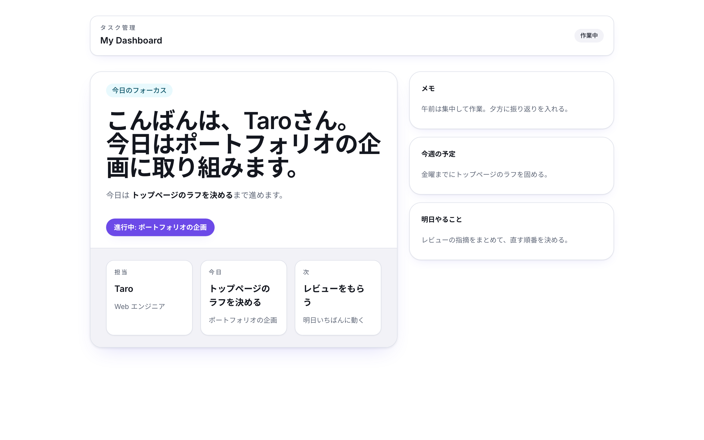
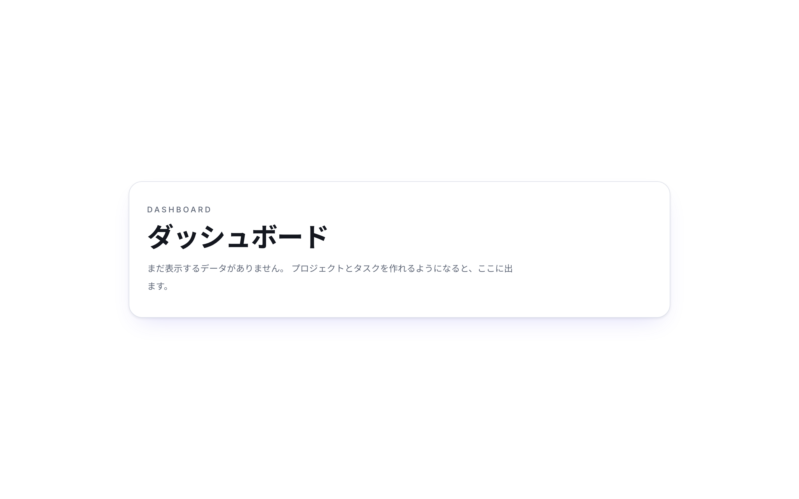
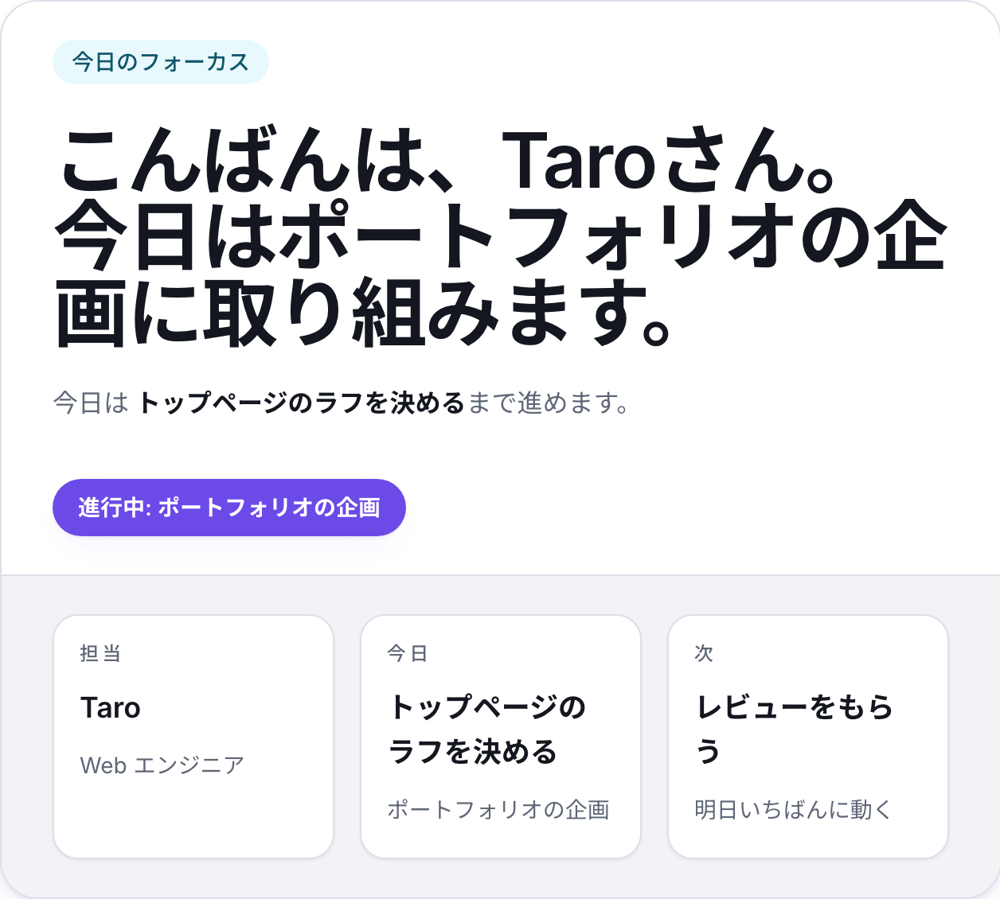

# Day 02: ダッシュボードに自分だけのメッセージを追加しよう

このカリキュラムでは、30日かけて自分専用のタスク管理アプリを作ります。Day 01 では、アプリの土台と、トップページから入れる最小のダッシュボードまで用意できました。

今日は、その土台に自分だけの情報を載せていきます。ダッシュボードに自分の名前や今日の集中テーマが表示されるだけで、画面は「教材の見本」から「自分のプロダクト」へと近づきます。

今日触るのは `src/app/dashboard/page.tsx` の1ファイルだけです。
そのぶん、
「どういう情報を持たせるか」
「どう見せるか」
「どこまでをサーバー側で動く部品（Server Component）のまま保つか」
を1ファイルの中で丁寧に見ていきます。Server Component が何なのかは、この日の後半の Before/After のところで具体的に説明します。

## この日でできるようになること

Day 01 の最後に作った最小ダッシュボードをベースにして、
「Hello Task-App」だけだった画面を自分専用のダッシュボードへ育てます。

- 画面の主役になるメッセージカードをつくれるようになる
- 自分の名前・時刻から選ばれるあいさつ・今日の集中テーマなど、メッセージに意味のある情報を添えられるようになる
- design token を崩さず見た目を整えられるようになる
- いらない `"use client"` を付けないで仕上げられるようになる

ここまでやると、
次の Day で GitHub に保存するときも
「ちゃんと自分で開発している」と実感しやすいです。

【スクリーンショット】Day 02 完成時のダッシュボード






## 今日のゴール

- [ ] Day 01 の完成状態から作業を再開する
- [ ] `src/app/dashboard/page.tsx` の現在地を確認する
- [ ] 自分だけのメッセージカードをダッシュボードに追加する
- [ ] 時間帯に応じたあいさつを関数で組み立てる
- [ ] 小さな情報カードも添えて、ダッシュボードらしい密度にする
- [ ] Server Component のまま書く意味を Before/After で理解する

### 新しく学ぶ概念

| 概念 | 読み方 | 役割 | 例え |
|------|--------|------|------|
| use client | ユーズクライアント | ブラウザ側でも動かすと宣言する | 「窓口で記入してください」という指示 |
| const | コンスト | 変更できない変数を宣言する | 名札。一度つけたら付け替えない |
| Tailwind CSS | テイルウィンド | クラス名でスタイルを指定する CSS フレームワーク | 見た目シール |
| import / export | インポート / エクスポート | 他ファイルから部品を持ってくる / 渡す | 別の部屋から道具を借りる / 貸す |

## 前提（Day 01 完了していること）

今日は Day 01 の続きから進めます。
なので、次の状態になっていることが前提です。

- `~/workspace/task-app` みたいな自分の作業ディレクトリに `task-app` がある
- `npm install` 済みで、`npm run dev` が動く
- `src/app/globals.css` に token ベースの色や radius が入っている
- `src/app/page.tsx` から `/dashboard` に入れる
- ダッシュボードに `Hello Task-App` と出る最初の画面がある

まだこの状態になっていなければ、
先に Day 01 を完了させてから戻ってきてください。

### 新しく学ぶ概念

| 概念 | 読み方 | 役割 | 例え |
|------|--------|------|------|
| React コンポーネント | — | `export default function` で定義する画面の部品。1ファイル = 1コンポーネントが基本 | レゴの完成ブロック。他のページからも呼び出せる |
| TypeScript | タイプスクリプト | JavaScript に「型」（変数に入る値の種類）を付けた言語 | 「この箱には文字しか入れてはいけない」という注意書き付き JavaScript |
| Tailwind CSS | テイルウィンド | クラス名でスタイルを当てる CSS フレームワーク | `text-red-500` と書くだけで赤い文字になる便利ツール |

> **React のコードを初めて自分で書く日。** `export default function` や `className` は今日から何度も出てくる「定番の形」。今日はこの形に慣れるだけで OK。

## 今日の見どころ

ダッシュボードは、その日いちばん最初に見る場所です。
朝開いたときに
「今日はこれを進める日だ」
と分かる画面になっていれば、
最高です。

## 前日からの状態確認

まずは、Day 01 で作った状態を確認しましょう。
今日は新しいプロジェクトを作り直したりしません。
**昨日の続きの `task-app` を、そのまま育てる** のが今日のテーマです。

先に `http://localhost:3000` を開いて、
`ダッシュボードへ入る` ボタンから `/dashboard` に移動できることも見ておきましょう。

### 起動確認

まだ開発サーバーを立ち上げていなければ、
プロジェクトのルートで起動します。

```bash
npm run dev
```

このコマンドで開発サーバーが動き出し、`http://localhost:3000` を開くと Day 01 で作った画面が出ます。今日はこのサーバーを立てたまま作業します。ファイルを保存するたびにブラウザの表示も入れ替わるので、書いた結果をその場で確かめられます。止めたいときは、ターミナルで `Ctrl` と `C` を同時に押してください。

### Day 01 直後の `src/app/dashboard/page.tsx`

この Day では、
Day 01 の最後に作った次のようなシンプルな状態から始める想定で進めます。

`~/workspace/task-app/src/app/dashboard/page.tsx` を開いて、
まずは「今ここにいるのだな」という基準を揃えましょう。

```tsx
// filepath: src/app/dashboard/page.tsx
export default function DashboardPage() {
  return (
    <main className="min-h-screen bg-background text-foreground">
      <div className="mx-auto flex min-h-screen max-w-5xl items-center justify-center px-6 py-10">
        <section className="w-full rounded-3xl border border-border bg-card px-8 py-10 shadow-md">
          <p className="text-sm font-medium uppercase tracking-[0.24em] text-muted-foreground">
            Dashboard
          </p>
          <h1 className="mt-4 text-4xl font-semibold tracking-tight text-card-foreground sm:text-5xl">
            Hello Task-App
          </h1>
          <p className="mt-4 max-w-2xl text-base leading-8 text-muted-foreground">
            Day 01 で用意した最初のダッシュボードです。
            ここから少しずつ、自分専用の画面にしていきます。
          </p>
        </section>
      </div>
    </main>
  );
}
```

この時点では、まだ「アプリの入れ物」ができただけの状態です。今日はここに、自分の名前と「今日は何に集中するか」というメッセージを入れていきます。

## Step 1: 自分だけのメッセージを、まず1枚のカードにする

いきなり情報を盛りすぎると見失いやすいです。
なので最初は、**主役のメッセージカード1枚だけ** を作ります。

ここで入れるのは次の3つです。

- 誰のダッシュボードなのか
- 今日は何に集中したいのか
- 開いた瞬間に気分が上がる一言

### 編集アンカー

`~/workspace/task-app/src/app/dashboard/page.tsx` を開いて、
**ファイルの先頭から最後まで全部置き換えます**。

Day 01 と同じで、
この段階は部分修正より丸ごと差し替えたほうが流れを掴みやすいです。

このあとコードを4つのブロックに分けて載せますが、**すべて上から順に1つの `src/app/dashboard/page.tsx` へ続けて書く、同じファイルの中身**です。ブロックの切れ目は読みやすさのための区切りで、別ファイルに分ける意味ではありません。

```tsx
// filepath: src/app/dashboard/page.tsx
const ownerName = 'Taro';
const focusTheme = 'Day 02 のダッシュボードづくり';
const encouragement = '今日の一歩が、そのまま自分のアプリの顔になる。';

export default function DashboardPage() {
  return (
    <main className="min-h-screen bg-background text-foreground">
      <div className="mx-auto flex min-h-screen max-w-6xl flex-col px-6 py-8 lg:px-10">
        <header className="flex flex-col gap-3 rounded-2xl border border-border bg-card px-5 py-4 shadow-sm sm:flex-row sm:items-center sm:justify-between">
          <div className="space-y-1">
            <p className="text-xs font-medium uppercase tracking-[0.24em] text-muted-foreground">
              Task App
            </p>
            <h1 className="text-lg font-semibold text-card-foreground">
              My Dashboard
            </h1>
          </div>

          <div className="inline-flex w-fit items-center rounded-full bg-secondary px-3 py-1.5 text-xs font-medium text-secondary-foreground">
            Day 02 Progress
          </div>
        </header>

        <section className="mt-8 grid gap-6 lg:grid-cols-[1.2fr_0.8fr]">
```

先頭の3行が、画面に出したい文字の置き場所です。`const` は一度入れたら入れ替えない箱で、`ownerName` という名前が付いているだけで、あとから読んだときに持ち主の名前だと分かります。`'Taro'` を JSX の中へ直接書くと、同じ名前を2か所に出したくなった時点で書き換え漏れが起きます。

続く `<main>` と `<div>` は Day 01 のダッシュボードと同じ骨組みです。`bg-background` や `text-foreground` も、Day 01 で `globals.css` に入れた色の名前をそのまま使っています。最後の `<section>` はまだ開いたままです。`lg:grid-cols-[1.2fr_0.8fr]` は画面が広いときだけ左右2列に分ける指定で、左に主役のカード、右に補助カードを置く場所を先に用意しています。ここで保存すると閉じタグが足りずエラーになるので、次のブロックまで続けて書いてください。

```tsx
          {/* filepath: src/app/dashboard/page.tsx（同じファイルの続き） */}
          <article className="overflow-hidden rounded-3xl border border-border bg-card shadow-md">
            <div className="border-b border-border px-8 py-6">
              <span className="inline-flex items-center rounded-full bg-accent px-3 py-1 text-sm font-medium text-accent-foreground">
                Personal Message
              </span>

              <h2 className="mt-6 text-4xl font-semibold tracking-tight text-card-foreground sm:text-5xl">
                こんにちは、{ownerName}さん。
              </h2>

              <p className="mt-4 max-w-2xl text-base leading-8 text-muted-foreground">
                今日の集中テーマは
                <span className="font-semibold text-foreground"> {focusTheme}</span>
                だ。
                この1枚から、自分だけのダッシュボードを育てていこう。
              </p>
            </div>

            <div className="bg-secondary px-8 py-6">
              <p className="text-sm leading-8 text-secondary-foreground">
                {encouragement}
              </p>
            </div>
          </article>
```

ここが今日の主役です。段ごとに背景色を変えているのは、同じカードの中でも見出しと添え書きが別の役目だと目で分かるようにするためです。

`{ownerName}`・`{focusTheme}`・`{encouragement}` の3か所が、`src/app/dashboard/page.tsx` の先頭で `const` として定義した値の出口です。文字を直接書いていないので、名前を変えるときに触るのはファイル先頭の1行だけで済みます。`overflow-hidden` は、角を丸めた枠から下の段の背景色がはみ出すのを防いでいます。これを外すと、カードの下側の角だけ四角く見えます。

```tsx
          {/* filepath: src/app/dashboard/page.tsx（同じファイルの続き） */}
          <aside className="space-y-4">
            <article className="rounded-3xl border border-border bg-card p-6 shadow-sm">
              <p className="text-sm font-semibold text-card-foreground">
                今日の狙い
              </p>
              <p className="mt-4 text-sm leading-8 text-muted-foreground">
                ただの見出しではなく、開いた瞬間に「これは自分の画面や」と分かるメッセージを置く。
              </p>
            </article>

            <article className="rounded-3xl border border-border bg-card p-6 shadow-sm">
              <p className="text-sm font-semibold text-card-foreground">
                今の変化
              </p>
              <p className="mt-4 text-sm leading-8 text-muted-foreground">
                `Hello Task-App` から、
                自分の名前と今日のテーマが見えるダッシュボードへ進んだ。
              </p>
            </article>
          </aside>
        </section>
      </div>
```

右側の `<aside>` は補助の2枚です。`space-y-4` が中の `<article>` の間に同じ縦の隙間を空けるので、カードごとに余白を書き足す必要はありません。

2枚とも主役と同じ `rounded-3xl border border-border bg-card` を使い、文字だけ `text-sm` で小さくしています。枠と色をそろえて文字の大きさだけで差を付けると、主役の邪魔をせずに同じアプリの部品として見えます。ここで `bg-white` のような色を直接書くと、Day 01 で用意した配色から外れて、あとで暗い配色へ切り替えたときにこの2枚だけ白く浮きます。最後の `</section>` と `</div>` は、1つ目のブロックで開けた入れ物を閉じています。

```tsx
    {/* filepath: src/app/dashboard/page.tsx（同じファイルの続き） */}
    </main>
  );
}
```

最後の3行で `</main>` を閉じ、`return` の丸かっこと関数の波かっこを閉じます。JSX は開いたタグを逆の順で閉じる決まりなので、`<main>` `<div>` `<section>` の順に開けたものは `</section>` `</div>` `</main>` の順に閉じます。ここまで書いて保存すると、はじめてエラーが消えて画面が出ます。途中のブロックだけで保存したときにエラーが出るのは、閉じタグがまだ足りないためで、写経の失敗ではありません。

### ここで見てほしいポイント

- `ownerName` みたいに、意味のある名前で文字列を置いている
- `bg-card` や `text-muted-foreground` を使って、Day 01 の token 設計に乗っている
- まだ `"use client"` は付けていない

この段階で大事なのは、
**何のための値かが名前から分かる** 状態にすることです。

もう1つ、`<h2>` の中の `{ownerName}` に注目してください。JSX は HTML によく似た React の書き方です。このタグの中で `{ }` を使って変数名を囲むと、その変数の中身が画面へ差し込まれます。`ownerName` には `'Taro'` を入れておいたので、画面には「こんにちは、Taroさん」と出ます。波かっこを外して `ownerName` とだけ書くと、中身ではなく `ownerName` という文字がそのまま画面に出ます。これが React で「用意した値を画面に出す」いちばん基本の形です。

### ブラウザ確認

- 見出しが `Hello Task-App` から変わっている
- `こんにちは、Taroさん。` が主役として見える
- 右側に小さな補助カードが2枚並ぶ

> `Taro` はサンプルの名前です。`ownerName`（このあとの Step では `dashboardOwner.name`）の値を自分の名前に書き換えると、あいさつもその名前で表示されます。

## Step 2: 時間帯に合うあいさつを関数で組み立てる

次は、メッセージを決め打ちの文字列で持つのをやめて、
**時間帯に合わせて少しだけ表情が変わる** ようにします。

朝なら「おはよう」、昼なら「こんにちは」、夜なら「こんばんは」と出し分けます。
分かれ道そのものは小さいですが、
「画面に出す文をその場に直接書き続ける」状態から抜ける最初の練習になります。

### 編集アンカー

同じく `~/workspace/task-app/src/app/dashboard/page.tsx` を開いて、
**ファイル全体を次の内容に置き換えます**。

```tsx
// filepath: src/app/dashboard/page.tsx
type DashboardOwner = {
  name: string;
  role: string;
  todayFocus: string;
  todayGoal: string;
};

const dashboardOwner: DashboardOwner = {
  name: 'Taro',
  role: 'Builder of Task App',
  todayFocus: 'ダッシュボードに自分だけのメッセージを追加する',
  todayGoal: 'Day 02 のうちに、自分の言葉が乗った画面にする',
};

function getGreetingByHour(hour: number): string {
  if (hour < 12) {
    return 'おはよう';
  }

  if (hour < 18) {
    return 'こんにちは';
  }

  return 'こんばんは';
```

Step 1 では文字を3つの `const` へばらばらに置いていました。ここでは `type` で `DashboardOwner` という形を先に決め、名前・肩書き・集中テーマ・今日の目標を1つのまとまりにします。`name: string` は、ここには文字が入るという約束です。`name: 123` と書いた時点でエディタが知らせてくれますし、項目名を `nmae` と打ち間違えたときも保存する前に気付けます。

`getGreetingByHour` は、時刻の数字を受け取ってあいさつを返す関数です。`hour < 12` に当たれば `return` でその場を抜けるので、下の `if` は12時以降だけを考えれば済みます。`else` を重ねずに、朝と昼と夜の境目が上から順に読めます。関数の閉じかっこはまだ書いていないので、次のブロックへ続けます。

```tsx
// filepath: src/app/dashboard/page.tsx（同じファイルの続き）
}

function buildMainMessage(owner: DashboardOwner, hour: number): string {
  const greeting = getGreetingByHour(hour);

  return `${greeting}、${owner.name}さん。今日は ${owner.todayFocus} を前に進める日だ。`;
}

export default function DashboardPage() {
  const currentHour = new Date().getHours();
  const mainMessage = buildMainMessage(dashboardOwner, currentHour);

  return (
    <main className="min-h-screen bg-background text-foreground">
      <div className="mx-auto flex min-h-screen max-w-6xl flex-col px-6 py-8 lg:px-10">
        <header className="flex flex-col gap-3 rounded-2xl border border-border bg-card px-5 py-4 shadow-sm sm:flex-row sm:items-center sm:justify-between">
          <div className="space-y-1">
            <p className="text-xs font-medium uppercase tracking-[0.24em] text-muted-foreground">
              Task App
            </p>
            <h1 className="text-lg font-semibold text-card-foreground">
              My Dashboard
            </h1>
          </div>
```

`buildMainMessage` は、あいさつと名前と集中テーマを1本の文につなぐ役です。中で `getGreetingByHour` を呼んでいるので、時間帯の判定はそちらへ任せたままにできます。あいさつの言葉を変えたくなったら直すのは `getGreetingByHour` だけで、文を組み立てる側は触りません。

`DashboardPage` の中の `new Date().getHours()` は、いまの時刻の「時」だけを0から23の数字で取り出します。その数字を渡した結果を `mainMessage` に入れておき、JSX からは1回受け取るだけにします。先に組み立てておかないと、画面の形と文の組み立てが JSX の中で混ざります。そうなると、文言を直したい人はタグの海から該当箇所を探すことになります。

```tsx
          {/* filepath: src/app/dashboard/page.tsx（同じファイルの続き） */}
          <div className="inline-flex w-fit items-center rounded-full bg-secondary px-3 py-1.5 text-xs font-medium text-secondary-foreground">
            Day 02 Progress
          </div>
        </header>

        <section className="mt-8 grid gap-6 lg:grid-cols-[1.2fr_0.8fr]">
          <article className="overflow-hidden rounded-3xl border border-border bg-card shadow-md">
            <div className="border-b border-border px-8 py-6">
              <span className="inline-flex items-center rounded-full bg-accent px-3 py-1 text-sm font-medium text-accent-foreground">
                Personal Message
              </span>

              <h2 className="mt-6 text-4xl font-semibold tracking-tight text-card-foreground sm:text-5xl">
                {mainMessage}
              </h2>

              <p className="mt-4 max-w-2xl text-base leading-8 text-muted-foreground">
                今の役目は
                <span className="font-semibold text-foreground"> {dashboardOwner.todayGoal}</span>
                。
                小さくても、自分の言葉が乗った画面は一気にプロダクトらしくなる。
              </p>
            </div>
```

`<h2>` に入っているのが、この Step の前半で組み立てた `mainMessage` です。Step 1 では文の形を JSX に直接書いていましたが、いまは出来上がった1本の文を受け取るだけになりました。この行を書き換えなくても、時間帯によって表示される文が変わります。ただし時刻を読んでいるのは自分のパソコンではなく、ページを組み立てるサーバーなので、あいさつはサーバー側の時刻に合わせて切り替わります。

下の `<p>` では `{dashboardOwner.todayGoal}` を `<span>` で囲み、文のなかで1か所だけ濃く見せています。まわりが `text-muted-foreground` の薄い文字なので、濃い文字が混ざると読者の目はそこで止まります。強調のために色の名前を直接書いていないのは、Day 01 で決めた配色から外れないためです。

```tsx
            {/* filepath: src/app/dashboard/page.tsx（同じファイルの続き） */}
            <div className="grid gap-4 bg-secondary px-8 py-6 sm:grid-cols-2">
              <div className="rounded-2xl bg-background px-4 py-4 shadow-xs">
                <p className="text-xs font-medium uppercase tracking-[0.18em] text-muted-foreground">
                  Owner
                </p>
                <p className="mt-3 text-lg font-semibold text-foreground">
                  {dashboardOwner.name}
                </p>
                <p className="mt-2 text-sm leading-7 text-muted-foreground">
                  {dashboardOwner.role}
                </p>
              </div>

              <div className="rounded-2xl bg-background px-4 py-4 shadow-xs">
                <p className="text-xs font-medium uppercase tracking-[0.18em] text-muted-foreground">
                  Focus
                </p>
                <p className="mt-3 text-lg font-semibold text-foreground">
                  Day 02
                </p>
                <p className="mt-2 text-sm leading-7 text-muted-foreground">
                  {dashboardOwner.todayFocus}
                </p>
```

カードの下段を `sm:grid-cols-2` で2つに割り、`Owner` と `Focus` の小さな枠を並べます。中身は `{dashboardOwner.name}` と `{dashboardOwner.todayFocus}` で、どちらも見出しと同じ1つのまとまりから読んでいます。名前を書き換えるときに触るのは `dashboardOwner` の1か所だけで、見出しと下段の表示が同時に変わります。

`Owner` や `Focus` のような小さなラベルには、`text-xs` と `tracking-[0.18em]` を当てています。後者は文字の間隔を少し広げる指定です。小さな英字は詰まって読みにくいので、間隔を空けるとラベルより値のほうが主役に見えます。この `<div>` はまだ閉じていないので、次のブロックへ続けます。

```tsx
              {/* filepath: src/app/dashboard/page.tsx（同じファイルの続き） */}
              </div>
            </div>
          </article>

          <aside className="space-y-4">
            <article className="rounded-3xl border border-border bg-card p-6 shadow-sm">
              <p className="text-sm font-semibold text-card-foreground">
                時間帯で変わる理由
              </p>
              <p className="mt-4 text-sm leading-8 text-muted-foreground">
                同じダッシュボードでも、開く時間でひと言の空気が変わると、画面に体温が出る。
              </p>
            </article>

            <article className="rounded-3xl border border-border bg-card p-6 shadow-sm">
              <p className="text-sm font-semibold text-card-foreground">
                今日の学び
              </p>
              <p className="mt-4 text-sm leading-8 text-muted-foreground">
                値を並べるだけでなく、関数にして意味を持たせると読みやすさが一段上がる。
              </p>
            </article>
```

Step 1 との違いは、`<article>` の入れ物と `className` を1つも触っていない点です。カードの並べ方は Step 1 で決めた形をそのまま使い、変えたのは文章と、左側で使う値の作り方だけです。骨組みが動いていなければ、表示が崩れたときに疑う場所を今日書き足した関数のあたりへ絞れます。

```tsx
          {/* filepath: src/app/dashboard/page.tsx（同じファイルの続き） */}
          </aside>
        </section>
      </div>
    </main>
  );
}
```

ここで `</aside>` から `</main>` までを閉じ、Step 2 のファイルが仕上がります。開いた順と逆に閉じるのは Step 1 と同じ決まりで、`<aside>` `<section>` `<div>` `<main>` の逆順に並んでいることを目で追ってみてください。保存するとエディタの赤い線が消え、画面に時間帯のあいさつが出ます。かっこの数が合わないときは、エラーが指す行より上のブロックで閉じ忘れを探すほうが早く見つかります。

### この段階で入った考え方

- `DashboardOwner` という型で、どんな情報を持たせるか先に決めた
- `getGreetingByHour` が、時間帯ごとのルールを引き受けている
- `buildMainMessage` が、メッセージの組み立て役になっている

こうしておくと、
後で名前や肩書きや集中テーマを変えたくなっても、
どこを触ればよいか見失いにくいです。

また、`buildMainMessage` が返している文は、バッククオート（`` ` ``）で囲んだ文字列です。ふつうのクオートと違って、この中では `${ }` で囲んだ部分が変数の値に置き換わります。`greeting + '、' + owner.name + 'さん'` のように `+` でつなぐ書き方もできますが、記号が増えるほど、どこまでが飾りでどこからが値なのか読み取りにくくなります。バッククオートなら、出したい文の形をそのまま書いて、変えたい場所だけ `${ }` で開けておけます。

### ブラウザ確認

**確認ポイント**:
- 見出しが `おはよう` `こんにちは` `こんばんは` のどれかで始まっている
- 見出しの中に自分の名前と集中テーマが入っている
- カードの下段に `Owner` と `Focus` の2枚が並んでいる
- ターミナルにもブラウザの開発者ツールにもエラーが出ていない

いま `npm run dev` で見ているあいさつは、ページを開いた時刻で決まります。開発サーバーは、画面を開くたびにこのページを描き直すからです。ただし Day 04 でネットへ公開すると、この決まり方が変わります。このページはサーバーから何も取ってこないので、Next.js は公開用のビルドのときに一度だけ描いて、その HTML を全員へ配ります。つまり公開後のあいさつは、ビルドした瞬間の時刻のまま止まります。しかもビルドを走らせるのは公開先の機械なので、その時刻は手元のパソコンの時刻とはかぎりません。開いた人ごとに時刻で変えたい画面は、ブラウザ側で計算して出す書き方を覚えてから作ります。境目の動きまで確かめたいときは、`const currentHour = new Date().getHours();` の行を一時的に `const currentHour = 20;` へ書き換えて保存してください。あいさつが「こんばんは」に変われば、`getGreetingByHour` の分かれ道が働いています。確かめたら元の行に戻します。

## Step 3: メッセージの横に、ダッシュボードらしい情報を添える

主役のメッセージができたら、その横に小さな情報カードを添えていきます。

ここで狙うのは、本格的なレポート機能を先取りすることではありません。**メッセージカードが1枚だけ浮いて見えないように、ダッシュボード全体としてまとまって見える**ようにすることです。

今日は次の3種類のカードを置きます。

- いまの役割
- 今日のフォーカス
- 次にやること

### 編集アンカー

もう一度 `~/workspace/task-app/src/app/dashboard/page.tsx` 全体を置き換えます。
この Step が、Day 02 の完成版になります。

```tsx
// filepath: src/app/dashboard/page.tsx
type DashboardOwner = {
  name: string;
  role: string;
  todayFocus: string;
  todayGoal: string;
  nextAction: string;
};

type FocusCard = {
  label: string;
  value: string;
  description: string;
};

const dashboardOwner: DashboardOwner = {
  name: 'Taro',
  role: 'Builder of Task App',
  todayFocus: 'ダッシュボードに自分だけのメッセージを追加する',
  todayGoal: '教材の見本ではなく、自分の画面として立つ一枚にする',
  nextAction: 'Day 03 で GitHub に保存できる状態まで持っていく',
};

function getGreetingByHour(hour: number): string {
  if (hour < 12) {
```

Step 2 の型に `nextAction` を1つ足し、あわせて `FocusCard` という型を新しく作ります。`FocusCard` は `label`・`value`・`description` の3項目で、下段に並べる小さなカード1枚ぶんの中身を表します。1枚の形を先に決めておくと、あとで配列へまとめたとき、1枚あたり何を書けばよいかが決まります。

`type` を2つ並べても、画面には何も出ません。型は書いたコードが正しいかを確かめるための情報で、ブラウザへ送られる前に消えます。だから型を増やしても、読み込みが重くなることはありません。ここでも `getGreetingByHour` は途中で切れているので、次のブロックへ続けます。

```tsx
// filepath: src/app/dashboard/page.tsx（同じファイルの続き）
    return 'おはよう';
  }

  if (hour < 18) {
    return 'こんにちは';
  }

  return 'こんばんは';
}

function buildMainMessage(owner: DashboardOwner, hour: number): string {
  const greeting = getGreetingByHour(hour);

  return `${greeting}、${owner.name}さん。今日は ${owner.todayFocus} を前に進める日だ。`;
}

export default function DashboardPage() {
  const currentHour = new Date().getHours();
  const mainMessage = buildMainMessage(dashboardOwner, currentHour);
  const focusCards: FocusCard[] = [
    {
      label: 'Owner',
      value: dashboardOwner.name,
      description: dashboardOwner.role,
```

Step 3 で新しく出てくるのは `focusCards` です。`FocusCard[]` は「`FocusCard` の形をした要素が並ぶ配列」という意味です。型を書いておくと、`label` などを書き忘れたカードを足したときに、画面を開く前にエディタが赤い線で知らせてくれます。

`value` には `dashboardOwner.name`、`description` には `dashboardOwner.role` を入れています。この配列は並べる順番だけを持ち、元の情報は `dashboardOwner` の1か所に残ります。ここで名前をもう一度手で書いてしまうと、`dashboardOwner` を直したのに下段だけ古い名前が残る、という食い違いが起きます。

```tsx
// filepath: src/app/dashboard/page.tsx（同じファイルの続き）
    },
    {
      label: 'Today',
      value: 'Day 02',
      description: dashboardOwner.todayGoal,
    },
    {
      label: 'Next',
      value: 'Day 03',
      description: dashboardOwner.nextAction,
    },
  ];

  return (
    <main className="min-h-screen bg-background text-foreground">
      <div className="mx-auto flex min-h-screen max-w-6xl flex-col px-6 py-8 lg:px-10">
        <header className="flex flex-col gap-3 rounded-2xl border border-border bg-card px-5 py-4 shadow-sm sm:flex-row sm:items-center sm:justify-between">
          <div className="space-y-1">
            <p className="text-xs font-medium uppercase tracking-[0.24em] text-muted-foreground">
              Task App
            </p>
            <h1 className="text-lg font-semibold text-card-foreground">
              My Dashboard
            </h1>
```

配列の並び順が、そのまま画面の左から右の並びになります。カードを入れ替えたいときに動かすのは JSX ではなく、この配列の順番です。

Step 2 では `Owner` と `Focus` の枠を JSX に2つ手で書いていました。いまは同じ形のカードを配列の要素として持っているので、4枚目が必要になっても増やすのは要素1つだけで、`<div>` を書き足す必要はありません。`return` から下のヘッダーは Step 2 と変わりません。

```tsx
          {/* filepath: src/app/dashboard/page.tsx（同じファイルの続き） */}
          </div>

          <div className="inline-flex w-fit items-center rounded-full bg-secondary px-3 py-1.5 text-xs font-medium text-secondary-foreground">
            Personalized Message Ready
          </div>
        </header>

        <section className="mt-8 grid gap-6 lg:grid-cols-[1.2fr_0.8fr]">
          <article className="overflow-hidden rounded-3xl border border-border bg-card shadow-md">
            <div className="border-b border-border px-8 py-6">
              <span className="inline-flex items-center rounded-full bg-accent px-3 py-1 text-sm font-medium text-accent-foreground">
                Personal Message
              </span>

              <h2 className="mt-6 max-w-4xl text-4xl font-semibold tracking-tight text-card-foreground sm:text-5xl">
                {mainMessage}
              </h2>

              <p className="mt-4 max-w-2xl text-base leading-8 text-muted-foreground">
                今日は
                <span className="font-semibold text-foreground"> {dashboardOwner.todayGoal}</span>
                を意識して進める。
                ただ文字を置くのではなくて、ダッシュボードに自分の意図が見える状態を作るのが狙いだ。
```

`<h2>` に `max-w-4xl` が増えているのが Step 2 との違いです。あいさつの文は名前と集中テーマを含むので長くなりやすく、幅を決めずに置くと画面の端まで1行で伸びます。上限を決めておけば、長い文でも決まった幅で折り返します。

```tsx
              {/* filepath: src/app/dashboard/page.tsx（同じファイルの続き） */}
              </p>

              <div className="mt-8 inline-flex items-center rounded-full bg-primary px-4 py-2 text-sm font-semibold text-primary-foreground shadow-sm">
                Focus: {dashboardOwner.todayFocus}
              </div>
            </div>

            <div className="grid gap-4 bg-secondary px-8 py-6 md:grid-cols-3">
              {focusCards.map((card) => (
                <article
                  key={card.label}
                  className="rounded-2xl border border-border bg-background px-4 py-4 shadow-xs"
                >
                  <p className="text-xs font-medium uppercase tracking-[0.18em] text-muted-foreground">
                    {card.label}
                  </p>
                  <p className="mt-3 text-lg font-semibold text-foreground">
                    {card.value}
                  </p>
                  <p className="mt-2 text-sm leading-7 text-muted-foreground">
                    {card.description}
                  </p>
                </article>
              ))}
```

ここが Step 3 の中心です。`{focusCards.map((card) => (...))}` が配列を1周し、要素1つからカード1枚を作ります。要素が3つあるのでカードも3枚出ます。`md:grid-cols-3` は画面が広いときだけ横3列に並べる指定で、狭い画面では縦に積まれます。

`key={card.label}` は、React がどのカードがどれなのかを見分けるための目印です。付け忘れても表示はされますが、`npm run dev` を動かしているターミナルに警告が残ります。中で読んでいるのは `card.label`・`card.value`・`card.description` の3つで、`FocusCard` 型で決めた3項目とそろっています。だから表示する項目を増やしたいときは、型・配列・この中身の3か所を合わせて直します。

```tsx
            {/* filepath: src/app/dashboard/page.tsx（同じファイルの続き） */}
            </div>
          </article>

          <aside className="space-y-4">
            <article className="rounded-3xl border border-border bg-card p-6 shadow-sm">
              <p className="text-sm font-semibold text-card-foreground">
                今日のワンフレーズ
              </p>
              <p className="mt-4 text-sm leading-8 text-muted-foreground">
                自分の名前が入るだけでも、ダッシュボードは急に「使う画面」に変わる。
              </p>
            </article>

            <article className="rounded-3xl border border-border bg-card p-6 shadow-sm">
              <p className="text-sm font-semibold text-card-foreground">
                ここで増えた価値
              </p>
              <p className="mt-4 text-sm leading-8 text-muted-foreground">
                画面の主役が明確になって、次にタスク数やプロジェクト情報を足す余地も見えやすくなった。
              </p>
            </article>

```

右の列も主役と同じ `<section>` の中にあるので、画面が狭いときは `lg:grid-cols-[1.2fr_0.8fr]` が効かず、主役の下へ縦に続きます。スマートフォンで見て右の列が下に回るのは、崩れではなくこの指定どおりの動きです。

```tsx
            {/* filepath: src/app/dashboard/page.tsx（同じファイルの続き） */}
            <article className="rounded-3xl border border-border bg-card p-6 shadow-sm">
              <p className="text-sm font-semibold text-card-foreground">
                次につながる視点
              </p>
              <p className="mt-4 text-sm leading-8 text-muted-foreground">
                Day 03 ではこの変化を失わないように、ちゃんと履歴として残していく段階へ進む。
              </p>
            </article>
          </aside>
        </section>
      </div>
    </main>
  );
}
```

右の列が2枚から3枚に増えても、余白の調整は要りません。カードの間隔は親要素の `space-y-4` がまとめて決めているので、枚数が変わっても同じ隙間が保たれます。

これで Day 02 の完成形です。保存してエラーが出なければ、左に大きなメッセージ、その下に3枚の小さなカード、右に3枚の補助カードがそろいます。

### 完成版で見てほしいこと

- 主役は大きいメッセージカードに集約されている
- 補助情報は `focusCards` 配列に寄せている
- 色は token 名で読めるようにしている
- 動きがない画面なので Server Component のまま保っている

型と関数と配列という3つの道具が、今日はじめて1つのファイルにそろいました。`DashboardOwner` が持たせる情報の形を決め、`buildMainMessage` が文の組み立てを引き受け、`focusCards` が並べる順番を持っています。Step 1 の状態と見比べると、人によって変わる値（名前、肩書き、集中テーマ、カードの中身）はどれも JSX の外側で決まっていて、JSX 側には `{ }` で受け取る場所しか残っていません。`My Dashboard` のような見出しや説明文は、変わらない文字なので JSX に直接書いたままです。この分かれ方ができていれば、明日以降ここへタスク件数のような本物のデータを流し込むときも、差し替えるのは値を作る側だけで済みます。

ここまで来たら、Day 02 の狙いはちゃんと達成できています。

## Step 4: 保存して、ブラウザで「自分の画面」に変わったか確認する

仕上げたら、
ブラウザで見直しましょう。

もし開発サーバーを止めているなら、
もう一度起動します。

```bash
npm run dev
```

`Ctrl` と `C` で止めていた場合は、これで開発サーバーが戻ってきます。起動したまま保存を続けていたなら、この操作は要りません。ブラウザで `http://localhost:3000/dashboard` を開き、Day 01 の `Hello Task-App` ではなく自分の名前を含む見出しが出ていれば、今日書いたものは画面まで届いています。

### チェックポイント

- メイン見出しのあいさつが、いま開発サーバーで見ている時刻に合っている
- `Taro` の名前が画面に出る
- `Focus:` のバッジが `bg-primary`（メインカラー）で表示されている
- 下段に `Owner` `Today` `Next` の3カードがある
- 右側の補助カードまで含めて、画面全体が「ダッシュボード」として見える

### うまくいかないときの見直し順

1. `src/app/dashboard/page.tsx` を途中だけ貼り換えていないか確認する
2. 文字列のクオートやバッククオートを打ち間違えていないか見る
3. `focusCards.map` の丸かっこや波かっこの閉じ忘れがないか見る
4. 一度保存してからブラウザを再読み込みする

## Pro パターンで書こう（ダッシュボードのメッセージは Server Component を標準にする）

ここからの「Pro パターン」は、すでに動いているコードを、実務でよく使われる「より良い書き方」に近づけるための解説コーナーです。各 Day に用意しています。写経は必須でないものの、なぜその書き方が好まれるのかを **Before/After** で見比べておくと、次の日からの内容が読みやすくなります。

今日の文脈で言うと、
「自分だけのメッセージを表示したい」というだけなら、
ブラウザで状態を持つ必要はありません。
なのに最初から `"use client"` を付けると、
必要のない JavaScript までブラウザへ送ることになります。

### Before（改善前のコード）

```tsx
// filepath: 読み比べ用サンプル（実ファイルには対応しません）
'use client';

import { useMemo } from 'react';

type DashboardOwner = {
  name: string;
  role: string;
  todayFocus: string;
  todayGoal: string;
  nextAction: string;
};

type FocusCard = {
  label: string;
  value: string;
  description: string;
};

const dashboardOwner: DashboardOwner = {
  name: 'Taro',
  role: 'Builder of Task App',
  todayFocus: 'ダッシュボードに自分だけのメッセージを追加する',
  todayGoal: '教材の見本ではなく、自分の画面として立つ一枚にする',
  nextAction: 'Day 03 で GitHub に保存できる状態まで持っていく',
```

**読み比べ用**: ここは写経しません。続けてコードを読み進めましょう。

Before でまず目に入るのは、1行目の `'use client'` です。この宣言が付いていても、最初の表示のための HTML はサーバー側で組み立てられます。変わるのは、そのファイルの JavaScript もブラウザへ送られる点です。ブラウザに JavaScript が届くと、その部品はクリックに反応したり値を覚えたりできるようになります。Day 02 の画面は文字を並べるだけで、押す場所や入力する場所はありません。それでもこの1行があると、使う予定のない JavaScript まで読者のブラウザへ運ばれます。2行目では `useMemo`（計算した結果を覚えておいて、材料が変わらなければ計算をやり直さない React の仕組み）を取り込んでいます。こうしたフックはブラウザ側で動く部品でないと本来の働きをしないので、1行目の宣言とセットで使う書き方です。

```tsx
// filepath: 読み比べ用サンプル（続き・実ファイルには対応しません）
};

function getGreetingByHour(hour: number): string {
  if (hour < 12) {
    return 'おはよう';
  }

  if (hour < 18) {
    return 'こんにちは';
  }

  return 'こんばんは';
}

function buildMainMessage(owner: DashboardOwner, hour: number): string {
  const greeting = getGreetingByHour(hour);

  return `${greeting}、${owner.name}さん。今日は ${owner.todayFocus} を前に進める日だ。`;
}

export default function DashboardPage() {
  const currentHour = new Date().getHours();
  const mainMessage = useMemo(() => {
    return buildMainMessage(dashboardOwner, currentHour);
```

**読み比べ用**: ここは写経しません。続けてコードを読み進めましょう。

関数2つは Step 3 で書いたものと同じです。違うのは `mainMessage` の作り方で、`buildMainMessage(...)` を `useMemo` で包んでいます。ここで節約できるのは、文字を1本つなぐだけの処理です。速さの差はほとんど出ません。代わりに、あとから読む人は「なぜここは覚えておく必要があるのか」を考える手間を負います。

```tsx
// filepath: 読み比べ用サンプル（続き・実ファイルには対応しません）
  }, [currentHour]);
  const focusCards: FocusCard[] = [
    {
      label: 'Owner',
      value: dashboardOwner.name,
      description: dashboardOwner.role,
    },
    {
      label: 'Today',
      value: 'Day 02',
      description: dashboardOwner.todayGoal,
    },
    {
      label: 'Next',
      value: 'Day 03',
      description: dashboardOwner.nextAction,
    },
  ];

  return (
    <main className="min-h-screen bg-background text-foreground">
      <div className="mx-auto flex min-h-screen max-w-6xl flex-col px-6 py-8 lg:px-10">
        <header className="flex flex-col gap-3 rounded-2xl border border-border bg-card px-5 py-4 shadow-sm sm:flex-row sm:items-center sm:justify-between">
          <div className="space-y-1">
```

**読み比べ用**: ここは写経しません。続けてコードを読み進めましょう。

`useMemo` の終わりにある `[currentHour]` は、この値が変わったときだけ計算をやり直すという指定です。ここに書き忘れた変数があると、材料が変わっても古い結果が出続けます。`useMemo` を1つ置くたびに、この配列の中身を正しく保つ責任が増えます。

その下の `focusCards` は `useMemo` で包まれていません。同じファイルの中に、覚えておくものと毎回作り直すものが混ざっている状態です。どちらが正しいのかはコードに書かれていないので、あとから読む人は両方を疑うところから始めます。

```tsx
            {/* filepath: 読み比べ用サンプル（続き・実ファイルには対応しません） */}
            <p className="text-xs font-medium uppercase tracking-[0.24em] text-muted-foreground">
              Task App
            </p>
            <h1 className="text-lg font-semibold text-card-foreground">
              My Dashboard
            </h1>
          </div>

          <div className="inline-flex w-fit items-center rounded-full bg-secondary px-3 py-1.5 text-xs font-medium text-secondary-foreground">
            Personalized Message Ready
          </div>
        </header>

        <section className="mt-8 grid gap-6 lg:grid-cols-[1.2fr_0.8fr]">
          <article className="overflow-hidden rounded-3xl border border-border bg-card shadow-md">
            <div className="border-b border-border px-8 py-6">
              <span className="inline-flex items-center rounded-full bg-accent px-3 py-1 text-sm font-medium text-accent-foreground">
                Personal Message
              </span>

              <h2 className="mt-6 max-w-4xl text-4xl font-semibold tracking-tight text-card-foreground sm:text-5xl">
                {mainMessage}
              </h2>

```

**読み比べ用**: ここは写経しません。続けてコードを読み進めましょう。

ここから先は、見た目を組み立てる JSX が続きます。押す場所も、値が変わって表示が動く場所もありません。それでも1行目に `'use client'` があるので、この部分の JavaScript もブラウザへ送る対象に入ります。このコンポーネントの実装コードと、そこから読み込んでいる部品が、まとめてブラウザへ届く側に含まれます。

```tsx
              {/* filepath: 読み比べ用サンプル（続き・実ファイルには対応しません） */}
              <p className="mt-4 max-w-2xl text-base leading-8 text-muted-foreground">
                今日は
                <span className="font-semibold text-foreground"> {dashboardOwner.todayGoal}</span>
                を意識して進める。
                ただ文字を置くのではなくて、ダッシュボードに自分の意図が見える状態を作るのが狙いだ。
              </p>

              <div className="mt-8 inline-flex items-center rounded-full bg-primary px-4 py-2 text-sm font-semibold text-primary-foreground shadow-sm">
                Focus: {dashboardOwner.todayFocus}
              </div>
            </div>

            <div className="grid gap-4 bg-secondary px-8 py-6 md:grid-cols-3">
              {focusCards.map((card) => (
                <article
                  key={card.label}
                  className="rounded-2xl border border-border bg-background px-4 py-4 shadow-xs"
                >
                  <p className="text-xs font-medium uppercase tracking-[0.18em] text-muted-foreground">
                    {card.label}
                  </p>
                  <p className="mt-3 text-lg font-semibold text-foreground">
                    {card.value}
```

**読み比べ用**: ここは写経しません。続けてコードを読み進めましょう。

`focusCards.map(...)` も Step 3 で書いたものと同じです。配列を回してカードを作る処理は、サーバー側で動かしてもブラウザ側で動かしても結果が変わりません。つまりこの部分をブラウザで動かす理由はありません。Before の問題は書き方の誤りではなく、ブラウザで動かす必要のないコードまで、1行目の宣言によってまとめてブラウザ側へ寄せてしまった点です。

```tsx
                  {/* filepath: 読み比べ用サンプル（続き・実ファイルには対応しません） */}
                  </p>
                  <p className="mt-2 text-sm leading-7 text-muted-foreground">
                    {card.description}
                  </p>
                </article>
              ))}
            </div>
          </article>

          <aside className="space-y-4">
            <article className="rounded-3xl border border-border bg-card p-6 shadow-sm">
              <p className="text-sm font-semibold text-card-foreground">
                今日のワンフレーズ
              </p>
              <p className="mt-4 text-sm leading-8 text-muted-foreground">
                自分の名前が入るだけでも、ダッシュボードは急に「使う画面」に変わる。
              </p>
            </article>

            <article className="rounded-3xl border border-border bg-card p-6 shadow-sm">
              <p className="text-sm font-semibold text-card-foreground">
                ここで増えた価値
              </p>
```

**読み比べ用**: ここは写経しません。続けてコードを読み進めましょう。

右側の補助カードも中身は決まった文章です。ここまで6つのブロックを読みましたが、`'use client'` が必要になる処理は1つも出てきませんでした。クリックや入力に反応する場所は無く、覚えておきたい値もありません。それでも宣言だけが先に付いている状態です。次のブロックで Before は終わり、そのあとに問題点をまとめます。

```tsx
              {/* filepath: 読み比べ用サンプル（続き・実ファイルには対応しません） */}
              <p className="mt-4 text-sm leading-8 text-muted-foreground">
                画面の主役が明確になって、次にタスク数やプロジェクト情報を足す余地も見えやすくなった。
              </p>
            </article>

            <article className="rounded-3xl border border-border bg-card p-6 shadow-sm">
              <p className="text-sm font-semibold text-card-foreground">
                次につながる視点
              </p>
              <p className="mt-4 text-sm leading-8 text-muted-foreground">
                Day 03 ではこの変化を失わないように、ちゃんと履歴として残していく段階へ進む。
              </p>
            </article>
          </aside>
        </section>
      </div>
    </main>
  );
}
```

**このコードの問題点**:

- メッセージ表示だけのために page 全体を Client Component にしてしまっている
- `useMemo`（計算結果を覚えておいて、不要な再計算を減らすための React の仕組み）を使っているが、ここでは計算がとても軽いため効果はほとんどなく、読み手の負担だけが増えてしまう
- 後で本当に client 化が必要な部品を足したとき、境界が曖昧になって設計がぶれやすい

### After（プロが書くコード）

```tsx
// filepath: 読み比べ用サンプル（実ファイルには対応しません）
type DashboardOwner = {
  name: string;
  role: string;
  todayFocus: string;
  todayGoal: string;
  nextAction: string;
};

type FocusCard = {
  label: string;
  value: string;
  description: string;
};

const dashboardOwner: DashboardOwner = {
  name: 'Taro',
  role: 'Builder of Task App',
  todayFocus: 'ダッシュボードに自分だけのメッセージを追加する',
  todayGoal: '教材の見本ではなく、自分の画面として立つ一枚にする',
  nextAction: 'Day 03 で GitHub に保存できる状態まで持っていく',
};

function getGreetingByHour(hour: number): string {
  if (hour < 12) {
```

**読み比べ用**: ここは写経しません。続けてコードを読み進めましょう。

After の1行目に `'use client'` はありません。`useMemo` の取り込みも消えています。変わるのはこの入り口の2行だけではなく、このあと出てくる `mainMessage` を作る3行も1行に縮みます。あわせて4行ぶんの違いで、`type` の並びも `dashboardOwner` の中身も変えていません。HTML をサーバー側で組み立てるところは Before と同じで、違うのは、このページの JavaScript をブラウザへ送らなくなる点です。

```tsx
// filepath: 読み比べ用サンプル（続き・実ファイルには対応しません）
    return 'おはよう';
  }

  if (hour < 18) {
    return 'こんにちは';
  }

  return 'こんばんは';
}

function buildMainMessage(owner: DashboardOwner, hour: number): string {
  const greeting = getGreetingByHour(hour);

  return `${greeting}、${owner.name}さん。今日は ${owner.todayFocus} を前に進める日だ。`;
}

export default function DashboardPage() {
  const currentHour = new Date().getHours();
  const mainMessage = buildMainMessage(dashboardOwner, currentHour);
  const focusCards: FocusCard[] = [
    {
      label: 'Owner',
      value: dashboardOwner.name,
      description: dashboardOwner.role,
```

**読み比べ用**: ここは写経しません。続けてコードを読み進めましょう。

`mainMessage` の行を Before と見比べてください。`useMemo` が外れて、`buildMainMessage(dashboardOwner, currentHour)` を呼ぶだけになりました。この関数はページを組み立てるときに1回動くだけなので、結果を覚えておく相手がいません。覚えておく仕組みを外すと、`[currentHour]` の書き漏らしを心配する場所も消えます。なお `new Date().getHours()` もサーバー側で動くので、あいさつは読者のパソコンではなくサーバーの時計で決まります。このページはリクエストごとの情報を読まないので、ビルドのときに一度だけ描かれます。公開後は、ビルドした瞬間の時刻のまま固定されます。

```tsx
// filepath: 読み比べ用サンプル（続き・実ファイルには対応しません）
    },
    {
      label: 'Today',
      value: 'Day 02',
      description: dashboardOwner.todayGoal,
    },
    {
      label: 'Next',
      value: 'Day 03',
      description: dashboardOwner.nextAction,
    },
  ];

  return (
    <main className="min-h-screen bg-background text-foreground">
      <div className="mx-auto flex min-h-screen max-w-6xl flex-col px-6 py-8 lg:px-10">
        <header className="flex flex-col gap-3 rounded-2xl border border-border bg-card px-5 py-4 shadow-sm sm:flex-row sm:items-center sm:justify-between">
          <div className="space-y-1">
            <p className="text-xs font-medium uppercase tracking-[0.24em] text-muted-foreground">
              Task App
            </p>
            <h1 className="text-lg font-semibold text-card-foreground">
              My Dashboard
            </h1>
```

**読み比べ用**: ここは写経しません。続けてコードを読み進めましょう。

`focusCards` の中身も Before と同じです。ここで確かめたいのは、サーバー側に置いたからといって書き方を変える必要は無いという点です。配列を作り、値を差し込み、タグを並べるところまでは、サーバー側で組み立てても書き方は変わりません。書き方が変わるのは、ブラウザ側で値を覚えたり、クリックに反応したくなったときです。

```tsx
          {/* filepath: 読み比べ用サンプル（続き・実ファイルには対応しません） */}
          </div>

          <div className="inline-flex w-fit items-center rounded-full bg-secondary px-3 py-1.5 text-xs font-medium text-secondary-foreground">
            Personalized Message Ready
          </div>
        </header>

        <section className="mt-8 grid gap-6 lg:grid-cols-[1.2fr_0.8fr]">
          <article className="overflow-hidden rounded-3xl border border-border bg-card shadow-md">
            <div className="border-b border-border px-8 py-6">
              <span className="inline-flex items-center rounded-full bg-accent px-3 py-1 text-sm font-medium text-accent-foreground">
                Personal Message
              </span>

              <h2 className="mt-6 max-w-4xl text-4xl font-semibold tracking-tight text-card-foreground sm:text-5xl">
                {mainMessage}
              </h2>

              <p className="mt-4 max-w-2xl text-base leading-8 text-muted-foreground">
                今日は
                <span className="font-semibold text-foreground"> {dashboardOwner.todayGoal}</span>
                を意識して進める。
                ただ文字を置くのではなくて、ダッシュボードに自分の意図が見える状態を作るのが狙いだ。
```

**読み比べ用**: ここは写経しません。続けてコードを読み進めましょう。

見た目の部分は Before から変わりません。同じタグ、同じ `className`、同じ差し込みです。それでも読者のブラウザへ届くものは違います。組み立て終わった HTML はどちらも届きますが、Before ではそれに加えて、この JSX を動かすための JavaScript も送られます。見え方が同じだからといって、送られている中身まで同じではありません。

```tsx
              {/* filepath: 読み比べ用サンプル（続き・実ファイルには対応しません） */}
              </p>

              <div className="mt-8 inline-flex items-center rounded-full bg-primary px-4 py-2 text-sm font-semibold text-primary-foreground shadow-sm">
                Focus: {dashboardOwner.todayFocus}
              </div>
            </div>

            <div className="grid gap-4 bg-secondary px-8 py-6 md:grid-cols-3">
              {focusCards.map((card) => (
                <article
                  key={card.label}
                  className="rounded-2xl border border-border bg-background px-4 py-4 shadow-xs"
                >
                  <p className="text-xs font-medium uppercase tracking-[0.18em] text-muted-foreground">
                    {card.label}
                  </p>
                  <p className="mt-3 text-lg font-semibold text-foreground">
                    {card.value}
                  </p>
                  <p className="mt-2 text-sm leading-7 text-muted-foreground">
                    {card.description}
                  </p>
                </article>
              ))}
```

**読み比べ用**: ここは写経しません。続けてコードを読み進めましょう。

`map` でカードを3枚作る処理も、そのまま置いています。この配列はサーバー側だけで回るので、3枚のカードを作る JavaScript はブラウザへ送られません。Day 02 のように出す内容が決まっている画面では、この差がそのまま読み込むファイルの軽さに出ます。

```tsx
            {/* filepath: 読み比べ用サンプル（続き・実ファイルには対応しません） */}
            </div>
          </article>

          <aside className="space-y-4">
            <article className="rounded-3xl border border-border bg-card p-6 shadow-sm">
              <p className="text-sm font-semibold text-card-foreground">
                今日のワンフレーズ
              </p>
              <p className="mt-4 text-sm leading-8 text-muted-foreground">
                自分の名前が入るだけでも、ダッシュボードは急に「使う画面」に変わる。
              </p>
            </article>

            <article className="rounded-3xl border border-border bg-card p-6 shadow-sm">
              <p className="text-sm font-semibold text-card-foreground">
                ここで増えた価値
              </p>
              <p className="mt-4 text-sm leading-8 text-muted-foreground">
                画面の主役が明確になって、次にタスク数やプロジェクト情報を足す余地も見えやすくなった。
              </p>
            </article>

```

**読み比べ用**: ここは写経しません。続けてコードを読み進めましょう。

右側の補助カードも同じです。ここまで見てきて、After で消えたのは `'use client'` と `useMemo` に関わる数行だけでした。裏を返せば、Before で増えていた負担も、その数行が呼び込んでいたものだけだったということです。ページ全体を書き直す話ではありません。

```tsx
            {/* filepath: 読み比べ用サンプル（続き・実ファイルには対応しません） */}
            <article className="rounded-3xl border border-border bg-card p-6 shadow-sm">
              <p className="text-sm font-semibold text-card-foreground">
                次につながる視点
              </p>
              <p className="mt-4 text-sm leading-8 text-muted-foreground">
                Day 03 ではこの変化を失わないように、ちゃんと履歴として残していく段階へ進む。
              </p>
            </article>
          </aside>
        </section>
      </div>
    </main>
  );
}
```

**このコードの強み**:

- 表示だけなら Server Component のままで十分だと判断できている
- page の責務が「データを組み立てて UI を返す」に収まっていて読みやすい
- 本当に操作が必要になったときだけ、小さい部品を Client Component に切り出しやすい

#### 覚えておきたいエッセンス

ダッシュボードにメッセージを出すだけなら、
**まず Server Component** が基本です。

最初から page 全体を client 化するのではなくて、
本当にブラウザ側の操作が必要な瞬間だけ client を足します。
この順番が、あとで効いてきます。

## 今日手に入れたもの

今日の本質は、
**ダッシュボードの主役を決めて、その主役に意味のある情報を添えた**
ことです。

覚えておきたいのは、次の3つです。

- 自分専用の画面づくりは、「誰の画面で、今日は何に集中するのか」が見えるようにするところから始まる
- 値はその場に直接書き散らすより、型（`type`）や関数にまとめて意味を持たせたほうが、あとから変更しやすい
- クリックなどの操作がない画面は、無理に Client Component にせず、Server Component のままにしておく

この3つが入るだけで、
Day 02 のコードはかなり「プロダクトを育てる書き方」に近づきます。
## 明日のプレビュー

Day 03 では、
今日つくったこの変化をちゃんと履歴として残していきます。

せっかく自分の画面が立ち始めたのに、
ローカルだけで消えてしまったらもったいないです。

次は GitHub に保存して、
「自分で育てたアプリの進化」を積み上げていける状態にしていきましょう。

---

## 次に読むもの

- 前の日: [Day 01](./day01_開発環境を整えて、初めてのアプリを動かそう.md)
- 次の日: [Day 03](./day03_GitHubに保存する.md)
- 全体の地図: [学びのロードマップ](./00-1_学びのロードマップ.md)
- 目次: [カリキュラム目次](./00_カリキュラム目次.md)
- 詰まったとき: [トラブルシューティング](./appendix_トラブルシューティング.md)
- 言葉の意味: [用語集](./appendix_用語集.md)
