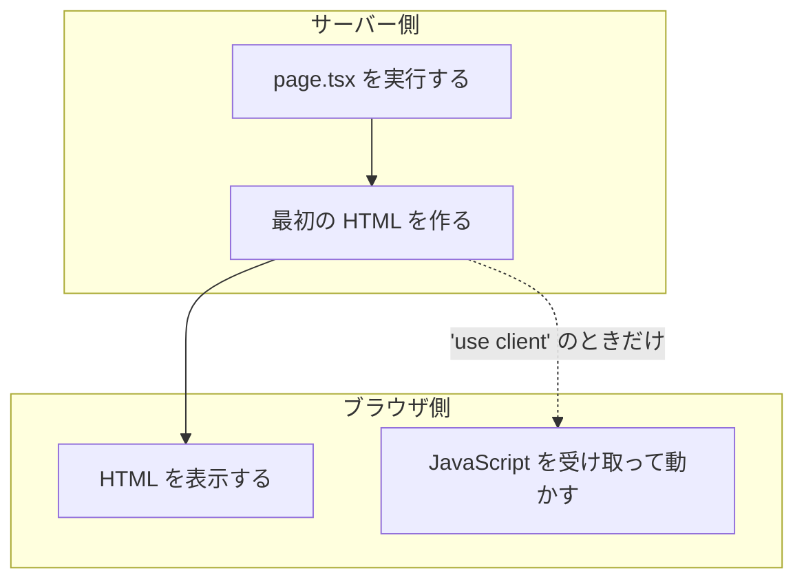

# Day 02: ダッシュボードに自分だけのメッセージを追加しよう

Day 01 はアプリの土台とトップページから入るダッシュボードを作りました。

今日はダッシュボードに自分の名前と集中テーマを表示します。

今日触るのは `src/app/dashboard/page.tsx` の1ファイルだけです。
このファイルで
「どういう情報を持たせるか」
「どう見せるか」
「どこまでをサーバー側で動く部品（Server Component）のまま保つか」
を確認します。Server Component は後半の Before/After で説明します。

## 前回の振り返り

Day 01 で用意した `/dashboard` の続きから始めます。配色には昨日定義した design token を使います。

---

## 今日のゴール

見出しだけのダッシュボードにメッセージカードを追加します。自分の名前・時刻に応じたあいさつ・今日の集中テーマを載せます。色は Day 01 の design token で指定します。

次の Day は編集したファイルを GitHub に保存します。


スクリーンショット: Day 02 の `/dashboard` です。上部にあいさつと名前を表示します。下段に情報カードが3枚、右側に補助カードが3枚並びます。


スクリーンショット: 作業前の `/dashboard` です。今日はこの1枚のカードから始めます。

- [ ] Day 01 の完成状態から作業を再開する
- [ ] `src/app/dashboard/page.tsx` の現在地を確認する
- [ ] 自分だけのメッセージカードをダッシュボードに追加する
- [ ] 時間帯に応じたあいさつを関数で組み立てる
- [ ] `const` と `let` の違いを確かめる。型が合わない値を渡したときのエラーも確認する
- [ ] メッセージの下に小さな情報カードを追加する
- [ ] Server Component のまま書く意味を Before/After で理解する

## なぜこれを作るのか

ダッシュボードには利用者の情報をまとめます。今日は名前や集中テーマをコードから表示する練習です。

表示する値の置き場所を決めましょう。名前を JSX に直接書くと変更時に複数の箇所を直すことになります。値を `const` にまとめておけば参照する表示も一緒に変わります。文の組み立ては関数に分けます。カードの並び順は配列で決めます。

> 名前を `const` で定義して複数の表示から参照すると変更箇所を1つにまとめられます。

### 新しく学ぶ概念

| 概念 | 読み方 | 役割 | 例え |
|------|--------|------|------|
| React コンポーネント | — | `export default function` で定義する画面の部品。1ファイル = 1コンポーネントが基本 | レゴの完成ブロック。他のページからも呼び出せる |
| `const` / `let` | コンスト / レット | 値に名前を付ける書き方。`const` は再代入不可。`let` は再代入可 | `const` は固定の表札、`let` は差し替えるネームプレート |
| 型 | かた | その名前に入れてよい値の種類。`string`（文字）・`number`（数）・`boolean`（真偽）など | 箱に貼られた「文字だけ」「数だけ」の注意書き |
| `type` | タイプ | 複数の項目をまとめて1つの形として名前を付ける書き方 | 記入用紙のひな形。どの欄に何を書くかが決まっている |
| Tailwind CSS | テイルウィンド | クラス名でスタイルを当てる CSS フレームワーク | `text-red-500` と書くだけで赤い文字になる便利ツール |
| `use client` | ユーズクライアント | このファイルをブラウザ側でも動かすと宣言する印。今日はあえて付けません | 「この書類は窓口で記入してください」という指示 |

> **React のコードを初めて自分で書く日です。** `export default function` や `className` は今日から何度も出てくる定番の形です。今日はこの形に慣れるだけで十分です。

## 前提（Day 01 完了していること）

今日は Day 01 の続きから進めます。
次の状態を確認してください。

- Day 01 で作った `task-app` プロジェクトがある（例: `~/workspace/task-app`）
- `npm install` が終わっていて `npm run dev` で起動できる
- `src/app/globals.css` に token ベースの色や radius が入っている
- `src/app/page.tsx` から `/dashboard` に入れる
- ダッシュボードに 「ダッシュボード」と出る最初の画面がある

この状態でない場合は
先に Day 01 を完了させてから戻ってきてください。

## 今日の見どころ

メッセージには
今日の集中テーマを入れます。


## 前日からの状態確認

Day 01 で作った状態を確認しましょう。
今日は新しいプロジェクトを作り直したりしません。
昨日作った `task-app` を続けて編集します。

`http://localhost:3000` を開きます。
`ダッシュボードへ入る` ボタンから `/dashboard` に移動できることも見ておきましょう。

### 起動確認

開発サーバーをまだ起動していない場合は
プロジェクトのルートで起動します。

```bash
npm run dev
```

開発サーバーが起動したら `http://localhost:3000` で Day 01 の画面を確認します。今日は起動したまま作業します。保存するたびに表示が更新されるため編集結果を確認できます。停止するときはターミナルで `Ctrl` と `C` を同時に押してください。

### Day 01 直後の `src/app/dashboard/page.tsx`

この Day は
Day 01 の最後に作った次のようなシンプルな状態から始める想定で進めます。

`~/workspace/task-app/src/app/dashboard/page.tsx` を開きます。
下の内容と見比べましょう。

```tsx
// filepath: src/app/dashboard/page.tsx
export default function DashboardPage() {
  return (
    <main className="min-h-screen bg-background text-foreground">
      <div className="mx-auto flex min-h-screen max-w-5xl items-center justify-center px-6 py-10">
        <section className="w-full rounded-3xl border border-border bg-card px-8 py-10 shadow-md">
          <p className="text-sm font-medium uppercase tracking-[0.24em] text-muted-foreground">
            Dashboard
          </p>
          <h1 className="mt-4 text-4xl font-semibold tracking-tight text-card-foreground sm:text-5xl">
            ダッシュボード
          </h1>
          <p className="mt-4 max-w-2xl text-base leading-8 text-muted-foreground">
            まだ表示するデータがありません。
            プロジェクトとタスクを作れるようになると、ここに出ます。
          </p>
        </section>
      </div>
    </main>
  );
}
```

今日はこの画面に自分の名前と集中テーマを追加します。

## 実装ステップ一覧

| ステップ | 作業内容 | 所要時間 |
|---------|---------|---------|
| Step 1 | メッセージカードを1枚作る | 7分 |
| Step 2 | 時間帯に合うあいさつを関数で組み立てる | 15分 |
| Step 3 | メッセージの下に情報カードを添える | 12分 |
| Step 4 | 保存してブラウザで表示を確認する | 3分 |

**合計時間**: 約37分です。

Step 2 はコードを写す時間と `const`・`let` の違いを確かめる時間を含みます。表の時間は目安です。調べものやエラーの修正にかかる時間は別に見てください。

---


### Step 1: メッセージカードを1枚作る（7分）

いきなり情報を盛りすぎると見失いやすいです。
まず主役のメッセージカードを1枚作ります。

ここで入れるのは次の3つです。

- 誰のダッシュボードなのか
- 今日は何に集中したいのか
- 今日のひとことメモ

#### 編集アンカー

`~/workspace/task-app/src/app/dashboard/page.tsx` を開きます。
**ファイルの先頭から最後まで全部置き換えます**。

Day 01 と同じく
この段階ではファイル全体を差し替えます。

コードは4ブロックに分けて載せています。すべて上から順に1つの `src/app/dashboard/page.tsx` へ書きます。別ファイルには分けません。

```tsx
// filepath: src/app/dashboard/page.tsx
const ownerName = 'Taro';
const focusTheme = 'ポートフォリオの企画';
const todayNote = '午前は集中して作業。夕方に振り返りを入れる。';

export default function DashboardPage() {
  return (
    <main className="min-h-screen bg-background text-foreground">
      <div className="mx-auto flex min-h-screen max-w-6xl flex-col px-6 py-8 lg:px-10">
        <header className="flex flex-col gap-3 rounded-2xl border border-border bg-card px-5 py-4 shadow-sm sm:flex-row sm:items-center sm:justify-between">
          <div className="space-y-1">
            <p className="text-xs font-medium uppercase tracking-[0.24em] text-muted-foreground">
              タスク管理
            </p>
            <h1 className="text-lg font-semibold text-card-foreground">
              My Dashboard
            </h1>
          </div>

          <div className="inline-flex w-fit items-center rounded-full bg-secondary px-3 py-1.5 text-xs font-medium text-secondary-foreground">
            作業中
          </div>
        </header>

        <section className="mt-8 grid gap-6 lg:grid-cols-[1.2fr_0.8fr]">
```

先頭の3行で表示する文字を定義しています。`const` はあとから再代入しない変数の宣言です。`ownerName` には持ち主の名前を入れます。同じ名前を複数の場所へ直接書かず変数で参照すると変更箇所を1つにまとめられます。

`<main>` と `<div>` の入れ子は Day 01 と同じです。幅と並び方の指定は今日の画面に合わせて変えています。`bg-background` や `text-foreground` も昨日定義した色を使います。`lg:grid-cols-[1.2fr_0.8fr]` は広い画面を左右2列に分ける指定です。左に主役のカード、右に補助カードを置きます。`<section>` はまだ閉じていません。途中で保存するとエラーになるため次のブロックも続けます。

```tsx
          {/* filepath: src/app/dashboard/page.tsx（同じファイルの続き） */}
          <article className="overflow-hidden rounded-3xl border border-border bg-card shadow-md">
            <div className="border-b border-border px-8 py-6">
              <span className="inline-flex items-center rounded-full bg-accent px-3 py-1 text-sm font-medium text-accent-foreground">
                今日のフォーカス
              </span>

              <h2 className="mt-6 text-4xl font-semibold tracking-tight text-card-foreground sm:text-5xl">
                こんにちは、{ownerName}さん。
              </h2>

              <p className="mt-4 max-w-2xl text-base leading-8 text-muted-foreground">
                今日の集中テーマは
                <span className="font-semibold text-foreground"> {focusTheme}</span>
                です。
              </p>
            </div>

            <div className="bg-secondary px-8 py-6">
              <p className="text-sm leading-8 text-secondary-foreground">
                {todayNote}
              </p>
            </div>
          </article>
```

カードの段ごとに背景色を変えています。見出しと添え書きの区切りを示すためです。

`{ownerName}`・`{focusTheme}`・`{todayNote}` は先頭の `const` で定義した値を表示します。名前の変更は先頭の1か所で済みます。`overflow-hidden` は角を丸めた枠から背景色がはみ出すのを防ぎます。外すと下側の角が四角く見えます。

```tsx
          {/* filepath: src/app/dashboard/page.tsx（同じファイルの続き） */}
          <aside className="space-y-4">
            <article className="rounded-3xl border border-border bg-card p-6 shadow-sm">
              <p className="text-sm font-semibold text-card-foreground">
                メモ
              </p>
              <p className="mt-4 text-sm leading-8 text-muted-foreground">
                午前は企画のたたき台を作る。夕方に一度見直す。
              </p>
            </article>

            <article className="rounded-3xl border border-border bg-card p-6 shadow-sm">
              <p className="text-sm font-semibold text-card-foreground">
                今週の予定
              </p>
              <p className="mt-4 text-sm leading-8 text-muted-foreground">
                金曜までにトップページのラフを固める。
              </p>
            </article>
          </aside>
        </section>
      </div>
```

右側の `<aside>` に補助カードを2枚置きます。`space-y-4` は中の `<article>` に共通の縦間隔を付けます。

補助カードも `rounded-3xl border border-border bg-card` を使います。文字は `text-sm` で小さくします。色を token で指定するのはテーマの値を共通で使うためです。`bg-white` を直接指定すると暗いテーマでも白いままになります。最後の `</section>` と `</div>` は最初に開いたタグを閉じています。

```tsx
    {/* filepath: src/app/dashboard/page.tsx（同じファイルの続き） */}
    </main>
  );
}
```

最後に `</main>` と `return` の丸かっこを閉じます。関数の波かっこも閉じます。タグは開いた順と逆に `</section>` `</div>` `</main>` の順で閉じてください。全ブロックを書いて保存したら画面を確かめます。途中の保存時に出るエラーは閉じタグが足りないためです。

#### ここで見てほしいポイント

- `ownerName` のように用途が分かる名前で文字列を定義している
- `bg-card` や `text-muted-foreground` で Day 01 の token を使っている
- まだ `"use client"` は付けていない

変数には、**何のための値かが分かる名前**を付けましょう。

`<h2>` の `{ownerName}` は変数の値を表示します。JSX では `{ }` で囲んだ式の結果を差し込めます。`ownerName` に入れた `Taro` が「こんにちは、Taroさん」という表示に使われます。波かっこを外すと `ownerName` という文字自体が表示されます。

#### ブラウザ確認

- 見出しが「ダッシュボード」だけの状態から変わっている
- `こんにちは、Taroさん。` が主役として見える（名前を変更した場合はその名前が出る）
- 右側に小さな補助カードが2枚並ぶ

> `Taro` はサンプル名です。`ownerName` の値を変えると表示も変わります。このあとの Step は `dashboardOwner.name` で名前を指定します。

### Step 2: 時間帯に合うあいさつを関数で組み立てる（15分）

次は時間帯に応じて
あいさつの文字列を選びます。

朝なら「おはよう」、昼なら「こんにちは」、夜なら「こんばんは」と出し分けます。
時刻の条件を使って
「画面に出す文をその場に直接書き続ける」状態から抜ける最初の練習になります。

#### 編集アンカー

`~/workspace/task-app/src/app/dashboard/page.tsx` を開きます。
**ファイル全体を次の内容に置き換えます**。

```tsx
// filepath: src/app/dashboard/page.tsx
type DashboardOwner = {
  name: string;
  role: string;
  todayFocus: string;
  todayGoal: string;
};

const dashboardOwner: DashboardOwner = {
  name: 'Taro',
  role: 'Web エンジニア',
  todayFocus: 'ポートフォリオの企画',
  todayGoal: 'トップページのラフを決める',
};

function getGreetingByHour(hour: number): string {
  if (hour < 12) {
    return 'おはよう';
  }

  if (hour < 18) {
    return 'こんにちは';
  }

  return 'こんばんは';
```

`DashboardOwner` 型に名前・肩書き・集中テーマ・今日の目標をまとめます。`name: string` は文字列を入れる指定です。`name: 123` などの型違いや `nmae` などの項目名の間違いを型検査で指摘できます。

`getGreetingByHour` は時刻を受け取ってあいさつを返す関数です。`hour: number` は引数を数値に限定します。`): string` は返す値を文字列に限定します。`hour < 12` の場合は `return` で処理を終えます。その下の `if` に進むのは12時以降だけです。関数の閉じかっこは次のブロックに続きます。

```tsx
// filepath: src/app/dashboard/page.tsx（同じファイルの続き）
}

function buildMainMessage(owner: DashboardOwner, hour: number): string {
  const greeting = getGreetingByHour(hour);

  return `${greeting}、${owner.name}さん。今日は${owner.todayFocus}に取り組みます。`;
}

export default function DashboardPage() {
  const currentHour = new Date().getHours();
  const mainMessage = buildMainMessage(dashboardOwner, currentHour);

  return (
    <main className="min-h-screen bg-background text-foreground">
      <div className="mx-auto flex min-h-screen max-w-6xl flex-col px-6 py-8 lg:px-10">
        <header className="flex flex-col gap-3 rounded-2xl border border-border bg-card px-5 py-4 shadow-sm sm:flex-row sm:items-center sm:justify-between">
          <div className="space-y-1">
            <p className="text-xs font-medium uppercase tracking-[0.24em] text-muted-foreground">
              タスク管理
            </p>
            <h1 className="text-lg font-semibold text-card-foreground">
              My Dashboard
            </h1>
          </div>
```

`buildMainMessage` はあいさつと名前と集中テーマを1本の文につなぎます。時間帯の判定は `getGreetingByHour` に任せます。あいさつだけを変える場合はその関数を編集します。

`new Date().getHours()` は現在の「時」を0〜23の数値で取得します。数値を関数へ渡して組み立てた文を `mainMessage` に入れます。JSX はその値を表示します。文の組み立てとタグの記述を分けるための書き方です。

```tsx
          {/* filepath: src/app/dashboard/page.tsx（同じファイルの続き） */}
          <div className="inline-flex w-fit items-center rounded-full bg-secondary px-3 py-1.5 text-xs font-medium text-secondary-foreground">
            作業中
          </div>
        </header>

        <section className="mt-8 grid gap-6 lg:grid-cols-[1.2fr_0.8fr]">
          <article className="overflow-hidden rounded-3xl border border-border bg-card shadow-md">
            <div className="border-b border-border px-8 py-6">
              <span className="inline-flex items-center rounded-full bg-accent px-3 py-1 text-sm font-medium text-accent-foreground">
                今日のフォーカス
              </span>

              <h2 className="mt-6 text-4xl font-semibold tracking-tight text-card-foreground sm:text-5xl">
                {mainMessage}
              </h2>

              <p className="mt-4 max-w-2xl text-base leading-8 text-muted-foreground">
                今日は
                <span className="font-semibold text-foreground"> {dashboardOwner.todayGoal}</span>
                まで進めます。
              </p>
            </div>
```

`<h2>` は `mainMessage` の文字列を表示します。JSX 内に文を直接書いていた Step 1 と違って関数の結果を受け取ります。時刻を取得するのはページを組み立てるサーバーです。あいさつもサーバーの時刻に合わせて決まります。

`{dashboardOwner.todayGoal}` を `<span>` で囲みます。周りの `text-muted-foreground` より濃い文字色にして目標を強調します。ここも Day 01 の token を使います。

```tsx
            {/* filepath: src/app/dashboard/page.tsx（同じファイルの続き） */}
            <div className="grid gap-4 bg-secondary px-8 py-6 sm:grid-cols-2">
              <div className="rounded-2xl bg-background px-4 py-4 shadow-xs">
                <p className="text-xs font-medium uppercase tracking-[0.18em] text-muted-foreground">
                  Owner
                </p>
                <p className="mt-3 text-lg font-semibold text-foreground">
                  {dashboardOwner.name}
                </p>
                <p className="mt-2 text-sm leading-7 text-muted-foreground">
                  {dashboardOwner.role}
                </p>
              </div>

              <div className="rounded-2xl bg-background px-4 py-4 shadow-xs">
                <p className="text-xs font-medium uppercase tracking-[0.18em] text-muted-foreground">
                  Focus
                </p>
                <p className="mt-3 text-lg font-semibold text-foreground">
                  {dashboardOwner.todayGoal}
                </p>
                <p className="mt-2 text-sm leading-7 text-muted-foreground">
                  {dashboardOwner.todayFocus}
                </p>
```

下段は `sm:grid-cols-2` で `Owner` と `Focus` を並べます。表示するのは `dashboardOwner` の `name`・`role`・`todayGoal`・`todayFocus` です。名前を変えるときは `dashboardOwner` を編集します。見出しと下段の両方に反映されます。

`Owner` などのラベルには `text-xs` と `tracking-[0.18em]` を指定します。後者は文字間隔を広げます。ラベルと値の見え方を分ける指定です。`<div>` はまだ閉じていないため次のブロックも続けます。

```tsx
              {/* filepath: src/app/dashboard/page.tsx（同じファイルの続き） */}
              </div>
            </div>
          </article>

          <aside className="space-y-4">
            <article className="rounded-3xl border border-border bg-card p-6 shadow-sm">
              <p className="text-sm font-semibold text-card-foreground">
                メモ
              </p>
              <p className="mt-4 text-sm leading-8 text-muted-foreground">
                午前は集中して作業。夕方に振り返りを入れる。
              </p>
            </article>

            <article className="rounded-3xl border border-border bg-card p-6 shadow-sm">
              <p className="text-sm font-semibold text-card-foreground">
                明日やること
              </p>
              <p className="mt-4 text-sm leading-8 text-muted-foreground">
                レビューの指摘をまとめて、直す順番を決める。
              </p>
            </article>
```

`<article>` と `className` は Step 1 のままです。文章と値の作り方を変えています。編集後の表示が予想と違うときは今回追加した関数や参照箇所を確かめます。

```tsx
          {/* filepath: src/app/dashboard/page.tsx（同じファイルの続き） */}
          </aside>
        </section>
      </div>
    </main>
  );
}
```

`</aside>` から `</main>` までを閉じます。開いたタグと逆順になっているか確かめてください。保存したら画面に時間帯のあいさつが出ることを確認します。かっこのエラーが出た場合は表示された行より上にも閉じ忘れがないか調べます。

#### この段階で入った考え方

- `DashboardOwner` 型で情報の形を決めた
- `getGreetingByHour` に時間帯の判定を分けた
- `buildMainMessage` で文を組み立てた

名前や肩書きや集中テーマの変更箇所は
`dashboardOwner` に
まとまっています。

`buildMainMessage` の文はバッククオート（`` ` ``）で囲みます。その中の `${ }` が値に置き換わる書き方です。`greeting + '、' + owner.name + 'さん'` のように `+` でつなぐ方法もあります。今回は表示する文の形を読み取れるように `${ }` を使います。

#### ブラウザ確認

**確認ポイント**:
- 見出しが `おはよう` `こんにちは` `こんばんは` のどれかで始まっている
- 見出しの中に自分の名前と集中テーマが入っている
- カードの下段に `Owner` と `Focus` の2枚が並んでいる
- ターミナルにもブラウザの開発者ツールにもエラーが出ていない

開発サーバーはページを開くたびに描き直すためあいさつもその時刻で決まります。Day 04 で公開するとこの動きが変わります。このページはリクエストごとのデータを取得しません。Next.js がビルド時に一度作った HTML を配るため公開後のあいさつは固定されます。使われる時刻もビルドする機械の時計です。閲覧者ごとの時刻に変えたい場合は、ブラウザ側で時刻を取得する処理が必要です。今日は関数の条件分岐を確かめます。`const currentHour = new Date().getHours();` を一時的に `const currentHour = 20;` に変えて保存してください。「こんばんは」に変わったら元の行に戻します。

#### 型と変数をその場で確かめる

ここまでは `const` を使いました。もう1つの宣言方法が `let` です。あとから値を代入し直せるかどうかが違います。

`const currentHour = new Date().getHours();` の下に次の1行を一時的に足して保存します。

```tsx
// filepath: src/app/dashboard/page.tsx（一時的に足す行）
  currentHour = 9;
```

`currentHour` に赤い線が付き `Cannot assign to 'currentHour' because it is a constant.` と表示されます。定数なので再代入できないという意味です。

宣言の `const` を `let` に変えると赤い線が消えます。`let` は再代入できるためです。今日の処理は再代入しないので `const` を使います。再代入が必要な場所だけ `let` にすると値が変わる範囲を読み取れます。

確認後は追加した `currentHour = 9;` を消します。宣言も `const` に戻してください。

`9` や `20` などの数値の型は `number` です。`Taro` などの文字列は `string`、真偽の2択は `boolean` と呼びます。`getGreetingByHour` は `number` を受け取ります。`hour < 12` で `boolean` の結果を出します。その結果に応じて `string` を返します。

次は型違いのエラーを確かめます。`buildMainMessage` の `const greeting = getGreetingByHour(hour);` を次の形に変えて保存します。

```tsx
// filepath: src/app/dashboard/page.tsx（一時的に書き換える行）
  const greeting = getGreetingByHour('9');
```

`Argument of type 'string' is not assignable to parameter of type 'number'.` は文字列を数値の引数（関数へ渡す値）に渡せないという意味です。`hour: number` が受け取る型を指定しています。`'9'` は数字に見えても引用符で囲んだ文字列です。宣言した型と違うため TypeScript が指摘します。

確認後は `getGreetingByHour(hour)` に戻します。赤い線が消えてあいさつが表示されることを確認してください。

```tsx
// filepath: src/app/dashboard/page.tsx（戻したあとの行）
  const greeting = getGreetingByHour(hour);
```

`hour` は `buildMainMessage` の引数名です。画面側の `currentHour` はこの関数内から参照できません。戻すときに `currentHour` と書くと名前が見つからないエラーになります。

**確認ポイント**:
- `const` に再代入するとエラーが出た
- `let` に変えるとエラーが消えた。再代入しない場所に `const` を使う理由も確認した
- `number` の引数に `string` を渡すとエラーが出た
- 追加した `currentHour = 9;` を消し、宣言を `const` に戻し、呼び出しも `getGreetingByHour(hour)` に戻した

### Step 3: メッセージの下に情報カードを添える（12分）

次はメッセージの下に小さな情報カードを置きます。

カードには現在の役割と次の行動も表示します。

下段に次の3種類の情報カードを置きます。右側の補助カードも3枚に増やします。

- いまの役割
- 今日のフォーカス
- 次にやること

#### 編集アンカー

もう一度 `~/workspace/task-app/src/app/dashboard/page.tsx` 全体を置き換えます。
この Step の内容が Day 02 の完成版です。

```tsx
// filepath: src/app/dashboard/page.tsx
type DashboardOwner = {
  name: string;
  role: string;
  todayFocus: string;
  todayGoal: string;
  nextAction: string;
};

type FocusCard = {
  label: string;
  value: string;
  description: string;
};

const dashboardOwner: DashboardOwner = {
  name: 'Taro',
  role: 'Web エンジニア',
  todayFocus: 'ポートフォリオの企画',
  todayGoal: 'トップページのラフを決める',
  nextAction: 'レビューをもらう',
};

function getGreetingByHour(hour: number): string {
  if (hour < 12) {
```

`DashboardOwner` に `nextAction` を足します。新しい `FocusCard` 型は `label`・`value`・`description` の3項目を持ちます。下段のカード1枚分の情報です。型を先に定義してカードごとに必要な項目をそろえます。

型を定義しても画面には表示されません。型はコードの検査に使う情報です。ブラウザへ送る前に取り除かれます。`getGreetingByHour` は次のブロックに続きます。

```tsx
// filepath: src/app/dashboard/page.tsx（同じファイルの続き）
    return 'おはよう';
  }

  if (hour < 18) {
    return 'こんにちは';
  }

  return 'こんばんは';
}

function buildMainMessage(owner: DashboardOwner, hour: number): string {
  const greeting = getGreetingByHour(hour);

  return `${greeting}、${owner.name}さん。今日は${owner.todayFocus}に取り組みます。`;
}

export default function DashboardPage() {
  const currentHour = new Date().getHours();
  const mainMessage = buildMainMessage(dashboardOwner, currentHour);
  const focusCards: FocusCard[] = [
    {
      label: '担当',
      value: dashboardOwner.name,
      description: dashboardOwner.role,
```

`focusCards` の型は `FocusCard[]` です。`FocusCard` を要素に持つ配列を表します。`label` などの項目が欠けるとエディタの型検査で指摘されます。

`value` には `dashboardOwner.name`、`description` には `dashboardOwner.role` を入れます。名前を再び手書きせず元の情報を参照します。`dashboardOwner` を変更した際に下段も更新されるようにするためです。

```tsx
// filepath: src/app/dashboard/page.tsx（同じファイルの続き）
    },
    {
      label: '今日',
      value: dashboardOwner.todayGoal,
      description: dashboardOwner.todayFocus,
    },
    {
      label: '次',
      value: dashboardOwner.nextAction,
      description: '明日いちばんに動く',
    },
  ];

  return (
    <main className="min-h-screen bg-background text-foreground">
      <div className="mx-auto flex min-h-screen max-w-6xl flex-col px-6 py-8 lg:px-10">
        <header className="flex flex-col gap-3 rounded-2xl border border-border bg-card px-5 py-4 shadow-sm sm:flex-row sm:items-center sm:justify-between">
          <div className="space-y-1">
            <p className="text-xs font-medium uppercase tracking-[0.24em] text-muted-foreground">
              タスク管理
            </p>
            <h1 className="text-lg font-semibold text-card-foreground">
              My Dashboard
            </h1>
```

配列の順番がカードの並び順です。入れ替える場合はこの配列を編集します。

Step 2 はカードを JSX に2つ直接書きました。今回は配列の要素から作ります。4枚目は要素を追加して表示できるため `<div>` の追加は不要です。`return` 以下のヘッダーは Step 2 と同じです。

```tsx
          {/* filepath: src/app/dashboard/page.tsx（同じファイルの続き） */}
          </div>

          <div className="inline-flex w-fit items-center rounded-full bg-secondary px-3 py-1.5 text-xs font-medium text-secondary-foreground">
            作業中
          </div>
        </header>

        <section className="mt-8 grid gap-6 lg:grid-cols-[1.2fr_0.8fr]">
          <article className="overflow-hidden rounded-3xl border border-border bg-card shadow-md">
            <div className="border-b border-border px-8 py-6">
              <span className="inline-flex items-center rounded-full bg-accent px-3 py-1 text-sm font-medium text-accent-foreground">
                今日のフォーカス
              </span>

              <h2 className="mt-6 max-w-4xl text-4xl font-semibold tracking-tight text-card-foreground sm:text-5xl">
                {mainMessage}
              </h2>

              <p className="mt-4 max-w-2xl text-base leading-8 text-muted-foreground">
                今日は
                <span className="font-semibold text-foreground"> {dashboardOwner.todayGoal}</span>
                まで進めます。
```

`<h2>` に `max-w-4xl` を追加しました。名前と集中テーマを含む長い文の幅を制限するためです。指定した幅を超えると折り返します。

```tsx
              {/* filepath: src/app/dashboard/page.tsx（同じファイルの続き） */}
              </p>

              <div className="mt-8 inline-flex items-center rounded-full bg-primary px-4 py-2 text-sm font-semibold text-primary-foreground shadow-sm">
                進行中: {dashboardOwner.todayFocus}
              </div>
            </div>

            <div className="grid gap-4 bg-secondary px-8 py-6 md:grid-cols-3">
              {focusCards.map((card) => (
                <article
                  key={card.label}
                  className="rounded-2xl border border-border bg-background px-4 py-4 shadow-xs"
                >
                  <p className="text-xs font-medium uppercase tracking-[0.18em] text-muted-foreground">
                    {card.label}
                  </p>
                  <p className="mt-3 text-lg font-semibold text-foreground">
                    {card.value}
                  </p>
                  <p className="mt-2 text-sm leading-7 text-muted-foreground">
                    {card.description}
                  </p>
                </article>
              ))}
```

`focusCards.map((card) => (...))` は要素ごとにカードを作ります。`(card) => (...)` は引数を受け取って結果を返すアロー関数（関数の短い書き方）です。3つの要素から3枚のカードができます。`md:grid-cols-3` は広い画面で横3列にする指定です。狭い画面では縦に並びます。

`key={card.label}` は React がカードを識別する目印です。付け忘れると警告が出ます。表示には `card.label`・`card.value`・`card.description` を使います。項目を追加する場合は型・配列・JSX の3か所を合わせます。

```tsx
            {/* filepath: src/app/dashboard/page.tsx（同じファイルの続き） */}
            </div>
          </article>

          <aside className="space-y-4">
            <article className="rounded-3xl border border-border bg-card p-6 shadow-sm">
              <p className="text-sm font-semibold text-card-foreground">
                メモ
              </p>
              <p className="mt-4 text-sm leading-8 text-muted-foreground">
                午前は集中して作業。夕方に振り返りを入れる。
              </p>
            </article>

            <article className="rounded-3xl border border-border bg-card p-6 shadow-sm">
              <p className="text-sm font-semibold text-card-foreground">
                今週の予定
              </p>
              <p className="mt-4 text-sm leading-8 text-muted-foreground">
                金曜までにトップページのラフを固める。
              </p>
            </article>

```

画面が狭いと `lg:grid-cols-[1.2fr_0.8fr]` の2列指定が適用されません。右側の列が主役の下へ続くのはこの指定による動きです。

```tsx
            {/* filepath: src/app/dashboard/page.tsx（同じファイルの続き） */}
            <article className="rounded-3xl border border-border bg-card p-6 shadow-sm">
              <p className="text-sm font-semibold text-card-foreground">
                明日やること
              </p>
              <p className="mt-4 text-sm leading-8 text-muted-foreground">
                レビューの指摘をまとめて、直す順番を決める。
              </p>
            </article>
          </aside>
        </section>
      </div>
    </main>
  );
}
```

親要素の `space-y-4` がカード間の余白を決めます。枚数が2枚から3枚に増えても同じ間隔になります。

保存後は左にメッセージカード、その下に3枚の情報カード、右に3枚の補助カードがあることを確かめます。

#### 完成版で見てほしいこと


スクリーンショット: Step 3 のメッセージカードです。あいさつの下の `進行中:` バッジと最下段の `担当`・`今日`・`次` を確認します。

- 主役は大きいメッセージカードに集約されている
- 補助情報は `focusCards` 配列に寄せている
- 色は token 名で読めるようにしている
- 動きがない画面なので Server Component のまま保っている

`DashboardOwner` は情報の形を定義します。`buildMainMessage` は文を組み立てます。`focusCards` はカードの順番を決めます。名前、肩書き、集中テーマ、カードの中身は JSX の外で指定します。JSX は `{ }` で値を表示します。`My Dashboard` などの固定文言は JSX に直接書きます。今日は自分で入力した値です。データベースの値を使うのは Day 09 のプロジェクト一覧からです。集計は Day 21 のレポート画面で扱います。

次のチェックポイントで表示を確認します。

### Step 4: 保存してブラウザで表示を確認する（3分）

仕上げたら
ブラウザで見直しましょう。

開発サーバーを止めている場合は
もう一度起動します。

```bash
npm run dev
```

停止していた開発サーバーをこのコマンドで起動します。起動中なら実行不要です。`http://localhost:3000/dashboard` を開いて自分の名前を含む文が出るか確かめます。

#### チェックポイント

- あいさつが開発サーバーの時刻に合っている
- `dashboardOwner.name` に入れた名前（既定は `Taro`）が画面に出る
- `進行中:` のバッジが `bg-primary`（メインカラー）で表示されている
- 下段に「担当」「今日」「次」の3カードがある
- 右側に補助カードが3枚ある

#### うまくいかないときの見直し順

1. `src/app/dashboard/page.tsx` を途中だけ貼り換えていないか確認する
2. 文字列の引用符（`'` や `"`）やバッククオートを打ち間違えていないか見る
3. `focusCards.map` の丸かっこや波かっこの閉じ忘れがないか見る
4. 一度保存してからブラウザを再読み込みする

### Pro パターンで書こう（ダッシュボードのメッセージは Server Component を標準にする）

「Pro パターン」は書き方を比較するコーナーです。コードの写経は不要です。今日は Server Component と Client Component の違いを比較します。

今日のように
決まったメッセージを表示する処理は
ブラウザで状態を持つ必要はありません。
最初から `"use client"` を付けると
必要のない JavaScript までブラウザへ送ることになります。


```mermaid
flowchart TB
    subgraph SRV["サーバー側"]
      S1["page.tsx を実行する"] --> S2["最初の HTML を作る"]
    end
    subgraph BRW["ブラウザ側"]
      B1["HTML を表示する"]
      B2["JavaScript を受け取って動かす"]
    end
    S2 --> B1
    S2 -.->|"'use client' のときだけ"| B2
```

`'use client'` があっても最初の HTML はサーバーで組み立てます。図の点線は JavaScript の送信を表します。今日の画面はクリックや入力への反応がないためこの送信は不要です。

#### Before（改善前のコード）

```tsx
// filepath: 読み比べ用サンプル（実ファイルには対応しません）
'use client';

import { useMemo } from 'react';

type DashboardOwner = {
  name: string;
  role: string;
  todayFocus: string;
  todayGoal: string;
  nextAction: string;
};

type FocusCard = {
  label: string;
  value: string;
  description: string;
};

const dashboardOwner: DashboardOwner = {
  name: 'Taro',
  role: 'Web エンジニア',
  todayFocus: 'ポートフォリオの企画',
  todayGoal: 'トップページのラフを決める',
  nextAction: 'レビューをもらう',
```

**読み比べ用**: ここは写経しません。続けてコードを読み進めましょう。

`'use client'` を付けるとそのファイルの JavaScript もブラウザへ送られます。クリックへの反応や状態の保持に使います。最初の HTML はサーバーでも組み立てます。Day 02 は文字を表示するだけなので操作用の JavaScript は不要です。`useMemo`（計算結果を保持する React の機能）を使っています。依存する値が変わらなければ前の結果を使います。このフックを使うために Client Component として宣言しています。

```tsx
// filepath: 読み比べ用サンプル（続き・実ファイルには対応しません）
};

function getGreetingByHour(hour: number): string {
  if (hour < 12) {
    return 'おはよう';
  }

  if (hour < 18) {
    return 'こんにちは';
  }

  return 'こんばんは';
}

function buildMainMessage(owner: DashboardOwner, hour: number): string {
  const greeting = getGreetingByHour(hour);

  return `${greeting}、${owner.name}さん。今日は${owner.todayFocus}に取り組みます。`;
}

export default function DashboardPage() {
  const currentHour = new Date().getHours();
  const mainMessage = useMemo(() => {
    return buildMainMessage(dashboardOwner, currentHour);
```

**読み比べ用**: ここは写経しません。続けてコードを読み進めましょう。

`mainMessage` を作る関数は Step 3 と同じです。Before はその呼び出しを `useMemo` で包みます。短い文字列をつなぐ処理の結果を保持するためにコードが増えています。

```tsx
// filepath: 読み比べ用サンプル（続き・実ファイルには対応しません）
  }, [currentHour]);
  const focusCards: FocusCard[] = [
    {
      label: '担当',
      value: dashboardOwner.name,
      description: dashboardOwner.role,
    },
    {
      label: '今日',
      value: dashboardOwner.todayGoal,
      description: dashboardOwner.todayFocus,
    },
    {
      label: '次',
      value: dashboardOwner.nextAction,
      description: '明日いちばんに動く',
    },
  ];

  return (
    <main className="min-h-screen bg-background text-foreground">
      <div className="mx-auto flex min-h-screen max-w-6xl flex-col px-6 py-8 lg:px-10">
        <header className="flex flex-col gap-3 rounded-2xl border border-border bg-card px-5 py-4 shadow-sm sm:flex-row sm:items-center sm:justify-between">
          <div className="space-y-1">
```

**読み比べ用**: ここは写経しません。続けてコードを読み進めましょう。

`[currentHour]` は値の変更時に再計算する指定です。依存する変数を書き忘れると古い結果が残ります。`useMemo` を使う際は依存する値も管理します。

`focusCards` は `useMemo` を使わず毎回作ります。`mainMessage` だけ結果を保持する理由を考えながら見比べてください。

```tsx
            {/* filepath: 読み比べ用サンプル（続き・実ファイルには対応しません） */}
            <p className="text-xs font-medium uppercase tracking-[0.24em] text-muted-foreground">
              タスク管理
            </p>
            <h1 className="text-lg font-semibold text-card-foreground">
              My Dashboard
            </h1>
          </div>

          <div className="inline-flex w-fit items-center rounded-full bg-secondary px-3 py-1.5 text-xs font-medium text-secondary-foreground">
            作業中
          </div>
        </header>

        <section className="mt-8 grid gap-6 lg:grid-cols-[1.2fr_0.8fr]">
          <article className="overflow-hidden rounded-3xl border border-border bg-card shadow-md">
            <div className="border-b border-border px-8 py-6">
              <span className="inline-flex items-center rounded-full bg-accent px-3 py-1 text-sm font-medium text-accent-foreground">
                今日のフォーカス
              </span>

              <h2 className="mt-6 max-w-4xl text-4xl font-semibold tracking-tight text-card-foreground sm:text-5xl">
                {mainMessage}
              </h2>

```

**読み比べ用**: ここは写経しません。続けてコードを読み進めましょう。

以下は JSX による見た目の記述です。クリックや入力への反応はありません。`'use client'` があるためこの実装と読み込む部品もブラウザ向けのコードに含まれます。

```tsx
              {/* filepath: 読み比べ用サンプル（続き・実ファイルには対応しません） */}
              <p className="mt-4 max-w-2xl text-base leading-8 text-muted-foreground">
                今日は
                <span className="font-semibold text-foreground"> {dashboardOwner.todayGoal}</span>
                まで進めます。
              </p>

              <div className="mt-8 inline-flex items-center rounded-full bg-primary px-4 py-2 text-sm font-semibold text-primary-foreground shadow-sm">
                進行中: {dashboardOwner.todayFocus}
              </div>
            </div>

            <div className="grid gap-4 bg-secondary px-8 py-6 md:grid-cols-3">
              {focusCards.map((card) => (
                <article
                  key={card.label}
                  className="rounded-2xl border border-border bg-background px-4 py-4 shadow-xs"
                >
                  <p className="text-xs font-medium uppercase tracking-[0.18em] text-muted-foreground">
                    {card.label}
                  </p>
                  <p className="mt-3 text-lg font-semibold text-foreground">
                    {card.value}
```

**読み比べ用**: ここは写経しません。続けてコードを読み進めましょう。

`focusCards.map(...)` は Step 3 と同じ処理です。固定の配列からカードを作るだけならサーバーで実行できます。Before はこの処理もブラウザへ送る指定になっています。

```tsx
                  {/* filepath: 読み比べ用サンプル（続き・実ファイルには対応しません） */}
                  </p>
                  <p className="mt-2 text-sm leading-7 text-muted-foreground">
                    {card.description}
                  </p>
                </article>
              ))}
            </div>
          </article>

          <aside className="space-y-4">
            <article className="rounded-3xl border border-border bg-card p-6 shadow-sm">
              <p className="text-sm font-semibold text-card-foreground">
                メモ
              </p>
              <p className="mt-4 text-sm leading-8 text-muted-foreground">
                午前は集中して作業。夕方に振り返りを入れる。
              </p>
            </article>

            <article className="rounded-3xl border border-border bg-card p-6 shadow-sm">
              <p className="text-sm font-semibold text-card-foreground">
                今週の予定
              </p>
```

**読み比べ用**: ここは写経しません。続けてコードを読み進めましょう。

補助カードも固定の文章です。ここまでクリックや入力に反応する処理はありません。次のブロックで Before が終わります。

```tsx
              {/* filepath: 読み比べ用サンプル（続き・実ファイルには対応しません） */}
              <p className="mt-4 text-sm leading-8 text-muted-foreground">
                金曜までにトップページのラフを固める。
              </p>
            </article>

            <article className="rounded-3xl border border-border bg-card p-6 shadow-sm">
              <p className="text-sm font-semibold text-card-foreground">
                明日やること
              </p>
              <p className="mt-4 text-sm leading-8 text-muted-foreground">
                レビューの指摘をまとめて、直す順番を決める。
              </p>
            </article>
          </aside>
        </section>
      </div>
    </main>
  );
}
```

**このコードの問題点**:

- メッセージ表示だけのために page 全体を Client Component にしてしまっている
- 短い文字列の計算に `useMemo` を使い依存配列の管理を増やしている

#### After（プロが書くコード）

```tsx
// filepath: 読み比べ用サンプル（実ファイルには対応しません）
type DashboardOwner = {
  name: string;
  role: string;
  todayFocus: string;
  todayGoal: string;
  nextAction: string;
};

type FocusCard = {
  label: string;
  value: string;
  description: string;
};

const dashboardOwner: DashboardOwner = {
  name: 'Taro',
  role: 'Web エンジニア',
  todayFocus: 'ポートフォリオの企画',
  todayGoal: 'トップページのラフを決める',
  nextAction: 'レビューをもらう',
};

function getGreetingByHour(hour: number): string {
  if (hour < 12) {
```

**読み比べ用**: ここは写経しません。続けてコードを読み進めましょう。

After は `'use client'` と `useMemo` の import を削除しています。`mainMessage` の作成も3行から1行に変わります。型や `dashboardOwner` は変更していません。HTML の作成はサーバーで行います。このコンポーネントの実装コードをブラウザへ送る必要がなくなります。

```tsx
// filepath: 読み比べ用サンプル（続き・実ファイルには対応しません）
    return 'おはよう';
  }

  if (hour < 18) {
    return 'こんにちは';
  }

  return 'こんばんは';
}

function buildMainMessage(owner: DashboardOwner, hour: number): string {
  const greeting = getGreetingByHour(hour);

  return `${greeting}、${owner.name}さん。今日は${owner.todayFocus}に取り組みます。`;
}

export default function DashboardPage() {
  const currentHour = new Date().getHours();
  const mainMessage = buildMainMessage(dashboardOwner, currentHour);
  const focusCards: FocusCard[] = [
    {
      label: '担当',
      value: dashboardOwner.name,
      description: dashboardOwner.role,
```

**読み比べ用**: ここは写経しません。続けてコードを読み進めましょう。

`mainMessage` は `buildMainMessage(dashboardOwner, currentHour)` の呼び出しだけです。`useMemo` を使わないため依存配列も不要です。`new Date().getHours()` はサーバーで実行します。このページはリクエストごとの情報を使わないためビルド時に一度作られます。公開後のあいさつはそのときの時刻で固定されます。

```tsx
// filepath: 読み比べ用サンプル（続き・実ファイルには対応しません）
    },
    {
      label: '今日',
      value: dashboardOwner.todayGoal,
      description: dashboardOwner.todayFocus,
    },
    {
      label: '次',
      value: dashboardOwner.nextAction,
      description: '明日いちばんに動く',
    },
  ];

  return (
    <main className="min-h-screen bg-background text-foreground">
      <div className="mx-auto flex min-h-screen max-w-6xl flex-col px-6 py-8 lg:px-10">
        <header className="flex flex-col gap-3 rounded-2xl border border-border bg-card px-5 py-4 shadow-sm sm:flex-row sm:items-center sm:justify-between">
          <div className="space-y-1">
            <p className="text-xs font-medium uppercase tracking-[0.24em] text-muted-foreground">
              タスク管理
            </p>
            <h1 className="text-lg font-semibold text-card-foreground">
              My Dashboard
            </h1>
```

**読み比べ用**: ここは写経しません。続けてコードを読み進めましょう。

`focusCards` の定義は変わりません。配列や JSX はサーバーでも使えます。ブラウザで状態を保持したりクリックに反応したりする部品を作るときに Client Component が必要です。

```tsx
          {/* filepath: 読み比べ用サンプル（続き・実ファイルには対応しません） */}
          </div>

          <div className="inline-flex w-fit items-center rounded-full bg-secondary px-3 py-1.5 text-xs font-medium text-secondary-foreground">
            作業中
          </div>
        </header>

        <section className="mt-8 grid gap-6 lg:grid-cols-[1.2fr_0.8fr]">
          <article className="overflow-hidden rounded-3xl border border-border bg-card shadow-md">
            <div className="border-b border-border px-8 py-6">
              <span className="inline-flex items-center rounded-full bg-accent px-3 py-1 text-sm font-medium text-accent-foreground">
                今日のフォーカス
              </span>

              <h2 className="mt-6 max-w-4xl text-4xl font-semibold tracking-tight text-card-foreground sm:text-5xl">
                {mainMessage}
              </h2>

              <p className="mt-4 max-w-2xl text-base leading-8 text-muted-foreground">
                今日は
                <span className="font-semibold text-foreground"> {dashboardOwner.todayGoal}</span>
                まで進めます。
```

**読み比べ用**: ここは写経しません。続けてコードを読み進めましょう。

タグ、`className`、値の差し込みは Before と同じです。作成した HTML はどちらもブラウザへ届きます。Before はそのほかにページの JavaScript も送ります。見た目が同じでも送るコードは違います。

```tsx
              {/* filepath: 読み比べ用サンプル（続き・実ファイルには対応しません） */}
              </p>

              <div className="mt-8 inline-flex items-center rounded-full bg-primary px-4 py-2 text-sm font-semibold text-primary-foreground shadow-sm">
                進行中: {dashboardOwner.todayFocus}
              </div>
            </div>

            <div className="grid gap-4 bg-secondary px-8 py-6 md:grid-cols-3">
              {focusCards.map((card) => (
                <article
                  key={card.label}
                  className="rounded-2xl border border-border bg-background px-4 py-4 shadow-xs"
                >
                  <p className="text-xs font-medium uppercase tracking-[0.18em] text-muted-foreground">
                    {card.label}
                  </p>
                  <p className="mt-3 text-lg font-semibold text-foreground">
                    {card.value}
                  </p>
                  <p className="mt-2 text-sm leading-7 text-muted-foreground">
                    {card.description}
                  </p>
                </article>
              ))}
```

**読み比べ用**: ここは写経しません。続けてコードを読み進めましょう。

`map` はサーバー側で3枚のカードを作ります。この処理の JavaScript をブラウザへ送らずに済みます。

```tsx
            {/* filepath: 読み比べ用サンプル（続き・実ファイルには対応しません） */}
            </div>
          </article>

          <aside className="space-y-4">
            <article className="rounded-3xl border border-border bg-card p-6 shadow-sm">
              <p className="text-sm font-semibold text-card-foreground">
                メモ
              </p>
              <p className="mt-4 text-sm leading-8 text-muted-foreground">
                午前は集中して作業。夕方に振り返りを入れる。
              </p>
            </article>

            <article className="rounded-3xl border border-border bg-card p-6 shadow-sm">
              <p className="text-sm font-semibold text-card-foreground">
                今週の予定
              </p>
              <p className="mt-4 text-sm leading-8 text-muted-foreground">
                金曜までにトップページのラフを固める。
              </p>
            </article>

```

**読み比べ用**: ここは写経しません。続けてコードを読み進めましょう。

右側の補助カードも変更していません。After で削除したのは `'use client'` と `useMemo` に関わる部分です。

```tsx
            {/* filepath: 読み比べ用サンプル（続き・実ファイルには対応しません） */}
            <article className="rounded-3xl border border-border bg-card p-6 shadow-sm">
              <p className="text-sm font-semibold text-card-foreground">
                明日やること
              </p>
              <p className="mt-4 text-sm leading-8 text-muted-foreground">
                レビューの指摘をまとめて、直す順番を決める。
              </p>
            </article>
          </aside>
        </section>
      </div>
    </main>
  );
}
```

**このコードの強み**:

- 表示だけなら Server Component のままで十分だと判断できている
- page の責務が「データを組み立てて UI を返す」に収まっていて読みやすい
- 操作が必要な部品を Client Component に分けられる

#### 覚えておきたいエッセンス

メッセージを表示するだけの画面は
**まず Server Component** が基本です。

ブラウザで操作する部品を作る際に
Client Component を使います。
ボタンや入力欄を部品に分けると
あとでボタンや入力欄を足すときに `'use client'` を付けるのは
その部品のファイルだけで済みます。
ダッシュボード全体の JavaScript をブラウザへ送らずにすみます。

## 今日手に入れたもの

今日は表示する値を JSX の外で定義しました。
名前と集中テーマは `dashboardOwner`、
あいさつ文は `buildMainMessage`、
下段のカードは `focusCards` が持つようになりました。

次の3点を確認しましょう。

- 名前と集中テーマを画面に表示する
- 型で情報の形を決めて関数で文を作る
- 操作が不要な画面は Server Component にする

名前や集中テーマは
`dashboardOwner` の該当行で変えます。変更は参照している表示に反映されます。
`name` は見出しと「担当」カードに出ます。`todayFocus` は見出しと「進行中」バッジと「今日」カードの説明に出ます。
`todayGoal` は見出し下の一文と「今日」カード、`nextAction` は「次」カードに出ます。

## つまずきポイント

| エラー / 問題 | 原因 | 解決方法 |
|--------------|------|---------|
| 途中で保存するとエラー画面になる | 分割されたコードの途中では括弧やタグが閉じていない | Step の最後まで書く。エラーが残れば閉じタグと貼り付け漏れを確認する |
| かっこの数が合わないと言われる | エラー行より上でタグや `}` を閉じ忘れている | エラー行から上へたどる。開いたタグと閉じたタグを逆順に照合する |
| `Cannot assign to 'currentHour' because it is a constant.` | `const` に再代入している | 再代入をやめる。必要な場合だけ `let` を使う |
| `Argument of type 'string' is not assignable to parameter of type 'number'.` | `number` の引数に文字列を渡している | 数値なら引用符を外す。文字列を数値へ変える場合は `Number('9')` を使う |
| 公開後のあいさつが変わらない | ビルド時に作った HTML を配っている | 今日は固定表示として扱う。閲覧者ごとに変えるにはブラウザ側の時刻で計算する処理が必要 |
| 名前を変えても一部の表示が古い | JSX に名前を直接書いている | `dashboardOwner` に値をまとめる。JSX は `{ }` で参照する |

## 今日学んだ用語

| 用語 | 意味 |
|------|------|
| `const` | 値に名前を付ける書き方。あとから別の値へ入れ替えられない |
| `let` | 値に名前を付ける書き方。あとから別の値へ入れ替えられる |
| `string` / `number` / `boolean` | 文字列・数値・真偽値の型 |
| `type` | 複数の項目をまとめて1つの形に名前を付ける書き方。`DashboardOwner` がその例 |
| テンプレートリテラル | バッククオートで囲んだ文字列。`${ }` の中身が値に置き換わる |
| 配列 | 同じ形のものを順番に並べて持つ入れ物。`focusCards` がその例 |
| `map` | 配列の各要素を別の値へ変換して新しい配列を返す処理 |
| Server Component | サーバー側で組み立てる部品。その部品の JavaScript をブラウザへ送らずに表示できる |

## 追加課題：配列から4枚目のカードを増やす

JSXを書き足さずにカードを1枚増やしましょう。配列の要素数と画面の枚数が対応することを確かめます。


（1）`src/app/dashboard/page.tsx` の `focusCards` を探します。既存の要素が持つ `label`・`value`・`description` を読みます。

（2）配列の末尾に4つ目の要素を追加します。3項目に短い文字列を入れます。`label` は既存の3枚と違う名前にしてください。要素の間にはカンマを書きます。

（3）保存して `/dashboard` を開きます。自分の文字を入れた4枚目が出ることを確認します。エラーが出たら追加した要素のカンマと波かっこを確かめます。

（4）追加した要素だけを削除して保存します。カードが3枚へ戻ったことを確認します。

## 理解チェック

今日書いたコードを見ながら答えてみてください。答えは各問のすぐ下にあります。

**Q1. `buildMainMessage(dashboardOwner, currentHour)` は何をしている関数ですか。**

A. 時間帯別のあいさつに名前と集中テーマをつなぐ関数です。`getGreetingByHour` であいさつを選びます。`owner.name` と `owner.todayFocus` を差し込んで返します。JSX は結果を `{mainMessage}` で表示します。

**Q2. `const currentHour = new Date().getHours();` を `const currentHour = 20;` に変えると画面はどうなりますか。**

A. あいさつが「こんばんは」に固定されます。`20` は `hour < 12` と `hour < 18` の両方で偽になるため最後の `return 'こんばんは';` が実行されます。

**Q3. 下段のカードを `focusCards` 配列と `map` で作るのはなぜですか。**

A. 元の値を `dashboardOwner` にまとめて参照できるためです。名前や集中テーマの変更箇所を減らせます。4枚目のカードは配列の要素を追加して作れるため JSX のタグを増やす必要もありません。

## 次回予告

Day 03 は
今日編集したファイルを変更履歴として記録します。

手元のファイルを
GitHub にも保存します。

編集内容と保存した内容を
照合しながら進めましょう。

---

## 次に読むもの

- 前の日: [Day 01](./day01_開発環境を整えて、初めてのアプリを動かそう.md)
- 次の日: [Day 03](./day03_GitHubに保存する.md)
- 全体の地図: [学びのロードマップ](./00-1_学びのロードマップ.md)
- 目次: [カリキュラム目次](./00_カリキュラム目次.md)
- 詰まったとき: [トラブルシューティング](./appendix_トラブルシューティング.md)
- 言葉の意味: [用語集](./appendix_用語集.md)

<!-- textlint-disable ja-technical-writing/ja-no-mixed-period, ja-technical-writing/no-doubled-conjunction, ja-technical-writing/no-exclamation-question-mark -->

---

## 奥付

| | |
|---|---|
| タイトル | Day 02: ダッシュボードに自分だけのメッセージを追加しよう |
| 著者 | 磯貝光佑 |
| 版 | 第1版（2026年9月19日） |

© 2026 磯貝光佑

本書は購入者個人の利用に限ります。本書に掲載されたコードの写経、および自分のプロジェクトへの転用・改変は自由です。本書（PDF・Markdown）および付属コードの再配布・転売・第三者との共有は、形態を問わず禁止します。

<!-- textlint-enable ja-technical-writing/ja-no-mixed-period, ja-technical-writing/no-doubled-conjunction, ja-technical-writing/no-exclamation-question-mark -->
