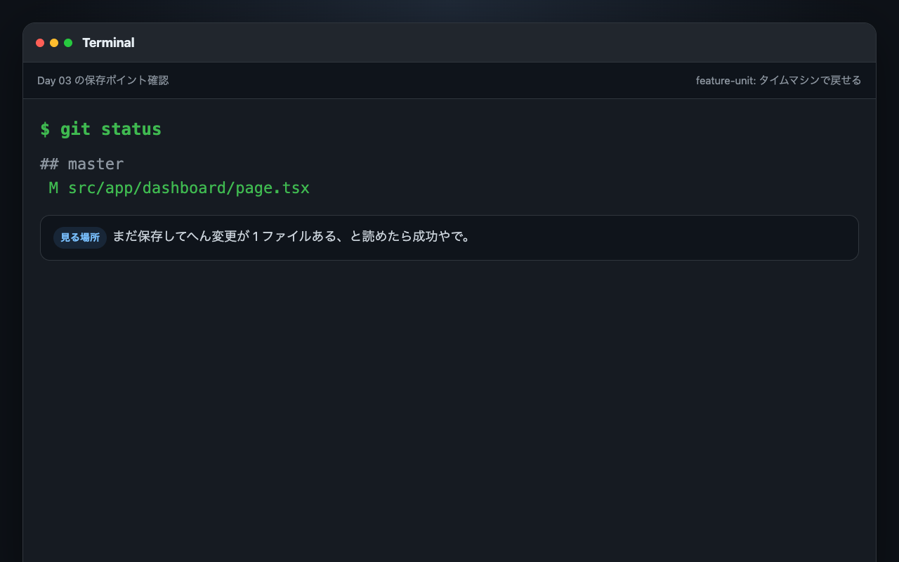
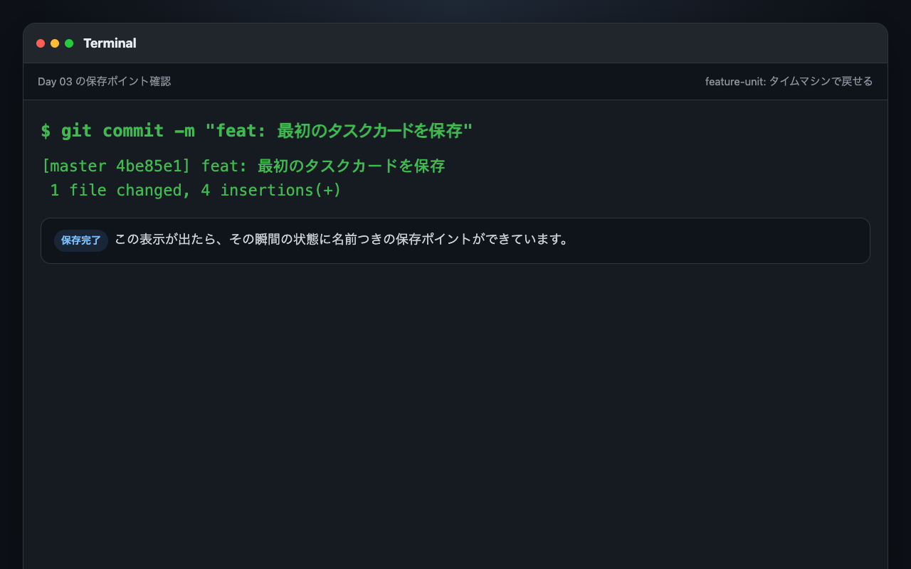
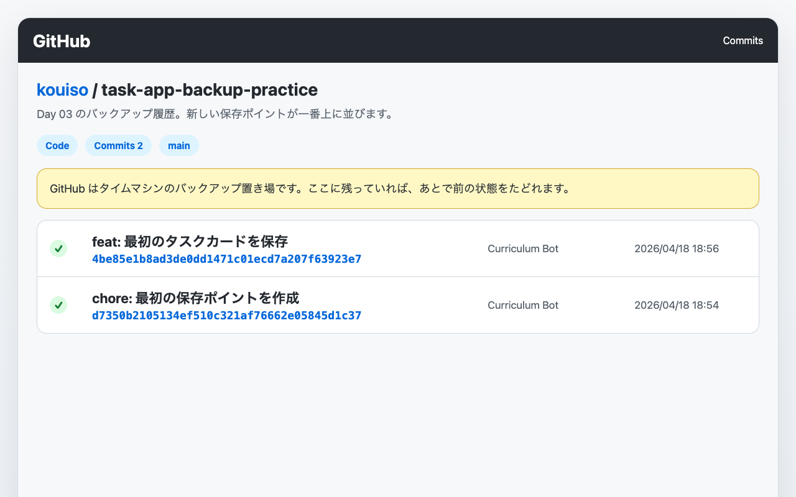

# Day 03: GitHubに保存する

30日かけて、自分専用のタスク管理アプリを作っていきます。
Day 01 で土台を立ち上げ、
Day 02 でダッシュボードに自分の名前やメッセージを表示しました。

今日はその変化を、
自分のパソコンの中だけでは終わらせない日です。

GitHub に保存すると、
このアプリははじめて
「URL を持つ自分の開発物」
になります。

ローカルで作った一歩が、
履歴として残ります。
あとから見返すこともできます。
次の Day で Vercel に公開するときも、
この履歴がそのまま土台になります。

## この日でできるようになること

Day 02 までで育てた `task-app` を、
自分の GitHub リポジトリに安全に保存できるようになります。
ただ `git push` を通すだけでなく、次のことができるようになります。

- 今のプロジェクトがどんな Git 状態かを読めるようになる
- GitHub に空の保存先を正しく作れるようになる
- `README.md` を最低限の顔として整えられるようになる
- `.env` を巻き込まずに、変更したファイルだけを意図的に記録できるようになる
- 次の Day で公開に進める状態を、自分の手でつくれるようになる

ここまで終わると、
「教材を読んで触ったコード」ではなく、
「自分が積み上げていくプロダクトの履歴」
に見えてきます。

## 今日のゴール

- [ ] Day 02 の完成状態から作業を再開する
- [ ] いまの Git 状態とブランチ名、未保存の変更を確認する
- [ ] `README.md` を、自分のアプリに合う内容へ整える
- [ ] `.gitignore` と `.env.example` の役割を確認する
- [ ] GitHub に空のリポジトリを作成する
- [ ] `gh auth login` で安全に GitHub 認証を済ませる
- [ ] `origin` を登録して、ローカルの履歴を GitHub に送る
- [ ] ブラウザで GitHub のリポジトリページを開き、自分のコードが見えることを確認する

### 新しく学ぶ概念

| 概念 | 読み方 | 役割 | 例え |
|------|--------|------|------|
| Git | ギット | ファイルの変更履歴を記録するツール | セーブポイント付きゲーム |
| GitHub | ギットハブ | Git リポジトリをクラウドに保存するサービス | クラウド上のセーブデータ置き場 |
| commit | コミット | 変更をセーブポイントとして記録 | セーブボタンを押す |
| push | プッシュ | ローカルのセーブを GitHub にアップロード | セーブデータをクラウドに同期 |
| .gitignore | ギットイグノア | Git に追跡させないファイルの指定 | 「この書類はコピーしないで」リスト |

## Front Matter

- Day: `03`
- Group: `Phase 1（環境構築・即公開）`
- Feature Theme: `GitHub に保存する`
- Learning Outcome: `ローカルで育てた task-app を、自分の GitHub に履歴付きで安全に保存できる`
- Prerequisites: `Day 02 完了`

## 前提（Day 02 完了していること）

今日は Day 02 の続きから進めます。
新しいプロジェクトを作り直す日ではありません。

次の状態になっている前提で進めよう。

- `task-app` ディレクトリが手元にある
- `npm install` 済みで `npm run dev` が動く
- `src/app/dashboard/page.tsx` に Day 02 の自分用ダッシュボードがある
- `.env.example` が置かれている
- `.gitignore` が置かれている

ここで大事なのは、
**昨日までの自分の作業を、そのまま GitHub に持っていく**
という流れです。

今日は別の完成品を取りに行きません。
昨日の続きの `task-app` を、
そのまま外へ出していきます。

### Step 0: Git の準備を確認する

`create-next-app` で作ったプロジェクトは、
基本的に最初から `git init` まで済んでいます。
だから、ほとんどの人はこのまま次へ進んで大丈夫です。

もしこのあと `git status` を実行して
`not a git repository` と表示されたら、
プロジェクトのルートで一度だけ次を実行しよう。

```bash
git init
```

> Git の箱がまだ作られていない場合だけ実行すればOK。何度もやる作業ではないで。

**確認ポイント**:
- `git init` が必要な場合だけ実行した
- すでに Git 管理されている場合は、このまま次へ進めると分かった

### 新しく学ぶ概念

| 概念 | 読み方 | 役割 | 例え |
|------|--------|------|------|
| Git | ギット | ファイルの変更履歴を記録するバージョン管理ツール | セーブポイント付きのノート。いつでも過去に戻れる |
| GitHub | ギットハブ | Git の履歴をインターネット上に保存・共有するサービス | クラウド上のセーブデータ保管庫 |
| リポジトリ | — | プロジェクトのファイル一式＋履歴をまとめた箱 | 1つのプロジェクト専用フォルダ（履歴付き） |
| コミット | — | 「この時点の状態を記録する」操作 | ゲームでセーブする行為 |
| プッシュ | — | ローカルのコミットを GitHub に送る操作 | セーブデータをクラウドにアップロードする |
| `.gitignore` | ギットイグノア | Git に無視させるファイルを指定するリスト | 「このファイルはセーブに含めなくてよい」リスト |

> **Git は最初ちょっと難しく感じるけど、今日やるのは「保存して GitHub に送る」だけ。** ブランチやマージは今日は使いません。

## 今日の見どころ

GitHub に保存できるようになると、
自分のコードに「置き場所」ができます。

これは地味に見えて、
開発体験の質をかなり変えます。

たとえば今日の終わりには、
ブラウザで
`https://github.com/<自分のユーザー名>/task-app`
みたいな URL を開いて、
Day 01 から Day 03 までの自分の積み上げが見えるようになります。

ローカルでしか見えないものは、
うっかり壊したり、
別の端末に移れなかったり、
「いつでも消えるかもしれない」感じが残ります。

でも GitHub に履歴が残ると、
その一歩はもう
「なくなりやすい練習」
ではなくて、
「次に進める土台」
になります。

Day 04 の公開も、
ここがあるから安心して進めます。

## 前日からの状態確認

まずは Day 02 の終わりから、
いま何が残っているかを揃えよう。

Day 02 の最後では、
こう予告していました。

> 次は GitHub に保存して、
> 「自分で育てたアプリの進化」を積み上げていける状態にしていこう。

今日はまさにここに取り組みます。

### まずはアプリがまだ元気に動くか確認する

開発サーバーを止めているなら、
もう一度起動しておこう。

```bash
npm run dev
```

ブラウザでは次の状態が見えていたら OK です。

- Day 02 で作った自分用ダッシュボードが表示される
- `Hello Task-App` ではなく、自分の名前やメッセージが主役として見える
- 画面が崩れていない

ここで表示がおかしかったら、
GitHub に送る前に先に直したほうがよいです。

GitHub は
「壊れたものでも保存できる場所」
ではあるけど、
今日の狙いは
**いまの良い状態を、ちゃんと残すこと**
だからです。

### ローカルの Git はもう始まっている

今日の教材では、
ローカルの Git 管理そのものは
もう始まっている前提で進めます。

理由は Day 01 の土台づくりで使った流れにあります。

`scripts/scaffold-from-scratch.sh` は、
空ディレクトリに公式の `create-next-app` を実行します。
そして Day 01 の実行ログにも、
`Initialized a git repository.` と出ていました。

つまり今日は、
ローカルの履歴づくりをゼロから始める日ではなく、
**その履歴を GitHub に接続する日**
です。

ここを分けて理解できると、
Git の役割がかなり整理しやすいです。

## Step 1: いまの Git 状態を読む

いきなり GitHub 側を触る前に、
まずローカルの状態を確認しよう。



ここを見ずに進むと、
「いま何が未保存なのか」
「どのブランチにいるのか」
「すでに接続先があるのか」
が分からないままになります。

プロっぽい進め方は、
送る前に現在地を読むことです。

### 実行コマンド

```bash
pwd
git status -sb
git branch --show-current
git log --oneline --decorate -3
git remote -v
```

### この5つで見ていること

- `pwd`
  今本当に `task-app` のルートにいるか確認する
- `git status -sb`
  変更中のファイルと、ブランチの概要を短く見る
- `git branch --show-current`
  いまどのブランチ名で作業しているか確認する
- `git log --oneline --decorate -3`
  直近の履歴があるか確認する
- `git remote -v`
  すでに GitHub などの保存先がつながっていないか確認する

### 期待するイメージ

人によって多少違うけど、
今日はだいたいこんな感じなら進めやすいです。

```text
/Users/your-name/workspace/task-app
## main
main
8f2c4a1 (HEAD -> main) feat: personalize dashboard message
4c6f8e0 chore: bootstrap task-app scaffold
```

`git remote -v` は、
まだ何も出ないかもしれません。
それで問題ありません。

### ここで見ておきたい判断ポイント

- `git status -sb` に `??` や `M` が出ているなら、まだコミットしていない変更がある
- `git remote -v` が空なら、まだ GitHub 側の保存先は未接続
- ブランチ名が `main` 以外でも慌てなくていい

今日はブランチ名を固定で決め打ちせず、
**いま実際にいるブランチをそのまま GitHub に送る**
流れで進めます。

このやり方にしておくと、
環境差でつまずきにくいです。

## Step 2: GitHub に置く前に、README を自分の顔に整える

GitHub に保存すると、
最初に見られるのはコードそのものだけではありません。

リポジトリのトップに出る `README.md` も、
そのアプリの顔になります。

Day 03 の段階では、
まだ機能一覧を全部書き切る必要はありません。
でも最低限、
「何のアプリで」
「いま何ができて」
「どう起動するか」
が見えるだけで、
リポジトリの印象はかなり変わります。

### いまの README を開いて確認する

```bash
sed -n '1,200p' README.md
```

もし教材用の説明が中心で、
まだ自分の `task-app` の現在地が見えにくいなら、
ここで整えてしまおう。

### 編集アンカー

`~/workspace/task-app/README.md` を開いて、
ファイル全体を次の内容に置き換えます。

~~~md title="README.md"
# task-app

30日カリキュラムで育てていく、
自分専用のタスク管理アプリです。

Day 03 時点では、
Next.js 15 / TypeScript を土台にして、
自分用のダッシュボード画面まで進んでいます。

## 現在できること

- ダッシュボード画面を表示できる
- 自分の名前や集中テーマを画面に出せる
- Git でローカル履歴を持てる
- GitHub に保存して、次の公開準備に進める

## 使用技術

- Next.js 15
- TypeScript
- Tailwind CSS
- Prisma
- tRPC

## ローカル起動

```bash
npm install
cp .env.example .env
npm run dev
```

ブラウザで `http://localhost:3000` を開いて確認します。

## 今日の進捗

Day 01:
土台を立ち上げて、最初の画面を表示しました。

Day 02:
ダッシュボードに自分だけのメッセージを追加しました。

Day 03:
このプロジェクトを GitHub に保存して、
履歴を積み上げられる状態にします。
~~~

### この README で押さえていること

- リポジトリ名と内容が最初の数行で分かる
- Day 03 時点の現在地だけを正直に書いている
- 起動手順が短くまとまっている
- まだできていない機能を盛っていない

README は、
派手に書くより
**いまの状態を正確に伝える**
のが強いです。

Day 30 まで進んだら、
ここはまた育て直せばよいです。

## Step 3: `.gitignore` と `.env.example` の役割を確認する

GitHub に保存するとき、
いちばん気をつけたいのが
「送っていいもの」と
「送ってはいけないもの」
の線引きです。

今日の `task-app` では、
その線引きを主に担っているのが
`.gitignore`
と
`.env.example`
です。

### まずは `.gitignore` を確認する

```bash
sed -n '1,220p' .gitignore
```

このプロジェクトでは、
ローカル環境変数を無視する設定がすでに入っています。
特に見てほしいのはこのあたりです。

```text
# local env files
*.env*
!.env.example
secret
*.local
```

### この4行の意味

- `*.env*`
  `.env` や `.env.local` みたいなローカル設定を Git 管理から外す
- `!.env.example`
  ただし見本用の `.env.example` は GitHub に残す
- `secret`
  `secret` という名前のファイルも避ける
- `*.local`
  ローカル専用ファイルをまとめて避ける

この形になっているから、
チームでも個人開発でも
「起動に必要な項目は共有するけど、
本物の値は共有しない」
がやりやすいです。

### `.env.example` も確認する

```bash
sed -n '1,120p' .env.example
```

Day 01 の scaffold では、
すでに見本ファイルが作られています。

これがあると、
GitHub を見に来た未来の自分も、
次に参加する人も、
「何の環境変数が必要なのか」
を推測しやすいです。

### ここでの判断

- `.env` や `.env.local` は GitHub に送らない
- `.env.example` は GitHub に送っていい
- `.gitignore` があるから安心ではなく、送る前に `git status` でも確認する

この
「ignore 設定がある」
と
「実際の送信前に自分でも確認する」
の両輪が大事です。

## Step 4: GitHub アカウントと空のリポジトリを用意する

次は GitHub 側に、
このプロジェクトの保存先を用意します。

ここでのポイントは
**空のリポジトリを作る**
ことです。

ローカルにはすでに履歴があります。
なので GitHub 側で別の初期ファイルを作る必要はありません。

### ブラウザでやること

1. `https://github.com/new` を開く
2. Owner を自分のアカウントにする
3. Repository name に `task-app` と入れる
4. Public / Private は好きなほうで選ぶ
5. `Add a README file` はオフのままにする
6. `Add .gitignore` もオフのままにする
7. `Choose a license` も未選択のままにする
8. `Create repository` を押す

### ここで README を足さない理由

GitHub 側で先に README を作ると、
GitHub 側だけが持つ最初の履歴ができます。

今回はローカルで Day 01 から育てた履歴を主役にしたいです。
だから保存先は空でよいです。

### 作成後に確認すること

- URL が `https://github.com/<自分のユーザー名>/task-app` になっている
- まだファイル一覧は空に近い表示になっている
- “push an existing repository” に近い案内が出ている

この画面は、
次のステップで使う URL を確認する場所でもあります。

ブラウザは開いたままにしておこう。

## Step 5: GitHub CLI で認証する

リポジトリの箱を作っただけでは、
まだローカルから送れません。

次に必要なのは、
**このターミナルが自分の GitHub アカウントとして送信していい**
と認証してもらうことです。

今日のメインルートでは、
`gh auth login` を使います。

理由はシンプルで、
初回セットアップとして分かりやすく、
秘密の値を手で URL に埋め込む運用を避けやすいからです。

### まずは `gh` コマンドがあるか確認する

```bash
gh --version
```

### もし `gh` が見つからないとき

macOS なら、
次で入れられます。

```bash
brew install gh
```

入れ終わったら、
もう一度バージョンを確認してから進めよう。

### 認証を実行する

```bash
gh auth login
```

画面の質問では、
次の選び方で進めると分かりやすいです。

- GitHub.com
- HTTPS
- Login with a web browser

するとブラウザが開いて、
コード入力や承認フローが出ます。

指示どおり進めればよいです。

### 認証できたか確認する

```bash
gh auth status
```

### 期待する状態

- 自分の GitHub ユーザー名が表示される
- 認証先が `github.com` になっている
- エラーが出ていない

ここが通ったら、
今日のメインルートでは十分です。

## Step 6: `origin` を登録して、ローカルと GitHub をつなぐ

次はローカルの `task-app` に、
GitHub の保存先 URL を教えます。

Git では、
こういう保存先の別名として
`origin`
を使うことが多いです。

名前は慣習ですが、
ほぼ標準だと思ってよいです。

### URL を確認する

GitHub のリポジトリページで、
HTTPS の URL を確認します。

形はこうです。

```text
https://github.com/<your-user-name>/task-app.git
```

### `origin` を追加する

`<your-user-name>` は、
自分の GitHub ユーザー名に置き換えてください。

```bash
git remote add origin https://github.com/<your-user-name>/task-app.git
git remote -v
```

### 期待する表示

```text
origin  https://github.com/<your-user-name>/task-app.git (fetch)
origin  https://github.com/<your-user-name>/task-app.git (push)
```

### もし `origin` がすでにあるとき

この教材の Day 03 では、
基本的には未接続を想定しています。

でも `git remote -v` の時点ですでに何か出ていたなら、
その URL が本当に自分の GitHub リポジトリか確認しよう。

自分のものと違うなら、
いったん立ち止まって、
どこにつながっているかを整理してから進めるほうが安全です。

焦って送るのがいちばん危ないです。

## Step 7: 送る前に、どのファイルを履歴に残すか決める

ここが今日の本質です。

GitHub に保存する日は、
「とりあえず全部送る」
日ではありません。

**今日の状態として残したいものだけを、自分で選ぶ**
日です。

Day 02 からの文脈で言うと、
主役はこのへんでしょう。

- `src/app/dashboard/page.tsx`
  Day 02 で育てた自分用ダッシュボード
- `README.md`
  GitHub に置いたときの顔
- `.gitignore`
  もし自分の環境で追記が必要なら、その調整
- `.env.example`
  起動に必要な見本が変わったなら、その更新

### まずは `git status` で差分を読む

```bash
git status --short
```

この時点で、
たとえばこんな表示になるかもしれません。

```text
 M README.md
 M src/app/dashboard/page.tsx
?? package-lock.json
?? package.json
?? prisma/
?? src/
```

もし `.env` や `.env.local` がここに出ていたら、
そのまま進まなくてよいです。

`.gitignore` の設定か、
ファイル名の置き方を先に見直そう。

今日の目的は、
動くものを保存するだけではなくて、
**送っていいものだけを送る習慣を作ること**
だからです。

### アプリ実行に必要なファイルを add する

この Day では、Vercel が GitHub 上で build できるように、
アプリ実行に必要なファイルを明示的に add します。

`material/` は教材本文、`scripts/` は初期セットアップ用なので、
GitHub に上げなくてもアプリのデプロイには不要です。
一方で `package.json` や `src/` や `prisma/` が抜けると、
Day 04 の Vercel build が壊れます。

```bash
git add README.md
git add package.json package-lock.json
git add tsconfig.json next.config.* postcss.config.* biome.json
git add prisma prisma.config.ts
git add public src
git add .env.example docker-compose.yml
git status --short
```

### ここで見たい表示

```text
M  README.md
A  package.json
A  prisma/schema.prisma
A  src/app/page.tsx
A  src/app/dashboard/page.tsx
```

左側に状態が出ていれば、
ステージングできています。

### コミットメッセージを付けて保存する

今日は最初の GitHub 保存なので、
何を残したかが一目で分かる名前にしよう。

```bash
git commit -m "feat: save initial dashboard project to GitHub"
```

### コミット後の確認

```bash
git status -sb
git log --oneline --decorate -3
```

`working tree clean` に近い状態になって、
最新のコミットが追加されていたら OK です。



## Pro パターンで書こう — GitHub に送る日は `git add .` ではなく、残したいファイルを選ぶ

ここまでで GitHub に送る流れは作れました。
でもプロの現場ではもう一段上のやり方をします。

今日の文脈で言うと、
GitHub に保存する日は
「全部まとめて乗せる」
より、
「今日の進化として残したいファイルを自分で選ぶ」
ほうが強いです。

なぜそうするのか、
**Before/After** で見比べてみよう。

### Before（動くけど、プロは書かない）

```bash
git status --short
git add .
git commit -m "update"
git push -u origin "$(git branch --show-current)"
```

**この流れの問題点**:

- 何を GitHub に送ったのかが自分でも曖昧になりやすい
- `.gitignore` の設定漏れや想定外ファイル混入に気づきにくい
- `update` みたいなメッセージでは、あとから履歴を読んだときに意味が薄い

### After（プロがやる流れ）

```bash
git status --short
git add README.md
git add src/app/dashboard/page.tsx
git status --short
git commit -m "feat: save initial dashboard project to GitHub"
git push -u origin "$(git branch --show-current)"
```

**この流れの強み**:

- どのファイルを今日の進化として残したいかが明確になる
- 送信前に差分をもう一度目で確認できる
- コミット履歴を読んだ未来の自分が、何をやった日かすぐ分かる

#### 覚えておきたいエッセンス

GitHub に保存する日は、
手を速く動かすより
**何を残すかを自分で選ぶ**
ほうが大事です。

履歴は量より、
意味の見えやすさが効きます。

## Step 8: いまいるブランチを GitHub に送る

ここまで来たら、
ローカルの履歴は整いました。

次はそれを GitHub に送ります。

今日の教材では、
ブランチ名を固定で決め打ちせず、
**いま実際にいるブランチをそのまま push する**
形で進めます。

これなら、
`main` でも別名でも動かしやすいです。

### 実行コマンド

```bash
git push -u origin "$(git branch --show-current)"
```

### `-u` の意味

初回だけ、
「このローカルブランチは、今後この `origin` 側の同名ブランチに送る」
という紐づけを作ります。

一度これが通れば、
次からは `git push` だけで進めやすくなります。

### 期待する表示イメージ

```text
Enumerating objects: 18, done.
Counting objects: 100% (18/18), done.
Delta compression using up to 8 threads
Compressing objects: 100% (12/12), done.
Writing objects: 100% (18/18), 3.10 KiB | 3.10 MiB/s, done.
Total 18 (delta 2), reused 0 (delta 0), pack-reused 0
To https://github.com/<your-user-name>/task-app.git
 * [new branch]      main -> main
branch 'main' set up to track 'origin/main'.
```

環境によって文言は多少違います。
でも次の3点が見えたらだいたい大丈夫です。

- `To https://github.com/...` が出ている
- 新しいブランチが GitHub 側に作られている
- tracking が設定されたと分かる文言が出ている

## Step 9: ブラウザで GitHub のページを確認する

ターミナルで push が通っても、
最後はブラウザで見に行こう。

GitHub は
「送れたつもり」
より
「見えている」
が大事です。

### 確認手順

1. さっき作った GitHub リポジトリページを開く
2. ブラウザを再読み込みする
3. ファイル一覧が表示されるか確認する
4. `README.md` の内容がページ下部に表示されるか確認する
5. `src/app/dashboard/page.tsx` がリポジトリ内に存在するか確認する

### ここで見えていたら成功

- リポジトリ URL が自分のアカウント配下になっている
- `README.md` がトップページに表示される
- `src` ディレクトリがある
- Day 02 までのコードが GitHub 上で見える



この瞬間が、
今日のいちばん気持ちいいところです。

自分のコードに、
はじめてちゃんとした置き場所ができました。

## Step 10: よくあるつまずきを、送る前後で切り分ける

GitHub まわりは、
一個詰まると全部止まったように見えやすいです。

でも実際には、
だいたい次のどこかに分かれます。

- 認証の問題
- 保存先 URL の問題
- ローカル差分の問題
- まだコミットしていない問題

ここでは、
今日の流れに沿って見直し順を置いておきます。

### `gh auth login` がうまく進まない

まずはこれを見直そう。

```bash
gh auth status
```

ここで未認証っぽい表示なら、
ブラウザ認証が最後まで終わっていない可能性が高いです。

もう一度、
落ち着いてやり直せばよいです。

```bash
gh auth login
```

### `git remote -v` に何も出ない

保存先がまだ登録されていません。
なので push 先が分からない状態です。

あらためて `origin` を追加しよう。

```bash
git remote add origin https://github.com/<your-user-name>/task-app.git
git remote -v
```

### push 前に「変更が残っている」と感じる

まずはこれで状態を読みます。

```bash
git status --short
```

ここで何が出ているかを見てから、
add するか、
今日は送らないかを決めます。

**見えていない差分を、そのまま送らない**。
これだけ覚えておけばかなり安全です。

### `.env` が出てきてしまった

そのまま add しません。

まず `.gitignore` に
環境変数ファイルを避ける行があるか見直そう。
この教材では Day 01 の土台にすでに入っている想定だから、
ファイル名や配置のズレが原因なことが多いです。

```bash
sed -n '1,220p' .gitignore
git status --short
```

`.env.example` は見本として残してよいです。
でも本物の値が入った `.env` は送りません。

### push 後に GitHub ページへ反映されない

まずは push が通っているか、
直近ログを見直そう。

```bash
git log --oneline --decorate -3
git remote -v
git branch --show-current
```

つぎに GitHub ページを再読み込みします。
ブランチ切り替え UI がある場合は、
いま送ったブランチが表示対象になっているかも見ておこう。

## Step 11: いまの Day 03 を、自分の言葉で説明できる状態にする

ここまでできたら、
操作としては十分です。

でも教材としてもう一歩大事なのは、
今日やったことを
自分の言葉で説明できることです。

次の4つを言えたら、
理解としてかなり強いです。

### 1. ローカルの Git と GitHub は別物

ローカルの Git は、
自分のパソコンの中で履歴を持つ仕組みです。

GitHub は、
その履歴を置く外側の保存先です。

今日は
「ローカルで持っていた履歴を、GitHub に接続して送った」
と説明できればよいです。

### 2. `origin` は保存先の別名

覚えにくそうに見えるけど、
意味はシンプルです。

ローカルから見た
「いつもの送信先」
につける名前だと思えば十分。

### 3. `commit` と `push` は役割が違う

`commit` はローカル履歴を残すこと。

`push` は、
その履歴を GitHub に送ること。

この2段階があるから、
送る前に内容を自分で見直せます。

### 4. `.gitignore` は守り、`git status` は最終確認

設定があるだけで安心しません。
最後は人間の目でも確認します。

これが
GitHub に安全に保存する日の基本姿勢です。

## 覚えておきたいエッセンス

- Day 03 は、新しい完成品を取りに行く日ではなく、Day 02 までの自分の進化を GitHub に乗せる日だ
- この教材の流れでは、ローカルの Git 管理はすでに始まっています。今日は GitHub と接続して外へ出す
- GitHub に送る前に、`git status` で現在地を読むクセをつける
- `README.md` はリポジトリの顔になります。Day 03 では正直で短い説明がいちばん強い
- `.env` は送らず、`.env.example` は送ります。この線引きを `.gitignore` と目視確認で守る
- `git add .` で雑にまとめるより、今日残したいファイルを自分で選ぶほうが履歴の質が上がる
- `commit` はローカル保存、`push` は GitHub への送信。この役割分担を分けて理解する
- 最後はブラウザで GitHub ページを開いて、本当に見えているところまで確認する

## 今日のチェックリスト

最後に、
この Day の完了条件を自分で確認しておこう。

- [ ] `git status -sb` で現在地を読めた
- [ ] `README.md` を自分の `task-app` に合う内容へ整えた
- [ ] `.gitignore` と `.env.example` の役割を確認した
- [ ] GitHub に空のリポジトリを作れた
- [ ] `gh auth login` が通った
- [ ] `git remote add origin ...` で保存先を登録できた
- [ ] 変更したファイルだけを add してコミットできた
- [ ] `git push -u origin "$(git branch --show-current)"` が通った
- [ ] GitHub のブラウザ画面でコードが見えた

全部埋まったら、
Day 03 は完了です。

## 次回予告

GitHub に保存できたら、
このアプリはようやく
「ローカルの中だけの制作物」
から一歩踏み出せます。

次はこの履歴を使って、
ネットに公開していきます。

Day 04 では Vercel につないで、
自分の `task-app` を実際の URL で開ける状態まで持っていこう。

GitHub に保存した今日の一歩が、
そのまま公開への橋になります。
