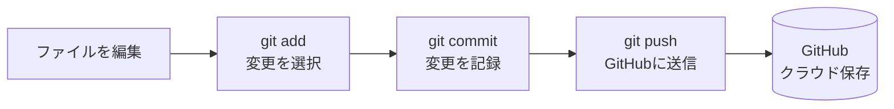
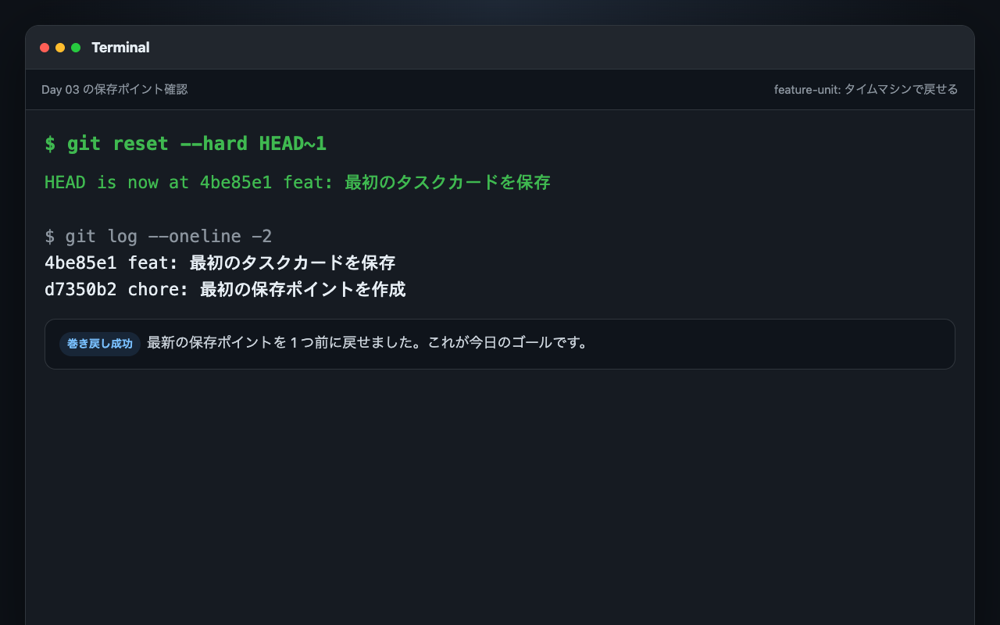

# Day 03: GitHubに保存しよう

## 🔙 前回の振り返り

Day 02 ではダッシュボードにウェルカムバナーを追加しながら、`const`・`let` による変数宣言と `string`・`number`・`boolean` の型の基本を学びました。コードを編集してアプリに反映できるようになったので、今日はそのコードを GitHub に保存する方法を学びます。

---

## 🎯 今日のゴール

あなたが書いたコードをGitHubに保存できるようになります。GitHubに保存することで、コードのバックアップを取ったり、他の人と共有したりできます。

> 📸 GitHub のリポジトリページ（`https://github.com/<ユーザー名>/task-app`）を開き、コードがアップロードされていることをブラウザで確認してください。

### 前提

Day 01で教材リポジトリを `git clone` 済みで、Day 02でウェルカムバナーを追加済みです。Day 03ではその変更を「自分のGitHub」に保存します。

## 🤔 なぜこれを作るのか？

コードを書いていると、「間違えて削除してしまった」「前の状態に戻したい」という場面に出会います。GitHubに保存しておけば、いつでも過去の状態に戻せます。さらに、チームで開発する際にも、GitHubが中心的な役割を果たします。

> 💡 **例え話**: GitHubは、Googleドライブのようなものです。コードをクラウドに保存しておけば、パソコンが壊れてもデータは残り、安心して開発を進められます。

### 📐 Git操作の流れ



## 📊 実装ステップ一覧

| ステップ | 作業内容 | 所要時間 |
|---------|---------|---------|
| Step 1 | Gitの初期設定 | 5分 |
| Step 2 | リポジトリを作成 | 5分 |
| Step 3 | 変更をコミット | 10分 |
| Step 4 | GitHub認証を設定する | 10分 |
| Step 5 | GitHubにプッシュ | 5分 |
| Step 6 | Gitの便利コマンドを体験 | 10分 |
| Step 7 | .gitignore を理解しよう | 5分 |

**合計時間**: 約50分

---

### Step 1: Gitの初期設定（5分）

🎯 **ゴール**: Gitに自分の名前とメールアドレスを設定します。

🔰 **初心者向け解説**: Gitは、誰がいつコードを変更したのかを記録します。そのために、あなたの名前とメールアドレスを最初に設定する必要があります。設定は一度だけ行えば、それ以降は自動的に記録されます。

💻 **実装**:

```bash
# filepath: ターミナル
git config --global user.name "<あなたの名前>"
git config --global user.email "<あなたのメールアドレス>"

# 設定内容を確認
git config --list
```

🔍 **コード解説**:

| コマンド | 意味 | 例え |
|--------|------|------|
| `git config --global user.name` | Gitに名前を設定 | 作品に著者名を書く |
| `git config --global user.email` | Gitにメールアドレスを設定 | 著者の連絡先を添える |
| `--global` | 全プロジェクトで共通の設定 | 全ての作品に同じ署名を使う |

✅ **確認ポイント**:

1. `git config --list`で設定を確認
2. `user.name`と`user.email`が表示される
3. これでGitの初期設定が完了です

> 📸 ターミナルで `git config --list` を実行し、`user.name` と `user.email` が正しく表示されていることを確認してください。

📝 **学んだこと**: `git config`コマンドで、Gitに自分の情報を登録できるようになりました。

---

### Step 2: リポジトリを作成（5分）

🎯 **ゴール**: GitHubに新しいリポジトリを作成します。

🔰 **初心者向け解説**: リポジトリは、コードを保存する「プロジェクトフォルダ」のようなものです。GitHubのWebサイトから、新しいリポジトリを作成できます。リポジトリ名は、プロジェクトの内容がわかりやすい名前にしましょう。

📝 **手順**:

1. ブラウザで`https://github.com`にアクセス
2. 右上の「+」ボタンをクリック
3. 「New repository」を選択
4. リポジトリ名に`task-app`と入力
5. 「Public」を選択（公開リポジトリ）
6. 「Create repository」をクリック

🔍 **設定項目**:

| 項目 | 設定値 | 意味 |
|------|--------|------|
| Repository name | `task-app` | リポジトリの名前 |
| Public/Private | Public | 誰でも見られる |
| Initialize this repository | **チェックしない** | 空のリポジトリとして作成する |

> ⚠️ **「Initialize this repository」には絶対にチェックしないこと**: Day 01 で `git clone` した時点で、ローカルには既存のGit履歴が存在しています。GitHub側でREADME.mdや.gitignoreを追加して初期化すると、リモートとローカルの履歴が別々に作られた状態（unrelated histories）になり、`git push`が拒否されます。

✅ **確認ポイント**:

1. GitHubに新しいリポジトリが作成される
2. リポジトリのURLが表示される（`https://github.com/<あなたのユーザー名>/task-app`）
3. 「Initialize this repository」にチェックを入れていないこと

> 📸 GitHub のリポジトリページが表示され、`https://github.com/<ユーザー名>/task-app` の URL が確認できることをブラウザで確認してください。

📝 **学んだこと**: GitHubのWebサイトから、新しいリポジトリを作成できるようになりました。

---

### Step 3: 変更をコミット（10分）

🎯 **ゴール**: ローカルの変更をGitに記録します。

🔰 **初心者向け解説**: コミットは、「この時点のコードを保存する」という操作です。ゲームのセーブポイントのようなもので、いつでもこの時点に戻れます。コミットメッセージには、何を変更したのかを簡潔に書きます。

まず、Day 02で変更したファイルを確認します。

💻 **実装**:

```bash
# filepath: ターミナル（task-appフォルダ内で実行）
# 変更されたファイルを確認する
git status
```

✅ **確認ポイント**:
- Day 02で変更した `src/app/dashboard/page.tsx` が表示される

変更を確認できたら、ステージング（コミット前の準備場所に追加）してコミット（記録）します。

```bash
# filepath: ターミナル（task-appフォルダ内で実行）
# 変更をステージングエリアに追加してコミット
git add .
git commit -m "feat: ウェルカムバナーを追加"
```

🔍 **コード解説**:

| コマンド | 意味 | 例え |
|--------|------|------|
| `git add .` | 全ての変更をステージングエリア（コミット前の準備場所）に追加。`.`は「このフォルダの全ファイル」の意味 | 引っ越しリストに荷物を書き込む |
| `git commit -m "メッセージ"` | 変更を記録する | セーブボタンを押す |

> ⚠️ `git add .` は全ファイルをまとめて追加しますが、`.gitignore` で除外されたファイル（`.env`など）は含まれません。このプロジェクトでは安全です。

✅ **確認ポイント**:

1. `git status`で状態を確認
2. `nothing to commit, working tree clean`と表示される
3. これで変更がコミットされました

> 📸 ターミナルで `git status` を実行し、`nothing to commit, working tree clean` と表示されていることを確認してください。

💡 **コミット履歴を確認するコマンド**:

```bash
# filepath: ターミナル
git log --oneline
```

1 行に 1 コミットが表示されます。コミットが増えていく様子を確認できます。

📝 **学んだこと**: `git add`と`git commit`で、変更をGitに記録できるようになりました。

---

### Step 4: GitHub と接続する（初回だけ）（10分）

🎯 **ゴール**: `git push` を使う前に、GitHub 側の保存先とローカルのリポジトリをつなぎます。

🔰 **初心者向け解説**: `git push` をするには、「どこに送るか」と「その GitHub アカウントに入れるか」の 2 つが必要です。ここでは GitHub に `task-app` リポジトリを用意して、`gh auth login` でログインし、ローカルからその保存先へ送れる状態にします。この手順は初回だけでよく、1 回済ませたら次回からスキップできます。

📝 **手順**:

1. ブラウザで https://github.com/new を開き、リポジトリ名 `task-app` で新規作成する（Public 推奨。迷ったら Public を選ぶ）
2. 作成直後に表示されるページは閉じずに残しておく
3. ターミナルで GitHub CLI のログインを済ませる

> 💡 **gh コマンドが見つからない場合**:
> - macOS: `brew install gh`
> - Windows (PowerShell): `winget install --id GitHub.cli`
> - WSL (Ubuntu): `sudo apt install gh`（初回は https://cli.github.com/ の手順で apt リポジトリ追加が必要）
> インストール後、ターミナルを開き直してから `gh auth login` を実行してください。

```bash
# filepath: ターミナル
# GitHub CLI にログイン（ブラウザが開くので、画面の指示にしたがって承認）
gh auth login
```

4. ローカルのリポジトリに GitHub の URL を教える

```bash
# filepath: ターミナル（task-appフォルダ内で実行）
# `<your-username>` は自分の GitHub ユーザー名に置き換える
git remote add origin https://github.com/<your-username>/task-app.git
```

ここまで済んだら、`git push` ができる状態になっています。次の Step 5 へ進みましょう。

> `gh` コマンドが入っていないときは、まず Homebrew で `brew install gh` してから上の手順に戻ります。

✅ **確認ポイント**:

1. GitHub に `task-app` リポジトリを作成できた
2. `gh auth login` を実行してログインできた
3. `git remote add origin` で保存先を登録できた

> 📸 GitHub のリポジトリ作成画面、または作成後のリポジトリページで `task-app` ができていることを確認してください。

📝 **学んだこと**: GitHub に保存先を用意して、ローカルから送るための接続を作れるようになりました。

---

### Step 5: GitHubにプッシュ（5分）

🎯 **ゴール**: ローカルのコミットをGitHubにアップロードします。

🔰 **初心者向け解説**: プッシュは、ローカル（あなたのパソコン）のコミットをGitHub（クラウド）にアップロードする操作です。プッシュすることで、他の人もあなたのコードを見られるようになります。

Step 4 で保存先とログインが済んでいれば、ここではアップロードするだけで OK です。

```bash
# filepath: ターミナル（task-appフォルダ内で実行）
# 初回だけ -u でブランチと紐づける（2 回目以降は `git push` だけで OK）
git push -u origin HEAD
```

🔍 **コード解説**:

| コマンド | 意味 | 例え |
|--------|------|------|
| `git push -u origin HEAD` | GitHubにアップロードし、今いるブランチを保存先と紐づける | クラウドに保存 |

✅ **確認ポイント**:

1. ターミナルにブランチが `origin` と紐づいたことを示すメッセージが表示される
2. GitHubのリポジトリページをリロードすると、コードが表示される
3. これでGitHubにプッシュが完了です

> 📸 GitHub のリポジトリページ（`https://github.com/<ユーザー名>/task-app`）をリロードし、ソースコードの一覧が表示されていることをブラウザで確認してください。

📝 **学んだこと**: `git push`コマンドで、ローカルのコミットをGitHubにアップロードできるようになりました。

---

### Step 6: Gitの便利コマンドを体験（10分）

🎯 **ゴール**: `git log`、`git diff`、`git status`を使って、Gitの状態を確認する方法を学びます。

🔰 **初心者向け解説**: Gitはコードの履歴を管理するツールです。

「今どんな状態か」「前とどこが変わったか」「これまでの記録は」を確認するコマンドがあります。

これらを覚えておくと、安心して開発を進められます。

#### 6-1. `git status`で現在の状態を確認

```bash
# filepath: ターミナル
git status
```

🔍 **出力の読み方**:

| 出力メッセージ | 意味 |
|--------------|------|
| `nothing to commit, working tree clean` | 変更なし。すべて保存済み |
| `Changes not staged for commit` | 変更があるがまだ`git add`していない |
| `Untracked files` | Gitが追跡していない新しいファイルがある |

#### 6-2. ファイルを変更して差分を確認

試しに小さな変更を加えて、`git diff`で差分を確認してみましょう。

VS Codeで `README.md` を開き、ファイルの末尾に以下の内容を追記して保存してください。

```markdown
# filepath: README.md（末尾に追記する内容）
### 学習記録
- Day 01: 環境構築完了
- Day 02: ダッシュボードにバナー追加
- Day 03: GitHubに保存
```

✅ **確認ポイント**:
- ファイルを保存した（Ctrl+S / Cmd+S）
- VS Codeのエクスプローラーで README.md に「M」（Modified）マークが付いている

```bash
# filepath: ターミナル
# 変更の差分を確認する
git diff
```

> 💡 `git diff`は、**まだ`git add`していない変更**を表示します。`+`で始まる行が「追加された行」、`-`で始まる行が「削除された行」です。

#### 6-3. `git log`でコミット履歴を確認

```bash
# filepath: ターミナル
# コミット履歴を見やすく表示
git log --oneline
```

🔍 **出力の読み方**:

| 表示 | 意味 |
|------|------|
| `abc1234` | コミットID（短縮版） |
| `first commit` | コミットメッセージ（教材リポジトリの初期コミット） |

#### 6-4. 変更をコミットしてプッシュ

```bash
# filepath: ターミナル
git add README.md
git commit -m "docs: 学習記録セクションを追加"
git push
```

> 💡 2回目以降のプッシュは `git push` だけでOKです。`-u origin main`は初回のみ必要です。

#### 6-5. 1 回だけ巻き戻してみる

ここが今日の見せ場です。  
「戻せるらしい」で終わらず、練習用の変更を 1 回だけ実際に戻します。

まずは練習用に、どうでもええ小さな変更を 1 つ作ってコミットしてください。  
たとえばカードを 1 枚足して、こんな感じで保存します。

```bash
# filepath: ターミナル
git add .
git commit -m "feat: 練習用にカードを1枚増やす"
```

そのあと、ひとつ前の保存ポイントへ戻します。今日は **`git revert`** を使います。これは「取り消すコミットを新しく 1 つ足す」やり方で、過去の履歴を壊さずに元の状態へ戻せます。

```bash
# filepath: ターミナル
git revert --no-edit HEAD
```



この画面の意味はこうです。

- `HEAD` は「今いちばん新しい保存ポイント」
- `git revert --no-edit HEAD` は「その 1 つを取り消す新しい保存ポイントを作る」
- さっきの練習用コミットの変更が画面から消えて、実質 1 個前の状態に戻る

`git revert` は履歴を消さず、「取り消した」という記録を残すやり方です。あとで見返しても「何を取り消したか」が分かるので、チームで使うときも安心です。  
今日は練習用コミットで試すから大丈夫です。本番の大事な変更でやる前に、「こうやって戻れるんやな」を 1 回だけ体で覚えておきましょう。

✅ **確認ポイント**:

1. `git status`で変更の有無を確認できた
2. `git diff`で変更箇所が表示された
3. `git log --oneline`でコミット履歴が表示された
4. 2回目のプッシュが成功した

> 📸 `git log --oneline` を実行して、2つのコミットが表示されていることを確認してください。

📝 **学んだこと**: `git status`で現在の状態、`git diff`で変更内容、`git log`で履歴を確認できるようになりました。

---

### Step 7: .gitignoreを理解しよう（5分）

🎯 **ゴール**: Gitに追跡させないファイルの設定を理解します。

🔰 **初心者向け解説**: プロジェクトには、Gitに保存すべきでないファイルがあります。パスワードが書かれた設定ファイルや、サイズの大きいライブラリフォルダなどです。`.gitignore`は、Gitに「このファイルは追跡しないで」と伝えるための設定ファイルです。

> 💡 **例え話**: `.gitignore`は「引っ越しで持っていかないものリスト」です。家具（node_modules）は引っ越し先で買い直せるし、日記（.env）は他人に見せたくない。だからリストに書いて「これは運ばないで」と伝えます。

💻 **実装**:

```bash
# filepath: ターミナル
# .gitignore の中身を確認してみましょう
cat .gitignore
```

🔍 **コード解説**:

出力の中から、主要な除外パターンを確認しましょう。

| パターン | 対象 | 理由 |
|---------|------|------|
| `node_modules/` | npm パッケージ | サイズ大、`npm install`で復元可能 |
| `*.env*` | 環境変数ファイル全般 | パスワード等の秘密情報 |
| `!.env.example` | `.env.example` は除外しない | テンプレートとしてGitで管理する |
| `.next/` | ビルド成果物 | `npm run build`で再生成 |

> 💡 **`*.env*` と `!.env.example` の組み合わせ**: `*.env*` で全ての `.env` 系ファイルを除外しつつ、`!.env.example`（`!`は「除外の除外」）でテンプレートだけはGitに残しています。秘密の値は追跡せず、テンプレートは共有する設計です。

次に「追跡する」ものと「追跡しない」ものの判断基準を理解しましょう。

| 判断 | 追跡する | 追跡しない |
|------|---------|-----------|
| ソースコード | ✅ | |
| 設定ファイル | ✅ | |
| パッケージ | | ✅ |
| ビルド成果物 | | ✅ |
| 秘密情報 | | ✅ |

✅ **確認ポイント**:

1. `.gitignore`ファイルの役割を理解した
2. `node_modules/`や`.env`が除外される理由がわかった
3. 「追跡する / しない」の判断基準を理解した

> 📸 ターミナルで `cat .gitignore` を実行し、除外パターンが表示されていることを確認してください。

📝 **学んだこと**: `.gitignore`を使って、Gitに追跡させないファイルを設定できることを理解しました。

---

## 📋 今日のまとめ

- [ ] `git config`でGitの初期設定ができた
- [ ] GitHubで新しいリポジトリを作成できた
- [ ] `git add`と`git commit`で変更を記録できた
- [ ] `gh auth login` で GitHub アカウントに認証できた
- [ ] `git push`でGitHubにアップロードできた
- [ ] `git status`、`git diff`、`git log`で状態を確認できた
- [ ] GitHubのリポジトリページでコードを確認できた

## ⚠️ つまずきポイント

| エラー/問題 | 原因 | 解決方法 |
|------------|------|---------|
| `git push`で`Authentication failed` | GitHub のログインが済んでいない | Step 4に戻って `gh auth login` をやり直す |
| `git push`で`Permission denied` | 保存先URLや権限が合っていない | `git remote add origin https://github.com/<ユーザー名>/task-app.git` の設定を見直す |
| `fatal: remote origin already exists` | リモートが既に登録されている | `git remote rm origin`で削除してから再登録する |
| `git diff`で何も表示されない | 変更がないか、既に`git add`済み | `git diff --cached`でステージング済みの差分を確認する |

### `git revert` がこわい

- その気持ちで正解です
- だから今日は「練習用コミット」だけで試します
- 大事な変更ではなく、戻しても困らへん小さな追加で 1 回だけやるのが安全です
- `revert` は履歴を消さずに「取り消し」を記録する安全なやり方やから、練習でも本番でも使える手順です

## 🔜 次回予告

Day 4では、今日GitHubに保存したアプリを、インターネット上に公開する方法を学びます。Vercelというサービスを使えば、無料でアプリを公開できます。
