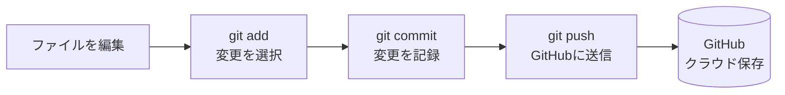

# Day 03: GitHubに保存しよう

## 🎯 今日のゴール

あなたが書いたコードをGitHubに保存できるようになります。GitHubに保存することで、コードのバックアップを取ったり、他の人と共有したりできます。

【スクリーンショット: GitHubのリポジトリにpushした画面】

## 🤔 なぜこれを作るのか？

コードを書いていると、「間違えて削除してしまった」「前の状態に戻したい」という場面に出会います。GitHubに保存しておけば、いつでも過去の状態に戻せます。さらに、チームで開発する際にも、GitHubが中心的な役割を果たします。

> 💡 **例え話**: GitHubは、Googleドライブのようなものです。コードをクラウドに保存しておけば、パソコンが壊れてもデータは残り、安心して開発を進められます。

### 📐 Git操作の流れ



## 📊 実装ステップ一覧

| ステップ | 作業内容 | 所要時間 |
|---------|---------|---------|
| Step 1 | Gitの初期設定 | 5分 |
| Step 2 | リポジトリを作成 | 5分 |
| Step 3 | 変更をコミット | 10分 |
| Step 4 | GitHubにプッシュ | 10分 |

**合計時間**: 約30分

---

### Step 1: Gitの初期設定（5分）

🎯 **ゴール**: Gitに自分の名前とメールアドレスを設定します。

🔰 **初心者向け解説**: Gitは、誰がいつコードを変更したのかを記録します。そのために、あなたの名前とメールアドレスを最初に設定する必要があります。設定は一度だけ行えば、それ以降は自動的に記録されます。

💻 **実装**:

```bash
# filepath: ターミナル
$ git config --global user.name "Your Name"
$ git config --global user.email "your.email@example.com"

# 確認
$ git config --list
```

🔍 **コード解説**:

| コマンド | 意味 | 例え |
|--------|------|------|
| `git config --global user.name` | Gitに名前を設定 | 図書館カードに名前を書く |
| `git config --global user.email` | Gitにメールアドレスを設定 | 図書館カードに連絡先を書く |
| `--global` | 全プロジェクトで共通の設定 | 全ての本に同じ名前を書く |

✅ **確認ポイント**:

【スクリーンショット: 確認画面】

1. `git config --list`で設定を確認
2. `user.name`と`user.email`が表示される
3. これでGitの初期設定が完了です

【スクリーンショット: git config --listの実行結果】

📝 **学んだこと**: `git config`コマンドで、Gitに自分の情報を登録できるようになりました。

---

### Step 2: リポジトリを作成（5分）

🎯 **ゴール**: GitHubに新しいリポジトリを作成します。

🔰 **初心者向け解説**: リポジトリは、コードを保存する「プロジェクトフォルダ」のようなものです。GitHubのWebサイトから、新しいリポジトリを作成できます。リポジトリ名は、プロジェクトの内容がわかりやすい名前にしましょう。

📝 **手順**:

1. ブラウザで`https://github.com`にアクセス
2. 右上の「+」ボタンをクリック
3. 「New repository」を選択
4. リポジトリ名に`task-app`と入力
5. 「Public」を選択（公開リポジトリ）
6. 「Create repository」をクリック

🔍 **設定項目**:

| 項目 | 設定値 | 意味 |
|------|--------|------|
| Repository name | `task-app` | リポジトリの名前 |
| Public/Private | Public | 誰でも見られる |
| Initialize this repository | チェックしない | 既存のコードを使う |

✅ **確認ポイント**:

【スクリーンショット: 確認画面】

1. GitHubに新しいリポジトリが作成される
2. リポジトリのURLが表示される（`https://github.com/your-username/task-app`）
3. これでリポジトリの作成が完了です

【スクリーンショット: GitHubでリポジトリを作成した画面】

📝 **学んだこと**: GitHubのWebサイトから、新しいリポジトリを作成できるようになりました。

---

### Step 3: 変更をコミット（10分）

🎯 **ゴール**: ローカルの変更をGitに記録します。

🔰 **初心者向け解説**: コミットは、「この時点のコードを保存する」という操作です。ゲームのセーブポイントのようなもので、いつでもこの時点に戻れます。コミットメッセージには、何を変更したのかを簡潔に書きます。

💻 **実装**:

```bash
# filepath: ターミナル（task-appフォルダ内で実行）
$ git add .
$ git commit -m "Initial commit: setup task-app"
```

🔍 **コード解説**:

| コマンド | 意味 | 例え |
|--------|------|------|
| `git add .` | 全ての変更をステージングエリアに追加 | セーブしたいファイルを選ぶ |
| `git commit -m "メッセージ"` | 変更を記録 | セーブボタンを押す |
| `-m` | コミットメッセージを指定 | セーブに名前をつける |

✅ **確認ポイント**:

【スクリーンショット: 確認画面】

1. `git status`で状態を確認
2. `nothing to commit, working tree clean`と表示される
3. これで変更がコミットされました

【スクリーンショット: git statusの実行結果】

📝 **学んだこと**: `git add`と`git commit`で、変更をGitに記録できるようになりました。

---

### Step 4: GitHubにプッシュ（10分）

🎯 **ゴール**: ローカルのコミットをGitHubにアップロードします。

🔰 **初心者向け解説**: プッシュは、ローカル（あなたのパソコン）のコミットをGitHub（クラウド）にアップロードする操作です。プッシュすることで、他の人もあなたのコードを見られるようになります。

💻 **実装**:

```bash
# filepath: ターミナル（task-appフォルダ内で実行）
$ git remote add origin https://github.com/your-username/task-app.git
$ git branch -M main
$ git push -u origin main
```

🔍 **コード解説**:

| コマンド | 意味 | 例え |
|--------|------|------|
| `git remote add origin [URL]` | GitHubのリポジトリを登録 | クラウドの保存先を設定 |
| `git branch -M main` | メインブランチ名を`main`に変更 | メインの道を決める |
| `git push -u origin main` | GitHubにアップロード | クラウドに保存 |

✅ **確認ポイント**:

【スクリーンショット: 確認画面】

1. ターミナルに`Branch 'main' set up to track remote branch 'main' from 'origin'`と表示される
2. GitHubのリポジトリページをリロードすると、コードが表示される
3. これでGitHubにプッシュが完了です

【スクリーンショット: GitHubにpushした後のリポジトリ画面】

📝 **学んだこと**: `git push`コマンドで、ローカルのコミットをGitHubにアップロードできるようになりました。

---

## 📋 今日のまとめ

- [ ] `git config`でGitの初期設定ができた
- [ ] GitHubで新しいリポジトリを作成できた
- [ ] `git add`と`git commit`で変更を記録できた
- [ ] `git push`でGitHubにアップロードできた
- [ ] GitHubのリポジトリページでコードを確認できた

## ⚠️ つまずきポイント

| エラー/問題 | 原因 | 解決方法 |
|------------|------|---------|
| `git push`が失敗する | 認証情報が設定されていない | GitHub Personal Access Tokenを設定してください |
| `Permission denied`エラー | SSH鍵が設定されていない | HTTPSでリポジトリURLを設定してください |
| `fatal: remote origin already exists` | リモートが既に登録されている | `git remote rm origin`で削除してから再登録してください |

## 🔗 次回予告

Day 4では、今日GitHubに保存したアプリを、インターネット上に公開する方法を学びます。Vercelというサービスを使うことで、無料で簡単にアプリを公開できます。
