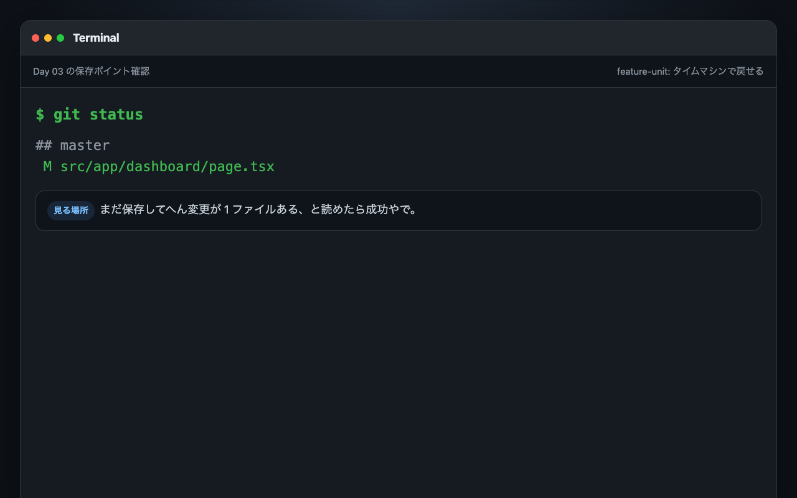
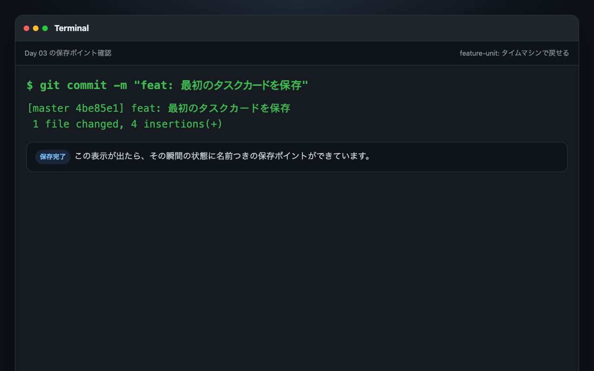
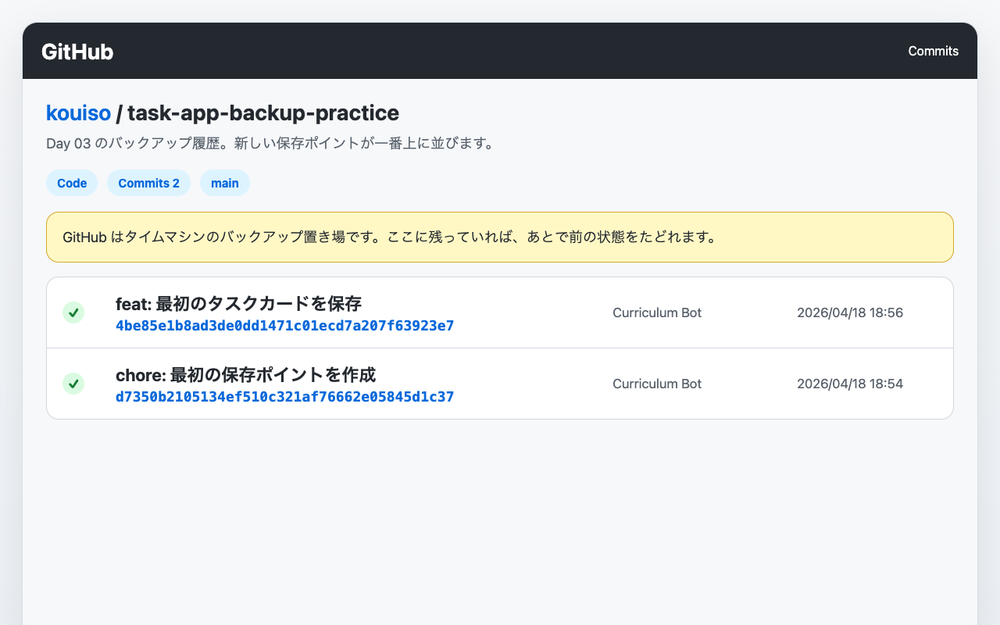

# Day 03: GitHubに保存する

Day 01 で開発環境の土台を立ち上げ、Day 02 でダッシュボードに自分の名前やメッセージを表示しました。ここまでで作ったアプリは、まだ自分のパソコンの中だけで動いています。

今日は、このアプリを GitHub に保存します。GitHub に保存すると、コードが URL を持つリポジトリとして管理され、変更の履歴が残ります。あとから変更を見返せるようになり、次の Day で Vercel（作ったアプリをインターネット上に公開できるサービス）に公開するときも、この履歴がそのまま土台になります。

## この日でできるようになること

Day 02 までで作った `task-app` を、自分の GitHub リポジトリへ保存できるようになります。ただ `git push` を通すだけでなく、次のことができるようになります。

- 今のプロジェクトがどんな Git 状態かを読めるようになる
- GitHub に空の保存先を正しく作れるようになる
- `README.md` を最低限の顔として整えられるようになる
- `.env` を巻き込まずに、変更したファイルだけを意図的に記録できるようになる
- 次の Day で公開に進める状態を、自分の手でつくれるようになる

ここまで終わると、`task-app` は教材を読んで動かしただけのコードではなく、自分で変更を積み重ねていく開発物として GitHub に残ります。

## 今日のゴール

- [ ] Day 02 の完成状態から作業を再開する
- [ ] いまの Git 状態とブランチ名、未保存の変更を確認する
- [ ] `README.md` を、自分のアプリに合う内容へ整える
- [ ] `.gitignore` と `.env.example` の役割を確認する
- [ ] GitHub に空のリポジトリを作成する
- [ ] `gh auth login` で安全に GitHub 認証を済ませる
- [ ] `origin` を登録して、ローカルの履歴を GitHub に送る
- [ ] ブラウザで GitHub のリポジトリページを開き、自分のコードが見えることを確認する

### 今日のキーワード

まずは今日出てくる言葉をざっと眺めておきます。くわしい役割は、このあと Step 0 の「新しく学ぶ概念」でもう一度整理します。

| 概念 | 読み方 | 役割 | 例え |
|------|--------|------|------|
| Git | ギット | ファイルの変更履歴を記録するツール | セーブポイント付きゲーム |
| GitHub | ギットハブ | Git リポジトリをクラウドに保存するサービス | クラウド上のセーブデータ置き場 |
| commit | コミット | 変更をセーブポイントとして記録 | セーブボタンを押す |
| push | プッシュ | ローカルのセーブを GitHub にアップロード | セーブデータをクラウドに同期 |
| .gitignore | ギットイグノア | Git に追跡させないファイルの指定 | 「この書類はコピーしないで」リスト |

## Front Matter

- Day: `03`
- Group: `Phase 1（環境構築・即公開）`
- Feature Theme: `GitHub に保存する`
- Learning Outcome: `ローカルで育てた task-app を、自分の GitHub に履歴付きで安全に保存できる`
- Prerequisites: `Day 02 完了`

## 前提（Day 02 完了していること）

今日は Day 02 の続きから進めます。新しいプロジェクトを作り直すわけではありません。次の状態になっている前提で進めます。

- `task-app` ディレクトリが手元にある
- `npm install` 済みで `npm run dev` が動く
- `src/app/dashboard/page.tsx` に Day 02 の自分用ダッシュボードがある
- `.env.example` が置かれている
- `.gitignore` が置かれている

今日の流れは、昨日までの自分の作業をそのまま GitHub に持っていくことです。別の完成品を用意するのではなく、Day 02 の続きの `task-app` をそのまま GitHub へ送ります。

### Step 0: Git の準備を確認する

`create-next-app` で作ったプロジェクトは、最初から `git init` まで済んでいます。そのため、ほとんどの場合はこのまま次へ進んで問題ありません。

もしこのあと `git status` を実行して `not a git repository` と表示されたら、プロジェクトのルートで一度だけ次を実行します。

```bash
git init
```

> Git の箱がまだ作られていない場合だけ実行すれば大丈夫です。何度もやる作業ではありません。

**確認ポイント**:
- `git init` が必要な場合だけ実行した
- すでに Git 管理されている場合は、このまま次へ進めると分かった

### 新しく学ぶ概念

| 概念 | 読み方 | 役割 | 例え |
|------|--------|------|------|
| Git | ギット | ファイルの変更履歴を記録するバージョン管理ツール | セーブポイント付きのノート。いつでも過去に戻れる |
| GitHub | ギットハブ | Git の履歴をインターネット上に保存・共有するサービス | クラウド上のセーブデータ保管庫 |
| リポジトリ | — | プロジェクトのファイル一式＋履歴をまとめた箱 | 1つのプロジェクト専用フォルダ（履歴付き） |
| コミット | — | 「この時点の状態を記録する」操作 | ゲームでセーブする行為 |
| プッシュ | — | ローカルのコミットを GitHub に送る操作 | セーブデータをクラウドにアップロードする |
| `.gitignore` | ギットイグノア | Git に無視させるファイルを指定するリスト | 「このファイルはセーブに含めなくてよい」リスト |

> **Git は最初ちょっと難しく感じますが、今日やるのは「保存して GitHub に送る」だけです。** ブランチ（履歴を枝分かれさせる仕組み）やマージ（枝分かれを合流させる操作）は今日は使いません。

## 今日の見どころ

GitHub へ保存できるようになると、自分のコードにインターネット上の置き場所ができます。今日の終わりには、ブラウザで `https://github.com/<自分のユーザー名>/task-app` のような URL を開いて、Day 01 から Day 03 までの変更履歴を確認できるようになります。

ローカルにしか無いコードは、うっかり壊してしまったり、別の端末へ移せなかったりします。GitHub へ履歴を残しておけば、過去の状態へ戻せますし、次の Day で進める土台になります。Day 04 の公開も、この保存先があることを前提としています。

## 前日からの状態確認

まずは Day 02 の終わりから、いまの状態を揃えます。Day 02 の最後では、次のように予告していました。

> 次は GitHub に保存して、
> 「自分で育てたアプリの進化」を積み上げていける状態にしていきましょう。

今日はここに取り組みます。

### まずはアプリが動くか確認する

開発サーバーを止めているなら、もう一度起動しておきます。

```bash
npm run dev
```

ブラウザでは次の状態が見えていたら OK です。

- Day 02 で作った自分用ダッシュボードが表示される
- `Hello Task-App` ではなく、自分の名前やメッセージが主役として見える
- 画面が崩れていない

ここで表示が崩れていたら、GitHub へ送る前に直しておきます。GitHub は壊れた状態でも保存できますが、今日の目的はいまの正常な状態を記録することだからです。

### ローカルの Git はもう始まっている

今日の教材は、ローカルの Git 管理がすでに始まっている前提で進めます。これは Day 01 の土台づくりに理由があります。

`scripts/scaffold-from-scratch.sh` は、空ディレクトリに公式の `create-next-app` を実行します。Day 01 の実行ログにも `Initialized a git repository.` と出ていました。

つまり今日は、ローカルの履歴づくりをゼロから始めるのではなく、その履歴を GitHub に接続する日です。この2つを分けて理解しておくと、Git の役割を整理しやすくなります。

## Step 1: いまの Git 状態を読む

GitHub 側を触る前に、まずローカルの状態を確認します。



ここを確認しておかないと、いま何が未保存なのか、どのブランチにいるのか、すでに接続先があるのかが分からないまま進めることになります。送る前に現在地を読むのが、確実な進め方です。

### 実行コマンド

```bash
pwd
git status -sb
git branch --show-current
git log --oneline --decorate -3
git remote -v
```

この5つはどれも読み取るだけのコマンドです。ファイルやコミットを書き換えないので、何度実行しても手元の状態は変わりません。もし `fatal: not a git repository (or any of the parent directories): .git` と出たら、Git 管理の外でコマンドを打っています。1行目の `pwd` の表示を見て、`task-app` のルートにいるか確かめてください。

### この5つで見ていること

- `pwd`
  今本当に `task-app` のルートにいるか確認する
- `git status -sb`
  変更中のファイルと、ブランチの概要を短く見る
- `git branch --show-current`
  いまどのブランチ名で作業しているか確認する
- `git log --oneline --decorate -3`
  直近の履歴があるか確認する
- `git remote -v`
  すでに GitHub などの保存先がつながっていないか確認する

### 期待するイメージ

環境によって多少違いますが、次のような表示になっていれば進めやすい状態です。

```text
/Users/your-name/workspace/task-app
## main
main
ea211a9 (HEAD -> main) Initial commit from Create Next App
```

`git remote -v` は、まだ何も表示されないかもしれません。この時点ではそれで問題ありません。GitHub 側の保存先をまだ作っていないので、つなぎ先は空のままで正しい状態です。1行目のパスの末尾が `task-app` になっているか確かめてください。

コミットが1本しか無いことにも注目してください。これは土台を作った時点のもので、Day 01 のセットアップで置いたファイルも、Day 02 で書いたダッシュボードも、まだ保存されていません。だから `git status -sb` には未保存の行が10行以上並びます。今日はそれを GitHub へ送るところまでを行います。

### ここで見ておきたい判断ポイント

- `git status -sb` に `??` や `M` が10行以上並ぶのが、この時点では正しい状態
- `git remote -v` が空なら、まだ GitHub 側の保存先は未接続
- ブランチ名が `main` 以外でも慌てなくていい

今日はブランチ名を固定で決め打ちせず、いま実際にいるブランチをそのまま GitHub に送る流れで進めます。このやり方なら、環境差でつまずきにくくなります。

## Step 2: GitHub に置く前に、README を自分の顔に整える

GitHub に保存すると、最初に見られるのはコードだけではありません。リポジトリのトップに表示される `README.md` も、そのアプリの入り口になります。

Day 03 の段階では、機能一覧を全部書き切る必要はありません。何のアプリで、いま何ができて、どう起動するかが分かるだけでも、リポジトリの見え方は変わります。

### いまの README を開いて確認する

```bash
sed -n '1,200p' README.md
```

`sed -n '1,200p'` は、ファイルの先頭から200行目までを表示するコマンドです。中身をざっと確認するためだけなので、VS Code で `README.md` を開いて読んでも構いません。

もし教材用の説明が中心で、まだ自分の `task-app` の現在地が見えにくいなら、ここで整えておきます。

### 編集アンカー

`~/workspace/task-app/README.md` を開いて、ファイル全体を次の内容に置き換えます。

~~~md title="README.md"
# task-app

30日カリキュラムで育てていく、
自分専用のタスク管理アプリです。

Day 03 時点では、
Next.js 15 / TypeScript を土台にして、
自分用のダッシュボード画面まで進んでいます。
どちらも Day 01 の土台づくりで使った技術です。

## 現在できること

- ダッシュボード画面を表示できる
- 自分の名前や集中テーマを画面に出せる
- Git でローカル履歴を持てる
- GitHub に保存して、次の公開準備に進める

## 使用技術

- Next.js 15
- TypeScript
- Tailwind CSS
- Prisma（データベースを扱うためのライブラリ）
- tRPC（画面とサーバーの通信をつなぐライブラリ）

## ローカル起動

```bash
npm install
cp .env.example .env
npm run dev
```

ブラウザで `http://localhost:3000` を開いて確認します。
`.env` はコピーした見本のままでも画面は表示されます。
データベースを使う機能を触るときに、
値を自分の環境に合わせて書き換えます。

## 今日の進捗

Day 01:
土台を立ち上げて、最初の画面を表示しました。

Day 02:
ダッシュボードに自分だけのメッセージを追加しました。

Day 03:
このプロジェクトを GitHub に保存して、
履歴を積み上げられる状態にします。
~~~

### この README で押さえていること

- リポジトリ名と内容が最初の数行で分かる
- Day 03 時点の現在地だけを正直に書いている
- 起動手順が短くまとまっている
- まだできていない機能を盛っていない

README は、機能を多く見せることよりも、いまの状態を正確に伝えることが大切です。Day 30 まで進んだら、内容を書き足していけば十分です。

## Step 3: `.gitignore` と `.env.example` の役割を確認する

GitHub へ保存するとき、いちばん気をつけたいのは、送っていいものと送ってはいけないものの線引きです。今日の `task-app` では、この線引きを主に `.gitignore` と `.env.example` の2つが担っています。

### まずは `.gitignore` を確認する

```bash
sed -n '1,220p' .gitignore
```

`sed` は中身を表示するだけで、`.gitignore` を書き換えません。`No such file or directory` と出たら、`.gitignore` の無い場所でコマンドを打っています。`pwd` で `task-app` のルートに戻ってから、もう一度実行してください。このプロジェクトには、ローカル環境変数を無視する設定がすでに入っています。特に見てほしいのは次の部分です。

```text
# env files (can opt-in for committing if needed)
.env*
```

この行が、GitHub へ送るものと送らないものを分ける境目です。自分で書いた覚えがなくても心配いりません。プロジェクトを作った時点ですでに入っている行だからです。

### この1行の意味

- `.env*`
  `.env` や `.env.local` や `.env.example` のように、`.env` で始まるファイルをまとめて Git 管理から外す

打ち消しの行が無いので、見本用の `.env.example` もこの1行に含まれます。GitHub へ載せたいときは、あとの手順で `git add -f` を使って明示的に加えます。

この設定があることで、チーム開発と個人開発のどちらでも、起動に必要な項目は共有しつつ、本物の値は共有しない運用がやりやすくなります。

### `.env.example` も確認する

```bash
sed -n '1,120p' .env.example
```

Day 01 の scaffold で、すでに見本ファイルが作られています。この見本があると、あとから GitHub を見た自分や、次に参加する人が、どの環境変数が必要なのかを把握しやすくなります。

### ここでの判断

- `.env` や `.env.local` は GitHub に送らない
- `.env.example` も既定では除外されるので、GitHub に載せたいときは `git add -f` で明示的に加える
- `.gitignore` があるから安心ではなく、送る前に `git status` でも確認する

ignore 設定があることと、送信前に自分でも `git status` で確認することの両方が大切です。

## Step 4: GitHub アカウントと空のリポジトリを用意する

次は GitHub 側に、このプロジェクトの保存先を用意します。ここでのポイントは、空のリポジトリを作ることです。ローカルにはすでに履歴があるので、GitHub 側で別の初期ファイルを作る必要はありません。

### ブラウザでやること

GitHub のアカウントをまだ持っていない場合は、先に `https://github.com/signup` を開いて、
メールアドレス・パスワード・ユーザー名を登録します。確認メールに届いたコードを入力すると
アカウントができます。

1. `https://github.com/new` を開く
2. Owner を自分のアカウントにする
3. Repository name に `task-app` と入れる
4. Public / Private は好きなほうで選ぶ
5. `Add a README file` はオフのままにする
6. `Add .gitignore` もオフのままにする
7. `Choose a license` も未選択のままにする
8. `Create repository` を押す

### ここで README を足さない理由

GitHub 側で先に README を作ると、GitHub 側だけが持つ最初の履歴ができてしまいます。今回はローカルで Day 01 から積み上げた履歴を使いたいので、保存先は空にしておきます。

### 作成後に確認すること

- URL が `https://github.com/<自分のユーザー名>/task-app` になっている
- まだファイル一覧はほとんど空の表示になっている
- “push an existing repository” に近い案内が出ている

この画面は、次のステップで使う URL を確認する場所でもあります。ブラウザは開いたままにしておきます。

## Step 5: GitHub CLI（ターミナルから GitHub を操作する道具）で認証する

リポジトリの箱を作っただけでは、まだローカルから送れません。次に必要なのは、このターミナルが自分の GitHub アカウントとして送信してよい、と認証してもらうことです。

今日は `gh auth login` を使います。初回セットアップとして分かりやすく、秘密の値を手で URL に埋め込む運用を避けられるためです。

### まずは `gh` コマンドがあるか確認する

```bash
gh --version
```

うまく入っていれば、`gh version 2.89.0 (2026-03-26)` のような形式でバージョンが表示されます。数字は手元のバージョンによって変わります。

### もし `gh` が見つからないとき

macOS なら、次のコマンドで入れられます。

```bash
brew install gh
```

`zsh: command not found: brew` と出た場合は、Homebrew がまだ入っていません。
Homebrew は macOS へソフトを入れるための道具です。`https://brew.sh` の先頭にある
インストール用のコマンドをコピーして実行し、終わってから `brew install gh` をもう一度実行します。

Windows で WSL2（Ubuntu）を使っている場合は、[GitHub CLI 公式の Linux インストール手順](https://github.com/cli/cli/blob/trunk/docs/install_linux.md) に沿って Ubuntu のターミナルで入れます。

インストールが終わったら、もう一度バージョンを確認してから進めます。

### 認証を実行する

```bash
gh auth login
```

このコマンドは、ターミナルに GitHub アカウントの認証情報を持たせます。ここを通すと、このあとの `git push` でパスワードを聞かれずに済みます。画面ではいくつか続けて質問されるので、次の順で選んでください。表示される文言は gh 2.89 時点のもので、バージョンによって少し変わります。似た意味の質問に同じ趣旨で答えれば大丈夫です。

- `Where do you use GitHub?` → `GitHub.com`
- `What is your preferred protocol for Git operations on this host?` → `HTTPS`
- `Authenticate Git with your GitHub credentials?` → `Yes`
- `How would you like to authenticate GitHub CLI?` → `Login with a web browser`

最後の項目を選ぶと、ターミナルにワンタイムコード（例: `ABCD-1234`）が表示されます。Enter を押すとブラウザが開くので、そのコードを貼り付けて認証を許可します。ターミナルに戻って認証完了の表示が出れば成功です。

3番目の `Authenticate Git with your GitHub credentials?` は `Yes` にしておきましょう。このあとの `git push` でも同じ認証をそのまま使えるので、パスワードを聞かれずに済みます。

### 認証できたか確認する

```bash
gh auth status
```

`gh auth status` は今の認証状態を読み出すだけで、ログインし直したり設定を書き換えたりはしません。`You are not logged into any GitHub hosts` と出たら、まだ認証が終わっていない状態です。その場合はブラウザ側の許可が最後まで進んでいないことが多いので、`gh auth login` からやり直します。

### 期待する状態

- 自分の GitHub ユーザー名が表示される
- 認証先が `github.com` になっている
- エラーが出ていない

ここが通れば、今日進めるうえでは十分です。

## Step 6: `origin` を登録して、ローカルと GitHub をつなぐ

次はローカルの `task-app` に、GitHub の保存先 URL を教えます。

Git では、こういう保存先に別名を付けて呼びます。その別名として `origin` を使うのが慣習で、ほぼ標準だと思ってかまいません。名前自体に特別な意味はないので、あとから変えることもできます。

### URL を確認する

GitHub のリポジトリページで、HTTPS の URL を確認します。形はこうです。

```text
https://github.com/<your-user-name>/task-app.git
```

末尾が `.git` で終わっているのが、Git がやり取りに使う形の URL です。ブラウザのアドレス欄に出ている `https://github.com/<your-user-name>/task-app` には `.git` が付きません。どちらを登録しても push は通りますが、`.git` を付けておくと、あとで `git remote -v` を見たときに保存先だと一目で分かります。

### `origin` を追加する

`<your-user-name>` は、自分の GitHub ユーザー名に置き換えてください。このとき、**山カッコ `< >` ごと消して**自分の ID だけを書きます。たとえばユーザー名が `taro` なら `https://github.com/taro/task-app.git` になります。

```bash
git remote add origin https://github.com/<your-user-name>/task-app.git
git remote -v
```

1行目が書き換えるのは `.git/config` というファイルだけで、保存先の名前と URL が1行増えます。コードやコミットは触らないので、間違えても `git remote remove origin` で消してやり直せます。`error: remote origin already exists.` と出たら、すでに `origin` が登録されている状態です。その場合はこのあとの「もし `origin` がすでにあるとき」に進んでください。

### 期待する表示

```text
origin  https://github.com/<your-user-name>/task-app.git (fetch)
origin  https://github.com/<your-user-name>/task-app.git (push)
```

同じ URL が2行出ます。Git は取得と送信で別々の保存先を持てる仕組みなので、`(fetch)` と `(push)` に分かれて表示されます。今日はどちらも同じ場所でよいので、2行の URL がそろっていれば登録は成功です。あわせて、`<your-user-name>` の部分が自分の GitHub ユーザー名になっているかも見ておいてください。

### もし `origin` がすでにあるとき

この教材の Day 03 では、基本的には未接続を想定しています。ただ、`git remote -v` の時点ですでに何か表示されていたなら、その URL が本当に自分の GitHub リポジトリか確認しましょう。

自分のものと違うなら、いったん立ち止まります。どこにつながっているかを整理してから進めるほうが安全です。焦って送るのがいちばん危ないです。

## Step 7: 送る前に、どのファイルを履歴に残すか決める

ここが今日の本質です。GitHub に保存する日は、とりあえず全部送る日ではありません。**今日の状態として残したいものだけを、自分で選ぶ**日です。

Day 02 からの文脈で言うと、主役はこのあたりです。

- `src/app/dashboard/page.tsx`
  Day 02 で育てた自分用ダッシュボード
- `README.md`
  GitHub に置いたときの顔
- `.gitignore`
  もし自分の環境で追記が必要なら、その調整
- `.env.example`
  起動に必要な見本が変わったなら、その更新

### まずは `git status` で差分を読む

```bash
git status --short
```

`git status --short` は今の差分を読み出すだけで、ファイルもステージング（コミットに含める候補として選んでおく状態）も変えません。何度打っても安全なので、迷ったらまずこれを実行します。この時点では、たとえば次のような表示になります。

```text
 M README.md
 M package.json
 M package-lock.json
 M src/app/layout.tsx
 M src/app/page.tsx
 M tsconfig.json
?? biome.json
?? docker-compose.yml
?? prisma/
?? src/app/dashboard/
?? src/component/
?? src/lib/
?? material/
?? scripts/
```

行数や並びが違っても心配いりません。`M` は履歴に入っているファイルを書き換えたという印、`??` はまだ一度も保存していないファイルという印です。数が多いのは、Day 01 のセットアップで置いたファイルが、まるごと未保存のまま残っているためです。土台を作った時点のコミットは1本だけで、そのあとの変更はすべてこれから保存します。

もし `.env` や `.env.local` がここに出ていたら、そのまま進めずに、`.gitignore` の設定かファイル名の置き方を先に見直します。今日の目的は、動くものを保存するだけでなく、送っていいものだけを送る習慣を作ることだからです。

### アプリ実行に必要なファイルを add する

この Day では、Vercel が GitHub 上で build できるように、アプリ実行に必要なファイルを名前で指定して add します。

`material/` は教材本文、`scripts/` は初期セットアップ用なので、GitHub に上げなくてもアプリのデプロイ（作ったアプリをサーバーに置いて公開する作業）には要りません。一方で `package.json` や `src/` や `prisma/` は、Day 04 の Vercel build に欠かせないファイルです。すでに履歴に入っていて変更のないファイルは、add しても何も起きないだけで害はありません。それでも名前を挙げておくと、デプロイに必要なものがそろっていることを自分の目で確認できます。

```bash
git add README.md
git add package.json package-lock.json
git add tsconfig.json next.config.* postcss.config.* biome.json
git add prisma prisma.config.ts
git add public src
git add docker-compose.yml
git add -f .env.example
git status --short
```

`.env.example` にだけ `-f` を付けているのは、`.gitignore` の `.env*` がこのファイルも除外しているためです。見本ファイルだけは意図的に例外として加えます。`-f` を付けずに実行すると `The following paths are ignored by one of your .gitignore files` と表示され、追加されません。

環境によっては、上のうち一部のファイルがまだ無いこともあります。存在しないファイルを指定すると `git add` は `fatal: pathspec '...' did not match any files` と表示して、そのコマンド全体が失敗します。注意したいのは、同じ行に書いた実在するファイルも一緒に add されない点です。たとえば `git add README.md missing-file` のように実在しないファイルを混ぜると、`README.md` 側もステージングされません。

`fatal` が出たら、その行から無いファイル名だけを外して同じコマンドをもう一度実行してください。そのあと `git status --short` で、変更したファイルの行頭に `M` や `A` が付いた（ステージングされた）ことを確認します。今日の目的である `README.md` がステージングできていれば大丈夫です。

### ここで見たい表示

行数が一気に増えて、数十行になります。`git add public src` が `src/` の下の
ファイルを1つずつ数えるためです。先頭のあたりは次のように見えます。

```text
M  README.md
A  biome.json
A  docker-compose.yml
A  prisma/schema.prisma
A  src/app/dashboard/page.tsx
```

行が多くても、やりすぎではありません。数える必要もありません。
ここで確認したいのは次の2点だけです。

- `README.md` の `M` が左側（1文字目）に付いている
- どの行にも `.env` が出ていない

いちばん下に `?? material/` と `?? scripts/` が残りますが、
これは add していないので正しい状態です。

### 初回だけ、自分の名前とメールアドレスを Git へ登録する

Git は、誰が保存したかを記録に残します。名乗りを登録していないと、次のコミットで
`*** Please tell me who you are.` と英語で止まります。パソコンごとに1回だけ実行してください。

```bash
git config --global user.name "あなたの名前"
git config --global user.email "GitHubに登録したメールアドレス"
```

メールアドレスは GitHub に登録したものと同じにします。違うものを入れると、GitHub 上で
「誰のコミットか分からない」扱いになり、自分のアイコンが出ません。

登録できたか確かめます。入力した2つがそのまま出れば成功です。

```bash
git config --global user.name
git config --global user.email
```

### コミットメッセージを付けて保存する

今日は最初の GitHub 保存なので、何を残したかが一目で分かるメッセージにします。

```bash
git commit -m "feat: save initial dashboard project to GitHub"
```

このコマンドで、ステージングした内容が1つのセーブポイントとしてローカルの履歴に刻まれます。まだ GitHub には何も送られていません。増えたのは手元の履歴だけです。`nothing to commit, working tree clean` と出たら、add が終わっていないか、そもそも変更が無い状態です。1つ前の `git add` からやり直してください。

### コミット後の確認

```bash
git status -sb
git log --oneline --decorate -3
```

`git status -sb` に残るのは `?? material/` と `?? scripts/` の2行だけになります。
この2つは GitHub へ送らないので、残っていて正常です。
`git log` の1行目に、いま付けたメッセージが出ていれば成功です。



## Pro パターンで書こう（GitHub に送る日は `git add .` ではなく、残したいファイルを選ぶ）

ここまでで GitHub に送る流れは作れました。ただし現場では、もう一段ていねいなやり方をします。

GitHub に保存するときは、全部まとめて送るよりも、今日の変更として残したいファイルを自分で選ぶほうが確実です。理由を Before/After で見比べてみます。

### Before（改善前のコード）

```bash
git status --short
git add .
git commit -m "update"
git push -u origin "$(git branch --show-current)"
```

**この流れの問題点**:

- 何を GitHub に送ったのかが自分でも曖昧になりやすい
- `.gitignore` の設定漏れや想定外ファイル混入に気づきにくい
- `update` みたいなメッセージでは、あとから履歴を読んだときに意味が薄い

### After（プロがやる流れ）

```bash
git status --short
git add README.md
git add src/app/dashboard/page.tsx
git status --short
git commit -m "feat: save initial dashboard project to GitHub"
git push -u origin "$(git branch --show-current)"
```

**この流れの強み**:

- どのファイルを今日の進化として残したいかが明確になる
- 送信前に差分をもう一度目で確認できる
- コミット履歴を読んだ未来の自分が、何をやった日かすぐ分かる

#### 覚えておきたいエッセンス

GitHub に保存するときは、手早く済ませることよりも、何を残すかを自分で選ぶことが大切です。履歴は量よりも、意味の分かりやすさが効いてきます。

## Step 8: いまいるブランチを GitHub に送る

ここまでで、ローカルの履歴は整いました。次はそれを GitHub に送ります。

今日はブランチ名を固定で決め打ちせず、いま実際にいるブランチをそのまま push する形で進めます。これなら、`main` でも別名でも動かせます。

### 実行コマンド

```bash
git push -u origin "$(git branch --show-current)"
```

ここで初めて、手元のコミットが GitHub 側にコピーされます。ここまでの `commit` はすべて自分のパソコンの中だけの操作だったので、外へ出るのは今回が最初です。`Authentication failed` や `could not read Username` と出たら、Step 5 の認証が効いていません。`gh auth status` で状態を見てから、`gh auth login` をやり直します。

### `-u` の意味

初回だけ、「このローカルブランチは、今後この `origin` 側の同名ブランチに送る」という紐づけを作ります。一度これが通れば、次からは `git push` だけで同じ場所へ送れます。

### 期待する表示イメージ

```text
Enumerating objects: 18, done.
Counting objects: 100% (18/18), done.
Delta compression using up to 8 threads
Compressing objects: 100% (12/12), done.
Writing objects: 100% (18/18), 3.10 KiB | 3.10 MiB/s, done.
Total 18 (delta 2), reused 0 (delta 0), pack-reused 0
To https://github.com/<your-user-name>/task-app.git
 * [new branch]      main -> main
branch 'main' set up to track 'origin/main'.
```

オブジェクトの数と容量は、送るファイル数によって変わります。
100件を超えて数百 KB になることもあり、上の数字と違っても問題ありません。
次の3点が見えたら大丈夫です。

- `To https://github.com/...` が出ている
- 新しいブランチが GitHub 側に作られている
- tracking が設定されたと分かる文言が出ている

## Step 9: ブラウザで GitHub のページを確認する

ターミナルで push が通っても、最後はブラウザで確認します。送れたつもりで終わらせず、GitHub 上で実際に見えている状態を確かめておきます。

### 確認手順

1. さっき作った GitHub リポジトリページを開く
2. ブラウザを再読み込みする
3. ファイル一覧が表示されるか確認する
4. `README.md` の内容がページ下部に表示されるか確認する
5. `src/app/dashboard/page.tsx` がリポジトリ内に存在するか確認する

### ここで見えていたら成功

- リポジトリ URL が自分のアカウント配下になっている
- `README.md` がトップページに表示される
- `src` ディレクトリがある
- Day 02 までのコードが GitHub 上で見える



ここまで見えていれば、自分のコードに GitHub 上の置き場所ができた状態です。

## Step 10: よくあるつまずきを、送る前後で切り分ける

GitHub まわりは、1か所詰まると全部止まったように見えがちです。ただ実際には、原因はだいたい次のどれかに分かれます。

- 認証の問題
- 保存先 URL の問題
- ローカル差分の問題
- まだコミットしていない問題

ここでは、今日の流れに沿って見直しの順番を示します。

### `gh auth login` がうまく進まない

まずは認証状態を確認します。

```bash
gh auth status
```

ここで未認証の表示になっていれば、ブラウザ認証が最後まで終わっていない可能性が高いです。次のコマンドでもう一度やり直します。

```bash
gh auth login
```

`gh auth login` は何度でも実行できます。成功したときだけ設定が書き換わるので、途中でやめても手元の状態は壊れません。認証が通ると `Logged in as <自分のユーザー名>` の行が出ます。そこまで見えたら、もう一度 `gh auth status` で確かめてから先へ進んでください。

### `git remote -v` に何も出ない

保存先がまだ登録されておらず、push 先が分からない状態です。あらためて `origin` を追加します。

```bash
git remote add origin https://github.com/<your-user-name>/task-app.git
git remote -v
```

登録できていれば、2行目の `git remote -v` に `(fetch)` と `(push)` の2行が出ます。ここでも `error: remote origin already exists.` と出るなら、`origin` という名前がすでに使われています。URL が同じでもこのエラーは出るので、まず `git remote -v` の表示を見てください。表示された URL が自分の GitHub リポジトリと同じなら、そのままで問題ありません。違っていたときだけ、追加ではなく `git remote set-url origin https://github.com/<your-user-name>/task-app.git` で URL を差し替えます。

### push 前に「変更が残っている」と感じる

まずはこれで状態を読みます。

```bash
git status --short
```

ここで何が出ているかを見てから、add するか、今日は送らないかを決めます。見えていない差分は、そのまま送りません。これを覚えておくと安全です。

### `.env` が出てきてしまった

この場合は、そのまま add しません。まず `.gitignore` に環境変数ファイルを避ける行があるかを見直します。この教材では Day 01 の土台にすでに入っている想定なので、ファイル名や配置のズレが原因になりがちです。

```bash
sed -n '1,220p' .gitignore
git status --short
git ls-files .env
```

3つとも読み取るだけのコマンドなので、`.env` を消したり書き換えたりはしません。`git status --short` の一覧から `.env` の行が消えても、それだけでは安心できません。`.gitignore` は、Git がすでに記録している（追跡している）ファイルには効かないからです。判断は `git ls-files .env` の結果で行います。何も表示されなければ、`.env` は追跡されていません。ファイル名が表示されたら追跡されているので、`git rm --cached .env` で追跡だけを外します。このコマンドは手元の `.env` を消さず、Git の管理から外すだけです。ただし、外れるのはこれから先の記録だけです。一度 push した値は過去のコミットに残り、GitHub からも読めます。すでに push していたら、まずパスワードやキーを新しい値に作り直してください。これが最優先です。過去のコミットから値そのものを消すには、`git filter-repo` などで履歴を書き換える作業が要ります。書き換えたあとの反映には `git push --force-with-lease` を使います。これはリモートの最新を確かめてから上書きするコマンドです。条件なしの `git push --force` は、その間に入った他の人の変更ごと消してしまいます。共同作業者にも取り直してもらう連絡が要ります。`.env.example` は見本として残して問題ありません。

### push 後に GitHub ページへ反映されない

まずは push が通っているか、直近のログを確認します。

```bash
git log --oneline --decorate -3
git remote -v
git branch --show-current
```

次に GitHub ページを再読み込みします。ブランチ切り替え UI がある場合は、いま送ったブランチが表示対象になっているかも確認します。

### ここで確認したいこと

この Step を暗記する必要はありません。詰まったときに、認証・保存先 URL・ローカル差分・コミット忘れの4つのうちどれが原因かを、上の順番で切り分けられれば十分です。

## Step 11: いまの Day 03 を、自分の言葉で説明できる状態にする

ここまでできれば、操作としては十分です。もう一歩進めるなら、今日やったことを自分の言葉で説明できる状態にしておきます。次の4つを説明できれば、理解が定着しています。

### 1. ローカルの Git と GitHub は別物

ローカルの Git は、自分のパソコンの中で履歴を持つ仕組みです。GitHub は、その履歴を置く外側の保存先です。今日は、ローカルで持っていた履歴を GitHub に接続して送った、と説明できれば十分です。

### 2. `origin` は保存先の別名

名前だけ見ると難しそうですが、意味は単純です。ローカルから見た送信先につける別名だと考えれば十分です。

### 3. `commit` と `push` は役割が違う

`commit` はローカルに履歴を残す操作です。`push` は、その履歴を GitHub に送る操作です。この2段階があるので、送る前に内容を自分で見直せます。

### 4. `.gitignore` は守り、`git status` は最終確認

設定があるだけで済ませず、最後は自分の目でも確認します。これが GitHub に安全に保存するときの基本の進め方です。

## 覚えておきたいエッセンス

- Day 03 は、新しい完成品を作る日ではなく、Day 02 までの自分の作業を GitHub に乗せる日
- この教材の流れでは、ローカルの Git 管理はすでに始まっている。今日は GitHub と接続して外へ出す
- GitHub へ送る前に、`git status` で現在地を読むクセをつける
- `README.md` はリポジトリの顔になる。Day 03 では正直で短い説明で十分
- `.env` は送らず、`.env.example` は送る。この線引きを `.gitignore` と目視確認で守る
- `git add .` で雑にまとめるより、今日残したいファイルを自分で選ぶほうが履歴の質が上がる
- `commit` はローカル保存、`push` は GitHub への送信。この役割分担を分けて理解する
- 最後はブラウザで GitHub ページを開いて、本当に見えているところまで確認する

## 今日のチェックリスト

最後に、この Day の完了条件を自分で確認しておきます。

- [ ] `git status -sb` で現在地を読めた
- [ ] `README.md` を自分の `task-app` に合う内容へ整えた
- [ ] `.gitignore` と `.env.example` の役割を確認した
- [ ] GitHub に空のリポジトリを作れた
- [ ] `gh auth login` が通った
- [ ] `git remote add origin ...` で保存先を登録できた
- [ ] 変更したファイルだけを add してコミットできた
- [ ] `git push -u origin "$(git branch --show-current)"` が通った
- [ ] GitHub のブラウザ画面でコードが見えた

全部埋まったら、Day 03 は完了です。

## 次回予告

GitHub に保存できたら、次はこの履歴を使ってアプリをインターネットに公開します。Day 04 では Vercel につないで、自分の `task-app` を実際の URL で開ける状態にします。今日 GitHub に保存した内容が、そのまま公開の土台になります。

---

## 次に読むもの

- 前の日: [Day 02](./day02_ダッシュボードに自分だけのメッセージを追加しよう.md)
- 次の日: [Day 04](./day04_ネットに公開.md)
- 全体の地図: [学びのロードマップ](./00-1_学びのロードマップ.md)
- 目次: [カリキュラム目次](./00_カリキュラム目次.md)
