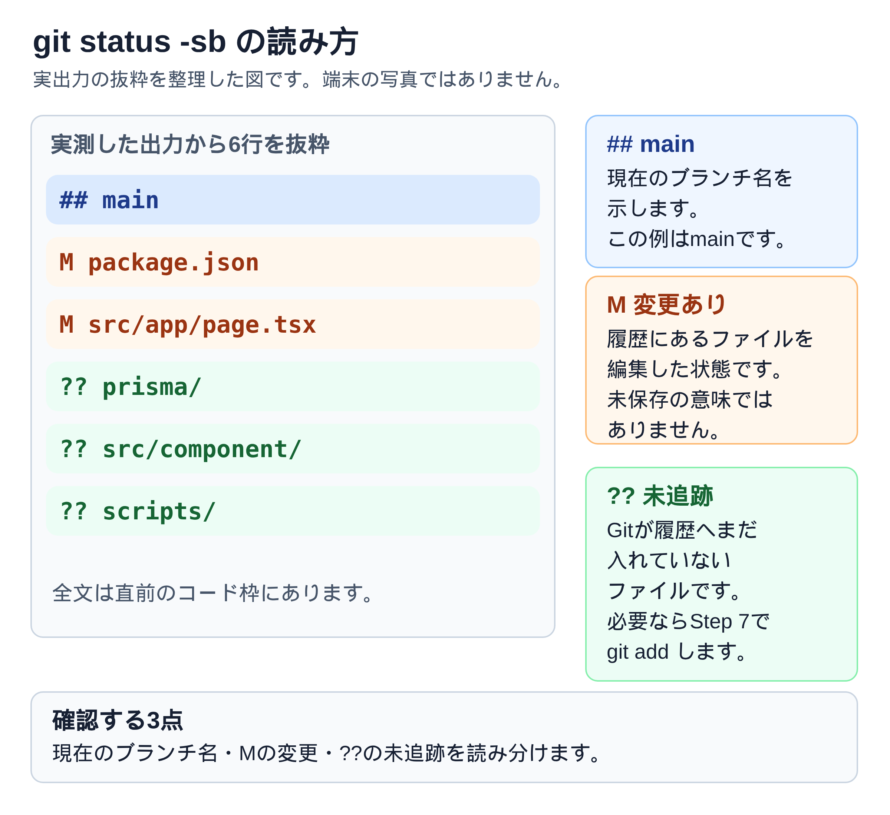
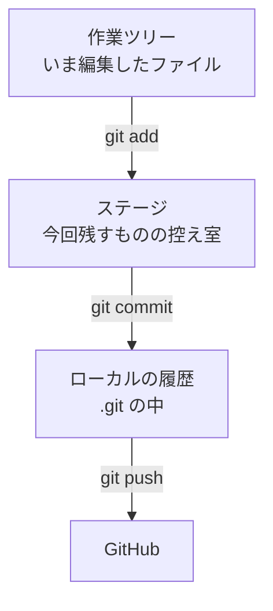
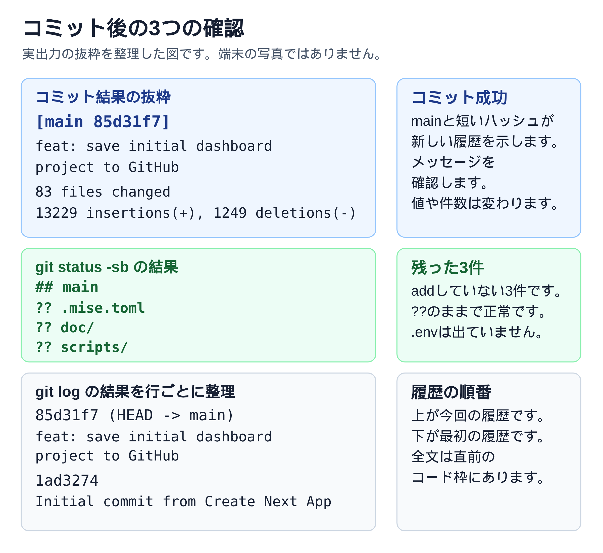
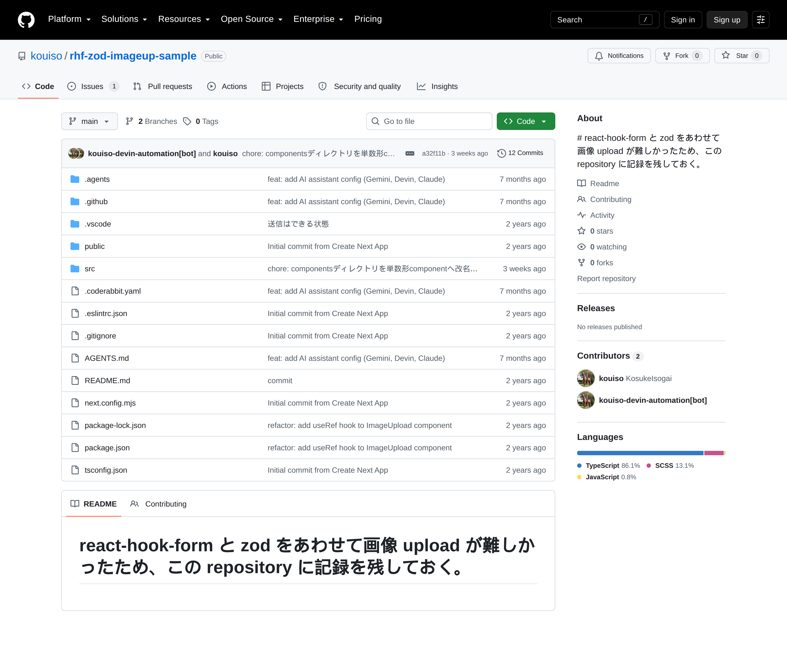

# Day 03: GitHubに保存する

Day 01 で開発環境の土台を立ち上げ、Day 02 でダッシュボードに自分の名前やメッセージを表示しました。ここまでで作ったアプリはまだ自分のパソコンの中だけで動いています。

今日はこのアプリを GitHub に保存します。GitHub に保存するとコードが URL を持つリポジトリとして管理され、変更の履歴が残ります。あとから変更を見返せるようになり、次の Day で Vercel（作ったアプリをインターネット上に公開できるサービス）に公開するときも、この履歴がそのまま土台になります。

## 前回の振り返り

Day 02 では`/dashboard` に自分の名前と時間帯のあいさつを表示し、下段に情報カードを3枚並べました。ここまでで作ったアプリはまだ自分のパソコンの中だけにあります。今日はこれを GitHub へ保存して履歴が残る形にします。

---

## 今日のゴール

Day 02 までで作った `task-app` を、自分の GitHub リポジトリへ保存します。`git push` を通すだけで終わらせず、いまのプロジェクトがどんな Git 状態かを読み、空の保存先を正しく作り、`.env` を巻き込まずに変更したファイルだけを意図的に記録するところまでやります。

ここまで終わると`task-app` は教材を読んで動かしただけのコードではなく、自分で変更を積み重ねていく開発物として GitHub に残ります。

- [ ] Day 02 の完成状態から作業を再開します。
- [ ] いまの Git 状態とブランチ名、未保存の変更を確認します。
- [ ] `README.md` を、自分のアプリに合う内容へ整えます。
- [ ] `.gitignore` と `.env.example` の役割を確認します。
- [ ] GitHub に空のリポジトリを作成します。
- [ ] `gh auth login` で安全に GitHub 認証を済ませます。
- [ ] `origin` を登録してローカルの履歴を GitHub に送ります。
- [ ] ブラウザで GitHub のリポジトリページを開き、自分のコードが見えることを確認します。

## なぜこれを作るのか

ここまでのコードは自分のパソコンの中にしかありません。パソコンが壊れたら消えますし、別の端末で続きを書くこともできません。それだけなら USB メモリにコピーしておけば足りますがGit と GitHub が解くのはもう1つ別の問題です。

それは**どの時点の状態にでも戻れるようにしておく**ことです。動いていた画面を書き換えて壊したときコピーが1つしかなければ壊れたほうしか残りません。コミットを積んでおけば壊れる前の時点を選んで戻せます。

そしてもう1つ、明日につながる理由があります。Day 04 で使う Vercel は公開するコードを自分のパソコンではなく **GitHub から取りに行きます**。GitHub にコミットしたファイルはリポジトリと公開処理へ渡るため、Public / Private の選択に関係なく秘密の値を入れてはいけません。今日のうちに `.env` を送らない習慣を作ります。

> **例え話**: Git はゲームのセーブポイントです。GitHub はそのセーブデータをクラウドへ同期しておく場所にあたります。手元が壊れても同期しておいた続きから再開できます。

### 新しく学ぶ概念

| 概念 | 読み方 | 役割 | 例え |
|------|--------|------|------|
| Git | ギット | ファイルの変更履歴を記録するバージョン管理ツール | セーブポイント付きのノート。いつでも過去に戻れる |
| GitHub | ギットハブ | Git の履歴をインターネット上に保存・共有するサービス | クラウド上のセーブデータ保管庫 |
| リポジトリ | — | プロジェクトのファイル一式と履歴をまとめた箱 | 1つのプロジェクト専用フォルダ（履歴付き） |
| ステージング | — | 次のコミットに含めるファイルを選んで並べておく場所 | レジ台。買うものだけを一度ここへ載せる |
| コミット | — | 「この時点の状態を記録する」操作 | ゲームでセーブする行為 |
| プッシュ | — | ローカルのコミットを GitHub に送る操作 | セーブデータをクラウドにアップロードする |
| `.gitignore` | ギットイグノア | Git に追跡させないファイルを指定するリスト | 「この書類はコピーしないで」リスト |

> **Git は最初ちょっと難しく感じますが今日やるのは「保存して GitHub に送る」だけです。** ブランチ（履歴を枝分かれさせる仕組み）やマージ（枝分かれを合流させる操作）は今日は使いません。

## 前提（Day 02 完了していること）

今日は Day 02 の続きから進めます。新しいプロジェクトを作り直すわけではありません。次の状態になっている前提で進めます。

- `task-app` ディレクトリが手元にあります。
- `npm install` 済みで `npm run dev` が動きます。
- `src/app/dashboard/page.tsx` に Day 02 の自分用ダッシュボードがあります。
- `.env.example` が置かれています。
- `.gitignore` が置かれています。

今日の流れは昨日までの自分の作業をそのまま GitHub に持っていくことです。別の完成品を用意するのではなく、Day 02 の続きの `task-app` をそのまま GitHub へ送ります。

## 今日の見どころ

GitHub へ保存できるようになると自分のコードにインターネット上の置き場所ができます。今日の終わりにはブラウザで `https://github.com/<自分のユーザー名>/task-app` のような URL を開いてGitHub に送ったアプリのファイルを確認できるようになります。

ローカルにしか無いコードはうっかり壊してしまったり、別の端末へ移せなかったりします。GitHub へ履歴を残しておけば過去の状態へ戻せますし、次の Day で進める土台になります。Day 04 の公開も、この保存先があることを前提としています。

## 前日からの状態確認

まずは Day 02 の終わりからいまの状態を揃えます。Day 02 の最後では次のように予告していました。

> Day 03 は
> 今日編集したファイルを変更履歴として記録します。
>
> 手元のファイルを
> GitHub にも保存します。
>
> 編集内容と保存した内容を
> 照合しながら進めましょう。

今日はここに取り組みます。

### まずはアプリが動くか確認する

開発サーバーを止めているならもう一度起動しておきます。

```bash
npm run dev
```

ブラウザでは次の状態が見えていたら OK です。

- Day 02 で作った自分用ダッシュボードが表示されます。
- 見出しだけではなく、自分の名前やメッセージが主役として見えます。
- 画面が崩れていません。

ここで表示が崩れていたらGitHub へ送る前に直しておきます。GitHub は壊れた状態でも保存できますが今日の目的はいまの正常な状態を記録することだからです。

表示を確認できたらGit の操作へ進みます。開発サーバーを動かしたまま新しいターミナルを開くか、ターミナルで `Ctrl+C` を押して止めてから Step 1 へ進んでください。

### ローカルの Git はもう始まっている

Day 01 の時点で Git が使えた場合、ローカルの Git 管理はすでに始まっています。Git をまだ入れていなかった場合は、Step 0 で導入して初期化します。

`scripts/scaffold-from-scratch.sh` は空ディレクトリに公式の `create-next-app` を実行します。Day 01 の実行ログにも `Initialized a git repository.` と出ていました。

Git 管理が始まっている場合は、その履歴を GitHub に接続する日です。今日初期化する場合も、いまある Day 01・02のファイルを作り直す必要はありません。履歴を記録する場所を用意してから、同じ保存手順へ進みます。

## 実装ステップ一覧

| ステップ | 作業内容 | 読む時間の目安 |
|---------|---------|---------|
| Step 0 | Git の準備を確認する | 3分 |
| Step 1 | いまの Git 状態を読む | 3分 |
| Step 2 | GitHub に置く前に、README を自分の顔に整える | 7分 |
| Step 3 | `.gitignore` と `.env.example` の役割を確認する | 3分 |
| Step 4 | GitHub アカウントと空のリポジトリを用意する | 10分 |
| Step 5 | GitHub CLI（ターミナルから GitHub を操作する道具）で認証する | 7分 |
| Step 6 | `origin` を登録してローカルと GitHub をつなぐ | 3分 |
| Step 7 | 送る前に、どのファイルを履歴に残すか決める | 7分 |
| Step 8 | いまいるブランチを GitHub に送る | 3分 |
| Step 9 | ブラウザで GitHub のページを確認する | 3分 |
| Step 10 | よくあるつまずきを、送る前後で切り分ける | 5分 |

**読む時間の合計（仮）**: 約54分です。

表と各 Step に記した時間は、説明とコードを読む時間の仮の目安です。実測した値ではありません。コードの入力、動作確認、ダウンロードや起動の待ち時間、調べものには別に時間を取ってください。

GitHub のアカウント登録や確認メールの到着にかかる時間は、人によって変わります。すでにアカウントを持っている場合は、本文の案内に沿って登録を飛ばしてください。

---

### Step 0: Git の準備を確認する（読む目安: 3分）

Git が使える環境では、`create-next-app` がプロジェクトの Git 初期化も行います。Git をあとから導入した場合は、この Step で初期化します。

まず Git 本体が使えるかを確認します。

```bash
git --version
```

`git version 2.x.x` のように表示されれば準備済みです。`git: command not found` と出たら Git を導入します。macOS では `xcode-select --install` を実行します。Ubuntu 22.04 または WSL2 の Ubuntu では `sudo apt update && sudo apt install -y git` を実行します。導入方法の全体は [Git 公式のインストール手順](https://git-scm.com/install/)で確認できます。終わったら `git --version` をもう一度実行してから進んでください。

もしこのあと `git status` を実行して `not a git repository` と表示されたらプロジェクトのルートで一度だけ次を実行します。

```bash
git init
```

このコマンドはそのフォルダに履歴を記録するための `.git` という隠しフォルダを作ります。すでにある場合は作り直さないので間違えて実行しても履歴は消えません。

**確認ポイント**:
- `git --version` でバージョンが表示されました。
- `git init` が必要な場合だけ実行しました。
- すでに Git 管理されている場合はこのまま次へ進めると分かりました。

---


### Step 1: いまの Git 状態を読む（読む目安: 3分）

GitHub 側を触る前に、まずローカルの状態を確認します。

ここを確認しておかないといま何が未保存なのか、どのブランチにいるのか、すでに接続先があるのかが分からないまま進めることになります。送る前に現在地を読むのが確実な進め方です。

#### 実行コマンド

```bash
pwd
git status -sb
git branch --show-current
git log --oneline --decorate -3
git remote -v
```

次は、配布 ZIP から作った Day 02 完了状態で `git status -sb` を実行した出力です。手元の状態を照合できるように、図と同じ内容をテキストでも載せています。

```text
## main
 M README.md
 M next.config.ts
 M package-lock.json
 M package.json
 M src/app/globals.css
 M src/app/layout.tsx
 M src/app/page.tsx
 M tsconfig.json
?? .mise.toml
?? .node-version
?? biome.json
?? doc/
?? docker-compose.yml
?? prisma.config.ts
?? prisma/
?? scripts/
?? src/app/api/
?? src/app/dashboard/
?? src/app/providers.tsx
?? src/command/
?? src/component/
?? src/lib/
?? src/server/
?? src/trpc/
```

次の画像は実行結果を整理した図です。端末画面の写真ではありません。`## main`、`M`、`??` の読み方を出力の横に示しています。



この5つはどれも読み取るだけのコマンドです。ファイルやコミットを書き換えないので何度実行しても手元の状態は変わりません。もし `fatal: not a git repository (or any of the parent directories): .git` と出たらGit 管理の外でコマンドを打っています。1行目の `pwd` の表示を見て`task-app` のルートにいるか確かめてください。

#### この5つで見ていること

- `pwd`
  今本当に `task-app` のルートにいるか確認する
- `git status -sb`
  変更中のファイルと、ブランチの概要を短く見る
- `git branch --show-current`
  いまどのブランチ名で作業しているか確認する
- `git log --oneline --decorate -3`
  直近の履歴があるか確認する
- `git remote -v`
  すでに GitHub などの保存先がつながっていないか確認する

#### 残りの出力例

同じ環境では、ブランチ名と直近の履歴が次のように表示されました。

```text
main
1ad3274 (HEAD -> main) Initial commit from Create Next App
```

`pwd` のパスとコミットの短いハッシュは環境によって変わります。`git remote -v` はまだ何も表示されません。この時点ではそれで問題ありません。GitHub 側の保存先をまだ作っていないのでつなぎ先は空のままで正しい状態です。`pwd` の表示ではパスの末尾が `task-app` になっているか確かめてください。

Day 01 の時点で Git が使えた場合、土台を作ったコミットが1本あります。Day 01 のセットアップで置いたファイルも、Day 02 で書いたダッシュボードも、その後の変更として残っています。Step 0 で初めて `git init` した場合は、コミットがまだ無いため `git log` に `does not have any commits yet` と表示されます。これは初回保存の前なので正常です。どちらの場合も Step 7 で必要なファイルを選び、最初の GitHub 保存用のコミットを作ります。

#### ここで見ておきたい判断ポイント

- `git status -sb` に Day 01・02で置いたファイルの `??` や `M` が並ぶ
- Step 0 で初期化した場合、`git log` のコミットが無いという表示は正常です。
- `git remote -v` が空ならまだ GitHub 側の保存先は未接続です。
- ブランチ名が `main` 以外でも慌てなくてよいです。

今日はブランチ名を固定で決め打ちせず、いま実際にいるブランチをそのまま GitHub に送る流れで進めます。このやり方なら環境差でつまずきにくくなります。

### Step 2: GitHub に置く前に、README を自分の顔に整える（読む目安: 7分）

GitHub に保存すると最初に見られるのはコードだけではありません。リポジトリのトップに表示される `README.md` も、そのアプリの入り口になります。

Day 03 の段階では機能一覧を全部書き切る必要はありません。何のアプリで、いま何ができてどう起動するかが分かるだけでも、リポジトリの見え方は変わります。

#### いまの README を開いて確認する

```bash
sed -n '1,200p' README.md
```

`sed -n '1,200p'` はファイルの先頭から200行目までを表示するコマンドです。中身をざっと確認するためだけなのでVS Code で `README.md` を開いて読んでも構いません。

もし教材用の説明が中心で、まだ自分の `task-app` の現在地が見えにくいならここで整えておきます。

#### 編集アンカー

`~/workspace/task-app/README.md` を開き、まずファイル全体を前半の内容に置き換えます。その後、前半の最終行の下に空行を1行入れ、後半を続けて貼り付けます。紙面をまたいで行を見失わないように、1つの README を2つのブロックに分けています。

~~~md title="README.md（前半）"
# task-app
30日カリキュラムで育てる、自分専用のタスク管理アプリです。
Day 03 時点では、自分用のダッシュボード画面まで進んでいます。

## 現在できること
- ダッシュボードに自分の名前や集中テーマを表示できます。
- Git で履歴を持ち、GitHub に保存できます。

## 使用技術
- Next.js 15 / TypeScript / Tailwind CSS
- Prisma（データベースを扱うためのライブラリ）
- tRPC（画面とサーバーの通信をつなぐライブラリ）

## ローカル起動
```bash
npm install
cp .env.example .env
npm run dev
```
ブラウザで `http://localhost:3000` を開きます。データベースを使う前に `.env` を自分の環境に合わせて書き換えます。
~~~

~~~md title="README.md（後半）"
## 今日の進捗
- Day 01: 土台を立ち上げて最初の画面を表示しました。
- Day 02: ダッシュボードに自分だけのメッセージを追加しました。
- Day 03: GitHub に保存して履歴を積み上げられる状態にします。
~~~

#### この README で押さえていること

- リポジトリ名と内容が最初の数行で分かります。
- Day 03 時点の現在地だけを正直に書いています。
- 起動手順が短くまとまっています。
- まだできていない機能を盛っていません。

README は機能を多く見せることよりも、いまの状態を正確に伝えることが大切です。Day 30 まで進んだら、内容を書き足していけば十分です。

#### 期待する結果

`sed -n '1,200p' README.md` をもう一度実行して次の3つになっていれば置き換えは成功です。

- 先頭の行が `# task-app` になっています。
- `## ローカル起動` の下に `npm install` と `npm run dev` の2行が入っています。
- Day 03 時点でできることだけが書かれていてまだ作っていない機能が並んでいません。

3つ目は見落としやすいところです。README に書いた機能は「もうある」と読まれます。この先の Day で作るものを先に書くとリポジトリを開いた人に嘘をつくことになります。

### Step 3: `.gitignore` と `.env.example` の役割を確認する（読む目安: 3分）

GitHub へ保存するときいちばん気をつけたいのは送っていいものと送ってはいけないものの線引きです。今日の `task-app` ではこの線引きを主に `.gitignore` と `.env.example` の2つが担っています。

#### まずは `.gitignore` を確認する

```bash
sed -n '1,220p' .gitignore
```

`sed` は中身を表示するだけで、`.gitignore` を書き換えません。`No such file or directory` と出たら `.gitignore` の無い場所でコマンドを打っています。`pwd` で今いる場所を確認し、`cd ~/workspace/task-app` で作業場所へ戻ってからもう一度実行してください。このプロジェクトにはローカル環境変数を無視する設定がすでに入っています。特に見てほしいのは次の部分です。

```text
# env files (can opt-in for committing if needed)
.env*
```

この行がGitHub へ送るものと送らないものを分ける境目です。自分で書いた覚えがなくても心配いりません。プロジェクトを作った時点ですでに入っている行だからです。

#### この1行の意味

- `.env*`
  `.env` や `.env.local` や `.env.example` のように `.env` で始まるファイルを、Git に新たに追加する対象から除外します。

打ち消しの行が無いので見本用の `.env.example` もこの1行に含まれます。GitHub へ載せたいときはあとの手順で `git add -f` を使って明示的に加えます。

`.env.example` で起動に必要な項目の名前を共有し、本物の値が入る `.env` は送信対象から外します。すでに Git に記録した値は `.gitignore` だけでは除外できないため、Step 10 で追跡と過去のコミットも確認します。

#### `.env.example` も確認する

```bash
sed -n '1,120p' .env.example
```

Day 01 の scaffold で、すでに見本ファイルが作られています。この見本があるとあとから GitHub を見た自分や次に参加する人が必要な環境変数を把握しやすくなります。

#### ここでの判断

- `.env` や `.env.local` は GitHub に送りません。
- `.env.example` も既定では除外されるので GitHub に載せたいときは `git add -f` で明示的に加えます。
- `.gitignore` があるから安心ではなく、送る前に `git status` でも確認します。

ignore 設定があることと、送信前に自分でも `git status` で確認することの両方が大切です。

#### 期待する結果

このステップで打った2つの `sed` がどちらも次の状態になっていれば大丈夫です。

- `.gitignore` の表示の中に `.env*` の行が見えています。
- `.env.example` の中身が表示され、環境変数の名前が並んでいます。
- どちらのコマンドでも `No such file or directory` が出ていません。

3つ目が出た場合は `task-app` のルート以外の場所でコマンドを打っています。`pwd` で今いる場所を確かめてから打ち直してください。

### Step 4: GitHub アカウントと空のリポジトリを用意する（読む目安: 10分）

次は GitHub 側に、このプロジェクトの保存先を用意します。ここでのポイントは空のリポジトリを作ることです。ローカルにはすでに履歴があるのでGitHub 側で別の初期ファイルを作る必要はありません。

#### ブラウザでやること

GitHub のアカウントをまだ持っていない場合は先に `https://github.com/signup` を開いて、メールアドレス・パスワード・ユーザー名を登録します。確認メールに届いたコードを入力するとアカウントができます。

1. `https://github.com/new` を開きます。
2. Owner を自分のアカウントにします。
3. Repository name に `task-app` と入れます。
4. Public / Private は好きなほうを選びます。
5. `Add a README file` のチェックボックスはオフのままにします。
6. `Add .gitignore` のドロップダウンは `None` のままにします。
7. `Choose a license` のドロップダウンも `None` のままにします。
8. `Create repository` を押します。

#### ここで README を足さない理由

GitHub 側で先に README を作るとGitHub 側だけが持つ最初の履歴ができてしまいます。今回はローカルで Day 01 から積み上げた履歴を使いたいので保存先は空にしておきます。

#### 作成後に確認すること

- URL が `https://github.com/<自分のユーザー名>/task-app` になっています。
- まだファイル一覧はほとんど空の表示になっています。
- “push an existing repository” に近い案内が出ています。

この画面は、このあと `origin` を登録するときに使う URL を確認する場所でもあります。ブラウザは開いたままにしておきます。

### Step 5: GitHub CLI（ターミナルから GitHub を操作する道具）で認証する（読む目安: 7分）

リポジトリの箱を作っただけではまだローカルから送れません。次に必要なのはこのターミナルが自分の GitHub アカウントとして送信してよい、と認証してもらうことです。

今日は `gh auth login` を使います。初回セットアップとして分かりやすく、秘密の値を URL へ直接書かずに済むためです。

#### まずは `gh` コマンドがあるか確認する

```bash
gh --version
```

うまく入っていれば `gh version 2.89.0 (2026-03-26)` のような形式でバージョンが表示されます。数字は手元のバージョンによって変わります。

#### もし `gh` が見つからないとき

macOS なら次のコマンドで入れられます。

```bash
brew install gh
```

`zsh: command not found: brew` と出た場合は Homebrew がまだ入っていません。
Homebrew は macOS へソフトを入れるための道具です。[Homebrew の公式サイト](https://brew.sh) の先頭にあるインストール用のコマンドをコピーして実行します。初めて入れるときは開発者向けの部品もまとめて取り寄せるため、この Step だけで30分を超えることがあります。止まっているわけではないのでそのまま待ってください。

インストール後は、ターミナルの末尾に表示される `Next steps:`（次の手順）を実行します。「Run these commands in your terminal to add Homebrew to your PATH」という案内の直下に並ぶコマンドを、1行ずつコピーして実行してください。PATH（コマンドを探すフォルダの一覧）に Homebrew を追加する設定です。[公式のインストール後の設定](https://docs.brew.sh/Installation#post-installation-steps) でも、この設定が必要と案内されています。

設定後にターミナルを開き直し、次のコマンドを実行します。

```bash
brew --version
```

`Homebrew` とバージョン番号が表示されれば、このターミナルから `brew` を使える状態です。まだ `command not found: brew` が出る場合は、インストール完了時の `Next steps:` に表示されたコマンドを実行したか確認してください。

バージョンを確認できたら、GitHub CLI を入れます。

```bash
brew install gh
```

このコマンドで `gh` を入れてから、次の認証へ進みます。

Windows の WSL2（Ubuntu）または Ubuntu 22.04 を使っている場合は[GitHub CLI 公式の Linux インストール手順](https://github.com/cli/cli/blob/trunk/docs/install_linux.md) に沿って Ubuntu のターミナルで入れます。

インストールが終わったらもう一度バージョンを確認してから進めます。

#### 認証を実行する

```bash
gh auth login
```

このコマンドはターミナルに GitHub アカウントの認証情報を持たせます。ここを通すとこのあとの `git push` でパスワードを聞かれずに済みます。画面ではいくつか続けて質問されるので次の順で選んでください。表示される文言は gh 2.89 時点のものでバージョンによって少し変わります。似た意味の質問に同じ趣旨で答えれば大丈夫です。

- `Where do you use GitHub?` → `GitHub.com`
- `What is your preferred protocol for Git operations on this host?` → `HTTPS`
- `Authenticate Git with your GitHub credentials?` → `Yes`
- `How would you like to authenticate GitHub CLI?` → `Login with a web browser`

最後の項目を選ぶとターミナルにワンタイムコード（例: `ABCD-1234`）が表示されます。Enter を押すとブラウザが開くのでそのコードを貼り付けて認証を許可します。ターミナルに戻って認証完了の表示が出れば成功です。

3番目の `Authenticate Git with your GitHub credentials?` は `Yes` にしておきましょう。このあとの `git push` でも同じ認証をそのまま使えるのでパスワードを聞かれずに済みます。

#### 認証できたか確認する

```bash
gh auth status
```

`gh auth status` は今の認証状態を読み出すだけで、ログインし直したり設定を書き換えたりはしません。`You are not logged into any GitHub hosts` と出たらまだ認証が終わっていない状態です。その場合はブラウザ側の許可が最後まで進んでいないことが多いので`gh auth login` からやり直します。

#### 期待する状態

- 自分の GitHub ユーザー名が表示されます。
- 認証先が `github.com` になっています。
- エラーが出ていません。

ここが通れば今日進めるうえでは十分です。

### Step 6: `origin` を登録してローカルと GitHub をつなぐ（読む目安: 3分）

次はローカルの `task-app` に、GitHub の保存先 URL を教えます。

Git ではこういう保存先に別名を付けて呼びます。その別名として `origin` を使うのが慣習で、ほぼ標準だと思ってかまいません。名前自体に特別な意味はないのであとから変えることもできます。

#### URL を確認する

GitHub のリポジトリページで、HTTPS の URL を確認します。形はこうです。

```text
https://github.com/<your-user-name>/task-app.git
```

末尾が `.git` で終わっているのがGit がやり取りに使う形の URL です。ブラウザのアドレス欄に出ている `https://github.com/<your-user-name>/task-app` には `.git` が付きません。どちらを登録しても push は通りますが`.git` を付けておくとあとで `git remote -v` を見たときに保存先だと一目で分かります。

#### `origin` を追加する

`<your-user-name>` は自分の GitHub ユーザー名に置き換えてください。このとき**山カッコ `< >` ごと消して**自分の ID だけを書きます。たとえばユーザー名が `taro` なら `https://github.com/taro/task-app.git` になります。

```bash
git remote add origin https://github.com/<your-user-name>/task-app.git
git remote -v
```

1行目が書き換えるのは `.git/config` というファイルだけで、保存先の名前と URL が1行増えます。コードやコミットは触らないので間違えても `git remote remove origin` で消してやり直せます。`error: remote origin already exists.` と出たらすでに `origin` が登録されている状態です。その場合はこのあとの「もし `origin` がすでにあるとき」に進んでください。

#### 期待する表示

```text
origin  https://github.com/<your-user-name>/task-app.git (fetch)
origin  https://github.com/<your-user-name>/task-app.git (push)
```

同じ URL が2行出ます。Git は取得と送信で別々の保存先を持てる仕組みなので`(fetch)` と `(push)` に分かれて表示されます。今日はどちらも同じ場所でよいので2行の URL がそろっていれば登録は成功です。あわせて`<your-user-name>` の部分が自分の GitHub ユーザー名になっているかも見ておいてください。

#### もし `origin` がすでにあるとき

この教材の Day 03 では基本的には未接続を想定しています。ただ、`git remote -v` の時点ですでに何か表示されていたならその URL が本当に自分の GitHub リポジトリか確認しましょう。

自分のものと違うならいったん立ち止まります。どこにつながっているかを整理してから進めるほうが安全です。焦って送るのがいちばん危ないです。

### Step 7: 送る前に、どのファイルを履歴に残すか決める（読む目安: 7分）

ここが今日の本質です。GitHub に保存する日はとりあえず全部送る日ではありません。**今日の状態として残したいものだけを、自分で選ぶ**日です。


```mermaid
flowchart TB
    W["作業ツリー<br/>いま編集したファイル"] -->|"git add"| S["ステージ<br/>今回残すものの控え室"]
    S -->|"git commit"| L["ローカルの履歴<br/>.git の中"]
    L -->|"git push"| R["GitHub"]
```

ファイルの置き場所は4つあり、3つのコマンドはその間の移動です。`commit` が届く先はパソコンの中の履歴までで、GitHub には何も送られません。GitHub まで運ぶのは `push` だけです。この日の後半で「コミットしたのに GitHub に出ない」と感じたらいま自分がどの矢印まで進んだのかを見てください。

Day 02 からの文脈で言うと主役はこのあたりです。

- `src/app/dashboard/page.tsx`
  Day 02 で育てた自分用ダッシュボード
- `README.md`
  GitHub に置いたときの顔
- `.gitignore`
  もし自分の環境で追記が必要ならその調整
- `.env.example`
  起動に必要な見本が変わったならその更新

#### まずは `git status` で差分を読む

```bash
git status --short
```

`git status --short` は今の差分を読み出すだけで、ファイルもステージング（コミットに含める候補として選んでおく状態）も変えません。何度打っても安全なので迷ったらまずこれを実行します。この時点ではたとえば次のような表示になります。

```text
 M README.md
 M package.json
 M package-lock.json
 M src/app/layout.tsx
 M src/app/page.tsx
 M tsconfig.json
?? biome.json
?? docker-compose.yml
?? prisma/
?? src/app/dashboard/
?? src/component/
?? src/lib/
?? .mise.toml
?? .node-version
?? doc/
?? scripts/
```

行数や並びが違っても心配いりません。`M` は履歴に入っているファイルを書き換えたという印、`??` はまだ一度も保存していないファイルという印です。数が多いのはDay 01 のセットアップで置いたファイルがまるごと未保存のまま残っているためです。土台を作った時点のコミットは1本だけで、そのあとの変更はすべてこれから保存します。

もし `.env` や `.env.local` がここに出ていたらそのまま進めずに、`.gitignore` の設定かファイル名の置き方を先に見直します。今日の目的は動くものを保存するだけでなく、送っていいものだけを送る習慣を作ることだからです。

#### 名前やメッセージを履歴に残す前に確認する

VS Code で `src/app/dashboard/page.tsx` を開き、Day 02 で入力した名前・肩書き・集中テーマ・今日の目標など、画面へ表示する文字列をすべて読みます。本名・住所・電話番号や、勤務先の未公開情報が入っていれば、ニックネームや架空の内容へ直して保存します。`README.md` に自分で書き足した内容も確認してください。

Public を選んだリポジトリでは、コードと過去のコミットを誰でも読めます。あとから表示を直しても、以前のコミットに入った値は履歴に残ります。そのため、最初のコミットを作る前に確認します。Private を選んだ場合も、明日はアプリを公開するので、いま公開できる内容へ直しておきましょう。

開発サーバーを止めていた場合は、別のターミナルを開き、プロジェクトのフォルダで `npm run dev` を実行します。起動中なら再実行しません。以降の Git コマンドは、いま使っている元のターミナルで実行します。`http://localhost:3000/dashboard` を開き、表示が保存した内容に変わったことを確かめます。公開できる名前とメッセージになってから、次の `git add` へ進みます。

#### アプリ実行に必要なファイルを add する

この Day ではVercel が GitHub からコードを取り寄せて build できるようにアプリ実行に必要なファイルを名前で指定して add します。

`scripts/` は、アプリのデプロイ（作ったアプリをサーバーに置いて公開する作業）には要りません。ただし Day 17 などで配布済みのファイルをコピーするためにも使います。配布 ZIP は保管しておきましょう。GitHub から別のパソコンへコードを取り出した場合も、不足した配布ファイルは元の ZIP から戻します。一方で `package.json` や `src/` や `prisma/` はDay 04 の Vercel build に欠かせないファイルです。すでに履歴に入っていて変更のないファイルはadd しても何も起きないだけで害はありません。それでも名前を挙げておくとデプロイに必要なものがそろっていることを自分の目で確認できます。

```bash
git add README.md .gitignore
git add package.json package-lock.json
git add tsconfig.json next.config.ts postcss.config.mjs biome.json
git add prisma prisma.config.ts
git add public src
git add docker-compose.yml
git add .node-version
git add -f .env.example
git status --short
git ls-files README.md .gitignore
git ls-files package.json package-lock.json
git ls-files tsconfig.json next.config.ts postcss.config.mjs biome.json
git ls-files prisma prisma.config.ts public src
git ls-files docker-compose.yml .node-version .env.example
```

`.gitignore` も明示して加えます。Day 01 で Git が無かった場合、このファイルもまだ履歴に入っていないためです。GitHub から取り寄せた環境でも `.env*` の除外が働くように、コードと一緒に保存します。`next-env.d.ts` は型定義（TypeScriptがNext.jsの機能を読み取るための情報）を置くファイルで、Next.jsが自動で作り直します。`.gitignore` の設定どおり保存しません。

配布 ZIP の `.node-version` は `22.22.2` の1行です。`mise` などのバージョン管理ツールがこのファイルを読み、手元の Node をその版にそろえます。公開先の Vercel は `package.json` の `engines.node` を読みます。このプロジェクトの指定は `">=22.12.0 <23"` で、22.12.0 以上の Node 22 を使う条件です。手元と公開先が同じ細かい版になるとは限りません。両方のファイルを保存して、それぞれの条件を伝えます。

`.env.example` にだけ `-f` を付けているのは`.gitignore` の `.env*` がこのファイルも除外しているためです。見本ファイルだけは意図的に例外として加えます。`-f` を付けずに実行すると `The following paths are ignored by one of your .gitignore files` と表示され、追加されません。

環境によっては上のうち一部のファイルがまだ無いこともあります。存在しないファイルを指定すると `git add` は `fatal: pathspec '...' did not match any files` と表示してそのコマンド全体が失敗します。注意したいのは同じ行に書いた実在するファイルも一緒に add されない点です。たとえば `git add README.md missing-file` のように実在しないファイルを混ぜると`README.md` 側もステージングされません。

`fatal` が出たらその行から無いファイル名だけを外して同じコマンドをもう一度実行してください。各 `git add` がエラーなく終わったら、続く `git ls-files` の結果で必要なファイルが追跡対象になったことを確認します。`prisma` `public` `src` はディレクトリの中にあるファイルが表示されます。変更のない追跡済みファイルは `git status --short` に出ないため、すべての必要ファイルに `M` や `A` が付くわけではありません。

#### ここで見たい表示

行数が一気に増えて数十行になります。`git add public src` が `src/` の下の
ファイルを1つずつ数えるためです。先頭のあたりは次のように見えます。

```text
M  README.md
A  biome.json
A  docker-compose.yml
A  prisma/schema.prisma
A  src/app/dashboard/page.tsx
```

行が多くてもやりすぎではありません。数える必要もありません。
ここで確認したいのは次の3点だけです。

- `README.md` の `M` または `A` が左側（1文字目）に付いています。
- 直前の `git ls-files` で指定したファイルやディレクトリの中身が表示されます。
- 秘密の値を入れる `.env` そのものが出ていません（見本の `.env.example` は表示されて構いません）。

いちばん下にはadd しなかったものが `??` の行として残ります。配布 ZIP をそのまま使っていれば `?? .mise.toml` `?? doc/` `?? scripts/` の3行が並びます。
どれも add していないので正しい状態です。`.node-version` はさきほど add したのでここには出てきません。

#### 初回だけ、自分の名前とメールアドレスを Git へ登録する

Git は誰が保存したかを記録に残します。名乗りを登録していないと次のコミットで
`*** Please tell me who you are.` と英語で止まります。パソコンごとに1回だけ実行してください。

```bash
git config --global user.name "あなたの名前"
git config --global user.email "GitHubに接続済みのメールアドレス"
```

メールアドレスは GitHub アカウントに接続済みのものを使います。個人のメールアドレスをコミットに表示したくない場合は、GitHub の `Settings → Emails` に表示される `noreply` アドレスを代わりに使えます。どちらも GitHub が自分のコミットとして関連付けられる値です。設定場所は [GitHub 公式のコミット用メールアドレス手順](https://docs.github.com/en/account-and-profile/how-tos/email-preferences/setting-your-commit-email-address) で確認できます。

登録できたか確かめます。入力した2つがそのまま出れば成功です。

```bash
git config --global user.name
git config --global user.email
```

#### コミットメッセージを付けて保存する

今日は最初の GitHub 保存なので何を残したかが一目で分かるメッセージにします。

```bash
git commit -m "feat: save initial dashboard project to GitHub"
```

このコマンドで、ステージングした内容が1つのセーブポイントとしてローカルの履歴に刻まれます。まだ GitHub には何も送られていません。増えたのは手元の履歴だけです。`nothing added to commit but untracked files present` と出たらadd が終わっていない状態です。1つ前の `git add` からやり直してください。

#### コミット後の確認

```bash
git status -sb
git log --oneline --decorate -3
```

`git status -sb` に残るのはadd しなかったものの `??` の行だけになります。配布 ZIP をそのまま使っていれば `?? .mise.toml` `?? doc/` `?? scripts/` の3行が並びます。
これらは GitHub へ送らないので残っていて正常です。上に挙げた3つ以外の行が残っていたらその行が何のファイルかで対応が分かれます。`src/` や `prisma/` のようにこのカリキュラムで作ってきたファイルなら送るはずのものが送られていません。`git add` してからもう一度コミットしてください。`.vscode/` や `.DS_Store` のように自分のエディタやパソコンが勝手に作ったファイル、あるいは自分用のメモならGitHub へ送る必要はありません。`git add` せずにそのまま置いておいてください。判断が付かないときは送らないほうが安全です。いったんインターネットに出したファイルはあとから消しても記録に残ります。
`git log` の1行目に、いま付けたメッセージが出ていれば成功です。

次は、上の3つのコマンドで確認した実行結果です。図と同じ内容をコピーできるテキストでも載せています。

```text
[main 85d31f7] feat: save initial dashboard project to GitHub
 83 files changed, 13229 insertions(+), 1249 deletions(-)
## main
?? .mise.toml
?? doc/
?? scripts/
85d31f7 (HEAD -> main) feat: save initial dashboard project to GitHub
1ad3274 Initial commit from Create Next App
```

次の画像は実行結果を整理した図です。端末画面の写真ではありません。コミットの結果、残った未追跡ファイル、履歴の順番を分けて示しています。



短いコミットハッシュ、変更したファイル数、追加・削除した行数は手元の変更によって変わります。コミットメッセージが表示され、`.env` が未追跡ファイルにも含まれていなければ確認できています。

### Pro パターンで書こう（GitHub に送る日は `git add .` ではなく、残したいファイルを選ぶ）

ここまでで、GitHub へ送る前のコミットを作りました。次の Before/After は読み比べ用の例です。この2つのコードは実行せずに読み、読み終えたら Step 8 のコマンドで GitHub へ送ります。

GitHub に保存するときは全部まとめて送るよりも、今日の変更として残したいファイルを自分で選ぶほうが確実です。理由を Before/After で見比べてみます。

#### Before（改善前のコード）

```bash
git status --short
git add .
git commit -m "update"
git push -u origin "$(git branch --show-current)"
```

**この流れの問題点**:

- 何を GitHub に送ったのかが自分でも曖昧になりやすいです。
- `.gitignore` の設定漏れや想定外ファイル混入に気づきにくいです。
- `update` みたいなメッセージではあとから履歴を読んだときに意味が薄いです。

#### After（プロがやる流れ）

```bash
git status --short
git add README.md
git add src/app/dashboard/page.tsx
git status --short
git commit -m "feat: save initial dashboard project to GitHub"
git push -u origin "$(git branch --show-current)"
```

**この流れの強み**:

- どのファイルを今日の進化として残したいかが明確になります。
- 送信前に差分をもう一度目で確認できます。
- コミット履歴を読んだ未来の自分が何をやった日かすぐ分かります。

#### 覚えておきたいエッセンス

GitHub に保存するときは手早く済ませることよりも、何を残すかを自分で選ぶことが大切です。履歴は量よりも、意味の分かりやすさが効いてきます。

### Step 8: いまいるブランチを GitHub に送る（読む目安: 3分）

ここまでで、ローカルの履歴は整いました。次はそれを GitHub に送ります。

今日はブランチ名を固定で決め打ちせず、いま実際にいるブランチをそのまま push する形で進めます。これなら `main` でも別名でも動かせます。

#### 実行コマンド

```bash
git push -u origin "$(git branch --show-current)"
```

ここで初めて手元のコミットが GitHub 側にコピーされます。ここまでの `commit` はすべて自分のパソコンの中だけの操作だったので外へ出るのは今回が最初です。`Authentication failed` や `could not read Username` と出たら Step 5 の認証が効いていません。`gh auth status` で状態を見てから `gh auth login` をやり直します。

#### `-u` の意味

初回だけ、「このローカルブランチは今後この `origin` 側の同名ブランチに送る」という紐づけを作ります。一度これが通れば次からは `git push` だけで同じ場所へ送れます。

#### 期待する表示イメージ

```text
Enumerating objects: 18, done.
Counting objects: 100% (18/18), done.
Delta compression using up to 8 threads
Compressing objects: 100% (12/12), done.
Writing objects: 100% (18/18), 3.10 KiB | 3.10 MiB/s, done.
Total 18 (delta 2), reused 0 (delta 0), pack-reused 0
To https://github.com/<your-user-name>/task-app.git
 * [new branch]      main -> main
branch 'main' set up to track 'origin/main'.
```

オブジェクトの数と容量は送るファイル数によって変わります。
100件を超えて数百 KB になることもあり、上の数字と違っても問題ありません。
次の3点が見えたら大丈夫です。

- `To https://github.com/...` が出ています。
- 新しいブランチが GitHub 側に作られています。
- tracking が設定されたと分かる文言が出ています。

### Step 9: ブラウザで GitHub のページを確認する（読む目安: 3分）

ターミナルで push が通っても最後はブラウザで確認します。送れたつもりで終わらせず、GitHub 上で実際に見えている状態を確かめておきます。

#### 確認手順

1. さっき作った GitHub リポジトリページを開きます。
2. ブラウザを再読み込みします。
3. ファイル一覧が表示されるか確認します。
4. `README.md` の内容がページ下部に表示されるか確認します。
5. `src/app/dashboard/page.tsx` がリポジトリ内に存在するか確認します。

#### ここで見えていたら成功

- リポジトリ URL が自分のアカウント配下になっています。
- `README.md` がトップページに表示されます。
- `src` ディレクトリがあります。
- Day 02 までのコードが GitHub 上で見えます。

次の画像は GitHub の Code タブにあるファイル一覧と、README 領域の上端を拡大したものです。公開リポジトリ `kouiso/rhf-zod-imageup-sample` を使っているため、リポジトリ名とファイル内容は手元の `task-app` と異なります。自分の画面では、上の4項目を確認してください。画像では `src` と `README.md` がファイル一覧に並んでいます。その下に README のタブと見出しの始まる位置を確認できます。



自分のリポジトリでここまで見えていれば、自分のコードに GitHub 上の置き場所ができた状態です。

### Step 10: よくあるつまずきを、送る前後で切り分ける（読む目安: 5分）

GitHub まわりは1か所詰まると全部止まったように見えがちです。ただ実際には原因はだいたい次のどれかに分かれます。

- 認証の問題
- 保存先 URL の問題
- ローカル差分の問題
- まだコミットしていない問題

ここでは今日の流れに沿って見直しの順番を示します。

#### `gh auth login` がうまく進まない

まずは認証状態を確認します。

```bash
gh auth status
```

ここで未認証の表示になっていればブラウザ認証が最後まで終わっていない可能性が高いです。次のコマンドでもう一度やり直します。

```bash
gh auth login
```

`gh auth login` は何度でも実行できます。成功したときだけ設定が書き換わるので途中でやめても手元の状態は壊れません。認証が通ると `Logged in as <自分のユーザー名>` の行が出ます。そこまで見えたらもう一度 `gh auth status` で確かめてから先へ進んでください。

#### `git remote -v` に何も出ない

保存先がまだ登録されておらず、push 先が分からない状態です。あらためて `origin` を追加します。

```bash
git remote add origin https://github.com/<your-user-name>/task-app.git
git remote -v
```

登録できていれば2行目の `git remote -v` に `(fetch)` と `(push)` の2行が出ます。ここでも `error: remote origin already exists.` と出るなら`origin` という名前がすでに使われています。URL が同じでもこのエラーは出るのでまず `git remote -v` の表示を見てください。表示された URL が自分の GitHub リポジトリと同じならそのままで問題ありません。違っていたときだけ、追加ではなく `git remote set-url origin https://github.com/<your-user-name>/task-app.git` で URL を差し替えます。

#### push 前に「変更が残っている」と感じる

まずはこれで状態を読みます。

```bash
git status --short
```

ここで何が出ているかを見てから add するか、今日は送らないかを決めます。見えていない差分はそのまま送りません。これを覚えておくと安全です。

#### `.env` が出てきてしまった

この場合はそのまま add しません。まず `.gitignore` に環境変数ファイルを避ける行があるかを見直します。この教材では Day 01 の土台にすでに入っている想定なのでファイル名や配置のズレが原因になりがちです。

```bash
sed -n '1,220p' .gitignore
git status --short
git ls-files .env
git log --all -- .env
```

4つとも読み取るだけのコマンドなので `.env` を消したり書き換えたりはしません。

ここから先は状況によってやることが変わります。上から順に自分の位置を確かめてください。

**1. 現在の追跡と過去の記録を分けて調べる。** `git status --short` の一覧から `.env` の行が消えてもそれだけでは安心できません。`.gitignore` は Git がすでに記録している（追跡している）ファイルには効かないからです。現在の追跡は `git ls-files .env`、過去のコミットは `git log --all -- .env` の結果で判断します。両方とも何も表示されなければ、Git に記録されていません。この場合だけ、`git status --short` に出ている `.env` を `.gitignore` の `.env*` で除外し、表示が消えたことを確認して終わります。追跡や過去の記録がある場合は、次の手順へ進みます。

**2. 現在追跡されていたら追跡だけを外す。** `.gitignore` に `.env*` が無ければ追加して保存します。追跡を外した後に、もう一度 `.env` を追加してしまわないためです。`git ls-files .env` にファイル名が表示されたら `git rm --cached .env` を実行します。このコマンドは手元の `.env` を消さず、Git の管理から外すだけです。そのあと `git ls-files .env` で何も表示されないことを確認します。

**3. コミット前ならここで終える。** `git log --all -- .env` に何も表示されないなら、`.env` はステージングされただけで過去のコミットには入っていません。`git ls-files .env` にも何も表示されないことを確認できたら追加対応は不要です。

**4. 直前の未送信コミットから `.env` を消す。** `git log --all --oneline -- .env` が1行だけか確かめます。そのハッシュが `git log -1 --oneline` の先頭と同じなら、`.env` が入ったのは直前のコミットだけです。まだ push していないことも確認します。手順2の `git rm --cached .env` を実行したあとなら、次で直前のコミットを作り直せます。

```bash
git commit --amend --no-edit
git ls-files .env
git log --all --oneline -- .env
```

両方の確認コマンドで表示がなければ、直前のコミットから外せています。`--amend` が書き換えるのは直前の1件だけです。`git log --all --oneline -- .env` に2行以上出る場合や、直前より古いコミットが出る場合はこの手順だけでは消えません。手順6へ進んでください。まだ外部へ送っていなければ値は共有されていないため、鍵を作り直す必要はありません。

**5. すでに push していたらまず鍵を作り直す。** 一度 push した値は過去のコミットに残り、GitHub からも読めます。パスワードやアクセストークンを新しい値に作り直すのが最優先です。履歴の掃除より先にこちらを行います。

**6. 複数のコミットに入っていたら過去の記録からも消す。** `git rm --cached .env` や手順4の `git commit --amend` だけでは、それより古いコミットから値を消せません。履歴を書き換えるとコミットの識別番号が変わります。他の人が複製した履歴と合わなくなるため、[GitHub 公式の機密情報削除手順](https://docs.github.com/en/authentication/keeping-your-account-and-data-secure/removing-sensitive-data-from-a-repository) で副作用と `git-filter-repo` の手順を確認してください。すでに push した秘密値は、履歴を書き換える前に失効または作り直します。GitHub のキャッシュや他の人の複製に残る可能性があるため、履歴を書き換えただけで鍵を作り直さなくてよい、とは判断しません。

`.env.example` は値の入っていない見本なので追跡したままで問題ありません。

#### push 後に GitHub ページへ反映されない

まずは push が通っているか、直近のログを確認します。

```bash
git log --oneline --decorate -3
git remote -v
git branch --show-current
```

次に GitHub ページを再読み込みします。ブランチ切り替え UI がある場合はいま送ったブランチが表示対象になっているかも確認します。

#### ここで確認したいこと

この Step を暗記する必要はありません。詰まったときに認証・保存先 URL・ローカル差分・コミット忘れの4つのうちどれが原因かを、上の順番で切り分けられれば十分です。

## 自分の言葉で説明できるか確かめる

ここまでできれば操作としては十分です。もう一歩進めるなら今日やったことを自分の言葉で説明できる状態にしておきます。次の4つを説明できれば理解が定着しています。

### 1. ローカルの Git と GitHub は別物

ローカルの Git は自分のパソコンの中で履歴を持つ仕組みです。GitHub はその履歴を置く外側の保存先です。今日はローカルで持っていた履歴を GitHub に接続して送った、と説明できれば十分です。

### 2. `origin` は保存先の別名

名前だけ見ると難しそうですが意味は単純です。ローカルから見た送信先につける別名だと考えれば十分です。

### 3. `commit` と `push` は役割が違う

`commit` はローカルに履歴を残す操作です。`push` はその履歴を GitHub に送る操作です。この2段階があるので送る前に内容を自分で見直せます。

### 4. `.gitignore` は守り、`git status` は最終確認

設定があるだけで済ませず、最後は自分の目でも確認します。これが GitHub に安全に保存するときの基本の進め方です。

## 覚えておきたいエッセンス

- Day 03 は新しい完成品を作る日ではなく、Day 02 までの自分の作業を GitHub に保存する日です。
- Day 01 で Git が使えた場合、ローカルの Git 管理はすでに始まっています。未導入だった場合は Step 0 で準備してから GitHub へ送ります。
- GitHub へ送る前に、`git status` で現在地を読むクセをつけます。
- `README.md` はリポジトリを開いた人にアプリの内容を伝えます。Day 03 では正直で短い説明で十分です。
- `.env` は送らず、`.env.example` は送ります。この線引きを `.gitignore` と目視確認で守ります。
- `git add .` で雑にまとめるより今日残したいファイルを自分で選ぶほうが履歴の質が上がります。
- `commit` はローカル保存、`push` は GitHub への送信。この役割分担を分けて理解します。
- 最後はブラウザで GitHub ページを開いて本当に見えているところまで確認します。

## 今日のチェックリスト

最後にこの Day の完了条件を自分で確認しておきます。

- [ ] `git status -sb` で現在地を読めました。
- [ ] `README.md` を自分の `task-app` に合う内容へ整えました。
- [ ] `.gitignore` と `.env.example` の役割を確認しました。
- [ ] GitHub に空のリポジトリを作れました。
- [ ] `gh auth login` が通りました。
- [ ] `git remote add origin ...` で保存先を登録できました。
- [ ] 変更したファイルだけを add してコミットできました。
- [ ] `git push -u origin "$(git branch --show-current)"` が通りました。
- [ ] GitHub のブラウザ画面でコードが見えました。

全部埋まったら Day 03 は完了です。

## つまずきポイント

#### Step 7 の `git status --short` に、教材の例より多い（または少ない）行が出る

**原因**

実際に出る未追跡ファイルは環境によって変わります。配布 ZIP をそのまま使った場合は、`.mise.toml`、`doc/`、`scripts/` の3件が残っています。

**解決方法**

行数を数える必要はありません。`README.md` に `M` または `A` が付いていることと、秘密の値を入れた `.env` そのものが出ていないことを確認します。見本の `.env.example` は表示されて構いません。

#### `git add` が `fatal: pathspec '...' did not match any files` で止まる

**原因**

指定したファイルが手元にありません。

**解決方法**

その行から、手元にないファイル名だけを外して同じコマンドをもう一度実行します。同じ行に書いた実在するファイルも一緒に失敗しているため、実行し直す必要があります。

#### `git add .env.example` が `The following paths are ignored by one of your .gitignore files` で止まる

**原因**

`.gitignore` の `.env*` がこのファイルも除外しています。

**解決方法**

`git add -f .env.example` のように `-f` を付けて、このファイルだけ除外を上書きします。

#### `git commit` が `*** Please tell me who you are.` で止まる

**原因**

`user.name` と `user.email` を登録していません。

**解決方法**

`git config --global user.name "あなたの名前"` と `git config --global user.email "GitHubに登録したメールアドレス"` を1回だけ実行します。名前とメールアドレスは自分のものに置き換えてください。

#### `git commit` が `nothing added to commit but untracked files present` と言う

**原因**

ステージングが空です。`git add` が終わっていないか、変更がありません。

**解決方法**

`git add` からやり直します。`git status --short` で行頭に `M` や `A` が付いているかを確認してください。

#### `git push` が認証で止まる

**原因**

`gh auth login` が終わっていないか、別のアカウントで認証しています。

**解決方法**

`gh auth status` で誰として認証しているかを確認します。必要なら `gh auth login` をやり直してください。

#### GitHub のページに反映されていない

**原因**

`commit` までで止まっていて、`push` していません。

**解決方法**

`git log --oneline -3` でコミットがあることを確かめてから `git push` します。ブラウザ側も再読み込みしてください。

#### `.env` が `git status` に出てきた

**原因**

`.gitignore` の設定が漏れているか、すでに追跡されています。

**解決方法**

Step 10 の「`.env` が出てきてしまった」を上から順に読みます。外部へ push 済みなら、鍵の作り直しを最優先にしてください。

## 今日学んだ用語

| 用語 | 意味 |
|------|------|
| リポジトリ | プロジェクトのファイル一式と、その変更履歴をまとめた箱 |
| ステージング | 次のコミットに含めるファイルを選んで並べておく場所。`git add` で載せる |
| コミット | ステージングした内容を、1つのセーブポイントとしてローカルの履歴に刻む操作 |
| プッシュ | ローカルのコミットを GitHub へ送る操作 |
| `origin` | ローカルから見た送信先 URL に付けた別名 |
| `.gitignore` | Git に追跡させないファイルを書いておくリスト |
| `gh` | ターミナルから GitHub を操作するための公式コマンド |
| ブランチ | 履歴の枝。今日は現在いるブランチ（多くは `main`）をそのまま GitHub へ送る |

## 追加課題: READMEの変更を1件の履歴にする

変更したファイルを選んで履歴へ残しましょう。保存とコミットが別の操作であることを確かめます。


（1）`README.md` の末尾へ、今日できた操作を自分の言葉で1行追加して保存します。

（2）プロジェクトのターミナルで `git status` を実行します。READMEの変更を確認してから `git add README.md`、`git commit -m "docs: record practice progress"` の順に実行します。

（3）もう一度 `git status` を実行します。READMEが未コミットの変更として出なければ成功です。別のファイルが表示されてもこの課題では追加しません。

（4）追加した1行を削除して保存します。`git add README.md`、`git commit -m "docs: finish progress practice"` を実行し、READMEの本文を元に戻します。履歴には2件のコミットが残ります。

## 理解チェック

今日打ったコマンドを思い出しながら答えてみてください。答えは各問のすぐ下にあります。

**Q1. `git add -f .env.example` の `-f` は何をしていますか。**

A. `.gitignore` による除外を、このファイルに限って打ち消しています。`.gitignore` の `.env*` という行は `.env` だけでなく `.env.example` にも当たるのでそのままでは追跡に加えられません。`-f` を付けずに実行すると `The following paths are ignored by one of your .gitignore files` と表示され、何も追加されません。

**Q2. `git commit` まで済ませて `git push` をまだしていない状態で、GitHub のリポジトリページを開くと何が見えますか。**

A. 何も反映されていない空の状態のままです。`commit` は自分のパソコンの中の履歴を1つ増やすだけの操作で、外へ出るのは `push` が最初だからです。この2段階があるおかげで、送る前に内容を見直せます。

**Q3. Step 7 で `git add .` を使わず、ファイル名を1つずつ並べて add したのはなぜですか。**

A. 何を今日の履歴として残したかが自分で分かり、送る直前にもう一度目で確認できるからです。`git add .` はいまある差分を全部まとめて載せるので`.gitignore` の設定漏れや、エディタが勝手に作ったファイルの混入に気付けません。いったんインターネットに出したファイルはあとから消しても記録に残ります。

## 次回予告

GitHub に保存できたら次はこの履歴を使ってアプリをインターネットに公開します。Day 04 では Vercel につないで、自分の `task-app` を実際の URL で開ける状態にします。今日 GitHub に保存した内容がそのまま公開の土台になります。

---

## 次に読むもの

- 前の日: [Day 02](./day02_ダッシュボードに自分だけのメッセージを追加しよう.md)
- 次の日: [Day 04](./day04_ネットに公開.md)
- 全体の地図: [学びのロードマップ](./00-1_学びのロードマップ.md)
- 目次: [カリキュラム目次](./00_カリキュラム目次.md)
- 詰まったとき: [トラブルシューティング](./appendix_トラブルシューティング.md)
- 言葉の意味: [用語集](./appendix_用語集.md)

<!-- textlint-disable ja-technical-writing/ja-no-mixed-period, ja-technical-writing/no-doubled-conjunction, ja-technical-writing/no-exclamation-question-mark -->

---

## 奥付

| | |
|---|---|
| タイトル | Day 03: GitHubに保存する |
| 著者 | 磯貝光佑 |
| 版 | 第1版（2026年9月19日） |

© 2026 磯貝光佑

本書は購入者個人の利用に限ります。本書に掲載されたコードの写経、および自分のプロジェクトへの転用・改変は自由です。本書（PDF・Markdown）および付属コードの再配布・転売・第三者との共有は、形態を問わず禁止します。

<!-- textlint-enable ja-technical-writing/ja-no-mixed-period, ja-technical-writing/no-doubled-conjunction, ja-technical-writing/no-exclamation-question-mark -->
