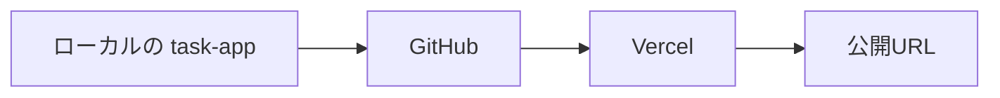
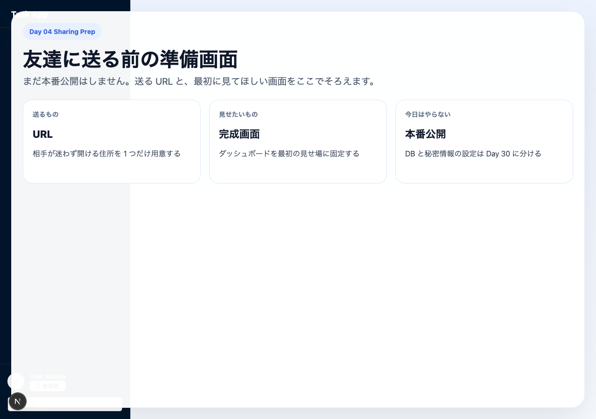
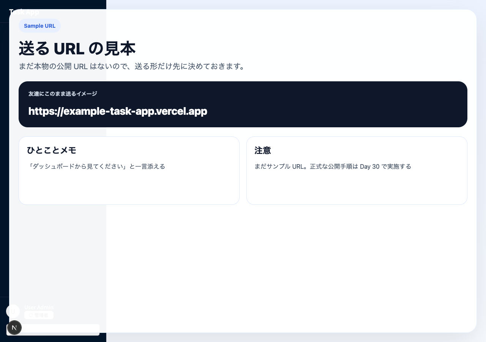
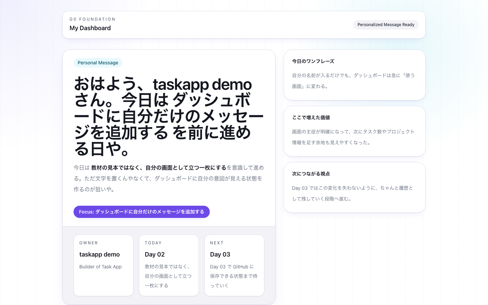

# Day 04: ネットに公開

30日で、自分専用のタスク管理アプリを育てていく。
Day 01 で土台を立ち上げた。
Day 02 で自分の気配を入れた。
Day 03 で GitHub に保存した。

そして今日は、
その流れがはじめて
「自分以外の人にも見える場所」
まで届く日や。

URL が発行されると、
このアプリはもう
ローカルの中だけの練習作品ではない。

スマホでも開ける。
友だちにも送れる。
SNS に貼れる。
「いま作ってるで」が、
ほんまに見せられる形になる。

G0 Foundation の最終日は、
派手な新機能を増やす日やない。
でも体験としては、
ここがめっちゃ大きい。

自分の `task-app` が、
ネットの向こう側からも開けるようになる。
今日はその最初の公開を、
Vercel で丁寧にやっていこう。







## 🌟 このDayで君が手に入れるもの

Day 03 で GitHub に保存した **自分の `task-app`** を、
Vercel に接続して公開し、
本物の URL で開ける状態まで持っていけるようになる。

今日のゴールは、
単に「デプロイボタンを押した」では終わらへん。

- GitHub にある自分のリポジトリを、そのまま Vercel に読み込める
- 公開前に `npm run build` でローカル確認する意味が分かる
- Vercel の Project 設定画面で、何を見ればええか判断できる
- デプロイ後に URL を別端末やスマホで開いて確認できる
- 自分のアプリ URL を SNS に貼って、「ここまで来た」と言える

Day 01 からここまで積み上げた流れが、
はじめてひとつの公開体験につながる。
G0 の締めとして、かなり気持ちええ日になるで。

## 📍 今日のゴール（G0 Foundation の4日目 / 修了日）

- [ ] Day 03 の完成状態から作業を再開する
- [ ] GitHub に `task-app` が push 済みであることを確認する
- [ ] ローカルで `npm run build` を実行し、公開前の確認をする
- [ ] Vercel アカウントを作成またはログインする
- [ ] GitHub リポジトリを Vercel に Import する
- [ ] Project 設定を確認して Production Deploy を実行する
- [ ] 発行された URL をブラウザで開き、表示を確認する
- [ ] シークレットウィンドウやスマホでも公開 URL を確認する
- [ ] URL を SNS や身近な人に共有して、G0 の節目を外へ出す

### 🆕 新しく学ぶ概念

| 概念 | 読み方 | 役割 | 例え |
|------|--------|------|------|
| Vercel | ヴァーセル | Next.js を簡単に公開できるサービス | レンタルキッチン |
| デプロイ | — | アプリをネットに公開すること | 料理をテーブルに並べる |
| 環境変数 | かんきょうへんすう | 設定値を外部から渡す仕組み | 店の裏の金庫 |
| ビルド | — | ソースコードを本番用に変換 | 料理の仕込み |

## 🧾 Front Matter

- Day: `04`
- Group: `G0 Foundation`
- Feature Theme: `ネットに公開`
- Learning Outcome: `GitHub に保存した自分の task-app を Vercel で公開し、他人が開ける URL を持てる`
- Prerequisites: `Day 03 完了（GitHub push 済み）`

## 🧰 前提（Day 03 完了していること）

今日は Day 03 の続きから進める。
新しいプロジェクトを作る日ではないし、
別の見本コードを取りに行く日でもない。

次の状態になっている前提で進めよう。

- 手元に `task-app` ディレクトリがある
- `npm install` 済みで `npm run dev` が動く
- Day 02 で編集したダッシュボードがローカルに残っている
- Day 03 で GitHub に push した自分のリポジトリがある
- GitHub のブラウザ画面で `task-app` のファイル一覧を見られる

ここでいちばん大事なんは、
**今日は自分のリポジトリを、そのまま公開する**
ということや。

教材用の別完成品を触るんやない。
Day 01 から Day 03 まで積み上げた
**自分の `task-app`** を、
そのまま Vercel に持っていく。

### 🆕 新しく学ぶ概念

| 概念 | 読み方 | 役割 | 例え |
|------|--------|------|------|
| Vercel | ヴァーセル | Next.js アプリを簡単に公開できるホスティングサービス | レンタルキッチン。作った料理をお客さんに出せる場所 |
| デプロイ | — | アプリをサーバーに配置して公開する操作 | 料理をお店のテーブルに出すこと |
| `npm run build` | — | 本番用にアプリを最適化するコマンド | 仕込みの総仕上げ。お客さんに出せる状態にする |
| 環境変数 | かんきょうへんすう | アプリの設定情報を外部で管理する仕組み | レシピに直接書かず、店の金庫に入れておく秘密の材料 |

> 📌 **今日はコードをほぼ書かない。GitHub と Vercel をつなぐだけ。** ボタンをぽちぽち押していくだけで、自分のアプリに URL が付く。

## ✨ 今日のワクワクポイント

URL って、
ただの文字列に見えるやろ。
でも自分で作ったアプリに URL が付く瞬間、
体験はかなり変わる。

ローカルで開く `http://localhost:3000` は、
自分のパソコンの中だけの入り口や。
けど Vercel で公開された URL は、
ネットの向こう側からも入ってこられる。

つまり今日の終わりには、
こんなことができるようになる。

- 友だちに「これ、今作ってるやつ」と URL を送る
- スマホで自分のアプリを開く
- SNS に「Day 04 で初公開できた」と貼る
- 明日以降の改善を、公開 URL ベースで考えられる

30日のカリキュラムの中でも、
「見せられるようになった」感覚が強い最初の節目や。

ここは遠慮せず、
ちょっと自慢してええ。
Day 01 から自分で積み上げたものが、
ほんまに外へ出るんやからな。

## 🔙 前日からの状態確認

まずは Day 03 の最後から、
今日の流れがどうつながっているかを確認しよう。

Day 03 の締めでは、
こう予告していた。

> Day 04 では Vercel につないで、  
> 自分の `task-app` を実際の URL で開ける状態まで持っていこう。  
>  
> GitHub に保存した今日の一歩が、  
> そのまま公開への橋になるで。

今日はまさにこの続きをやる。

GitHub に保存しただけでは、
まだ「コードが置かれている」状態や。
そこから Vercel につなぐことで、
「URL を叩いたらアプリが見える」状態に変わる。

この橋渡しを自分でやれるようになるのが、
Day 04 の本質や。

### いまの現在地

Day 03 完了時点では、
だいたい次の状態になっているはずや。

- GitHub に `task-app` リポジトリがある
- `main` ブランチに Day 02 までのコードが入っている
- `README.md` がリポジトリの顔として見えている
- `.env` は送らず、公開していいファイルだけが保存されている

ここから今日やるのは、
Vercel に GitHub リポジトリを読ませて、
公開用のビルドを通し、
発行された URL を確認するところまでや。

## Step 1: GitHub 側の完成状態をもう一度確認する

Vercel に持っていく前に、
まずは Day 03 の終点がちゃんと揃っているか確認しよう。

デプロイの失敗って、
Vercel だけが原因とは限らへん。
そもそも GitHub 側に送りきれていないとか、
見たいブランチに変更が入っていないとか、
出発点のズレで止まることも多い。

だからまずは、
公開前の現在地を読む。
ここがプロっぽい進め方や。

### 実行コマンド

```bash
pwd
git status -sb
git branch --show-current
git remote -v
git log --oneline --decorate -3
```

### ここで見たいこと

- `pwd` が `task-app` のルートを指している
- `git status -sb` で大きな未保存差分が残っていない
- `git branch --show-current` が `main` になっている
- `git remote -v` で GitHub の `origin` が見えている
- `git log --oneline --decorate -3` に Day 03 までの履歴がある

### GitHub のブラウザ画面でも確認する

ターミナル確認だけで終わらせず、
GitHub のリポジトリページもブラウザで開こう。

ここで次が見えていたら OK や。

- `README.md` が表示されている
- `src` ディレクトリがある
- `src/app/dashboard/page.tsx` が存在する
- 一番上に表示されているブランチが `main` になっている

GitHub 側で見えているものが、
今日 Vercel が読み込む土台になる。

## Step 2: 公開前にローカルで `npm run build` を通す

ここが今日のかなり大事な一手や。

「どうせ Vercel が build してくれるんやし、
先に押してから見ればええやん」
と思いがちやけど、
この進め方は後でしんどくなりやすい。

Vercel の失敗ログはもちろん見られる。
でもまずローカルで `npm run build` が通るか確認しておくと、
公開前にエラーを切り分けやすい。

今日は G0 の締めやからこそ、
勢いだけじゃなく、
**公開前の一呼吸**
も覚えて帰ってほしい。

### 実行コマンド

```bash
npm run build
```

### 期待する結果

環境差はあるけど、
だいたい次のような流れになればええ。

```text
Creating an optimized production build ...
Compiled successfully
Linting and checking validity of types ...
Collecting page data ...
Generating static pages ...
Finalizing page optimization ...
```

最後まで止まらず完走すれば、
今日の公開にかなり自信を持って進める。

### もしここで止まったら

落ち着いて、
まずローカルの build エラーを直そう。

この時点なら、
Vercel の設定が悪いのか、
コード自体が build できていないのか、
原因の切り分けがめっちゃやりやすい。

逆にここを飛ばすと、
Vercel 側の UI とログを見ながら原因を探すことになって、
初回公開ではかなり迷いやすい。

今日は最速でボタンを押す練習やなくて、
**公開までの流れを自分で再現できるようになる**
のが狙いや。

## Step 3: Vercel アカウントを作成する

GitHub 側の土台とローカル build が確認できたら、
次は公開先の Vercel に入る。

Vercel は、
Next.js とかなり相性がええ公開基盤や。
今回の `task-app` みたいな App Router 構成でも、
初回の導線がかなり分かりやすい。

### やること

1. ブラウザで `https://vercel.com` を開く
2. `Sign Up` か `Continue with GitHub` を選ぶ
3. GitHub アカウントと連携してログインする

### ここで GitHub 連携を選ぶ理由

今日は Day 03 の続きで、
**GitHub にある自分のリポジトリをそのまま公開**
したいからや。

GitHub 連携にしておくと、
Vercel 側でリポジトリ選択がかなり素直になる。
あとで更新を push したときも、
再デプロイの流れがつながりやすい。

### 初回ログインで見かけやすい画面

初回やと、
次のどれかが出ることが多い。

- `Import Git Repository`
- `Add New...`
- `Continue with GitHub`
- GitHub 連携の権限確認画面

文言は少し違ってもええ。
大事なんは、
**自分の GitHub リポジトリ一覧が見える入口まで進む**
ことや。

## Step 4: GitHub の `task-app` リポジトリを Import する

ログインできたら、
Vercel に Day 03 で作った GitHub リポジトリを読み込ませる。

ここで選ぶのは、
もちろん **自分の `task-app`** や。

### 進め方

1. Vercel のダッシュボードで `Add New...` を押す
2. `Project` を選ぶ
3. GitHub リポジトリ一覧から `task-app` を探す
4. 見つかったら `Import` を押す

### リポジトリが見つからないとき

だいたい次のどちらかや。

- GitHub 連携の権限がまだ足りていない
- Vercel にリポジトリアクセスを許可していない

この場合は、
Vercel 側の GitHub 連携設定を見直して、
`task-app` リポジトリを読めるようにする。

初回でここに数分かかるのは普通や。
焦らんでええ。

### ここで意識してほしいこと

Import するのは、
今日のために新しく用意した何かやなくて、
Day 01 から積み上げてきた自分のリポジトリや。

この感覚があると、
「公開は別工程」やなくて、
「作ってきたものの自然な続き」
として理解しやすくなる。

## Step 5: Project 設定画面で見るべきポイントを絞る

`Import` を押すと、
Project 設定画面に進む。

ここで項目がいろいろ出てくると、
初回はちょっと身構えるかもしれへん。
でも Day 04 で全部を理解し切る必要はない。

今日まず見るべきポイントは、
かなり絞れる。

### まず見る場所

- Project Name
- Framework Preset
- Root Directory
- Build and Output Settings
- Environment Variables

### 今日の `task-app` での基本判断

- Project Name: `task-app` か、被りを避けたいなら少し変えても OK
- Framework Preset: `Next.js`
- Root Directory: リポジトリのルート
- Build Command: デフォルトのままで問題ないことが多い
- Output Directory: デフォルトのままで問題ないことが多い
- Environment Variables: 今日は特に追加なしで進める

### なぜ Environment Variables を今日は触らないのか

Day 04 のスコープは、
**まず自分のアプリを公開 URL で見られるようにする**
ところや。

認証や外部サービスの本格導入は、
Day 05 以降で段階的に入ってくる。
この段階で本物のシークレットを慌てて入れる必要はない。

もし入力欄が見えても、
今日は空のままで進めてええ。

### 初回に迷いがちなところ

#### Project Name

公開 URL にこの名前が入ることが多い。
たとえば `task-app-kouiso` なら、
それに近い URL が発行されやすい。

SNS に貼ることを考えると、
短くて分かりやすい名前はけっこう効く。

#### Framework Preset

Next.js のプロジェクトやから、
ここは `Next.js` で揃っていれば OK。

#### Root Directory

今日の教材では、
リポジトリ直下にアプリがある想定や。
サブディレクトリ構成ではないので、
ルートのまま進める。

## Step 6: Production Deploy を実行する

設定が確認できたら、
いよいよ公開や。

`Deploy` を押す。
この瞬間に Vercel が、
GitHub からコードを取得して、
build して、
公開 URL を用意し始める。

### ここで起きていること

画面の向こうでは、
ざっくり次の流れが走っている。

1. GitHub から `task-app` のコードを読む
2. 依存関係をインストールする
3. `npm run build` 相当の build を走らせる
4. 生成物を公開用に配置する
5. URL を発行する

つまり Day 03 で GitHub に保存した履歴が、
今日 Vercel に読まれて、
Day 04 の公開につながっている。

このつながりが見えたら、
GitHub と Vercel の役割も整理しやすい。

### 待っている間に見るべきところ

デプロイ中は、
進捗ログが流れることが多い。

ここで見ておきたいのは次の3つや。

- Install が進んでいるか
- Build が通っているか
- 最後に `Ready` っぽい表示が出るか

### 成功のイメージ

文言は多少違っても、
だいたいこういう雰囲気や。

```text
Building
Deploying
Ready
```

この `Ready` が見えたら、
今日の最初の公開は成功にかなり近い。

## Step 7: 発行された URL を開いて、最初の公開を体験する

デプロイ完了後、
Vercel が Production URL を表示してくれる。

たとえば次のような形や。

```text
https://task-app-kouiso.vercel.app
```

もちろん実際の URL は人によって違う。
でもこの形式に近いものが出たら、
それが今日の成果物や。

### まずはブラウザで開く

表示された URL をクリックして、
自分のアプリを開こう。

ここで見えた瞬間、
かなりテンション上がるはずや。

なぜなら、
その画面はもう
`localhost` の中だけやなくて、
公開された URL として存在しているからや。

### 確認ポイント

- ページがエラーにならず表示される
- Day 01 から積み上げた見た目が見える
- Day 02 で作った自分用メッセージが見える
- GitHub 上の最新状態とズレていない

【スクリーンショット】Day 04 公開確認の画面


Vercel の Production URL がまだ使えない場合は、
`npm run build` と `npm start` で立ち上げた local production build を開いて確認してええ。
この教材内のキャプチャも、その fallback として `/dashboard` を local production で開いた例や。

### 最初に見てほしい感覚

この瞬間は、
細かいデザイン反省より先に、
まずひとつ受け取ってほしい。

**自分のアプリに、外から入れる URL が付いた**

これが Day 04 のど真ん中や。

## Step 8: シークレットウィンドウと別端末で開く

公開 URL をブラウザで一回見て終わり、
にしないのが大事や。

ほんまに公開されているなら、
別セッションや別端末でも見えるはずやからな。

### まずやること

1. シークレットウィンドウを開く
2. さっきの Vercel URL を貼る
3. 同じ画面が見えるか確認する

### 次にやること

1. スマホを手元に出す
2. URL を自分に送る
3. スマホのブラウザで開く

### ここで見ておきたいこと

- ちゃんと読み込めるか
- 画面が極端に崩れていないか
- 自分以外の環境でも URL が生きているか

PC のいつものブラウザで見えるだけやと、
ログイン状態やキャッシュに助けられている可能性もある。
せやから、
シークレットウィンドウとスマホ確認は
初回公開でかなり価値が高い。

### スマホで開けたときの意味

ここでようやく、
「自分の生活圏の中で実際に使えるもの」
に一段近づく。

朝スマホで見てもええし、
誰かにその場で見せてもええ。
この実感は、
ローカルだけではなかなか出にくい。

## Step 9: URL を SNS に貼ってみる

ここは今日のワクワク軸や。

せっかく公開 URL が出たのに、
自分の中だけで閉じてしまうのはもったいない。

もちろん公開範囲は自分で決めてええ。
大きく出したくなければ、
身近な友だちや家族に送るだけでも十分や。

でももし出せそうなら、
今日はぜひ URL を SNS に貼ってみてほしい。

### 共有文のたたき台

```text
Day 04 で自分の task-app を初公開できた。
まだ土台やけど、URL を持てたのがうれしい。
次は Day 05 からログインまわりに入っていく。
https://your-task-app.vercel.app
```

### 書くときのコツ

- 完成品みたいに見せすぎなくてええ
- 「今日ここまで来た」が伝われば十分
- Day 01 から積み上げてきた流れを一言添えると良い

### なぜここを勧めるのか

公開って、
出した瞬間に初めて現実感が出ることが多い。

SNS や人に見せることで、
「次に何を良くしたいか」も見えてくる。
Day 05 以降のモチベーションにもかなり効く。

G0 の節目として、
ここは素直に味わってええで。

## Step 10: デプロイ文脈で見る Pro パターン

ここまでで公開そのものは進められる。
でもプロの現場では、
**公開前の流れの組み方**
にも差が出る。

今日は「ネットに公開する」という文脈で、
Before / After を一回見ておこう。

### 💡 Pro パターンで書こう — build を通してから公開する

ここまでで Vercel に公開する流れはつかめた。
でもプロの現場ではもう一段上の進め方をする。
なぜその順番にするのか、
**Before/After** で見比べてみよう。

### ❌ Before（動くかどうかを Vercel 任せにする）

```bash
# ローカルでの確認を飛ばして、そのまま Vercel に Import する
# うまくいくかはデプロイ結果を見てから考える
```

**この進め方の問題点**:

- build 失敗の原因が、コードの問題なのか Vercel 設定の問題なのか切り分けにくい
- デプロイの待ち時間ごとに確認コストが発生して、初回公開ほど迷いやすい
- 「公開前に自分で品質を確かめる」流れが身につきにくい

### ✅ After（ローカル build を通してから公開する）

```bash
npm run build
# 通ったことを確認してから Vercel に Import / Deploy する
```

**この進め方の強み**:

- コード側の build 問題を先に潰せるので、Vercel 側では設定確認に集中しやすい
- 失敗時の原因切り分けが早くなって、公開フロー全体の再現性が上がる
- 「公開前に一呼吸置く」習慣がつくので、今後の本番デプロイでも崩れにくい

#### 🎓 覚えておきたいエッセンス

デプロイは
「押してから祈る」より、
**ローカル build を通してから公開する**
ほうが強い。

ネットに公開するほど、
事前確認の一手があとで効いてくる。

## Step 11: よくあるつまずきを初回公開の順番で切り分ける

Vercel 初回公開は、
詰まると全部が難しく見えやすい。
でも実際は、
だいたい次のどこかで止まっていることが多い。

- GitHub 側の状態
- ローカル build
- Vercel 連携権限
- Project 設定
- 公開後の確認

ここでは、
今日の流れに沿って見直し順を置いておく。

### `task-app` リポジトリが Vercel に出てこない

まず見るのは GitHub 連携権限や。

- Vercel に GitHub 連携が通っているか
- 対象リポジトリへのアクセスが許可されているか
- ブラウザで GitHub 側のリポジトリがちゃんと見えているか

リポジトリ自体が GitHub に見えていなければ、
Vercel 側でも当然見えへん。
せやから出発点から順に戻るのが早い。

### Deploy が build エラーで止まる

まずローカルでこれをやる。

```bash
npm run build
```

ここで同じエラーで止まるなら、
原因はコード側の可能性が高い。

逆にローカル build は通るのに Vercel で止まるなら、
設定や環境差分を疑いやすい。

### 公開 URL は出たのに画面が思ったのと違う

次を確認しよう。

- GitHub の `main` に最新コードが入っているか
- Vercel が読んでいるブランチが意図どおりか
- デプロイ日時が最新か

初回は、
「見ているコードのバージョンがズレている」
だけのことも多い。

### PC では見えるのにスマホで崩れる

まずは焦らず、
どこまで崩れているかを観察しよう。

- 文字が切れているか
- 横スクロールが出ているか
- そもそも読み込みエラーなのか

Day 04 は深いレイアウト修正の回ではないけど、
「公開したら別端末でも見る」
という姿勢はここで入れておく価値がある。

### 共有するのがちょっと怖い

それは普通や。
初公開は誰でも少し身構える。

でも今日は、
完璧な完成版を出す日やない。
**Day 04 まで来た節目を外に出す日**
やと思ってええ。

小さく共有してもええし、
公開範囲を絞ってもええ。
一回 URL を外に出す経験が、
次の伸びにつながる。

## Step 12: 今日やったことを、自分の言葉で説明できるようにする

操作としてはここまでで十分や。
でも理解としてもう一歩強くしたいなら、
次の4つを自分の言葉で説明できるとかなりええ。

### 1. GitHub と Vercel の役割は違う

GitHub はコード履歴の保存先。
Vercel はそのコードを公開 URL に変える場所。

Day 03 と Day 04 が分かれているのは、
この役割が違うからや。

### 2. 公開の出発点は、自分のリポジトリや

今日は見本コードを持っていったんやなくて、
Day 01 から積み上げた自分の `task-app` を公開した。

ここがほんまに大事や。

### 3. `npm run build` は公開前の確認になる

build を先に通すと、
エラー原因の切り分けがかなり楽になる。
公開直前の一手として、今後もずっと使える。

### 4. 公開したら、別環境でも見る

自分のいつものブラウザだけで終わらせず、
シークレットウィンドウやスマホでも見る。

これで初めて、
「ほんまに公開されている」
と自信を持ちやすくなる。

## 🎓 覚えておきたいエッセンス

Day 04 の本質は、
単に Vercel のボタンを押すことやない。

**自分のアプリに、他人も開ける URL を持たせた**
ことや。

覚えておいてほしいのはこの5つ。

- Day 04 は Day 03 の GitHub 保存を、そのまま公開へ橋渡しする日
- 公開するのは教材の見本ではなく、Day 01 から積み上げた自分の `task-app`
- Vercel に行く前に `npm run build` を通すと、公開フローがかなり安定する
- 公開 URL はブラウザ一回確認で終わらせず、シークレットウィンドウやスマホでも見る
- 最初の公開 URL は、遠慮せず SNS や身近な人に共有してええ

## ✅ 今日のチェックリスト

最後に、
この Day の完了条件を自分で確認しておこう。

- [ ] GitHub に `task-app` が push 済みであることを確認した
- [ ] `npm run build` が通った
- [ ] Vercel に GitHub 連携でログインできた
- [ ] `task-app` リポジトリを Import できた
- [ ] Project 設定を確認して Deploy できた
- [ ] 発行された URL をブラウザで開けた
- [ ] シークレットウィンドウかスマホでも URL を確認した
- [ ] URL を誰かに共有した、または共有文の下書きを作った

全部埋まったら、
Day 04 は完了や。

## 🏁 G0 Foundation 修了 ふりかえり

今日で G0 Foundation は終了や。

この4日でやったことを並べると、
かなりちゃんと積み上がっている。

### Day 01 でやったこと

- `task-app` の土台を立ち上げた
- Next.js アプリを最初の画面まで動かした
- design token を入れて、見た目の芯を整え始めた

### Day 02 でやったこと

- ダッシュボードに自分だけのメッセージを入れた
- ただの教材見本から、自分のプロダクトっぽさを出し始めた
- Server Component を基準にする考え方にも触れた

### Day 03 でやったこと

- GitHub にコードを保存した
- 履歴として積み上げられる状態を作った
- 次の公開に向かうための保存先を整えた

### Day 04 でやったこと

- Vercel でネット公開した
- 公開 URL を持った
- スマホや他人の環境からも開ける状態にした

### つまり G0 で手に入ったもの

G0 の4日間で、
君はもう次の土台を持っている。

- 手元で動く
- 自分の気配がある
- GitHub に保存されている
- URL で外から見られる

これって、
ただの「勉強した」より一段強い。

**自分のプロダクトの最初の輪郭を、外に出せるところまで持ってきた**
ということや。

ここまで来たら、
Day 05 からの G1 Auth も、
「教材を消化する」やなくて
「この公開済みアプリをもっと育てる」
感覚で進めやすくなる。

## 🔜 次回予告

G0 の土台はここで完成や。
次からは G1 Auth に入る。

Day 05 では、
ログイン UI の導入から始める。

公開 URL を持った今の `task-app` に、
「誰が使うアプリなのか」
という入口を足していく段階や。

ここから先は、
見た目だけやなく、
使う体験そのものが育ち始める。

次はログイン画面をつくって、
このアプリにちゃんとした入口を作っていこう。
