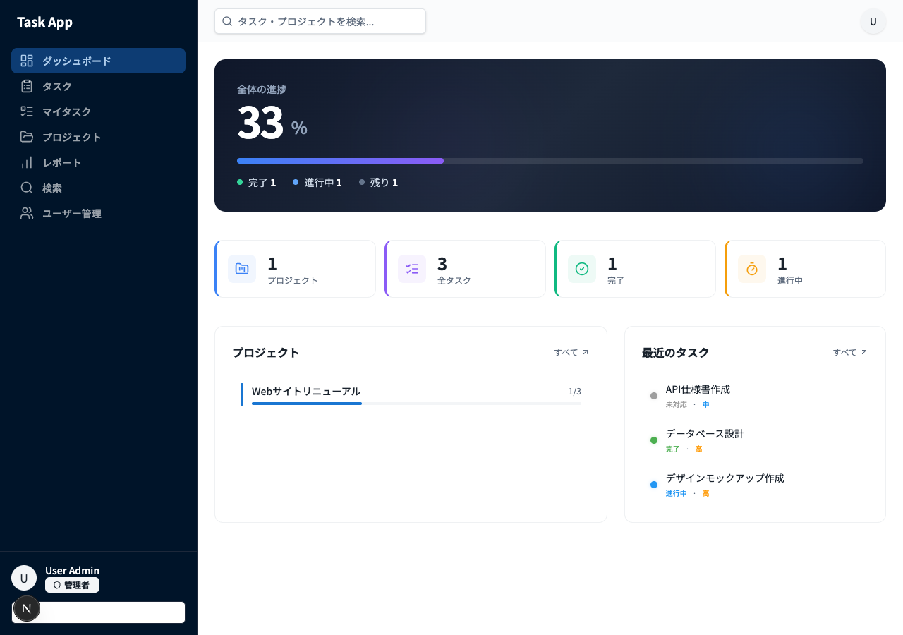
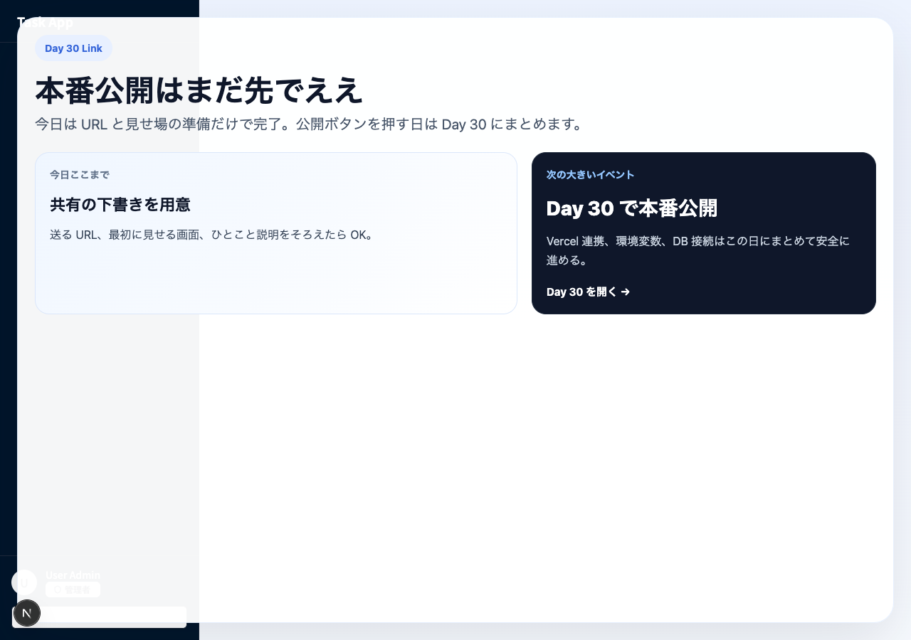

# Day 04: 🚀 ネットに公開しよう

## 🔙 前回の振り返り

Day 03 では Git の基本操作（`git add` → `git commit` → `git push`）を学び、コードを GitHub リポジトリにアップロードしました。GitHub にコードが保存できるようになったので、今日はそのコードを「友達に見せる準備」ができる形まで整えます。

---

## 🎯 今日のゴール

あなたが作ったアプリについて、友達に URL を送って見せる準備をします。  
今日は共有用の下書きを画面に出すところまで進めて、本番公開は Day 30 でまとめて行います。

## 🤔 なぜこれを作るのか？

アプリを作っても、「誰に」「どの画面を」「どう見せるか」が決まっていないと、共有するときに手が止まりがちです。先に共有準備パネルを作っておくと、見せる内容が整理されて、Day 30 の本番公開でも迷いにくくなります。

> 💡 **例え話**: 文化祭の出し物も、本番当日に看板を書くより、前日に「どこを見てほしいか」を決めておいたほうがスムーズです。今日はその看板づくりにあたります。

### 📐 今日の流れ

```text
ローカルで動作確認
  ↓
共有準備パネルを追加
  ↓
友達に URL 案を送る準備をする
```

この流れで進めると、「もう公開した気分」ではなく「公開前に見せ方を整える」という Day 04 の役割がはっきりします。

## 📊 実装ステップ一覧

| ステップ | 作業内容 | 所要時間 |
|---------|---------|---------|
| 手順 1 | 送る URL と見せ場を決める | 5分 |
| 手順 2a | `sharePrepPanel` を `return (` の直前に追加する | 7分 |
| 手順 2b | 共有準備パネルの `<aside>` を画面に追加する | 8分 |
| 手順 3 | 送る内容を書き換えて試す | 5分 |
| 手順 4 | Day 30 への導線を置く | 5分 |

**合計時間**: 約30分

---

## 手順 1: 送る URL と見せ場を決める

まずは友達に送るものを 1 つに絞ります。  
この段階では、本物の公開 URL がまだなくても大丈夫です。Day 30 で本番公開するときに差し替えればええので、今日は仮の URL で進めます。


見本はこんな感じです。

```text
https://example-task-app.vercel.app
```

URL を開いた友達が、最初にどこを見るかも決めておきます。  
Day 04 では、完成アプリの見せ場を **ダッシュボード** に固定するのがおすすめです。



手順 1 のゴールは、「送る URL」と「最初に見せる画面」の 2 つを言葉にできることです。次の手順で、この 2 つを画面に出します。

## 手順 2a: `sharePrepPanel` を `return (` の直前に追加する

今日さわるファイル: `src/app/dashboard/page.tsx`

Day 02 で作ったダッシュボードの下に、「共有準備パネル」を 1 枚だけ追加します。  
ただし、いきなり `<aside>` を貼るのではなく、**先にパネルの中身を入れる変数を作る**のが React では正しい順番です。

VS Code で `src/app/dashboard/page.tsx` を開き、`DashboardPage` 関数の中で `return (` を探してください。検索のしかたは、`Cmd+F`（Mac）または `Ctrl+F`（Windows）で `return (` と入力するのがいちばん確実です。  
今のコードでは、`const recentTasks = overview?.recentTasks ?? [];` の**すぐ下**、`return (` の**直前**が挿入位置です。

まずはパネルに出す内容を 1 つの変数にまとめます。`sharePrepPanel` という名前にしておくと、あとで書き換える場所がわかりやすいです。`const` は JSX の中には置けないので、ここで先に追加します。

```tsx
const sharePrepPanel = {
  url: 'https://example-task-app.vercel.app',
  firstScreen: 'ダッシュボード',
  note: '本番公開は Day 30 でまとめて行う',
};
```

ここまでで、共有準備パネルの「中身」だけが用意できました。次の手順 2b で、この `sharePrepPanel` を画面に表示する `<aside>` を追加します。

## 手順 2b: 共有準備パネルの `<aside>` を画面に追加する

`sharePrepPanel` を先に作ったら、そのあとで画面へ表示するための見た目を足します。  
この `<aside>` の中では `{sharePrepPanel.url}` のように変数を参照するので、**手順 2a を先に終わらせてから**進めてください。

VS Code で `src/app/dashboard/page.tsx` を開いたまま、今度は `<div className="space-y-10">` で始まるブロックの中を見ます。挿入位置は、`{/* プロジェクト & タスク */}` ブロックの閉じ `</div>` の**直後**です。検索のしかたは、`Cmd+F`（Mac）または `Ctrl+F`（Windows）で `{/* プロジェクト & タスク */}` を探すと、そのブロックを見つけやすいです。

```tsx
<aside className="mt-6 rounded-2xl border border-amber-200 bg-amber-50 p-6">
  <p className="text-xs font-bold uppercase tracking-[0.2em] text-amber-700">
    Share Preview
  </p>
  <h3 className="mt-2 text-xl font-bold text-slate-900">
    友達に送る準備
  </h3>
  <dl className="mt-4 space-y-2 text-sm">
    <div>
      <dt className="font-semibold text-slate-700">送る URL</dt>
      <dd className="text-slate-600">{sharePrepPanel.url}</dd>
    </div>
    <div>
      <dt className="font-semibold text-slate-700">最初に見せる画面</dt>
      <dd className="text-slate-600">{sharePrepPanel.firstScreen}</dd>
    </div>
    <div>
      <dt className="font-semibold text-slate-700">メモ</dt>
      <dd className="text-slate-600">{sharePrepPanel.note}</dd>
    </div>
  </dl>
</aside>
```


保存したらブラウザで `http://localhost:3001/dashboard` を見直します。プロジェクト & タスクのブロックの下に、琥珀色（アンバー）の共有準備パネルが新しく 1 枚増えていたら成功です。

ここまでで「今日作ったもの」が画面に 1 つ増えています。共有準備パネルは、Day 30 で実際の URL に差し替える前の下書きとして使います。

## 手順 3: 送る内容を書き換えてみる

変数 `sharePrepPanel` の中身だけを書き換えると、画面の表示もそのまま変わります。たとえば自分用に、こんなふうに直してみても OK です。

```tsx
const sharePrepPanel = {
  url: 'https://my-task-app.vercel.app',
  firstScreen: 'ダッシュボード',
  note: 'まずは家族に見せる。公開は Day 30。',
};
```

保存するたびにブラウザが自動更新されて、共有準備パネルの中身が書き換わります。  
「`sharePrepPanel` を直したら画面が変わる」を自分の手で確認できたら、手順 3 はクリアです。

## 手順 4: Day 30 への導線を置く

ここがめっちゃ大事です。今日の教材で、本番公開のボタンまでは押しません。



共有準備パネルのすぐ下に、Day 30 へつなぐ案内を 1 つ置きます。先ほどの `</aside>` の直後に、次のコードを追加してください。

```tsx
<p className="mt-4 text-sm text-slate-500">
  本番公開は Day 30 でまとめてやります。今日は共有の下書きができたら完了です。
</p>
```

保存してブラウザを見ると、共有準備パネルの下にグレーの一文が増えています。これで「今日やること」と「まだやらんこと」の線引きがはっきり伝わります。Day 30 で本番公開するときは、この導線がそのまま思い出しメモになります。

---

## ✅ 今日のチェックリスト

- [ ] 送る URL と最初に見せる画面を言葉にできた
- [ ] ダッシュボードに「共有準備パネル」が表示された（琥珀色のカード）
- [ ] `sharePrepPanel` 変数を書き換えて画面が変わることを確認した
- [ ] Day 30 への導線（グレーの一文）が見えている

## 📝 学んだこと

- 「友達に送る準備」は、本番公開より先に手を動かす価値がある
- React では「変数を書き換えると画面が自動で更新される」仕組みが標準
- Day 30 の本番公開に向けて、今日は共有の下書きを作れた

## 🆘 困ったときは

| 症状 | 原因の見当 | 対応 |
|------|------------|------|
| パネルが表示されない | 貼り付け位置が外側の `</div>` の外側になっている | `{/* プロジェクト & タスク */}` ブロックの直後、外側 `</div>` の**直前**に移動 |
| `sharePrepPanel is not defined` | 手順 2a を飛ばした、または変数宣言の位置がずれている | `DashboardPage` 関数の中で `return (` を検索し、その直前に `const sharePrepPanel = { ... }` を置く |
| アンバー色にならない | className のタイポ | `rounded-2xl`, `border-amber-200`, `bg-amber-50` の順に確認 |

---

### 🎉 おつかれさまでした

Day 04 完了です。明日以降の Day 05 ではタスクの並び替えや編集機能に入ります。今日作った共有準備パネルは、Day 30 の本番公開で「最初に見せる画面」として再登場します。
