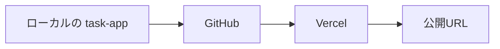

# Day 04: ネットに公開

Day 01 で土台を立ち上げ、Day 02 でダッシュボードに自分の情報を表示し、Day 03 で GitHub に保存しました。

今日は、このアプリを Vercel（作ったアプリをインターネット上に公開できるホスティングサービス。読み方: バーセル）を使ってインターネット上に公開します。公開して URL が発行されると、自分のパソコン以外からもアプリを開けるようになります。スマホやほかの人のブラウザからもアクセスでき、いま作っているものを実際に見せられる状態になります。

Phase 1（環境構築・即公開）の最終日は、新しい機能を追加する日ではありません。すでに作ったアプリを、誰でもアクセスできる状態にすることが今日のゴールです。Vercel での公開手順を、順を追って進めます。




## この日でできるようになること

Day 03 で GitHub へ保存した自分の `task-app` を Vercel につなぎ、実際の URL で公開できるようになります。デプロイ（作ったアプリを公開用のサーバーに置いて、誰でも使える状態にすること）のボタンを押すだけで終わらせず、次のことができるようになります。

- GitHub にある自分のリポジトリを、そのまま Vercel に読み込める
- 公開前に `npm run build` でローカル確認する意味が分かる
- Vercel の Project 設定画面で、何を見ればよいか判断できる
- デプロイ後に URL を別端末やスマホで開いて確認できる
- 自分のアプリ URL を SNS などで共有できる

Day 01 からここまで進めてきた作業が、今日の公開でひととおりつながります。Phase 1 の区切りとなる日です。

## 今日のゴール（Phase 1 修了日）

- [ ] Day 03 の完成状態から作業を再開する
- [ ] GitHub に `task-app` が push 済みであることを確認する
- [ ] ローカルで `npm run build` を実行し、公開前の確認をする
- [ ] Vercel アカウントを作成またはログインする
- [ ] GitHub リポジトリを Vercel に Import する
- [ ] Project 設定を確認して Production Deploy を実行する
- [ ] 発行された URL をブラウザで開き、表示を確認する
- [ ] シークレットウィンドウやスマホでも公開 URL を確認する
- [ ] URL を SNS や身近な人に共有して、G0（最初の公開という節目）を外へ出す

### 今日の新語（早わかり）

| 概念 | 読み方 | 役割 | 例え |
|------|--------|------|------|
| Vercel | ヴァーセル | Next.js を手軽に公開できるサービス | レンタルキッチン |
| デプロイ | — | アプリをネットに公開すること | 料理をテーブルに並べる |
| 環境変数 | かんきょうへんすう | 設定値を外部から渡す仕組み | 店の裏の金庫 |
| ビルド | — | ソースコードを本番用に変換 | 料理の仕込み |

## Front Matter

- Day: `04`
- Group: `Phase 1（環境構築・即公開）`
- Feature Theme: `ネットに公開`
- Learning Outcome: `GitHub に保存した自分の task-app を Vercel で公開し、他人が開ける URL を持てる`
- Prerequisites: `Day 03 完了（GitHub push 済み）`

## 前提（Day 03 完了していること）

今日は Day 03 の続きから進めます。新しいプロジェクトを作ったり、別の見本コードを取りに行ったりはしません。次の状態になっている前提で進めます。

- 手元に `task-app` ディレクトリがある
- `npm install` 済みで `npm run dev` が動く
- Day 02 で編集したダッシュボードがローカルに残っている
- Day 03 で GitHub に push した自分のリポジトリがある
- GitHub のブラウザ画面で `task-app` のファイル一覧を見られる

ここでいちばん大事なのは、
**今日は自分のリポジトリを、そのまま公開する**
ということです。

教材用の別の完成品を使うのではなく、Day 01 から Day 03 まで積み上げた自分の `task-app` を、そのまま Vercel に持っていきます。

### 新しく学ぶ概念

| 概念 | 読み方 | 役割 | 例え |
|------|--------|------|------|
| Vercel | ヴァーセル | Next.js アプリを手軽に公開できるホスティングサービス | レンタルキッチン。作った料理をお客さんに出せる場所 |
| デプロイ | — | アプリをサーバーに配置して公開する操作 | 料理をお店のテーブルに出すこと |
| `npm run build` | — | 本番用にアプリを最適化するコマンド | 仕込みの総仕上げ。お客さんに出せる状態にする |
| 環境変数 | かんきょうへんすう | アプリの設定情報を外部で管理する仕組み | レシピに直接書かず、店の金庫に入れておく秘密の材料 |

> **今日はコードをほぼ書きません。GitHub と Vercel をつなぐだけ。** ボタンをぽちぽち押していくだけで、自分のアプリに URL が付く。

## 今日の見どころ

URL は、ただの文字列に見えるかもしれません。ただ、自分で作ったアプリに URL が付くと、できることが広がります。

ローカルで開く `http://localhost:3000` は、自分のパソコンの中だけの入り口です。一方、Vercel で公開された URL は、ほかの端末からも開けます。

今日の終わりには、次のことができるようになります。

- 作っているアプリの URL を人に送る
- スマホで自分のアプリを開く
- SNS に公開したことを投稿する
- 明日以降の改善を、公開 URL をもとに考えられる

30日のカリキュラムのなかでも、作ったものを人へ見せられる最初の区切りです。

## 前日からの状態確認

まずは Day 03 の最後から、今日の流れへのつながりを確認します。Day 03 の締めでは、次のように予告していました。

> GitHub に保存できたら、次はこの履歴を使ってアプリをインターネットに公開します。Day 04 では Vercel につないで、自分の `task-app` を実際の URL で開ける状態にします。今日 GitHub に保存した内容が、そのまま公開の土台になります。

今日はこの続きに取り組みます。

GitHub に保存しただけでは、まだコードが置かれているだけの状態です。そこから Vercel につなぐことで、URL を開けばアプリが見える状態に変わります。この橋渡しを自分でできるようになるのが、Day 04 の目的です。

### いまの現在地

Day 03 完了時点では、次の状態になっているはずです。

- GitHub に `task-app` リポジトリがある
- `main` ブランチに Day 02 までのコードが入っている
- `README.md` がリポジトリの顔として見えている
- `.env` は送らず、公開していいファイルだけが保存されている

ここから今日やるのは、Vercel に GitHub リポジトリを読み込ませ、公開用のビルドを通し、発行された URL を確認するところまでです。

## Step 1: GitHub 側の完成状態をもう一度確認する

Vercel に持っていく前に、まずは Day 03 の終点が揃っているかを確認します。

デプロイの失敗は、Vercel だけが原因とは限りません。GitHub 側に送りきれていない、見たいブランチに変更が入っていないなど、出発点のズレで止まることも多いです。そのため、まずは公開前の現在地を確認します。

### 実行コマンド

```bash
pwd
git status -sb
git branch --show-current
git remote -v
git log --oneline --decorate -3
```

### ここで見たいこと

- `pwd` が `task-app` のルートを指している
- `git status -sb` で大きな未保存差分が残っていない
- `git branch --show-current` が `main` になっている
- `git remote -v` で GitHub の `origin` が見えている
- `git log --oneline --decorate -3` に Day 03 までの履歴がある

### GitHub のブラウザ画面でも確認する

ターミナルでの確認だけで終わらせず、GitHub のリポジトリページもブラウザで開きます。ここで次が見えていれば問題ありません。

- `README.md` が表示されている
- `src` ディレクトリがある
- `src/app/dashboard/page.tsx` が存在する
- 一番上に表示されているブランチが `main` になっている

GitHub 側で見えているものが、今日 Vercel が読み込む対象になります。

## Step 2: 公開前にローカルで `npm run build` を通す

ここは今日の大事な一手です。

Vercel が build してくれるので先にプッシュしてから確認すればよい、と思いがちですが、この進め方はあとで手間が増えやすいです。

Vercel の失敗ログも確認できますが、まずローカルで `npm run build` が通るかを確認しておくと、公開前にエラーを切り分けやすくなります。公開前にローカルで一度ビルドを通す習慣をつけておきます。

### 実行コマンド

```bash
npm run build
```

### 期待する結果

環境差はあるけど、
だいたい次のような流れになればよいです。

```text
Creating an optimized production build ...
Compiled successfully
Linting and checking validity of types ...
Collecting page data ...
Generating static pages ...
Finalizing page optimization ...
```

最後まで止まらず完走すれば、
今日の公開にかなり自信を持って進めます。

### もしここで止まったら

落ち着いて、
まずローカルの build エラーを直しましょう。

赤い文字がたくさん出ても、全部を読む必要はありません。見るのは次の3つです。

- 最初に出た赤い行。あとに続くエラーは、その巻き添えで出ていることが多い
- `Error:` や `Type error:` のあとに書かれている内容
- `./src/...` のようなファイル名と、その横に付いている行番号

なぜ最初の1行を優先するかというと、build は途中で1か所つまずくと、その先の処理も連鎖で止まるからです。だから下の方のエラーを追いかけるより、一番上のエラーを直す方が早いです。ファイル名と行番号が分かれば、直す場所は「どのファイルの何行目か」まで絞れます。まずはそのファイルのその行を開いて、直前に自分が変えたところと見比べます。多くは書き間違いや消し忘れが原因です。

この時点なら、
Vercel の設定が悪いのか、
コード自体が build できていないのか、
原因の切り分けがとてもやりやすいです。

逆にここを飛ばすと、
Vercel 側の UI とログを見ながら原因を探すことになって、
初回公開ではかなり迷いやすいです。

今日は最速でボタンを押す練習ではなくて、
**公開までの流れを自分で再現できるようになる**
のが狙いです。

## Step 3: Vercel アカウントを作成する

GitHub 側の土台とローカル build が確認できたら、
次は公開先の Vercel に入ります。

Vercel は、
Next.js とかなり相性がいい公開基盤です。
今回の `task-app` みたいな App Router 構成でも、
初回の導線がかなり分かりやすいです。

### やること

1. ブラウザで `https://vercel.com` を開く
2. `Sign Up` か `Continue with GitHub` を選ぶ
3. GitHub アカウントと連携してログインする

### ここで GitHub 連携を選ぶ理由

今日は Day 03 の続きで、
**GitHub にある自分のリポジトリをそのまま公開**
したいからです。

GitHub 連携にしておくと、
Vercel 側でリポジトリ選択がかなり素直になります。
あとで更新を push したときも、
再デプロイの流れがつながりやすいです。

### 初回ログインで見かけやすい画面

初回だと、
次のどれかが出ることが多いです。

- `Import Git Repository`
- `Add New...`
- `Continue with GitHub`
- GitHub 連携の権限確認画面

文言は少し違ってもよいです。
大事なのは、
**自分の GitHub リポジトリ一覧が見える入口まで進む**
ことです。

### 期待する結果

- Vercel にログインできている
- リポジトリ一覧に `task-app` が見えている

## Step 4: GitHub の `task-app` リポジトリを Import する

ログインできたら、
Vercel に Day 03 で作った GitHub リポジトリを読み込ませます。

ここで選ぶのは、
**自分の `task-app`** です。

### 進め方

1. Vercel のダッシュボードで `Add New...` を押す
2. `Project` を選ぶ
3. GitHub リポジトリ一覧から `task-app` を探す
4. 見つかったら `Import` を押す

### リポジトリが見つからないとき

だいたい次のどちらかです。

- GitHub 連携の権限がまだ足りていない
- Vercel にリポジトリアクセスを許可していない

この場合は、リポジトリ一覧の近くにある `Adjust GitHub App Permissions`（環境によっては `Configure GitHub App`）を押します。GitHub の設定画面が開きます。`Repository access` の項目で `All repositories` を選ぶか、`Only select repositories` から `task-app` を選んで保存します。Vercel の画面に戻ると、一覧に `task-app` が出てきます。

ここでコードを直す必要はありません。Vercel から見えないのは、多くの場合「どのリポジトリを見てよいか」という許可がまだ渡っていないだけだからです。直す場所も、コードではなく GitHub 連携の許可範囲になります。

初回でここに数分かかるのは普通です。
焦らなくてよいです。

### ここで意識してほしいこと

Import するのは、
今日のために新しく用意した何かではなくて、
Day 01 から積み上げてきた自分のリポジトリです。

この感覚があると、
「公開は別工程」ではなくて、
「作ってきたものの自然な続き」
として理解しやすくなります。

### 期待する結果

- `task-app` の行で `Import` を押せて、Project 設定画面に進めている

## Step 5: Project 設定画面で見るべきポイントを絞る

`Import` を押すと、
Project 設定画面に進みます。

ここで項目がいろいろ出てくると、
初回はちょっと身構えるかもしれません。
でも Day 04 で全部を理解し切る必要はありません。

今日まず見るべきポイントは、
かなり絞れます。

### まず見る場所

- Project Name
- Framework Preset
- Root Directory
- Build and Output Settings
- Environment Variables

### 今日の `task-app` での基本判断

- Project Name: `task-app` か、被りを避けたいなら少し変えても OK
- Framework Preset: `Next.js`
- Root Directory: リポジトリのルート
- Build Command: デフォルトのままで問題ないことが多い
- Output Directory: デフォルトのままで問題ないことが多い
- Environment Variables: 今日は `DATABASE_URL` と `JWT_SECRET` の2つだけ設定する

### Environment Variables には2つだけ設定する

Day 04 のスコープは、
**まず自分のアプリを公開 URL で見られるようにする**
ところです。

ただし、`DATABASE_URL` と `JWT_SECRET` の2つは今日必要です。
配布コードは起動時に環境変数を検証する作りになっていて、
`DATABASE_URL`（有効な URL 形式）と `JWT_SECRET`（32文字以上）が
無いとエラーを出して止まります。
Vercel 上でも同じ検証が走るため、
空のままではデプロイしたアプリが起動しません。

新語の表で「環境変数＝店の裏の金庫」と例えました。今日はその金庫に、鍵を2本だけ入れます。それ以外の値は、本番公開を仕上げる Day 30 で扱います。

#### JWT_SECRET を用意する

手元のターミナルで、次のコマンドを実行します。

**ターミナル（どこでもOK）**

```bash
openssl rand -base64 48
```

長いランダムな文字列が1行表示されます。
これが JWT（ログイン状態の証明に使う署名付きデータ）の
署名用シークレットになります。
表示された文字列をコピーして、Environment Variables の欄に
Key を `JWT_SECRET`、Value をその文字列として追加します。

#### DATABASE_URL を用意する

Vercel から接続できる PostgreSQL が1つ必要です。
無料枠のあるサービスに [Neon](https://neon.tech) や
[Supabase](https://supabase.com)（PostgreSQL を無料枠から使えるクラウドサービス）があります。
どちらかでアカウントを作ってデータベースを1つ作成すると、
`postgresql://` で始まる接続文字列
（ホスト名やパスワードをまとめた1行の接続情報）が発行されます。
それを Key `DATABASE_URL` の Value として追加します。

管理画面の細かい操作手順は、サービスの更新で変わります。
そのためここには書きません。
「Connection String をコピーする」に当たるボタンを探してください。

本番データベースの本格的な運用（テーブル作成やデータ投入）は、
後日の Day で扱います。
今日は「起動時の検証を通すための接続先」が1つあれば十分です。

### 初回に迷いがちなところ

#### Project Name

公開 URL にはこの名前がよく入ります。
たとえば `task-app-kouiso` なら、
それに近い URL が発行されやすいです。

SNS に貼ることを考えると、
短くて分かりやすい名前はけっこう効きます。

#### Framework Preset

Next.js のプロジェクトだから、
ここは `Next.js` で揃っていれば OK。

#### Root Directory

今日の教材では、
リポジトリ直下にアプリがある想定です。
サブディレクトリ構成ではないので、
ルートのまま進めます。

### 期待する結果

- Framework Preset が `Next.js` になっている
- Environment Variables に `DATABASE_URL` と `JWT_SECRET` の2つが入っている

## Step 6: Production Deploy を実行する

設定が確認できたら、
いよいよ公開です。

`Deploy` を押します。
この瞬間に Vercel が、
GitHub からコードを取得して、
build して、
公開 URL を用意し始めます。

### ここで起きていること

画面の向こうでは、
ざっくり次の流れが走っています。

1. GitHub から `task-app` のコードを読む
2. 依存関係をインストールする
3. `npm run build` 相当の build を走らせる
4. 生成物を公開用に配置する
5. URL を発行する

つまり Day 03 で GitHub に保存した履歴が、
今日 Vercel に読まれて、
Day 04 の公開につながっています。

このつながりが見えたら、
GitHub と Vercel の役割も整理しやすいです。

### 待っている間に見るべきところ

デプロイ中は、
進捗ログがよく流れます。

ここで見ておきたいのは次の3つです。

- Install が進んでいるか
- Build が通っているか
- 最後に `Ready` っぽい表示が出るか

### 成功のイメージ

文言は多少違っても、
だいたいこういう雰囲気です。

```text
Building
Deploying
Ready
```

この `Ready` が見えたら、
今日の最初の公開は成功にかなり近いです。

## Step 7: 発行された URL を開いて、最初の公開を体験する

デプロイ完了後、
Vercel が Production URL を表示してくれます。

たとえば次のような形です。

```text
https://task-app-kouiso.vercel.app
```

実際の URL は人によって違います。
でもこの形式に近いものが出たら、
それが今日の成果物です。

### まずはブラウザで開く

表示された URL をクリックして、
自分のアプリを開きましょう。

ここで見えた瞬間、
かなりテンション上がるはずです。

さっきまで `localhost` という自分のパソコンの中だけの画面だったものが、いまは公開された URL に置かれています。外の誰からも開ける場所に移りました。見た目は同じでも、届く範囲がまるで変わっています。

### 確認ポイント

- ページがエラーにならず表示される
- Day 01 から積み上げた見た目が見える
- Day 02 で作った自分用メッセージが見える
- GitHub 上の最新状態とズレていない

【スクリーンショット】ローカル本番モードで開いたダッシュボード（デプロイ前の予行演習の例）


デプロイの前に手元で `npm run build` を実行してから `npm start` で立ち上げると、ビルド済みのアプリを本番と同じモードで動かせます。`npm run dev` が開発中の確認用なのに対して、`npm start` は「ビルドが通るか、ビルド後も動くか」を先に確かめる予行演習です。ここで動けば、Vercel 上のビルドエラーの多くを事前に潰せます。

ただし、これで確認できるのはビルドが通ることまでです。Vercel 側の設定・環境変数・外から届くかどうかは、ローカルでは何も証明されません。今日のゴールは「ネットに公開」なので、完了の判定は必ず実際の公開 URL で行います。とくに、自分のパソコンと同じ Wi-Fi ではない回線（スマホのモバイル回線など）から URL を開けたら、本当に公開できた証拠になります。次の Step 8 でそれを確かめます。

上のキャプチャは予行演習（ローカル本番モード）で `/dashboard` を開いた例です。だからキャプションも「公開 URL の画面」ではなく「ローカル本番モードの画面」と書いてあります。

### 最初に見てほしい感覚

この瞬間は、
細かいデザイン反省より先に、
まずひとつ受け取ってください。

**自分のアプリに、外から入れる URL が付いた**

これが Day 04 のど真ん中です。

## Step 8: シークレットウィンドウと別端末で開く

公開 URL をブラウザで1回見て終わり、
にしないのが大事です。

本当に公開されているなら、
別セッションや別端末でも見えるはずです。

### まずやること

1. シークレットウィンドウを開く
2. さっきの Vercel URL を貼る
3. 同じ画面が見えるか確認する

### 次にやること

1. スマホを手元に出す
2. スマホの Wi-Fi をいったん切って、モバイル回線にする（自宅ネットワークの外から開くため）
3. URL を自分に送る
4. スマホのブラウザで開く

### ここで見ておきたいこと

- ちゃんと読み込めるか
- 画面が極端に崩れていないか
- 自分以外の環境でも URL が生きているか

PC のいつものブラウザで見えるだけだと、
ログイン状態やキャッシュに助けられている可能性もあります。
だから、
シークレットウィンドウとスマホ確認は
初回公開でかなり価値が高いです。

### スマホで開けたときの意味

ここでようやく、
「自分の生活圏の中で実際に使えるもの」
に一段近づきます。

朝スマホで見てもよいし、
誰かにその場で見せてもよいです。
この実感は、
ローカルだけではなかなか出にくいです。

## 公開 URL を共有する前に知っておくこと

Step 8 で確認したとおり、この URL は自分以外の端末からも開けます。言いかえると、URL を知っている人なら誰でもアプリを開けるということです。今の `task-app` にはログイン機能がまだありません。認証は Day 05 から作ります。そのため、いまの公開 URL は認証なしの完全公開状態です。

広く共有する前に、次の3点を確認しておきます。

### 画面に個人情報を出さない

Day 02 でダッシュボードに表示した名前やメッセージは、公開 URL でもそのまま見えます。実名や住所、電話番号など、他人に見られたくない情報は画面へ出さないでおきます。表示名はニックネームなど、公開してよいものに変えておくと安全です。

### 本物のシークレットは GitHub に置かない

Day 03 では `.gitignore` と `.env.example` の役割を確認しました。本物の値はリポジトリに送らず、見本だけを共有するという線引きです。API（プログラム同士が機能やデータをやり取りするための窓口）のキーやデータベース接続情報のようなシークレットを、GitHub には含めません。こうした値は公開せず、Vercel の Environment Variables に直接登録します。今日設定した `DATABASE_URL` と `JWT_SECRET` も、この考え方で GitHub ではなく Vercel 側に置いています。残りの本番設定は、本番公開を仕上げる Day 30 で扱います。なお `NEXT_PUBLIC_` で始まる環境変数はブラウザにも渡ります。秘密の値には使いません。

### 非公開に戻す方法があることを知っておく

一度公開しても、あとから取り消せます。Vercel の Project 設定から Deployment や Project 自体を削除すれば、その URL は開けなくなります。「一度出したら戻せない」わけではありません。まず小さく公開して、必要なら範囲を狭めれば問題ありません。

公開 URL は `*.vercel.app` という形で、検索エンジンにも見つかる可能性があります。だからこそ、共有する前に、この画面が誰に見られても大丈夫かを一度だけ確かめておきます。

## Step 9: URL を SNS に貼ってみる

ここが今日のいちばんの見どころです。

せっかく公開 URL が出たのに、
自分の中だけで閉じてしまうのはもったいないです。

公開範囲は自分で決めてよいです。
大きく出したくなければ、
身近な友だちや家族に送るだけでも十分です。

でももし出せそうなら、
今日はぜひ URL を SNS に貼ってみてください。

### 共有文のたたき台

```text
Day 04 で自分の task-app を初公開できた。
まだ土台やけど、URL を持てたのがうれしい。
次は Day 05 からログインまわりに入っていく。
https://your-task-app.vercel.app
```

### 書くときのコツ

- 完成品みたいに見せすぎなくてよい
- 「今日ここまで来た」が伝われば十分
- Day 01 から積み上げてきた流れを一言添えると良い

### なぜここを勧めるのか

公開って、
出した瞬間に初めて現実感が出るものです。

SNS や人に見せることで、
「次に何を良くしたいか」も見えてきます。
Day 05 以降のモチベーションにもかなり効きます。

G0 の節目として、
ここは素直に味わってよいです。

### ここで確認したいこと

公開 URL を、自分以外の誰かが開ける場所に1回出せていれば十分です。SNS でも、知人への共有でもかまいません。

## Step 10: デプロイ文脈で見る Pro パターン

ここまでで公開そのものは進められます。
ただし、より安全に進めるには、
**公開前の流れの組み方**
にも差が出ます。

今日は「ネットに公開する」という文脈で、
Before / After を1回見ておきましょう。

### Pro パターンで書こう（build を通してから公開する）

ここまでで Vercel に公開する流れはつかめました。
ただし、より安全な進め方があります。
なぜその順番にするのか、
**Before/After** で見比べてみましょう。

### Before（動くかどうかを Vercel 任せにする）

```bash
# ローカルでの確認を飛ばして、そのまま Vercel に Import する
# うまくいくかはデプロイ結果を見てから考える
```

**この進め方の問題点**:

- build 失敗の原因が、コードの問題なのか Vercel 設定の問題なのか切り分けにくい
- デプロイの待ち時間ごとに確認コストが発生して、初回公開ほど迷いやすい
- 「公開前に自分で品質を確かめる」流れが身につきにくい

### After（ローカル build を通してから公開する）

```bash
npm run build
# 通ったことを確認してから Vercel に Import / Deploy する
```

**この進め方の強み**:

- コード側の build 問題を先に潰せるので、Vercel 側では設定確認に集中しやすい
- 失敗時の原因切り分けが早くなって、公開フロー全体の再現性が上がる
- 「公開前に一呼吸置く」習慣がつくので、今後の本番デプロイでも崩れにくい

#### 覚えておきたいエッセンス

デプロイは
「押してから祈る」より、
**ローカル build を通してから公開する**
ほうが強いです。

ネットに公開するほど、
事前確認の一手があとで効いてきます。

### ここで確認したいこと

「公開の前にローカルで `npm run build` を通す」という流れを、自分の言葉で説明できれば十分です。

## Step 11: よくあるつまずきを初回公開の順番で切り分ける

Vercel 初回公開は、
詰まると全部が難しく見えやすいです。
でも実際は、
だいたい次のどこかで止まっていることが多いです。

- GitHub 側の状態
- ローカル build
- Vercel 連携権限
- Project 設定
- 公開後の確認

ここでは、
今日の流れに沿って見直し順を置いておきます。

### `task-app` リポジトリが Vercel に出てこない

まず見るのは GitHub 連携権限です。

- Vercel に GitHub 連携が通っているか
- 対象リポジトリへのアクセスが許可されているか
- ブラウザで GitHub 側のリポジトリがちゃんと見えているか

リポジトリ自体が GitHub に見えていなければ、
Vercel 側でも見えません。
だから出発点から順に戻るのが早いです。

### Deploy が build エラーで止まる

まずローカルでこれをやります。

```bash
npm run build
```

ここで同じエラーが出て止まるなら、
原因はコード側の可能性が高いです。

逆にローカル build は通るのに Vercel で止まるなら、
設定や環境差分を疑いやすいです。

### 公開 URL は出たのに画面が思ったのと違う

次を確認しましょう。

- GitHub の `main` に最新コードが入っているか
- Vercel が読んでいるブランチが意図どおりか
- デプロイ日時が最新か

初回は、
「見ているコードのバージョンがズレている」
だけのことも多いです。

### PC では見えるのにスマホで崩れる

まずは焦らず、
どこまで崩れているかを観察しましょう。

- 文字が切れているか
- 横スクロールが出ているか
- そもそも読み込みエラーなのか

Day 04 は深いレイアウト修正の回ではないけど、
「公開したら別端末でも見る」
という姿勢はここで入れておく価値があります。

### 共有するのがちょっと怖い

それは普通です。
初公開は誰でも少し身構えます。

でも今日は、
細部まで作り込んだ完成版を出す日ではありません。
**Day 04 まで来た節目を外に出す日**
だと思ってよいです。

小さく共有してもよいし、
公開範囲を絞ってもよいです。
1回 URL を外に出す経験が、
次の伸びにつながります。

### ここで確認したいこと

詰まったときに、GitHub 側の状態・ローカル build・Vercel 連携権限・Project 設定・公開後の確認のどこで止まっているかを、この順番で見直せれば十分です。

## Step 12: 今日やったことを、自分の言葉で説明できるようにする

操作としてはここまでで十分です。
でも理解としてもう一歩強くしたいなら、
次の4つを自分の言葉で説明できるとかなりよいです。

### 1. GitHub と Vercel の役割は違う

GitHub はコード履歴の保存先。
Vercel はそのコードを公開 URL に変える場所。

Day 03 と Day 04 が分かれているのは、
この役割が違うからです。

### 2. 公開の出発点は、自分のリポジトリだ

今日は見本コードを持っていったのではなくて、
Day 01 から積み上げた自分の `task-app` を公開しました。

ここが本当に大事です。

### 3. `npm run build` は公開前の確認になる

build を先に通すと、
エラー原因の切り分けがかなり楽になります。
公開直前の一手として、今後もずっと使えます。

### 4. 公開したら、別環境でも見る

自分のいつものブラウザだけで終わらせず、
シークレットウィンドウやスマホでも見ます。

これで初めて、
「本当に公開されている」
と自信を持ちやすくなります。

## 覚えておきたいエッセンス

Day 04 の本質は、
単に Vercel のボタンを押すことではありません。

**自分のアプリに、他人も開ける URL を持たせた**
ことです。

覚えておきたいのは、この5つです。

- Day 04 は Day 03 の GitHub 保存を、そのまま公開へ橋渡しする日
- 公開するのは教材の見本ではなく、Day 01 から積み上げた自分の `task-app`
- Vercel へ行く前に `npm run build` を通すと、公開フローがかなり安定する
- 公開 URL はブラウザ1回確認で終わらせず、シークレットウィンドウやスマホでも見る
- 最初の公開 URL は、遠慮せず SNS や身近な人に共有してよい

## 今日のチェックリスト

最後に、
この Day の完了条件を自分で確認しておきましょう。

- [ ] GitHub に `task-app` が push 済みであることを確認した
- [ ] `npm run build` が通った
- [ ] Vercel に GitHub 連携でログインできた
- [ ] `task-app` リポジトリを Import できた
- [ ] Project 設定を確認して Deploy できた
- [ ] 発行された URL をブラウザで開けた
- [ ] シークレットウィンドウかスマホでも URL を確認した
- [ ] URL を誰かに共有した、または共有文の下書きを作った

全部埋まったら、
Day 04 は完了です。

## Phase 1（環境構築・即公開）修了 ふりかえり

今日で Phase 1（環境構築・即公開）は終了です。

この4日でやったことを並べると、
かなりちゃんと積み上がっています。

### Day 01 でやったこと

- `task-app` の土台を立ち上げた
- Next.js アプリを最初の画面まで動かした
- design token を入れて、見た目の芯を整え始めた

### Day 02 でやったこと

- ダッシュボードに自分だけのメッセージを入れた
- ただの教材見本から、自分のプロダクトっぽさを出し始めた
- Server Component を基準にする考え方にも触れた

### Day 03 でやったこと

- GitHub にコードを保存した
- 履歴として積み上げられる状態を作った
- 次の公開に向かうための保存先を整えた

### Day 04 でやったこと

- Vercel でネット公開した
- 公開 URL を持った
- スマホや他人の環境からも開ける状態にした

### つまり G0 で手に入ったもの

G0 の4日間で、次に進むための土台がそろいました。

- 手元で動く
- 自分の名前やメッセージが表示される
- GitHub に保存されている
- URL で外から見られる

これって、
ただの「勉強した」より一段強いです。

**自分のプロダクトの最初の輪郭を、外に出せるところまで持ってきた**
ということです。

ここまで来たら、
Day 05 からの G1 Auth も、
「教材を消化する」ではなくて
「この公開済みアプリをもっと育てる」
感覚で進めやすくなります。

## 次回予告

G0 の土台はここで完成です。
次からは G1 Auth に入ります。

Day 05 では、
ログイン UI の導入から始めます。

公開 URL を持った今の `task-app` に、
「誰が使うアプリなのか」
という入口を足していく段階です。

ここから先は、見た目だけではなく、
実際に使うための機能を作っていきます。

次はログイン画面をつくって、
このアプリにちゃんとした入口を用意します。
