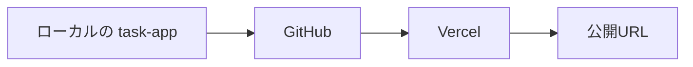
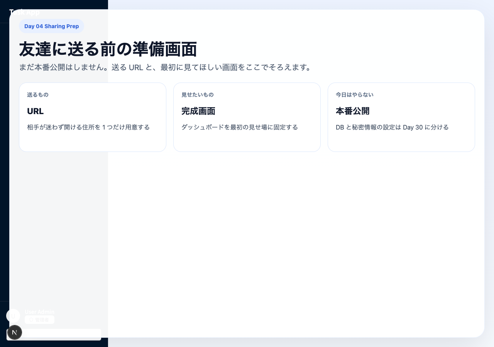
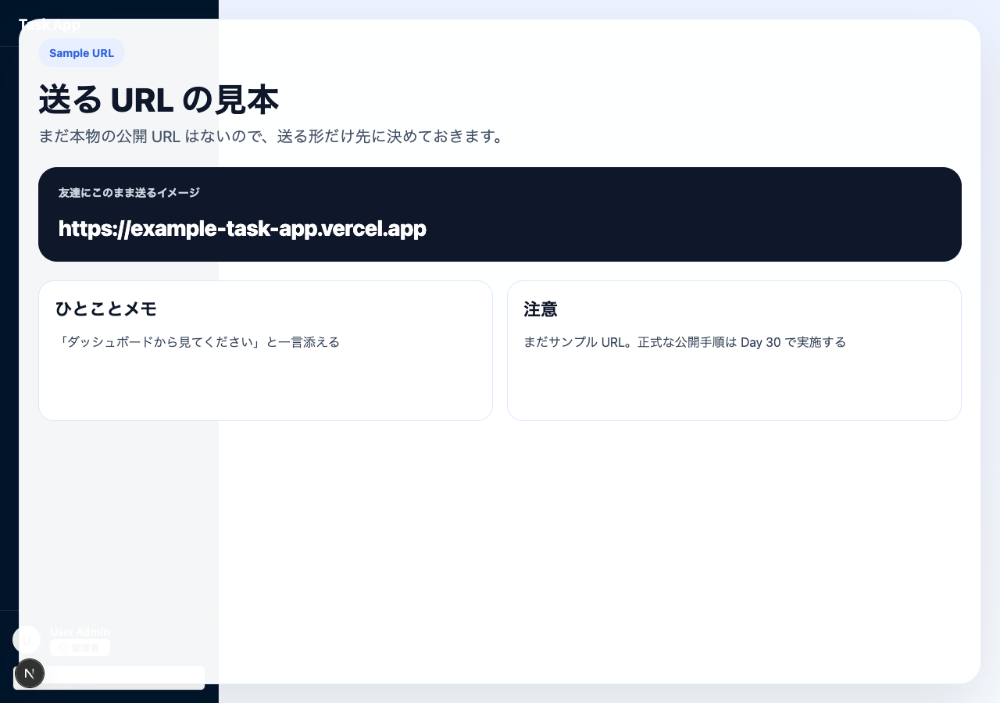
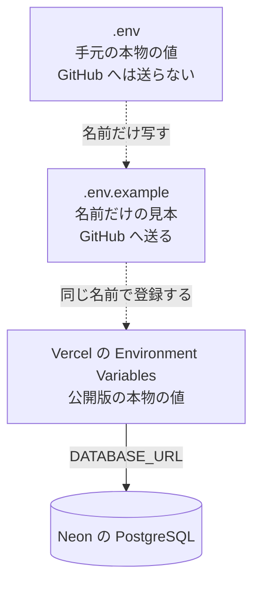
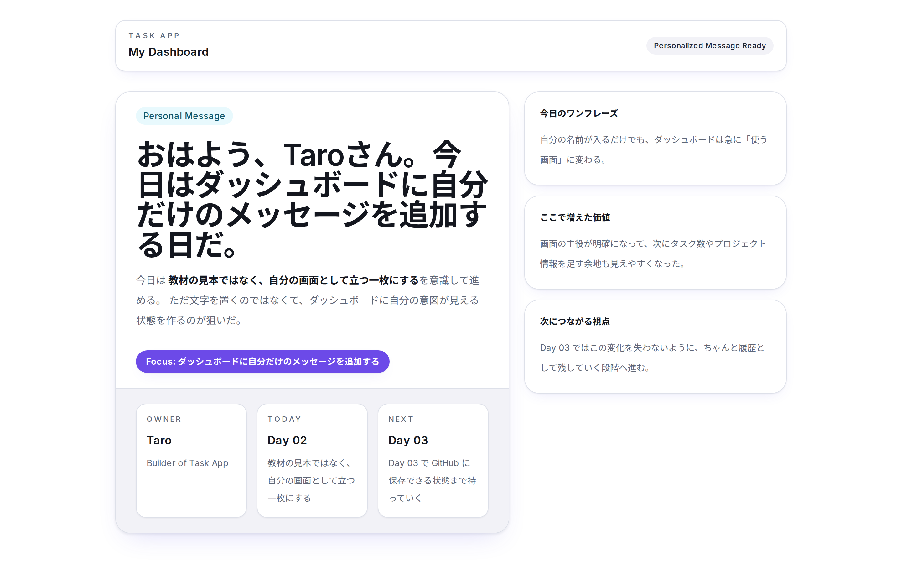

# Day 04: ネットに公開

Day 01 で土台を立ち上げ、Day 02 でダッシュボードに自分の情報を表示し、Day 03 で GitHub に保存しました。

今日は、このアプリを Vercel（作ったアプリをインターネット上に公開できるホスティングサービスです。読み方: ヴァーセル）を使ってインターネット上に公開します。公開して URL が発行されると、自分のパソコン以外からもアプリを開けるようになります。スマホやほかの人のブラウザからもアクセスでき、いま作っているものを実際に見せられる状態になります。

Phase 1（環境構築・即公開）の最終日は、新しい機能を追加する日ではありません。すでに作ったアプリを、誰でもアクセスできる状態にすることが今日のゴールです。Vercel での公開手順を、順を追って進めます。


```mermaid
flowchart LR
  A[ローカルの task-app] --> B[GitHub]
  B --> C[Vercel]
  C --> D[公開URL]
```

この図の矢印は、今日1日で通る道すじです。左端の手元のコードから右端の公開 URL まで、途中に GitHub と Vercel が1つずつ挟まります。見てほしいのは、Vercel がコードを取りに行く先が自分のパソコンではなく GitHub だという点です。手元でどれだけ直しても、GitHub へ送っていない変更は公開されたアプリに出てきません。Day 03 で push を覚えたのは、今日この矢印をつなぐためでした。

## 前回の振り返り

Day 03 では、`task-app` を自分の GitHub リポジトリへ保存しました。`.env` は送らず、アプリを動かすのに必要なファイルだけを選んで `push` しています。今日はその GitHub リポジトリを Vercel につないで、インターネット上の URL で開ける状態にします。

---

## 今日のゴール（Phase 1 修了日）

Day 03 で GitHub へ保存した自分の `task-app` を Vercel につなぎ、実際の URL で公開します。デプロイ（作ったアプリを公開用のサーバーに置いて、誰でも使える状態にすること）のボタンを押すだけで終わらせず、Project 設定画面で何を見ればよいかを判断し、公開後に別端末からも開けることを確かめるところまでやります。

Day 01 からここまで進めてきた作業が、今日の公開でひととおりつながります。Phase 1 の区切りとなる日です。


スクリーンショット: 公開の前に手元でそろえておくものをまとめた図です。GitHub への push、`npm run build` の成功、Vercel に渡す環境変数の3つが今日の準備物になります。


スクリーンショット: 公開すると `https://task-app-<自分のユーザー名>.vercel.app` の形で URL が発行されます。数字や記号が混じることもあります。この URL を今日の終わりに人へ送ります。

- [ ] Day 03 の完成状態から作業を再開する
- [ ] GitHub に `task-app` が push 済みであることを確認する
- [ ] ローカルで `npm run build` を実行し、公開前の確認をする
- [ ] Vercel アカウントを作成またはログインする
- [ ] GitHub リポジトリを Vercel に Import する
- [ ] 公開先から使う PostgreSQL を Neon（ブラウザだけで PostgreSQL を1つ用意できるサービス）で用意して、接続文字列を控える
- [ ] Project 設定で `DATABASE_URL` と `JWT_SECRET` を登録し、Production Deploy を実行する
- [ ] 発行された URL をブラウザで開き、表示を確認する
- [ ] シークレットウィンドウやスマホでも公開 URL を確認する
- [ ] URL を SNS や身近な人に共有して、G0（最初の公開という節目）を外へ出す

## なぜこれを作るのか

ここまでのアプリは `http://localhost:3000` でしか開けません。`localhost` は「このパソコン自身」を指す名前なので、同じ URL を人に送っても相手の画面には自分のアプリは出てきません。相手のパソコンの中を見に行ってしまうためです。

外から届くようにするには、自分のパソコン以外の場所にアプリを置く必要があります。それが今日やるデプロイです。Vercel を使うと、GitHub にあるコードを取ってきて、ビルドして、URL を1つ発行するところまでを自動でやってくれます。

そしてもう1つ、今日ここで公開しておく理由があります。**残りの26日ぶん、作った機能をその日のうちに人へ見せられるようになる**からです。30日目にまとめて公開する形だと、途中で詰まったときに「そもそも公開できるのか」という不安まで抱えることになります。先に道を通しておけば、あとは中身を育てるだけで済みます。

> **例え話**: `localhost` は自分の部屋の机です。デプロイは、その机の上のものを店先のショーケースへ移す作業にあたります。中身は同じでも、置く場所が変われば通りすがりの人にも見えます。

### 新しく学ぶ概念

| 概念 | 読み方 | 役割 | 例え |
|------|--------|------|------|
| Vercel | ヴァーセル | Next.js アプリを手軽に公開できるホスティングサービス | レンタルキッチン。作った料理をお客さんに出せる場所 |
| デプロイ | — | アプリをサーバーに配置して公開する操作 | 料理をお店のテーブルに出すこと |
| ビルド | — | ソースコードを本番用の形に変換する処理。`npm run build` で走る | 仕込みの総仕上げ。お客さんに出せる状態にする |
| 環境変数 | かんきょうへんすう | 接続先やパスワードを、コードの外から渡す仕組み | レシピに直接書かず、店の金庫に入れておく秘密の材料 |
| 接続文字列 | せつぞくもじれつ | データベースの場所とログイン情報を1本にまとめた文字列。`DATABASE_URL` に入れる | 住所と鍵をひとまとめにしたメモ |

## 前提（Day 03 完了していること）

今日は Day 03 の続きから進めます。新しいプロジェクトを作ったり、別の見本コードを取りに行ったりはしません。次の状態になっている前提で進めます。

- 手元に `task-app` ディレクトリがある
- `npm install` 済みで `npm run dev` が動く
- Day 02 で編集したダッシュボードがローカルに残っている
- Day 03 で GitHub に push した自分のリポジトリがある
- GitHub のブラウザ画面で `task-app` のファイル一覧を見られる

ここでいちばん大事なのは、
**今日は自分のリポジトリを、そのまま公開する**
ということです。

教材用の別の完成品を使うのではなく、Day 01 から Day 03 まで積み上げた自分の `task-app` を、そのまま Vercel に持っていきます。

> **今日はコードを1行も書きません。** 手を動かすのは、GitHub と Vercel をつなぐ操作と、公開先から使うデータベースを1つ用意する作業です。Vercel と、データベースを置く Neon の2つで、それぞれアカウントを作る場面があります。どちらも無料の枠から始められます。

## 今日の見どころ

URL は、ただの文字列に見えるかもしれません。ただ、自分で作ったアプリに URL が付くと、できることが広がります。

ローカルで開く `http://localhost:3000` は、自分のパソコンの中だけの入り口です。一方、Vercel で公開された URL は、ほかの端末からも開けます。

今日の終わりには、次のことができるようになります。

- 作っているアプリの URL を人に送る
- スマホで自分のアプリを開く
- SNS に公開したことを投稿する
- 明日以降の改善を、公開 URL をもとに考えられる

30日のカリキュラムのなかでも、作ったものを人へ見せられる最初の区切りです。

## 前日からの状態確認

まずは Day 03 の最後から、今日の流れへのつながりを確認します。Day 03 の締めでは、次のように予告していました。

> GitHub に保存できたら、次はこの履歴を使ってアプリをインターネットに公開します。Day 04 では Vercel につないで、自分の `task-app` を実際の URL で開ける状態にします。今日 GitHub に保存した内容が、そのまま公開の土台になります。

今日はこの続きに取り組みます。

GitHub に保存しただけでは、まだコードが置かれているだけの状態です。そこから Vercel につなぐことで、URL を開けばアプリが見える状態に変わります。この橋渡しを自分でできるようになるのが、Day 04 の目的です。

### いまの現在地

Day 03 完了時点では、次の状態になっているはずです。

- GitHub に `task-app` リポジトリがある
- `main` ブランチに Day 02 までのコードが入っている
- `README.md` がリポジトリの顔として見えている
- `.env` は送らず、公開していいファイルだけが保存されている

ここから今日やるのは、Vercel に GitHub リポジトリを読み込ませ、公開用のビルドを通し、発行された URL を確認するところまでです。

## 実装ステップ一覧

| ステップ | 作業内容 | 所要時間 |
|---------|---------|---------|
| Step 1 | GitHub 側の完成状態をもう一度確認する | 3分 |
| Step 2 | 公開前にローカルで `npm run build` を通す | 5分 |
| Step 3 | Vercel アカウントを作成する | 7分 |
| Step 4 | GitHub の `task-app` リポジトリを Import する | 5分 |
| Step 5 | Project 設定画面で見るべきポイントを絞る | 12分 |
| Step 6 | Production Deploy を実行する | 5分 |
| Step 7 | 発行された URL を開いて、最初の公開を体験する | 3分 |
| Step 8 | シークレットウィンドウと別端末で開く | 5分 |
| Step 9 | URL を SNS に貼ってみる | 3分 |
| Step 10 | デプロイ文脈で見る Pro パターン | 5分 |
| Step 11 | よくあるつまずきを初回公開の順番で切り分ける | 5分 |
| Step 12 | 今日やったことを、自分の言葉で説明できるようにする | 5分 |

**合計時間**: 約63分です。

長いのは Step 5 の12分で、ここに公開先から使う PostgreSQL を Neon で用意する作業が入ります。Step 3 の7分と Step 6 の5分にも、アカウント登録の確認メールとビルドの待ち時間が含まれます。すでに Vercel のアカウントを持っている場合は、Step 3 は1分ほどで終わります。

---


### Step 1: GitHub 側の完成状態をもう一度確認する（3分）

Vercel に持っていく前に、まずは Day 03 の終点が揃っているかを確認します。

デプロイの失敗は、Vercel だけが原因とは限りません。GitHub 側に送りきれていない、見たいブランチに変更が入っていないなど、出発点のズレで止まることも多いです。そのため、まずは公開前の現在地を確認します。

#### 実行コマンド

```bash
pwd
git status -sb
git branch --show-current
git remote -v
git log --oneline --decorate -3
```

この5つは、どれも状態を読むだけのコマンドです。ファイルやコミットを書き換えないので、途中でやめても手元は壊れません。確かめたいのは1点だけです。Vercel はこのあと手元のパソコンではなく GitHub を読みに行くため、両者の中身がそろっている必要があります。ここがずれたまま進むと、直したはずの表示が公開後も古いまま残ります。しかも原因を Vercel の設定側で探すことになり、初回公開でいちばん迷う形になります。

#### ここで見たいこと

- `pwd` が `task-app` のルートを指している
- `git status -sb` で大きな未保存差分が残っていない
- `git branch --show-current` が `main` になっている
- `git remote -v` で GitHub の `origin` が見えている
- `git log --oneline --decorate -3` に Day 03 までの履歴がある

#### GitHub のブラウザ画面でも確認する

ターミナルでの確認だけで終わらせず、GitHub のリポジトリページもブラウザで開きます。ここで次が見えていれば問題ありません。

- `README.md` が表示されている
- `src` ディレクトリがある
- `src/app/dashboard/page.tsx` が存在する
- 一番上に表示されているブランチが `main` になっている

GitHub 側で見えているものが、今日 Vercel が読み込む対象になります。

### Step 2: 公開前にローカルで `npm run build` を通す（5分）

ここは今日の大事な一手です。

Vercel が build してくれるので先にプッシュしてから確認すればよい、と思いがちですが、この進め方はあとで手間が増えやすいです。

Vercel の失敗ログも確認できますが、まずローカルで `npm run build` が通るかを確認しておくと、公開前にエラーを切り分けやすくなります。公開前にローカルで一度ビルドを通す習慣をつけておきます。

#### 実行コマンド

```bash
npm run build
```

このコマンドは、Day 01 から使ってきた `npm run dev` とは別の道を通ります。`dev` は書き換えるたびに画面へ反映する速さを優先するので、型のずれが少し残っていても、そのページを開くまでは動き続けます。`build` は本番用の完成品を1回だけ作る処理で、途中で全ファイルの型をまとめて確認します。だから、まだ開いていないページに残った型のずれもここで止まります。そして Vercel が公開のときに走らせるのも、この同じ `build` です。手元で通ることを先に確かめておけば、Vercel で同じ場所につまずく可能性をあらかじめ減らせます。

`build` が見てくれるのは型までです。使っていない変数が残っていても、型としては正しいので `build` は止まりません。そちらを見つけるのは `npm run lint` の役目なので、消し忘れが気になったら別で走らせてください。

#### 期待する結果

環境差はあるけど、
だいたい次のような流れになればよいです。

なお `npm run build` は、その中で `prisma generate` も実行します。
そのため `▲ Next.js` の行より先に Prisma の行が数行流れます。
`Generated Prisma Client` という行が出ていれば、そこは正常です。
ページ数の `(6/6)` の部分は、その時点のページ数によって変わります。ここまでの3日ぶんを素直に進めた状態なら、この数字になります。

```text
   ▲ Next.js 15.5.21
   - Environments: .env

   Creating an optimized production build ...
 ✓ Compiled successfully in 13.2s
   Linting and checking validity of types ...
   Collecting page data ...
 ✓ Generating static pages (6/6)
   Finalizing page optimization ...
   Collecting build traces ...
```

最後まで止まらず完走すれば、
今日の公開にかなり自信を持って進めます。

この行が順に流れるのは、build が決まった順番で進むからです。ページ数や秒数は手元の状態で変わります。ソースの変換、型の確認、ページごとの下ごしらえ、最後に最適化、という並びになっています。だから途中で止まったときは、最後に出た行の名前がそのまま調べる場所を教えてくれます。`Linting and checking validity of types` の行で止まれば、まず型の書き間違いを疑います。`Generating static pages` まで進んでいたなら、型ではなくページ側の処理でエラーが起きています。

#### もしここで止まったら

落ち着いて、
まずローカルの build エラーを直しましょう。

赤い文字がたくさん出ても、全部を読む必要はありません。見るのは次の3つです。

- 最初に出た赤い行。あとに続くエラーは、その巻き添えで出ていることが多い
- `Error:` や `Type error:` のあとに書かれている内容
- `./src/...` のようなファイル名と、その横に付いている行番号

なぜ最初の1行を優先するかというと、build は途中で1か所つまずくと、その先の処理も連鎖で止まるからです。だから下の方のエラーを追いかけるより、一番上のエラーを直す方が早いです。ファイル名と行番号が分かれば、直す場所は「どのファイルの何行目か」まで絞れます。まずはそのファイルのその行を開いて、直前に自分が変えたところと見比べます。多くは書き間違いや消し忘れが原因です。

この時点なら、
Vercel の設定が悪いのか、
コード自体が build できていないのか、
原因の切り分けがとてもやりやすいです。

逆にここを飛ばすと、
Vercel 側の UI とログを見ながら原因を探すことになって、
初回公開ではかなり迷いやすいです。

今日は最速でボタンを押す練習ではなくて、
**公開までの流れを自分で再現できるようになる**
のが狙いです。

### Step 3: Vercel アカウントを作成する（7分）

GitHub 側の土台とローカル build が確認できたら、
次は公開先の Vercel に入ります。

Vercel は、
Next.js とかなり相性がいい公開基盤です。
今回の `task-app` みたいな App Router 構成でも、
初回の導線がかなり分かりやすいです。

#### やること

1. ブラウザで `https://vercel.com` を開く
2. `Sign Up` か `Continue with GitHub` を選ぶ
3. GitHub アカウントと連携してログインする

#### ここで GitHub 連携を選ぶ理由

今日は Day 03 の続きで、
**GitHub にある自分のリポジトリをそのまま公開**
したいからです。

GitHub 連携にしておくと、
Vercel 側でリポジトリ選択がかなり素直になります。
あとで更新を push したときも、
再デプロイの流れがつながりやすいです。

#### 初回ログインで見かけやすい画面

初回だと、
次のどれかが出ることが多いです。

- `Import Git Repository`
- `Add New...`
- `Continue with GitHub`
- GitHub 連携の権限確認画面

文言は少し違ってもよいです。
大事なのは、
**自分の GitHub リポジトリ一覧が見える入口まで進む**
ことです。

#### 期待する結果

- Vercel にログインできている
- リポジトリ一覧に `task-app` が見えている

### Step 4: GitHub の `task-app` リポジトリを Import する（5分）

ログインできたら、
Vercel に Day 03 で作った GitHub リポジトリを読み込ませます。

ここで選ぶのは、
**自分の `task-app`** です。

#### 進め方

1. Vercel のダッシュボードで `Add New...` を押す
2. `Project` を選ぶ
3. GitHub リポジトリ一覧から `task-app` を探す
4. 見つかったら `Import` を押す

#### リポジトリが見つからないとき

だいたい次のどちらかです。

- GitHub 連携の権限がまだ足りていない
- Vercel にリポジトリアクセスを許可していない

この場合は、リポジトリ一覧の近くにある `Adjust GitHub App Permissions`（環境によっては `Configure GitHub App`）を押します。GitHub の設定画面が開きます。`Repository access` の項目で `All repositories` を選ぶか、`Only select repositories` から `task-app` を選んで保存します。Vercel の画面に戻ると、一覧に `task-app` が出てきます。

ここでコードを直す必要はありません。Vercel から見えないのは、多くの場合「どのリポジトリを見てよいか」という許可がまだ渡っていないだけだからです。直す場所も、コードではなく GitHub 連携の許可範囲になります。

初回でここに数分かかるのは普通です。
焦らなくてよいです。

#### ここで意識してほしいこと

Import するのは、
今日のために新しく用意した何かではなくて、
Day 01 から積み上げてきた自分のリポジトリです。

この感覚があると、
「公開は別工程」ではなくて、
「作ってきたものの自然な続き」
として理解しやすくなります。

#### 期待する結果

- `task-app` の行で `Import` を押せて、Project 設定画面に進めている

### Step 5: Project 設定画面で見るべきポイントを絞る（12分）

`Import` を押すと、
Project 設定画面に進みます。

ここで項目がいろいろ出てくると、
初回はちょっと身構えるかもしれません。
でも Day 04 で全部を理解し切る必要はありません。

今日まず見るべきポイントは、
かなり絞れます。

#### まず見る場所

- Project Name
- Framework Preset
- Root Directory
- Build and Output Settings
- Environment Variables

#### 今日の `task-app` での基本判断

- Project Name: `task-app` か、被りを避けたいなら少し変えても OK
- Framework Preset: `Next.js`
- Root Directory: リポジトリのルート
- Build Command: デフォルトのままで問題ないことが多い
- Output Directory: デフォルトのままで問題ないことが多い
- Environment Variables: 今日は `DATABASE_URL` と `JWT_SECRET` の2つだけ設定する

#### Environment Variables には2つだけ設定する

Day 04 のスコープは、
**まず自分のアプリを公開 URL で見られるようにする**
ところです。

ただし、`DATABASE_URL` と `JWT_SECRET` の2つは今日必要です。
配布コードは起動時に環境変数を検証する作りになっていて、
`DATABASE_URL`（有効な URL 形式）と `JWT_SECRET`（32文字以上）が
無いとエラーを出して止まります。
Vercel 上でも同じ検証が走るため、
空のままではデプロイしたアプリが起動しません。

新語の表で「環境変数＝店の裏の金庫」と例えました。今日はその金庫に、鍵を2本だけ入れます。それ以外の値は、本番公開を仕上げる Day 30 で扱います。


```mermaid
flowchart TB
    ENV[".env<br/>手元の本物の値<br/>GitHub へは送らない"]
    EX[".env.example<br/>名前だけの見本<br/>GitHub へ送る"]
    VER["Vercel の Environment Variables<br/>公開版の本物の値"]
    NEON[("Neon の PostgreSQL")]
    ENV -.->|"名前だけ写す"| EX
    EX -.->|"同じ名前で登録する"| VER
    VER -->|"DATABASE_URL"| NEON
```

同じ名前の設定値が3か所に分かれて置かれます。本物の値が入るのは `.env` と Vercel の2か所だけで、GitHub に載るのは名前だけの見本です。実線は値が実際に使われる向き、点線は名前をそろえる作業を表します。

#### JWT_SECRET を用意する

手元のターミナルで、次のコマンドを実行します。

**ターミナル（どこでもOK）**

```bash
openssl rand -base64 48
```

長いランダムな文字列が1行表示されます。
これが JWT（ログイン状態の証明に使う署名付きデータ）の
署名用シークレットになります。
表示された文字列をコピーして、Environment Variables の欄に
Key を `JWT_SECRET`、Value をその文字列として追加します。

#### DATABASE_URL を用意する

Vercel から接続できる PostgreSQL が1つ必要です。
無料枠のあるサービスに [Neon](https://neon.tech) や
[Supabase](https://supabase.com)（PostgreSQL を無料枠から使えるクラウドサービス）があります。
どちらかでアカウントを作ってデータベースを1つ作成すると、
`postgresql://` で始まる接続文字列
（ホスト名やパスワードをまとめた1行の接続情報）が発行されます。
それを Key `DATABASE_URL` の Value として追加します。

ここでは Neon を例に、実際の手順を書きます。

1. `https://neon.tech` を開き、`Sign up` から GitHub アカウントで登録する
2. 登録後の画面で `Create project` を押す
3. プロジェクト名はそのままでよいので、`Create` を押す
4. 作成直後に出る `Connection string` の欄で、`postgresql://` で始まる1行をコピーする
   （欄が見当たらないときは、左メニューの `Dashboard` から `Connect` を押す）
5. コピーした1行を、Vercel の Environment Variables に Key `DATABASE_URL` として追加する

画面の見た目はサービスの更新で変わります。ボタンの名前が違っていても、
やることは「プロジェクトを作る」「接続文字列をコピーする」の2つだけです。
Supabase を使う場合も、この2つに当たる操作を探してください。

本番データベースの本格的な運用（テーブル作成やデータ投入）は、
後日の Day で扱います。
今日は「起動時の検証を通すための接続先」が1つあれば十分です。

#### 初回に迷いがちなところ

#### Project Name

公開 URL にはこの名前がよく入ります。
たとえば `task-app-kouiso` なら、
それに近い URL が発行されやすいです。

SNS に貼ることを考えると、
短くて分かりやすい名前はけっこう効きます。

#### Framework Preset

Next.js のプロジェクトなので、
ここは `Next.js` が選ばれていれば大丈夫です。

Vercel はこの選択を見て、どの build コマンドを走らせ、どのフォルダを公開用に配るかを決めます。`Other` のまま進むと Next.js 用の手順が使われず、build は成功したのに開いた URL が真っ白、という結果になりがちです。設定を1つ取り違えただけなのに画面には何も出ないため、原因にたどり着くまで時間がかかります。Import した直後に一度だけ見ておく価値があります。

#### Root Directory

今日の教材では、
リポジトリ直下にアプリがある想定です。
サブディレクトリ構成ではないので、
ルートのまま進めます。

#### 期待する結果

- Framework Preset が `Next.js` になっている
- Environment Variables に `DATABASE_URL` と `JWT_SECRET` の2つが入っている

### Step 6: Production Deploy を実行する（5分）

設定が確認できたら、
いよいよ公開です。

`Deploy` を押します。
この瞬間に Vercel が、
GitHub からコードを取得して、
build して、
公開 URL を用意し始めます。

#### ここで起きていること

画面の向こうでは、
ざっくり次の流れが走っています。

1. GitHub から `task-app` のコードを読む
2. 依存関係をインストールする
3. `npm run build` 相当の build を走らせる
4. 生成物を公開用に配置する
5. URL を発行する

つまり Day 03 で GitHub に保存した履歴が、
今日 Vercel に読まれて、
Day 04 の公開につながっています。

このつながりが見えたら、
GitHub と Vercel の役割も整理しやすいです。

#### 待っている間に見るべきところ

デプロイ中は、
進捗ログがよく流れます。

ここで見ておきたいのは次の3つです。

- Install が進んでいるか
- Build が通っているか
- 最後に `Ready` っぽい表示が出るか

#### 成功のイメージ

文言は多少違っても、
だいたいこういう雰囲気です。

```text
Building
Deploying
Ready
```

この `Ready` が見えたら、
今日の最初の公開は成功にかなり近いです。

3つの語は、Vercel が内部で進めている工程の見出しです。`Building` の間は、コードを本番用に変換しています。`Deploying` へ変わると、出来上がったものを世界中の配信サーバーへ配り始めます。`Ready` はその配布が終わった合図です。ここまで来て初めて、URL を開いたときに中身が返ってきます。赤い文字で `Building` のまま止まったときは、まだ1台にも配られていません。作りかけのアプリが外から見える状態になることはないので、落ち着いてログを読んで大丈夫です。

### Step 7: 発行された URL を開いて、最初の公開を体験する（3分）

デプロイ完了後、
Vercel が Production URL を表示してくれます。

たとえば次のような形です。

```text
https://task-app-kouiso.vercel.app
```

実際の URL は人によって違います。
でもこの形式に近いものが出たら、
それが今日の成果物です。

`.vercel.app` の手前にある部分は、Step 5 で決めた Project Name から作られます。名前に本名や勤務先の呼び名を入れると、それが URL の一部として誰の目にも触れます。そして、この URL はアカウントを持たない人でも開けます。いまの `task-app` にログイン画面はまだなく、認証を足すのは Day 05 からです。つまり今日の時点では、画面に出ているものは全部見られる前提で扱います。

#### まずはブラウザで開く

表示された URL をクリックして、
自分のアプリを開きましょう。

ここで見えた瞬間、
かなりテンション上がるはずです。

さっきまで `localhost` という自分のパソコンの中だけの画面だったものが、いまは公開された URL に置かれています。外の誰からも開ける場所に移りました。見た目は同じでも、届く範囲がまるで変わっています。

#### 確認ポイント

- ページがエラーにならず表示される
- Day 01 から積み上げた見た目が見える
- Day 02 で作った自分用メッセージが見える
- GitHub 上の最新状態とズレていない

【スクリーンショット】ローカル本番モードで開いたダッシュボード（デプロイ前の予行演習の例）


デプロイの前に手元で `npm run build` を実行してから `npm start` で立ち上げると、ビルド済みのアプリを本番と同じモードで動かせます。`npm run dev` が開発中の確認用なのに対して、`npm start` は「ビルドが通るか、ビルド後も動くか」を先に確かめる予行演習です。ここで動けば、Vercel 上のビルドエラーの多くを事前に潰せます。

ただし、これで確認できるのはビルドが通ることまでです。Vercel 側の設定・環境変数・外から届くかどうかは、ローカルでは何も証明されません。今日のゴールは「ネットに公開」なので、完了の判定は必ず実際の公開 URL で行います。とくに、自分のパソコンと同じ Wi-Fi ではない回線（スマホのモバイル回線など）から URL を開けたら、本当に公開できた証拠になります。次の Step 8 でそれを確かめます。

上のキャプチャは予行演習（ローカル本番モード）で `/dashboard` を開いた例です。だからキャプションも「公開 URL の画面」ではなく「ローカル本番モードの画面」と書いてあります。

#### 最初に見てほしい感覚

この瞬間は、
細かいデザイン反省より先に、
まずひとつ受け取ってください。

**自分のアプリに、外から入れる URL が付いた**

これが Day 04 のど真ん中です。

### Step 8: シークレットウィンドウと別端末で開く（5分）

公開 URL をブラウザで1回見て終わり、
にしないのが大事です。

本当に公開されているなら、
別セッションや別端末でも見えるはずです。

#### まずやること

1. シークレットウィンドウを開く
2. さっきの Vercel URL を貼る
3. 同じ画面が見えるか確認する

#### 次にやること

1. スマホを手元に出す
2. スマホの Wi-Fi をいったん切って、モバイル回線にする（自宅ネットワークの外から開くため）
3. URL を自分に送る
4. スマホのブラウザで開く

#### ここで見ておきたいこと

- ちゃんと読み込めるか
- 画面が極端に崩れていないか
- 自分以外の環境でも URL が生きているか

PC のいつものブラウザで見えるだけだと、
ログイン状態やキャッシュに助けられている可能性もあります。
だから、
シークレットウィンドウとスマホ確認は
初回公開でかなり価値が高いです。

この2つは、証明している中身が違います。シークレットウィンドウで分かるのは、保存済みのログイン情報やキャッシュ（一度読んだデータを手元に貯めておく仕組み）に頼らず表示できることです。モバイル回線のスマホで分かるのは、自宅のネットワークの外からでも届くことです。前者だけでは、同じ回線の中でしか見えない状態と区別が付きません。両方そろって、ようやく他人の環境でも開けると言い切れます。

#### スマホで開けたときの意味

ここでようやく、
「自分の生活圏の中で実際に使えるもの」
に一段近づきます。

朝スマホで見てもよいし、
誰かにその場で見せてもよいです。
この実感は、
ローカルだけではなかなか出にくいです。

### 公開 URL を共有する前に知っておくこと

Step 8 で確認したとおり、この URL は自分以外の端末からも開けます。言いかえると、URL を知っている人なら誰でもアプリを開けるということです。今の `task-app` にはログイン機能がまだありません。認証は Day 05 から作ります。そのため、いまの公開 URL は認証なしの完全公開状態です。

広く共有する前に、次の3点を確認しておきます。

#### 画面に個人情報を出さない

Day 02 でダッシュボードに表示した名前やメッセージは、公開 URL でもそのまま見えます。実名や住所、電話番号など、他人に見られたくない情報は画面へ出さないでおきます。表示名はニックネームなど、公開してよいものに変えておくと安全です。

#### 本物のシークレットは GitHub に置かない

Day 03 では `.gitignore` と `.env.example` の役割を確認しました。本物の値はリポジトリに送らず、見本だけを共有するという線引きです。API（プログラム同士が機能やデータをやり取りするための窓口）のキーやデータベース接続情報のようなシークレットを、GitHub には含めません。こうした値は公開せず、Vercel の Environment Variables に直接登録します。今日設定した `DATABASE_URL` と `JWT_SECRET` も、この考え方で GitHub ではなく Vercel 側に置いています。残りの本番設定は、本番公開を仕上げる Day 30 で扱います。なお `NEXT_PUBLIC_` で始まる環境変数はブラウザにも渡ります。秘密の値には使いません。

#### 非公開に戻す方法があることを知っておく

一度公開しても、あとから取り消せます。Vercel の Project 設定から Deployment や Project 自体を削除すれば、その URL は開けなくなります。「一度出したら戻せない」わけではありません。まず小さく公開して、必要なら範囲を狭めれば問題ありません。

公開 URL は `*.vercel.app` という形で、検索エンジンにも見つかる可能性があります。だからこそ、共有する前に、この画面が誰に見られても大丈夫かを一度だけ確かめておきます。

### Step 9: URL を SNS に貼ってみる（3分）

ここが今日のいちばんの見どころです。

せっかく公開 URL が出たのに、
自分の中だけで閉じてしまうのはもったいないです。

公開範囲は自分で決めてよいです。
大きく出したくなければ、
身近な友だちや家族に送るだけでも十分です。

でももし出せそうなら、
今日はぜひ URL を SNS に貼ってみてください。

#### 共有文のたたき台

```text
Day 04 で自分の task-app を初公開できた。
まだ土台だけど、URL を持てたのがうれしい。
次は Day 05 からログインまわりに入っていく。
https://your-task-app.vercel.app
```

ここに貼る URL は、必ず Step 8 で別回線から開けたものを使います。手元のブラウザでしか試していないアドレスを送ると、相手の画面では開けない、ということが起こります。文面のほうは、うまく書こうとしなくて大丈夫です。読む人が知りたいのは完成度ではなく、いま何を作っているのかという1点だからです。

#### 書くときのコツ

- 完成品みたいに見せすぎなくてよい
- 「今日ここまで来た」が伝われば十分
- Day 01 から積み上げてきた流れを一言添えると良い

#### なぜここを勧めるのか

公開って、
出した瞬間に初めて現実感が出るものです。

SNS や人に見せることで、
「次に何を良くしたいか」も見えてきます。
Day 05 以降のモチベーションにもかなり効きます。

G0 の節目として、
ここは素直に味わってよいです。

#### ここで確認したいこと

公開 URL を、自分以外の誰かが開ける場所に1回出せていれば十分です。SNS でも、知人への共有でもかまいません。

### Step 10: デプロイ文脈で見る Pro パターン（5分）

#### Pro パターンで書こう（build を通してから公開する）

ここまでで、Vercel に公開する流れはつかめました。ただし公開前の順番の組み方には、まだ差の出るところが残っています。なぜその順番にするのかを、Before/After で見比べます。

#### Before（動くかどうかを Vercel 任せにする）

```bash
# ローカルでの確認を飛ばして、そのまま Vercel に Import する
# うまくいくかはデプロイ結果を見てから考える
```

**この進め方の問題点**:

- build 失敗の原因が、コードの問題なのか Vercel 設定の問題なのか切り分けにくい
- デプロイの待ち時間ごとに確認コストが発生して、初回公開ほど迷いやすい
- 「公開前に自分で品質を確かめる」流れが身につきにくい

#### After（ローカル build を通してから公開する）

```bash
npm run build
# 通ったことを確認してから Vercel に Import / Deploy する
```

**この進め方の強み**:

- コード側の build 問題を先に潰せるので、Vercel 側では設定確認に集中しやすい
- 失敗時の原因切り分けが早くなって、公開フロー全体の再現性が上がる
- 「公開前に一呼吸置く」習慣がつくので、今後の本番デプロイでも崩れにくい

#### 覚えておきたいエッセンス

デプロイは
「押してから祈る」より、
**ローカル build を通してから公開する**
ほうが強いです。

ネットに公開するほど、
事前確認の一手があとで効いてきます。

#### ここで確認したいこと

「公開の前にローカルで `npm run build` を通す」という流れを、自分の言葉で説明できれば十分です。

### Step 11: よくあるつまずきを初回公開の順番で切り分ける（5分）

Vercel 初回公開は、
詰まると全部が難しく見えやすいです。
でも実際は、
だいたい次のどこかで止まっていることが多いです。

- GitHub 側の状態
- ローカル build
- Vercel 連携権限
- Project 設定
- 公開後の確認

ここでは、
今日の流れに沿って見直し順を置いておきます。

#### `task-app` リポジトリが Vercel に出てこない

まず見るのは GitHub 連携権限です。

- Vercel に GitHub 連携が通っているか
- 対象リポジトリへのアクセスが許可されているか
- ブラウザで GitHub 側のリポジトリがちゃんと見えているか

リポジトリ自体が GitHub に見えていなければ、
Vercel 側でも見えません。
だから出発点から順に戻るのが早いです。

#### Deploy が build エラーで止まる

まずローカルでこれをやります。

```bash
npm run build
```

ここで同じエラーが出て止まるなら、
原因はコード側の可能性が高いです。

逆にローカル build は通るのに Vercel で止まるなら、
設定や環境差分を疑いやすいです。

#### 公開 URL は出たのに画面が思ったのと違う

次を確認しましょう。

- GitHub の `main` に最新コードが入っているか
- Vercel が読んでいるブランチが意図どおりか
- デプロイ日時が最新か

初回は、
「見ているコードのバージョンがズレている」
だけのことも多いです。

#### PC では見えるのにスマホで崩れる

まずは焦らず、
どこまで崩れているかを観察しましょう。

- 文字が切れているか
- 横スクロールが出ているか
- そもそも読み込みエラーなのか

Day 04 は深いレイアウト修正の回ではないけど、
「公開したら別端末でも見る」
という姿勢はここで入れておく価値があります。

#### 共有するのがちょっと怖い

それは普通です。
初公開は誰でも少し身構えます。

でも今日は、
細部まで作り込んだ完成版を出す日ではありません。
**Day 04 まで来た節目を外に出す日**
だと思ってよいです。

小さく共有してもよいし、
公開範囲を絞ってもよいです。
1回 URL を外に出す経験が、
次の伸びにつながります。

#### ここで確認したいこと

詰まったときに、GitHub 側の状態・ローカル build・Vercel 連携権限・Project 設定・公開後の確認のどこで止まっているかを、この順番で見直せれば十分です。

### Step 12: 今日やったことを、自分の言葉で説明できるようにする（5分）

操作としてはここまでで十分です。
でも理解としてもう一歩強くしたいなら、
次の4つを自分の言葉で説明できるとかなりよいです。

#### 1. GitHub と Vercel の役割は違う

GitHub はコード履歴の保存先です。
Vercel はそのコードを公開 URL に変える場所です。

Day 03 と Day 04 が分かれているのは、
この役割が違うからです。

#### 2. 公開の出発点は、自分のリポジトリだ

今日は見本コードを持っていったのではなくて、
Day 01 から積み上げた自分の `task-app` を公開しました。

ここが本当に大事です。

#### 3. `npm run build` は公開前の確認になる

build を先に通すと、
エラー原因の切り分けがかなり楽になります。
公開直前の一手として、今後もずっと使えます。

#### 4. 公開したら、別環境でも見る

自分のいつものブラウザだけで終わらせず、
シークレットウィンドウやスマホでも見ます。

これで初めて、
「本当に公開されている」
と自信を持ちやすくなります。

## 覚えておきたいエッセンス

Day 04 の本質は、
単に Vercel のボタンを押すことではありません。

**自分のアプリに、他人も開ける URL を持たせた**
ことです。

覚えておきたいのは、この5つです。

- Day 04 は Day 03 の GitHub 保存を、そのまま公開へ橋渡しする日
- 公開するのは教材の見本ではなく、Day 01 から積み上げた自分の `task-app`
- Vercel へ行く前に `npm run build` を通すと、公開フローがかなり安定する
- 公開 URL はブラウザ1回確認で終わらせず、シークレットウィンドウやスマホでも見る
- 最初の公開 URL は、遠慮せず SNS や身近な人に共有してよい

## 今日のチェックリスト

最後に、
この Day の完了条件を自分で確認しておきましょう。

- [ ] GitHub に `task-app` が push 済みであることを確認した
- [ ] `npm run build` が通った
- [ ] Vercel に GitHub 連携でログインできた
- [ ] `task-app` リポジトリを Import できた
- [ ] Project 設定を確認して Deploy できた
- [ ] 発行された URL をブラウザで開けた
- [ ] シークレットウィンドウかスマホでも URL を確認した
- [ ] URL を誰かに共有した、または共有文の下書きを作った

全部埋まったら、
Day 04 は完了です。

## Phase 1（環境構築・即公開）修了 ふりかえり

今日で Phase 1（環境構築・即公開）は終了です。

この4日でやったことを並べると、
かなりちゃんと積み上がっています。

### Day 01 でやったこと

- `task-app` の土台を立ち上げた
- Next.js アプリを最初の画面まで動かした
- design token を入れて、見た目の芯を整え始めた

### Day 02 でやったこと

- ダッシュボードに自分だけのメッセージを入れた
- ただの教材見本から、自分のプロダクトっぽさを出し始めた
- Server Component を基準にする考え方にも触れた

### Day 03 でやったこと

- GitHub にコードを保存した
- 履歴として積み上げられる状態を作った
- 次の公開に向かうための保存先を整えた

### Day 04 でやったこと

- Vercel でネット公開した
- 公開 URL を持った
- スマホや他人の環境からも開ける状態にした

### つまり G0 で手に入ったもの

G0 の4日間で、次に進むための土台がそろいました。

- 手元で動く
- 自分の名前やメッセージが表示される
- GitHub に保存されている
- URL で外から見られる

これって、
ただの「勉強した」より一段強いです。

**自分のプロダクトの最初の輪郭を、外に出せるところまで持ってきた**
ということです。

ここまで来たら、
Day 05 からの G1 Auth も、
「教材を消化する」ではなくて
「この公開済みアプリをもっと育てる」
感覚で進めやすくなります。

## つまずきポイント

| エラー / 問題 | 原因 | 解決方法 |
|--------------|------|---------|
| `npm run build` が `Type error:` で止まる | 型の書き間違いが、開いていないページに残っていた。`npm run dev` は開いたページしか確認しないので気付けない | 赤い行のうち**いちばん上**だけを読む。`Type error:` の後ろに理由、その下にファイル名と行番号が出る。そこを直して `npm run build` をやり直す |
| ページ数が教材の `(6/6)` と違う | 作ったページの数はその時点の状態で変わる | 数字は合っていなくてよい。`Collecting build traces` まで止まらずに進んでいれば成功 |
| Vercel の Import 画面に `task-app` が出てこない | Vercel の GitHub App に、そのリポジトリを見る権限を渡していない | `Adjust GitHub App Permissions` から `task-app` を選んで許可する。Private リポジトリの場合は特に起きやすい |
| Vercel の Deploy がビルドエラーで止まる | 手元で通っていないコードを送っている、または環境変数が足りない | まず Step 2 の `npm run build` が手元で通るか確かめる。通るなら、Environment Variables に `DATABASE_URL` と `JWT_SECRET` が入っているかを見る |
| 公開 URL の画面が、手元で直したはずの内容になっていない | GitHub へ push していない。Vercel はコードを手元ではなく GitHub から取りに行く | `git status` で未コミットの差分を確かめ、`git add` → `git commit` → `git push` まで進めてから、もう一度 Deploy する |
| 公開先だけビルドの結果が手元と違う | Node のバージョンが手元と公開先でそろっていない | Day 03 の Step 7 で `.node-version` を add したか確認する。送っていなければ add して push し直す |
| 公開 URL をスマホで開くと表示が崩れる | 画面幅の狭いときの指定が入っていない | 今日は直さなくてよい。崩れた場所をメモしておいて、以降の Day でレイアウトを作るときに直す |
| `DATABASE_URL` を GitHub に置いてしまった | 本物の値と見本の区別が付いていない | 本物は Vercel の Environment Variables にだけ置く。GitHub には `.env.example` の見本だけを送る。すでに送っていたら、Day 03 の Step 10 の手順で鍵を作り直す |

## 今日学んだ用語

| 用語 | 意味 |
|------|------|
| Vercel | Next.js アプリを GitHub から取ってきて公開してくれるホスティングサービス |
| デプロイ | アプリを公開用のサーバーに置いて、誰でも開ける状態にすること |
| ビルド | ソースコードを本番用の形に変換する処理。`npm run build` で走る |
| Production Deploy | 本番用として公開する Vercel の操作。ここで発行された URL が人へ送る URL になる |
| 環境変数 | 接続先やパスワードを、コードの外から渡す仕組み |
| 接続文字列 | データベースの場所とログイン情報を1本にまとめた文字列 |
| Neon | ブラウザだけで PostgreSQL を1つ用意できるサービス。今日は公開先から使う DB として使う |
| シークレットウィンドウ | ログイン状態やキャッシュを持たない状態でページを開くブラウザの機能 |

## 理解チェック

今日の作業を思い出しながら答えてみてください。答えは各問のすぐ下にあります。

**Q1. `npm run build` は `npm run dev` と何が違いますか。**

A. 確認する範囲が違います。`dev` は書き換えるたびに表示を作り直すので、開いていないページに残った型のずれは見つかりません。`build` は本番用の完成品を1回だけ作り、その途中で全ファイルの型をまとめて確認します。Vercel が公開時に走らせるのも、この `build` と同じ処理です。だから公開前に手元で通しておくと、失敗する場所を先に見つけられます。

**Q2. 手元のコードを直したあと、GitHub へ push せずに Vercel で再デプロイすると、公開 URL はどうなりますか。**

A. 直す前の内容のままです。Vercel がコードを取りに行く先は自分のパソコンではなく GitHub なので、push していない変更は公開されたアプリに出てきません。「公開先だけ古い」と感じたときは、まず `git status` で送り忘れを疑ってください。

**Q3. `DATABASE_URL` と `JWT_SECRET` を、GitHub ではなく Vercel の Environment Variables に登録するのはなぜですか。**

A. 本物の値をリポジトリに入れず、見本だけを共有するという Day 03 の線引きを、公開先でもそのまま守るためです。GitHub に置くと、リポジトリを見られる相手へ接続先ごと渡すことになります。Vercel の Environment Variables は公開されないので、本物はそちらだけに置きます。

## 次回予告

G0 の土台はここで完成です。
次からは G1 Auth に入ります。

Day 05 では、
ログイン UI の導入から始めます。

公開 URL を持った今の `task-app` に、
「誰が使うアプリなのか」
という入口を足していく段階です。

ここから先は、見た目だけではなく、
実際に使うための機能を作っていきます。

次はログイン画面をつくって、
このアプリにちゃんとした入口を用意します。

---

## 次に読むもの

- 前の日: [Day 03](./day03_GitHubに保存する.md)
- 次の日: [Day 05](./day05_ログイン画面のUI.md)
- 全体の地図: [学びのロードマップ](./00-1_学びのロードマップ.md)
- 目次: [カリキュラム目次](./00_カリキュラム目次.md)
- 詰まったとき: [トラブルシューティング](./appendix_トラブルシューティング.md)
- 言葉の意味: [用語集](./appendix_用語集.md)
