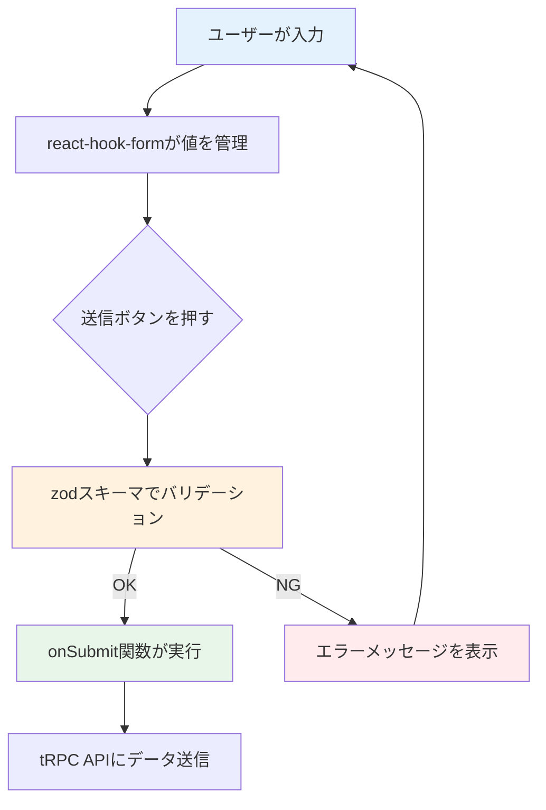
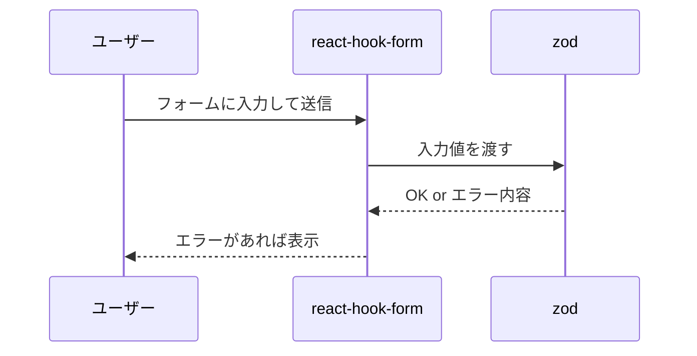
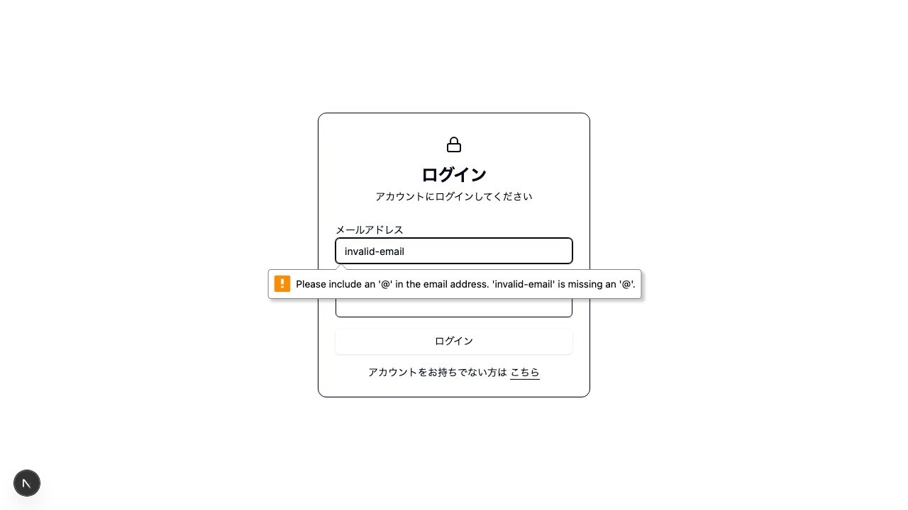

# Day 05: ログイン画面のUIを作ろう

## 前回の振り返り

Day 04 では Vercel を使ってアプリをインターネット上にデプロイし、誰でもアクセスできる状態にしました。アプリが公開できたので、今日からはアプリの機能を充実させていきます。まずはログイン画面の UI を作成します。

---

## 今日のゴール

react-hook-form と zod を使って、バリデーション付きのログイン画面を作ります。shadcn/ui（コピーして使えるUI部品集。読み方: シャドシーエヌ・ユーアイ）の Card コンポーネントで、プロフェッショナルなデザインに仕上げます。

スクリーンショット: 完成したログイン画面（メールアドレスとパスワードの入力欄がCardで囲まれた状態）


## 始める前の前提

- Day 04 までのアプリが起動できる
- `src/app/login/page.tsx` を編集できる
- `npm run dev` を実行してブラウザで確認できる
- ログイン処理の中身は Day 07 で扱うため、今日は画面とフォーム送信の流れに集中する

## なぜこれを作るのか

ログイン画面は、ほぼ全てのWebアプリに必要な「玄関」です。ここでは、フォームの入力管理とバリデーション（入力チェック）の基本を学びます。

> **例え話**: フォームの入力管理は、受付カウンターでの書類チェックに似ています。受付係が記入漏れを1つずつ確認するように、react-hook-form（リアクト・フック・フォーム）が値を管理し、zod（ゾッド）がバリデーションを担当します。

### フォーム管理の仕組み



### やること / やらないこと

| やること | やらないこと |
|---------|-------------|
| react-hook-form でフォーム管理 | useState（画面の状態を1つずつ覚えておく React の基本機能）で1つずつ状態管理 |
| zod でバリデーション定義 | 手動で if 文チェック |
| shadcn/ui で美しいUI | CSS をゼロから書く |
| tRPC でログインAPI呼び出し | 認証ロジックの実装詳細（Day 7で扱う） |

### 新しく学ぶ概念

| 概念 | 読み方 | 役割 | 例え |
|------|--------|------|------|
| react-hook-form | リアクト・フック・フォーム | フォームの入力値を一括管理 | 受付係。全書類の記入状況をまとめて把握する |
| zod | ゾッド | 入力値の形式チェック | 書式チェックリスト。「必須」「メール形式」のようにルールを定義 |
| zodResolver | ゾッド・リゾルバー | react-hook-form と zod をつなぐ | 受付係にチェックリストを渡す係。2つを連携させる |

> **今日のゴールライン**: 3つのライブラリが一度に出てくるけど、今日は「この形で書くと動く」を体験するのがゴール。なぜこう書くかは Day 06 で同じパターンをもう一回使うときに自然とわかってきます。

## 実装ステップ一覧

| ステップ | 作業内容 | 所要時間 |
|---------|---------|---------|
| Step 1 | ページの土台を作る | 3分 |
| Step 2 | zodスキーマを定義する | 5分 |
| Step 3 | react-hook-formを設定する | 7分 |
| Step 4 | メールアドレス入力欄を作る | 5分 |
| Step 5 | パスワード入力欄とボタンを作る | 5分 |
| Step 6 | Cardでデザインを整える | 7分 |
| Step 7 | tRPCでログインAPIを呼ぶ | 7分 |
| Step 8 | エラー・ローディング表示を追加 | 5分 |
| Step 9 | 登録リンクとSuspenseを追加 | 3分 |

**合計時間**: 約47分。

---

### 予備知識: zod と react-hook-form とは

Day 05 からは **フォーム**（入力欄＋送信ボタン）を作ります。フォームでは「ユーザーが正しい値を入力したか」を確認する**バリデーション**が欠かせません。ここでは、今日から何度も登場する 2 つのライブラリを先に紹介します。

| ライブラリ | ひとこと説明 | 例え |
|-----------|------------|------|
| **zod** | 「この入力は正しいか」をチェックするルール集 | 入場券の受付係——チケットの形式が合っていないと通さない |
| **react-hook-form** | フォームの入力値・エラーメッセージをまとめて管理する仕組み | 受付カウンター——チケットを受け取り、受付係（zod）に渡して結果を表示する |
| **@hookform/resolvers** | zod と react-hook-form をつなぐアダプタ | 受付係と受付カウンターをつなぐ内線電話 |

#### バリデーションの流れ



> 今は「こういうものがあるんだ」程度の理解で大丈夫です。Step 1 以降で実際にコードを書きながら、使い方を体験していきます。

---

### Step 1: ページの土台を作る（3分）

**ゴール**: ログインページの基本ファイルを作成します。

**実装**:

```typescript
// filepath: src/app/login/page.tsx
'use client';

// ログインフォームコンポーネント
function LoginForm() {
  return (
    <div className="flex min-h-screen
      items-center justify-center px-4">
      <div className="w-full max-w-sm">
        <h1 className="text-2xl font-bold">
          ログイン
        </h1>
      </div>
    </div>
  );
}

// ページ本体
export default function LoginPage() {
  return <LoginForm />;
}
```

> `'use client'` は「このファイルはブラウザ側で動く」という宣言です。フォームのようにユーザー操作を扱うページには必須です。

**確認ポイント**:
- `src/app/login/page.tsx` を保存した
- `npm run dev` でエラーが出ていない
- ブラウザで `/login` にアクセスして「ログイン」と表示される

---

### Step 2: zodバリデーションスキーマを定義する（5分）

**ゴール**: メールとパスワードのチェックルールを定義します。

> **例え話**: zod スキーマは「書類の書式チェックリスト」です。「メール欄は必須で、@マークを含む形式であること」「パスワード欄は1文字以上であること」といったルールを、コードで書きます。

**実装**:

`'use client';` の下に import 文を追加し、その下にスキーマを定義します。

```typescript
// filepath: src/app/login/page.tsx（'use client'の下に追加）
import { zodResolver } from '@hookform/resolvers/zod';
import { useForm } from 'react-hook-form';
import { z } from 'zod';

// バリデーションルールを定義
const loginSchema = z.object({
  email: z.string()
    .email('有効なメールアドレスを入力してください'),
  password: z.string()
    .min(1, 'パスワードを入力してください'),
});

// スキーマから型を自動生成
type LoginFormData = z.infer<typeof loginSchema>;
```

**確認ポイント**:
- import文を3行追加した
- `loginSchema` と `LoginFormData` を定義した
- `npm run dev` でエラーが出ていない

#### zodスキーマのコード解説

| コード | 意味 | 例え |
|--------|------|------|
| `z.object({})` | オブジェクト型のスキーマを作成 | 書類テンプレートを作る |
| `z.string()` | 文字列型であることをチェック | 「この欄は文字で書いてね」 |
| `.email()` | メール形式かチェック | 「@マークが入っているか」 |
| `.min(1)` | 1文字以上かチェック | 「空欄はダメだよ」 |
| `z.infer<typeof ...>` | スキーマからTypeScript型を自動生成 | チェックリストから入力用紙の型を作る |


---

### Step 3: react-hook-formを設定する（7分）

**ゴール**: useForm フックでフォーム管理を設定します。

> **例え話**: `useForm` は受付カウンターの係員を呼び出すコマンドです。「このチェックリスト（zodResolver）を使って、お客さんの書類をチェックしてね」と指示します。

**実装**:

LoginForm コンポーネントの中に追加します。

```typescript
// filepath: src/app/login/page.tsx
// LoginFormコンポーネント内の先頭に追加
const {
  register,     // 入力欄をフォームに登録する関数
  handleSubmit,  // 送信時のバリデーション実行関数
  formState: { errors }, // バリデーションエラー情報
} = useForm<LoginFormData>({
  resolver: zodResolver(loginSchema),
});

// フォーム送信時の処理（Step 7で書き換えます）
// ⚠️ 動作確認用の一時コードです。Step 7で必ず削除してください。
const onSubmit = async (
  data: LoginFormData
) => {
  console.log('送信データ:', data);
};
```

> **今日のゴールライン**: `useForm` は「この形で書くと動く」を覚えるだけで OK。なぜこう書くかは Day 06 で同じパターンをもう一回使うときに自然とわかってきます。

**確認ポイント**:
- `useForm` の設定を LoginForm 内に追加した
- `npm run dev` でエラーが出ていない
- `console.log` は動作確認後に残さず、Step 7で必ず削除する

#### useFormの返り値の解説

| 返り値 | 役割 | 例え |
|--------|------|------|
| `register` | input要素をフォームに登録 | 受付係が「この欄を管理するね」と担当する |
| `handleSubmit` | 送信時にバリデーションを実行 | 「全項目チェック完了」と確認してから処理 |
| `errors` | バリデーションエラーの情報 | 「この欄が間違ってるよ」という指摘メモ |
| `zodResolver` | zodスキーマをreact-hook-formに渡す | チェックリストを受付係に手渡す |


---

### Step 4: メールアドレス入力欄を作る（5分）

**ゴール**: register関数を使って、メール入力欄をフォームに登録します。

**実装**:

まず、UIコンポーネントの import を追加します。

```typescript
// filepath: src/app/login/page.tsx（import文に追加）
import { Input } from '@/component/ui/input';
import { Label } from '@/component/ui/label';
```

**確認ポイント**:
- `Input` と `Label` の import 文を追加した
- `npm run dev` でエラーが出ていない

LoginForm の return 内を以下に書き換えます。

```typescript
// filepath: src/app/login/page.tsx
// LoginFormのreturn部分
<form onSubmit={handleSubmit(onSubmit)}
  className="space-y-4">
  <div className="space-y-2">
    <Label htmlFor="email">
      メールアドレス
    </Label>
    <Input
      id="email"
      type="email"
      placeholder="your@email.com"
      autoComplete="email"
      autoFocus
      {...register('email')}
    />
    {errors.email && (
      <p className="text-sm text-destructive">
        {errors.email.message}
      </p>
    )}
  </div>
</form>
```

> `{...register('email')}` がポイントです。この1行で、入力欄の値の取得・更新・バリデーションがまとめて自動化されます。useState を使う場合に比べて、書くコードが減ります。

**確認ポイント**:
- `{...register('email')}` を Input に設定した
- ブラウザでメール入力欄が表示されている
- npm run dev でエラーが出ていない

スクリーンショット: メールアドレス欄の下にバリデーションエラーメッセージが赤字で表示されている状態。


---

### Step 5: パスワード入力欄とボタンを作る（5分）

**ゴール**: パスワード入力欄と送信ボタンを追加します。

**実装**:

Button の import を追加します。

```typescript
// filepath: src/app/login/page.tsx（import文に追加）
import { Button } from '@/component/ui/button';
```

メール入力欄の `</div>` の下に追加します。

```typescript
// filepath: src/app/login/page.tsx
// メール入力欄の下に追加
<div className="space-y-2">
  <Label htmlFor="password">
    パスワード
  </Label>
  <Input
    id="password"
    type="password"
    autoComplete="current-password"
    {...register('password')}
  />
  {errors.password && (
    <p className="text-sm text-destructive">
      {errors.password.message}
    </p>
  )}
</div>
<Button type="submit" className="w-full">
  ログイン
</Button>
```

**確認ポイント**:
- パスワード欄が表示されている
- ログインボタンをクリックできる
- 空で送信するとエラーメッセージが出る

---

### Step 6: Cardでデザインを整える（7分）

**ゴール**: shadcn/ui の Card でフォームを包み、プロフェッショナルなデザインにします。

**実装**:

まず、import文を追加します。

```typescript
// filepath: src/app/login/page.tsx
import {
  Card,
  CardContent,
  CardDescription,
  CardHeader,
  CardTitle,
} from '@/component/ui/card';
import { AlertCircle, Lock } from 'lucide-react';
import {
  Alert, AlertDescription, AlertTitle,
} from '@/component/ui/alert';
```

次に、LoginForm の return を書き換えます。

```typescript
// filepath: src/app/login/page.tsx
// LoginFormのreturn - 外枠とCardHeader部分
return (
  <div className="flex min-h-screen
    items-center justify-center px-4">
    <Card className="w-full max-w-sm">
      <CardHeader
        className="space-y-1 text-center">
        <div className="flex justify-center mb-2">
          <div className="rounded-full
            bg-gradient-to-r from-blue-500
            to-indigo-500 p-3 shadow-lg">
            <Lock className="h-6 w-6
              text-white" />
          </div>
        </div>
        <CardTitle className="text-2xl">
          ログイン
        </CardTitle>
        <CardDescription>
          アカウントにログインしてください
        </CardDescription>
      </CardHeader>
```

**確認ポイント**:
- Card/CardHeader の import を追加した
- `npm run dev` でエラーが出ていない

続いて、CardContentの開始とメールアドレス入力欄を追加します。

```typescript
// filepath: src/app/login/page.tsx
// CardContentとメールアドレス入力欄
      <CardContent>
        <form onSubmit={handleSubmit(onSubmit)}
          className="space-y-4">
          {/* メールアドレス入力欄 */}
          <div className="space-y-2">
            <Label htmlFor="email">
              メールアドレス
            </Label>
            <Input
              id="email"
              type="email"
              placeholder="your@email.com"
              autoComplete="email"
              autoFocus
              {...register('email')}
            />
            {errors.email && (
              <p className="text-sm text-destructive">
                {errors.email.message}
              </p>
            )}
          </div>
```

次に、パスワード入力欄を追加します。

```typescript
// filepath: src/app/login/page.tsx
// パスワード入力欄
          {/* パスワード入力欄 */}
          <div className="space-y-2">
            <Label htmlFor="password">
              パスワード
            </Label>
            <Input
              id="password"
              type="password"
              autoComplete="current-password"
              {...register('password')}
            />
            {errors.password && (
              <p className="text-sm text-destructive">
                {errors.password.message}
              </p>
            )}
          </div>
```

最後に、送信ボタンとCardの閉じタグを追加して完成させます。

```typescript
// filepath: src/app/login/page.tsx
// 送信ボタン・CardContent・Cardの閉じタグ
          {/* 送信ボタン */}
          <Button
            type="submit"
            className="w-full">
            ログイン
          </Button>
        </form>
      </CardContent>
    </Card>
  </div>
);
```

**確認ポイント**:
- カード型のデザインで表示されている
- 鍵アイコンが中央に表示されている
- 「アカウントにログインしてください」が表示される

スクリーンショット: Card コンポーネントで囲まれたログインフォームが画面中央に表示されている状態。


---

### Step 7: tRPCでログインAPIを呼ぶ（7分）

**ゴール**: ログインボタンを押したら、サーバーにデータを送信します。

**実装**:

import文を追加します。

```typescript
// filepath: src/app/login/page.tsx
import { api } from '@/trpc/react';
import {
  useRouter,
  useSearchParams,
} from 'next/navigation';
import { useState } from 'react';
// トースト通知ライブラリ（画面上部にメッセージを表示）
import toast from 'react-hot-toast';
```

**確認ポイント**:
- `api` / `useRouter` / `useSearchParams` / `useState` / `toast` の import を追加した
- `npm run dev` でエラーが出ていない

> `react-hot-toast` はログイン成功時に通知メッセージを表示するライブラリです。Day 01の初期セットアップでインストール済みなので、import するだけで使えます。
>
> `useSearchParams` を使うコンポーネントには `Suspense` ラッパーが必要です。Step 9で追加するので、このステップではエラーが出る場合があります。

まず、LoginForm の**外側**（コンポーネントの上）にセキュリティ関数を定義します。

```typescript
// filepath: src/app/login/page.tsx
// LoginFormの外側（モジュールスコープ）に定義
// Open Redirect対策: 相対パスのみを許可
function isValidRedirectUrl(
  url: string
): boolean {
  // URLが空ならfalseを返す
  if (!url) return false;
  // プロトコル相対URL（//example.com）を禁止
  if (url.startsWith('//')) return false;
  // 外部URLを禁止
  if (url.startsWith('http://')
    || url.startsWith('https://')) return false;
  // 相対パスのみを許可
  return url.startsWith('/');
}
```

**確認ポイント**:
- `isValidRedirectUrl` 関数を LoginForm コンポーネントの外側に定義した
- `npm run dev` でエラーが出ていない

> `isValidRedirectUrl` を LoginForm の外に置くのがポイントです。この関数はコンポーネントの状態に依存しないため、モジュールスコープ（ファイルの直下）に定義します。再レンダリング（画面の描き直し）のたびに関数が再生成されるのを防げます。

次に、LoginForm 内の先頭に以下を追加します。

```typescript
// filepath: src/app/login/page.tsx
// LoginFormコンポーネント内の先頭に追加
const router = useRouter();
const searchParams = useSearchParams();

// ログイン後の遷移先（未指定ならダッシュボード）
// nullish coalescing演算子(??)でnull/undefinedのみをフォールバック
const rawCallbackUrl =
  searchParams?.get('callbackUrl')
  ?? '/dashboard';
const callbackUrl =
  isValidRedirectUrl(rawCallbackUrl)
    ? rawCallbackUrl : '/dashboard';
// サーバーエラーの状態管理
const [error, setError] =
  useState<string | null>(null);
```

**確認ポイント**:
- `router`, `searchParams`, `callbackUrl`, `error` を LoginForm 内に追加した
- `npm run dev` でエラーが出ていない

tRPCのログインAPI呼び出しを定義します。

```typescript
// filepath: src/app/login/page.tsx
// tRPCのログインAPI呼び出し
const loginMutation =
  api.auth.login.useMutation({
    onSuccess: (data) => {
      toast.success(
        `おかえりなさい、${data.user.name}さん`
      );
      router.push(callbackUrl);
      router.refresh();
    },
    onError: (error) => {
      // エラーメッセージがなければデフォルト文言を使用
      setError(
        error.message
        ?? 'ログイン中にエラーが発生しました'
      );
    },
  });
```

**確認ポイント**:
- `loginMutation` を LoginForm 内に定義した
- `onSuccess` と `onError` のコールバックを設定した
- `npm run dev` でエラーが出ていない

onSubmit 関数を更新します。

```typescript
// filepath: src/app/login/page.tsx
// onSubmit関数を書き換え（asyncに変更）
const onSubmit = async (
  data: LoginFormData
) => {
  setError(null);
  loginMutation.mutate(data);
};
```

> `onSubmit` を `async` にしています。現時点では `await` は使っていませんが、今後の拡張（例：送信前のバリデーション API 呼び出し）に備えた設計です。

**確認ポイント**:
- `api` の import を追加した
- `loginMutation` を定義した
- `onSubmit` で `loginMutation.mutate` を呼んでいる

#### tRPC ミューテーションの解説

| コード | 意味 | 例え |
|--------|------|------|
| `useMutation` | データ変更系のAPI呼び出しを定義 | 郵便局の「送信」窓口を用意する |
| `.mutate(data)` | 実際にAPIを呼び出す | 書類を窓口に提出する |
| `onSuccess` | 成功時のコールバック | 「受理されました」の通知 |
| `onError` | 失敗時のコールバック | 「不備があります」の通知 |
| `isPending` | 通信中かどうか | 「処理中」ランプが点灯中 |


---

### Step 8: エラー・ローディング表示を追加（5分）

**ゴール**: サーバーエラーの表示と、通信中のローディング状態を追加します。

**実装**:

`<form>` 開始タグの直後、メールアドレス入力欄の前にエラー表示を追加します。

> `destructive` は shadcn/ui のテーマカラーで、エラーや警告を示す赤系の色を指します。

```typescript
// filepath: src/app/login/page.tsx
// <form>開始タグの直後に追加
{error && (
  <Alert variant="destructive">
    <AlertCircle className="h-4 w-4" />
    <AlertTitle>エラー</AlertTitle>
    <AlertDescription>
      {error}
    </AlertDescription>
  </Alert>
)}
```

送信ボタンをローディング対応に更新します。

```typescript
// filepath: src/app/login/page.tsx
// Buttonを以下に書き換え
<Button
  type="submit"
  className="w-full bg-gradient-to-r
    from-blue-600 to-indigo-600
    hover:from-blue-700
    hover:to-indigo-700 shadow-md"
  disabled={loginMutation.isPending}>
  {loginMutation.isPending
    ? 'ログイン中...'
    : 'ログイン'}
</Button>
```

> `disabled={loginMutation.isPending}` で、通信中はボタンを押せなくします。二重送信を防ぐための大切なテクニックです。

**確認ポイント**:
- 間違ったパスワードでエラーメッセージが出る
- 送信中はボタンが「ログイン中...」に変わる

---

### Step 9: 登録リンクとSuspenseを追加（3分）

**ゴール**: 新規登録ページへのリンクと、Suspense ラッパーを追加して完成させます。

**実装**:

import文を追加します。

```typescript
// filepath: src/app/login/page.tsx
import Link from 'next/link';
import { Suspense } from 'react';
```

**確認ポイント**:
- `Link` と `Suspense` の import を追加した
- `npm run dev` でエラーが出ていない

ボタンの下にリンクを追加します。

```typescript
// filepath: src/app/login/page.tsx
// Buttonの下に追加（新規登録ページへのリンク）
<div className="text-center text-sm
  text-muted-foreground">
  アカウントをお持ちでない方は{' '}
  <Link
    href="/register"
    className="text-blue-600 underline
      underline-offset-4
      hover:text-blue-800">
    こちら
  </Link>
</div>
```

**確認ポイント**:
- 「こちら」リンクがボタンの下に表示されている
- `npm run dev` でエラーが出ていない

最後に、LoginPage を Suspense でラップします。

```typescript
// filepath: src/app/login/page.tsx
// ページ本体を書き換え
export default function LoginPage() {
  return (
    <Suspense fallback={
      <div className="flex min-h-screen
        items-center justify-center">
        読み込み中...
      </div>
    }>
      <LoginForm />
    </Suspense>
  );
}
```

> `Suspense` は、`useSearchParams` を使うコンポーネントに必要なラッパーです。読み込み中に「読み込み中...」を表示してくれます。

**確認ポイント**:
- 「こちら」リンクが表示されている
- リンクをクリックすると `/register` に遷移する
- ページ全体がエラーなく表示される

スクリーンショット: 登録リンク付きの完成したログイン画面全体。


> **完成形の参考コード**: Step 1〜9 を全て適用した状態は、このリポジトリの `src/app/login/page.tsx` と同じです。手元のコードと見比べて確認してください。

---


---

### Pro パターンで書こう（ログインフォームは `as` で信じ切らず zod で受け止める）

ログインフォームは動きますが、今の書き方は `as` で「正しい入力のはず」と信じているだけで、値そのものは検査していません。プロの現場では、この境界に zod の検査を置きます。
なぜ上の書き方をするのか、**Before/After** で見比べてみましょう。

### Before（動くけど、プロは書かない）

```typescript
type LoginFormValues = {
  email: string;
  password: string;
};

type LoginValidationResult =
  | { ok: true; values: LoginFormValues }
  | { ok: false; errors: { email?: string; password?: string } };

function isEmail(value: string): boolean {
  return /^[^\s@]+@[^\s@]+\.[^\s@]+$/.test(value);
}

function validateLoginForm(values: LoginFormValues): LoginValidationResult {
  const email = values.email.trim();
  const password = values.password;
  const errors: { email?: string; password?: string } = {};

  if (!isEmail(email)) {
    errors.email = 'メールアドレス形式で入力してください';
  }

  if (password.length < 8) {
    errors.password = 'パスワードは8文字以上で入力してください';
```

**読み比べ用**: ここは写経しません。続けてコードを読み進めましょう。

```typescript
// filepath: 続き
  }

  if (errors.email || errors.password) {
    return { ok: false, errors };
  }

  return { ok: true, values: { email, password } };
}

export function readLoginForm(formData: FormData): LoginValidationResult {
  const values = Object.fromEntries(formData.entries()) as LoginFormValues;

  return validateLoginForm({
    email: typeof values.email === 'string' ? values.email : '',
    password: typeof values.password === 'string' ? values.password : '',
  });
}

const demoFormData = new FormData();
demoFormData.set('email', 'admin@example.com');
demoFormData.set('password', 'password123');

console.log(readLoginForm(demoFormData));
```

**このコードの問題点**:

- `as LoginFormValues` は「そういう型として扱う」と宣言しているだけで、入力値を検査しているわけではない
- バリデーションルールが関数内に散らばるので、フォーム項目が増えたときに見落としが起きやすい
- APIに渡す境界で何を保証したのかが、型定義（この形のデータしか入らないという取り決め）と実行時チェックで分かれて読みづらい

### After（プロが書くコード）

```typescript
import { z } from 'zod';

const loginSchema = z.object({
  email: z
    .preprocess(
      (value) => (typeof value === 'string' ? value.trim() : ''),
      z.string().refine(
        (value) => /^[^\s@]+@[^\s@]+\.[^\s@]+$/.test(value),
        'メールアドレス形式で入力してください',
      ),
    ),
  password: z.preprocess(
    (value) => (typeof value === 'string' ? value : ''),
    z.string().min(8, 'パスワードは8文字以上で入力してください'),
  ),
});

type LoginFormValues = z.infer<typeof loginSchema>;

type LoginValidationResult =
  | { ok: true; values: LoginFormValues }
  | { ok: false; errors: { email?: string; password?: string } };

export function readLoginForm(formData: FormData): LoginValidationResult {
```

**読み比べ用**: ここは写経しません。続けてコードを読み進めましょう。

```typescript
// filepath: 続き
  const result = loginSchema.safeParse(
    Object.fromEntries(formData.entries()),
  );

  if (!result.success) {
    const fieldErrors = result.error.flatten().fieldErrors;

    return {
      ok: false,
      errors: {
        email: fieldErrors.email?.[0],
        password: fieldErrors.password?.[0],
      },
    };
  }

  return { ok: true, values: result.data };
}

const demoFormData = new FormData();
demoFormData.set('email', 'admin@example.com');
demoFormData.set('password', 'password123');

console.log(readLoginForm(demoFormData));
```

**このコードの強み**:

- zodスキーマが「入力の形」と「検査ルール」を同じ場所で持つので、読み手が判断しやすい
- `z.infer` によって、バリデーション済みデータの型がスキーマから自動で決まる
- フィールドが増えても、まずスキーマを更新する流れにできるのでフォーム全体の一貫性が保ちやすい

#### 覚えておきたいエッセンス

`as` は型を黙らせる道具で、zod は入力を確かめる道具です。
ログインみたいに外から値が入る場所では、**信じる前に検査する** ほうが強いです。

## 今日のまとめ

- [ ] react-hook-form でフォームを管理できた
- [ ] zod でバリデーションスキーマを定義できた
- [ ] zodResolver で2つのライブラリを連携できた
- [ ] `{...register('name')}` で入力欄を登録できた
- [ ] tRPC の useMutation でAPIを呼び出せた
- [ ] エラー表示とローディング状態を実装できた

## つまずきポイント

| エラー / 問題 | 原因 | 解決方法 |
|--------------|------|---------|
| `zodResolver is not a function` | `@hookform/resolvers` が未インストール | `npm i @hookform/resolvers` を実行 |
| `register is not a function` | useForm の呼び出しが間違っている | `useForm<LoginFormData>({resolver: ...})` を確認 |
| バリデーションが効かない | `resolver` の設定忘れ | `useForm` に `resolver: zodResolver(loginSchema)` を渡す |
| `useSearchParams` エラー | Suspense が不足 | LoginPage を `<Suspense>` でラップする |
| `toast is not a function` | `react-hot-toast` が見つからない | Day 01の初期セットアップで導入済みのはず。見つからない場合は `npm i react-hot-toast` を実行 |

## 今日学んだ用語

| 用語 | 意味 |
|------|------|
| react-hook-form | React のフォーム管理ライブラリ。useState より効率的 |
| zod | TypeScript ファーストのバリデーションライブラリ |
| zodResolver | zod と react-hook-form を接続するアダプタ |
| register | input 要素をフォームに登録する関数 |
| handleSubmit | バリデーション後に送信処理を実行する関数 |
| useMutation | データ変更系の API 呼び出しに使う tRPC フック |
| Suspense | 非同期処理の読み込み中にフォールバックを表示するコンポーネント |

## 次回予告

Day 06 では、ユーザー登録画面を作ります。Day 05 で学んだ react-hook-form + zod のパターンを応用して、パスワード確認チェックをはじめとした高度なバリデーションに挑戦します。
