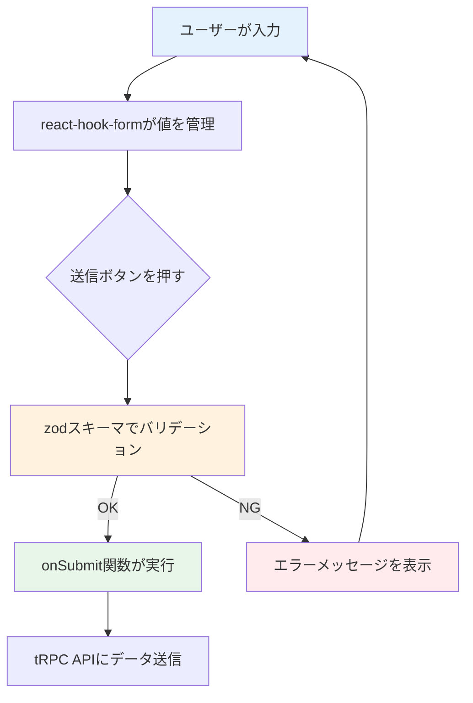

# Day 05: ログイン画面のUIを作ろう

## 🎯 今日のゴール

react-hook-form と zod を使って、バリデーション付きのログイン画面を作ります。shadcn/ui の Card コンポーネントで、プロフェッショナルなデザインに仕上げます。

【スクリーンショット: 完成したログイン画面】

## 🤔 なぜこれを作るのか？

ログイン画面は、ほぼ全てのWebアプリに必要な「玄関」です。ここでは、フォームの入力管理とバリデーション（入力チェック）の基本を学びます。

> 💡 **例え話**: フォームの入力管理は、受付カウンターでの書類チェックに似ています。受付係が記入漏れを1つずつ確認するように、react-hook-form（リアクト・フック・フォーム）が値を管理し、zod（ゾッド）がバリデーションを担当します。

### 📐 フォーム管理の仕組み



### やること / やらないこと

| やること | やらないこと |
|---------|-------------|
| react-hook-form でフォーム管理 | useState で1つずつ状態管理 |
| zod でバリデーション定義 | 手動で if 文チェック |
| shadcn/ui で美しいUI | CSS をゼロから書く |
| tRPC でログインAPI呼び出し | サーバー側の認証処理（Day 7） |

### 🆕 新しく学ぶ概念

| 概念 | 読み方 | 役割 | 例え |
|------|--------|------|------|
| react-hook-form | リアクト・フック・フォーム | フォームの入力値を一括管理 | 受付係。全書類の記入状況をまとめて把握する |
| zod | ゾッド | 入力値の形式チェック | 書式チェックリスト。「必須」「メール形式」などルールを定義 |
| zodResolver | ゾッド・リゾルバー | react-hook-form と zod をつなぐ | 受付係にチェックリストを渡す係。2つを連携させる |

## 📊 実装ステップ一覧

| ステップ | 作業内容 | 所要時間 |
|---------|---------|---------|
| Step 1 | ページの土台を作る | 3分 |
| Step 2 | zodスキーマを定義する | 5分 |
| Step 3 | react-hook-formを設定する | 7分 |
| Step 4 | メールアドレス入力欄を作る | 5分 |
| Step 5 | パスワード入力欄とボタンを作る | 5分 |
| Step 6 | Cardでデザインを整える | 7分 |
| Step 7 | tRPCでログインAPIを呼ぶ | 7分 |
| Step 8 | エラー・ローディング表示を追加 | 5分 |
| Step 9 | 登録リンクとSuspenseを追加 | 3分 |

**合計時間**: 約47分

---

### Step 1: ページの土台を作る（3分）

🎯 **ゴール**: ログインページの基本ファイルを作成します。

💻 **実装**:

```typescript
// filepath: src/app/login/page.tsx
'use client';

import { Button } from '@/component/ui/button';
import { Input } from '@/component/ui/input';
import { Label } from '@/component/ui/label';

// ログインフォームコンポーネント
function LoginForm() {
  return (
    <div className="flex min-h-screen
      items-center justify-center px-4">
      <div className="w-full max-w-sm">
        <h1 className="text-2xl font-bold">
          ログイン
        </h1>
      </div>
    </div>
  );
}

// ページ本体
export default function LoginPage() {
  return <LoginForm />;
}
```

> 💡 `'use client'` は「このファイルはブラウザ側で動く」という宣言です。フォームのようにユーザー操作を扱うページには必須です。

✅ **確認ポイント**:
- `src/app/login/page.tsx` を保存した
- `npm run dev` でエラーが出ていない
- ブラウザで `/login` にアクセスして「ログイン」と表示される

---

### Step 2: zodバリデーションスキーマを定義する（5分）

🎯 **ゴール**: メールとパスワードのチェックルールを定義します。

> 💡 **例え話**: zod スキーマは「書類の書式チェックリスト」です。「メール欄は必須で、@マークを含む形式であること」「パスワード欄は1文字以上であること」といったルールを、コードで書きます。

💻 **実装**:

ファイル先頭のimportの下に追加します。

```typescript
// filepath: src/app/login/page.tsx
import { zodResolver } from '@hookform/resolvers/zod';
import { useForm } from 'react-hook-form';
import { z } from 'zod';

// バリデーションルールを定義
const loginSchema = z.object({
  email: z.string()
    .email('有効なメールアドレスを入力してください'),
  password: z.string()
    .min(1, 'パスワードを入力してください'),
});

// スキーマから型を自動生成
type LoginFormData = z.infer<typeof loginSchema>;
```

#### zodスキーマのコード解説

| コード | 意味 | 例え |
|--------|------|------|
| `z.object({})` | オブジェクト型のスキーマを作成 | 書類テンプレートを作る |
| `z.string()` | 文字列型であることをチェック | 「この欄は文字で書いてね」 |
| `.email()` | メール形式かチェック | 「@マーク入ってる？」 |
| `.min(1)` | 1文字以上かチェック | 「空欄はダメだよ」 |
| `z.infer<typeof ...>` | スキーマからTypeScript型を自動生成 | チェックリストから入力用紙の型を作る |

✅ **確認ポイント**:
- import文を3行追加した
- `loginSchema` と `LoginFormData` を定義した
- `npm run dev` でエラーが出ていない

---

### Step 3: react-hook-formを設定する（7分）

🎯 **ゴール**: useForm フックでフォーム管理を設定します。

> 💡 **例え話**: `useForm` は受付カウンターの係員を呼び出すコマンドです。「このチェックリスト（zodResolver）を使って、お客さんの書類をチェックしてね」と指示します。

💻 **実装**:

LoginForm コンポーネントの中に追加します。

```typescript
// filepath: src/app/login/page.tsx
// LoginFormコンポーネント内の先頭に追加
const {
  register,     // 入力欄をフォームに登録する関数
  handleSubmit,  // 送信時のバリデーション実行関数
  formState: { errors }, // バリデーションエラー情報
} = useForm<LoginFormData>({
  resolver: zodResolver(loginSchema),
});

// フォーム送信時の処理
const onSubmit = (data: LoginFormData) => {
  console.log('送信データ:', data);
};
```

#### useFormの返り値の解説

| 返り値 | 役割 | 例え |
|--------|------|------|
| `register` | input要素をフォームに登録 | 受付係が「この欄を管理するね」と担当する |
| `handleSubmit` | 送信時にバリデーションを実行 | 「全項目チェック完了！」と確認してから処理 |
| `errors` | バリデーションエラーの情報 | 「この欄が間違ってるよ」という指摘メモ |
| `zodResolver` | zodスキーマをreact-hook-formに渡す | チェックリストを受付係に手渡す |

✅ **確認ポイント**:
- `useForm` の設定を LoginForm 内に追加した
- `npm run dev` でエラーが出ていない

---

### Step 4: メールアドレス入力欄を作る（5分）

🎯 **ゴール**: register関数を使って、メール入力欄をフォームに登録します。

💻 **実装**:

LoginForm の return 内を以下に書き換えます。

```typescript
// filepath: src/app/login/page.tsx
// LoginFormのreturn部分
<form onSubmit={handleSubmit(onSubmit)}
  className="space-y-4">
  <div className="space-y-2">
    <Label htmlFor="email">
      メールアドレス
    </Label>
    <Input
      id="email"
      type="email"
      placeholder="your@email.com"
      autoComplete="email"
      autoFocus
      {...register('email')}
    />
    {errors.email && (
      <p className="text-sm text-destructive">
        {errors.email.message}
      </p>
    )}
  </div>
</form>
```

> 💡 `{...register('email')}` がポイントです。この1行で、入力欄の値の取得・更新・バリデーションが全て自動化されます。useState を使う場合に比べて、コードが大幅に減ります。

✅ **確認ポイント**:
- `{...register('email')}` を Input に設定した
- ブラウザで空のまま送信するとエラーが表示される

【スクリーンショット: メール欄のバリデーションエラー表示】

---

### Step 5: パスワード入力欄とボタンを作る（5分）

🎯 **ゴール**: パスワード入力欄と送信ボタンを追加します。

💻 **実装**:

メール入力欄の `</div>` の下に追加します。

```typescript
// filepath: src/app/login/page.tsx
// メール入力欄の下に追加
<div className="space-y-2">
  <Label htmlFor="password">
    パスワード
  </Label>
  <Input
    id="password"
    type="password"
    autoComplete="current-password"
    {...register('password')}
  />
  {errors.password && (
    <p className="text-sm text-destructive">
      {errors.password.message}
    </p>
  )}
</div>
<Button type="submit" className="w-full">
  ログイン
</Button>
```

✅ **確認ポイント**:
- パスワード欄が表示されている
- ログインボタンをクリックできる
- 空で送信するとエラーメッセージが出る

---

### Step 6: Cardでデザインを整える（7分）

🎯 **ゴール**: shadcn/ui の Card でフォームを包み、プロフェッショナルなデザインにします。

💻 **実装**:

まず、import文を追加します。

```typescript
// filepath: src/app/login/page.tsx
import {
  Card,
  CardContent,
  CardDescription,
  CardHeader,
  CardTitle,
} from '@/component/ui/card';
import { Lock } from 'lucide-react';
```

次に、LoginForm の return を書き換えます。

```typescript
// filepath: src/app/login/page.tsx
// LoginFormのreturn - 外枠とCardHeader部分
return (
  <div className="flex min-h-screen
    items-center justify-center px-4">
    <Card className="w-full max-w-sm">
      <CardHeader
        className="space-y-1 text-center">
        <div className="flex justify-center mb-2">
          <div className="rounded-full
            bg-primary p-2">
            <Lock className="h-6 w-6
              text-primary-foreground" />
          </div>
        </div>
        <CardTitle className="text-2xl">
          ログイン
        </CardTitle>
        <CardDescription>
          アカウントにログインしてください
        </CardDescription>
      </CardHeader>
```

続いて、CardContent部分でフォームを配置し、Cardタグを閉じます。

```typescript
// filepath: src/app/login/page.tsx
// CardContent部分 - Step4-5のformをここに入れる
      <CardContent>
        {/* ここにStep4-5のformが入る */}
      </CardContent>
    </Card>
  </div>
);
```

> 💡 `<CardContent>` の中に、Step 4-5 で作った `<form>` タグをそのまま移動してください。

✅ **確認ポイント**:
- カード型のデザインで表示されている
- 鍵アイコンが中央に表示されている
- 「アカウントにログインしてください」が表示される

【スクリーンショット: Card適用後のログイン画面】

---

### Step 7: tRPCでログインAPIを呼ぶ（7分）

🎯 **ゴール**: ログインボタンを押したら、サーバーにデータを送信します。

💻 **実装**:

import文を追加します。

```typescript
// filepath: src/app/login/page.tsx
import { api } from '@/trpc/react';
import {
  useRouter,
  useSearchParams,
} from 'next/navigation';
import { useState } from 'react';
```

LoginForm 内の先頭に以下を追加します。

```typescript
// filepath: src/app/login/page.tsx
// LoginFormコンポーネント内の先頭に追加
const router = useRouter();
const searchParams = useSearchParams();
// ログイン後の遷移先（未指定ならダッシュボード）
const callbackUrl =
  searchParams?.get('callbackUrl')
  || '/dashboard';
// サーバーエラーの状態管理
const [error, setError] =
  useState<string | null>(null);
```

tRPCのログインAPI呼び出しを定義します。

```typescript
// filepath: src/app/login/page.tsx
// tRPCのログインAPI呼び出し
const loginMutation =
  api.auth.login.useMutation({
    onSuccess: () => {
      router.push(callbackUrl);
      router.refresh();
    },
    onError: (err) => {
      setError(
        err.message
        || 'ログイン中にエラーが発生しました'
      );
    },
  });
```

onSubmit 関数を更新します。

```typescript
// filepath: src/app/login/page.tsx
// onSubmit関数を書き換え
const onSubmit = (data: LoginFormData) => {
  setError(null); // エラーをリセット
  loginMutation.mutate(data); // API呼び出し
};
```

#### tRPC ミューテーションの解説

| コード | 意味 | 例え |
|--------|------|------|
| `useMutation` | データ変更系のAPI呼び出しを定義 | 郵便局の「送信」窓口を用意する |
| `.mutate(data)` | 実際にAPIを呼び出す | 書類を窓口に提出する |
| `onSuccess` | 成功時のコールバック | 「受理されました」の通知 |
| `onError` | 失敗時のコールバック | 「不備があります」の通知 |
| `isPending` | 通信中かどうか | 「処理中」ランプが点灯中 |

✅ **確認ポイント**:
- `api` の import を追加した
- `loginMutation` を定義した
- `onSubmit` で `loginMutation.mutate` を呼んでいる

---

### Step 8: エラー・ローディング表示を追加（5分）

🎯 **ゴール**: サーバーエラーの表示と、通信中のローディング状態を追加します。

💻 **実装**:

form タグの直下にエラー表示を追加します。

```typescript
// filepath: src/app/login/page.tsx
// <form>の直下に追加
{error && (
  <div className="rounded-md
    bg-destructive/15 p-3
    text-sm text-destructive">
    {error}
  </div>
)}
```

送信ボタンをローディング対応に更新します。

```typescript
// filepath: src/app/login/page.tsx
// Buttonを以下に書き換え
<Button
  type="submit"
  className="w-full"
  disabled={loginMutation.isPending}>
  {loginMutation.isPending
    ? 'ログイン中...'
    : 'ログイン'}
</Button>
```

> 💡 `disabled={loginMutation.isPending}` で、通信中はボタンを押せなくします。二重送信を防ぐための大切なテクニックです。

✅ **確認ポイント**:
- 間違ったパスワードでエラーメッセージが出る
- 送信中はボタンが「ログイン中...」に変わる

---

### Step 9: 登録リンクとSuspenseを追加（3分）

🎯 **ゴール**: 新規登録ページへのリンクと、Suspense ラッパーを追加して完成させます。

💻 **実装**:

import文を追加します。

```typescript
// filepath: src/app/login/page.tsx
import Link from 'next/link';
import { Suspense } from 'react';
```

ボタンの下にリンクを追加します。

```typescript
// filepath: src/app/login/page.tsx
// Buttonの下に追加
<div className="text-center text-sm">
  アカウントをお持ちでない方は{' '}
  <Link
    href="/register"
    className="underline
      underline-offset-4
      hover:text-primary">
    こちら
  </Link>
</div>
```

最後に、LoginPage を Suspense でラップします。

```typescript
// filepath: src/app/login/page.tsx
// ページ本体を書き換え
export default function LoginPage() {
  return (
    <Suspense fallback={
      <div className="flex min-h-screen
        items-center justify-center">
        Loading...
      </div>
    }>
      <LoginForm />
    </Suspense>
  );
}
```

> 💡 `Suspense` は、`useSearchParams` を使うコンポーネントに必要なラッパーです。読み込み中に「Loading...」を表示してくれます。

✅ **確認ポイント**:
- 「こちら」リンクが表示されている
- リンクをクリックすると `/register` に遷移する
- ページ全体がエラーなく表示される

【スクリーンショット: 完成したログイン画面の全体】

---

## 📋 今日のまとめ

- [ ] react-hook-form でフォームを管理できた
- [ ] zod でバリデーションスキーマを定義できた
- [ ] zodResolver で2つのライブラリを連携できた
- [ ] `{...register('name')}` で入力欄を登録できた
- [ ] tRPC の useMutation でAPIを呼び出せた
- [ ] エラー表示とローディング状態を実装できた

## ⚠️ つまずきポイント

| エラー / 問題 | 原因 | 解決方法 |
|--------------|------|---------|
| `zodResolver is not a function` | `@hookform/resolvers` が未インストール | `npm i @hookform/resolvers` を実行 |
| `register is not a function` | useForm の呼び出しが間違っている | `useForm<LoginFormData>({resolver: ...})` を確認 |
| バリデーションが効かない | `resolver` の設定忘れ | `useForm` に `resolver: zodResolver(loginSchema)` を渡す |
| `useSearchParams` エラー | Suspense が不足 | LoginPage を `<Suspense>` でラップする |

## 📝 今日学んだ用語

| 用語 | 意味 |
|------|------|
| react-hook-form | React のフォーム管理ライブラリ。useState より効率的 |
| zod | TypeScript ファーストのバリデーションライブラリ |
| zodResolver | zod と react-hook-form を接続するアダプタ |
| register | input 要素をフォームに登録する関数 |
| handleSubmit | バリデーション後に送信処理を実行する関数 |
| useMutation | データ変更系の API 呼び出しに使う tRPC フック |
| Suspense | 非同期処理の読み込み中にフォールバックを表示するコンポーネント |

## 🔗 次回予告

Day 06 では、ユーザー登録画面を作ります。Day 05 で学んだ react-hook-form + zod のパターンを応用して、パスワード確認チェックなどの高度なバリデーションに挑戦します。
