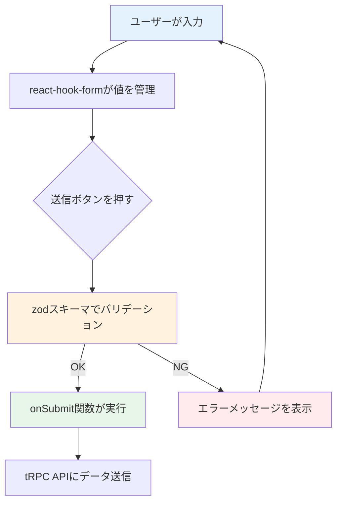
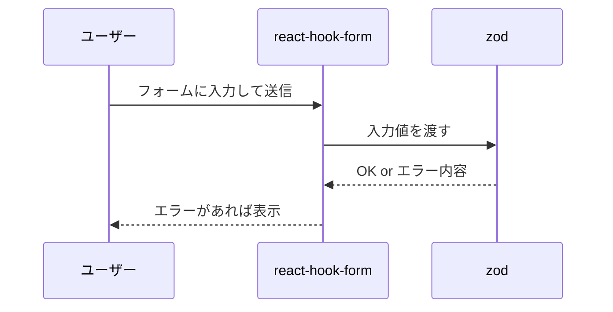
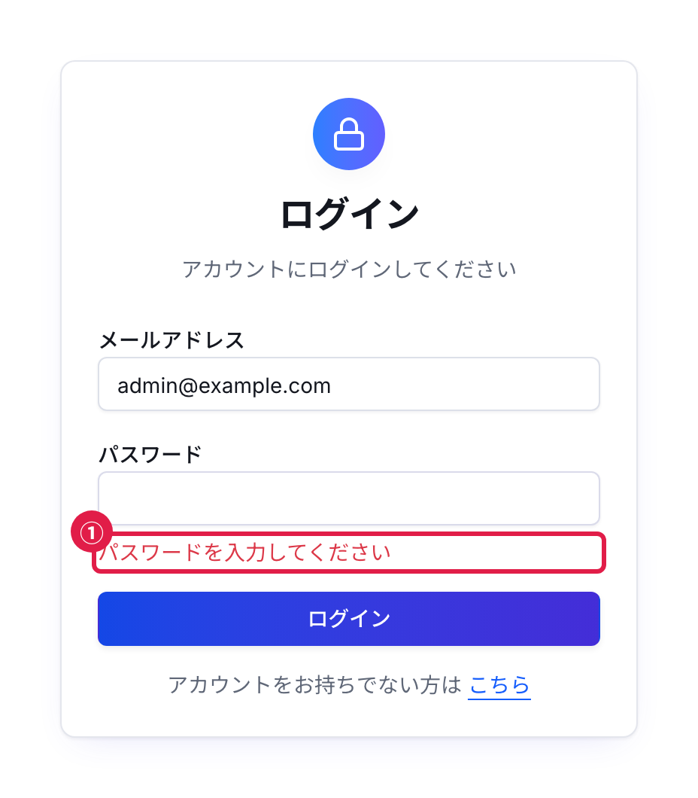
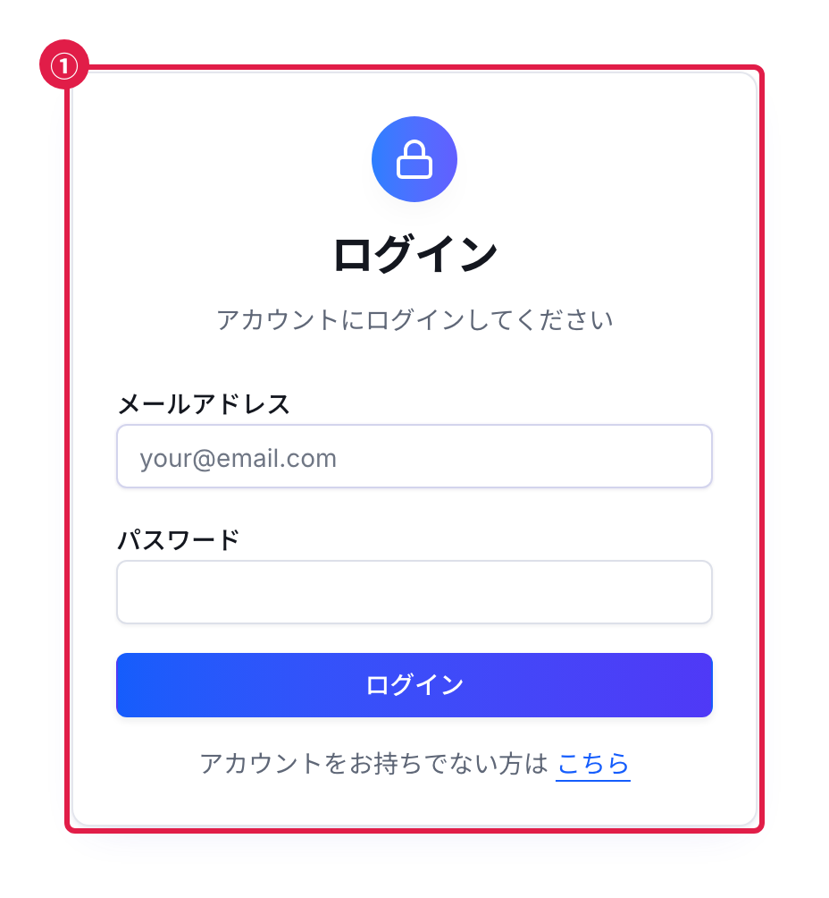
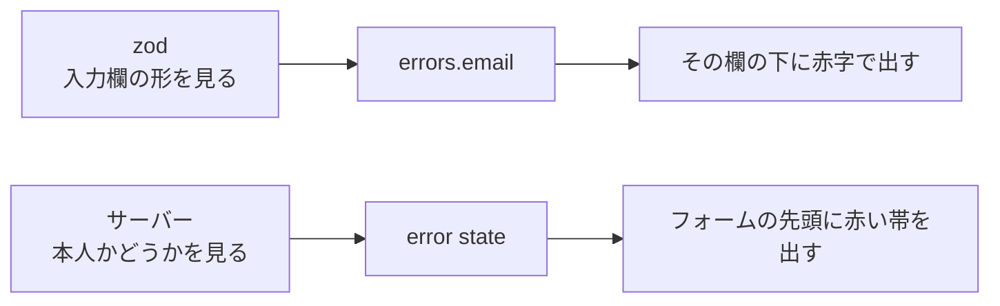
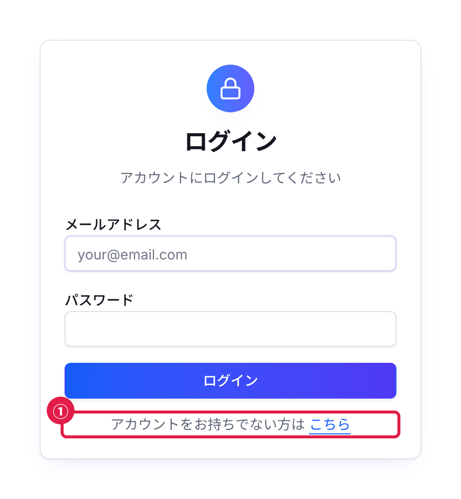

# Day 05: ログイン画面のUIを作ろう

## 前回の振り返り

Day 04 では Vercel を使ってアプリをインターネット上にデプロイし、誰でもアクセスできる状態にしました。アプリが公開できたので、今日からはアプリの機能を充実させていきます。まずはログイン画面の UI を作成します。

---

## 今日のゴール

react-hook-form と zod を使って、バリデーション付きのログイン画面を作ります。shadcn/ui（読み方: シャドシーエヌ・ユーアイ、コピーして使えるUI部品集）の Card コンポーネントで、プロフェッショナルなデザインに仕上げます。

今日作るのは画面と、送信ボタンを押したときにサーバーへ問い合わせる線までです。届いた値が本人のものかを判定するサーバー側のコードは、Day 01 のセットアップで入った出来合いのものを借りて動かします。中身を読んで自分の手で書き直すのは Day 07 です。そのため今日の画面で自分の目で確かめられるのは「入力欄が反応するか」「未入力ならエラーが出るか」「通信中はボタンが押せなくなるか」の3つになります。なぜログインが通るのかを説明できる状態になるのは、Day 07 を終えてからです。

スクリーンショット: 完成したログイン画面の表示を確認してください。


## 始める前の前提

- Day 04 までのアプリが起動できる
- `src/app/login/page.tsx` を新規作成できる（この時点ではまだ存在しません）
- `npm run dev` を実行してブラウザで確認できる
- ログイン処理の中身は Day 07 で扱うため、今日は画面とフォーム送信の流れに集中する

## なぜこれを作るのか

ログイン画面は、ほぼすべてのWebアプリに必要な「玄関」です。ここでは、フォームの入力管理とバリデーション（入力チェック）の基本を学びます。

> **例え話**: フォームの入力管理は、受付カウンターでの書類チェックに似ています。受付係が記入漏れを1つずつ確認するように、react-hook-form（リアクト・フック・フォーム）が値を管理し、zod（ゾッド）がバリデーションを担当します。

### フォーム管理の仕組み


```mermaid
flowchart TD
    A[ユーザーが入力] --> B[react-hook-formが値を管理]
    B --> C{送信ボタンを押す}
    C --> D[zodスキーマでバリデーション]
    D -->|OK| E[onSubmit関数が実行]
    D -->|NG| F[エラーメッセージを表示]
    F --> A
    E --> G[tRPC APIにデータ送信]

    style A fill:#e3f2fd
    style D fill:#fff3e0
    style E fill:#e8f5e9
    style F fill:#ffebee
```

図の左半分、入力から zod の検証までは、すべてブラウザの中だけで完結します。ユーザーが打った文字を react-hook-form が抱えておき、送信ボタンを押した瞬間に zod のルールと突き合わせる流れです。ルールに外れていれば矢印は左へ戻り、`onSubmit` は一度も呼ばれません。入力欄の下に赤いメッセージが出て、そこで止まります。

止まってくれるおかげで、空欄のままサーバーへ問い合わせる無駄な通信が消えます。ただし、これは通信を減らすための足切りであって、安全のための検査ではありません。ブラウザで動くコードは、利用者の手元で書き換えられてしまうからです。入れてよい相手かどうかを決めるのは、図のいちばん右にある「tRPC APIにデータ送信」の先、サーバー側だけです。その中身は Day 07 で自分の手で書きます。今日は左半分を完成させます。

### やること / やらないこと

| やること | やらないこと |
|---------|-------------|
| react-hook-form でフォーム管理 | useState（画面の状態を1つずつ覚えておく React の基本機能）で1つずつ状態管理 |
| zod でバリデーション定義 | 手動で if 文チェック |
| shadcn/ui で美しいUI | CSS をゼロから書く |
| tRPC でログインAPI呼び出し | 認証ロジックの実装詳細（Day 07で扱う） |

### 新しく学ぶ概念

| 概念 | 読み方 | 役割 | 例え |
|------|--------|------|------|
| react-hook-form | リアクト・フック・フォーム | フォームの入力値を一括管理 | 受付係。全書類の記入状況をまとめて把握する |
| zod | ゾッド | 入力値の形式チェック | 書式チェックリスト。「必須」「メール形式」のようにルールを定義 |
| zodResolver | ゾッド・リゾルバー | react-hook-form と zod をつなぐ | 受付係にチェックリストを渡す係。2つを連携させる |

> **今日のゴールライン**: 3つのライブラリが一度に出てきますが、今日は「この形で書くと動く」を体験できれば十分です。なぜこう書くかは、Day 06 で同じパターンをもう一度使うときに自然とわかってきます。

## 実装ステップ一覧

| ステップ | 作業内容 | 所要時間 |
|---------|---------|---------|
| Step 1 | ページの土台を作る | 3分 |
| Step 2 | zodバリデーションスキーマを定義する | 5分 |
| Step 3 | react-hook-formを設定する | 7分 |
| Step 4 | メールアドレス入力欄を作る | 5分 |
| Step 5 | パスワード入力欄とボタンを作る | 5分 |
| Step 6 | Cardでデザインを整える | 7分 |
| Step 7 | tRPCでログインAPIを呼ぶ | 7分 |
| Step 8 | エラー・ローディング表示を追加 | 5分 |
| Step 9 | 登録リンクとSuspenseを追加 | 3分 |

**合計時間**: 約47分です。

この時間はコードを読んで理解する目安です。写経して打ち込む時間、詰まって調べる時間は別に見てください。

---

### 予備知識: zod と react-hook-form とは

Day 05 からは **フォーム**（入力欄＋送信ボタン）を作ります。フォームでは「ユーザーが正しい値を入力したか」を確認する**バリデーション**が欠かせません。ここでは、今日から何度も登場する 2 つのライブラリを先に紹介します。

| ライブラリ | ひとこと説明 | 例え |
|-----------|------------|------|
| **zod** | 「この入力は正しいか」をチェックするルール集 | 入場券の受付係——チケットの形式が合っていないと通さない |
| **react-hook-form** | フォームの入力値・エラーメッセージをまとめて管理する仕組み | 受付カウンター——チケットを受け取り、受付係（zod）に渡して結果を表示する |
| **@hookform/resolvers** | zod と react-hook-form をつなぐアダプター | 受付係と受付カウンターをつなぐ内線電話 |

#### バリデーションの流れ


```mermaid
sequenceDiagram
    participant U as ユーザー
    participant F as react-hook-form
    participant Z as zod
    U->>F: フォームに入力して送信
    F->>Z: 入力値を渡す
    Z-->>F: OK or エラー内容
    F-->>U: エラーがあれば表示
```

矢印をよく見ると、zod がユーザーへ直接話しかけている線は1本もありません。zod は合格か否かを判定して react-hook-form へ返すだけの担当で、画面の表示には関わりません。判定と表示を別々の担当に分けておくと、判定ルールを1か所にまとめたまま、表示だけをあとから変えられます。

分けておく利点は Day 06 ですぐ実感できます。ユーザー登録画面もメールアドレスとパスワードを受け取るので、判定ルールの書き方は今日とほぼ同じ形になります。違うのは項目が増えることだけです。今日この2つの担当の境目をつかんでおけば、Day 06 は新しい項目をルールへ足すだけの作業になります。

> 今は「こういうものがあるんだ」程度の理解で大丈夫です。Step 1 以降で実際にコードを書きながら、使い方を体験していきます。

---

### Step 1: ページの土台を作る（3分）

**ゴール**: ログインページの基本ファイルを作成します。

**実装**:

```typescript
// filepath: src/app/login/page.tsx
'use client';

// ログインフォームコンポーネント
function LoginForm() {
  return (
    <div className="flex min-h-screen
      items-center justify-center px-4">
      <div className="w-full max-w-sm">
        <h1 className="text-2xl font-bold">
          ログイン
        </h1>
      </div>
    </div>
  );
}

// ページ本体
export default function LoginPage() {
  return <LoginForm />;
}
```

1つのファイルに `LoginForm` と `LoginPage` の2つを置いたのには理由があります。`LoginPage` は Next.js が `/login` を開いたときに呼び出す入口で、名前と場所が決まっています。一方の `LoginForm` は自由に扱える部品です。Step 9 で入口の側だけを `Suspense` で包み直すので、包まれる中身をいま別の関数として切り出しておくと、そのとき書き換えるのは `LoginPage` の数行だけで済みます。

`min-h-screen` は「高さを画面いっぱいにする」指定で、`items-center justify-center` が中身を縦横の中央へ寄せます。この3つが揃って初めてフォームが画面の真ん中に来ます。`min-h-screen` を外すと `<div>` は文字の高さぶんしか広がりません。寄せる先の余白そのものが無くなるので、フォームは画面の上端へ貼り付いたままになります。

> `'use client'` は「このファイルはブラウザ側で動く」という宣言です。フォームのようにユーザー操作を扱うページには必須です。

**確認ポイント**:
- `src/app/login/page.tsx` を保存した
- `npm run dev` でエラーが出ていない
- ブラウザで `/login` にアクセスして「ログイン」と表示される

---

### Step 2: zodバリデーションスキーマを定義する（5分）

**ゴール**: メールとパスワードのチェックルールを定義します。

> **例え話**: zod スキーマは「書類の書式チェックリスト」です。「メール欄は必須で、@マークを含む形式であること」「パスワード欄は1文字以上であること」といったルールを、コードで書きます。

**実装**:

`'use client';` の下に import 文を追加し、その下にスキーマを定義します。

```typescript
// filepath: src/app/login/page.tsx（'use client'の下に追加）
import { zodResolver } from '@hookform/resolvers/zod';
import { useForm } from 'react-hook-form';
import { z } from 'zod';

// バリデーションルールを定義
const loginSchema = z.object({
  email: z.string()
    .email('有効なメールアドレスを入力してください'),
  password: z.string()
    .min(1, 'パスワードを入力してください'),
});

// スキーマから型を自動生成
type LoginFormData = z.infer<typeof loginSchema>;
```

`loginSchema` をコンポーネントの外に置いているのは、このルールが画面の状態と無関係だからです。中に書くと、React が画面を描き直すたびにルールが作り直されます。外に置けば、アプリの起動時に1回だけ組み立てられて、あとは使い回されます。

`.email()` や `.min(1)` に渡している日本語は、失敗したときに画面へ出す文言そのものです。ルールと文言が同じ行に並んでいるので、「どの条件で何と表示されるか」を1か所で読み切れます。引数に空文字を渡すと、エラー文言が空のままになり、画面には何も出ません。引数そのものを書かないと、zod が用意した英語の文言が出ます。どちらも読み手には不親切なので、必ず日本語の文言を渡します。

最後の `z.infer<typeof loginSchema>` は、いま書いたルールから TypeScript の型を自動で写し取る書き方です。型を手で書くと、あとでパスワードの条件を足したときにルールと型がずれます。ずれた型は間違いを教えてくれません。ルールから型を作れば、書き換える場所は `loginSchema` の1つだけになります。

**確認ポイント**:
- import文を3行追加した
- `loginSchema` と `LoginFormData` を定義した
- `npm run dev` でエラーが出ていない

#### zodスキーマのコード解説

| コード | 意味 | 例え |
|--------|------|------|
| `z.object({})` | オブジェクト型のスキーマを作成 | 書類テンプレートを作る |
| `z.string()` | 文字列型であることをチェック | 「この欄は文字で書いてね」 |
| `.email()` | メール形式かチェック | 「@マークが入っているか」 |
| `.min(1)` | 1文字以上かチェック | 「空欄はダメだよ」 |
| `z.infer<typeof ...>` | スキーマからTypeScript型を自動生成 | チェックリストから入力用紙の型を作る |


---

### Step 3: react-hook-formを設定する（7分）

**ゴール**: useForm フックでフォーム管理を設定します。

> **例え話**: `useForm` は受付カウンターの係員を呼び出すコマンドです。「このチェックリスト（zodResolver）を使って、お客さんの書類をチェックしてね」と指示します。

**実装**:

LoginForm コンポーネントの中に追加します。

```typescript
// filepath: src/app/login/page.tsx
// LoginFormコンポーネント内の先頭に追加
const {
  register,     // 入力欄をフォームに登録する関数
  handleSubmit,  // 送信時のバリデーション実行関数
  formState: { errors }, // バリデーションエラー情報
} = useForm<LoginFormData>({
  resolver: zodResolver(loginSchema),
});

// フォーム送信時の処理（Step 7で書き換えます）
// ⚠️ 動作確認用の一時コードです。Step 7で必ず削除してください。
const onSubmit = async (
  data: LoginFormData
) => {
  console.log('送信データ:', data);
};
```

左辺の `{ register, handleSubmit, formState: { errors } }` は、`useForm` が返す大きな箱から必要な3つだけを取り出す書き方です。`useForm` は他にもたくさんの道具を返しますが、今日使うのはこの3つだけなので、残りは受け取らずに置いておきます。

`useForm<LoginFormData>` と山かっこで型を渡しているのが、Step 2 で作った型とここをつなぐ結び目です。この1語があるおかげで、あとから `register('emial')` のように綴りを間違えると、保存した瞬間にエディタが赤線を引いてくれます。型を渡さないと綴り違いはそのまま通り、画面では入力しているのにデータが空、という原因の見えない不具合になります。

`resolver: zodResolver(loginSchema)` は、受付係に書式チェックリストを手渡す1行です。これを書き忘れても画面は普通に表示され、エラーも出ません。ただし空欄のまま送信ボタンを押すと、何のメッセージも出ないまま `onSubmit` が走ります。「バリデーションが効かない」と感じたときは、まずこの行を疑ってください。

`onSubmit` の中身がいまは `console.log` だけなのは、送信先をまだ作っていないからです。ここは Step 7 で本物の呼び出しに置き換えます。

> **今日のゴールライン**: `useForm` はまず「この形で書くと動く」を覚えるところからで十分です。なぜこう書くかは、Day 06 で同じパターンをもう一度使うときに自然とわかってきます。

**確認ポイント**:
- `useForm` の設定を LoginForm 内に追加した
- `npm run dev` でエラーが出ていない
- `console.log` は動作確認後に残さず、Step 7で必ず削除する

#### useFormの返り値の解説

| 返り値 | 役割 | 例え |
|--------|------|------|
| `register` | input要素をフォームに登録 | 受付係が「この欄を管理するね」と担当する |
| `handleSubmit` | 送信時にバリデーションを実行 | 「全項目チェック完了」と確認してから処理 |
| `errors` | バリデーションエラーの情報 | 「この欄が間違ってるよ」という指摘メモ |
| `zodResolver` | zodスキーマをreact-hook-formに渡す | チェックリストを受付係に手渡す |


---

### Step 4: メールアドレス入力欄を作る（5分）

**ゴール**: register関数を使って、メール入力欄をフォームに登録します。

**実装**:

まず、UIコンポーネントの import を追加します。

```typescript
// filepath: src/app/login/page.tsx（import文に追加）
import { Input } from '@/component/ui/input';
import { Label } from '@/component/ui/label';
```

`@/component/ui/...` から取り込んでいる点に注目してください。先頭の `@/` は自分のプロジェクトの `src` を指す近道の書き方で、`react-hook-form` のような外部ライブラリとは出どころが違います。shadcn/ui は部品をパッケージとして配るのではなく、コードをそのままリポジトリへコピーする方式です。だから `Input` と `Label` の中身は自分のファイルとして手元にあり、余白や色を変えたければ直接書き換えられます。

`Label` をわざわざ部品として用意しているのは、見た目のためだけではありません。ラベルと入力欄を `htmlFor` と `id` で結んでおくと、ラベルの文字をクリックしただけで入力欄にカーソルが入ります。読み上げソフトを使う人にも、その欄が何を尋ねているかが伝わります。次のコードで `htmlFor="email"` と `id="email"` を必ずペアで書くのは、この結び目を作るためです。

**確認ポイント**:
- `Input` と `Label` の import 文を追加した
- `npm run dev` でエラーが出ていない

`LoginForm` の `return (` の中身を書き換えます。Step 1 で書いた外側の `<div>` は残し、その内側にある `<div className="w-full max-w-sm">` と `<h1>ログイン</h1>` を消して、代わりに次の `<form>` を丸ごと置きます。

```typescript
{/* filepath: src/app/login/page.tsx */}
{/* LoginFormのreturn部分 */}
<form onSubmit={handleSubmit(onSubmit)}
  className="space-y-4">
  <div className="space-y-2">
    <Label htmlFor="email">
      メールアドレス
    </Label>
    <Input
      id="email"
      type="email"
      placeholder="your@email.com"
      autoComplete="email"
      autoFocus
      {...register('email')}
    />
    {errors.email && (
      <p className="text-sm text-destructive">
        {errors.email.message}
      </p>
    )}
  </div>
</form>
```

> `{...register('email')}` がポイントです。この1行で、入力欄の値の取得・更新・バリデーションがまとめて自動化されます。useState を使う場合に比べて、書くコードが減ります。

**確認ポイント**:
- `{...register('email')}` を Input に設定した
- ブラウザでメール入力欄が表示されている
- npm run dev でエラーが出ていない

スクリーンショット: 下の画像は Step 9 まで書き終えた完成後の画面です。赤枠が、入力の誤りを知らせる赤い文字です。いまの自分の画面には、メールアドレス欄しか出ていません。パスワード欄は Step 5、カードの枠は Step 6、下の登録リンクは Step 9 で足します。



---

### Step 5: パスワード入力欄とボタンを作る（5分）

**ゴール**: パスワード入力欄と送信ボタンを追加します。

**実装**:

Button の import を追加します。

```typescript
// filepath: src/app/login/page.tsx（import文に追加）
import { Button } from '@/component/ui/button';
```

`Button` も Step 4 の `Input` や `Label` と同じ `@/component/ui` から取り込みます。素の `<button>` タグでも動きますが、shadcn/ui の `Button` には色・角丸・押したときの反応・押せない状態の見た目が最初から入っています。Step 8 で通信中のボタンを押せなくするとき、その「押せない見た目」を自分で書かずに済むのは、ここで部品を選んでいるからです。

`import` の並び順は気にしなくて構いません。`npm run fix` を実行すると、Biome（このプロジェクトが使っている整形ツール）が並べ替えてくれます。

ここで先に断っておきます。**この教材のコードは、行の幅を狭く保つ都合で、Biome の整形前の形で載せています。** たとえば `<h1>` を3行に分けて書いている箇所がありますが、Biome は1行にまとめるのが正しいと判断します。そのため写経したあとに `npm run lint` を実行すると、いくつかのファイルで整形の差分が報告されます。**写経を間違えたわけではありません。** `npm run fix` を実行すれば Biome の形にそろい、差分は消えます。改行位置が変わるだけで、動きは変わりません。

メール入力欄の `</div>` の下に追加します。

```typescript
{/* filepath: src/app/login/page.tsx */}
{/* メール入力欄の下に追加 */}
<div className="space-y-2">
  <Label htmlFor="password">
    パスワード
  </Label>
  <Input
    id="password"
    type="password"
    autoComplete="current-password"
    {...register('password')}
  />
  {errors.password && (
    <p className="text-sm text-destructive">
      {errors.password.message}
    </p>
  )}
</div>
<Button type="submit" className="w-full">
  ログイン
</Button>
```

`register('password')` の文字列が Step 2 で決めた項目名と一致しているから、入力した値が正しい場所に入ります。この文字列が `passwrod` のように1文字でも違うと、画面は普通に打てるのに送信データがいつも空になります。

`type="password"` は、打った文字を黒丸で隠す指定です。隠れるのは画面上の見た目だけで、送信される値は打ったままの文字列です。`autoComplete="current-password"` を添えておくと、ブラウザやパスワード管理ソフトが「これは既存アカウントのパスワード欄だ」と判断して、保存済みの値を出してくれます。

`type="submit"` が付いたボタンは、押されるとフォームの `onSubmit`、つまり Step 4 で書いた `handleSubmit(onSubmit)` を呼びます。ボタン自身に処理を書いていないのに反応するのは、この仕組みのおかげです。ここまでで送信の流れは動きますが、送信先はまだ `console.log` のままです。ブラウザの開発者ツール（macOS では `option + command + I`、Windows では `F12` で開く画面）のコンソールに入力値が出れば、その先が未完成でも今日のここまでは合格です。

**確認ポイント**:
- パスワード欄が表示されている
- ログインボタンをクリックできる
- 空で送信するとエラーメッセージが出る

---

### Step 6: Cardでデザインを整える（7分）

**ゴール**: shadcn/ui の Card でフォームを包み、プロフェッショナルなデザインにします。

**実装**:

まず、import文を追加します。

```typescript
// filepath: src/app/login/page.tsx
import {
  Card,
  CardContent,
  CardDescription,
  CardHeader,
  CardTitle,
} from '@/component/ui/card';
import { AlertCircle, Lock } from 'lucide-react';
import {
  Alert, AlertDescription, AlertTitle,
} from '@/component/ui/alert';
```

Card が5つの部品に分かれているのは、囲むための箱と、その中の役割ごとの場所を分けたいからです。`Card` が外枠、`CardHeader` が上の見出し帯、`CardContent` が本文の置き場です。ひとつの `<div>` に余白と枠線を書いても同じ見た目にはできますが、部品名で分けておくと、あとから読んだ人が「どこに何を足せばいいか」を名前だけで判断できます。

`lucide-react` はアイコン集で、`Lock` は鍵の絵、`AlertCircle` は丸に感嘆符の絵です。画像ファイルではなく部品として取り込むため、色や大きさを文字と同じ指定で変えられます。

`Alert` の3つは、このステップではまだ画面に出しません。使うのは Step 8 で、サーバーから返ってきたエラーを赤い帯で見せるときです。取り込みだけ先に済ませておくと、Step 8 で import を触らずに済みます。

次に、LoginForm の return を書き換えます。

```typescript
// filepath: src/app/login/page.tsx
// LoginFormのreturn - 外枠とCardHeader部分
return (
  <div className="flex min-h-screen
    items-center justify-center px-4">
    <Card className="w-full max-w-sm">
      <CardHeader
        className="space-y-1 text-center">
        <div className="flex justify-center mb-2">
          <div className="rounded-full
            bg-gradient-to-r from-blue-500
            to-indigo-500 p-3 shadow-lg">
            <Lock className="h-6 w-6
              text-white" />
          </div>
        </div>
        <CardTitle className="text-2xl">
          ログイン
        </CardTitle>
        <CardDescription>
          アカウントにログインしてください
        </CardDescription>
      </CardHeader>
```

Step 1 で書いた外側の `<div>` はそのまま残し、Step 4 で `<div className="w-full max-w-sm">` を消した場所へ `Card` を置いた形です。中央寄せの役目は外側の `<div>` が引き続き持ち、`Card` は枠線と影と余白だけを足します。役割が重なっていないので、片方を変えてももう片方は崩れません。

このコードは `</CardHeader>` で終わっていて、`return (` に対応する閉じかっこがまだありません。この時点で保存すると、エディタは赤線を引き、`npm run dev` の画面にも構文エラーが出ます。壊れているのではなく、続きが未入力なだけです。閉じるのは Step 6 の最後のコードなので、そこまでは赤線が出たままで進めてください。

**確認ポイント**:
- Card/CardHeader の import を追加した
- `return (` の下に `Card` と `CardHeader` を書いた
- 閉じかっこが未入力なので、この時点では構文エラーが出たままでよい

ここから3つのブロックで書き直します。**Step 4 と Step 5 で書いた `<form>` から `</form>` までは、先にすべて削除してください。** 残したまま足すと入力欄が二重になり、同じ欄が2つ並びます。

続いて、CardContent の開始とメールアドレス入力欄を追加します。

```typescript
{/* filepath: src/app/login/page.tsx */}
{/* CardContentとメールアドレス入力欄 */}
      <CardContent>
        <form onSubmit={handleSubmit(onSubmit)}
          className="space-y-4">
          {/* メールアドレス入力欄 */}
          <div className="space-y-2">
            <Label htmlFor="email">
              メールアドレス
            </Label>
            <Input
              id="email"
              type="email"
              placeholder="your@email.com"
              autoComplete="email"
              autoFocus
              {...register('email')}
            />
            {errors.email && (
              <p className="text-sm text-destructive">
                {errors.email.message}
              </p>
            )}
          </div>
```

`register` と `errors` はどちらも同じ `useForm` から来ているので、囲む箱を替えてもフォームの動きは変わりません。見た目の階層と、値を管理する仕組みが独立している証拠です。

`{errors.email && ( ... )}` は、`errors.email` に中身があるときだけ後ろの `<p>` を表示する書き方です。zod の判定に通っているあいだ `errors.email` は `undefined` なので、赤いメッセージは画面に存在すらしません。空欄で送信ボタンを押した瞬間に中身が入り、Step 2 で書いた「有効なメールアドレスを入力してください」がここに現れます。文言を変えたくなったら、この行ではなく `loginSchema` を書き換えます。

次に、パスワード入力欄を追加します。

```typescript
{/* filepath: src/app/login/page.tsx */}
{/* パスワード入力欄 */}
          {/* パスワード入力欄 */}
          <div className="space-y-2">
            <Label htmlFor="password">
              パスワード
            </Label>
            <Input
              id="password"
              type="password"
              autoComplete="current-password"
              {...register('password')}
            />
            {errors.password && (
              <p className="text-sm text-destructive">
                {errors.password.message}
              </p>
            )}
          </div>
```

外側の `<form>` に付けた `className="space-y-4"` が、メール欄とパスワード欄のあいだに自動で縦の余白を入れます。欄ごとに `margin` を書かなくても間隔が揃うのは、余白を親がまとめて決めているからです。

インデントが深くなって現在地を見失いやすい場所でもあります。迷ったら閉じタグから数えてください。`</div>` がパスワード欄の終わり、その外に `</form>`、さらに外に `</CardContent>` と `</Card>` が来ます。次のコードで、その外側3つをまとめて閉じます。

最後に、送信ボタンとCardの閉じタグを追加して完成させます。

```typescript
{/* filepath: src/app/login/page.tsx */}
{/* 送信ボタン・CardContent・Cardの閉じタグ */}
          {/* 送信ボタン */}
          <Button
            type="submit"
            className="w-full">
            ログイン
          </Button>
        </form>
      </CardContent>
    </Card>
  </div>
);
```

保存すると、Step 6 の途中から出ていた赤線が消えます。消えない場合は、閉じタグの数が足りないか多いかのどちらかです。エディタでどれかのタグをクリックすると対になる相手が光るので、光らないタグが犯人です。

**確認ポイント**:
- カード型のデザインで表示されている
- 鍵アイコンが中央に表示されている
- 「アカウントにログインしてください」が表示される

スクリーンショット: 下の画像は Step 9 まで書き終えた完成後の画面です。赤枠の中が、この Step で整えた Card です。いまの自分の画面には、フォームの下の登録リンクがまだ出ていません。リンクは Step 9 で足します。



---

### Step 7: tRPCでログインAPIを呼ぶ（7分）

**ゴール**: ログインボタンを押したら、サーバーにデータを送信します。

**実装**:

まず、遷移先を検査する関数を別ファイルに作ります。

```typescript
// filepath: src/lib/redirect.ts
// Open Redirect対策: 相対パスのみを許可
export function isValidRedirectUrl(
  url: string
): boolean {
  // URLが空ならfalseを返す
  if (!url) return false;
  // ブラウザが解釈前に取り除く空白文字を禁止
  if (url.includes('\t')
    || url.includes('\n')
    || url.includes('\r')) return false;
  // 円記号はブラウザが / と同じに扱うため禁止
  if (url.includes('\\')) return false;
  // プロトコル相対URL（//example.com）を禁止
  if (url.startsWith('//')) return false;
  // 相対パスのみを許可
  return url.startsWith('/');
}
```

**確認ポイント**:
- `src/lib/redirect.ts` を新しく作った
- `npm run dev` でエラーが出ていない

> 画面のファイルではなく `src/lib/` に置くのは、同じ判定をミドルウェア（どのページを表示するときも手前で必ず通る共通の処理）でも使うためです。同じ規則を2か所に書き写すと、片方だけ直したときに緩いほうが残ります。1つに寄せておけば、直す場所も1つで済みます。

次に、ログイン画面へ import 文を追加します。

```typescript
// filepath: src/app/login/page.tsx
import { isValidRedirectUrl }
  from '@/lib/redirect';
import { api } from '@/trpc/react';
import { useSearchParams }
  from 'next/navigation';
import { useState } from 'react';
// トースト通知ライブラリ（画面上部にメッセージを表示）
import toast from 'react-hot-toast';
```

**確認ポイント**:
- `isValidRedirectUrl` / `api` / `useSearchParams` / `useState` / `toast` の import を追加した
- `npm run dev` でエラーが出ていない

> `react-hot-toast` はログイン成功時に通知メッセージを表示するライブラリです。Day 01の初期セットアップでインストール済みなので、import するだけで使えます。
>
> `useSearchParams` を使うコンポーネントには `Suspense` ラッパーが必要です。Step 9で追加するので、このステップではエラーが出る場合があります。

次に、LoginForm 内の先頭に以下を追加します。

```typescript
// filepath: src/app/login/page.tsx
// LoginFormコンポーネント内の先頭に追加
const searchParams = useSearchParams();

// ログイン後の遷移先（未指定ならダッシュボード）
// 空文字も未指定として扱いたいので || を使う
const rawCallbackUrl =
  searchParams?.get('callbackUrl')
  || '/dashboard';
const callbackUrl =
  isValidRedirectUrl(rawCallbackUrl)
    ? rawCallbackUrl : '/dashboard';
// サーバーエラーの状態管理
const [error, setError] =
  useState<string | null>(null);
```

`callbackUrl` は「ログインが終わったらどこへ戻すか」の行き先です。たとえばログインしていない状態で `/project` を開こうとすると、アプリはログイン画面へ飛ばしたうえで、URL の末尾に `?callbackUrl=/project` を付けます。`searchParams?.get('callbackUrl')` は、その付け足された文字を読み取っています。何も付いていなければ `||` の右側が使われ、`/dashboard` へ戻ります。`??` ではなく `||` を使っているので、`?callbackUrl=` のように中身が空の場合も `/dashboard` になります。

読み取った値をそのまま使わず、`isValidRedirectUrl` に通してから `callbackUrl` に入れている点が要です。URL の末尾は誰でも自由に書けます。攻撃者が `?callbackUrl=https://偽サイト` というリンクを配れば、本物のログイン画面を通ったあと利用者を偽サイトへ送り込めてしまいます。通す前に検査しているので、そういう値は捨てられて `/dashboard` に落ち着きます。

`\` を弾く行が入っているのは、この文字がブラウザの URL 解釈では `/` と同じ扱いになるためです。`/\偽サイト` は `/` で始まり `//` でもないので、この行が無いと検査を通り抜け、行き先は外部サイトになります。

タブ・改行・復帰を弾く行も同じ理由です。ブラウザは URL を解釈する前にこの3種類を取り除きます。`?callbackUrl=/%09/偽サイト` は検査には `/` で始まる文字列として届きますが、取り除いたあとは `//偽サイト` になり、外部サイトを指します。見た目が相対パスでも外へ出る書き方がある、という一例です。

`useState<string | null>(null)` で用意した `error` は、サーバーから返ってきたエラー文言の置き場です。ここは zod の判定結果とは別物です。zod が扱うのは「入力欄の形が正しいか」で、`error` に入るのは「形は正しいが、そのメールアドレスとパスワードの組み合わせでは入れない」という返事です。判定する場所が違うので、置き場も分けています。


```mermaid
flowchart LR
    Z["zod<br/>入力欄の形を見る"] --> ZE["errors.email"] --> ZV["その欄の下に赤字で出す"]
    SV["サーバー<br/>本人かどうかを見る"] --> SE["error state"] --> SVV["フォームの先頭に赤い帯を出す"]
```

赤い文字は2種類あり、出どころと置き場が別々です。上の線はブラウザの中だけで完結し、通信は起きません。下の線はサーバーの返事が届いてから出ます。「メールアドレスの形が正しくありません」と「メールアドレスまたはパスワードが違います」が別の場所に出るのは、この2本が交わらないためです。

**確認ポイント**:
- `searchParams`, `callbackUrl`, `error` を LoginForm 内に追加した
- `npm run dev` でエラーが出ていない

tRPCのログインAPI呼び出しを定義します。

```typescript
// filepath: src/app/login/page.tsx
// tRPCのログインAPI呼び出し
const loginMutation =
  api.auth.login.useMutation({
    onSuccess: (data) => {
      toast.success(
        `おかえりなさい、${data.user.name}さん`
      );
      window.location
        .replace(callbackUrl);
    },
    onError: (error) => {
      // エラーメッセージがなければデフォルト文言を使用
      setError(
        error.message
        ?? 'ログイン中にエラーが発生しました'
      );
    },
  });
```

`useMutation` は、呼び出しの手順を先に登録しておく書き方です。この行を書いた時点ではまだ通信は起きません。実際に走るのは、Step のあとで `loginMutation.mutate(data)` を呼んだときです。「準備」と「実行」を分けておくと、成功したときと失敗したときの処理をここに一度書くだけで、送信のたびに使い回せます。

`onSuccess` で `window.location.replace(callbackUrl)` を使っているのには理由があります。Next.js の `router.push` は、いまのページを保ったまま次の画面ぶんだけをサーバーへ取りに行きます。ログイン直後はこれが裏目に出ます。応答と一緒に届いたログイン情報がブラウザへ収まる前に次の画面を取りに行くと、サーバー側からは未ログインに見えて、またログイン画面へ戻されるためです。`window.location.replace` はページ全体を読み込み直すので、この行き違いが起きません。`replace` は履歴を置き換える指示でもあるので、遷移後に戻るボタンを押してもログイン画面には戻りません。

ここで正直に断っておきたいのが `api.auth.login` の中身です。この手続きは Day 01 のセットアップですでに入っていて、今日はそれを借りて呼びます。パスワードをどう照合し、ログイン状態をどう覚えているかは、まだ読んでいません。中身を消して自分の手で書き直すのは Day 07 です。だから今日ログインが通ったとしても、自分で組んだ仕組みの正しさを証明したことにはなりません。今日証明できるのは、画面がサーバーへ正しく話しかけられているところまでです。

**確認ポイント**:
- `loginMutation` を LoginForm 内に定義した
- `onSuccess` と `onError` のコールバックを設定した
- `npm run dev` でエラーが出ていない

onSubmit 関数を更新します。

```typescript
// filepath: src/app/login/page.tsx
// onSubmit関数を書き換え（asyncに変更）
const onSubmit = async (
  data: LoginFormData
) => {
  setError(null);
  loginMutation.mutate(data);
};
```

Step 3 で仮に置いた `console.log` は、この書き換えで消えます。残したままだと、入力されたパスワードがブラウザのコンソールに平文で並びます。開発中の自分の画面とはいえ、パスワードを画面に出す癖は早いうちに断っておくほうが安全です。

1行目の `setError(null)` は、前回の失敗で出した赤いエラー帯を消す処理です。これが無いと、2回目の送信で成功しても古いエラーが画面に残り続けます。「送信を始める前にエラー表示を白紙に戻す」と読んでください。

`onSubmit` に届く `data` が、zod の判定を通り抜けた値だけである点も押さえておきたいところです。ここへ来た時点でメールアドレスは形式を満たし、パスワードは1文字以上あると分かっています。だから `mutate(data)` の手前で `if` を書いて確かめ直す必要はありません。判定は入口で1回だけ済ませ、通った先では値を信じて進みます。この役割分担が、Step 2 でルールを1か所にまとめた見返りです。

> `onSubmit` を `async` にしています。現時点では `await` は使っていませんが、今後の拡張（例：送信前のバリデーション API 呼び出し）に備えた設計です。

**確認ポイント**:
- `api` の import を追加した
- `loginMutation` を定義した
- `onSubmit` で `loginMutation.mutate` を呼んでいる

#### tRPC ミューテーションの解説

| コード | 意味 | 例え |
|--------|------|------|
| `useMutation` | データ変更系のAPI呼び出しを定義 | 郵便局の「送信」窓口を用意する |
| `.mutate(data)` | 実際にAPIを呼び出す | 書類を窓口に提出する |
| `onSuccess` | 成功時のコールバック | 「受理されました」の通知 |
| `onError` | 失敗時のコールバック | 「不備があります」の通知 |
| `isPending` | 通信中かどうか | 「処理中」ランプが点灯中 |


---

### Step 8: エラー・ローディング表示を追加（5分）

**ゴール**: サーバーエラーの表示と、通信中のローディング状態を追加します。

**実装**:

`<form>` 開始タグの直後、メールアドレス入力欄の前にエラー表示を追加します。

> `destructive` は shadcn/ui のテーマカラーで、エラーや警告を示す赤系の色を指します。

```typescript
{/* filepath: src/app/login/page.tsx */}
{/* <form>開始タグの直後に追加 */}
{error && (
  <Alert variant="destructive">
    <AlertCircle className="h-4 w-4" />
    <AlertTitle>エラー</AlertTitle>
    <AlertDescription>
      {error}
    </AlertDescription>
  </Alert>
)}
```

置き場所を `<form>` の直後にしたのには意味があります。エラーの理由は入力欄ごとではなく、送信全体に対して返ってきます。だから特定の欄の下ではなく、フォームの先頭でまとめて見せます。画面を下から読む人はいないので、いちばん上に出せば見落とされません。

`{error && ( ... )}` の形は、Step 6 でメール欄に書いた `{errors.email && ( ... )}` と同じ考え方です。違うのは中身の出どころだけになります。`errors.email` を入れるのは zod、`error` を入れるのは Step 7 で書いた `onError` です。判定した場所が違うので変数も別になっていますが、表示の仕方は共通です。ひとつ覚えれば、両方読めます。

`variant="destructive"` を指定すると、`Alert` が赤系の配色に切り替わります。指定を外すと灰色の落ち着いた見た目になり、ログインに失敗したという事実が目に入りにくくなります。

送信ボタンをローディング対応に更新します。

```typescript
{/* filepath: src/app/login/page.tsx */}
{/* Buttonを以下に書き換え */}
<Button
  type="submit"
  className="w-full bg-gradient-to-r
    from-blue-600 to-indigo-600
    hover:from-blue-700
    hover:to-indigo-700 shadow-md"
  disabled={loginMutation.isPending}>
  {loginMutation.isPending
    ? 'ログイン中...'
    : 'ログイン'}
</Button>
```

`isPending` は、Step 7 で作った `loginMutation` 自身が抱えている状態です。`mutate` を呼んだ瞬間に `true` へ変わり、`onSuccess` か `onError` のどちらかが動いた時点で `false` に戻ります。通信中かどうかを `useState` で自前管理しなくてよいのは、tRPC 側がすでに数えてくれているからです。

同じ値を2か所で使っている点にも注目してください。`disabled` はボタンを押せなくし、`{...isPending ? 'ログイン中...' : 'ログイン'}` は文字を差し替えます。押せなくするだけだと、利用者にはボタンが壊れたように見えます。文字も一緒に変えることで、待たされている理由が伝わります。

この一手を入れないと何が起きるかは、想像しやすいはずです。通信が2秒かかるあいだに焦って3回押せば、ログインの問い合わせが3回飛びます。運が悪ければ、画面が移ったあとにもう1回分の返事が届き、遷移の途中でエラー帯が出ます。原因を探しにくい種類の不具合なので、押せない時間を作って先に断ちます。

> `disabled={loginMutation.isPending}` で、通信中はボタンを押せなくします。二重送信を防ぐための大切なテクニックです。

**確認ポイント**:
- 間違ったパスワードでエラーメッセージが出る
- 同じメールアドレスで5回続けて失敗すると15分ログインできなくなるので、試すのは2〜3回にとどめる
- 5回に達してしまったときは、15分待つか、別のメールアドレスで試す
- 送信中はボタンが「ログイン中...」に変わる

---

### Step 9: 登録リンクとSuspenseを追加（3分）

**ゴール**: 新規登録ページへのリンクと、Suspense ラッパーを追加して完成させます。

**実装**:

import文を追加します。

```typescript
// filepath: src/app/login/page.tsx
import Link from 'next/link';
import { Suspense } from 'react';
```

`Link` は Next.js が用意しているページ移動用の部品で、素の `<a>` タグの代わりに使います。`<a>` で書くとブラウザがページ全体を読み込み直すため、一瞬白い画面を挟みます。`Link` なら必要な部分だけを差し替えるので、切り替わりが速く、画面のちらつきもありません。

`Suspense` は React 側の部品で、中身の準備が終わるまでのあいだ、代わりの表示を出しておく仕組みです。Step 7 で `useSearchParams` を使ったときに出ていた警告は、この `Suspense` が無いことに対する指摘でした。ここで取り込んで、このあと解消します。

**確認ポイント**:
- `Link` と `Suspense` の import を追加した
- `npm run dev` でエラーが出ていない

ボタンの下にリンクを追加します。

```typescript
{/* filepath: src/app/login/page.tsx */}
{/* Buttonの下に追加（新規登録ページへのリンク） */}
<div className="text-center text-sm
  text-muted-foreground">
  アカウントをお持ちでない方は{' '}
  <Link
    href="/register"
    className="text-blue-600 underline
      underline-offset-4
      hover:text-blue-800">
    こちら
  </Link>
</div>
```

初めて来た人がログイン画面で行き止まりになると、そこでアプリを閉じてしまいます。アカウントを持っていない人に次の一歩を示すのが、この数行の役目です。飛び先の `/register` は Day 06 で作るページなので、いまクリックすると 404 になります。それでよく、リンクを先に置いておけば Day 06 の完成と同時に道がつながります。

`{' '}` は、中かっこで囲んだ半角スペース1つです。JSX は行の折り返しに含まれる空白を詰めてしまうため、そのまま改行すると「方は」と「こちら」がくっつきます。空白を残したいと明示するための書き方だと覚えてください。

`underline-offset-4` は下線を文字から少し離す指定で、`hover:text-blue-800` はカーソルを重ねたときに色を濃くする指定です。下線と色の変化が両方あると、押せる場所だと気づいてもらえます。

**確認ポイント**:
- 「こちら」リンクがボタンの下に表示されている
- `npm run dev` でエラーが出ていない

最後に、LoginPage を Suspense でラップします。

```typescript
// filepath: src/app/login/page.tsx
// ページ本体を書き換え
export default function LoginPage() {
  return (
    <Suspense fallback={
      <div className="flex min-h-screen
        items-center justify-center">
        読み込み中...
      </div>
    }>
      <LoginForm />
    </Suspense>
  );
}
```

> `Suspense` は、`useSearchParams` を使うコンポーネントに必要なラッパーです。読み込み中に「読み込み中...」を表示してくれます。

**確認ポイント**:
- 「こちら」リンクが表示されている
- リンクをクリックすると `/register` へ移動する（ページを作るのは Day 06 なので、この時点では 404 表示が正常）
- ページ全体がエラーなく表示される

スクリーンショット: 登録リンクまで入った完成後のログイン画面です。



> **完成形の参考コード**: Step 1〜9 を適用した状態は、完成版の `src/app/login/page.tsx` と同じ組み立てです。ただし背景の装飾と配色に加えて、完成版は入力欄に読み上げ用の `aria-` 指定を付けている点が違います。フォームの作り方は、上に書いたコードのほうを正としてください（販売用 ZIP に完成版の `src/` は入っていません。教材内のコードと確認ポイントが正本です）。

---

### Pro パターンで書こう（ログインフォームは `as` で信じ切らず zod で受け止める）

入力境界で zod の検査を挟むと、不正な値を実行時にはじけます。`safeParse` で受け取った値を実行時に検証し、検証を通った値だけを `z.infer` で型付けされたデータとして扱えます。
なぜ直前の1文の書き方をするのか、**Before/After** で見比べてみましょう。

### Before（改善前のコード）

```typescript
type LoginFormValues = {
  email: string;
  password: string;
};

type LoginValidationResult =
  | { ok: true; values: LoginFormValues }
  | { ok: false; errors: { email?: string; password?: string } };

function isEmail(value: string): boolean {
  return /^[^\s@]+@[^\s@]+\.[^\s@]+$/.test(value);
}

function validateLoginForm(values: LoginFormValues): LoginValidationResult {
  const email = values.email.trim();
  const password = values.password;
  const errors: { email?: string; password?: string } = {};

  if (!isEmail(email)) {
    errors.email = 'メールアドレス形式で入力してください';
  }

  if (password.length < 1) {
    errors.password = 'パスワードを入力してください';
```

これは zod を知らずにフォーム検査を書いた場合の、ごく普通のコードです。パスワードの条件は Step 2 の `loginSchema` と同じ「1文字以上」にそろえてあります。ログイン画面で文字数の下限を上げると、その規則ができる前に登録した人が自分のパスワードで入れなくなります。文字数の規則は、新しく決められる登録画面の側で持ちます。メールの判定だけは Step 2 と書き方が違い、`.email()` の代わりに正規表現を手で書いています。zod を使わない前提のコードなので、形式の判定も自分で用意するしかないからです。読みにくくもないはずです。

問題は、正しさを保つ責任が全部人間側に残っている点にあります。`LoginFormValues` という型はファイルの先頭で宣言していますが、`validateLoginForm` の中の `if` 文とは何のつながりもありません。片方だけ直しても、TypeScript は何も言いません。ここに項目を1つ足す場面を思い浮かべてください。型に1行、`errors` の型に1行、`if` 文に1つ、返り値の組み立てに1つ、と4か所を手で揃える必要があります。

**読み比べ用**: ここは写経しません。続けてコードを読み進めましょう。

```typescript
// filepath: 読み比べ用サンプル（続き・実ファイルには対応しません）
  }

  if (errors.email || errors.password) {
    return { ok: false, errors };
  }

  return { ok: true, values: { email, password } };
}

export function readLoginForm(formData: FormData): LoginValidationResult {
  const values = Object.fromEntries(formData.entries()) as LoginFormValues;

  return validateLoginForm({
    email: typeof values.email === 'string' ? values.email : '',
    password: typeof values.password === 'string' ? values.password : '',
  });
}

const demoFormData = new FormData();
demoFormData.set('email', 'admin@example.com');
demoFormData.set('password', 'password123');

console.log(readLoginForm(demoFormData));
```

いちばん危ないのは `Object.fromEntries(formData.entries()) as LoginFormValues` の行です。`FormData` から取り出した値は、文字列とファイルのどちらなのか分からない状態で入ってきます。`as` を付けると TypeScript はその不確かさを忘れ、「この形のデータだ」と信じ込みます。信じただけで、中身は何も確かめていません。

だから直後の3行で `typeof values.email === 'string'` と書き直しています。`as` で嘘をついた分を、手作業で埋め合わせている形です。この埋め合わせを1か所忘れると、`undefined` が `.trim()` に渡って画面が落ちます。

**このコードの問題点**:

- `as LoginFormValues` は「そういう型として扱う」と宣言しているだけで、入力値を検査しているわけではない
- バリデーションルールが関数内に散らばるので、フォーム項目が増えたときに見落としが起きやすい
- APIに渡す境界で何を保証したのかが、型定義（この形のデータしか入らないという取り決め）と実行時チェックで分かれて読みづらい

### After（プロが書くコード）

```typescript
import { z } from 'zod';

const loginSchema = z.object({
  email: z
    .preprocess(
      (value) => (typeof value === 'string' ? value.trim() : ''),
      z.string().refine(
        (value) => /^[^\s@]+@[^\s@]+\.[^\s@]+$/.test(value),
        'メールアドレス形式で入力してください',
      ),
    ),
  password: z.preprocess(
    (value) => (typeof value === 'string' ? value : ''),
    z.string().min(1, 'パスワードを入力してください'),
  ),
});

type LoginFormValues = z.infer<typeof loginSchema>;

type LoginValidationResult =
  | { ok: true; values: LoginFormValues }
  | { ok: false; errors: { email?: string; password?: string } };

export function readLoginForm(formData: FormData): LoginValidationResult {
```

`z.preprocess` は、検査へ回す前に値を整える枠です。第1引数で「文字列なら前後の空白を落とし、文字列でなければ空文字にする」と決め、第2引数の検査へ渡します。Before 側で `as` のあとに書いていた `typeof` の確認は、ここではルールの内側へ取り込まれています。埋め合わせを忘れる余地が消えたわけです。

型の向きが Before と逆になっている点にも気づいてください。Before は型を先に宣言し、検査をあとから人間が合わせていました。ここでは `type LoginFormValues = z.infer<typeof loginSchema>` と書いて、検査から型を導いています。Step 2 で `LoginFormData` を作ったときと同じ書き方です。項目を足すときに触るのは `loginSchema` だけになり、型は勝手に付いてきます。

**読み比べ用**: ここは写経しません。続けてコードを読み進めましょう。

```typescript
// filepath: 読み比べ用サンプル（続き・実ファイルには対応しません）
  const result = loginSchema.safeParse(
    Object.fromEntries(formData.entries()),
  );

  if (!result.success) {
    const fieldErrors = result.error.flatten().fieldErrors;

    return {
      ok: false,
      errors: {
        email: fieldErrors.email?.[0],
        password: fieldErrors.password?.[0],
      },
    };
  }

  return { ok: true, values: result.data };
}

const demoFormData = new FormData();
demoFormData.set('email', 'admin@example.com');
demoFormData.set('password', 'password123');

console.log(readLoginForm(demoFormData));
```

`safeParse` は、検査の結果を例外ではなく戻り値で返すメソッドです。`result.success` が `false` なら失敗、`true` なら成功で、成功したときだけ `result.data` に検査済みの値が入ります。`try` と `catch` で囲まなくてよいので、成功と失敗の分かれ道が `if` 1つで読み切れます。

`result.error.flatten().fieldErrors` は、失敗した理由を項目名ごとに束ね直したものです。`fieldErrors.email` はエラー文言の配列なので、`[0]` で最初の1件だけを取り出して画面に渡しています。Before 側で `errors.email = '...'` と手で詰めていた作業が、ここでは zod の出力を並べ替えるだけになりました。

最後の `return { ok: true, values: result.data }` で返している `result.data` は、`as` を1つも通っていません。ルールを実際にくぐり抜けた値だけがここに来ます。Step 7 で「判定は入口で1回済ませ、通った先では信じる」と書いたのと同じ考え方が、サーバー側でも使えるという話です。

**このコードの強み**:

- zodスキーマが「入力の形」と「検査ルール」を同じ場所で持つので、読み手が判断しやすい
- `z.infer` によって、バリデーション済みデータの型がスキーマから自動で決まる
- フィールドが増えても、まずスキーマを更新する流れにできるのでフォーム全体の一貫性が保ちやすい

#### 覚えておきたいエッセンス

`as` は型を黙らせる道具で、zod は入力を確かめる道具です。
ログインみたいに外から値が入る場所では、**信じる前に検査する** ほうが強いです。

## 完成コード全体

今日は2つのファイルを触りました。Step 6 で `<form>` をまるごと消して書き直した箇所があるので、手元のファイルがどこまで進んだ状態なのか分からなくなった場合は、以下のコードを上から順に貼り付けて、各ファイルを置き換えてください。1つのファイルが複数のブロックに分かれている場合は、そのファイルの見出しの下にあるブロックを、出てくる順につなげたものが全文です。上から順に読めば、Step 1 から Step 9 で書いた断片がどう1つのファイルになったかを確かめられます。

| ファイル | 役割 | 対応する Step |
|---------|------|--------------|
| `src/app/login/page.tsx` | ログイン画面の入力欄・検査・送信 | Step 1〜6、Step 8〜9 |
| `src/lib/redirect.ts` | ログイン後の遷移先が安全かの判定 | Step 7 |

### `src/app/login/page.tsx`

**`'use client'` と外部ライブラリの import**:

```typescript
// filepath: src/app/login/page.tsx
// 完成版: 'use client' と外部ライブラリの import
'use client';

import { zodResolver } from '@hookform/resolvers/zod';
import { AlertCircle, Lock } from 'lucide-react';
import Link from 'next/link';
import { useSearchParams } from 'next/navigation';
import { Suspense, useState } from 'react';
import { useForm } from 'react-hook-form';
import toast from 'react-hot-toast';
import { z } from 'zod';
```

1枚目は外部ライブラリの取り込みです。`useState` は Step 7、`Suspense` は Step 9 で別々に足しましたが、ここでは `react` の1行にまとまっています。同じ取り込み元を2行に分けて書いても動きますが、`npm run fix` を実行すると Biome（このプロジェクトのコード整形ツール）が1行へ束ね、並びもアルファベット順に直します。手元が2行のままでも間違いではありません。

**プロジェクト内の部品の import**:

```typescript
// filepath: src/app/login/page.tsx
// 完成版: プロジェクト内の部品の import
import {
  Alert, AlertDescription, AlertTitle,
} from '@/component/ui/alert';
import { Button } from '@/component/ui/button';
import {
  Card, CardContent,
  CardDescription, CardHeader, CardTitle,
} from '@/component/ui/card';
import { Input } from '@/component/ui/input';
import { Label } from '@/component/ui/label';
import { isValidRedirectUrl } from '@/lib/redirect';
import { api } from '@/trpc/react';
```

2枚目は自分のプロジェクトの中にあるものです。`@/` で始まる書き方は `src/` を指す近道で、ファイルの置き場所が深くなっても `../../` を数えずに済みます。`@/component/ui/...` が単数形になっている点に注意してください。ここを `components` と複数形で書くと、そんなファイルは無いというエラーが起動時に出ます。

**バリデーションのルールと型**:

```typescript
// filepath: src/app/login/page.tsx
// 完成版: バリデーションのルールと型
const loginSchema = z.object({
  email: z.string()
    .email('有効なメールアドレスを入力してください'),
  password: z.string()
    .min(1, 'パスワードを入力してください'),
});

type LoginFormData = z.infer<typeof loginSchema>;
```

`loginSchema` と `LoginFormData` が関数の外に置かれているのは、このルールが画面の状態と無関係だからです。中に入れても動きますが、文字を1つ打つたびに同じルールを組み立て直すことになります。パスワードの条件が `.min(1)` にとどまっているのは、文字数の下限をログイン画面で上げると、その規則ができる前に登録した人が自分のパスワードで入れなくなるからです。文字数の規則は Day 06 の登録画面が持ちます。

**遷移先とエラーの置き場**:

```typescript
// filepath: src/app/login/page.tsx
// 完成版: 遷移先とエラーの置き場
function LoginForm() {
  const searchParams = useSearchParams();
  const rawCallbackUrl =
    searchParams?.get('callbackUrl')
    || '/dashboard';
  const callbackUrl =
    isValidRedirectUrl(rawCallbackUrl)
      ? rawCallbackUrl : '/dashboard';
  const [error, setError] =
    useState<string | null>(null);
```

この4つが、あとに続く `loginMutation` の材料です。使う側より先に用意しておく必要があるので、関数の先頭に並びます。`rawCallbackUrl` と `callbackUrl` を2段に分けてあるのは、URL から読み取った生の値と、検査を通した値を別の名前で持ちたいからです。1つの変数に上書きしてしまうと、あとから読んだ人には「この値は検査済みなのか」が読み取れません。名前が違えば、`isValidRedirectUrl` を通っていない値を間違えて使う余地がなくなります。

**フォーム管理の道具**:

```typescript
// filepath: src/app/login/page.tsx（同じファイルの続き）
// 完成版: フォーム管理の道具
  const {
    register,
    handleSubmit,
    formState: { errors },
  } = useForm<LoginFormData>({
    resolver: zodResolver(loginSchema),
  });
```

`useForm<LoginFormData>` の山かっこと、`resolver` に渡した `zodResolver(loginSchema)` の2つが、上のスキーマとこの行を結びつけています。山かっこが型を、`resolver` が検査そのものを運んでいます。`resolver` の行だけを消しても画面はそのまま表示されるので、書き忘れに気づきにくい場所です。空欄で送信してもエラー文言が出ないときは、まずこの行を見てください。

**ログイン通信の登録**:

```typescript
// filepath: src/app/login/page.tsx（同じファイルの続き）
// 完成版: ログイン通信の登録
  const loginMutation =
    api.auth.login.useMutation({
      onSuccess: (data) => {
        toast.success(
          `おかえりなさい、${data.user.name}さん`
        );
        window.location
          .replace(callbackUrl);
      },
      onError: (error) => {
        setError(
          error.message
          ?? 'ログイン中にエラーが発生しました'
        );
      },
    });
```

成功と失敗の行き先を、送信の手前で1回だけ決めている部分です。`onSuccess` と `onError` をここに書いておけば、送信のたびに同じ分岐を書き直す必要がありません。`window.location.replace` を使っているのは、ログイン情報がブラウザへ収まる前に次の画面を取りに行くと、サーバー側からは未ログインに見えてログイン画面へ戻されるためです。ページ全体を読み込み直す `replace` なら、この行き違いが起きません。

**送信処理**:

```typescript
// filepath: src/app/login/page.tsx（同じファイルの続き）
// 完成版: 送信処理
  const onSubmit = async (
    data: LoginFormData
  ) => {
    setError(null);
    loginMutation.mutate(data);
  };
```

Step 3 で仮に置いた `console.log` は、ここには残っていません。残したままだと、入力されたパスワードがブラウザのコンソールに読める文字のまま並びます。`setError(null)` を先に呼んでいるのは、前回の失敗で出した赤い帯を消すためです。この1行が無いと、2回目の送信が成功しても古いエラーが画面に残り続けます。

**return の外枠と CardHeader**:

```typescript
// filepath: src/app/login/page.tsx（同じファイルの続き）
// 完成版: return の外枠と CardHeader
  return (
    <div className="flex min-h-screen
      items-center justify-center px-4">
      <Card className="w-full max-w-sm">
        <CardHeader
          className="space-y-1 text-center">
          <div className="flex justify-center mb-2">
            <div className="rounded-full
              bg-gradient-to-r from-blue-500
              to-indigo-500 p-3 shadow-lg">
              <Lock className="h-6 w-6
                text-white" />
            </div>
          </div>
          <CardTitle className="text-2xl">
            ログイン
          </CardTitle>
          <CardDescription>
            アカウントにログインしてください
          </CardDescription>
        </CardHeader>
```

中央寄せは外側の `<div>` が持ち、枠線と影と余白は `Card` が持ちます。役割が重なっていないので、`Card` の幅を変えても中央寄せは崩れません。`w-full max-w-sm` の2つを並べているのは、狭い画面では横幅いっぱいに広がってほしいけれど、広い画面で伸びきってほしくはないからです。`max-w-sm` だけにすると、スマートフォンで左右に無駄な余白が出ます。

**フォームの開始とサーバーエラーの帯**:

```typescript
        {/* filepath: src/app/login/page.tsx（同じファイルの続き） */}
        {/* 完成版: フォームの開始とサーバーエラーの帯 */}
        <CardContent>
          <form onSubmit={handleSubmit(onSubmit)}
            className="space-y-4">
            {error && (
              <Alert variant="destructive">
                <AlertCircle className="h-4 w-4" />
                <AlertTitle>エラー</AlertTitle>
                <AlertDescription>
                  {error}
                </AlertDescription>
              </Alert>
            )}
```

`Alert` が入力欄の下ではなく `<form>` の先頭に来ているのは、サーバーから返る理由が欄ごとではなく送信全体に対するものだからです。画面を下から読む人はいないので、いちばん上に置けば見落とされません。`onSubmit={handleSubmit(onSubmit)}` の二重の名前が読みにくく見えますが、外側が react-hook-form の検査係で、中身が検査を通ったあとに走る自分の処理です。

**メールアドレス入力欄**:

```typescript
            {/* filepath: src/app/login/page.tsx（同じファイルの続き） */}
            {/* 完成版: メールアドレス入力欄 */}
            <div className="space-y-2">
              <Label htmlFor="email">
                メールアドレス
              </Label>
              <Input
                id="email"
                type="email"
                placeholder="your@email.com"
                autoComplete="email"
                autoFocus
                {...register('email')}
              />
              {errors.email && (
                <p className="text-sm text-destructive">
                  {errors.email.message}
                </p>
              )}
            </div>
```

`htmlFor="email"` と `id="email"` が同じ文字で対になっています。この対があると、ラベルの文字をクリックしただけで入力欄にカーソルが入り、読み上げソフトを使う人にもその欄が何を尋ねているかが伝わります。`register('email')` の文字列は別の役目で、こちらは Step 2 のスキーマの項目名とそろえます。3か所が同じ `email` なのは偶然ではありませんが、揃える相手はそれぞれ違います。

**パスワード入力欄**:

```typescript
            {/* filepath: src/app/login/page.tsx（同じファイルの続き） */}
            {/* 完成版: パスワード入力欄 */}
            <div className="space-y-2">
              <Label htmlFor="password">
                パスワード
              </Label>
              <Input
                id="password"
                type="password"
                autoComplete="current-password"
                {...register('password')}
              />
              {errors.password && (
                <p className="text-sm text-destructive">
                  {errors.password.message}
                </p>
              )}
            </div>
```

メール欄との違いは3つだけです。`type="password"` で打った文字を黒丸に隠し、`autoComplete` を `current-password` にして保存済みのパスワードを出してもらい、`placeholder` は置きません。パスワードに見本を出すと、それを入力すればよいと受け取られる恐れがあります。隠れるのは画面上の見た目だけで、送信される値は打ったままの文字列です。

**送信ボタン**:

```typescript
            {/* filepath: src/app/login/page.tsx（同じファイルの続き） */}
            {/* 完成版: 送信ボタン */}
            <Button
              type="submit"
              className="w-full bg-gradient-to-r
                from-blue-600 to-indigo-600
                hover:from-blue-700
                hover:to-indigo-700 shadow-md"
              disabled={loginMutation.isPending}>
              {loginMutation.isPending
                ? 'ログイン中...'
                : 'ログイン'}
            </Button>
```

`loginMutation.isPending` を `disabled` と表示の文字の2か所で使っています。押せなくするだけだと、利用者にはボタンが壊れたように見えます。文字も一緒に変えると、待たされている理由が伝わります。押せない時間を作るのは見た目のためではなく、通信の2秒のあいだに3回押されるとログインの問い合わせが3回飛ぶのを止めるためです。

**登録リンクと閉じタグ**:

```typescript
            {/* filepath: src/app/login/page.tsx（同じファイルの続き） */}
            {/* 完成版: 登録リンクと閉じタグ */}
            <div className="text-center text-sm
              text-muted-foreground">
              アカウントをお持ちでない方は{' '}
              <Link
                href="/register"
                className="text-blue-600 underline
                  underline-offset-4
                  hover:text-blue-800">
                こちら
              </Link>
            </div>
          </form>
        </CardContent>
      </Card>
    </div>
  );
}
```

閉じタグが `</form>`、`</CardContent>`、`</Card>`、`</div>` の順に4つ並びます。開いた順の逆から閉じるので、この並びが1つでも入れ替わると保存した時点で構文エラーになります。`{' '}` は中かっこで囲んだ半角スペース1つで、これが無いと JSX が行の折り返しの空白を詰めて「方は」と「こちら」がくっつきます。飛び先の `/register` は Day 06 で作るので、いまクリックすると 404 になります。

**ページ本体**:

```typescript
// filepath: src/app/login/page.tsx（同じファイルの続き）
// 完成版: ページ本体
export default function LoginPage() {
  return (
    <Suspense fallback={
      <div className="flex min-h-screen
        items-center justify-center">
        読み込み中...
      </div>
    }>
      <LoginForm />
    </Suspense>
  );
}
```

`LoginPage` と `LoginForm` を2つに分けた見返りが、この数行に出ます。`useSearchParams` は URL の中身が確定するまで待つ必要があり、待つ側と待たれる側が同じ関数だと `Suspense` で包めません。Step 1 で中身を別の関数として切り出しておいたので、ここで書き換えるのは入口の `LoginPage` だけで済みました。

### `src/lib/redirect.ts`

**ファイル全体**:

```typescript
// filepath: src/lib/redirect.ts
// 完成版: ファイル全体
export function isValidRedirectUrl(
  url: string
): boolean {
  if (!url) return false;
  // ブラウザが解釈前に取り除く空白文字
  if (url.includes('\t')
    || url.includes('\n')
    || url.includes('\r')) return false;
  // 円記号はブラウザが / と同じに扱う
  if (url.includes('\\')) return false;
  // プロトコル相対URL（//example.com）
  if (url.startsWith('//')) return false;
  return url.startsWith('/');
}
```

4つの `return false` が、どれも「見た目は相対パスなのに外部サイトを指す書き方」を1つずつ塞いでいます。タブ・改行・復帰の3種類はブラウザが URL を解釈する前に取り除くので、`/%09/偽サイト` は検査には `/` で始まる文字列として届き、取り除いたあとに `//偽サイト` へ変わります。円記号も解釈上は `/` と同じ扱いなので、`/\偽サイト` は最後の行だけでは通り抜けます。最後の1行を残して上の3つを消すと、この関数は検査しているつもりで何も止めていない状態になります。

## 今日のまとめ

- [ ] react-hook-form でフォームを管理できた
- [ ] zod でバリデーションスキーマを定義できた
- [ ] zodResolver で2つのライブラリを連携できた
- [ ] `{...register('name')}` で入力欄を登録できた
- [ ] tRPC の useMutation でAPIを呼び出せた
- [ ] エラー表示とローディング状態を実装できた

## つまずきポイント

| エラー / 問題 | 原因 | 解決方法 |
|--------------|------|---------|
| `zodResolver is not a function` | `@hookform/resolvers` が未インストール | `npm i @hookform/resolvers` を実行 |
| `register is not a function` | useForm の呼び出しが間違っている | `useForm<LoginFormData>({resolver: ...})` を確認 |
| バリデーションが効かない | `resolver` の設定忘れ | `useForm` に `resolver: zodResolver(loginSchema)` を渡す |
| `useSearchParams` エラー | Suspense が不足 | LoginPage を `<Suspense>` でラップする |
| `toast is not a function` | `react-hot-toast` が見つからない | Day 01の初期セットアップで導入済みのはず。見つからない場合は `npm i react-hot-toast` を実行 |

## 今日学んだ用語

| 用語 | 意味 |
|------|------|
| react-hook-form | React のフォーム管理ライブラリ。useState より効率的 |
| zod | TypeScript ファーストのバリデーションライブラリ |
| zodResolver | zod と react-hook-form を接続するアダプター |
| register | input 要素をフォームに登録する関数 |
| handleSubmit | バリデーション後に送信処理を実行する関数 |
| useMutation | データ変更系の API 呼び出しに使う tRPC フック |
| Suspense | 非同期処理の読み込み中にフォールバックを表示するコンポーネント |

## 理解チェック

今日書いたコードを見ながら答えてみてください。答えは各問のすぐ下にあります。

**Q1. `useForm<LoginFormData>({ resolver: zodResolver(loginSchema) })` の `resolver` は、何をしている指定ですか。**

A. react-hook-form に「入力を検査する役は zod のこの規則だ」と手渡しています。この1行を書き忘れても、画面は普通に表示されます。赤いエラーも出ません。ところが空欄のまま送信ボタンを押すと、何のメッセージも出ないまま `onSubmit` が動きます。検査役が居ないので、誰も止めないからです。

**Q2. `loginSchema` の `password` を `.min(1)` から `.min(8)` に書き換えると、何が起きますか。**

A. その規則より前に登録した人は、正しいパスワードを打ってもログインできなくなります。8文字より短いパスワードを使っている人が、全員そうなります。文字数の決まりは、新しくパスワードを決める登録画面が持ちます。ログイン画面は、すでに決まったものを照合するだけの場所です。

**Q3. `onSuccess` で `router.push` ではなく `window.location.replace(callbackUrl)` を使うのは、なぜですか。**

A. `router.push` は今のページを保ったまま、次の画面の分だけ取りに行きます。ログインの情報がブラウザへ収まるより先に、次の画面を取りに行ってしまいます。するとサーバーからは未ログインに見えます。その結果、ログイン画面へ戻されることがあります。`replace` はページ全体を読み込み直すので、この行き違いが起きません。履歴も置き換わります。そのため遷移したあとに戻るボタンを押しても、ログイン画面へは戻りません。

## 次回予告

Day 06 では、ユーザー登録画面を作ります。Day 05 で学んだ react-hook-form + zod のパターンを応用して、パスワード確認チェックをはじめとした高度なバリデーションに挑戦します。

---

## 次に読むもの

- 前の日: [Day 04](./day04_ネットに公開.md)
- 次の日: [Day 06](./day06_ユーザー登録画面.md)
- 全体の地図: [学びのロードマップ](./00-1_学びのロードマップ.md)
- 目次: [カリキュラム目次](./00_カリキュラム目次.md)
- 詰まったとき: [トラブルシューティング](./appendix_トラブルシューティング.md)
- 言葉の意味: [用語集](./appendix_用語集.md)
