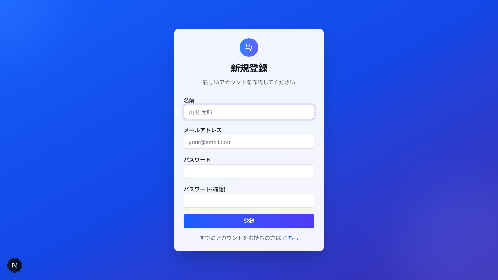
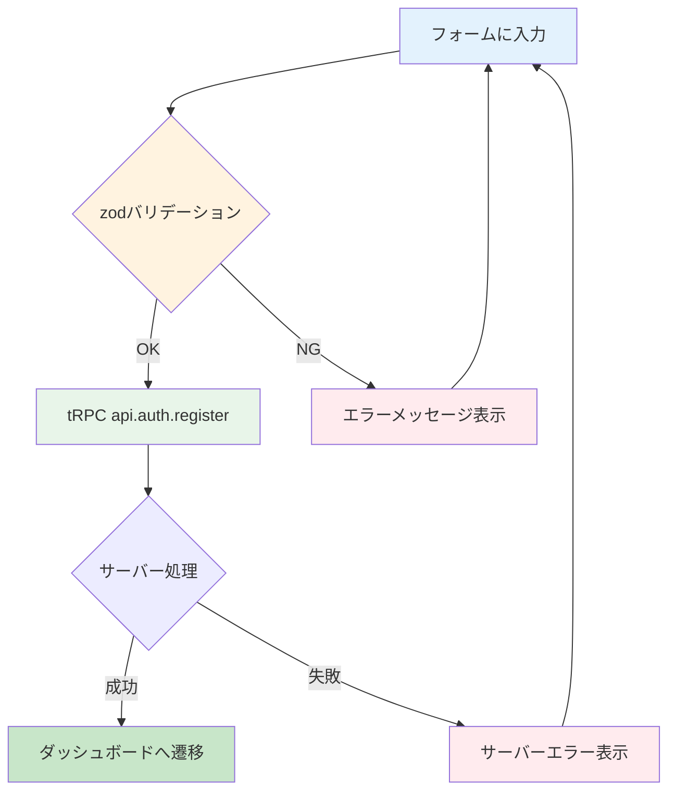

# Day 06: ユーザー登録画面を作ろう

## 🔙 前回の振り返り

Day 05 では react-hook-form と zod を使ってバリデーション付きのログイン画面を作りました。フォーム管理とバリデーションの基本パターンを習得したので、今日は同じパターンを応用してユーザー登録画面を作ります。

---

## 🎯 今日のゴール

Day 05 で学んだ react-hook-form + zod パターンを応用して、ユーザー登録画面を作ります。パスワード確認チェックをはじめ、より高度なバリデーションに挑戦します。

📸 スクリーンショット: 完成したユーザー登録画面（名前・メール・パスワード入力欄がある状態）



## 🤔 なぜこれを作るのか？

ログインするには、まずアカウントが必要です。登録画面では、パスワードの確認入力や複数フィールドをまたぐバリデーションといった、実務でよく使うテクニックを学びます。

> 💡 **例え話**: ユーザー登録は「会員証の申込書」を書く手続きです。名前と連絡先を記入して、暗証番号（パスワード）を決めます。「もう一度暗証番号を書いてください」と確認するのは、銀行の暗証番号設定と一緒ですね。

### 📐 登録処理のフロー



### やること / やらないこと

| やること | やらないこと |
|---------|-------------|
| react-hook-form + zod で登録フォーム | useState で個別管理 |
| `.refine()` でパスワード一致チェック | 手動で if 文比較 |
| tRPC で登録API呼び出し | サーバー側の処理（Day 07） |
| shadcn/ui でカードデザイン | CSS のゼロからの設計 |

### 🆕 新しく学ぶ概念

| 概念 | 読み方 | 役割 | 例え |
|------|--------|------|------|
| `.refine()` | リファイン | 複数フィールドをまたぐカスタムチェック | 会員証の申込書で「暗証番号」と「確認欄」が一致しているか、受付係が見比べるチェック |

## 📊 実装ステップ一覧

| ステップ | 作業内容 | 所要時間 |
|---------|---------|---------|
| Step 1 | ページの土台を作る（import含む） | 5分 |
| Step 2 | zodスキーマを定義する | 7分 |
| Step 3 | react-hook-formを設定する | 5分 |
| Step 4 | 名前・メール入力欄を作る | 7分 |
| Step 5 | パスワード入力欄を作る | 5分 |
| Step 6 | パスワード確認欄を作る | 5分 |
| Step 7 | tRPCで登録APIを呼ぶ | 7分 |
| Step 8 | アイコンとカード見出しを更新する | 3分 |
| Step 9 | エラー表示と送信ボタンを追加する | 5分 |
| Step 10 | ログインへのリンクを追加して完成 | 3分 |

**合計時間**: 約52分

---

### Step 1: ページの土台を作る（5分）

🎯 **ゴール**: 登録ページの基本ファイルを作成し、必要な import をすべて記述します。

> 💡 今回は最初に必要な import をまとめて書きます。Step ごとに何度もファイル先頭に戻る手間を省くためです。

💻 **実装**:

`src/app/register/page.tsx` を新規作成し、以下のコードを書いてください。

```typescript
// filepath: src/app/register/page.tsx
// クライアントコンポーネント宣言と全import
'use client';

import { zodResolver } from '@hookform/resolvers/zod';
import { UserPlus } from 'lucide-react';
import Link from 'next/link';
import { useRouter } from 'next/navigation';
import { useState } from 'react';
import { useForm } from 'react-hook-form';
import { z } from 'zod';
```

✅ **確認ポイント**:
- `src/app/register/page.tsx` を保存した
- この時点ではまだ画面には何も表示されません（コンポーネント本体はまだ書いていないため）

続いて、import の下に shadcn/ui コンポーネントと tRPC の import を追加します。

```typescript
// filepath: src/app/register/page.tsx
// 上の import の続きに追加
import { Button } from '@/component/ui/button';
import {
  Card, CardContent,
  CardDescription, CardHeader, CardTitle,
} from '@/component/ui/card';
import { Input } from '@/component/ui/input';
import { Label } from '@/component/ui/label';
import { api } from '@/trpc/react';
```

✅ **確認ポイント**:
- ファイルを保存した
- `npm run dev` でエラーが出ていない

> 📝 **import パスについて**: このプロジェクトでは `@/component/ui/...` を使います。他の教材やドキュメントでは `@/components/ui/...` と複数形を使う場合もありますが、実際のプロジェクト構成に合わせてください。

次に、ページ本体のコンポーネントを定義します。import の下に追加してください。

```typescript
// filepath: src/app/register/page.tsx
// import群の下に追加（ページ本体）
export default function RegisterPage() {
  return (
    <div className="flex min-h-screen
      items-center justify-center px-4">
      <Card className="w-full max-w-sm">
        <CardHeader>
          <CardTitle>新規登録</CardTitle>
        </CardHeader>
      </Card>
    </div>
  );
}
```

✅ **確認ポイント**:
- `src/app/register/page.tsx` を保存した
- `npm run dev` でエラーが出ていない
- ブラウザで `/register` にアクセスして「新規登録」カードが表示される

---

### Step 2: zodスキーマを定義する（7分）

🎯 **ゴール**: パスワード確認チェック付きのバリデーションスキーマを作ります。

> 💡 **例え話**: `.refine()` は、会員証の申込書で各欄を個別にチェックした後にやる「最終確認」です。各項目が正しくても、「暗証番号」と「暗証番号（確認）」が一致していなければ受理されません。受付係が最後に2つの欄を見比べる作業が `.refine()` です。

💻 **実装**:

`export default function RegisterPage()` の **上**（import群と関数定義の間）に以下を追加します。

```typescript
// filepath: src/app/register/page.tsx
// import群の下、RegisterPage関数の上に追加
const registerSchema = z.object({
  name: z.string()
    .min(1, '名前を入力してください'),
  email: z.string()
    .email('有効なメールアドレスを入力してください'),
  password: z.string()
    .min(8, 'パスワードは8文字以上で入力してください'),
  confirmPassword: z.string()
    .min(1, 'パスワード(確認)を入力してください'),
}).refine(
  // 申込書の暗証番号を見比べるチェック
  (data) => data.password === data.confirmPassword,
  {
    message: 'パスワードが一致しません',
    path: ['confirmPassword'],
  },
);
```

✅ **確認ポイント**:
- ファイルを保存した
- `npm run dev` でエラーが出ていない
- この時点では画面に変化はありません。Step 4 でフォームを作ると、ここで定義したルールが動き出します

続いて、スキーマの直下に型定義を追加します。

```typescript
// filepath: src/app/register/page.tsx
// registerSchemaの直下に追加
type RegisterFormData =
  z.infer<typeof registerSchema>;
```

✅ **確認ポイント**:
- `registerSchema` に `.refine()` が含まれている
- `RegisterFormData` 型が定義されている
- `npm run dev` でエラーが出ていない

#### バリデーションルール一覧

| フィールド | ルール | エラーメッセージ |
|-----------|--------|----------------|
| 名前 | 必須（1文字以上） | 名前を入力してください |
| メール | 必須 + メール形式 | 有効なメールアドレスを入力してください |
| パスワード | 必須 + 8文字以上 | パスワードは8文字以上で入力してください |
| パスワード確認 | 必須 + パスワードと一致 | パスワードが一致しません |

#### `.refine()` のコード解説

| コード | 意味 | 例え |
|--------|------|------|
| `.refine(fn, opts)` | カスタムバリデーションを追加 | 申込書の最終チェック項目を追加する |
| `data.password === data.confirmPassword` | 2つのフィールドを比較 | 暗証番号の2つの欄を見比べる |
| `path: ['confirmPassword']` | エラーの表示先を指定 | 「確認欄」に赤線を引く |


---

### Step 3: react-hook-formを設定する（5分）

🎯 **ゴール**: Day 05 と同じパターンで useForm を設定します。

💻 **実装**:

`export default function RegisterPage()` の `{` の直後（`return` の前）に以下を追加します。

```typescript
// filepath: src/app/register/page.tsx
// RegisterPage() { の直後、return の前に追加
const {
  register,
  handleSubmit,
  formState: { errors },
} = useForm<RegisterFormData>({
  resolver: zodResolver(registerSchema),
});

// 仮の送信処理（Step 7で書き換えます）
const onSubmit = async (
  data: RegisterFormData
) => {
  console.log('登録データ:', data);
};
```

✅ **確認ポイント**:
- ファイルを保存した
- `npm run dev` でエラーが出ていない
- ブラウザで `/register` にアクセスしてエラーが出ていない
- この時点ではまだフォーム欄は表示されません。Step 4 で入力欄を作ります

> 💡 Day 05 で学んだ `useForm` + `zodResolver` のパターンと全く同じ構造です。react-hook-form の良いところは、フォームの項目が増えてもコードの構造が変わらないことです。

---

### Step 4: 名前・メール入力欄を作る（7分）

🎯 **ゴール**: 名前とメールアドレスの入力欄をフォームに追加します。

💻 **実装**:

`return` 文の中にある `<CardHeader>...</CardHeader>` の直後に `<CardContent>` を追加します。

```typescript
// filepath: src/app/register/page.tsx
// </CardHeader> の直後に追加
<CardContent>
  <form onSubmit={handleSubmit(onSubmit)}
    className="space-y-4">
    <div className="space-y-2">
      <Label htmlFor="name">名前</Label>
      <Input
        id="name"
        type="text"
        placeholder="山田 太郎"
        autoComplete="name"
        autoFocus
        {...register('name')}
      />
      {errors.name && (
        <p className="text-sm text-destructive">
          {errors.name.message}
        </p>
      )}
    </div>
  </form>
</CardContent>
```

✅ **確認ポイント**:
- ファイルを保存した
- ブラウザに名前入力欄が表示されている

次に、`<form>` の中で名前入力欄（`</div>` の後）にメール入力欄を追加します。

```typescript
// filepath: src/app/register/page.tsx
// <form>内、名前入力欄の </div> の後に追加
<div className="space-y-2">
  <Label htmlFor="email">
    メールアドレス
  </Label>
  <Input
    id="email"
    type="email"
    placeholder="your@email.com"
    autoComplete="email"
    {...register('email')}
  />
  {errors.email && (
    <p className="text-sm text-destructive">
      {errors.email.message}
    </p>
  )}
</div>
```

✅ **確認ポイント**:
- 名前欄とメール欄が表示されている
- 空のまま送信するとエラーメッセージが出る

📸 スクリーンショット: 名前とメールアドレスの入力欄が表示された状態


---

### Step 5: パスワード入力欄を作る（5分）

🎯 **ゴール**: パスワード入力欄を追加します。

💻 **実装**:

`<form>` の中で、メール入力欄の `</div>` の後に追加します。

```typescript
// filepath: src/app/register/page.tsx
// <form>内、メール入力欄の </div> の後に追加
<div className="space-y-2">
  <Label htmlFor="password">
    パスワード
  </Label>
  <Input
    id="password"
    type="password"
    autoComplete="new-password"
    {...register('password')}
  />
  {errors.password && (
    <p className="text-sm text-destructive">
      {errors.password.message}
    </p>
  )}
</div>
```

✅ **確認ポイント**:
- パスワード欄が表示されている
- 7文字以下で送信するとエラーが出る

> 💡 `autoComplete="new-password"` を指定すると、ブラウザが「新しいパスワードの入力欄」と認識します。既存パスワードの自動入力を防げます。

---

### Step 6: パスワード確認欄を作る（5分）

🎯 **ゴール**: パスワード確認入力欄を追加し、一致チェックを動作させます。

> 💡 会員証の申込書で「暗証番号を2回書いてください」と求められるのと同じです。Step 2 で `.refine()` を設定済みなので、コードを追加するだけで自動的にチェックされます。

💻 **実装**:

`<form>` の中で、パスワード入力欄の `</div>` の後に追加します。

```typescript
// filepath: src/app/register/page.tsx
// <form>内、パスワード入力欄の </div> の後に追加
<div className="space-y-2">
  <Label htmlFor="confirmPassword">
    パスワード(確認)
  </Label>
  <Input
    id="confirmPassword"
    type="password"
    autoComplete="new-password"
    {...register('confirmPassword')}
  />
  {errors.confirmPassword && (
    <p className="text-sm text-destructive">
      {errors.confirmPassword.message}
    </p>
  )}
</div>
```

✅ **確認ポイント**:
- パスワード確認欄が表示されている
- 異なるパスワードで送信すると「パスワードが一致しません」エラーが出る

📸 スクリーンショット: 名前・メール・パスワード・パスワード確認の4つの入力欄が揃ったフォーム


---

### Step 7: tRPCで登録APIを呼ぶ（7分）

🎯 **ゴール**: 登録ボタンを押したら、サーバーにユーザー情報を送信します。

💻 **実装**:

`RegisterPage()` の中で、`useForm` の設定の後に以下を追加します（Step 3 で書いた `onSubmit` は削除してください）。

```typescript
// filepath: src/app/register/page.tsx
// RegisterPage内、useFormの設定の後に追加
const router = useRouter();
const [error, setError] =
  useState<string | null>(null);

// tRPCの登録API呼び出し
const registerMutation =
  api.auth.register.useMutation({
    onSuccess: () => {
      router.push('/dashboard');
      router.refresh();
    },
    onError: (error) => {
      setError(
        error.message || 'ユーザー登録中にエラーが発生しました'
      );
    },
  });
```

✅ **確認ポイント**:
- ファイルを保存した
- `npm run dev` でエラーが出ていない

続いて、Step 3 で書いた仮の `onSubmit` を以下に書き換えます。

```typescript
// filepath: src/app/register/page.tsx
// Step 3の仮のonSubmitを書き換え
const onSubmit = async (
  data: RegisterFormData
) => {
  setError(null);
  // confirmPasswordはサーバーに送らない
  registerMutation.mutate({
    name: data.name,
    email: data.email,
    password: data.password,
  });
};
```

✅ **確認ポイント**:
- `registerMutation` が定義されている
- `onSubmit` で `confirmPassword` を除外して送信している
- `npm run dev` でエラーが出ていない

> 💡 `confirmPassword` はフロントエンド専用のフィールドです。会員証の申込書で暗証番号を2回書くのはあくまで記入ミス防止のため。受付窓口（サーバー）に渡すのは `name`, `email`, `password` の3つだけです。

---

### Step 8: アイコンとカード見出しを更新する（3分）

🎯 **ゴール**: カードヘッダーにアイコンと説明文を追加します。

💻 **実装**:

`return` 文の中にある `<CardHeader>` を以下のコードに丸ごと書き換えます。

```typescript
// filepath: src/app/register/page.tsx
// 既存の <CardHeader>...</CardHeader> を書き換え
<CardHeader
  className="space-y-1 text-center">
  <div className="flex justify-center mb-2">
    <div className="rounded-full
      bg-secondary p-2">
      <UserPlus className="h-6 w-6
        text-secondary-foreground" />
    </div>
  </div>
  <CardTitle className="text-2xl">
    新規登録
  </CardTitle>
  <CardDescription>
    新しいアカウントを作成してください
  </CardDescription>
</CardHeader>
```

✅ **確認ポイント**:
- 人型アイコンが表示されている
- 「新しいアカウントを作成してください」と表示されている

> 💡 ログイン画面では `bg-primary`（メインカラー）を使いましたが、登録画面では `bg-secondary`（サブカラー）を使っています。ページごとに色を変えることで、ユーザーが「今どのページにいるか」を直感的に判断できます。

---

### Step 9: エラー表示と送信ボタンを追加する（5分）

🎯 **ゴール**: サーバーエラーの表示と送信ボタンを追加します。

💻 **実装**:

`<form>` タグの直後（最初の入力欄の前）にサーバーエラー表示を追加します。

```typescript
// filepath: src/app/register/page.tsx
// <form ...> の直後、名前入力欄の前に追加
{error && (
  <div className="rounded-md
    bg-destructive/15 p-3
    text-sm text-destructive">
    {error}
  </div>
)}
```

✅ **確認ポイント**:
- ファイルを保存した
- `npm run dev` でエラーが出ていない

次に、パスワード確認欄の `</div>` の後（`</form>` の前）に送信ボタンを追加します。

```typescript
// filepath: src/app/register/page.tsx
// パスワード確認欄の後、</form> の前に追加
<Button
  type="submit"
  className="w-full"
  disabled={registerMutation.isPending}>
  {registerMutation.isPending
    ? '登録中...'
    : '登録'}
</Button>
```

✅ **確認ポイント**:
- 「登録」ボタンが表示されている
- ボタンをクリックするとバリデーションが動く

---

### Step 10: ログインへのリンクを追加して完成（3分）

🎯 **ゴール**: ログインページへのリンクを追加して、登録画面を完成させます。

💻 **実装**:

`<Button>` の直後（`</form>` の前）にリンクを追加します。

```typescript
// filepath: src/app/register/page.tsx
// Buttonの後、</form> の前に追加
<div className="text-center text-sm">
  すでにアカウントをお持ちの方は{' '}
  <Link
    href="/login"
    className="underline
      underline-offset-4
      hover:text-primary">
    こちら
  </Link>
</div>
```

✅ **確認ポイント**:
- 「すでにアカウントをお持ちの方は」リンクが表示される
- リンクをクリックするとログインページに遷移する
- 登録成功でダッシュボードに遷移する

📸 スクリーンショット: デザインが整った登録画面の完成形


---

## 🏁 完成コード全体

途中で迷った場合は、以下のコードをそのまま `src/app/register/page.tsx` にコピーしてください。

**import 部分**:

```typescript
// filepath: src/app/register/page.tsx
// 完成版: import部分
'use client';

import { zodResolver } from '@hookform/resolvers/zod';
import { UserPlus } from 'lucide-react';
import Link from 'next/link';
import { useRouter } from 'next/navigation';
import { useState } from 'react';
import { useForm } from 'react-hook-form';
import { z } from 'zod';
```

```typescript
// filepath: src/app/register/page.tsx
// 完成版: shadcn/ui と tRPC の import
import { Button } from '@/component/ui/button';
import {
  Card, CardContent,
  CardDescription, CardHeader, CardTitle,
} from '@/component/ui/card';
import { Input } from '@/component/ui/input';
import { Label } from '@/component/ui/label';
import { api } from '@/trpc/react';
```

**zodスキーマと型定義**:

```typescript
// filepath: src/app/register/page.tsx
// 完成版: バリデーションスキーマ
const registerSchema = z.object({
  name: z.string()
    .min(1, '名前を入力してください'),
  email: z.string()
    .email('有効なメールアドレスを入力してください'),
  password: z.string()
    .min(8, 'パスワードは8文字以上で入力してください'),
  confirmPassword: z.string()
    .min(1, 'パスワード(確認)を入力してください'),
}).refine(
  (data) => data.password === data.confirmPassword,
  {
    message: 'パスワードが一致しません',
    path: ['confirmPassword'],
  },
);

type RegisterFormData =
  z.infer<typeof registerSchema>;
```

**コンポーネント本体（ロジック部分）**:

```typescript
// filepath: src/app/register/page.tsx
// 完成版: RegisterPage関数の前半
export default function RegisterPage() {
  const router = useRouter();
  const [error, setError] =
    useState<string | null>(null);
  const {
    register, handleSubmit,
    formState: { errors },
  } = useForm<RegisterFormData>({
    resolver: zodResolver(registerSchema),
  });
```

```typescript
// filepath: src/app/register/page.tsx
// 完成版: mutation と onSubmit
  const registerMutation =
    api.auth.register.useMutation({
      onSuccess: () => {
        router.push('/dashboard');
        router.refresh();
      },
      onError: (error) => {
        setError(
          error.message
          ?? 'ユーザー登録中にエラーが発生しました'
        );
      },
    });
  const onSubmit = async (
    data: RegisterFormData
  ) => {
    setError(null);
    registerMutation.mutate({
      name: data.name,
      email: data.email,
      password: data.password,
    });
  };
```

**JSX（表示部分）**:

```typescript
// filepath: src/app/register/page.tsx
// 完成版: return文 - CardHeaderまで
  return (
    <div className="flex min-h-screen
      items-center justify-center px-4">
      <Card className="w-full max-w-sm">
        <CardHeader
          className="space-y-1 text-center">
          <div className="flex justify-center mb-2">
            <div className="rounded-full
              bg-secondary p-2">
              <UserPlus className="h-6 w-6
                text-secondary-foreground" />
            </div>
          </div>
          <CardTitle className="text-2xl">
            新規登録
          </CardTitle>
          <CardDescription>
            新しいアカウントを作成してください
          </CardDescription>
        </CardHeader>
```

```typescript
// filepath: src/app/register/page.tsx
// 完成版: CardContent - 名前・メール欄
        <CardContent>
          <form
            onSubmit={handleSubmit(onSubmit)}
            className="space-y-4">
            {error && (
              <div className="rounded-md
                bg-destructive/15 p-3
                text-sm text-destructive">
                {error}
              </div>
            )}
            <div className="space-y-2">
              <Label htmlFor="name">名前</Label>
              <Input id="name" type="text"
                placeholder="山田 太郎"
                autoComplete="name" autoFocus
                {...register('name')} />
              {errors.name && (
                <p className="text-sm text-destructive">
                  {errors.name.message}</p>)}
            </div>
```

```typescript
// filepath: src/app/register/page.tsx
// 完成版: メール・パスワード欄
            <div className="space-y-2">
              <Label htmlFor="email">
                メールアドレス</Label>
              <Input id="email" type="email"
                placeholder="your@email.com"
                autoComplete="email"
                {...register('email')} />
              {errors.email && (
                <p className="text-sm text-destructive">
                  {errors.email.message}</p>)}
            </div>
            <div className="space-y-2">
              <Label htmlFor="password">
                パスワード</Label>
              <Input id="password" type="password"
                autoComplete="new-password"
                {...register('password')} />
              {errors.password && (
                <p className="text-sm text-destructive">
                  {errors.password.message}</p>)}
            </div>
```

```typescript
// filepath: src/app/register/page.tsx
// 完成版: パスワード確認欄
            <div className="space-y-2">
              <Label htmlFor="confirmPassword">
                パスワード(確認)</Label>
              <Input id="confirmPassword"
                type="password"
                autoComplete="new-password"
                {...register('confirmPassword')} />
              {errors.confirmPassword && (
                <p className="text-sm text-destructive">
                  {errors.confirmPassword.message}
                </p>)}
            </div>
```

```typescript
// filepath: src/app/register/page.tsx
// 完成版: ボタン・リンク・閉じタグ
            <Button type="submit" className="w-full"
              disabled={registerMutation.isPending}>
              {registerMutation.isPending
                ? '登録中...' : '登録'}
            </Button>
            <div className="text-center text-sm">
              すでにアカウントをお持ちの方は{' '}
              <Link href="/login"
                className="underline
                  underline-offset-4
                  hover:text-primary">
                こちら</Link>
            </div>
          </form>
        </CardContent>
      </Card>
    </div>
  );
}
```

---

## 🔍 Day 05（ログイン）と Day 06（登録）の比較

| 項目 | Day 05 ログイン | Day 06 登録 |
|------|----------------|-------------|
| アイコン | `Lock`（鍵） | `UserPlus`（人型+） |
| アイコン背景色 | `bg-primary` | `bg-secondary` |
| フィールド数 | 2つ（email, password） | 4つ（name, email, password, confirmPassword） |
| バリデーション | 基本チェックのみ | `.refine()` でクロスチェック |
| トースト通知 | `react-hot-toast` で成功通知 | なし（登録後はそのままダッシュボードへ遷移する設計のため省略） |
| Suspense | 必要（`useSearchParams` 使用） | 不要（`useSearchParams` 未使用） |

## 📋 今日のまとめ

- [ ] Day 05 のパターンを応用して登録フォームを作れた
- [ ] `.refine()` でパスワード一致チェックを実装できた
- [ ] 4つの入力フィールドを react-hook-form で管理できた
- [ ] `confirmPassword` を除外してAPIに送信できた
- [ ] ローディング・エラー表示を実装できた

## ⚠️ つまずきポイント

| エラー / 問題 | 原因 | 解決方法 |
|--------------|------|---------|
| パスワード一致エラーが出ない | `.refine()` の `path` 指定漏れ | `path: ['confirmPassword']` を追加 |
| 登録後にページが変わらない | `router.refresh()` の呼び忘れ | `onSuccess` で `router.refresh()` を呼ぶ |
| 「このメールは登録済み」エラー | 同じメールで二度登録 | 別のメールアドレスで試す |
| 型エラーが出る | `confirmPassword` をAPIに送っている | `mutate` で必要なフィールドだけ指定 |

## 📝 今日学んだ用語

| 用語 | 意味 |
|------|------|
| `.refine()` | 複数フィールドにまたがるカスタムバリデーション |
| `path` | エラーメッセージの表示先フィールドを指定する |
| `autoComplete` | ブラウザの自動入力の種類を指示する HTML 属性 |
| `confirmPassword` | パスワード確認用のフロントエンド専用フィールド |

## 🔜 次回予告

Day 07 では、今日作った登録画面と Day 05 のログイン画面が実際にどう動いているのか、裏側の仕組みを学びます。jose（JWT HS256）と HTTP-only Cookie を使った認証の流れと、サーバー側でのセッション管理を理解しましょう。
