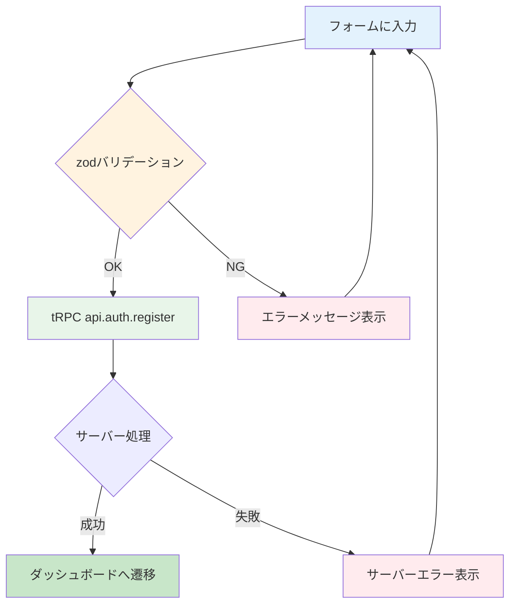

# Day 06: ユーザー登録画面を作ろう

## 🎯 今日のゴール

Day 05 で学んだ react-hook-form + zod パターンを応用して、ユーザー登録画面を作ります。パスワード確認チェックをはじめ、より高度なバリデーションに挑戦します。


## 🤔 なぜこれを作るのか？

ログインするには、まずアカウントが必要です。登録画面では、パスワードの確認入力や複数フィールドをまたぐバリデーションといった、実務でよく使うテクニックを学びます。

> 💡 **例え話**: ユーザー登録は「会員証の発行手続き」です。名前と連絡先を書いて、パスワード（暗証番号）を決めます。「もう一度パスワードを書いてください」と確認するのは、銀行の暗証番号設定と一緒ですね。

### 📐 登録処理のフロー



### やること / やらないこと

| やること | やらないこと |
|---------|-------------|
| react-hook-form + zod で登録フォーム | useState で個別管理 |
| `.refine()` でパスワード一致チェック | 手動で if 文比較 |
| tRPC で登録API呼び出し | サーバー側の処理（Day 7） |
| shadcn/ui でカードデザイン | CSS のゼロからの設計 |

### 🆕 新しく学ぶ概念

| 概念 | 読み方 | 役割 | 例え |
|------|--------|------|------|
| `.refine()` | リファイン | 複数フィールドをまたぐカスタムチェック | 「パスワード欄と確認欄が一致してる？」と書類を見比べるチェック |

## 📊 実装ステップ一覧

| ステップ | 作業内容 | 所要時間 |
|---------|---------|---------|
| Step 1 | ページの土台を作る | 3分 |
| Step 2 | zodスキーマを定義する | 7分 |
| Step 3 | react-hook-formを設定する | 5分 |
| Step 4 | 名前・メール入力欄を作る | 7分 |
| Step 5 | パスワード入力欄を作る | 5分 |
| Step 6 | パスワード確認欄を作る | 5分 |
| Step 7 | tRPCで登録APIを呼ぶ | 7分 |
| Step 8 | デザインを整えて仕上げる | 5分 |

**合計時間**: 約44分

---

### Step 1: ページの土台を作る（3分）

🎯 **ゴール**: 登録ページの基本ファイルを作成します。

💻 **実装**:

```typescript
// filepath: src/app/register/page.tsx
// クライアントコンポーネント宣言とimport
'use client';

import { Button } from '@/component/ui/button';
import {
  Card,
  CardContent,
  CardDescription,
  CardHeader,
  CardTitle,
} from '@/component/ui/card';
import { Input } from '@/component/ui/input';
import { Label } from '@/component/ui/label';
```

続いて、ページ本体のコンポーネントを定義します。

```typescript
// filepath: src/app/register/page.tsx
// ページ本体
export default function RegisterPage() {
  return (
    <div className="flex min-h-screen
      items-center justify-center px-4">
      <Card className="w-full max-w-sm">
        <CardHeader>
          <CardTitle>新規登録</CardTitle>
        </CardHeader>
      </Card>
    </div>
  );
}
```

✅ **確認ポイント**:
- `src/app/register/page.tsx` を保存した
- `npm run dev` でエラーが出ていない
- ブラウザで `/register` にアクセスして「新規登録」と表示される

---

### Step 2: zodスキーマを定義する（7分）

🎯 **ゴール**: パスワード確認チェック付きのバリデーションスキーマを作ります。

> 💡 **例え話**: `.refine()` は、個別チェックの後にやる「クロスチェック」です。各項目が正しくても、「パスワード」と「パスワード確認」が一致していなければダメ。受付係が最後に「2つの欄を見比べて確認する」作業が `.refine()` です。

💻 **実装**:

import文の下に追加します。

```typescript
// filepath: src/app/register/page.tsx
import { zodResolver } from '@hookform/resolvers/zod';
import { useForm } from 'react-hook-form';
import { z } from 'zod';

// バリデーションルールを定義
const registerSchema = z.object({
  name: z.string()
    .min(1, '名前を入力してください'),
  email: z.string()
    .email('有効なメールアドレスを入力してください'),
  password: z.string()
    .min(8, 'パスワードは8文字以上で入力してください'),
  confirmPassword: z.string()
    .min(1, 'パスワード(確認)を入力してください'),
}).refine(
  // パスワード一致チェック
  (data) => data.password === data.confirmPassword,
  {
    message: 'パスワードが一致しません',
    path: ['confirmPassword'],
  },
);
```

```typescript
// filepath: src/app/register/page.tsx
// スキーマから型を自動生成
type RegisterFormData =
  z.infer<typeof registerSchema>;
```

✅ **確認ポイント**:
- `registerSchema` に `.refine()` が含まれている
- `RegisterFormData` 型が定義されている
- `npm run dev` でエラーが出ていない

#### バリデーションルール一覧

| フィールド | ルール | エラーメッセージ |
|-----------|--------|----------------|
| 名前 | 必須（1文字以上） | 名前を入力してください |
| メール | 必須 + メール形式 | 有効なメールアドレスを入力してください |
| パスワード | 必須 + 8文字以上 | パスワードは8文字以上で入力してください |
| パスワード確認 | 必須 + パスワードと一致 | パスワードが一致しません |

#### `.refine()` のコード解説

| コード | 意味 | 例え |
|--------|------|------|
| `.refine(fn, opts)` | カスタムバリデーションを追加 | 最終チェック項目を追加する |
| `data.password === data.confirmPassword` | 2つのフィールドを比較 | 2枚の書類を見比べる |
| `path: ['confirmPassword']` | エラーの表示先を指定 | 「確認欄」に赤線を引く |

✅ **確認ポイント**:
- `registerSchema` に `.refine()` が含まれている
- `RegisterFormData` 型が定義されている
- `npm run dev` でエラーが出ていない

---

### Step 3: react-hook-formを設定する（5分）

🎯 **ゴール**: Day 05 と同じパターンで useForm を設定します。

💻 **実装**:

RegisterPage コンポーネント内の先頭に追加します。

```typescript
// filepath: src/app/register/page.tsx
// RegisterPage内の先頭に追加
const {
  register,
  handleSubmit,
  formState: { errors },
} = useForm<RegisterFormData>({
  resolver: zodResolver(registerSchema),
});

// 仮の送信処理
const onSubmit = (data: RegisterFormData) => {
  console.log('登録データ:', data);
};
```

> 💡 Day 05 で学んだ `useForm` + `zodResolver` のパターンと全く同じ構造です。react-hook-form の良いところは、フォームの項目が増えてもコードの構造が変わらないことです。

✅ **確認ポイント**:
- `useForm` の設定を追加した
- Day 05 のログインフォームと構造が同じことを確認

---

### Step 4: 名前・メール入力欄を作る（7分）

🎯 **ゴール**: 名前とメールアドレスの入力欄をフォームに追加します。

💻 **実装**:

CardContent の中に form を追加します。

```typescript
// filepath: src/app/register/page.tsx
// CardContent内に追加
<CardContent>
  <form onSubmit={handleSubmit(onSubmit)}
    className="space-y-4">
    <div className="space-y-2">
      <Label htmlFor="name">名前</Label>
      <Input
        id="name"
        type="text"
        placeholder="山田 太郎"
        autoComplete="name"
        autoFocus
        {...register('name')}
      />
      {errors.name && (
        <p className="text-sm text-destructive">
          {errors.name.message}
        </p>
      )}
    </div>
  </form>
</CardContent>
```

名前入力欄の下にメール入力欄を追加します。

```typescript
// filepath: src/app/register/page.tsx
// 名前入力欄の下に追加
<div className="space-y-2">
  <Label htmlFor="email">
    メールアドレス
  </Label>
  <Input
    id="email"
    type="email"
    placeholder="your@email.com"
    autoComplete="email"
    {...register('email')}
  />
  {errors.email && (
    <p className="text-sm text-destructive">
      {errors.email.message}
    </p>
  )}
</div>
```

✅ **確認ポイント**:
- 名前欄とメール欄が表示されている
- 空のまま送信するとエラーメッセージが出る

---

### Step 5: パスワード入力欄を作る（5分）

🎯 **ゴール**: パスワード入力欄を追加します。

💻 **実装**:

メール入力欄の下に追加します。

```typescript
// filepath: src/app/register/page.tsx
// メール入力欄の下に追加
<div className="space-y-2">
  <Label htmlFor="password">
    パスワード
  </Label>
  <Input
    id="password"
    type="password"
    autoComplete="new-password"
    {...register('password')}
  />
  {errors.password && (
    <p className="text-sm text-destructive">
      {errors.password.message}
    </p>
  )}
</div>
```

> 💡 `autoComplete="new-password"` を指定すると、ブラウザが「新しいパスワードの入力欄」と認識します。既存パスワードの自動入力を防げます。

✅ **確認ポイント**:
- パスワード欄が表示されている
- 7文字以下で送信するとエラーが出る

---

### Step 6: パスワード確認欄を作る（5分）

🎯 **ゴール**: パスワード確認入力欄を追加し、一致チェックを動作させます。

💻 **実装**:

パスワード入力欄の下に追加します。

```typescript
// filepath: src/app/register/page.tsx
// パスワード入力欄の下に追加
<div className="space-y-2">
  <Label htmlFor="confirmPassword">
    パスワード(確認)
  </Label>
  <Input
    id="confirmPassword"
    type="password"
    autoComplete="new-password"
    {...register('confirmPassword')}
  />
  {errors.confirmPassword && (
    <p className="text-sm text-destructive">
      {errors.confirmPassword.message}
    </p>
  )}
</div>
```

> 💡 Step 2 で `.refine()` を定義したので、パスワードと確認が一致しない場合、`errors.confirmPassword` にエラーが自動的にセットされます。追加のコードは不要です。

✅ **確認ポイント**:
- パスワード確認欄が表示されている
- 異なるパスワードで送信すると「パスワードが一致しません」エラーが出る


---

### Step 7: tRPCで登録APIを呼ぶ（7分）

🎯 **ゴール**: 登録ボタンを押したら、サーバーにユーザー情報を送信します。

💻 **実装**:

import文を追加します。

```typescript
// filepath: src/app/register/page.tsx
import { api } from '@/trpc/react';
import { useRouter } from 'next/navigation';
import { useState } from 'react';
```

RegisterPage 内の先頭を更新します。

```typescript
// filepath: src/app/register/page.tsx
// RegisterPage内の先頭に追加
const router = useRouter();
const [error, setError] =
  useState<string | null>(null);

// tRPCの登録API呼び出し
const registerMutation =
  api.auth.register.useMutation({
    onSuccess: () => {
      router.push('/dashboard');
      router.refresh();
    },
    onError: (error) => {
      setError(
        error.message
        || 'ユーザー登録中にエラーが発生しました'
      );
    },
  });
```

onSubmit を更新します。

```typescript
// filepath: src/app/register/page.tsx
// onSubmit関数を書き換え
const onSubmit = (data: RegisterFormData) => {
  setError(null);
  // confirmPasswordはサーバーに送らない
  registerMutation.mutate({
    name: data.name,
    email: data.email,
    password: data.password,
  });
};
```

> 💡 `confirmPassword` はフロントエンド専用のフィールドです。パスワードの一致確認はクライアント側で完了しているので、サーバーには `name`, `email`, `password` の3つだけ送ります。

✅ **確認ポイント**:
- `registerMutation` が定義されている
- `onSubmit` で `confirmPassword` を除外して送信している
- `npm run dev` でエラーが出ていない

---

### Step 8: デザインを整えて仕上げる（5分）

🎯 **ゴール**: カードヘッダーのアイコン、エラー表示、ローディング、ログインリンクを追加して完成させます。

💻 **実装**:

import文を追加します。

```typescript
// filepath: src/app/register/page.tsx
import { UserPlus } from 'lucide-react';
import Link from 'next/link';
```

CardHeader を更新します。

```typescript
// filepath: src/app/register/page.tsx
// CardHeaderを書き換え
<CardHeader
  className="space-y-1 text-center">
  <div className="flex justify-center mb-2">
    <div className="rounded-full
      bg-secondary p-2">
      <UserPlus className="h-6 w-6
        text-secondary-foreground" />
    </div>
  </div>
  <CardTitle className="text-2xl">
    新規登録
  </CardTitle>
  <CardDescription>
    新しいアカウントを作成してください
  </CardDescription>
</CardHeader>
```

form直下にサーバーエラー表示を追加します。

```typescript
// filepath: src/app/register/page.tsx
// form直下に追加
{error && (
  <div className="rounded-md
    bg-destructive/15 p-3
    text-sm text-destructive">
    {error}
  </div>
)}
```

確認欄の下にボタンとリンクを追加します。

```typescript
// filepath: src/app/register/page.tsx
// 確認欄の下に追加
<Button
  type="submit"
  className="w-full"
  disabled={registerMutation.isPending}>
  {registerMutation.isPending
    ? '登録中...'
    : '登録'}
</Button>
<div className="text-center text-sm">
  すでにアカウントをお持ちの方は{' '}
  <Link
    href="/login"
    className="underline
      underline-offset-4
      hover:text-primary">
    こちら
  </Link>
</div>
```

✅ **確認ポイント**:
- 人型アイコンが表示されている
- 「すでにアカウントをお持ちの方は」リンクが表示される
- 登録成功でダッシュボードに遷移する


---

## 📋 今日のまとめ

- [ ] Day 05 のパターンを応用して登録フォームを作れた
- [ ] `.refine()` でパスワード一致チェックを実装できた
- [ ] 4つの入力フィールドを react-hook-form で管理できた
- [ ] `confirmPassword` を除外してAPIに送信できた
- [ ] ローディング・エラー表示を実装できた

## ⚠️ つまずきポイント

| エラー / 問題 | 原因 | 解決方法 |
|--------------|------|---------|
| パスワード一致エラーが出ない | `.refine()` の `path` 指定漏れ | `path: ['confirmPassword']` を追加 |
| 登録後にページが変わらない | `router.refresh()` の呼び忘れ | `onSuccess` で `router.refresh()` を呼ぶ |
| 「このメールは登録済み」エラー | 同じメールで二度登録 | 別のメールアドレスで試す |
| 型エラーが出る | `confirmPassword` をAPIに送っている | `mutate` で必要なフィールドだけ指定 |

## 📝 今日学んだ用語

| 用語 | 意味 |
|------|------|
| `.refine()` | 複数フィールドにまたがるカスタムバリデーション |
| `path` | エラーメッセージの表示先フィールドを指定する |
| `autoComplete` | ブラウザの自動入力の種類を指示する HTML 属性 |
| `confirmPassword` | パスワード確認用のフロントエンド専用フィールド |

## 🔜 次回予告

Day 07 では、ログイン・登録の裏側の仕組みを学びます。JWT（ジェイ・ダブリュー・ティー）というトークンを使った認証の仕組みと、サーバー側の処理を理解します。
