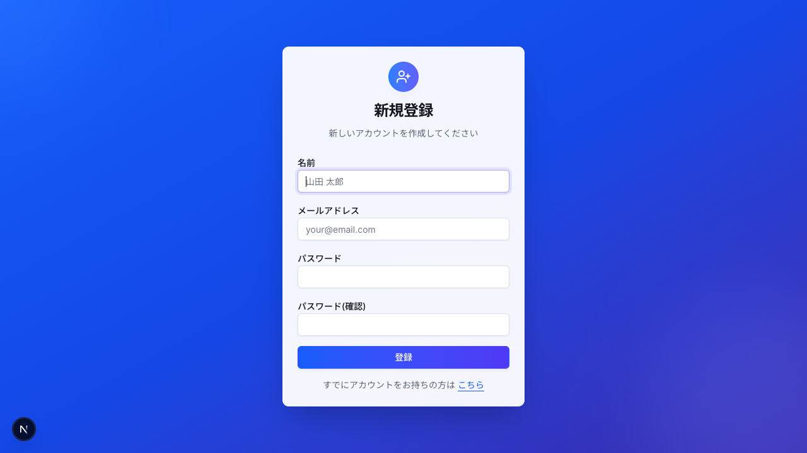
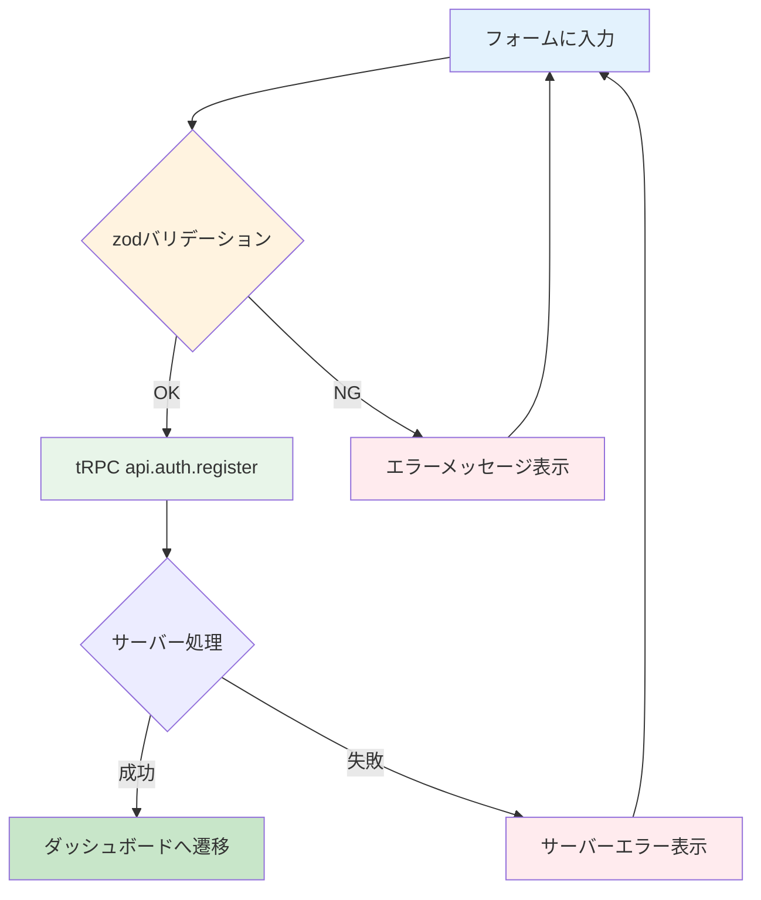
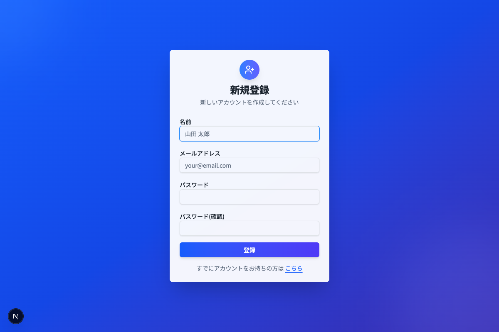
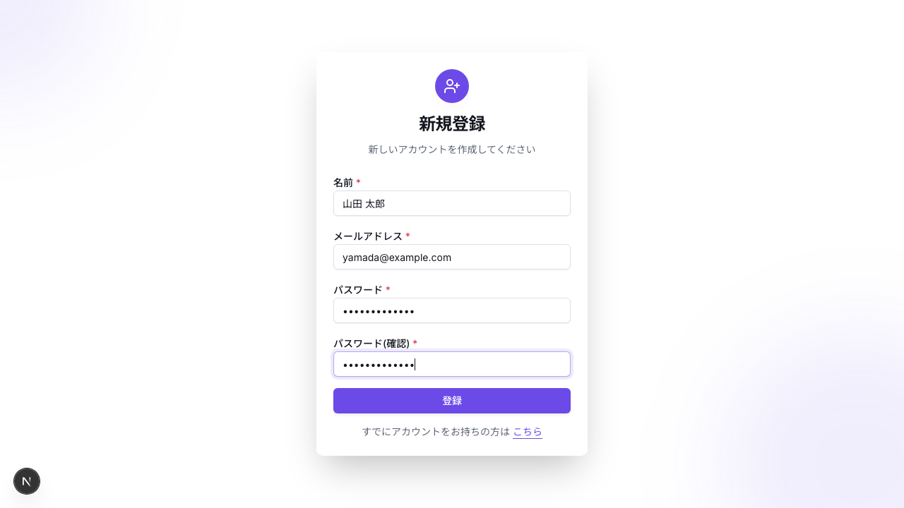

# Day 06: ユーザー登録画面を作ろう

## 前回の振り返り

Day 05 では react-hook-form と zod を使ってバリデーション付きのログイン画面を作りました。フォーム管理とバリデーションの基本パターンを習得したので、今日はその応用に進みます。

---

## 今日のゴール

Day 05 で学んだ react-hook-form + zod パターンを応用して、ユーザー登録画面を作ります。パスワード確認チェックをはじめ、より高度なバリデーションに挑戦します。

スクリーンショット: 完成したユーザー登録画面（名前・メール・パスワード入力欄がある状態）



## 始める前の前提

- Day 05 のログイン画面を作り終えている
- `src/app/register/page.tsx` を新規作成できる
- `react-hook-form` と `zod` の基本形を見たことがある
- 登録 API のサーバー内部は Day 07 で確認するため、今日はフォーム作成と送信体験に集中する

## なぜこれを作るのか

ログインするには、まずアカウントが必要です。登録画面では、パスワードの確認入力や複数フィールドをまたぐバリデーションといった、実務でよく使うテクニックを学びます。

> **例え話**: ユーザー登録は「会員証の申込書」を書く手続きです。名前と連絡先を記入して、暗証番号（パスワード）を決めます。「もう一度暗証番号を書いてください」と確認するのは、銀行の暗証番号設定と同じ仕組みです。

### 登録処理のフロー


```mermaid
flowchart TD
    A[フォームに入力] --> B{zodバリデーション}
    B -->|OK| C[tRPC api.auth.register]
    B -->|NG| D[エラーメッセージ表示]
    D --> A
    C --> E{サーバー処理}
    E -->|成功| F[ダッシュボードへ遷移]
    E -->|失敗| G[サーバーエラー表示]
    G --> A

    style A fill:#e3f2fd
    style B fill:#fff3e0
    style C fill:#e8f5e9
    style F fill:#c8e6c9
    style D fill:#ffebee
    style G fill:#ffebee
```

この図で目を留めてほしいのは、`B` の菱形から矢印が2本出ているところです。zod の検査に落ちた入力は `D` へ流れ、`C` のサーバー呼び出しまで届きません。画面側のバリデーションは、送信ボタンとサーバーの間に立って通信そのものを止めています。

ただしこの関門はブラウザの中にしかありません。通信を自分で組み立てて送れば `C` から始められるので、Day 07 で読むサーバー側でも同じ検査をやり直します。画面側は入力ミスをその場で知らせるため、サーバー側は不正な登録を通さないためにあります。役割が違うので、片方があればもう片方はいらない、とはなりません。

### やること / やらないこと

| やること | やらないこと |
|---------|-------------|
| react-hook-form + zod で登録フォーム | useState で個別管理 |
| `.refine()` でパスワード一致チェック | 手動で if 文比較 |
| tRPC で登録API呼び出し | サーバー側の処理（Day 07） |
| shadcn/ui でカードデザイン | CSS のゼロからの設計 |

### 新しく学ぶ概念

| 概念 | 読み方 | 役割 | 例え |
|------|--------|------|------|
| `.refine()` | リファイン | 複数フィールドをまたぐカスタムチェック | 会員証の申込書で「暗証番号」と「確認欄」が一致しているか、受付係が見比べるチェック |

## 実装ステップ一覧

| ステップ | 作業内容 | 所要時間 |
|---------|---------|---------|
| Step 1 | ページの土台を作る（import含む） | 5分 |
| Step 2 | zodスキーマを定義する | 7分 |
| Step 3 | react-hook-formを設定する | 5分 |
| Step 4 | 名前・メール入力欄を作る | 7分 |
| Step 5 | パスワード入力欄を作る | 5分 |
| Step 6 | パスワード確認欄を作る | 5分 |
| Step 7 | tRPCで登録APIを呼ぶ | 7分 |
| Step 8 | アイコンとカード見出しを更新する | 3分 |
| Step 9 | エラー表示と送信ボタンを追加する | 5分 |
| Step 10 | ログインへのリンクを追加して完成 | 3分 |

**合計時間**: 約52分です。

---

### Step 1: ページの土台を作る（5分）

**ゴール**: 登録ページの基本ファイルを作成し、必要な import をすべて記述します。

> 今回は最初に必要な import をまとめて書きます。Step ごとに何度もファイル先頭に戻る手間を省くためです。

**実装**:

`src/app/register/page.tsx` を新規作成し、以下のコードを書いてください。

```typescript
// filepath: src/app/register/page.tsx
// クライアントコンポーネント宣言と全import
'use client';

import { zodResolver } from '@hookform/resolvers/zod';
import { AlertCircle, UserPlus } from 'lucide-react';
import Link from 'next/link';
import { useRouter } from 'next/navigation';
import { useState } from 'react';
import { useForm } from 'react-hook-form';
import { z } from 'zod';
```

先頭の `'use client'` は、このファイルをブラウザ側で動かす宣言です。登録フォームは1文字打つたびに入力値を持ち回るので、サーバーだけで完結する部品にはできません。続く取り込みは、これから使う道具を先に並べておく宣言です。`zodResolver` は zod のルールを react-hook-form につなぐ接続部品、`useForm` はフォーム本体、`z` は入力ルールを書くための道具です。`useRouter` は登録が終わった後の画面移動、`useState` はサーバーから返ったエラー文を覚えておく場所に使います。

**確認ポイント**:
- `src/app/register/page.tsx` を保存した
- この時点ではまだ画面には何も表示されません（コンポーネント本体はまだ書いていないため）

続いて、import の下に shadcn/ui コンポーネントと tRPC の import を追加します。

```typescript
// filepath: src/app/register/page.tsx
// 上の import の続きに追加
import {
  Alert, AlertDescription, AlertTitle,
} from '@/component/ui/alert';
import { Button } from '@/component/ui/button';
import {
  Card, CardContent,
  CardDescription, CardHeader, CardTitle,
} from '@/component/ui/card';
import { Input } from '@/component/ui/input';
import { Label } from '@/component/ui/label';
import { api } from '@/trpc/react';
```

2枚目は画面に置く見た目の部品です。`Card` が枠、`Label` と `Input` が見出しと入力欄、`Button` が送信ボタン、`Alert` はサーバーが登録を断ったときに理由を赤い帯で見せる部品です。最後の `api` は tRPC の窓口で、Step 7 でサーバーの登録処理を呼ぶときに使います。いまはどれも使っていないので、エディタが「未使用」の警告を出しますが、Step 10 までに全部出番が来ます。

**確認ポイント**:
- ファイルを保存した
- `npm run dev` でエラーが出ていない

> **import パスについて**: このプロジェクトでは `@/component/ui/...` を使います。他の教材やドキュメントでは `@/components/ui/...` と複数形を使う場合もありますが、実際のプロジェクト構成に合わせてください。

次に、ページ本体のコンポーネントを定義します。import の下に追加してください。

```typescript
// filepath: src/app/register/page.tsx
// import群の下に追加（ページ本体）
export default function RegisterPage() {
  return (
    <div className="flex min-h-screen
      items-center justify-center px-4">
      <Card className="w-full max-w-sm">
        <CardHeader>
          <CardTitle>新規登録</CardTitle>
        </CardHeader>
      </Card>
    </div>
  );
}
```

まずは中身のないカードだけを置きます。外側の `<div>` に付けた `min-h-screen` が画面の高さいっぱいを使う指定で、`items-center justify-center` がその中でカードを縦横の中央へ寄せます。`max-w-sm` を付けているので、大きなモニターでもカードは横に間延びしません。フォームの中身は、この `<Card>` の内側へ Step 4 から1欄ずつ足していきます。

**確認ポイント**:
- `src/app/register/page.tsx` を保存した
- `npm run dev` でエラーが出ていない
- ブラウザで `/register` にアクセスして「新規登録」カードが表示される

---

### Step 2: zodスキーマを定義する（7分）

**ゴール**: パスワード確認チェック付きのバリデーションスキーマを作ります。

> **例え話**: `.refine()` は、会員証の申込書で各欄を個別にチェックした後にやる「最終確認」です。各項目が正しくても、「暗証番号」と「暗証番号（確認）」が一致していなければ受理されません。受付係が最後に2つの欄を見比べる作業が `.refine()` です。

**実装**:

`export default function RegisterPage()` の **上**（import群と関数定義の間）に以下を追加します。

```typescript
// filepath: src/app/register/page.tsx
// import群の下、RegisterPage関数の上に追加
const registerSchema = z.object({
  name: z.string()
    .min(1, '名前を入力してください'),
  email: z.string()
    .email('有効なメールアドレスを入力してください'),
  password: z.string()
    .min(8, 'パスワードは8文字以上で入力してください')
    .regex(/[A-Z]/,
      'パスワードに大文字を1文字以上含めてください')
    .regex(/[a-z]/,
      'パスワードに小文字を1文字以上含めてください')
    .regex(/[0-9]/,
      'パスワードに数字を1文字以上含めてください')
    .regex(/[^A-Za-z0-9]/,
      'パスワードに記号を1文字以上含めてください'),
  confirmPassword: z.string()
    .min(1, 'パスワード(確認)を入力してください'),
}).refine(
  (data) => data.password === data.confirmPassword,
  {
    message: 'パスワードが一致しません',
    path: ['confirmPassword'],
```

このブロックは括弧を開いたまま終わっているので、保存すると赤い波線が出ます。それで正常です。閉じるのは次のブロックなので、先に中身を読んでおきましょう。

1行ずつが「これを通さない」という宣言です。`name` の `.min(1)` を外すと、名前が空のまま登録が通り、サイドバーにもタスクの担当者欄にも名前の出ないユーザーができます。`email` の `.email()` を外すと `abc` のような文字列でも登録でき、その人にはパスワード再設定の案内が永久に届きません。`password` に並ぶ4本の `.regex()` は、大文字・小文字・数字・記号をそれぞれ1文字以上求めます。これを外すと `password` の8文字だけで登録が通り、辞書に載っている単語を順に試すだけで入られる入り口になります。最後の `.refine()` は、項目ごとのチェックが済んだあとに、2つの欄をまたいで見る確認です。項目側でエラーが出ていても、続けられる種類のエラーなら `.refine()` も走ります。短すぎるパスワードで確認欄も違っていれば、両方のエラーが同時に出ます。

```typescript
// filepath: 続き
  },
);
```

閉じ括弧の2行で `registerSchema` が完成します。`.refine()` は `z.object({...})` の後ろに付ける後付けの検査なので、閉じ括弧も `.refine(` の引数側と、その外側の2段になります。片方を書き忘れると、`registerSchema` が式の途中と見なされ、次に書く型定義まで巻き込んでエラーが出ます。

**確認ポイント**:
- ファイルを保存した
- `npm run dev` でエラーが出ていない
- この時点では画面に変化はない。Step 4 でフォームを作ると、ここで定義したルールが動き出す

続いて、スキーマの直下に型定義を追加します。

```typescript
// filepath: src/app/register/page.tsx
// registerSchemaの直下に追加
type RegisterFormData =
  z.infer<typeof registerSchema>;
```

`z.infer` は、いま書いたルールから TypeScript の型を作り出す道具です。`name` は文字列、`email` も文字列、`confirmPassword` も文字列、という形が自動で決まります。同じ内容を型として手で書き直してもかまいませんが、そうするとルールを1本足したときに型だけ古いまま取り残されます。`z.infer` にしておけばスキーマが唯一の正解になり、両者が食い違いません。

**確認ポイント**:
- `registerSchema` に `.refine()` が含まれている
- `RegisterFormData` 型が定義されている
- `npm run dev` でエラーが出ていない

#### バリデーションルール一覧

| フィールド | ルール | エラーメッセージ |
|-----------|--------|----------------|
| 名前 | 必須（1文字以上） | 名前を入力してください |
| メール | 必須 + メール形式 | 有効なメールアドレスを入力してください |
| パスワード | 必須 + 8文字以上 + 大文字・小文字・数字・特殊文字を含む | 各要件ごとのエラーメッセージ |
| パスワード確認 | 必須 + パスワードと一致 | パスワードが一致しません |

> **パスワード強度要件**: サーバー側のバリデーション（`src/server/api/routers/auth.ts`）と同じ要件をクライアント側でも設定しています。入力時に即座にエラーを表示し、不正なリクエストをサーバーに送らない設計です。

#### サーバー側パスワードバリデーション一覧

| 要件 | 内容 | クライアント側と一致するか |
|------|------|----------------------|
| 最低文字数 | 8文字以上 | ✅ 一致 |
| 大文字 | 1文字以上含む（`/[A-Z]/`） | ✅ 一致 |
| 小文字 | 1文字以上含む（`/[a-z]/`） | ✅ 一致 |
| 数字 | 1文字以上含む（`/[0-9]/`） | ✅ 一致 |
| 特殊文字 | 1文字以上含む（`/[^A-Za-z0-9]/`） | ✅ 一致 |

#### `.refine()` のコード解説

| コード | 意味 | 例え |
|--------|------|------|
| `.refine(fn, opts)` | カスタムバリデーションを追加 | 申込書の最終チェック項目を追加する |
| `data.password === data.confirmPassword` | 2つのフィールドを比較 | 暗証番号の2つの欄を見比べる |
| `path: ['confirmPassword']` | エラーの表示先を指定 | 「確認欄」に赤線を引く |


---

### Step 3: react-hook-formを設定する（5分）

**ゴール**: `useForm` と `zodResolver` を組み合わせて、Zod スキーマによる自動バリデーションをフォームに接続します。

**実装**:

`export default function RegisterPage()` の `{` の直後（`return` の前）に以下を追加します。

```typescript
// filepath: src/app/register/page.tsx
// RegisterPage() { の直後、return の前に追加
const {
  register,
  handleSubmit,
  formState: { errors },
} = useForm<RegisterFormData>({
  resolver: zodResolver(registerSchema),
});

// 仮の送信処理（Step 7で書き換えます）
// ⚠️ 動作確認用の一時コードです。Step 7で必ず削除してください。
const onSubmit = async (
  data: RegisterFormData
) => {
  console.log('登録データ:', data);
};
```

`useForm` から受け取る3つには、それぞれ役目があります。`register` は入力欄をフォームにつなぐ関数、`handleSubmit` は送信時にまずバリデーションを走らせる関数、`errors` はどの欄がどのルールに引っかかったかを持つ入れ物です。`resolver` に `zodResolver(registerSchema)` を渡した時点で、Step 2 で書いたルールがこのフォームの検査役になります。

下の `onSubmit` は Step 7 まで使う仮置きで、受け取った値をコンソールに出すだけです。本物の送信処理を先に書くと、入力欄がまだ1つも無い状態でサーバーを呼ぶことになります。フォームが組み上がるまでは、値がどんな形で届くかを目で見て確かめる段階にしておきます。

**確認ポイント**:
- ファイルを保存した
- `npm run dev` でエラーが出ていない
- ブラウザで `/register` にアクセスしてエラーが出ていない
- この時点ではまだフォーム欄は表示されない。Step 4 で入力欄を作る
- `console.log` は動作確認後に残さず、Step 7で必ず削除する

> `useForm<RegisterFormData>` の型引数に Zod スキーマから推論した型を渡すことで、入力値の型が保証されます。`zodResolver(registerSchema)` が送信前に自動でバリデーションを実行し、エラーは `formState.errors` に格納されます。フォームの項目が増えても `useForm` の呼び出し自体は変わりません。

---

### Step 4: 名前・メール入力欄を作る（7分）

**ゴール**: 名前とメールアドレスの入力欄をフォームに追加します。

**実装**:

`return` 文の中にある `<CardHeader>...</CardHeader>` の直後に `<CardContent>` を追加します。

```typescript
// filepath: src/app/register/page.tsx
// </CardHeader> の直後に追加
<CardContent>
  <form onSubmit={handleSubmit(onSubmit)}
    className="space-y-4">
    <div className="space-y-2">
      <Label htmlFor="name">名前</Label>
      <Input
        id="name"
        type="text"
        placeholder="山田 太郎"
        autoComplete="name"
        autoFocus
        {...register('name')}
      />
      {errors.name && (
        <p className="text-sm text-destructive">
          {errors.name.message}
        </p>
      )}
    </div>
  </form>
</CardContent>
```

`{...register('name')}` が、この `<Input>` を `name` という名前でフォームにつなぐ書き方です。ここを書き忘れると、見た目は入力欄でも打った文字がフォームに届きません。何を入力しても空欄と判定され、「名前を入力してください」が消えないまま止まります。

`{errors.name && (...)}` は、`errors.name` に中身があるときだけ赤い文字を出す書き方です。エラーが無いときの `errors.name` は `undefined` なので、`<p>` そのものが描かれません。だから正常時に空の行が残って、ボタンの位置がずれることもありません。

**確認ポイント**:
- ファイルを保存した
- ブラウザに名前入力欄が表示されている

次に、`<form>` の中で名前入力欄（`</div>` の後）にメール入力欄を追加します。

```typescript
// filepath: src/app/register/page.tsx
// <form>内、名前入力欄の </div> の後に追加
<div className="space-y-2">
  <Label htmlFor="email">
    メールアドレス
  </Label>
  <Input
    id="email"
    type="email"
    placeholder="your@email.com"
    autoComplete="email"
    {...register('email')}
  />
  {errors.email && (
    <p className="text-sm text-destructive">
      {errors.email.message}
    </p>
  )}
</div>
```

`type="email"` を指定すると、スマートフォンのキーボードが `@` の並んだ配列に切り替わります。ただし形式が正しいかどうかの判定は、Step 2 で書いた `.email()` が受け持ちます。ブラウザ任せにしないのは、どの端末でも同じ日本語のメッセージを出したいからです。

`register('email')` に渡す文字列は、`registerSchema` のキー名と必ずそろえます。ここを `mail` と書き間違えると、`RegisterFormData` にそんな項目は無いと TypeScript がその場で赤線を引いてくれます。Step 2 で型をスキーマから作っておいた効き目が、ここで出ます。

**確認ポイント**:
- 名前欄とメール欄が表示されている
- 空のまま送信するとエラーメッセージが出る

スクリーンショット: 名前とメールアドレスの入力欄が表示された状態です。


---

### Step 5: パスワード入力欄を作る（5分）

**ゴール**: パスワード入力欄を追加します。

**実装**:

`<form>` の中で、メール入力欄の `</div>` の後に追加します。

```typescript
// filepath: src/app/register/page.tsx
// <form>内、メール入力欄の </div> の後に追加
<div className="space-y-2">
  <Label htmlFor="password">
    パスワード
  </Label>
  <Input
    id="password"
    type="password"
    autoComplete="new-password"
    {...register('password')}
  />
  {errors.password && (
    <p className="text-sm text-destructive">
      {errors.password.message}
    </p>
  )}
</div>
```

`type="password"` にすると、打った文字が黒丸に置き換わります。ここを `type="text"` のままにすると、入力中のパスワードがそのまま画面に出ます。カフェで肩越しに見られる場面だけでなく、画面共有や操作動画にも残ります。表示を隠すのは見た目の好みではなく、目に触れる経路をふさぐためです。

エラー表示の形は名前欄と変わりませんが、読むのは `errors.password` です。Step 2 で `.regex()` を4本つないだので、条件を満たさない間は先に引っかかったルールのメッセージが1つだけ出ます。全部まとめて出ないぶん、読者は次に直す点を1つずつ追えます。

**確認ポイント**:
- パスワード欄が表示されている
- 7文字以下で送信するとエラーが出る

> `autoComplete="new-password"` を指定すると、ブラウザが「新しいパスワードの入力欄」と認識します。既存パスワードの自動入力を防げます。

---

### Step 6: パスワード確認欄を作る（5分）

**ゴール**: パスワード確認入力欄を追加し、一致チェックを動作させます。

> 会員証の申込書で「暗証番号を2回書いてください」と求められるのと同じです。Step 2 で `.refine()` を設定済みなので、コードを追加するだけで自動的にチェックされます。

**実装**:

`<form>` の中で、パスワード入力欄の `</div>` の後に追加します。

```typescript
// filepath: src/app/register/page.tsx
// <form>内、パスワード入力欄の </div> の後に追加
<div className="space-y-2">
  <Label htmlFor="confirmPassword">
    パスワード(確認)
  </Label>
  <Input
    id="confirmPassword"
    type="password"
    autoComplete="new-password"
    {...register('confirmPassword')}
  />
  {errors.confirmPassword && (
    <p className="text-sm text-destructive">
      {errors.confirmPassword.message}
    </p>
  )}
</div>
```

この欄だけは、自分の入力ではなくパスワード欄との比較で赤くなります。`.refine()` に書いた `path: ['confirmPassword']` が、「パスワードが一致しません」の行き先をこの欄に決めているからです。

`path` を書かなかった場合、エラーはフォーム全体に付きます。`errors.confirmPassword` は空のままなので、どの入力欄の下にも赤い文字が出ません。読者から見えるのは「登録ボタンを押しても画面が何も変わらない」状態だけで、どこを直せばよいのか手掛かりがありません。エラーは出すだけでなく、出す場所まで指定して初めて役に立ちます。

**確認ポイント**:
- パスワード確認欄が表示されている
- 異なるパスワードで送信すると「パスワードが一致しません」エラーが出る

スクリーンショット: 名前・メール・パスワード・パスワード確認の4つの入力欄が揃ったフォームです。


---

### Step 7: tRPCで登録APIを呼ぶ（7分）

**ゴール**: 登録ボタンを押したら、サーバーにユーザー情報を送信します。

> **コードの順序**: `router` と `error` の state は `useForm` より**前**に定義します。これは実際の `src/app/register/page.tsx` の構造と一致しています。最終的な定義順は `router` → `error state` → `useForm` → `registerMutation` になります。

**実装**:

`RegisterPage()` の中で、Step 3 で書いた `useForm` の設定の**前**（関数の先頭）に以下を追加します。

```typescript
// filepath: src/app/register/page.tsx
// RegisterPage内、useFormの設定の前に追加
const router = useRouter();
const [error, setError] =
  useState<string | null>(null);

// tRPCの登録API呼び出し
const registerMutation =
  api.auth.register.useMutation({
    onSuccess: () => {
      router.push('/dashboard');
      router.refresh();
    },
    onError: (error) => {
      setError(
        error.message ?? 'ユーザー登録中にエラーが発生しました'
      );
    },
  });
```

`registerMutation` は、サーバーの登録処理を呼ぶための取っ手です。Day 09 以降で使う `useQuery` は置いただけで自動的に走りますが、`useMutation` は走りません。データを書き換える処理を画面を開いた勢いで実行されては困るので、`mutate(...)` を呼ぶまで待ちます。

`onSuccess` は登録が通ったときに走ります。`router.push('/dashboard')` で移動し、`router.refresh()` でそのページをサーバーに描き直させます。Next.js は一度表示したページのサーバー側の描画結果をブラウザ内にためておくので、`refresh()` はそのためた分を捨てて取り直すための呼び出しです。ただし、このカリキュラムのダッシュボードに出る名前やタスクは、あとの Day でブラウザ側から API を呼んで受け取ります。そちらは `refresh()` の対象外なので、この1行を消しても画面の見た目が変わらないことはあります。それでも書いておくのは、サーバー側で描く部分をあとから足したときに、登録前の古い結果が残るのを防ぐためです。`onError` はサーバーが登録を断ったときに走り、その理由を `error` state へ入れます。表示するのは Step 9 なので、いまは受け取るところまでです。

**確認ポイント**:
- ファイルを保存した
- `npm run dev` でエラーが出ていない

続いて、Step 3 で書いた仮の `onSubmit` を削除します。具体的には、次のコードをすべて削除してください。

```typescript
const onSubmit = async (data: RegisterFormData) => {
  console.log('登録データ:', data);
};
```

この4行を残したまま公開すると、登録ボタンが押されるたびに、入力されたパスワードが開発者ツールのコンソールへそのまま並びます。読者本人の画面にしか出ないとはいえ、操作動画やサポート用のスクリーンショットには写ります。仮実装は消すところまでが1組だと考えて、手元の練習でも必ず削除します。

> この `console.log` は Step 3 の仮実装です。確認が終わったら残さず削除し、下の `registerMutation` を使う本実装に置き換えてください。

削除したら、以下の新しい `onSubmit` を追加します。

```typescript
// filepath: src/app/register/page.tsx
// Step 3の仮のonSubmitを書き換え
const onSubmit = async (
  data: RegisterFormData
) => {
  setError(null);
  // confirmPasswordはサーバーに送らない
  registerMutation.mutate({
    name: data.name,
    email: data.email,
    password: data.password,
  });
};
```

先頭の `setError(null)` は、前回の失敗で出した赤い帯を消してから送るための1行です。これが無いと、2回目の送信が成功しても古いエラー表示が画面に残り、成功したのに失敗したように見えます。

`mutate` に渡しているのは `name`・`email`・`password` の3つで、`confirmPassword` は入っていません。確認欄は入力ミスをその場で見つけるための欄なので、サーバーまで運ぶ意味がないからです。送る項目は少ないほど、途中で漏れる範囲も狭くなります。

**確認ポイント**:
- `registerMutation` が定義されている
- `onSubmit` で `confirmPassword` を除外して送信している
- `npm run dev` でエラーが出ていない

> `confirmPassword` はフロントエンド専用のフィールドです。会員証の申込書で暗証番号を2回書くのは、記入ミスをその場で見つけるためです。受付窓口（サーバー）に渡すのは `name`, `email`, `password` の3つだけです。

#### 送ったパスワードはサーバーでどうなるか

`mutate` で送ったパスワードは、サーバーに届いた時点では読める文字列のままです。いま送り先にしている `http://localhost:3000` は、同じパソコンの中で完結する宛先です。ネットワークへ出ていかないので、回線の途中で盗み見られる心配はありません（同じパソコンで動く別のプログラムからは読めます）。Day 30 で `https://` の本番環境に載せると、パソコンからサーバーまでの区間が暗号化され、途中では読めなくなります。ただし、どちらの場合も受け取ったサーバーの手元では読める文字列に戻ります。これをそのままデータベースの列に保存すると、中身が一度でも外へ出たとき、全員のパスワードが読める形で並びます。同じパスワードを別のサービスでも使っている人は、そちらまで芋づるで入られます。

だから Day 07 で読むサーバー側は、受け取った文字列を bcrypt（元に戻せない形へ変換する道具）に通し、変換後の文字列だけを保存します。ログインのときは、入力されたパスワードを同じ手順で変換し、保存済みの文字列と一致するかを見ます。元に戻す手順そのものが用意されていないので、データベースを覗いた人にも読者のパスワードは分かりません。

| 保存の仕方 | データベースに入る値 | 中身が外に出たとき |
|---|---|---|
| 入力されたまま保存 | `Passw0rd!` | 読んだ人がそのままログインできる |
| bcrypt で変換して保存 | `$2b$10$...`（60文字前後） | 元のパスワードは復元できない |

パスワードを画面から送るところまでが今日の範囲で、受け取った側がそれをどう扱うかは Day 07 で自分の手で書きます。今日覚えておくのは、画面側が送るのは1回きりで、以後どこにも残さないという点です。

---

### Step 8: アイコンとカード見出しを更新する（3分）

**ゴール**: カードヘッダーにアイコンと説明文を追加します。

**実装**:

`return` 文の中にある `<CardHeader>` を以下のコードに丸ごと書き換えます。

```typescript
// filepath: src/app/register/page.tsx
// 既存の <CardHeader>...</CardHeader> を書き換え
<CardHeader
  className="space-y-1 text-center">
  <div className="flex justify-center mb-2">
    <div className="rounded-full
      bg-gradient-to-r from-blue-500
      to-indigo-500 p-3 shadow-lg">
      <UserPlus className="h-6 w-6
        text-white" />
    </div>
  </div>
  <CardTitle className="text-2xl">
    新規登録
  </CardTitle>
  <CardDescription>
    新しいアカウントを作成してください
  </CardDescription>
</CardHeader>
```

`<CardHeader>` を丸ごと書き換えるのは、中身を足すだけでは配置が決まらないからです。`text-center` を親に付けると、その下のタイトルと説明文がまとめて中央へそろいます。アイコンだけは `flex justify-center` を持つ `<div>` で別に包みます。文字と違って画像は `text-center` では中央に寄らないためです。

`UserPlus` に人型のアイコンを選ぶと、この画面が「新しい人を登録する場所」だと文字を読む前に伝わります。ログイン画面の鍵アイコンと並べたとき、読者は自分がどちらに居るのかを一目で判断できます。

**確認ポイント**:
- 人型アイコンが表示されている
- 「新しいアカウントを作成してください」と表示されている

> ログイン画面と同じグラデーション（`bg-gradient-to-r from-blue-500 to-indigo-500`）をアイコン背景に使っています。認証系ページで統一感のあるデザインを実現しています。

---

### Step 9: エラー表示と送信ボタンを追加する（5分）

**ゴール**: サーバーエラーの表示と送信ボタンを追加します。

**実装**:

`<form>` タグの直後（最初の入力欄の前）にサーバーエラー表示を追加します。

```typescript
// filepath: src/app/register/page.tsx
// <form ...> の直後、名前入力欄の前に追加
{error && (
  <Alert variant="destructive">
    <AlertCircle className="h-4 w-4" />
    <AlertTitle>エラー</AlertTitle>
    <AlertDescription>
      {error}
    </AlertDescription>
  </Alert>
)}
```

この帯が出るのは、`error` に文字列が入っているときだけです。Step 7 で書いた `onError` が `setError` を呼ぶと React が画面を描き直し、ここが現れます。

`error` に入るのは、メールアドレスの重複のように、サーバーにしか判断できない失敗です。画面側の zod はデータベースの中身を知らないので、この種類の失敗は先に見つけられません。もしこの表示を置かないと、読者には「登録ボタンを押しても何も起きない」画面だけが残ります。入力を疑って何度も打ち直すことになり、本当の原因である重複には永久にたどり着けません。

**確認ポイント**:
- ファイルを保存した
- `npm run dev` でエラーが出ていない

次に、パスワード確認欄の `</div>` の後（`</form>` の前）に送信ボタンを追加します。

```typescript
// filepath: src/app/register/page.tsx
// パスワード確認欄の後、</form> の前に追加
<Button
  type="submit"
  className="w-full bg-gradient-to-r
    from-blue-600 to-indigo-600
    hover:from-blue-700
    hover:to-indigo-700 shadow-md"
  disabled={registerMutation.isPending}>
  {registerMutation.isPending
    ? '登録中...'
    : '登録'}
</Button>
```

このブロックでいちばん効いているのは `disabled={registerMutation.isPending}` です。`isPending` は通信している間だけ `true` になり、その間ボタンは押せません。ここを外すと、返事が遅いときに読者がボタンを連打し、同じ内容の登録リクエストが並んで飛びます。2件目以降は「このメールアドレスは登録済みです」で弾かれるので、1件目が成功しているのに画面には赤いエラーが出る、という読み解けない状態になります。

ラベルを「登録中...」へ差し替えているのも同じ理由です。押せないことと、いま待っていることが、ボタンの見た目だけで伝わります。`type="submit"` を付けているので、このボタンは `<form>` の `onSubmit` を呼びます。だからクリック用の関数をここに書く必要はありません。

**確認ポイント**:
- 「登録」ボタンが表示されている
- ボタンをクリックするとバリデーションが動く

---

### Step 10: ログインへのリンクを追加して完成（3分）

**ゴール**: ログインページへのリンクを追加して、登録画面を完成させます。

**実装**:

`<Button>` の直後（`</form>` の前）にリンクを追加します。

```typescript
// filepath: src/app/register/page.tsx
// Buttonの後、</form> の前に追加
<div className="text-center text-sm
  text-muted-foreground">
  すでにアカウントをお持ちの方は{' '}
  <Link
    href="/login"
    className="text-blue-600 underline
      underline-offset-4
      hover:text-blue-800">
    こちら
  </Link>
</div>
```

`{' '}` は、日本語の文と `<Link>` の間へ半角スペースを1つ入れる書き方です。JSX はタグの前後にある改行とインデントを詰めて出力するので、これを書かないと「方は」と「こちら」がくっついて表示されます。

`<a href="/login">` ではなく `<Link>` を使うのは、ページ全体を読み込み直さずにログイン画面へ切り替えるためです。`<a>` にすると毎回サーバーからページ一式を取り直すので、切り替えのたびに画面が白く点滅します。登録とログインを行き来する読者がいちばん多い画面なので、ここは軽くしておきます。

**確認ポイント**:
- 「すでにアカウントをお持ちの方は」リンクが表示される
- リンクをクリックするとログインページに遷移する
- 登録成功でダッシュボードに遷移する

スクリーンショット: デザインが整った登録画面の完成形です。


---


---

### Pro パターンで書こう（登録APIの結果は判別共用体で受け取る）

成功と失敗の種類を判別共用体（成功・失敗を示す共通のキーで分岐できる型）で表すと、分岐の読み間違いをコンパイルエラーとして検出できます。
なぜ上の書き方をするのか、**Before/After** で見比べてみましょう。

### Before（改善前のコード）

```typescript
type RegisterInput = {
  name: string;
  email: string;
  password: string;
};

type RegisteredUser = {
  id: string;
  name: string;
  email: string;
};

type RegisterApiResponse = RegisteredUser | string;

const registeredEmails = new Set<string>(['admin@example.com']);

export function registerUser(input: RegisterInput): RegisterApiResponse {
  if (registeredEmails.has(input.email)) {
    return 'このメールアドレスは登録済みです';
  }

  return {
    id: 'user_001',
    name: input.name,
```

目を留めてほしいのは `type RegisterApiResponse = RegisteredUser | string;` の行です。文字列なら失敗、オブジェクトなら成功、という取り決めが型のどこにも書かれていません。この取り決めは書いた人の頭の中にしか無いので、半年後に読み返した自分や、引き継いだ人が取り違えます。

**読み比べ用**: ここは写経しません。続けてコードを読み進めましょう。

```typescript
// filepath: 続き
    email: input.email,
  };
}

export function buildRegisterMessage(result: RegisterApiResponse): string {
  if (typeof result === 'string') {
    return result;
  }

  return `${result.name}さんの登録が完了しました`;
}

const result = registerUser({
  name: 'Taro',
  email: 'kouiso@example.com',
  password: 'password123',
});

console.log(buildRegisterMessage(result));
```

`buildRegisterMessage` の中にある `typeof result === 'string'` が、この書き方のつらさを表しています。返ってきた値の形を実行時に調べ直さないと、成功と失敗を見分けられません。しかも調べ方を間違えても TypeScript は止めてくれないので、間違いに気づくのは画面に変な文字が出てからになります。

**このコードの問題点**:

- `string` なら失敗、`object` なら成功という約束が型名から読み取りづらい
- エラーにコードやフィールド名を足したくなったとき、`string` では表現が足りなくなる
- 呼び出し側が毎回 `typeof` を覚えておく必要があり、分岐の書き方が揺れやすい

### After（プロが書くコード）

```typescript
type RegisterInput = {
  name: string;
  email: string;
  password: string;
};

type RegisteredUser = {
  id: string;
  name: string;
  email: string;
};

type RegisterResult =
  | { ok: true; user: RegisteredUser }
  | { ok: false; error: string };

const registeredEmails = new Set<string>(['admin@example.com']);

export function registerUser(input: RegisterInput): RegisterResult {
  if (registeredEmails.has(input.email)) {
    return {
      ok: false,
      error: 'このメールアドレスは登録済みです',
    };
```

`RegisterResult` が、この書き換えの中心です。`{ ok: true; user: ... }` と `{ ok: false; error: ... }` の2つの形を `|` で並べてあります。成功のときだけ `user` があり、失敗のときだけ `error` があります。どちらの形なのかを `ok` という1つのキーだけで見分けられるので、これを判別共用体と呼びます。

**読み比べ用**: ここは写経しません。続けてコードを読み進めましょう。

```typescript
// filepath: 続き
  }

  return {
    ok: true,
    user: {
      id: 'user_001',
      name: input.name,
      email: input.email,
    },
  };
}

export function buildRegisterMessage(result: RegisterResult): string {
  if (!result.ok) {
    return result.error;
  }

  return `${result.user.name}さんの登録が完了しました`;
}

const result = registerUser({
  name: 'Taro',
  email: 'kouiso@example.com',
  password: 'password123',
```

`buildRegisterMessage` の `if (!result.ok)` を書いた次の行では、TypeScript が `result` を失敗側の形だと決めてくれます。だから `result.error` はそのまま読め、そこで `result.user` と書けば即座に赤線が出ます。分岐を1本書いた瞬間に、その先で読める項目まで決まります。Before 側で必要だった `typeof` の確認は、もう出てきません。

**読み比べ用**: ここは写経しません。続けてコードを読み進めましょう。

```typescript
// filepath: 続き
});

console.log(buildRegisterMessage(result));
```

呼び出す側は `registerUser` の中身を読まなくても、`ok` を1つ見れば次にどの項目を読めばよいか決まります。今日の `registerMutation` が `onSuccess` と `onError` で処理を分けているのも、同じ考え方です。成功と失敗を1つの入れ物に混ぜず、初めから別の道に分けておきます。

**このコードの強み**:

- `ok` を見るだけで成功と失敗が分かれ、返ってくる値の形もTypeScriptが絞り込んでくれる
- 失敗時に `errorCode` や `field` を足す場合も、失敗側の型へ自然に拡張できる
- 呼び出し側の分岐が毎回同じ形になるので、登録後の画面遷移やエラー表示を保守しやすい

#### 覚えておきたいエッセンス

APIレスポンスは「なんとなく文字列なら失敗」より、**成功と失敗の形を型で分ける** ほうが強いです。
判別共用体にしておくと、分岐を書いた瞬間に中身の型まで決まるのです。

## 完成コード全体

途中で迷った場合は、以下のコードをそのまま `src/app/register/page.tsx` にコピーしてください。

**import 部分**:

```typescript
// filepath: src/app/register/page.tsx
// 完成版: import部分
'use client';

import { zodResolver } from '@hookform/resolvers/zod';
import { AlertCircle, UserPlus } from 'lucide-react';
import Link from 'next/link';
import { useRouter } from 'next/navigation';
import { useState } from 'react';
import { useForm } from 'react-hook-form';
import { z } from 'zod';
```

1枚目は外部ライブラリの取り込みです。並びがアルファベット順になっているのは、`npm run fix` を実行すると Biome（このプロジェクトのコード整形ツール）が並べ替えるからです。自分が書いた順番と違っていても、手で直す必要はありません。

```typescript
// filepath: src/app/register/page.tsx
// 完成版: shadcn/ui と tRPC の import
import {
  Alert, AlertDescription, AlertTitle,
} from '@/component/ui/alert';
import { Button } from '@/component/ui/button';
import {
  Card, CardContent,
  CardDescription, CardHeader, CardTitle,
} from '@/component/ui/card';
import { Input } from '@/component/ui/input';
import { Label } from '@/component/ui/label';
import { api } from '@/trpc/react';
```

2枚目は自分のプロジェクトの中にある部品です。`@/` で始まる書き方は `src/` を指す近道で、ファイルの置き場所が深くなっても `../../` を数えずに済みます。`@/component/ui/...` が単数形になっている点は、Step 1 の注意書きのとおりです。ここを複数形で書くと、そんなファイルは無いというエラーが起動時に出ます。

**zodスキーマと型定義**:

```typescript
// filepath: src/app/register/page.tsx
// 完成版: バリデーションスキーマ
const registerSchema = z.object({
  name: z.string()
    .min(1, '名前を入力してください'),
  email: z.string()
    .email('有効なメールアドレスを入力してください'),
  password: z.string()
    .min(8, 'パスワードは8文字以上で入力してください')
    .regex(/[A-Z]/,
      'パスワードに大文字を1文字以上含めてください')
    .regex(/[a-z]/,
      'パスワードに小文字を1文字以上含めてください')
    .regex(/[0-9]/,
      'パスワードに数字を1文字以上含めてください')
    .regex(/[^A-Za-z0-9]/,
      'パスワードに記号を1文字以上含めてください'),
  confirmPassword: z.string()
    .min(1, 'パスワード(確認)を入力してください'),
}).refine(
  (data) => data.password === data.confirmPassword,
  {
    message: 'パスワードが一致しません',
    path: ['confirmPassword'],
```

この `registerSchema` が、登録画面の入口の検査を1か所に集めた部分です。パスワードの4本の `.regex()` は、Day 07 で読むサーバー側の `auth.ts` と同じ条件で書いてあります。片方だけ緩めると、画面では通るのにサーバーで断られる登録ができてしまい、読者には理由の分からないエラーとして見えます。このブロックはまだ括弧が開いたままなので、次の続きと合わせて1つの式になります。

```typescript
// filepath: 続き
  },
);

type RegisterFormData =
  z.infer<typeof registerSchema>;
```

`.refine()` の閉じ括弧と `RegisterFormData` の型定義までが、コンポーネント関数の外に置く部分です。ここを外に出しておくと、スキーマは画面が描き直されるたびに作り直されません。関数の中へ入れても動きますが、入力のたびに同じルールを組み立て直すことになります。

**コンポーネント本体（ロジック部分）**は次のとおりです。

```typescript
// filepath: src/app/register/page.tsx
// 完成版: RegisterPage関数の前半
export default function RegisterPage() {
  const router = useRouter();
  const [error, setError] =
    useState<string | null>(null);
  const {
    register, handleSubmit,
    formState: { errors },
  } = useForm<RegisterFormData>({
    resolver: zodResolver(registerSchema),
  });
```

関数の前半は、道具をそろえる部分です。`router` は登録後の移動先を指示する道具、`error` はサーバーから返った文言を覚えておく場所、`useForm` の3つはフォーム本体です。定義の順番がこの形になっているのは、次のブロックの `registerMutation` が `router` と `setError` を使うからです。使う側より先に用意しておく必要があります。

```typescript
// filepath: src/app/register/page.tsx
// 完成版: mutation と onSubmit
  const registerMutation =
    api.auth.register.useMutation({
      onSuccess: () => {
        router.push('/dashboard');
        router.refresh();
      },
      onError: (error) => {
        setError(
          error.message
          ?? 'ユーザー登録中にエラーが発生しました'
        );
      },
    });
  const onSubmit = async (
    data: RegisterFormData
  ) => {
    setError(null);
    registerMutation.mutate({
      name: data.name,
      email: data.email,
      password: data.password,
    });
  };
```

後半は通信と送信処理です。`onSubmit` が呼ばれるのは `handleSubmit` が zod の検査を全部通した後だけなので、この中で入力値を確かめ直す必要はありません。`mutate` へ渡す3項目に `confirmPassword` が入っていない点も、ここで見ておきます。手元のコードで4項目になっていたら、その差が「型エラーが出る」というつまずきの正体です。

**JSX（表示部分）**は次のとおりです。

```typescript
// filepath: src/app/register/page.tsx
// 完成版: return文 - CardHeaderまで
  return (
    <div className="flex min-h-screen
      items-center justify-center px-4">
      <Card className="w-full max-w-sm">
        <CardHeader
          className="space-y-1 text-center">
          <div className="flex justify-center mb-2">
            <div className="rounded-full
              bg-gradient-to-r from-blue-500
              to-indigo-500 p-3 shadow-lg">
              <UserPlus className="h-6 w-6
                text-white" />
            </div>
          </div>
          <CardTitle className="text-2xl">
            新規登録
          </CardTitle>
          <CardDescription>
            新しいアカウントを作成してください
          </CardDescription>
        </CardHeader>
```

`return` の前半は、画面の外枠とカードの見出しです。`min-h-screen` で高さを画面いっぱいに取り、`items-center justify-center` で縦横の中央にカードを置きます。`max-w-sm` があるので、横に広いモニターでもカードは間延びしません。ここまでは Step 1 と Step 8 で書いた内容が、そのまま並んでいます。

```typescript
// filepath: src/app/register/page.tsx
// 完成版: CardContent - 名前・メール欄
        <CardContent>
          <form
            onSubmit={handleSubmit(onSubmit)}
            className="space-y-4">
            {error && (
              <Alert variant="destructive">
                <AlertCircle className="h-4 w-4" />
                <AlertTitle>エラー</AlertTitle>
                <AlertDescription>
                  {error}
                </AlertDescription>
              </Alert>
            )}
            <div className="space-y-2">
              <Label htmlFor="name">名前</Label>
              <Input id="name" type="text"
                placeholder="山田 太郎"
                autoComplete="name" autoFocus
                {...register('name')} />
              {errors.name && (
                <p className="text-sm text-destructive">
                  {errors.name.message}</p>)}
            </div>
```

`<CardContent>` の中身は `<form>` ひとつです。`onSubmit={handleSubmit(onSubmit)}` という二重の呼び出しが、この画面の要になります。外側の `handleSubmit` が先に走って zod の検査をし、全部通ったときだけ内側の `onSubmit` へ値を渡します。ここを `onSubmit={onSubmit}` へ直接つないだ場合、検査は飛ばされ、空欄のままサーバーに届きます。

サーバーエラーの `<Alert>` を入力欄より前に置いているのは、失敗したときに読者の目が最初に届く位置だからです。ボタンの下に置くと、入力欄が長い画面では画面外に隠れます。

```typescript
// filepath: src/app/register/page.tsx
// 完成版: メール・パスワード欄
            <div className="space-y-2">
              <Label htmlFor="email">
                メールアドレス</Label>
              <Input id="email" type="email"
                placeholder="your@email.com"
                autoComplete="email"
                {...register('email')} />
              {errors.email && (
                <p className="text-sm text-destructive">
                  {errors.email.message}</p>)}
            </div>
            <div className="space-y-2">
              <Label htmlFor="password">
                パスワード</Label>
              <Input id="password" type="password"
                autoComplete="new-password"
                {...register('password')} />
              {errors.password && (
                <p className="text-sm text-destructive">
                  {errors.password.message}</p>)}
            </div>
```

メール欄とパスワード欄では、`register` に渡す名前と `errors` から読むキーが対になっています。`register('email')` と `errors.email`、`register('password')` と `errors.password` のように、必ず同じ名前で組にします。片方だけ書き換えると、打ち間違えた欄とは違う場所に赤い文字が出ます。読者はエラーの出ていない欄を直そうとして、時間だけを使います。

```typescript
// filepath: src/app/register/page.tsx
// 完成版: パスワード確認欄
            <div className="space-y-2">
              <Label htmlFor="confirmPassword">
                パスワード(確認)</Label>
              <Input id="confirmPassword"
                type="password"
                autoComplete="new-password"
                {...register('confirmPassword')} />
              {errors.confirmPassword && (
                <p className="text-sm text-destructive">
                  {errors.confirmPassword.message}
                </p>)}
            </div>
```

確認欄も書き方は同じですが、ここに出るメッセージだけは出どころが違います。他の3欄は自分の入力を見て判定されるのに対し、この欄の「パスワードが一致しません」は `.refine()` が2つの欄を見比べた結果です。`path` の指定でこの場所へ届いている、という関係をもう一度確かめておきます。

```typescript
// filepath: src/app/register/page.tsx
// 完成版: ボタン・リンク・閉じタグ
            <Button type="submit"
              className="w-full bg-gradient-to-r from-blue-600 to-indigo-600
                hover:from-blue-700 hover:to-indigo-700 shadow-md"
              disabled={registerMutation.isPending}>
              {registerMutation.isPending
                ? '登録中...' : '登録'}
            </Button>
            <div className="text-center text-sm
              text-muted-foreground">
              すでにアカウントをお持ちの方は{' '}
              <Link href="/login"
                className="text-blue-600 underline
                  underline-offset-4 hover:text-blue-800">
                こちら</Link>
            </div>
          </form>
        </CardContent>
      </Card>
    </div>
  );
}
```

最後は送信ボタンとログインへのリンク、そして開いていたタグを内側から順に閉じる部分です。`</form>`、`</CardContent>`、`</Card>`、`</div>` という順番が、上で開いた順番の逆になっていることを確かめてください。1つでも抜けると、ブラウザに赤いエラー画面が出ます。同じ内容は開発サーバーのターミナルにも表示されます。どちらにも、閉じタグの足りない場所が書かれています。

> **完成形の参考コード**: このリポジトリにも `src/app/register/page.tsx` があります。ただし今日書いたコードと1文字まで同じではありません。違うのは次の3か所です。1つ目は、リポジトリ側のパスワード条件が `.min(8)` だけで、大文字・小文字・数字・記号の `.regex()` が書かれていない点です。2つ目は、登録に成功したあとの移動先が `/dashboard` ではなく `/login` で、`router.refresh()` も呼ばない点です。3つ目は、エラーの入れ物が `useState<string[]>([])` になっていて、サーバーから返った複数のメッセージを並べて出せる形になっている点です。見比べるときは、この3か所は違って当たり前だと思って読んでください。

---

## Day 05（ログイン）と Day 06（登録）の比較

| 項目 | Day 05 ログイン | Day 06 登録 |
|------|----------------|-------------|
| アイコン | `Lock`（鍵） | `UserPlus`（人型+） |
| アイコン背景色 | グラデーション（blue→indigo） | グラデーション（blue→indigo） |
| フィールド数 | 2つ（email, password） | 4つ（name, email, password, confirmPassword） |
| バリデーション | 基本チェックのみ | `.refine()` でクロスチェック |
| トースト通知 | `react-hot-toast` で成功通知 | なし（登録後はそのままダッシュボードへ遷移する設計のため省略） |
| Suspense | 必要（`useSearchParams` 使用） | 不要（`useSearchParams` 未使用） |

## 今日のまとめ

- [ ] Day 05 のパターンを応用して登録フォームを作れた
- [ ] `.refine()` でパスワード一致チェックを実装できた
- [ ] 4つの入力フィールドを react-hook-form で管理できた
- [ ] `confirmPassword` を除外してAPIに送信できた
- [ ] ローディング・エラー表示を実装できた

## つまずきポイント

| エラー / 問題 | 原因 | 解決方法 |
|--------------|------|---------|
| パスワード一致エラーが出ない | `.refine()` の `path` 指定漏れ | `path: ['confirmPassword']` を追加 |
| 登録後にページが変わらない | `router.refresh()` の呼び忘れ | `onSuccess` で `router.refresh()` を呼ぶ |
| 「このメールは登録済み」エラー | 同じメールで二度登録 | 別のメールアドレスで試す |
| 型エラーが出る | `confirmPassword` をAPIに送っている | `mutate` で必要なフィールドだけ指定 |
| クライアントでは通るのにサーバーエラーになる | Step 2 の `.regex()` を書き漏らしている | サーバー側（`auth.ts`）は大文字・小文字・数字・記号の4本を必須にしている。Step 2 の `registerSchema` に同じ4本がそろっているか見直す |

## 今日学んだ用語

| 用語 | 意味 |
|------|------|
| `.refine()` | 複数フィールドにまたがるカスタムバリデーション |
| `path` | エラーメッセージの表示先フィールドを指定する |
| `autoComplete` | ブラウザの自動入力の種類を指示する HTML 属性 |
| `confirmPassword` | パスワード確認用のフロントエンド専用フィールド |

## 次回予告

Day 07 では、今日作った登録画面と Day 05 のログイン画面が実際にどう動いているのか、裏側の仕組みを学びます。jose（JWT HS256）と HTTP-only Cookie を使った認証の流れと、サーバー側でのセッション管理を理解しましょう。
