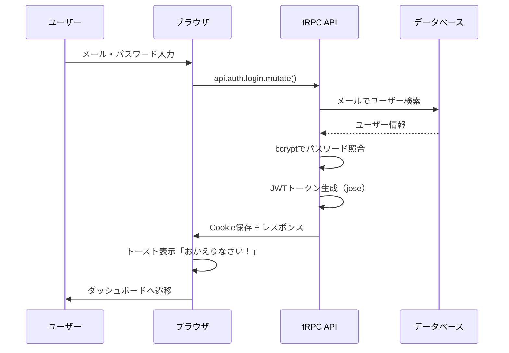

# Day 07: ログイン体験を改善しよう

## 🎯 今日のゴール

ログイン成功時に「おかえりなさい」トーストを表示する機能を追加します。その過程で、JWT認証・bcryptパスワード検証・HttpOnly Cookieの仕組みを体験的に学びます。


## 🤔 なぜこれを作るのか？

Day 05-06で作ったログインフォームは、成功するとそのままダッシュボードに遷移します。でも「ログインできた！」というフィードバックがないと、ユーザーは不安になります。トースト（画面上に一時的に表示されるメッセージ）を追加して体験を向上させましょう。

> 💡 **例え話**: JWTトークンは「遊園地のリストバンド」です。入口（ログイン画面）で本人確認されると、リストバンド（JWTトークン）がもらえます。それ以降は、リストバンドを見せるだけでどのアトラクション（ページ）にも入れます。

### 📐 認証フローの全体像



### やること / やらないこと

| やること | やらないこと |
|---------|-------------|
| 認証フローを追いかけて理解する | 認証コードをゼロから書く |
| ログイン成功トーストを改善する | 暗号化の数学的仕組み |
| DevToolsでJWTとCookieを確認する | データベース設計（Day 01完了済み） |
| Cookieを消して認証ガードを体感する | 独自の暗号化実装 |

### 🆕 新しく学ぶ概念

| 概念 | 読み方 | 役割 | 例え |
|------|--------|------|------|
| JWT | ジェイ・ダブリュー・ティー | ユーザー情報を暗号化したトークン | 遊園地のリストバンド。名前と有効期限入り |
| bcrypt | ビークリプト | パスワードを安全にハッシュ化 | 暗証番号を解読不能な暗号に変換するマシン |
| HttpOnly Cookie | エイチティーティーピー・オンリー・クッキー | JSから読めない安全なCookie | 見えない場所に隠したリストバンド |

## 📊 実装ステップ一覧

| ステップ | 作業内容 | 所要時間 | 触るファイル | 成功状態 |
|---------|---------|---------|-------------|---------|
| Step 1 | わざとログイン失敗してDevToolsで観察 | 5分 | なし | tRPCリクエストが見える |
| Step 2 | auth.tsのログイン処理を読む | 7分 | なし（読むのみ） | bcrypt照合の流れがわかる |
| Step 3 | session.tsのJWT生成を読む | 5分 | なし（読むのみ） | JWT構造がわかる |
| Step 4 | Cookie保存の仕組みを読む | 5分 | なし（読むのみ） | HttpOnlyの意味がわかる |
| Step 5 | ログイン成功トーストを確認・改善する | 7分 | login/page.tsx | トーストメッセージが変わる |
| Step 6 | DevToolsでJWTトークンを確認する | 5分 | なし | jwt.ioで中身が読める |
| Step 7 | Cookieを消して認証ガードを体感する | 4分 | なし | リダイレクトされる |
| Step 8 | publicとprotectedの違いを理解する | 5分 | なし（読むのみ） | 使い分けがわかる |

**合計時間**: 約43分

---

### Step 1: わざとログイン失敗してDevToolsで観察する（5分）

🎯 **ゴール**: ログイン時にブラウザとサーバーの間で何が起きているか、DevToolsで確認します。

ブラウザでDevToolsを開いてください（`F12`キー、またはCmd+Option+I）。**Network**タブを選択します。

💻 **操作手順**:

1. `/login`ページを開く
2. DevToolsのNetworkタブを開く
3. わざと間違ったメールアドレスでログインする
4. Networkタブに表示されるリクエストを確認する

```bash
# filepath: DevTools Networkタブで確認する内容
# リクエスト: POST /api/trpc/auth.login
# ステータス: 200（tRPCはHTTPステータスを200で返す）
# レスポンス: {"error":{"message":"メールアドレスまたはパスワードが正しくありません"}}
```

🔍 **コード解説**:

| 確認項目 | 内容 | 意味 |
|---------|------|------|
| URL | `/api/trpc/auth.login` | tRPCのログインAPIのエンドポイント |
| Method | POST | データを送信する時のHTTPメソッド |
| Request Body | `{"email":"...","password":"..."}` | 入力したデータがJSON形式で送られる |
| Response | `{"error":{"message":"..."}}` | サーバーからのエラーレスポンス |

✅ **確認ポイント**:
1. DevToolsのNetworkタブにリクエストが表示された
2. tRPCのエンドポイント（`/api/trpc/auth.login`）が確認できた
3. リクエストとレスポンスのJSON構造が読めた

📝 **学んだこと**: ログインボタンを押すと、ブラウザからサーバーへHTTPリクエストが送信されます。

---

### Step 2: auth.tsのログイン処理を読む（7分）

🎯 **ゴール**: サーバー側のログイン処理がどう動くか理解します。

VS Codeで`src/server/api/routers/auth.ts`を開いてください。

💻 **確認するコード**:

```typescript
// filepath: src/server/api/routers/auth.ts（ログイン処理）
login: publicProcedure
  .input(loginSchema)
  .mutation(async ({ input }) => {
    // 1. メールでユーザーを検索
    const user = await prisma.user.findUnique({
      where: { email: input.email },
    });
    // 2. ユーザーが見つからない場合はエラー
    if (!user || !user.password) {
      throw new TRPCError({
        code: 'UNAUTHORIZED',
        message: 'メールアドレスまたは'
          + 'パスワードが正しくありません',
      });
    }
```

```typescript
// filepath: src/server/api/routers/auth.ts（続き）
    // 3. bcryptでパスワード照合
    const isPasswordValid =
      await bcrypt.compare(
        input.password,  // 入力されたパスワード
        user.password    // DBに保存されたハッシュ値
      );
    if (!isPasswordValid) {
      throw new TRPCError({
        code: 'UNAUTHORIZED',
        message: 'メールアドレスまたは'
          + 'パスワードが正しくありません',
      });
    }
```

🔍 **コード解説**:

| コード | 意味 | 例え |
|--------|------|------|
| `publicProcedure` | ログイン不要で呼べるAPI | 誰でも入れる受付窓口 |
| `.input(loginSchema)` | zodで入力値を検証 | 受付の書類チェック |
| `prisma.user.findUnique()` | DBからユーザーを検索 | 名簿からお客さんを探す |
| `bcrypt.compare()` | パスワードのハッシュ値を比較 | 暗証番号を照合する |

> 💡 **なぜ同じエラーメッセージ？** 「メールが存在しない」と「パスワードが違う」を区別すると、攻撃者に「このメールは登録済み」と教えてしまいます。セキュリティのために、両方とも同じメッセージを返します。

✅ **確認ポイント**:
1. `src/server/api/routers/auth.ts`を開けた
2. ログイン処理の4ステップ（検索→存在チェック→パスワード照合→有効チェック）が追えた

📝 **学んだこと**: パスワードは平文で比較せず、`bcrypt.compare`でハッシュ値同士を比較します。

---

### Step 3: session.tsのJWT生成を読む（5分）

🎯 **ゴール**: ログイン成功後にJWTトークンがどう生成されるか理解します。

VS Codeで`src/lib/session.ts`を開いてください。

💻 **確認するコード**:

```typescript
// filepath: src/lib/session.ts（JWT生成）
export async function encrypt(
  payload: SessionPayload
): Promise<string> {
  const jwtPayload: Record<string, unknown> = {
    userId: payload.userId,
    email: payload.email,
    role: payload.role,
    exp: payload.exp,
  };
  return await new SignJWT(jwtPayload)
    .setProtectedHeader({ alg: 'HS256' })
    .setIssuedAt()
    .setExpirationTime('7d')
    .sign(getKey());
}
```

🔍 **コード解説**:

| コード | 意味 | 例え |
|--------|------|------|
| `SignJWT` | 署名付きJWTを作成する | リストバンドに情報を刻印する機械 |
| `alg: 'HS256'` | 署名アルゴリズム | 偽造防止の特殊インクの種類 |
| `setExpirationTime('7d')` | 7日間有効 | リストバンドの有効期限シール |
| `sign(getKey())` | 秘密鍵で署名 | 店長のハンコで正式認定 |

✅ **確認ポイント**:
1. JWTにユーザーID・メール・権限・有効期限が含まれることがわかった
2. `jose`ライブラリで署名していることを確認した

📝 **学んだこと**: JWTトークンには「誰が」「いつまで」「どの権限で」ログインしているかが記録されます。

---

### Step 4: Cookie保存の仕組みを読む（5分）

🎯 **ゴール**: JWTトークンがどうブラウザに保存されるか理解します。

💻 **確認するコード**:

```typescript
// filepath: src/lib/session.ts（Cookie保存）
export async function createSession(
  user: SessionUser
): Promise<string> {
  const expiresAt =
    Math.floor(Date.now() / 1000) + COOKIE_MAX_AGE;
  const token = await encrypt({
    userId: user.id,
    email: user.email,
    role: user.role,
    exp: expiresAt,
  });
  const cookieStore = await cookies();
  cookieStore.set(COOKIE_NAME, token, {
    httpOnly: true,
    secure: process.env['NODE_ENV'] === 'production',
    sameSite: 'strict',
    maxAge: COOKIE_MAX_AGE,
    path: '/',
  });
  return token;
}
```

🔍 **Cookie設定の意味**:

| 設定 | 値 | なぜ必要？ |
|------|-----|---------|
| `httpOnly` | `true` | JavaScriptから読めなくしてXSS攻撃を防ぐ |
| `secure` | 本番のみ`true` | HTTPSでのみ送信して盗聴を防ぐ |
| `sameSite` | `'strict'` | 別サイトからのリクエストにCookieを付けない |
| `maxAge` | 7日間 | セッションの有効期限 |

✅ **確認ポイント**:
1. `httpOnly: true`がJavaScriptからのアクセスを防ぐことがわかった
2. 複数のセキュリティ設定が組み合わさっていることを理解した

📝 **学んだこと**: Cookieは単なるデータ保存ではなく、`httpOnly`や`secure`でセキュリティを強化できます。

---

### Step 5: ログイン成功トーストを確認・改善する（7分）

🎯 **ゴール**: 現在のログイン成功トーストを確認し、メッセージを改善します。

VS Codeで`src/app/login/page.tsx`を開いてください。`onSuccess`コールバックを見つけましょう。

💻 **確認するコード**:

```typescript
// filepath: src/app/login/page.tsx（現在のonSuccess）
const loginMutation =
  api.auth.login.useMutation({
    onSuccess: (data) => {
      toast.success(
        `おかえりなさい、${data.user.name}さん`
      );
      router.push(callbackUrl);
      router.refresh();
    },
    onError: (error) => {
      setError(
        error.message
        || 'ログイン中にエラーが発生しました'
      );
    },
  });
```

トーストのメッセージを変更してみましょう。

💻 **実装**:

```typescript
// filepath: src/app/login/page.tsx（トーストを改善）
    onSuccess: (data) => {
      toast.success(
        `おかえりなさい、${data.user.name}さん！`
        + '\n今日もタスクを進めましょう 💪',
        { duration: 4000 }
      );
      router.push(callbackUrl);
      router.refresh();
    },
```

🔍 **コード解説**:

| コード | 意味 | 例え |
|--------|------|------|
| `toast.success()` | 成功メッセージを表示 | 緑色のポップアップ通知 |
| `data.user.name` | APIレスポンスからユーザー名を取得 | 「○○さん」の名前部分 |
| `{ duration: 4000 }` | 4秒間表示 | メッセージの表示時間 |
| `router.push(callbackUrl)` | ページ遷移 | ダッシュボードへジャンプ |

✅ **確認ポイント**:
1. ブラウザで`/login`にアクセス
2. `admin@example.com` / `password123`でログイン
3. 「おかえりなさい、管理者さん！」トーストが表示される
4. 4秒後にトーストが消える


📝 **学んだこと**: `react-hot-toast`で、APIレスポンスのデータを使った動的なメッセージを表示できます。

---

### Step 6: DevToolsでJWTトークンを確認する（5分）

🎯 **ゴール**: ブラウザに保存されたJWTトークンの中身を確認します。

ログイン成功後に、DevToolsを開いてください。

💻 **操作手順**:

1. DevToolsを開く（F12）
2. **Application**タブ → **Cookies** → `http://localhost:3000` を選択
3. `session`という名前のCookieを見つける
4. 値（長い文字列）をコピーする
5. ブラウザで`https://jwt.io`を開く
6. 「Encoded」欄にコピーした値を貼り付ける

```bash
# filepath: jwt.ioで見えるデコード結果（例）
# HEADER:
# { "alg": "HS256" }
#
# PAYLOAD:
# {
#   "userId": "cm...",
#   "email": "admin@example.com",
#   "role": "ADMIN",
#   "iat": 1234567890,
#   "exp": 1235172690
# }
```

🔍 **JWTの3部構成**:

| 部分 | 内容 | 例え |
|------|------|------|
| Header | アルゴリズム情報 | リストバンドの素材情報 |
| Payload | ユーザー情報（ID、メール、権限、期限） | リストバンドに書かれた名前と有効期限 |
| Signature | 改ざん検知用の署名 | 偽造防止の特殊インク |

✅ **確認ポイント**:
1. Application → Cookies に`session`が存在する
2. jwt.ioでデコードして、自分のユーザーIDとメールが表示される
3. `exp`（有効期限）が7日後になっている

> 📸 DevTools を開き（F12）、Application タブ → Cookies → `http://localhost:3000` を選択し、`session` という名前の Cookie が保存されていることを確認してください。その値を `https://jwt.io` に貼り付けると JWT の中身をデコードして確認できます。

📝 **学んだこと**: JWTは暗号化ではなく「署名」です。中身は誰でもデコードできますが、改ざんすると署名が合わなくなります。

---

### Step 7: Cookieを消して認証ガードを体感する（4分）

🎯 **ゴール**: Cookieを削除するとどうなるか体験して、認証ガードの動作を確認します。

💻 **操作手順**:

1. DevToolsのApplication → Cookies → `http://localhost:3000`
2. `session` Cookieを右クリック → Delete
3. ブラウザで`/dashboard`にアクセスする
4. 自動的に`/login`にリダイレクトされることを確認

```mermaid
flowchart LR
    A[/dashboardにアクセス] --> B{Cookieあり？}
    B -->|あり| C[ダッシュボード表示]
    B -->|なし| D[/loginにリダイレクト]

    style C fill:#e8f5e9
    style D fill:#ffebee
```

✅ **確認ポイント**:
1. Cookie削除後に`/dashboard`が表示できなくなった
2. 自動的に`/login`に飛ばされた
3. 再度ログインするとダッシュボードが表示される

📝 **学んだこと**: 認証ガードは「Cookieにセッションがあるか」をチェックし、なければログイン画面に強制遷移させます。

---

### Step 8: publicProcedureとprotectedProcedureの違いを理解する（5分）

🎯 **ゴール**: APIの認証制御の仕組みを理解します。

VS Codeで`src/server/api/trpc.ts`を開いてください。

💻 **確認するコード**:

```typescript
// filepath: src/server/api/trpc.ts（認証ミドルウェア）
// 認証チェック
const isAuthenticated = t.middleware(
  async ({ ctx, next }) => {
    if (!ctx.session?.userId) {
      throw new TRPCError({
        code: 'UNAUTHORIZED',
        message: 'ログインが必要です',
      });
    }
    return next({
      ctx: { session: ctx.session },
    });
  }
);
```

🔍 **2種類のプロシージャ**:

| 種別 | 認証 | 使う場面 | API例 |
|------|------|---------|-------|
| `publicProcedure` | 不要 | 誰でもアクセスできるAPI | ログイン、登録、セッション確認 |
| `protectedProcedure` | 必須 | ログイン必須のAPI | タスク操作、プロジェクト管理 |

> 💡 ログイン画面自体は「ログインしていなくてもアクセスできる」必要がありますよね。だからログインAPIは`publicProcedure`です。

✅ **確認ポイント**:
1. `publicProcedure`と`protectedProcedure`の違いがわかった
2. ミドルウェアがリクエストごとにセッションをチェックする仕組みが理解できた

📝 **学んだこと**: `protectedProcedure`は内部でセッションチェックを行い、未ログインユーザーを自動的に弾きます。

---

## 📋 今日のまとめ

- [ ] DevTools Networkタブでログインリクエストを観察した
- [ ] bcryptでパスワードをハッシュ比較する仕組みを理解した
- [ ] JWTトークンの生成と中身を確認した
- [ ] HttpOnly Cookieのセキュリティ設定を理解した
- [ ] ログイン成功トーストを改善した
- [ ] jwt.ioでトークンをデコードした
- [ ] Cookieを削除して認証ガードの動作を体験した
- [ ] publicProcedureとprotectedProcedureの違いを理解した

## ⚠️ つまずきポイント

| エラー/問題 | 原因 | 解決方法 |
|------------|------|---------|
| ログインしても画面が変わらない | `router.refresh()`の呼び忘れ | `onSuccess`内で`router.refresh()`を追加 |
| 「ログインが必要です」エラー | Cookieが保存されていない | ブラウザのCookie設定を確認 |
| jwt.ioでデコードできない | 値のコピーが不完全 | Cookie値を全選択してからコピーする |
| トーストが表示されない | `react-hot-toast`のインポート漏れ | `import toast from 'react-hot-toast'`を確認 |

## 🔜 次回の予告

Day 08では、サイドバーにユーザー情報ウィジェットを追加し、ログアウト確認ダイアログを実装します。ログアウトとページ保護の仕組みを、自分の手で作りながら学びましょう。
