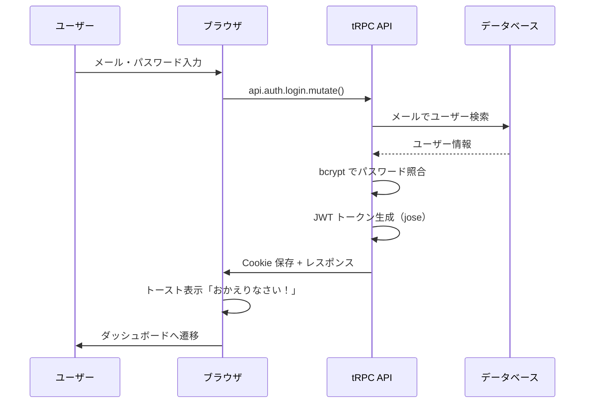
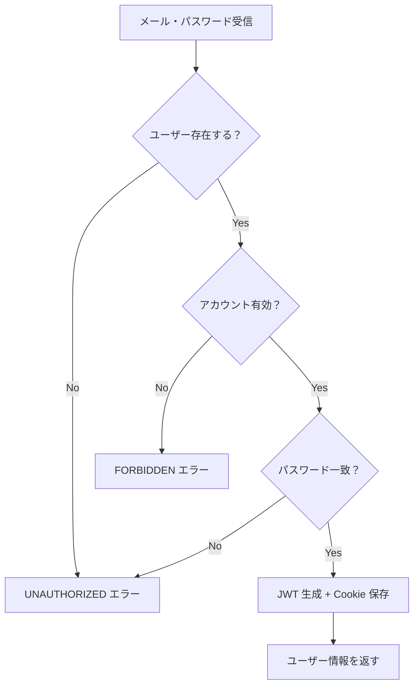

# Day 07: 認証バックエンドを作って、ログインを動かそう


## 前回の振り返り

Day 05-06 でログイン画面と登録画面の UI を作りました。
見た目はできていますが、ログインボタンを押しても何も起きません——
サーバー側がまだないからです。

今日はその「裏側」を自分の手で作ります。
ここを超えたら、アプリが本当に「使える」ものになります。
配布済みコードを開いて読む日ではなく、必要な認証ファイルを小さく書いてつなぐ日です。

---

## 今日のゴール

ログイン・登録が実際に動くようにします。
その過程で、JWT トークン・bcrypt パスワード検証・HttpOnly Cookie・tRPC の仕組みを体験的に学びます。

- [ ] `src/lib/session.ts` — JWT セッション管理を作る
- [ ] `src/server/api/trpc.ts` — tRPC の土台を作る
- [ ] `src/server/api/routers/auth.ts` — 認証 API を作る
- [ ] `src/server/api/root.ts` — ルーターを束ねる
- [ ] `src/app/api/trpc/[trpc]/route.ts` — HTTP ハンドラを作る
- [ ] `src/middleware.ts` — ルート保護を作る
- [ ] DevTools でログインの流れを確認する

## なぜこれを作るのか

Day 05 で作ったログイン画面は、ブラウザ（フロントエンド）だけで動いています。
「このメールとパスワードが正しいか」を確認するには、
サーバー側にデータベースと照合する処理が必要です。

今日作る 6 ファイルが、ログインの「裏方」全部になります。

> **例え話**: レストランに例えると、Day 05-06 で作ったのは注文用紙（フォーム）。今日は厨房（サーバー）と配膳システム（API）を作って、注文がちゃんと通るようにします。

### 認証フローの全体像



### やること / やらないこと

| やること | やらないこと |
|---------|-------------|
| 認証バックエンドを自分の手で作る | 暗号化の数学的仕組みを理解する |
| JWT・Cookie・middleware の仕組みを体験する | 独自の暗号化実装を作る |
| DevTools で認証フローを目で確認する | データベース設計（scaffold 済み） |

### 新しく学ぶ概念

| 概念 | 読み方 | 役割 | 例え |
|------|--------|------|------|
| JWT | ジェイ・ダブリュー・ティー | ユーザー情報を署名付きで格納したトークン | 遊園地のリストバンド。名前と有効期限入り |
| bcrypt | ビークリプト | パスワードを安全にハッシュ化 | 暗証番号を解読不能な暗号に変換するマシン |
| HttpOnly Cookie | エイチティーティーピー・オンリー・クッキー | JS から読めない安全な Cookie | 見えない場所に隠したリストバンド |
| tRPC | ティー・アール・ピー・シー | 型安全な API フレームワーク | フロントとバックで同じメニュー表を共有する仕組み |
| ミドルウェア | middleware | リクエストの前処理（認証ガード等） | 店の入口にいるガードマン |

> **今日のゴールライン**: JWT や bcrypt の数学的な仕組みまで理解する必要はありません。「ログインしたらトークンがもらえて、それで認証が通る」という流れを体験できたら OK。

## 実装ステップ一覧

| ステップ | 作業内容 | 所要時間 | 作成ファイル |
|---------|---------|---------|-------------|
| Step 1 | session.ts を作る（JWT セッション管理） | 12分 | `src/lib/session.ts` |
| Step 2 | trpc.ts を作る（API の土台） | 10分 | `src/server/api/trpc.ts` |
| Step 3 | auth.ts を作る（認証ルーター） | 15分 | `src/server/api/routers/auth.ts` + ヘルパー |
| Step 4 | API を繋ぐ（ルーター登録 + HTTP ハンドラ） | 5分 | `src/server/api/root.ts`, `src/app/api/trpc/[trpc]/route.ts` |
| Step 5 | middleware.ts を作る（ルート保護） | 8分 | `src/middleware.ts` |
| Step 6 | ログインして動作確認する | 5分 | なし |
| Step 7 | DevTools で JWT と Cookie を確認する | 5分 | なし |

**合計時間**: 約 60 分。

---

### Step 1: session.ts を作る（JWT セッション管理・12分）
**ゴール**: ログイン状態を JWT トークンで管理する仕組みを作ります。

このファイルが認証の中心です。
「トークンを作る」「トークンを読む」「Cookie に保存する」「Cookie から取り出す」——
認証の基本操作が全部ここに入ります。

`src/lib/session.ts` を新規作成します。

#### 1-1. インポートと秘密鍵の取得

```typescript
// filepath: src/lib/session.ts
import { type JWTPayload, jwtVerify, SignJWT } from 'jose';
import { cookies } from 'next/headers';
import type { UserRole } from './constant/roles';
import { env } from './env';

function getKey(): Uint8Array {
  const SECRET_KEY = env.JWT_SECRET;
  const encoded = new TextEncoder().encode(SECRET_KEY);
  return new Uint8Array(encoded);
}
```

| コード | 意味 | 例え |
|--------|------|------|
| `jose` | JWT を扱うライブラリ | リストバンド製造機 |
| `cookies()` | Next.js の Cookie 操作 API | ブラウザの Cookie 棚 |
| `getKey()` | 秘密鍵を Uint8Array に変換 | 店長の印鑑を取り出す |

> `JWT_SECRET` は `.env` に scaffold が設定済み。32 文字以上の文字列で、本番では必ず変更します。

#### 1-2. 型定義と定数

```typescript
// filepath: src/lib/session.ts（続き）
export interface SessionPayload {
  userId: string;
  email: string;
  role: UserRole;
  exp: number;
}

export interface SessionUser {
  id: string;
  email: string;
  role: UserRole;
}

const COOKIE_NAME = 'session';
const COOKIE_MAX_AGE = 60 * 60 * 24 * 7; // 7日間
```

`SessionPayload` は JWT トークンの中身。
`SessionUser` は「誰がログインしてるか」の最小情報。

#### 1-3. 型ガードと暗号化

```typescript
// filepath: src/lib/session.ts（続き）
function isSessionPayload(
  payload: JWTPayload,
): payload is JWTPayload & SessionPayload {
  return (
    typeof payload['userId'] === 'string' &&
    typeof payload['email'] === 'string' &&
    typeof payload['role'] === 'string' &&
    typeof payload['exp'] === 'number'
  );
}
```

**確認ポイント**:
- [ ] `isSessionPayload` が `userId` / `email` / `role` / `exp` を確認している

```typescript
// filepath: src/lib/session.ts（続き）
export async function encrypt(
  payload: SessionPayload,
): Promise<string> {
  const jwtPayload: Record<string, unknown> = {
    userId: payload.userId,
    email: payload.email,
    role: payload.role,
    exp: payload.exp,
  };

  return await new SignJWT(jwtPayload)
    .setProtectedHeader({ alg: 'HS256' })
    .setIssuedAt()
    .setExpirationTime('7d')
    .sign(getKey());
}
```

| コード | 意味 | 例え |
|--------|------|------|
| `isSessionPayload()` | JWT の中身が正しい形式か検証 | 書類の記入漏れチェック |
| `SignJWT` | 署名付き JWT を作成 | リストバンドに情報を刻印する機械 |
| `alg: 'HS256'` | 署名アルゴリズム | 偽造防止の特殊インクの種類 |
| `setExpirationTime('7d')` | 7 日間有効 | リストバンドの有効期限シール |
| `sign(getKey())` | 秘密鍵で署名 | 店長のハンコで正式認定 |

#### 1-4. 復号化（トークンを読む）

```typescript
// filepath: src/lib/session.ts（続き）
export async function decrypt(
  token: string,
): Promise<SessionPayload | null> {
  try {
    const { payload } = await jwtVerify(token, getKey(), {
      algorithms: ['HS256'],
    });

    if (!isSessionPayload(payload)) {
      console.error('Invalid session payload structure');
      return null;
    }

    return payload;
  } catch {
    console.error('Failed to decrypt token');
    return null;
  }
}
```

`encrypt` でトークンを作り、`decrypt` でトークンを読みます。対になる操作。

#### 1-5. セッション操作（作成・取得・削除・検証）

```typescript
// filepath: src/lib/session.ts（続き）
export async function saveSessionCookie(
  token: string,
): Promise<void> {
  const cookieStore = await cookies();
  cookieStore.set(COOKIE_NAME, token, {
    httpOnly: true,
    secure:
      process.env['NODE_ENV'] === 'production'
      && process.env['PLAYWRIGHT_TEST'] !== '1',
    sameSite: 'strict',
    maxAge: COOKIE_MAX_AGE,
    path: '/',
  });
}
```

**確認ポイント**:
- [ ] Cookie 設定を `saveSessionCookie` に分けて書けている

```typescript
// filepath: src/lib/session.ts（続き）
export async function createSession(
  user: SessionUser,
): Promise<string> {
  const expiresAt =
    Math.floor(Date.now() / 1000) + COOKIE_MAX_AGE;
  const payload: SessionPayload = {
    userId: user.id,
    email: user.email,
    role: user.role,
    exp: expiresAt,
  };

  const token = await encrypt(payload);
  await saveSessionCookie(token);

  return token;
}
```

**確認ポイント**:
- [ ] `createSession` から `saveSessionCookie(token)` を呼んでいる

```typescript
// filepath: src/lib/session.ts（続き）
export async function getSession(): Promise<SessionPayload | null> {
  const cookieStore = await cookies();
  const token = cookieStore.get(COOKIE_NAME)?.value;

  if (!token) {
    return null;
  }

  return await decrypt(token);
}
```

**確認ポイント**:
- [ ] Cookie がない場合に `null` を返している

```typescript
// filepath: src/lib/session.ts（続き）
export async function deleteSession(): Promise<void> {
  const cookieStore = await cookies();
  cookieStore.delete(COOKIE_NAME);
}

export async function verifySession(): Promise<SessionUser | null> {
  const session = await getSession();

  if (!session) {
    return null;
  }

  return {
    id: session.userId,
    email: session.email,
    role: session.role,
  };
}
```

**Cookie 設定の意味**:

| 設定 | 値 | なぜ必要か |
|------|-----|---------|
| `httpOnly` | `true` | JavaScript から読めなくして XSS 攻撃を防ぐ |
| `secure` | 本番のみ `true` | HTTPS でのみ送信して盗聴を防ぐ |
| `sameSite` | `'strict'` | 別サイトからのリクエストに Cookie を付けない |
| `maxAge` | 7 日間 | セッションの有効期限 |

**確認ポイント**:
- [ ] `src/lib/session.ts` が作成できた
- [ ] `encrypt` / `decrypt` / `createSession` / `getSession` / `deleteSession` / `verifySession` の 6 関数がある
- [ ] この時点ではまだ `npm run dev` しなくて OK

**学んだこと**: JWT は「誰が」「いつまで」「どの権限で」ログインしているかを暗号化署名付きで保持する仕組み。

---

### Step 2: trpc.ts を作る（API の土台・10分）
**ゴール**: tRPC の初期設定と、public / protected / admin の 3 種類の API を定義します。

Day 05 のログイン画面は `api.auth.login.useMutation()` でサーバーを呼んでいました。
その「サーバー側の土台」がこのファイル。

`src/server/api/trpc.ts` を新規作成します。

#### 2-1. コンテキスト作成

```typescript
// filepath: src/server/api/trpc.ts
import { initTRPC, TRPCError } from '@trpc/server';
import superjson from 'superjson';
import { ZodError } from 'zod';
import { USER_ROLE } from '@/lib/constant/roles';
import { prisma } from '@/lib/prisma';
import { getSession } from '@/lib/session';

export const createTRPCContext = async (
  opts: { headers: Headers },
) => {
  const session = await getSession();

  return {
    session,
    ...opts,
  };
};

export type Context = Awaited<
  ReturnType<typeof createTRPCContext>
>;
```

`createTRPCContext` は API リクエストのたびに呼ばれて、「今誰がログインしてるか」をコンテキストに入れます。

#### 2-2. tRPC インスタンス初期化

```typescript
// filepath: src/server/api/trpc.ts（続き）
const t = initTRPC.context<Context>().create({
  transformer: superjson,
  errorFormatter({ shape, error }) {
    return {
      ...shape,
      data: {
        ...shape.data,
        zodError:
          error.cause instanceof ZodError
            ? error.cause.flatten()
            : null,
      },
    };
  },
});
```

| コード | 意味 |
|--------|------|
| `superjson` | Date や BigInt を JSON で送れるようにする変換器 |
| `errorFormatter` | zod のバリデーションエラーを使いやすい形に整形 |

#### 2-3. 認証ミドルウェアとプロシージャ

```typescript
// filepath: src/server/api/trpc.ts（続き）
const isAuthenticated = t.middleware(
  async ({ ctx, next }) => {
    if (!ctx.session?.userId) {
      throw new TRPCError({
        code: 'UNAUTHORIZED',
        message: 'ログインが必要です',
      });
    }

    const currentUser = await prisma.user.findUnique({
      where: { id: ctx.session.userId },
      select: {
        id: true,
        role: true,
        isActive: true,
      },
    });
```

**確認ポイント**:
- [ ] セッションの `userId` で DB のユーザーを取り直している

```typescript
// filepath: src/server/api/trpc.ts（続き）
    if (!currentUser) {
      throw new TRPCError({
        code: 'UNAUTHORIZED',
        message: 'ユーザーが見つかりません',
      });
    }

    if (!currentUser.isActive) {
      throw new TRPCError({
        code: 'FORBIDDEN',
        message: 'このアカウントは無効化されています',
      });
    }
```

**確認ポイント**:
- [ ] DB にユーザーがない場合と無効化済みの場合を分けている

```typescript
// filepath: src/server/api/trpc.ts（続き）
    return next({
      ctx: {
        session: {
          ...ctx.session,
          role: currentUser.role,
        },
      },
    });
  },
);
```

**確認ポイント**:
- [ ] 未ログイン時に `UNAUTHORIZED` を返す分岐がある
- [ ] DB から `isActive` を確認している

```typescript
// filepath: src/server/api/trpc.ts（続き）
const isAdmin = t.middleware(async ({ ctx, next }) => {
  if (ctx.session?.role !== USER_ROLE.ADMIN) {
    throw new TRPCError({
      code: 'FORBIDDEN',
      message: '管理者権限が必要です',
    });
  }

  return next({ ctx });
});
```

**確認ポイント**:
- [ ] 管理者以外を `FORBIDDEN` にする `isAdmin` がある

```typescript
// filepath: src/server/api/trpc.ts（続き）
export const createTRPCRouter = t.router;
export const publicProcedure = t.procedure;
export const protectedProcedure =
  t.procedure.use(isAuthenticated);
export const adminProcedure =
  t.procedure.use(isAuthenticated).use(isAdmin);
export const createCallerFactory = t.createCallerFactory;
```

**3 種類の API**:

| 種別 | 認証 | 使う場面 | API 例 |
|------|------|---------|-------|
| `publicProcedure` | 不要 | 誰でも呼べる | ログイン、登録 |
| `protectedProcedure` | 必須 | ログインユーザーのみ | タスク操作、プロジェクト管理 |
| `adminProcedure` | 管理者のみ | 管理機能 | ユーザー管理 |

> `isAuthenticated` ミドルウェアは、Cookie のセッション情報だけでなく DB からユーザーの最新状態を取得します。アカウントが無効化されていたら、ここで弾きます。

**確認ポイント**:
- [ ] `src/server/api/trpc.ts` が作成できた
- [ ] `publicProcedure` / `protectedProcedure` / `adminProcedure` の 3 つが export されている

**学んだこと**: tRPC のミドルウェアで「ログイン必須」「管理者のみ」といった認証制御を API 定義にチェーン（`.use()`）するだけで追加できます。

---

### Step 3: auth.ts を作る（認証ルーター・15分）
**ゴール**: ログイン・登録・ログアウト・セッション取得の 4 つの API を作ります。

ここが今日のメイン。フロントから呼ばれる認証 API の実体を書きます。

まず、共通のヘルパーを作ります。

#### 3-0. select ヘルパーを作る

`src/server/api/routers/_helpers/select.ts` を新規作成します。

```typescript
// filepath: src/server/api/routers/_helpers/select.ts
import { z } from 'zod';
import { PROJECT_MEMBER_ROLE } from '@/lib/constant/roles';

export const USER_SELECT = {
  id: true,
  name: true,
  email: true,
  avatar: true,
} as const;

export const USER_DETAIL_SELECT = {
  id: true,
  email: true,
  name: true,
  avatar: true,
  role: true,
  isActive: true,
} as const;

export const projectMemberRoleSchema =
  z.nativeEnum(PROJECT_MEMBER_ROLE);
```

Prisma（TypeScript からデータベースを操作するための道具。読み方: プリズマ）の `select` を毎回書くのは面倒なので、共通化しておきます。
`as const` で型を絞ることで、返り値の型が正確になります。

#### 3-1. auth.ts のインポートとバリデーション

`src/server/api/routers/auth.ts` を新規作成します。

```typescript
// filepath: src/server/api/routers/auth.ts
import { TRPCError } from '@trpc/server';
import bcrypt from 'bcryptjs';
import { z } from 'zod';
import { USER_ROLE } from '@/lib/constant/roles';
import { prisma } from '@/lib/prisma';
import {
  createSession,
  deleteSession,
  type SessionUser,
} from '@/lib/session';
import {
  createTRPCRouter,
  protectedProcedure,
  publicProcedure,
} from '../trpc';
import { USER_DETAIL_SELECT } from './_helpers/select';
```

**確認ポイント**:
- [ ] 認証 API に必要な import が揃っている

```typescript
// filepath: src/server/api/routers/auth.ts（続き）
const loginSchema = z.object({
  email: z
    .string()
    .email('有効なメールアドレスを入力してください'),
  password: z
    .string()
    .min(1, 'パスワードを入力してください'),
});
```

**確認ポイント**:
- [ ] ログイン入力は email と password を検証している

```typescript
// filepath: src/server/api/routers/auth.ts（続き）
const registerSchema = z.object({
  name: z
    .string()
    .min(1, '名前を入力してください'),
  email: z
    .string()
    .email('有効なメールアドレスを入力してください'),
  password: z
    .string()
    .min(8, 'パスワードは8文字以上で入力してください')
    .regex(/[A-Z]/, '大文字を含める必要があります')
    .regex(/[a-z]/, '小文字を含める必要があります')
    .regex(/[0-9]/, '数字を含める必要があります')
    .regex(
      /[^A-Za-z0-9]/,
      '特殊文字を含める必要があります',
    ),
});
```

> zod でバリデーションを定義しておくと、tRPC が自動で入力チェックしてくれます。フロント側でもバックエンド側でも同じスキーマを使える。

#### 3-2. エラーハンドラとログイン処理

```typescript
// filepath: src/server/api/routers/auth.ts（続き）
function handleUnexpectedError(
  context: string,
  error: unknown,
): never {
  console.error(`[auth] ${context}:`, error);
  throw new TRPCError({
    code: 'INTERNAL_SERVER_ERROR',
    message: `${context}中にエラーが発生しました。しばらくしてから再度お試しください。`,
    cause: error,
  });
}
```

**確認ポイント**:
- [ ] 予期しないエラーを `TRPCError` に変換している

```typescript
// filepath: src/server/api/routers/auth.ts（続き）
export const authRouter = createTRPCRouter({
  login: publicProcedure
    .input(loginSchema)
    .mutation(async ({ input }) => {
      try {
        // 1. メールでユーザーを検索
        const user = await prisma.user.findUnique({
          where: { email: input.email },
        });
```

**確認ポイント**:
- [ ] `login` mutation でユーザー検索まで書けている

```typescript
// filepath: src/server/api/routers/auth.ts（続き）
        // 2. ユーザーが見つからない場合
        if (!user || !user.password) {
          throw new TRPCError({
            code: 'UNAUTHORIZED',
            message:
              'メールアドレスまたはパスワードが正しくありません',
          });
        }

        // 3. アカウントが有効か確認
        if (!user.isActive) {
          throw new TRPCError({
            code: 'FORBIDDEN',
            message: 'このアカウントは無効化されています',
          });
        }

        // 4. bcrypt でパスワード照合
        const isPasswordValid = await bcrypt.compare(
          input.password,
          user.password,
        );
```

**確認ポイント**:
- [ ] ユーザー有無・アカウント有効・パスワード照合を確認している

```typescript
// filepath: src/server/api/routers/auth.ts（続き）
        if (!isPasswordValid) {
          throw new TRPCError({
            code: 'UNAUTHORIZED',
            message:
              'メールアドレスまたはパスワードが正しくありません',
          });
        }
```

**確認ポイント**:
- [ ] パスワード不一致時も同じ `UNAUTHORIZED` メッセージにしている

```typescript
// filepath: src/server/api/routers/auth.ts（続き）
        // 5. セッション作成（JWT + Cookie）
        const sessionUser: SessionUser = {
          id: user.id,
          email: user.email,
          role: user.role,
        };

        await createSession(sessionUser);

        return {
          user: {
            id: user.id,
            email: user.email,
            name: user.name,
            avatar: user.avatar,
            role: user.role,
          },
        };
      } catch (error) {
        if (error instanceof TRPCError) throw error;
        handleUnexpectedError('ログイン処理', error);
      }
    }),
```

**ログイン処理の流れ**:



> **なぜ同じエラーメッセージ？** 「メールが存在しない」と「パスワードが違う」を区別すると、攻撃者に「このメールは登録済み」と教えてしまいます。セキュリティのために同じメッセージを返します。

#### 3-3. 登録・ログアウト・セッション取得

```typescript
// filepath: src/server/api/routers/auth.ts（続き）
  register: publicProcedure
    .input(registerSchema)
    .mutation(async ({ input }) => {
      try {
        const existing = await prisma.user.findUnique({
          where: { email: input.email },
        });
```

**確認ポイント**:
- [ ] 登録前に同じメールアドレスのユーザーを探している

```typescript
// filepath: src/server/api/routers/auth.ts（続き）
        if (existing) {
          throw new TRPCError({
            code: 'CONFLICT',
            message:
              'このメールアドレスは既に登録されています',
          });
        }

        const hashedPassword = await bcrypt.hash(
          input.password,
          10,
        );
```

**確認ポイント**:
- [ ] 重複メールを `CONFLICT` で弾いている
- [ ] `bcrypt.hash` でパスワードをハッシュ化している

```typescript
// filepath: src/server/api/routers/auth.ts（続き）
        const user = await prisma.user.create({
          data: {
            email: input.email,
            name: input.name,
            password: hashedPassword,
            role: USER_ROLE.USER,
            isActive: true,
          },
        });
```

**確認ポイント**:
- [ ] 新規ユーザーを `USER_ROLE.USER` で作成している

```typescript
// filepath: src/server/api/routers/auth.ts（続き）
        const sessionUser: SessionUser = {
          id: user.id,
          email: user.email,
          role: user.role,
        };

        await createSession(sessionUser);

        return {
          user: {
            id: user.id,
            email: user.email,
            name: user.name,
            avatar: user.avatar,
            role: user.role,
          },
        };
      } catch (error) {
        if (error instanceof TRPCError) throw error;
        handleUnexpectedError('ユーザー登録処理', error);
      }
    }),
```

**確認ポイント**:
- [ ] 登録直後、`createSession` でログイン状態にしている

```typescript
// filepath: src/server/api/routers/auth.ts（続き）
  logout: publicProcedure.mutation(async () => {
    await deleteSession();
    return { success: true };
  }),

  getSession: publicProcedure.query(async ({ ctx }) => {
    if (!ctx.session) {
      return null;
    }

    const user = await prisma.user.findUnique({
      where: { id: ctx.session.userId },
      select: USER_DETAIL_SELECT,
    });

    if (!user || !user.isActive) {
      return null;
    }

    return { user };
  }),
```

**確認ポイント**:
- [ ] `logout` は Cookie を削除している
- [ ] `getSession` は未ログインなら `null` を返す

```typescript
// filepath: src/server/api/routers/auth.ts（続き）
  getCurrentUser: protectedProcedure.query(
    async ({ ctx }) => {
      const user = await prisma.user.findUnique({
        where: { id: ctx.session.userId },
        select: {
          ...USER_DETAIL_SELECT,
          createdAt: true,
          updatedAt: true,
        },
      });
```

**確認ポイント**:
- [ ] `getCurrentUser` はログイン中ユーザーの詳細を取得している

```typescript
// filepath: src/server/api/routers/auth.ts（続き）
      if (!user) {
        throw new TRPCError({
          code: 'NOT_FOUND',
          message: 'ユーザーが見つかりません',
        });
      }

      if (!user.isActive) {
        throw new TRPCError({
          code: 'FORBIDDEN',
          message: 'このアカウントは無効化されています',
        });
      }

      return user;
    },
  ),
});
```

| API | 種別 | 認証 | 用途 |
|-----|------|------|------|
| `login` | mutation | 不要 | ログイン |
| `register` | mutation | 不要 | ユーザー登録 |
| `logout` | mutation | 不要 | ログアウト |
| `getSession` | query | 不要 | 現在のセッション確認（null 許容） |
| `getCurrentUser` | query | 必須 | ログインユーザーの詳細取得 |

> `bcrypt.hash(password, 10)` の `10` はソルトラウンド。数字が大きいほど安全だが遅くなります。10 が一般的なバランス。

**確認ポイント**:
- [ ] `src/server/api/routers/_helpers/select.ts` が作成できた
- [ ] `src/server/api/routers/auth.ts` が作成できた
- [ ] `authRouter` に 5 つの API（login / register / logout / getSession / getCurrentUser）がある

**学んだこと**: パスワードは平文で保存せず `bcrypt.hash` でハッシュ化し、照合は `bcrypt.compare` で行います。

---

### Step 4: API を繋ぐ（ルーター登録 + HTTP ハンドラ・5分）
**ゴール**: 作った auth ルーターを tRPC に登録し、HTTP リクエストを受け付けられるようにします。

#### 4-1. root.ts（ルーターを束ねる）

`src/server/api/root.ts` を新規作成します。

```typescript
// filepath: src/server/api/root.ts
import { authRouter } from './routers/auth';
import { createCallerFactory, createTRPCRouter } from './trpc';

export const appRouter = createTRPCRouter({
  auth: authRouter,
});

export type AppRouter = typeof appRouter;

export const createCaller = createCallerFactory(appRouter);
```

今は `auth` だけ。Day 09 以降でプロジェクト・タスクなどのルーターを追加していきます。

#### 4-2. route.ts（HTTP ハンドラ）

`src/app/api/trpc/[trpc]/route.ts` を新規作成します。

```typescript
// filepath: src/app/api/trpc/[trpc]/route.ts
import { fetchRequestHandler } from '@trpc/server/adapters/fetch';
import type { NextRequest } from 'next/server';
import { appRouter } from '@/server/api/root';
import { createTRPCContext } from '@/server/api/trpc';

const handler = (req: NextRequest) =>
  fetchRequestHandler({
    endpoint: '/api/trpc',
    req,
    router: appRouter,
    createContext: () =>
      createTRPCContext({ headers: req.headers }),
  });

export { handler as GET, handler as POST };
```

Next.js の App Router では、`src/app/api/trpc/[trpc]/route.ts` に置くだけで `/api/trpc/*` のリクエストをすべて tRPC が処理します。

**確認ポイント**:
- [ ] `src/server/api/root.ts` が作成できた
- [ ] `src/app/api/trpc/[trpc]/route.ts` が作成できた

---

### Step 5: middleware.ts を作る（ルート保護・8分）
**ゴール**: ログインしていないユーザーを自動でログイン画面にリダイレクトする仕組みを作ります。

このファイルは Next.js の Edge Runtime で動きます。
すべてのリクエストの「入口」で、Cookie に有効な JWT があるかを確認します。

`src/middleware.ts` を新規作成する（`src/app/` ではなく `src/` 直下）。

```typescript
// filepath: src/middleware.ts
import { jwtVerify } from 'jose';
import { type NextRequest, NextResponse } from 'next/server';

const COOKIE_NAME = 'session';

const PUBLIC_PATHS = ['/login', '/register'];
```

**確認ポイント**:
- [ ] Cookie 名と公開パスを定数で定義している

```typescript
// filepath: src/middleware.ts（続き）
function isPublicPath(pathname: string): boolean {
  return PUBLIC_PATHS.some(
    (path) =>
      pathname === path
      || pathname.startsWith(`${path}/`),
  );
}

function isValidCallbackPath(path: string): boolean {
  return (
    path.startsWith('/')
    && !path.startsWith('//')
    && !path.includes('://')
    && !path.includes('\\')
  );
}

function getJwtSecret(): Uint8Array {
  const secret = process.env['JWT_SECRET'];
  if (!secret) {
    throw new Error('JWT_SECRET is not set');
  }
  return new TextEncoder().encode(secret);
}
```

**確認ポイント**:
- [ ] 公開パス判定と callbackUrl 検証の helper がある
- [ ] `JWT_SECRET` を Edge Runtime でも読める形にしている

```typescript
// filepath: src/middleware.ts（続き）
export async function middleware(request: NextRequest) {
  const { pathname } = request.nextUrl;

  // 公開ページはスキップ
  if (isPublicPath(pathname)) {
    return NextResponse.next();
  }

  // tRPC エンドポイントはスキップ
  // （tRPC 層の protectedProcedure で認証を担保）
  if (pathname.startsWith('/api/trpc')) {
    return NextResponse.next();
  }
```

**確認ポイント**:
- [ ] `/login` / `/register` / `/api/trpc` は middleware で通している

```typescript
// filepath: src/middleware.ts（続き）
  const token = request.cookies.get(COOKIE_NAME)?.value;

  // Cookie なし → ログインへリダイレクト
  if (!token) {
    const loginUrl = new URL('/login', request.url);
    loginUrl.searchParams.set(
      'callbackUrl',
      isValidCallbackPath(pathname)
        ? pathname
        : '/dashboard',
    );
    return NextResponse.redirect(loginUrl);
  }
```

**確認ポイント**:
- [ ] Cookie がないときに `/login` へ戻している
- [ ] `callbackUrl` に外部 URL を入れない検証をしている

```typescript
// filepath: src/middleware.ts（続き）
  // JWT 検証
  try {
    await jwtVerify(token, getJwtSecret(), {
      algorithms: ['HS256'],
    });
    return NextResponse.next();
  } catch {
    // 無効なトークン: Cookie 削除してログインへ
    const loginUrl = new URL('/login', request.url);
    const response = NextResponse.redirect(loginUrl);
    response.cookies.delete(COOKIE_NAME);
    return response;
  }
}
```

**確認ポイント**:
- [ ] JWT が有効なら通し、無効なら Cookie を削除している

```typescript
// filepath: src/middleware.ts（続き）
export const config = {
  matcher: [
    '/((?!_next/static|_next/image|favicon.ico).*)',
  ],
};
```

**middleware の判定フロー**:

```mermaid
flowchart TD
    A[リクエスト受信] --> B{公開パス？}
    B -->|Yes| C[そのまま通す]
    B -->|No| D{tRPC API？}
    D -->|Yes| C
    D -->|No| E{Cookie あり？}
    E -->|No| F[/login にリダイレクト]
    E -->|Yes| G{JWT 有効？}
    G -->|Yes| C
    G -->|No| H[Cookie 削除 + /login]

    style C fill:#e8f5e9
    style F fill:#ffebee
    style H fill:#ffebee
```

> **なぜ middleware で `session.ts` を import しない？** middleware は Edge Runtime で動くため、`cookies()` を使う `session.ts` は import できません。`jose` を直接使って JWT 検証します。

> **`isValidCallbackPath` の役割**: `callbackUrl` に外部 URL を仕込む Open Redirect 攻撃を防ぎます。`/` で始まり `://` を含まないパスのみ許可します。

**確認ポイント**:
- [ ] `src/middleware.ts` が作成できた（`src/app/` ではなく `src/` 直下）
- [ ] `config.matcher` でアセットファイルを除外している

**学んだこと**: Next.js の middleware はすべてのリクエストの入口で動きます。認証チェックを一箇所に集約できるのでページごとにチェックコードを書く必要がありません。

---

### Step 6: ログインして動作確認する（5分）

**ゴール**: ここまで作った認証バックエンドが実際に動くことを確認します。

開発サーバーを起動します。

```bash
npm run dev
```

> Docker が起動していること、DB スキーマとシードデータが入っていることを確認します。
> Day 01 の scaffold を正常完了していれば済んでいますが、不安なら次の2つを実行してから進んでください。

```bash
npm run db:push
npm run db:seed
```

ブラウザで `http://localhost:3000/login` を開きます。


**seed データのログイン情報**:

| メール | パスワード | 権限 |
|--------|-----------|------|
| `admin@example.com` | `password123` | 管理者 |

1. メールとパスワードを入力してログインボタンを押す
2. 「おかえりなさい、管理者さん」トーストが表示される
3. ダッシュボードに遷移する


**確認ポイント**:
- [ ] `npm run dev` でエラーが出ない
- [ ] ログインが成功してトーストが表示される
- [ ] ダッシュボードに遷移する

> **うまくいかないとき**: ターミナルのエラーメッセージを確認します。よくある原因は「つまずきポイント」セクションにまとめてあります。

---

### Step 7: DevTools で JWT と Cookie を確認する（5分）

**ゴール**: ブラウザに保存された JWT トークンの中身を確認し、認証ガードの動作を体験します。

#### 7-1. Cookie を確認する

1. DevTools を開く（`F12` または `Cmd+Option+I`）
2. **Application** タブ → 左メニューの **Cookies** → `http://localhost:3000`
3. `session` という名前の Cookie を見つける

| 確認項目 | 期待値 |
|---------|-------|
| Name | `session` |
| HttpOnly | チェックあり |
| SameSite | `Strict` |
| Path | `/` |

#### 7-2. JWT をデコードする

> 本番環境の JWT は絶対に外部サイトに貼り付けないでください。ここで使うのは開発環境のトークンなので問題ありません。

1. `session` Cookie の値（長い文字列）をコピー
2. ブラウザで `https://jwt.io` を開く
3. 「Encoded」欄に貼り付ける

jwt.io の Payload セクションでは、次のフィールドを確認できます。

| フィールド | 表示例 | 意味 |
|----------|--------|------|
| `userId` | `"cm..."` | ユーザー ID |
| `email` | `"admin@example.com"` | メールアドレス |
| `role` | `"ADMIN"` | 権限 |
| `exp` | `1234567890` | 有効期限（UNIX 時間、約 7 日後） |

> **UNIX 時間**: ブラウザのコンソールで `new Date(1234567890 * 1000)` と入力すると、人間が読める日時に変換できます。

#### 7-3. Cookie を削除して認証ガードを体感する

1. Application → Cookies → `session` を右クリック → **Delete**
2. ブラウザで `/dashboard` にアクセス
3. **自動的に `/login` にリダイレクトされる**

これが Step 5 で作った middleware の仕事。

4. もう一度ログインするとダッシュボードが表示される

**確認ポイント**:
- [ ] `session` Cookie が存在する
- [ ] jwt.io で userId, email, role, exp が確認できた
- [ ] Cookie 削除後に `/dashboard` が表示できなくなった
- [ ] 再ログインでダッシュボードが復活した

**学んだこと**: JWT は暗号化しません。行うのは「署名」です。中身は誰でもデコードできます。ただし改ざんすると署名が合わなくなります。

---

## Pro パターンで書こう（認証ガードは early return で道順を見せる）

Step 5 の middleware は「公開パス → tRPC → Cookie なし → JWT 無効」と early return で判定を重ねています。
この書き方を他のコードでも使ってみましょう。

### Before（動くけど、プロは書かない）

```tsx
export function AuthGuard({
  authStatus,
  children,
}: {
  authStatus: 'loading' | 'guest' | 'authenticated';
  children: React.ReactNode;
}) {
  return authStatus === 'loading' ? (
    <main>セッション確認中</main>
  ) : authStatus === 'guest' ? (
    <main>ログイン画面へ移動します</main>
  ) : (
    <>{children}</>
  );
}
```

**問題点**: 条件が増えるほど `?` と `:` の対応を目で追う必要が出ます。

### After（プロが書くコード）

```tsx
export function AuthGuard({
  authStatus,
  children,
}: {
  authStatus: 'loading' | 'guest' | 'authenticated';
  children: React.ReactNode;
}) {
  if (authStatus === 'loading') {
    return <main>セッション確認中</main>;
  }

  if (authStatus === 'guest') {
    return <main>ログイン画面へ移動します</main>;
  }

  return <>{children}</>;
}
```

**強み**: 上から順に読める。新しいガード条件を足すときも `if` + `return` を 1 つ増やすだけ。

> **覚えておきたいエッセンス**: 認証ガードは分岐が増えやすい場所。三項演算子で詰め込むより、**先に返して本筋を残す**ほうが読みやすく育てやすいです。

---

## 今日のまとめ

- [ ] `src/lib/session.ts` — JWT セッション管理を作った
- [ ] `src/server/api/trpc.ts` — tRPC の土台を作った
- [ ] `src/server/api/routers/auth.ts` — 認証ルーターを作った
- [ ] `src/server/api/root.ts` + `route.ts` — API を繋いだ
- [ ] `src/middleware.ts` — ルート保護を作った
- [ ] ログインが実際に動くことを確認した
- [ ] DevTools で JWT と Cookie の中身を確認した

## つまずきポイント

| エラー/問題 | 原因 | 解決方法 |
|------------|------|---------|
| `JWT_SECRET is not set` | `.env` に JWT_SECRET がない | scaffold が自動設定するので `.env` を確認。なければ 32 文字以上の文字列を追加 |
| `Cannot find module '@/lib/session'` | ファイルパスの typo | `src/lib/session.ts` にあるか確認 |
| `Cannot find module '@/server/api/root'` | root.ts が未作成 | Step 4 の root.ts を作成 |
| ログインしてもトーストが出ない | auth ルーターが root.ts に登録されていない | root.ts で `auth: authRouter` を確認 |
| `UNAUTHORIZED: ログインが必要です` | Cookie が保存されていない | DevTools → Application → Cookies で `session` を確認 |
| `prisma.user.findUnique is not a function` | Prisma Client が生成されていない | `npx prisma generate` を実行 |
| `relation "User" does not exist` | DB にテーブルがない | `npm run db:push && npm run db:seed` を実行 |
| middleware.ts が効かない | ファイルの置き場所が違う | `src/middleware.ts`（`src/app/` ではなく `src/` 直下） |

## 次回予告

Day 08 では、サイドバー付きのアプリレイアウトを作ります。
ログアウトボタン、ユーザー情報ウィジェット、ナビゲーション——
今日作った認証バックエンドの上に、使いやすい UI を組み立てていきます。
