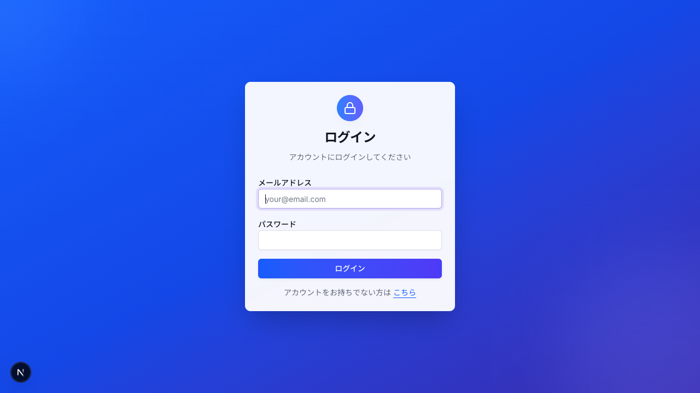
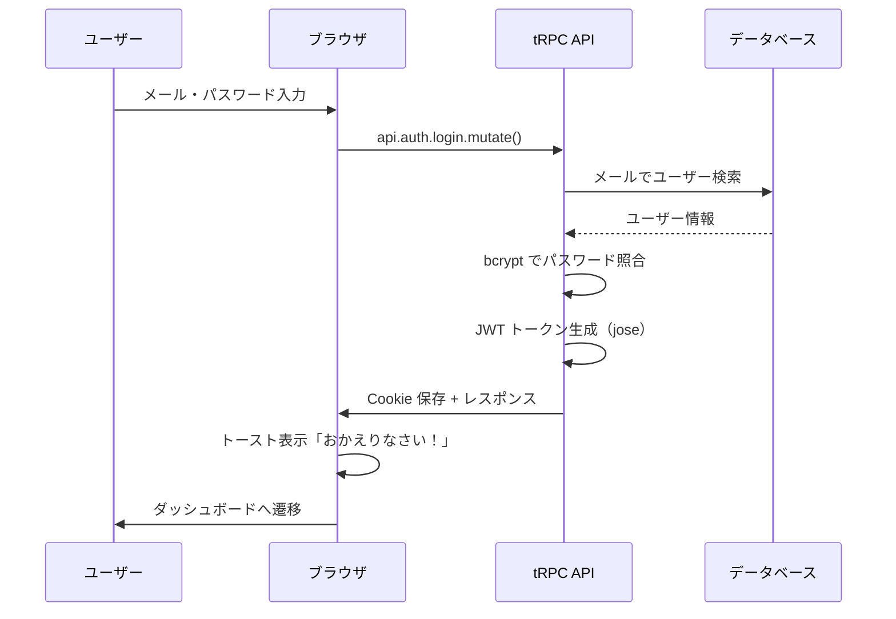
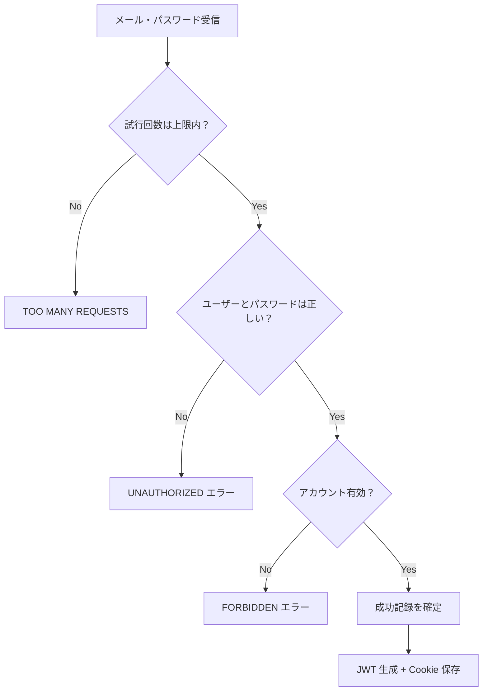
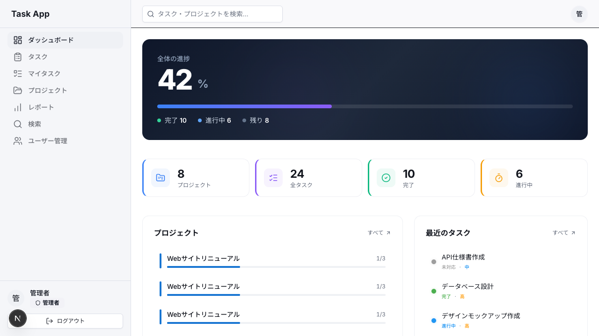

# Day 07: 認証バックエンドを作って、ログインを動かそう



## 前回の振り返り

Day 05-06 でログイン画面と登録画面の UI を作りました。
画面の動作確認に使える認証バックエンドは、配布スターターに入っています。

今日は、その「裏側」を自分の手で作り直します。
完成済みコードを残したまま読むのではなく、対象ファイルの中身を空にし、
小さな部品から順番につなぎ直します。

---

## 今日のゴール

ログイン・登録が実際に動くようにします。
その過程で、JWT トークン・bcrypt パスワード検証・HttpOnly Cookie・tRPC の仕組みを体験的に学びます。

- [ ] `src/lib/session.ts` — JWT セッション管理を作り直す
- [ ] `src/server/api/trpc.ts` — tRPC の土台を作り直す
- [ ] `src/server/api/routers/auth.ts` — 認証 API を作り直す
- [ ] `src/server/api/root.ts` — ルーターの束ね方を作り直す
- [ ] `src/app/api/trpc/[trpc]/route.ts` — HTTP ハンドラーを作り直す
- [ ] `src/middleware.ts` — ルート保護を作る
- [ ] DevTools でログインの流れを確認する

## なぜこれを作るのか

Day 05 で作ったログイン画面は、ブラウザ（フロントエンド）だけで動いています。
「このメールとパスワードが正しいか」を確認するには、
サーバー側にデータベースと照合する処理が必要です。

今日作る 6 ファイルが、ログインの「裏方」全部になります。

> **例え話**: レストランに例えると、Day 05-06 で作ったのは注文用紙（フォーム）。今日は厨房（サーバー）と配膳システム（API）を作って、注文がちゃんと通るようにします。

### 認証フローの全体像


```mermaid
sequenceDiagram
    participant U as ユーザー
    participant B as ブラウザ
    participant T as tRPC API
    participant D as データベース

    U->>B: メール・パスワード入力
    B->>T: api.auth.login.mutate()
    T->>D: メールでユーザー検索
    D-->>T: ユーザー情報
    T->>T: bcrypt でパスワード照合
    T->>T: JWT トークン生成（jose）
    T->>B: Cookie 保存 + レスポンス
    B->>B: トースト表示「おかえりなさい！」
    B->>U: ダッシュボードへ遷移
```

この図で追ってほしいのは、パスワードの登場が最初の 1 往復だけで終わる点です。
2 往復目からブラウザが持ち歩くのは、Cookie に入った JWT のほうになります。
だから今日いちばん守らないといけないものは、パスワードそのものではなく、この Cookie の中身です。
以降の Step は、そのトークンを誰に渡し、誰に読ませないかを 1 つずつ決めていく作業になります。

### やること / やらないこと

| やること | やらないこと |
|---------|-------------|
| 認証バックエンドを自分の手で作る | 暗号化の数学的仕組みを理解する |
| JWT・Cookie・middleware の仕組みを体験する | 独自の暗号化実装を作る |
| DevTools で認証フローを目で確認する | データベース設計（scaffold 済み） |

### 新しく学ぶ概念

| 概念 | 読み方 | 役割 | 例え |
|------|--------|------|------|
| JWT | ジェイ・ダブリュー・ティー | ユーザー情報を署名付きで格納したトークン | 遊園地のリストバンド。名前と有効期限入り |
| bcrypt | ビークリプト | パスワードを安全にハッシュ化 | 暗証番号を解読不能な暗号に変換するマシン |
| HttpOnly Cookie | エイチティーティーピー・オンリー・クッキー | JS から読めない安全な Cookie | 見えない場所に隠したリストバンド |
| tRPC | ティー・アール・ピー・シー | 型安全な API フレームワーク | フロントとバックで同じメニュー表を共有する仕組み |
| ミドルウェア | middleware | リクエストの前処理（認証ガード等） | 店の入口にいるガードマン |
| rate limit | レート・リミット | 短時間のログイン失敗回数を制限する | 暗証番号を何度も間違えると一時停止する仕組み |

> **今日のゴールライン**: JWT や bcrypt の数学的な仕組みまで理解する必要はありません。「ログインしたらトークンがもらえて、それで認証が通る」という流れを体験できたら OK。

## 実装ステップ一覧

| ステップ | 作業内容 | 所要時間 | 作成ファイル |
|---------|---------|---------|-------------|
| Step 0 | 書き直す前に控えを取る | 3分 | なし |
| Step 1 | session.ts を作り直す（JWT セッション管理） | 12分 | `src/lib/session.ts` |
| Step 2 | trpc.ts を作り直す（API の土台） | 10分 | `src/server/api/trpc.ts` |
| Step 3 | auth.ts を作り直す（認証ルーター） | 15分 | `src/server/api/routers/auth.ts` + ヘルパー |
| Step 4 | API を繋ぎ直す（ルーター登録 + HTTP ハンドラー） | 5分 | `src/server/api/root.ts`, `src/app/api/trpc/[trpc]/route.ts` |
| Step 5 | middleware.ts を作る（ルート保護） | 8分 | `src/middleware.ts` |
| Step 6 | ログインして動作確認する | 5分 | なし |
| Step 7 | DevTools で JWT と Cookie を確認する | 5分 | なし |

**合計時間**: 約 63 分。

この時間はコードを読んで理解する目安です。写経して打ち込む時間、詰まって調べる時間は別に見てください。

---

### Step 0: 書き直す前に控えを取る（3分）

今日は動いている4つのファイルを、いったん空にしてから書き直します。途中で貼り間違えても
戻せるように、先に控えを取ります。ターミナルで次を実行してください。

```bash
# filepath: ターミナル
mkdir -p ~/day07-backup
cp src/lib/session.ts src/server/api/trpc.ts \
   src/server/api/routers/auth.ts src/server/api/root.ts \
   ~/day07-backup/
ls ~/day07-backup
```

`ls` で4つのファイル名が出れば控えが取れています。書き直しに失敗したときは、たとえば
`cp ~/day07-backup/session.ts src/lib/` のように書き戻せば元の状態に戻ります。

**確認ポイント**:
- `ls ~/day07-backup` に `session.ts` `trpc.ts` `auth.ts` `root.ts` の4つが出る

---

### Step 1: session.ts を作り直す（JWT セッション管理・12分）

Step 1 から Step 4 のあいだ、アプリは動かない状態になります。開発サーバーを起動したままだと、まだ書き直していないファイル由来の英語のエラーが画面いっぱいに出ます。**Step 4 を終えるまでは `npm run dev` を Ctrl+C で止めておいて構いません。**

**ゴール**: ログイン状態を JWT トークンで管理する仕組みを作ります。

このファイルが認証の中心です。
「トークンを作る」「トークンを読む」「Cookie に保存する」「Cookie から取り出す」——
認証の基本操作が全部ここに入ります。

`src/lib/session.ts` を開き、中身をすべて削除してから作り直します。

#### 1-1. インポートと秘密鍵の取得

```typescript
// filepath: src/lib/session.ts
import { type JWTPayload, jwtVerify, SignJWT } from 'jose';
import { cookies } from 'next/headers';
import type { UserRole } from './constant/roles';
import { env } from './env';

function getKey(): Uint8Array {
  const SECRET_KEY = env.JWT_SECRET;
  const encoded = new TextEncoder().encode(SECRET_KEY);
  return new Uint8Array(encoded);
}
```

| コード | 意味 | 例え |
|--------|------|------|
| `jose` | JWT を扱うライブラリ | リストバンド製造機 |
| `cookies()` | Next.js の Cookie 操作 API | ブラウザの Cookie 棚 |
| `getKey()` | 秘密鍵を Uint8Array に変換 | 店長の印鑑を取り出す |

`getKey()` の返すこの鍵が、今日作る認証の土台です。
署名に使う鍵と検証に使う鍵が同じなので、鍵を知っている人は誰でも正規のトークンを作れます。
つまり `JWT_SECRET` が漏れた時点で、攻撃者は好きな `userId` と `role` を書いたトークンを自作でき、パスワードは要らなくなります。
`.env` をリポジトリへコミットしないのは、この 1 行を守るためです。

> `JWT_SECRET` は `.env` に scaffold が設定済み。32 文字以上の文字列で、本番では必ず変更します。

#### 1-2. 型定義と定数

```typescript
// filepath: src/lib/session.ts（続き）
export interface SessionPayload {
  userId: string;
  email: string;
  role: UserRole;
  exp: number;
}

export interface SessionUser {
  id: string;
  email: string;
  role: UserRole;
}

const COOKIE_NAME = 'session';
const COOKIE_MAX_AGE = 60 * 60 * 24 * 7; // 7日間
```

型を 2 つに分けているのは、トークンの都合を画面へ持ち込まないためです。
`SessionPayload` には `exp`（トークンの有効期限を表す数値）のような、トークンの管理にしか使わない値が入っています。
画面へ同じ型をそのまま渡すと、期限の持ち方を変えただけで画面側のコードまで直すことになります。
そこで `SessionUser` を別に用意して、画面が実際に表示する 3 つの値だけを渡します。

#### 1-3. 型ガードと暗号化

```typescript
// filepath: src/lib/session.ts（続き）
function isSessionPayload(
  payload: JWTPayload,
): payload is JWTPayload & SessionPayload {
  return (
    typeof payload['userId'] === 'string' &&
    typeof payload['email'] === 'string' &&
    typeof payload['role'] === 'string' &&
    typeof payload['exp'] === 'number'
  );
}
```

戻り値が `boolean` ではなく `payload is JWTPayload & SessionPayload` になっている点が要です。この書き方をすると、`true` が返った側の分岐では、TypeScript が「この値には4項目がそろっている」と扱ってくれます。だから呼び出し側で `payload.userId` を `as` で無理やり型変換せずに読めます。

中身を4つとも確かめているのは、JWT が「改ざんされていない」ことしか保証しないためです。署名が正しくても、古い版のアプリが `role` を入れずに発行したトークンなら、項目は欠けたまま届きます。ここで確かめずに先へ進むと、`role` が `undefined` のまま権限判定へ流れます。

**確認ポイント**:
- [ ] `isSessionPayload` が `userId` / `email` / `role` / `exp` を確認している

```typescript
// filepath: src/lib/session.ts（続き）
export async function encrypt(
  payload: SessionPayload,
): Promise<string> {
  const jwtPayload: Record<string, unknown> = {
    userId: payload.userId,
    email: payload.email,
    role: payload.role,
    exp: payload.exp,
  };

  return await new SignJWT(jwtPayload)
    .setProtectedHeader({ alg: 'HS256' })
    .setIssuedAt()
    .setExpirationTime('7d')
    .sign(getKey());
}
```

| コード | 意味 | 例え |
|--------|------|------|
| `isSessionPayload()` | JWT の中身が正しい形式か検証 | 書類の記入漏れチェック |
| `SignJWT` | 署名付き JWT を作成 | リストバンドに情報を刻印する機械 |
| `alg: 'HS256'` | 署名アルゴリズム | 偽造防止の特殊インクの種類 |
| `setExpirationTime('7d')` | 7 日間有効 | リストバンドの有効期限シール |
| `sign(getKey())` | 秘密鍵で署名 | 店長のハンコで正式認定 |

`jwtPayload` に入れているのは `userId` / `email` / `role` / `exp` の 4 つだけです。
JWT は暗号化しないので、ここへ入れた値は受け取った人がそのまま読めます。
パスワードや電話番号を足したくなっても入れてはいけないのは、そのためです。
最後の `.sign(getKey())` が付ける署名は、中身を隠すものではなく、書き換えられていないことを示す封印だと考えてください。

#### 1-4. 復号化（トークンを読む）

```typescript
// filepath: src/lib/session.ts（続き）
export async function decrypt(
  token: string,
): Promise<SessionPayload | null> {
  try {
    const { payload } = await jwtVerify(token, getKey(), {
      algorithms: ['HS256'],
    });

    if (!isSessionPayload(payload)) {
      console.error('Invalid session payload structure');
      return null;
    }

    return payload;
  } catch {
    console.error('Failed to decrypt token');
    return null;
  }
}
```

`encrypt` でトークンを作り、`decrypt` でトークンを読みます。この2つは対になる操作です。
読む側の中心は `jwtVerify` で、秘密鍵と合う署名が付いているかを確かめます。
ここを飛ばして中身だけ取り出す作りにすると、攻撃者は自分で `role: "ADMIN"` と書いたトークンを貼り付けるだけで管理者になれます。
署名が通っても項目が足りなければ `isSessionPayload` で弾き、期限切れなどで例外が出たときは `catch` が `null` を返します。
ログイン済みとみなしてよいのは、この関数が `null` 以外を返したときだけです。

#### 1-5. セッション操作（作成・取得・削除・検証）

```typescript
// filepath: src/lib/session.ts（続き）
export async function saveSessionCookie(
  token: string,
): Promise<void> {
  const cookieStore = await cookies();
  cookieStore.set(COOKIE_NAME, token, {
    httpOnly: true,
    secure:
      process.env['NODE_ENV'] === 'production'
      && process.env['PLAYWRIGHT_TEST'] !== '1',
    sameSite: 'strict',
    maxAge: COOKIE_MAX_AGE,
    path: '/',
  });
}
```

トークンを Cookie へ書き込む処理だけを、別の関数へ切り出しています。
ログイン直後と、あとから発行し直すときの両方から呼ぶので、書き込みの条件を 1 か所にそろえておくためです。
そして、ここで渡している 5 つの設定が、ブラウザに置かれたトークンを守る唯一の柵になります。
たとえば `httpOnly: true` を外すと、ページに紛れ込んだスクリプトが `document.cookie` からトークンを読み出せてしまいます。
設定それぞれの意味は、この節の最後の表へまとめてあります。

**確認ポイント**:
- [ ] Cookie 設定を `saveSessionCookie` に分けて書けている

```typescript
// filepath: src/lib/session.ts（続き）
export async function createSession(
  user: SessionUser,
): Promise<string> {
  const expiresAt =
    Math.floor(Date.now() / 1000) + COOKIE_MAX_AGE;
  const payload: SessionPayload = {
    userId: user.id,
    email: user.email,
    role: user.role,
    exp: expiresAt,
  };

  const token = await encrypt(payload);
  await saveSessionCookie(token);

  return token;
}
```

`exp` を秒で数えているのは、JWT の決まりが秒を使うためです。`Date.now()` はミリ秒を返すので、1000 で割らずに入れると有効期限が1000倍先になり、実質的に期限切れしないトークンができます。

期限をトークンの中と Cookie の両方に持たせているのは、片方だけでは足りないからです。Cookie の期限だけだと、利用者が手元で Cookie の期限を書き換えて延命できます。トークンの中にも `exp` を入れておけば、署名で守られているので書き換えられません。

**確認ポイント**:
- [ ] `createSession` から `saveSessionCookie(token)` を呼んでいる

```typescript
// filepath: src/lib/session.ts（続き）
export async function getSession(): Promise<SessionPayload | null> {
  const cookieStore = await cookies();
  const token = cookieStore.get(COOKIE_NAME)?.value;

  if (!token) {
    return null;
  }

  return await decrypt(token);
}
```

`cookieStore.get(COOKIE_NAME)?.value` は、Cookie が見つからないと `undefined` になります。
それをそのまま `decrypt` へ渡すと例外で止まるので、手前で `null` を返して打ち切ります。
未ログインはエラーではなく、まだ誰でもない状態です。
だからここでは例外を投げず、呼び出した側へ「セッションが無い」とだけ伝えます。
この使い分けができていないと、ログイン画面を開いただけでサーバーエラーが出る作りになります。

**確認ポイント**:
- [ ] Cookie がない場合に `null` を返している

```typescript
// filepath: src/lib/session.ts（続き）
export async function deleteSession(): Promise<void> {
  const cookieStore = await cookies();
  cookieStore.delete(COOKIE_NAME);
}

export async function verifySession(): Promise<SessionUser | null> {
  const session = await getSession();

  if (!session) {
    return null;
  }

  return {
    id: session.userId,
    email: session.email,
    role: session.role,
  };
}
```

**Cookie 設定の意味**:

| 設定 | 値 | なぜ必要か |
|------|-----|---------|
| `httpOnly` | `true` | JavaScript から読めなくして XSS 攻撃を防ぐ |
| `secure` | 本番のみ `true` | HTTPS でのみ送信して盗聴を防ぐ |
| `sameSite` | `'strict'` | 別サイトからのリクエストに Cookie を付けない |
| `maxAge` | 7 日間 | セッションの有効期限 |

**確認ポイント**:
- [ ] `src/lib/session.ts` を教材のコードで作り直した
- [ ] `encrypt` / `decrypt` / `createSession` / `getSession` / `deleteSession` / `verifySession` の 6 関数がある
- [ ] この時点ではまだ `npm run dev` しなくて OK

**学んだこと**: JWT は「誰が」「いつまで」「どの権限で」ログインしているかを、署名付きで保持する仕組みです。

---

### Step 2: trpc.ts を作り直す（API の土台・10分）

**ゴール**: tRPC の初期設定と、public / protected / admin の 3 種類の API を定義します。

Day 05 のログイン画面は `api.auth.login.useMutation()` でサーバーを呼んでいました。
その呼び出しを受け止めるサーバー側の土台が、これから作り直すこのファイルです。

`src/server/api/trpc.ts` を開き、中身をすべて削除してから作り直します。

#### 2-1. コンテキスト作成

```typescript
// filepath: src/server/api/trpc.ts
import { initTRPC, TRPCError } from '@trpc/server';
import superjson from 'superjson';
import { ZodError } from 'zod';
import { USER_ROLE } from '@/lib/constant/roles';
import { prisma } from '@/lib/prisma';
import { getSession } from '@/lib/session';

export const createTRPCContext = async (
  opts: { headers: Headers },
) => {
  const session = await getSession();

  return {
    session,
    ...opts,
  };
};

export type Context = Awaited<
  ReturnType<typeof createTRPCContext>
>;
```

コンテキストとは、1 回のリクエストのあいだ、どの API 処理からも参照できる共通の入れ物です。
ログイン中のユーザーをここへ入れておくのは、API を 1 つ増やすたびに Cookie の読み取りと JWT の検証を書き足さずに済ませるためです。
判定は 1 リクエストにつき 1 回だけ走り、どの API 処理も同じ結果を受け取ります。

#### 2-2. tRPC インスタンス初期化

```typescript
// filepath: src/server/api/trpc.ts（続き）
const t = initTRPC.context<Context>().create({
  transformer: superjson,
  errorFormatter({ shape, error }) {
    return {
      ...shape,
      data: {
        ...shape.data,
        zodError:
          error.cause instanceof ZodError
            ? error.cause.flatten()
            : null,
      },
    };
  },
});
```

| コード | 意味 |
|--------|------|
| `superjson` | Date や BigInt を JSON で送れるようにする変換器 |
| `errorFormatter` | zod のバリデーションエラーを使いやすい形に整形 |

#### 2-3. 認証ミドルウェアとプロシージャ

```typescript
// filepath: src/server/api/trpc.ts（続き）
const isAuthenticated = t.middleware(
  async ({ ctx, next }) => {
    if (!ctx.session?.userId) {
      throw new TRPCError({
        code: 'UNAUTHORIZED',
        message: 'ログインが必要です',
      });
    }

    const currentUser = await prisma.user.findUnique({
      where: { id: ctx.session.userId },
      select: {
        id: true,
        role: true,
        isActive: true,
      },
    });
```

前半は、`ctx.session?.userId` が無ければ `UNAUTHORIZED` を投げて先へ進ませない門番です。
目を留めてほしいのは、その直後に `prisma.user.findUnique` でデータベースを引き直しているところです。
JWT の有効期限は 7 日間あるので、たった今アカウントを止めても、相手の手元にあるトークンは形の上では有効なままです。
トークンの中身だけを信じる作りだと、止めたはずの相手を最大 7 日間止められません。
リクエストのたびにデータベースを見に行くのは、この時間差を埋めるためです。

**確認ポイント**:
- [ ] セッションの `userId` で DB のユーザーを取り直している

```typescript
// filepath: src/server/api/trpc.ts（続き）
    if (!currentUser) {
      throw new TRPCError({
        code: 'UNAUTHORIZED',
        message: 'ユーザーが見つかりません',
      });
    }

    if (!currentUser.isActive) {
      throw new TRPCError({
        code: 'FORBIDDEN',
        message: 'このアカウントは無効化されています',
      });
    }
```

分岐を 2 つに分けているのは、返すべき答えが違うからです。
ユーザーが見つからない側は、退会などでレコードが消えた状態にあたります。
相手が誰なのか確かめられないので `UNAUTHORIZED` を返し、ログインし直せば通る可能性を残します。
`isActive` が `false` の側は、誰かは分かっているが利用を止めてある状態なので `FORBIDDEN` を返します。
まとめて 1 つのエラーにすると、画面側は「もう一度ログインしてください」と案内すべきかどうかを判断できません。

**確認ポイント**:
- [ ] DB にユーザーがない場合と無効化済みの場合を分けている

```typescript
// filepath: src/server/api/trpc.ts（続き）
    return next({
      ctx: {
        session: {
          ...ctx.session,
          role: currentUser.role,
        },
      },
    });
  },
);
```

`role: currentUser.role` で上書きしているのが、この節でいちばん大事な行です。トークンに入っている `role` は、ログインした瞬間の値で固定されています。あとから管理者権限を外しても、その人が持っているトークンの中身は変わりません。ここで毎回データベースの値を取り直して差し替えるので、権限を外した効果がすぐ効きます。

上書きせずにトークンの `role` をそのまま使うと、権限を外された人が、期限が切れるまで管理者として動けます。

**確認ポイント**:
- [ ] 未ログイン時に `UNAUTHORIZED` を返す分岐がある
- [ ] DB から `isActive` を確認している

```typescript
// filepath: src/server/api/trpc.ts（続き）
const isAdmin = t.middleware(async ({ ctx, next }) => {
  if (ctx.session?.role !== USER_ROLE.ADMIN) {
    throw new TRPCError({
      code: 'FORBIDDEN',
      message: '管理者権限が必要です',
    });
  }

  return next({ ctx });
});
```

`isAdmin` は、これ単体では守りになりません。
見ているのは `ctx.session?.role` だけで、その値は 1 つ前の `isAuthenticated` がデータベースの内容で上書きしたものだからです。
`isAuthenticated` を通さずにこれだけを使うと、権限を下げた直後のユーザーが、古いトークンに残った `ADMIN` のまま管理者向け API を呼べてしまいます。
本当の守りは `isAuthenticated` 側にあり、`isAdmin` はそこで確定した値をふるいにかける役です。
次のコードで `.use()` を並べる順番が、そのまま守りの順番になります。

**確認ポイント**:
- [ ] 管理者以外を `FORBIDDEN` にする `isAdmin` がある

```typescript
// filepath: src/server/api/trpc.ts（続き）
export const createTRPCRouter = t.router;
export const publicProcedure = t.procedure;
export const protectedProcedure =
  t.procedure.use(isAuthenticated);
export const adminProcedure =
  t.procedure.use(isAuthenticated).use(isAdmin);
export const createCallerFactory = t.createCallerFactory;
```

**3 種類の API**:

| 種別 | 認証 | 使う場面 | API 例 |
|------|------|---------|-------|
| `publicProcedure` | 不要 | 誰でも呼べる | ログイン、登録 |
| `protectedProcedure` | 必須 | ログインユーザーのみ | タスク操作、プロジェクト管理 |
| `adminProcedure` | 管理者のみ | 管理機能 | ユーザー管理 |

> `isAuthenticated` ミドルウェアは、Cookie のセッション情報だけでなく DB からユーザーの最新状態を取得します。アカウントが無効化されていたら、ここで弾きます。

**確認ポイント**:
- [ ] `src/server/api/trpc.ts` を教材のコードで作り直した
- [ ] `publicProcedure` / `protectedProcedure` / `adminProcedure` の 3 つが export されている

**学んだこと**: tRPC のミドルウェアで「ログイン必須」「管理者のみ」といった認証制御を API 定義にチェーン（`.use()`）するだけで追加できます。

---

### Step 3: auth.ts を作り直す（認証ルーター・15分）

**ゴール**: ログイン・登録・ログアウト・セッション取得・現在のユーザー取得の 5 つの API を作ります。

ここが今日のメインです。配布スターターには、Day 05 と Day 06 の画面を先に動かすため、完成済みの認証 API が入っています。ここでは動いているコードを答えとして眺めるだけにせず、`auth.ts` の中身を削除し、手順どおりに自分で作り直します。

まず、共通のヘルパーを作ります。

#### 3-0. select ヘルパーを作る

`src/server/api/routers/_helpers/select.ts` を開き、教材のコードと見比べます。
内容が異なる場合は、中身を教材のコードへ置き換えてください。

```typescript
// filepath: src/server/api/routers/_helpers/select.ts
import { z } from 'zod';
import { PROJECT_MEMBER_ROLE } from '@/lib/constant/roles';

export const USER_SELECT = {
  id: true,
  name: true,
  email: true,
  avatar: true,
} as const;

export const USER_DETAIL_SELECT = {
  id: true,
  email: true,
  name: true,
  avatar: true,
  role: true,
  isActive: true,
} as const;

export const projectMemberRoleSchema =
  z.nativeEnum(PROJECT_MEMBER_ROLE);
```

Prisma（読み方はプリズマ、TypeScript からデータベースを操作するための道具）の `select` は、取り出す項目をこちらで指定する書き方です。
これを API ごとに書くと、同じユーザー情報でも API によって返る項目がばらつきます。
1 か所でも書き間違えれば、その API だけが外へ出したくない項目まで返します。
定数にまとめておけば、項目を足すときに直す場所は 1 つで済みます。
`as const` を付けると中身が読み取り専用になり、返り値の型もここで並べた項目どおりに決まります。

#### 3-1. auth.ts のインポートとバリデーション

`src/server/api/routers/auth.ts` を開き、中身をすべて削除してから作り直します。
ファイル自体は削除せず、空になった同じファイルへ次のコードを書いてください。

```typescript
// filepath: src/server/api/routers/auth.ts
import { TRPCError } from '@trpc/server';
import bcrypt from 'bcryptjs';
import { z } from 'zod';
import { USER_ROLE } from '@/lib/constant/roles';
import { prisma } from '@/lib/prisma';
import {
  checkLoginRateLimit,
  extractClientIp,
  rateLimitToTRPCError,
  recordLoginSuccess,
} from '@/lib/rate-limit';
import { createSession, deleteSession, type SessionUser } from '@/lib/session';
import { createTRPCRouter, protectedProcedure, publicProcedure } from '../trpc';
import { USER_DETAIL_SELECT } from './_helpers/select';
```

取り込んだ道具は役割ごとに分かれています。
`bcrypt` はパスワードの照合、`z` は入力の検証、`prisma` はデータベースへの問い合わせに使います。
`@/lib/rate-limit` から取り込んだ 4 つは、ログイン失敗の回数を数えて、当てずっぽうの試行を止めるための道具です。
最後の `publicProcedure` はログイン前でも呼べる手続き、`protectedProcedure` はログイン済みだけが呼べる手続きを作ります。
ログインと登録に `publicProcedure` を使わないと、まだログインしていない人がログインできない API になってしまいます。

**確認ポイント**:
- [ ] 認証 API に必要な import が揃っている

```typescript
// filepath: src/server/api/routers/auth.ts（続き）
const loginSchema = z.object({
  email: z.string().email('有効なメールアドレスを入力してください'),
  password: z.string().min(1, 'パスワードを入力してください'),
});
```

このあと出てくる `registerSchema` と見比べると、`password` の条件が `min(1)` だけになっています。
ログイン側で 8 文字以上や記号必須まで課すと、いま登録されているパスワードでログインできなくなる人が出ます。
登録時の条件は、あとから厳しくすることがあります。付属の初期データに入っている `password123` も、いまの `registerSchema` の条件は満たしません。
ここでの検証は、空の値をデータベース照合まで流さないための入口チェックにとどめます。
正しいかどうかを決めるのは、このあとの `bcrypt.compare` の仕事です。

**確認ポイント**:
- [ ] ログイン入力は email と password を検証している

```typescript
// filepath: src/server/api/routers/auth.ts（続き）
const registerSchema = z.object({
  name: z.string().min(1, '名前を入力してください'),
  email: z.string().email('有効なメールアドレスを入力してください'),
  password: z
    .string()
    .min(8, 'パスワードは8文字以上で入力してください')
    .regex(/[A-Z]/, 'パスワードには大文字を含める必要があります')
    .regex(/[a-z]/, 'パスワードには小文字を含める必要があります')
    .regex(/[0-9]/, 'パスワードには数字を含める必要があります')
    .regex(/[^A-Za-z0-9]/, 'パスワードには特殊文字を含める必要があります'),
});
```

> zod でバリデーションを定義しておくと、tRPC が自動で入力チェックしてくれます。フロント側でもバックエンド側でも同じスキーマを使えます。

#### 3-2. エラーハンドラーとログイン処理

```typescript
// filepath: src/server/api/routers/auth.ts（続き）
function handleUnexpectedError(context: string, error: unknown): never {
  console.error('[auth] unexpected error', { context, error });
  throw new TRPCError({
    code: 'INTERNAL_SERVER_ERROR',
    message: `${context}中にエラーが発生しました。しばらくしてから再度お試しください。`,
    cause: error,
  });
}
```

戻り値の型が `never` なのは、この関数が値を返さず必ず例外を投げるからです。
呼んだ側は、この行から先へ進まないと型の上でも分かります。
本物のエラーは `console.error` でサーバーのログにだけ残し、画面へ返すのは決まった文言だけにします。
データベースのエラー文をそのまま返すと、テーブル名や列名といった内部の作りが相手に見えてしまうためです。
末尾の `cause: error` は、原因を捨てずに開発時の調査へ残しておくための指定です。

**確認ポイント**:
- [ ] 予期しないエラーを `TRPCError` に変換している

```typescript
// filepath: src/server/api/routers/auth.ts（続き）
export const authRouter = createTRPCRouter({
  login: publicProcedure.input(loginSchema).mutation(async ({ input, ctx }) => {
    const ip = extractClientIp(ctx.headers);

    // brute force 対策: 直近 15 分の失敗回数を email 単独 / email×IP / IP 単独の3軸で rate-limit。
    // checkLoginRateLimit は許可と同時に失敗行を先取りで記録する（成功時は recordLoginSuccess が削除）
    const limitResult = await checkLoginRateLimit(input.email, ip);
    if (!limitResult.allowed) {
      throw rateLimitToTRPCError(limitResult);
    }
```

ログイン処理の最初の仕事は、データベースを引くことではなく回数を数えることです。
`checkLoginRateLimit` を `prisma.user.findUnique` より前に置くのは、当てずっぽうのパスワードを何万回も試す攻撃を、照合へ届く前に止めるためです。
数える軸は、`extractClientIp` で取り出した接続元 IP と、送られてきたメールアドレスの両方です。
IP だけで数えると、接続元を変えながら同じアカウントを狙う手口を数え落とします。
逆にメールだけで数えると、1 つの IP から大量のアカウントを試す手口が素通りします。

**確認ポイント**:
- [ ] IP を取り出し、ログイン試行回数を先に確認している

```typescript
// filepath: src/server/api/routers/auth.ts（続き）
    try {
      const user = await prisma.user.findUnique({
        where: { email: input.email },
      });

      if (!user?.password) {
        // 失敗は checkLoginRateLimit が先取りで記録済みのため、ここでは追加記録しない
        throw new TRPCError({
          code: 'UNAUTHORIZED',
          message: 'メールアドレスまたはパスワードが正しくありません',
        });
      }

      const isPasswordValid = await bcrypt.compare(input.password, user.password);
```

`user?.password` という 1 つの条件で、ユーザーが存在しない場合とパスワードが登録されていない場合をまとめて弾いています。
返す文言は、このあとのパスワード不一致とまったく同じです。
片方だけ「そのメールアドレスは登録されていません」と返すと、攻撃者は総当たりで有効なメールアドレスの一覧を作れてしまいます。
照合に `===` ではなく `bcrypt.compare` を使うのは、データベースに入っているのがハッシュ化された文字列で、入力された生のパスワードとは一致しないためです。
`bcrypt.compare` は、入力を同じ手順で変換してから見比べます。

**確認ポイント**:
- [ ] ユーザー有無とパスワード照合を同じエラーで確認している

```typescript
// filepath: src/server/api/routers/auth.ts（続き）
      if (!isPasswordValid) {
        // 失敗は checkLoginRateLimit が先取りで記録済みのため、ここでは追加記録しない
        throw new TRPCError({
          code: 'UNAUTHORIZED',
          message: 'メールアドレスまたはパスワードが正しくありません',
        });
      }

      if (!user.isActive) {
        // 無効判定はパスワード照合が通ったあとに行う。先に判定すると、正しいパスワードを
        // 知らなくても「無効化されたアカウントが存在する」ことを列挙できてしまうため。
        throw new TRPCError({
          code: 'FORBIDDEN',
          message: 'このアカウントは無効化されています',
        });
      }
```

`isActive` の判定をパスワード照合より後ろへ置いた理由は、コード中のコメントのとおりです。
先に判定すると、パスワードを知らない相手でも「このメールアドレスは無効化済みのアカウントとして実在する」と読み取れてしまいます。
判定を 1 つ入れ替えるだけで、隠しておきたい事実が漏れます。
認証の処理では、書いてある順番そのものが守りの一部になります。
上から読んだときに、通過条件が厳しい順に並んでいるかを確かめてください。

**確認ポイント**:
- [ ] パスワード照合後に `isActive` を確認している

```typescript
// filepath: src/server/api/routers/auth.ts（続き）
      const sessionUser: SessionUser = {
        id: user.id,
        email: user.email,
        role: user.role,
      };

      // セッション発行の前に成功記録を確定させる。順序が逆だと、記録の失敗で 500 を返す一方で
      // 認証済みセッションだけが残るため。
      await recordLoginSuccess(input.email, ip);
      await createSession(sessionUser);
```

ここまで来た人だけが、ログイン成功として扱われます。
`recordLoginSuccess` を `createSession` より先に呼ぶのは、Cookie を配ったあとで失敗記録の削除に失敗すると、ログインできた本人が失敗回数に縛られたまま残るからです。
記録を先に確定させておけば、途中で落ちても発行済みのセッションだけが宙に浮く事態を避けられます。
`SessionUser` へ詰めるのは `id` / `email` / `role` の 3 つだけです。
ここへ `password` を足すと、ハッシュ化済みとはいえトークンの中身として誰でも読める場所へ出てしまいます。

**確認ポイント**:
- [ ] 成功記録を確定してからセッションを発行している

```typescript
// filepath: src/server/api/routers/auth.ts（続き）

      return {
        user: {
          id: user.id,
          email: user.email,
          name: user.name,
          avatar: user.avatar,
          role: user.role,
        },
      };
    } catch (error) {
      if (error instanceof TRPCError) throw error;
      handleUnexpectedError('ログイン処理', error);
    }
  }),
```

返しているのは画面表示に要る 5 項目だけで、`user` をそのまま返してはいません。
`prisma.user.findUnique` の戻り値にはハッシュ化済みのパスワードも入っており、返してしまうと総当たりの材料を相手へ渡すことになります。
`catch` の中で `TRPCError` だけを投げ直しているのは、`UNAUTHORIZED` のような意図した失敗を 500 エラーへ塗り替えないためです。
それ以外の想定外だけが `handleUnexpectedError` へ回り、ログには残しつつ当たり障りのない文言に置き換わります。

**ログイン処理の流れ**:


```mermaid
flowchart TD
    A[メール・パスワード受信] --> B{試行回数は上限内？}
    B -->|No| I[TOO MANY REQUESTS]
    B -->|Yes| C{ユーザーとパスワードは正しい？}
    C -->|No| E[UNAUTHORIZED エラー]
    C -->|Yes| D{アカウント有効？}
    D -->|No| F[FORBIDDEN エラー]
    D -->|Yes| G[成功記録を確定]
    G --> H[JWT 生成 + Cookie 保存]
```

> **なぜ同じエラーメッセージ？** 「メールが存在しない」と「パスワードが違う」を区別すると、攻撃者に「このメールは登録済み」と教えてしまいます。セキュリティのために同じメッセージを返します。
>
> `checkLoginRateLimit` は、同じメールや IP から短時間に
> 失敗が続いたとき、パスワード照合へ進む前に止めます。
> 成功時は `recordLoginSuccess` で失敗記録を削除してから
> セッションを発行します。順序を逆にすると、記録の削除に
> 失敗したのに認証 Cookie だけが残るため、この順にします。

> **ここで塞げていないこと**: ログインは「メールが無い」と「パスワードが違う」を同じ文言にしていますが、このあと書く `register` は重複したメールに対して `このメールアドレスは既に登録されています` を返します。つまり、登録の側から「そのメールが使われているか」は分かってしまいます。しかも `register` は `checkLoginRateLimit` を通しません。実務では、登録でも同じ回数制限をかけるか、重複かどうかを返さずメールで案内する作りにします。この教材では、初心者が登録に失敗した理由を分かるようにするため、あえて明示する形を採っています。

#### 3-3. 登録・ログアウト・セッション取得

ここから先の「（続き）」のブロックは、`auth.ts` の**末尾に続けて**貼ります。いまの `auth.ts` は Step 3-2 で書いた `  }),` で終わっていて、`createTRPCRouter({` はまだ閉じていません。閉じ括弧の `});` は Step 3-3 の最後のブロックで書くので、それまでは自分で足さないでください。

```typescript
// filepath: src/server/api/routers/auth.ts（続き）
  register: publicProcedure
    .input(registerSchema)
    .mutation(async ({ input }) => {
      try {
        const existing = await prisma.user.findUnique({
          where: { email: input.email },
        });
```

登録処理の最初は、同じメールアドレスがすでに使われていないかの確認です。
ただし、この検索は重複を止める最後の砦ではありません。
ほぼ同時に 2 件の登録が届くと、どちらも「まだ無い」と判断して通り抜ける瞬間があるからです。
最終的に重複を止めるのは、`schema.prisma` で `email` に付けてある一意制約のほうです。
ここでの検索は、利用者へ分かりやすいエラーを返すための確認だと考えてください。

**確認ポイント**:
- [ ] 登録前に同じメールアドレスのユーザーを探している

```typescript
// filepath: src/server/api/routers/auth.ts（続き）
        if (existing) {
          throw new TRPCError({
            code: 'CONFLICT',
            message:
              'このメールアドレスは既に登録されています',
          });
        }

        const hashedPassword = await bcrypt.hash(
          input.password,
          10,
        );
```

`bcrypt.hash` の第2引数の `10` は、変換にかける計算量を決めるコスト値です。繰り返す回数そのものではなく、`2` の `10` 乗という形で効きます。`11` に上げると計算量はおよそ2倍、`12` ならおよそ4倍です。1つ増やすだけで1回の変換にかかる時間が倍になり、盗まれたハッシュから元のパスワードを総当たりで探す側も、同じ倍率だけ待たされます。小さくすると登録とログインは速くなりますが、同じ時間で総当たりに試される回数も増えます。大きくしすぎると、登録とログインのたびに読者を待たせます。`10` はその折り合いとして広く使われている値です。

同じパスワードでも、保存される文字列は毎回違います。`bcrypt` が変換のたびに乱数を混ぜ、その乱数も結果の文字列へ含めるためです。だから、同じ文字列が2つ並んでいるかを見ても、同じパスワードを使っている人は分かりません。

**確認ポイント**:
- [ ] 重複メールを `CONFLICT` で弾いている
- [ ] `bcrypt.hash` でパスワードをハッシュ化している

```typescript
// filepath: src/server/api/routers/auth.ts（続き）
        const user = await prisma.user.create({
          data: {
            email: input.email,
            name: input.name,
            password: hashedPassword,
            role: USER_ROLE.USER,
            isActive: true,
          },
        });
```

このコードで一番大事な行は `role: USER_ROLE.USER` です。
ここを `input.role` にして利用者の入力から受け取る作りにすると、登録フォームへ `role: "ADMIN"` を混ぜて送るだけで、誰でも管理者アカウントを作れてしまいます。
登録 API は誰でも呼べる `publicProcedure` なので、権限だけは入力から切り離してサーバー側で固定します。
`isActive: true` も同じ考え方で、有効か無効かを利用者に決めさせません。
入力に混ぜてよいのは、間違っても本人しか困らない値だけです。

**確認ポイント**:
- [ ] 新規ユーザーを `USER_ROLE.USER` で作成している

```typescript
// filepath: src/server/api/routers/auth.ts（続き）
        const sessionUser: SessionUser = {
          id: user.id,
          email: user.email,
          role: user.role,
        };

        await createSession(sessionUser);

        return {
          user: {
            id: user.id,
            email: user.email,
            name: user.name,
            avatar: user.avatar,
            role: user.role,
          },
        };
      } catch (error) {
        if (error instanceof TRPCError) throw error;
        handleUnexpectedError('ユーザー登録処理', error);
      }
    }),
```

登録が終わったらそのまま `createSession` を呼び、ログイン画面へ戻さずに済ませます。
ここを省くと、登録し終えた人がもう一度メールアドレスとパスワードを打ち直すことになり、その一手間で離脱する人が出ます。
返す `user` から `password` を外してあるのは、ログインの戻り値とそろえたのと同じ理由です。
`catch` の形もログインと合わせてあるので、`TRPCError` はそのまま画面へ、それ以外は `handleUnexpectedError` へ渡ります。

**確認ポイント**:
- [ ] 登録直後、`createSession` でログイン状態にしている

```typescript
// filepath: src/server/api/routers/auth.ts（続き）
  logout: publicProcedure.mutation(async () => {
    await deleteSession();
    return { success: true };
  }),

  getSession: publicProcedure.query(async ({ ctx }) => {
    if (!ctx.session) {
      return null;
    }

    const user = await prisma.user.findUnique({
      where: { id: ctx.session.userId },
      select: USER_DETAIL_SELECT,
    });

    if (!user || !user.isActive) {
      return null;
    }

    return { user };
  }),
```

`getSession` が Cookie の中身をそのまま返さず、毎回データベースを引き直しているのには理由があります。Cookie に入っているのはログインした時点の名前や役割で、そのあと本人が名前を変えても古いままです。ここで取り直しておくと、画面のどこに出しても最新の値になります。

`!user || !user.isActive` で `null` を返しているのは、退会したり無効化されたりした人の Cookie がまだ手元に残っているためです。トークン自体は期限まで有効なので、この確認が無いと、無効にしたはずの人がログイン済みとして扱われます。

**確認ポイント**:
- [ ] `logout` は Cookie を削除している
- [ ] `getSession` は未ログインなら `null` を返す

```typescript
// filepath: src/server/api/routers/auth.ts（続き）
  getCurrentUser: protectedProcedure.query(
    async ({ ctx }) => {
      const user = await prisma.user.findUnique({
        where: { id: ctx.session.userId },
        select: {
          ...USER_DETAIL_SELECT,
          createdAt: true,
          updatedAt: true,
        },
      });
```

5 つの API のうち、`protectedProcedure` で作るのは `getCurrentUser` だけです。
未ログインなら `null` を返せばよい `getSession` と違って、こちらは本人しか呼ばない前提なので、入口で弾いてしまうほうが安全です。
`ctx.session.userId` を鍵にしてデータベースを引き直すのは、トークンを作ったあとに名前やアイコンが変わっていても、最新の値を返すためです。
`select` に `createdAt` と `updatedAt` を足しているのは、プロフィール画面で登録日と更新日を出すからです。
必要な項目だけを並べておけば、パスワードのような返してはいけない列が紛れ込みません。

**確認ポイント**:
- [ ] `getCurrentUser` はログイン中ユーザーの詳細を取得している

```typescript
// filepath: src/server/api/routers/auth.ts（続き）
      if (!user) {
        throw new TRPCError({
          code: 'NOT_FOUND',
          message: 'ユーザーが見つかりません',
        });
      }

      if (!user.isActive) {
        throw new TRPCError({
          code: 'FORBIDDEN',
          message: 'このアカウントは無効化されています',
        });
      }

      return user;
    },
  ),
});
```

| API | 種別 | 認証 | 用途 |
|-----|------|------|------|
| `login` | mutation | 不要 | ログイン |
| `register` | mutation | 不要 | ユーザー登録 |
| `logout` | mutation | 不要 | ログアウト |
| `getSession` | query | 不要 | 現在のセッション確認（null 許容） |
| `getCurrentUser` | query | 必須 | ログインユーザーの詳細取得 |

> `bcrypt.hash(password, 10)` の `10` はソルトラウンド。数字が大きいほど安全だが遅くなります。10 が一般的なバランス。

**確認ポイント**:
- [ ] `src/server/api/routers/_helpers/select.ts` を教材のコードと照合した
- [ ] `src/server/api/routers/auth.ts` を教材のコードで作り直した
- [ ] `authRouter` に 5 つの API（login / register / logout / getSession / getCurrentUser）がある

**学んだこと**: パスワードは平文で保存せず `bcrypt.hash` でハッシュ化し、照合は `bcrypt.compare` で行います。

---

### Step 4: API を繋ぎ直す（ルーター登録 + HTTP ハンドラー・5分）

**ゴール**: 作った auth ルーターを tRPC に登録し、HTTP リクエストを受け付けられるようにします。

#### 4-1. root.ts（ルーターを束ねる）

`src/server/api/root.ts` を開き、中身を教材のコードへ置き換えます。

```typescript
// filepath: src/server/api/root.ts
import { authRouter } from './routers/auth';
import { createCallerFactory, createTRPCRouter } from './trpc';

export const appRouter = createTRPCRouter({
  auth: authRouter,
});

export type AppRouter = typeof appRouter;

export const createCaller = createCallerFactory(appRouter);
```

`export type AppRouter = typeof appRouter;` の1行が、画面側の型の出どころです。この型を書き出しておくと、`api.auth.login.useMutation()` と打った時点で、引数の形も戻り値の形もエディタが知っている状態になります。サーバーの手続きを増やせば、画面側の候補も自動で増えます。逆にこの行を消すと、画面側は何を呼べるのか分からなくなり、すべて手で型を書くことになります。

プロジェクトやタスクのルーターは、それを実際に使う Day 09 以降で 1 つずつ足していきます。

#### 4-2. route.ts（HTTP ハンドラー）

`src/app/api/trpc/[trpc]/route.ts` を開き、中身を教材のコードへ置き換えます。

```typescript
// filepath: src/app/api/trpc/[trpc]/route.ts
import { fetchRequestHandler } from '@trpc/server/adapters/fetch';
import type { NextRequest } from 'next/server';
import { appRouter } from '@/server/api/root';
import { createTRPCContext } from '@/server/api/trpc';

const handler = (req: NextRequest) =>
  fetchRequestHandler({
    endpoint: '/api/trpc',
    req,
    router: appRouter,
    createContext: () =>
      createTRPCContext({ headers: req.headers }),
  });

export { handler as GET, handler as POST };
```

フォルダ名の `[trpc]` が角括弧で囲まれているのは、URL のその部分に何が来ても受け取るという印です。
おかげで `/api/trpc/auth.login` でも `/api/trpc/auth.me` でも、呼ばれるのはこの 1 ファイルになります。
API を 1 つ足すたびにファイルを作らずに済むのは、入口をここへまとめているからです。

**確認ポイント**:
- [ ] `src/server/api/root.ts` を教材のコードで作り直した
- [ ] `src/app/api/trpc/[trpc]/route.ts` を教材のコードで作り直した
- [ ] `npm run dev` で型エラーが出ていない

---

### Step 5: middleware.ts を作る（ルート保護・8分）

**ゴール**: ログインしていないユーザーを自動でログイン画面にリダイレクトする仕組みを作ります。

このファイルは Next.js の Edge Runtime で動きます。
`config.matcher` で指定した対象ルートの「入口」で、Cookie に有効な JWT があるかを確認します。

`src/middleware.ts` を新規作成します。置き場所は `src/app/` の中ではなく、`src/` の直下です。

```typescript
// filepath: src/middleware.ts
import { jwtVerify } from 'jose/jwt/verify';
import { type NextRequest, NextResponse } from 'next/server';
import { isValidRedirectUrl } from '@/lib/redirect';

const COOKIE_NAME = 'session';

const PUBLIC_PATHS = ['/login', '/register'];
```

`COOKIE_NAME` を `session.ts` から取り込まず、同じ値をここへ書き直しています。
middleware は Edge Runtime で動くため、`next/headers` の `cookies()` を使うファイルを読み込めないからです。
2 か所の値がずれると、middleware が Cookie を見つけられず、ログイン済みの人まで全員ログイン画面へ戻されます。
片方を変えるときは、必ずもう片方も直してください。
`PUBLIC_PATHS` に並べたパスは、ログイン前でも開ける入口です。
うっかりここへ `/dashboard` を書き足すと、そのページだけ認証を通さず中身が見えてしまいます。

**確認ポイント**:
- [ ] Cookie 名と公開パスを定数で定義している

```typescript
// filepath: src/middleware.ts（続き）
function isPublicPath(pathname: string): boolean {
  return PUBLIC_PATHS.some(
    (path) =>
      pathname === path
      || pathname.startsWith(`${path}/`),
  );
}

function isValidCallbackPath(path: string): boolean {
  return (
    isValidRedirectUrl(path)
    && !path.includes('://')
  );
}

function getJwtSecret(): Uint8Array {
  const secret = process.env['JWT_SECRET'];
  if (!secret) {
    throw new Error('JWT_SECRET is not set');
  }
  return new TextEncoder().encode(secret);
}
```

`isPublicPath` が `pathname === path` だけでなく `startsWith(`${path}/`)` も見ているのは、`/login/reset` のような下の階層まで公開にするためです。前方一致だけにすると `/loginx` のような別のパスまで公開になります。

`getJwtSecret` が `process.env` を毎回読み直しているのは、ミドルウェアが Edge Runtime で動くためです。ここでは `src/lib/env.ts` のような読み込み済みの設定を使えません。値が無いときにその場で例外を投げているのは、鍵が無いまま検証を続けると、どのトークンも通らない画面になり、原因が分からなくなるからです。

**確認ポイント**:
- [ ] 公開パス判定と callbackUrl 検証の helper がある
- [ ] `JWT_SECRET` を Edge Runtime でも読める形にしている

```typescript
// filepath: src/middleware.ts（続き）
export async function middleware(request: NextRequest) {
  const { pathname } = request.nextUrl;

  // 公開ページはスキップ
  if (isPublicPath(pathname)) {
    return NextResponse.next();
  }

  // tRPC エンドポイントはスキップ
  // （tRPC 層の protectedProcedure で認証を担保）
  if (pathname.startsWith('/api/trpc')) {
    return NextResponse.next();
  }
```

`/api/trpc` をここで通しているのは、認証をしないという意味ではありません。API 側は `protectedProcedure` が1件ずつ判定しているので、二重に止める必要がないからです。ここで止めてしまうと、未ログインでも呼べるはずの `login` 自体が呼べなくなり、ログインできない画面になります。

**確認ポイント**:
- [ ] `/login` / `/register` / `/api/trpc` は middleware で通している

```typescript
// filepath: src/middleware.ts（続き）
  const token = request.cookies.get(COOKIE_NAME)?.value;

  // Cookie なし → ログインへリダイレクト
  if (!token) {
    const loginUrl = new URL('/login', request.url);
    loginUrl.searchParams.set(
      'callbackUrl',
      isValidCallbackPath(pathname)
        ? pathname
        : '/dashboard',
    );
    return NextResponse.redirect(loginUrl);
  }
```

`callbackUrl` に開こうとしたパスを入れているのは、ログインし終わった読者を元の場所へ戻すためです。これが無いと、どのページから飛ばされても行き先はダッシュボード1つになり、作業の途中で追い出された人は自分で戻り道を探すことになります。

検証に落ちたときの行き先を `/dashboard` にしているのは、危ない値をそのまま持ち回らないためです。ここで元の値を残すと、あとの処理でうっかり使われる余地が残ります。

**確認ポイント**:
- [ ] Cookie がないときに `/login` へ戻している
- [ ] `callbackUrl` に外部 URL を入れない検証をしている

```typescript
// filepath: src/middleware.ts（続き）
  // JWT 検証
  try {
    await jwtVerify(token, getJwtSecret(), {
      algorithms: ['HS256'],
    });
    return NextResponse.next();
  } catch {
    // 無効なトークン: Cookie 削除してログインへ
    const loginUrl = new URL('/login', request.url);
    const response = NextResponse.redirect(loginUrl);
    response.cookies.delete(COOKIE_NAME);
    return response;
  }
}
```

`jwtVerify` が確かめるのは、署名が秘密鍵と合っているかと、`exp` の期限が切れていないかの 2 点です。
どちらかが崩れていれば例外になり、処理は `catch` 側へ落ちます。
そこで Cookie を削除してからログイン画面へ送るのは、壊れたトークンを持ったままリダイレクトを繰り返す状態を避けるためです。
署名を見ずに中身のデコードだけで通す作りにすると、期限切れのトークンでも、自作のトークンでも入れてしまいます。
middleware が守っているのはページの表示だけで、API 側の守りは Step 2 の `protectedProcedure` が受け持ちます。

**確認ポイント**:
- [ ] JWT が有効なら通し、無効なら Cookie を削除している

```typescript
// filepath: src/middleware.ts（続き）
export const config = {
  matcher: [
    '/((?!_next/static|_next/image|favicon.ico).*)',
  ],
};
```

`config.matcher` は、middleware を動かす URL を絞り込む指定です。
`_next/static` と `_next/image`、`favicon.ico` を外しているのは、画像 1 枚を読むたびに JWT の検証を走らせても得るものが無く、表示が遅くなるだけだからです。
`_next/image` は Next.js が変換して配る画像の置き場で、`public/` に自分で置いた画像はここに入りません。
`(?!...)` は「ここに並べた語で始まらない URL にだけ一致する」という書き方です。
つまり、ここへ並べたパスは middleware を通らず、JWT の検証を受けません。
並べる数を増やしすぎると、守りたいページまで middleware を素通りします。
足すのは画像やスタイルのような表示用ファイルだけにとどめます。

#### コラム: middleware は「どこ」で動くのか

matcher に当てはまったリクエストは、すべて middleware を通ります。ただし全部が JWT の検証まで進むわけではありません。`/login` と `/register`、`/api/trpc` は手前で通します。Cookie が無いリクエストは、検証の前に `/login` へ送ります。検証まで進むのは、Cookie を持った保護対象のリクエストだけです。

それでも体感の速さは変わります。**middleware を置く場所が、デプロイ先によって変わるためです。**

Day 30 で使う Vercel は、middleware を世界中の拠点へ配ります。読者にいちばん近い拠点が判定を受け持ちます。東京から未ログインの状態でアクセスした人は、東京の拠点が `/login` へ送り返します。アプリ本体まで届きません。

サーバーを1台だけ立てる場合はどうでしょうか。`next start` で動かすと、middleware はそのサーバーの中だけに置かれます。置き場所がアメリカなら、東京の人は毎回そこまで往復してから `/login` へ送られます。往復の分だけ待たされます。

ここで誤解しやすいのは、速さの理由をひとつに決めてしまうことです。理由は2つあります。1つは実行環境そのものです。Edge Runtime は使える機能を絞った軽い環境なので、立ち上げ直すときの待ち時間が短く済みます。効くのは立ち上げ直す場面だけで、すでに立ち上がっている環境が受けるリクエストの速さとは別の話です。もう1つが距離です。Next.js の公式ドキュメントは、この実行環境について「edge で動かすことを必須とせず、単一リージョン（1か所の地域だけで処理する構成）のサーバーでも動く」と書いています。つまり実行環境の軽さと、拠点をどこに置くかは別の話です。

**ところが、手元の `npm run dev` では話が変わります。** ここでも middleware は Edge Runtime で動きますが、本物ではありません。Next.js は Node.js の中に JavaScript のサンドボックス（外と切り離した実行用の領域）を用意し、そこで Edge Runtime の振る舞いを真似させています。Docker のコンテナとは別物で、1つの Node.js プロセスの中の話です。公式ドキュメントは、この真似る処理そのものが手間になると書いています。middleware を1回通るたびに、このサンドボックスへ出入りする分がかかります。

**手元でだけ増えている手間は、ここです。** ただし JWT の検証とどちらが重いかは、ワイも計っていません。公式ドキュメントもそこまでは書いていません。言えるのは、本番には無い手間が1つ余分に挟まっている、というところまでです。Day 30 で公開する Vercel では、拠点に置かれた実行環境がそのまま動くので、この分はかかりません。

回数を決めているのが matcher です。ここで取り違えやすいのが、保存すると画面が自動で切り替わる仕組み（Fast Refresh）の扱いです。この仕組みは WebSocket（一度つないだ通信路を開いたまま使い回す仕組み）で動きます。つなぎ先の `/_next/webpack-hmr` は matcher の除外に入っていませんが、Next.js はこの接続を通常の経路より手前で受け取ります。matcher の書き方に関係なく、この通信は middleware に届きません。保存1回につき middleware が1回増える、という話ではないわけです。

増えるのは別のところです。サーバー側で動くファイルを保存すると、Next.js はいま開いている画面をその場で取り直します。この取り直しは今いる URL へのリクエストなので、matcher に当たり middleware を通ります。エラーが出たときに開発ツールが投げる `/__nextjs_original-stack-frames` も同じです。どちらも matcher から外していないので、保存とエラーを繰り返すほど、サンドボックスへの出入りは増えていきます。

開発中だけ重いと感じたときは、まず matcher が何を通しているか確かめてください。本番では飛ばないリクエストなので、公開したあとの速さには影響しません。

matcher を絞る話も、ここにつながります。当てはまる URL が多いほど、この判定を通る回数も増えます。ただし外してあるのは `_next/static` と `_next/image`、`favicon.ico` の3つだけです。`public/` に置いた画像やスタイルは外れていないので、いまの書き方でも middleware を通ります。

**middleware の判定フロー**:

```mermaid
flowchart TD
    A[リクエスト受信] --> B{公開パス？}
    B -->|Yes| C[そのまま通す]
    B -->|No| D{tRPC API？}
    D -->|Yes| C
    D -->|No| E{Cookie あり？}
    E -->|No| F[/login にリダイレクト]
    E -->|Yes| G{JWT 有効？}
    G -->|Yes| C
    G -->|No| H[Cookie 削除 + /login]

    style C fill:#e8f5e9
    style F fill:#ffebee
    style H fill:#ffebee
```

> **なぜ middleware で `session.ts` を import しない？** middleware は Edge Runtime で動くため、`cookies()` を使う `session.ts` は import できません。`jose` を直接使って JWT 検証します。

> **`isValidCallbackPath` の役割**: `callbackUrl` に外部 URL を仕込む Open Redirect 攻撃を防ぎます。判定の本体は Day 05 で作った `src/lib/redirect.ts` の `isValidRedirectUrl` です。`/` で始まること、`//` では始まらないこと、`\` やタブ・改行・復帰を含まないことを、そちらが確かめます。ここで足しているのは `://` を含まないという条件だけです。同じ規則を2か所へ書き写すと、片方だけ直したときに緩いほうが残ります。

**確認ポイント**:
- [ ] `src/middleware.ts` が作成できた（`src/app/` ではなく `src/` 直下）
- [ ] `config.matcher` でアセットファイルを除外している

**学んだこと**: Next.js の middleware は `config.matcher` で指定したルートの入口で動きます。認証チェックを1か所に集約できるのでページごとにチェックコードを書く必要がありません。

---

### Step 6: ログインして動作確認する（5分）

**ゴール**: ここまで作った認証バックエンドが実際に動くことを確認します。

開発サーバーを起動します。

```bash
npm run dev
```

> Docker が起動していること、DB スキーマとシードデータが入っていることを確認します。
> ブラウザで `http://localhost:3000/login` を開いてログイン画面が出れば、どちらも入っています。
> 画面が出ない場合だけ、次の2つを実行してください。

```bash
npm run db:push
npm run db:seed
```

`npm run db:seed` は初期データの2つのプロジェクトを削除して作り直します。Day 07 の時点では、消えて困るものはまだありません。Day 06 で登録した自分のアカウントも残ります。Day 09 以降、初期データの2つのプロジェクトの中にタスクやコメントを足したあとは、同じ操作でそれらが消えます。自分で新しく作ったプロジェクトは消えません。

ブラウザで `http://localhost:3000/login` を開きます。


**seed データのログイン情報**:

| メール | パスワード | 権限 | 名前 |
|--------|-----------|------|------|
| `admin@example.com` | `password123` | 管理者 | 管理者 |
| `user1@example.com` | `password123` | 一般ユーザー | 田中太郎 |
| `user2@example.com` | `password123` | 一般ユーザー | 山田花子 |
| `empty@example.com` | `password123` | 一般ユーザー | 新人 太郎 |

普段は1行目の管理者アカウントを使います。残り3つは、権限の違いを試すときに使います。
たとえば「管理者だけに見える画面」を確かめるときは、`user1@example.com` でログインし直します。

1. メールとパスワードを入力してログインボタンを押す
2. 「おかえりなさい、管理者さん」トーストが表示される
3. ダッシュボードに遷移する



**確認ポイント**:
- [ ] `npm run dev` でエラーが出ない
- [ ] ログインが成功してトーストが表示される
- [ ] ダッシュボードに遷移する

> **うまくいかないとき**: ターミナルのエラーメッセージを確認します。よくある原因は「つまずきポイント」セクションにまとめてあります。

---

### Step 7: DevTools で JWT と Cookie を確認する（5分）

**ゴール**: ブラウザに保存された JWT トークンの中身を確認し、認証ガードの動作を体験します。

#### 7-1. Cookie を確認する

1. DevTools を開く（`F12` または `Cmd+Option+I`）
2. **Application** タブ → 左メニューの **Cookies** → `http://localhost:3000`
3. `session` という名前の Cookie を見つける

| 確認項目 | 期待値 |
|---------|-------|
| Name | `session` |
| HttpOnly | チェックあり |
| SameSite | `Strict` |
| Path | `/` |

#### 7-2. JWT をデコードする

> 本番環境の JWT は絶対に外部サイトに貼り付けないでください。ここで使うのは開発環境のトークンなので問題ありません。

1. `session` Cookie の値（長い文字列）をコピー
2. ブラウザで `https://jwt.io` を開く
3. 「Encoded」欄に貼り付ける

jwt.io の Payload セクションでは、次のフィールドを確認できます。

| フィールド | 表示例 | 意味 |
|----------|--------|------|
| `userId` | `"cm..."` | ユーザー ID |
| `email` | `"admin@example.com"` | メールアドレス |
| `role` | `"ADMIN"` | 権限 |
| `exp` | `1234567890` | 有効期限（UNIX 時間、約 7 日後） |

> **UNIX 時間**: ブラウザのコンソールで `new Date(1234567890 * 1000)` と入力すると、人間が読める日時に変換できます。

#### 7-3. Cookie を削除して認証ガードを体感する

1. Application → Cookies → `session` を右クリック → **Delete**
2. ブラウザで `/dashboard` にアクセス
3. **自動的に `/login` にリダイレクトされる**

このリダイレクトが、Step 5 で作った middleware の仕事です。

4. もう一度ログインするとダッシュボードが表示される

**確認ポイント**:
- [ ] `session` Cookie が存在する
- [ ] jwt.io で userId, email, role, exp が確認できた
- [ ] Cookie 削除後に `/dashboard` が表示できなくなった
- [ ] 再ログインでダッシュボードが復活した

**学んだこと**: JWT は暗号化しません。行うのは「署名」です。中身は誰でもデコードできます。ただし改ざんすると署名が合わなくなります。

---

## Pro パターンで書こう（認証ガードは early return で道順を見せる）

Step 5 の middleware は「公開パス → tRPC → Cookie なし → JWT 無効」と early return で判定を重ねています。
この書き方を他のコードでも使ってみましょう。

### Before（改善前のコード）

```tsx
export function AuthGuard({
  authStatus,
  children,
}: {
  authStatus: 'loading' | 'guest' | 'authenticated';
  children: React.ReactNode;
}) {
  return authStatus === 'loading' ? (
    <main>セッション確認中</main>
  ) : authStatus === 'guest' ? (
    <main>ログイン画面へ移動します</main>
  ) : (
    <>{children}</>
  );
}
```

**問題点**: 条件が増えるほど `?` と `:` の対応を目で追う必要が出ます。
3 つ目の状態を足すときは、すでにある入れ子のどこへ差し込むかを考えることになります。
認証ガードは、あとから「メール未確認」「権限不足」といった分岐が増えやすい場所です。
分岐を足すたびに全体を読み直す形だと、差し込む位置を 1 つ間違えただけで、通してはいけない相手を通してしまいます。

### After（プロが書くコード）

```tsx
export function AuthGuard({
  authStatus,
  children,
}: {
  authStatus: 'loading' | 'guest' | 'authenticated';
  children: React.ReactNode;
}) {
  if (authStatus === 'loading') {
    return <main>セッション確認中</main>;
  }

  if (authStatus === 'guest') {
    return <main>ログイン画面へ移動します</main>;
  }

  return <>{children}</>;
}
```

**強み**: 判定の順番が上から下へそのまま読めます。新しいガード条件を足すときも、`if` と `return` を 1 組増やすだけで済みます。

> **覚えておきたいエッセンス**: 認証ガードは分岐が増えやすい場所。三項演算子で詰め込むより、**先に返して本筋を残す**ほうが読みやすく育てやすいです。

---

## 完成コード全体

今日は7つのファイルを触りました。断片を貼り重ねる作業が続いたので、途中でどこへ貼ったか分からなくなった場合は、以下のコードを上から順に貼り付けて、各ファイルを置き換えてください。1つのファイルが複数のブロックに分かれている場合は、そのファイルの見出しの下にあるブロックを、出てくる順につなげたものが全文です。上から順に読めば、Step 1 から Step 5 で書いたものがどう1つのファイルになったかを確かめられます。

| ファイル | 役割 | 対応する Step |
|---------|------|--------------|
| `src/lib/session.ts` | JWT の発行・検証と Cookie の出し入れ | Step 1 |
| `src/server/api/trpc.ts` | tRPC の土台と4種類の入口 | Step 2 |
| `src/server/api/routers/_helpers/select.ts` | Prisma で取り出す列の定型 | Step 3 |
| `src/server/api/routers/auth.ts` | ログイン・登録・ログアウトの手続き | Step 3 |
| `src/server/api/root.ts` | 手続きの一覧表 | Step 4 |
| `src/app/api/trpc/[trpc]/route.ts` | HTTP から tRPC への橋渡し | Step 4 |
| `src/middleware.ts` | ログインしていない人をログイン画面へ送る | Step 5 |

### `src/lib/session.ts`

**インポートと鍵の組み立て**:

```typescript
// filepath: src/lib/session.ts
// 完成版: インポートと鍵の組み立て
import { type JWTPayload, jwtVerify, SignJWT } from 'jose';
import { cookies } from 'next/headers';
import type { UserRole } from './constant/roles';
import { env } from './env';

function getKey(): Uint8Array {
  const SECRET_KEY = env.JWT_SECRET;
  const encoded = new TextEncoder().encode(SECRET_KEY);
  return new Uint8Array(encoded);
}
```

1枚目は jose と Cookie 操作の取り込み、そして署名に使う鍵を組み立てる部分です。`getKey` を関数にしてあるのは、`.env` の `JWT_SECRET` を読む時点を呼び出しの瞬間まで遅らせるためです。ファイルを読み込んだ瞬間に鍵を確定させると、環境変数がまだ入っていない場面で起動そのものが止まります。

**型定義と定数**:

```typescript
// filepath: src/lib/session.ts
// 完成版: 型定義と定数
export interface SessionPayload {
  userId: string;
  email: string;
  role: UserRole;
  exp: number;
}

export interface SessionUser {
  id: string;
  email: string;
  role: UserRole;
}

const COOKIE_NAME = 'session';
const COOKIE_MAX_AGE = 60 * 60 * 24 * 7; // 7日間
```

トークンに詰める中身が `SessionPayload`、アプリ側から渡す材料が `SessionUser` です。2つを分けてあるので、Cookie の有効期間を表す `exp` をアプリ側が組み立てる必要はありません。`COOKIE_MAX_AGE` は秒で数えるため、7日間を `60 * 60 * 24 * 7` と書いてあります。

**型ガード**:

```typescript
// filepath: src/lib/session.ts
// 完成版: 型ガード
function isSessionPayload(
  payload: JWTPayload,
): payload is JWTPayload & SessionPayload {
  return (
    typeof payload['userId'] === 'string' &&
    typeof payload['email'] === 'string' &&
    typeof payload['role'] === 'string' &&
    typeof payload['exp'] === 'number'
  );
}
```

`jwtVerify` が返す中身は、署名が正しくても形まで保証されていません。そこで4つの項目が期待した型で入っているかを1つずつ確かめ、`payload is JWTPayload & SessionPayload` で TypeScript に結果を伝えます。この関数を通したあとは `payload.userId` を型付きで読めます。

**encrypt — トークンの発行**:

```typescript
// filepath: src/lib/session.ts
// 完成版: encrypt — トークンの発行
export async function encrypt(
  payload: SessionPayload,
): Promise<string> {
  const jwtPayload: Record<string, unknown> = {
    userId: payload.userId,
    email: payload.email,
    role: payload.role,
    exp: payload.exp,
  };

  return await new SignJWT(jwtPayload)
    .setProtectedHeader({ alg: 'HS256' })
    .setIssuedAt()
    .setExpirationTime('7d')
    .sign(getKey());
}
```

`SignJWT` は `Record<string, unknown>` の形を求めるため、いったん詰め替えてから渡します。`setProtectedHeader` で HS256 を宣言し、`setIssuedAt` で発行時刻、`setExpirationTime` で7日後の期限を書き込みます。最後の `sign` で鍵を使った署名が付き、文字列のトークンになります。

**decrypt — トークンの検証**:

```typescript
// filepath: src/lib/session.ts
// 完成版: decrypt — トークンの検証
export async function decrypt(
  token: string,
): Promise<SessionPayload | null> {
  try {
    const { payload } = await jwtVerify(token, getKey(), {
      algorithms: ['HS256'],
    });

    if (!isSessionPayload(payload)) {
      console.error('Invalid session payload structure');
      return null;
    }

    return payload;
  } catch {
    console.error('Failed to decrypt token');
    return null;
  }
}
```

`jwtVerify` は署名が合わなければ例外を投げます。`algorithms: ['HS256']` を明示してあるのは、攻撃者が「署名なし」を意味する別のアルゴリズムを名乗って検証をすり抜ける手口を塞ぐためです。読めなかった場合は例外を外へ流さず `null` を返し、呼び出し側では未ログインとして扱います。

**Cookie への保存**:

```typescript
// filepath: src/lib/session.ts
// 完成版: Cookie への保存
export async function saveSessionCookie(
  token: string,
): Promise<void> {
  const cookieStore = await cookies();
  cookieStore.set(COOKIE_NAME, token, {
    httpOnly: true,
    secure:
      process.env['NODE_ENV'] === 'production'
      && process.env['PLAYWRIGHT_TEST'] !== '1',
    sameSite: 'strict',
    maxAge: COOKIE_MAX_AGE,
    path: '/',
  });
}
```

`httpOnly: true` を付けると JavaScript から Cookie を読めなくなり、ページへ紛れ込んだスクリプトにトークンを盗まれる経路が消えます。`sameSite: 'strict'` は別サイトからの遷移で Cookie を送らない指定です。`secure` を本番だけ有効にしてあるのは、開発中の `http://localhost` でも Cookie を保存できるようにするためです。

**createSession — 発行と保存の連結**:

```typescript
// filepath: src/lib/session.ts
// 完成版: createSession — 発行と保存の連結
export async function createSession(
  user: SessionUser,
): Promise<string> {
  const expiresAt =
    Math.floor(Date.now() / 1000) + COOKIE_MAX_AGE;
  const payload: SessionPayload = {
    userId: user.id,
    email: user.email,
    role: user.role,
    exp: expiresAt,
  };

  const token = await encrypt(payload);
  await saveSessionCookie(token);

  return token;
}
```

ログイン処理から呼ぶ入口です。期限を計算し、トークンを作り、Cookie に保存する3つを1本にまとめてあります。呼び出す側は `createSession(sessionUser)` の1行で済み、有効期限の秒数や Cookie の名前を知らなくても動きます。

**getSession と deleteSession**:

```typescript
// filepath: src/lib/session.ts
// 完成版: getSession と deleteSession
export async function getSession(): Promise<SessionPayload | null> {
  const cookieStore = await cookies();
  const token = cookieStore.get(COOKIE_NAME)?.value;

  if (!token) {
    return null;
  }

  return await decrypt(token);
}
export async function deleteSession(): Promise<void> {
  const cookieStore = await cookies();
  cookieStore.delete(COOKIE_NAME);
}
```

`getSession` は Cookie を取り出して `decrypt` に渡すだけの薄い関数です。Cookie が無ければ復号を試さずに `null` を返します。`deleteSession` は Cookie を消すだけで、サーバー側に消すべき記録はありません。ログアウトが1行で終わるのは、状態をトークンの中に持たせているからです。

**verifySession — 画面向けの形へ変換**:

```typescript
// filepath: src/lib/session.ts
// 完成版: verifySession — 画面向けの形へ変換
export async function verifySession(): Promise<SessionUser | null> {
  const session = await getSession();

  if (!session) {
    return null;
  }

  return {
    id: session.userId,
    email: session.email,
    role: session.role,
  };
}
```

トークンの中身は `userId` という名前ですが、アプリ側で扱うユーザーは `id` という名前を使います。ここで名前を詰め替えておくと、画面やルーターは Cookie の都合を知らずに済みます。これで `src/lib/session.ts` は完成です。

### `src/server/api/trpc.ts`

**インポートとコンテキスト**:

```typescript
// filepath: src/server/api/trpc.ts
// 完成版: インポートとコンテキスト
import { initTRPC, TRPCError } from '@trpc/server';
import superjson from 'superjson';
import { ZodError } from 'zod';
import { USER_ROLE } from '@/lib/constant/roles';
import { prisma } from '@/lib/prisma';
import { getSession } from '@/lib/session';

export const createTRPCContext = async (
  opts: { headers: Headers },
) => {
  const session = await getSession();

  return {
    session,
    ...opts,
  };
};

export type Context = Awaited<
  ReturnType<typeof createTRPCContext>
>;
```

`createTRPCContext` は、リクエストが届くたびに1回だけ走ります。ここで `getSession` を呼んでおくと、以降のすべての手続きが `ctx.session` から同じ結果を読めます。`Context` 型を `Awaited<ReturnType<...>>` で作ってあるので、返す項目を増やしたときに型を手で書き直す必要はありません。

**initTRPC の初期化**:

```typescript
// filepath: src/server/api/trpc.ts
// 完成版: initTRPC の初期化
const t = initTRPC.context<Context>().create({
  transformer: superjson,
  errorFormatter({ shape, error }) {
    return {
      ...shape,
      data: {
        ...shape.data,
        zodError:
          error.cause instanceof ZodError
            ? error.cause.flatten()
            : null,
      },
    };
  },
});
```

`transformer: superjson` を入れると、`Date` や `Map` をそのままの型でサーバーとブラウザの間でやり取りできます。`errorFormatter` は zod の検証エラーを `zodError` として取り出す指定です。フォームの入力ミスを、画面側が項目ごとに読み分けられる形へ整えて返します。

**ログイン確認の前半**:

```typescript
// filepath: src/server/api/trpc.ts
// 完成版: ログイン確認の前半
const isAuthenticated = t.middleware(
  async ({ ctx, next }) => {
    if (!ctx.session?.userId) {
      throw new TRPCError({
        code: 'UNAUTHORIZED',
        message: 'ログインが必要です',
      });
    }

    const currentUser = await prisma.user.findUnique({
      where: { id: ctx.session.userId },
      select: {
        id: true,
        role: true,
        isActive: true,
      },
    });
```

`t.middleware` は、手続きの本体が走る前に挟み込む関門です。まず `ctx.session?.userId` が無ければ `UNAUTHORIZED` で止めます。通ったあとに DB を引き直しているのは、トークンを発行したあとにアカウントが消されたり無効化されたりする場合があるからです。

**ログイン確認の後半**:

```typescript
// filepath: src/server/api/trpc.ts
// 完成版: ログイン確認の後半
    if (!currentUser) {
      throw new TRPCError({
        code: 'UNAUTHORIZED',
        message: 'ユーザーが見つかりません',
      });
    }

    if (!currentUser.isActive) {
      throw new TRPCError({
        code: 'FORBIDDEN',
        message: 'このアカウントは無効化されています',
      });
    }
    return next({
      ctx: {
        session: {
          ...ctx.session,
          role: currentUser.role,
        },
      },
    });
  },
);
```

ユーザーが見つからなければ `UNAUTHORIZED`、見つかっても `isActive` が偽なら `FORBIDDEN` を返します。2つを分けてあるのは、画面側で「ログインし直してほしい」と「管理者に連絡してほしい」を書き分けられるようにするためです。最後の `next` で、DB から取り直した `role` を `ctx` に上書きして先へ渡します。

**管理者チェックと4種類の入口**:

```typescript
// filepath: src/server/api/trpc.ts
// 完成版: 管理者チェックと4種類の入口
const isAdmin = t.middleware(async ({ ctx, next }) => {
  if (ctx.session?.role !== USER_ROLE.ADMIN) {
    throw new TRPCError({
      code: 'FORBIDDEN',
      message: '管理者権限が必要です',
    });
  }

  return next({ ctx });
});
export const createTRPCRouter = t.router;
export const publicProcedure = t.procedure;
export const protectedProcedure =
  t.procedure.use(isAuthenticated);
export const adminProcedure =
  t.procedure.use(isAuthenticated).use(isAdmin);
export const createCallerFactory = t.createCallerFactory;
```

`isAdmin` は役割だけを見る短い関門です。下の4行が、この先すべてのルーターが使う入口になります。`publicProcedure` は誰でも、`protectedProcedure` はログイン済みだけ、`adminProcedure` は管理者だけが通れます。手続きを書くときに入口を選ぶだけで、認証の判定が付いてきます。

### `src/server/api/routers/_helpers/select.ts`

**ファイル全体**:

```typescript
// filepath: src/server/api/routers/_helpers/select.ts
// 完成版: ファイル全体
import { z } from 'zod';
import { PROJECT_MEMBER_ROLE } from '@/lib/constant/roles';

export const USER_SELECT = {
  id: true,
  name: true,
  email: true,
  avatar: true,
} as const;

export const USER_DETAIL_SELECT = {
  id: true,
  email: true,
  name: true,
  avatar: true,
  role: true,
  isActive: true,
} as const;

export const projectMemberRoleSchema =
  z.nativeEnum(PROJECT_MEMBER_ROLE);
```

Prisma に「どの列を返すか」を渡すための定型をまとめたファイルです。`as const` を付けてあるので、あとから中身を書き換えられず、Prisma が返す型もここの並びから決まります。パスワードの列が入っていないことを確かめてください。取得する列を毎回書かずに済むうえ、書き忘れて余計な列を返す事故も防げます。

### `src/server/api/routers/auth.ts`

**インポート**:

```typescript
// filepath: src/server/api/routers/auth.ts
// 完成版: インポート
import { TRPCError } from '@trpc/server';
import bcrypt from 'bcryptjs';
import { z } from 'zod';
import { USER_ROLE } from '@/lib/constant/roles';
import { prisma } from '@/lib/prisma';
import {
  checkLoginRateLimit,
  extractClientIp,
  rateLimitToTRPCError,
  recordLoginSuccess,
} from '@/lib/rate-limit';
import { createSession, deleteSession, type SessionUser } from '@/lib/session';
import { createTRPCRouter, protectedProcedure, publicProcedure } from '../trpc';
import { USER_DETAIL_SELECT } from './_helpers/select';
```

認証ルーターが借りてくるものの一覧です。`bcryptjs` はパスワードの照合、`@/lib/rate-limit` は連続失敗の制限、`@/lib/session` は先ほど作ったセッション管理です。最後の2行は、1つ上のフォルダの `trpc.ts` と、同じフォルダの `_helpers/select.ts` から読み込みます。

**入力スキーマ**:

```typescript
// filepath: src/server/api/routers/auth.ts
// 完成版: 入力スキーマ
const loginSchema = z.object({
  email: z.string().email('有効なメールアドレスを入力してください'),
  password: z.string().min(1, 'パスワードを入力してください'),
});
const registerSchema = z.object({
  name: z.string().min(1, '名前を入力してください'),
  email: z.string().email('有効なメールアドレスを入力してください'),
  password: z
    .string()
    .min(8, 'パスワードは8文字以上で入力してください')
    .regex(/[A-Z]/, 'パスワードには大文字を含める必要があります')
    .regex(/[a-z]/, 'パスワードには小文字を含める必要があります')
    .regex(/[0-9]/, 'パスワードには数字を含める必要があります')
    .regex(/[^A-Za-z0-9]/, 'パスワードには特殊文字を含める必要があります'),
});
```

ログインは形だけ、登録は文字数と文字種まで見ます。ここで弾いた入力は手続きの本体に届かないため、`login` や `register` の中で入力の形を確かめる必要はありません。登録側の4本の `.regex()` は、Day 06 の登録画面が持つ条件とそろえてあります。

**想定外エラーの受け皿**:

```typescript
// filepath: src/server/api/routers/auth.ts
// 完成版: 想定外エラーの受け皿
function handleUnexpectedError(context: string, error: unknown): never {
  console.error('[auth] unexpected error', { context, error });
  throw new TRPCError({
    code: 'INTERNAL_SERVER_ERROR',
    message: `${context}中にエラーが発生しました。しばらくしてから再度お試しください。`,
    cause: error,
  });
}
```

`never` を返す型にしてあるので、この関数を呼んだ先は「必ず投げて終わる」と TypeScript が判断します。中身をそのまま画面へ返さずログにだけ残すのは、DB の接続情報のような内部の事情が利用者の画面に出るのを避けるためです。

**login — 回数制限の確認**:

```typescript
// filepath: src/server/api/routers/auth.ts
// 完成版: login — 回数制限の確認
export const authRouter = createTRPCRouter({
  login: publicProcedure.input(loginSchema).mutation(async ({ input, ctx }) => {
    const ip = extractClientIp(ctx.headers);

    // brute force 対策: 直近 15 分の失敗回数を email 単独 / email×IP / IP 単独の3軸で rate-limit。
    // checkLoginRateLimit は許可と同時に失敗行を先取りで記録する（成功時は recordLoginSuccess が削除）
    const limitResult = await checkLoginRateLimit(input.email, ip);
    if (!limitResult.allowed) {
      throw rateLimitToTRPCError(limitResult);
    }
```

ルーターの中で最初に走るのが回数制限の判定です。`checkLoginRateLimit` は許可を返すと同時に失敗の記録を先に1件置きます。成功したときだけ後で取り消す形にしてあるので、途中で処理が止まっても失敗が数え漏れになりません。

**login — ユーザーの取得**:

```typescript
// filepath: src/server/api/routers/auth.ts
// 完成版: login — ユーザーの取得
    try {
      const user = await prisma.user.findUnique({
        where: { email: input.email },
      });

      if (!user?.password) {
        // 失敗は checkLoginRateLimit が先取りで記録済みのため、ここでは追加記録しない
        throw new TRPCError({
          code: 'UNAUTHORIZED',
          message: 'メールアドレスまたはパスワードが正しくありません',
        });
      }
```

`try` の中に入れてあるのは、この先で投げる `TRPCError` と、DB の障害のような想定外の例外を、最後の `catch` で仕分けるためです。ユーザーが見つからない場合とパスワードが未設定の場合を `!user?.password` の1本でまとめ、どちらも同じ文言で返します。

**login — 照合と有効判定**:

```typescript
// filepath: src/server/api/routers/auth.ts
// 完成版: login — 照合と有効判定

      const isPasswordValid = await bcrypt.compare(input.password, user.password);
      if (!isPasswordValid) {
        // 失敗は checkLoginRateLimit が先取りで記録済みのため、ここでは追加記録しない
        throw new TRPCError({
          code: 'UNAUTHORIZED',
          message: 'メールアドレスまたはパスワードが正しくありません',
        });
      }

      if (!user.isActive) {
        // 無効判定はパスワード照合が通ったあとに行う。先に判定すると、正しいパスワードを
        // 知らなくても「無効化されたアカウントが存在する」ことを列挙できてしまうため。
        throw new TRPCError({
          code: 'FORBIDDEN',
          message: 'このアカウントは無効化されています',
        });
      }
```

`bcrypt.compare` は保存されたハッシュと入力を突き合わせます。メールが違うときとパスワードが違うときで文言を変えていないのは、どちらが間違っているかを外から探れないようにするためです。無効化の判定をパスワード照合のあとに置いている理由は、コード中のコメントに書いたとおりです。

**login — セッション発行と戻り値**:

```typescript
// filepath: src/server/api/routers/auth.ts
// 完成版: login — セッション発行と戻り値
      const sessionUser: SessionUser = {
        id: user.id,
        email: user.email,
        role: user.role,
      };

      // セッション発行の前に成功記録を確定させる。順序が逆だと、記録の失敗で 500 を返す一方で
      // 認証済みセッションだけが残るため。
      await recordLoginSuccess(input.email, ip);
      await createSession(sessionUser);

      return {
        user: {
          id: user.id,
          email: user.email,
          name: user.name,
          avatar: user.avatar,
          role: user.role,
        },
      };
```

`recordLoginSuccess` を `createSession` より先に呼ぶ順番には理由があります。逆にすると、記録に失敗して 500 を返しながら、ログイン済みの Cookie だけが残る状態が起きます。戻り値からパスワードを外してあるので、画面側が誤って表示する余地がありません。

**login — 例外の仕分け**:

```typescript
// filepath: src/server/api/routers/auth.ts
// 完成版: login — 例外の仕分け
    } catch (error) {
      if (error instanceof TRPCError) throw error;
      handleUnexpectedError('ログイン処理', error);
    }
  }),
```

自分で投げた `TRPCError` はそのまま外へ通し、それ以外だけを `handleUnexpectedError` に渡します。この1行が無いと、`UNAUTHORIZED` として投げたエラーまで 500 に化けて、画面が「メールアドレスまたはパスワードが正しくありません」を出せなくなります。

**register — 重複チェックとハッシュ化**:

```typescript
// filepath: src/server/api/routers/auth.ts
// 完成版: register — 重複チェックとハッシュ化
  register: publicProcedure
    .input(registerSchema)
    .mutation(async ({ input }) => {
      try {
        const existing = await prisma.user.findUnique({
          where: { email: input.email },
        });
        if (existing) {
          throw new TRPCError({
            code: 'CONFLICT',
            message:
              'このメールアドレスは既に登録されています',
          });
        }

        const hashedPassword = await bcrypt.hash(
          input.password,
          10,
        );
```

同じメールアドレスがすでにあれば `CONFLICT` で止めます。`bcrypt.hash` の第2引数 `10` は計算の重さを決める数値で、大きいほど総当たりに時間がかかる代わりにログインも遅くなります。生のパスワードは、この行から先へ持ち回りません。

**register — 作成とセッション発行**:

```typescript
// filepath: src/server/api/routers/auth.ts
// 完成版: register — 作成とセッション発行
        const user = await prisma.user.create({
          data: {
            email: input.email,
            name: input.name,
            password: hashedPassword,
            role: USER_ROLE.USER,
            isActive: true,
          },
        });
        const sessionUser: SessionUser = {
          id: user.id,
          email: user.email,
          role: user.role,
        };

        await createSession(sessionUser);
```

`role` に `USER_ROLE.USER` を固定で入れているのは、入力から役割を受け取らないためです。ここを入力任せにすると、登録の申し込みに `role: 'ADMIN'` を混ぜるだけで管理者になれてしまいます。作成できたらログインと同じ `createSession` を呼び、そのまま使い始められる状態にします。

**register — 戻り値と例外**:

```typescript
// filepath: src/server/api/routers/auth.ts
// 完成版: register — 戻り値と例外
        return {
          user: {
            id: user.id,
            email: user.email,
            name: user.name,
            avatar: user.avatar,
            role: user.role,
          },
        };
      } catch (error) {
        if (error instanceof TRPCError) throw error;
        handleUnexpectedError('ユーザー登録処理', error);
      }
    }),
```

返す項目はログインとそろえてあります。画面側は、登録直後とログイン直後で同じ形のデータを受け取れます。`catch` の書き方もログインと共通で、想定外だけを `handleUnexpectedError` に渡します。

**logout と getSession**:

```typescript
// filepath: src/server/api/routers/auth.ts
// 完成版: logout と getSession
  logout: publicProcedure.mutation(async () => {
    await deleteSession();
    return { success: true };
  }),

  getSession: publicProcedure.query(async ({ ctx }) => {
    if (!ctx.session) {
      return null;
    }

    const user = await prisma.user.findUnique({
      where: { id: ctx.session.userId },
      select: USER_DETAIL_SELECT,
    });

    if (!user || !user.isActive) {
      return null;
    }

    return { user };
  }),
```

`logout` は Cookie を消すだけで終わります。`getSession` を `publicProcedure` にしてあるのは、未ログインの画面からも呼ばれるからです。ログインしていなければエラーではなく `null` を返し、画面は「ログインしていない状態」として描き分けます。

**getCurrentUser — 取得**:

```typescript
// filepath: src/server/api/routers/auth.ts
// 完成版: getCurrentUser — 取得
  getCurrentUser: protectedProcedure.query(
    async ({ ctx }) => {
      const user = await prisma.user.findUnique({
        where: { id: ctx.session.userId },
        select: {
          ...USER_DETAIL_SELECT,
          createdAt: true,
          updatedAt: true,
        },
      });
      if (!user) {
        throw new TRPCError({
          code: 'NOT_FOUND',
          message: 'ユーザーが見つかりません',
        });
      }
```

こちらは `protectedProcedure` なので、関門を通った時点で `ctx.session` が存在すると確定しています。`USER_DETAIL_SELECT` に作成日時と更新日時を足して取り出し、プロフィール画面で使える形にします。

**getCurrentUser — 判定と締め**:

```typescript
// filepath: src/server/api/routers/auth.ts
// 完成版: getCurrentUser — 判定と締め
      if (!user.isActive) {
        throw new TRPCError({
          code: 'FORBIDDEN',
          message: 'このアカウントは無効化されています',
        });
      }

      return user;
    },
  ),
});
```

無効化されたアカウントは `FORBIDDEN` で弾きます。最後の `});` がルーター全体の閉じ括弧です。この行より下にコードを足すとルーターの外に出てしまい、英語のエラーで止まります。

### `src/server/api/root.ts`

**ファイル全体**:

```typescript
// filepath: src/server/api/root.ts
// 完成版: ファイル全体
import { authRouter } from './routers/auth';
import { createCallerFactory, createTRPCRouter } from './trpc';

export const appRouter = createTRPCRouter({
  auth: authRouter,
});

export type AppRouter = typeof appRouter;

export const createCaller = createCallerFactory(appRouter);
```

アプリが持つ手続きの一覧表です。今日の時点では `auth` の1本だけを載せます。`AppRouter` 型を書き出しているので、ブラウザ側は `api.auth.login` と打った時点で入力と戻り値の型を受け取れます。Day 08 以降でルーターを足すときは、ここに1行ずつ加えていきます。

### `src/app/api/trpc/[trpc]/route.ts`

**ファイル全体**:

```typescript
// filepath: src/app/api/trpc/[trpc]/route.ts
// 完成版: ファイル全体
import { fetchRequestHandler } from '@trpc/server/adapters/fetch';
import type { NextRequest } from 'next/server';
import { appRouter } from '@/server/api/root';
import { createTRPCContext } from '@/server/api/trpc';

const handler = (req: NextRequest) =>
  fetchRequestHandler({
    endpoint: '/api/trpc',
    req,
    router: appRouter,
    createContext: () =>
      createTRPCContext({ headers: req.headers }),
  });

export { handler as GET, handler as POST };
```

ブラウザからの HTTP リクエストを tRPC に橋渡しする入口です。`endpoint` に書いた `/api/trpc` は、フォルダ名 `src/app/api/trpc/[trpc]` と対応しています。`createContext` を関数のまま渡してあるのは、リクエストが届くたびに新しいコンテキストを作るためです。

### `src/middleware.ts`

**インポートと公開パス**:

```typescript
// filepath: src/middleware.ts
// 完成版: インポートと公開パス
import { jwtVerify } from 'jose/jwt/verify';
import { type NextRequest, NextResponse } from 'next/server';
import { isValidRedirectUrl } from '@/lib/redirect';

const COOKIE_NAME = 'session';

const PUBLIC_PATHS = ['/login', '/register'];
function isPublicPath(pathname: string): boolean {
  return PUBLIC_PATHS.some(
    (path) =>
      pathname === path
      || pathname.startsWith(`${path}/`),
  );
}
```

`session.ts` ではなく jose を直接読み込んでいます。middleware は Edge Runtime という軽い実行環境で動き、そこでは `cookies()` を使う `session.ts` を読み込めないためです。`isPublicPath` は `/login` と `/register`、およびその配下を公開扱いにします。

**戻り先の検証と鍵**:

```typescript
// filepath: src/middleware.ts
// 完成版: 戻り先の検証と鍵

function isValidCallbackPath(path: string): boolean {
  return (
    isValidRedirectUrl(path)
    && !path.includes('://')
  );
}

function getJwtSecret(): Uint8Array {
  const secret = process.env['JWT_SECRET'];
  if (!secret) {
    throw new Error('JWT_SECRET is not set');
  }
  return new TextEncoder().encode(secret);
}
```

`isValidCallbackPath` は、ログイン後の戻り先として渡された文字列が自分のサイト内かを確かめます。`://` を弾いているのは、`https://悪意のあるサイト` を戻り先に仕込まれる経路を塞ぐためです。鍵の取り出しでは `process.env` を直接読みます。Edge Runtime では `@/lib/env` を使えません。

**素通りさせる2つの経路**:

```typescript
// filepath: src/middleware.ts
// 完成版: 素通りさせる2つの経路
export async function middleware(request: NextRequest) {
  const { pathname } = request.nextUrl;

  // 公開ページはスキップ
  if (isPublicPath(pathname)) {
    return NextResponse.next();
  }

  // tRPC エンドポイントはスキップ
  // （tRPC 層の protectedProcedure で認証を担保）
  if (pathname.startsWith('/api/trpc')) {
    return NextResponse.next();
  }
```

判定を上から順に並べ、当てはまったらその場で返します。公開ページと `/api/trpc` はここで抜けます。tRPC を素通りさせても穴にはなりません。`protectedProcedure` が同じ判定をサーバー側で行うためです。

**Cookie が無い場合**:

```typescript
// filepath: src/middleware.ts
// 完成版: Cookie が無い場合
  const token = request.cookies.get(COOKIE_NAME)?.value;

  // Cookie なし → ログインへリダイレクト
  if (!token) {
    const loginUrl = new URL('/login', request.url);
    loginUrl.searchParams.set(
      'callbackUrl',
      isValidCallbackPath(pathname)
        ? pathname
        : '/dashboard',
    );
    return NextResponse.redirect(loginUrl);
  }
```

Cookie が無ければログイン画面へ送ります。このとき `callbackUrl` に元のページを付けておくと、ログイン後にそこへ戻せます。検証を通らなかった場合は `/dashboard` に落とすので、外部のアドレスが戻り先に紛れ込みません。

**JWT の検証**:

```typescript
// filepath: src/middleware.ts
// 完成版: JWT の検証
  // JWT 検証
  try {
    await jwtVerify(token, getJwtSecret(), {
      algorithms: ['HS256'],
    });
    return NextResponse.next();
  } catch {
    // 無効なトークン: Cookie 削除してログインへ
    const loginUrl = new URL('/login', request.url);
    const response = NextResponse.redirect(loginUrl);
    response.cookies.delete(COOKIE_NAME);
    return response;
  }
}
```

署名が合えば `NextResponse.next()` でそのまま先へ通します。合わなければ Cookie を消してからログイン画面へ送ります。消しておかないと、壊れたトークンを持ったまま毎回リダイレクトが起き、利用者から見ると画面が往復し続けます。

**適用範囲の指定**:

```typescript
// filepath: src/middleware.ts
// 完成版: 適用範囲の指定
export const config = {
  matcher: [
    '/((?!_next/static|_next/image|favicon.ico).*)',
  ],
};
```

`matcher` は middleware を走らせる範囲の指定です。`_next/static` や `favicon.ico` を外してあるのは、画像やスクリプトを読み込むたびに JWT を検証すると無駄が大きいからです。

**ここで挙動が1つ変わります。** この書き方は「除外したもの以外すべて」なので、トップページの `/` も middleware の対象に入ります。`/` は `PUBLIC_PATHS` に入れていないため、今日からはログインしていない状態で `/` を開くと `/login` へ送られます。Day 01 で作ったあの画面は、ログイン後でないと見られなくなります。壊れたわけではありません。

ログイン前でも見せたいなら `PUBLIC_PATHS` に `'/'` を足します。`isPublicPath` の前方一致は「そのパスの後ろに `/` を付けた文字列で始まるか」を見るので、`'/'` に対しては `//` で始まるかの判定になります。`/dashboard` などは当てはまりません。つまり `'/'` を足しても公開になるのは `/` だけで、他の画面は保護されたままです。このカリキュラムでは `/` をログイン後の入口として扱うので、足さずに進みます。

これで `src/middleware.ts` は完成です。

> **完成形の参考コード**: 完成版のリポジトリにも同じ7つのファイルがあります。ただし今日書いたコードと1文字まで同じではありません。違いは2種類です。1つ目は、完成版の `trpc.ts` と `middleware.ts` にリクエスト ID とログ出力の処理が入っている点です。障害を追いかけるための仕組みで、認証の判定そのものには関係しません。2つ目は、完成版の `root.ts` に `project` や `task` を含む7本のルーターが登録されている点です。今日の時点では `auth` しか作っていないため、1本だけを載せてあります。Day 08 以降で1本ずつ増やしていきます。（販売用 ZIP に完成版の `src/` は入っていません。ここに挙げた違いは、完成版がどう書かれているかの説明として読んでください）

---

## 今日のまとめ

- [ ] `src/lib/session.ts` — JWT セッション管理を作り直した
- [ ] `src/server/api/trpc.ts` — tRPC の土台を作り直した
- [ ] `src/server/api/routers/auth.ts` — 認証ルーターを作り直した
- [ ] `src/server/api/root.ts` + `route.ts` — API を繋ぎ直した
- [ ] `src/middleware.ts` — ルート保護を作った
- [ ] ログインが実際に動くことを確認した
- [ ] DevTools で JWT と Cookie の中身を確認した

## つまずきポイント

| エラー/問題 | 原因 | 解決方法 |
|------------|------|---------|
| `JWT_SECRET is not set` | `.env` に JWT_SECRET がない | scaffold が自動設定するので `.env` を確認。なければ 32 文字以上の文字列を追加 |
| `Cannot find module '@/lib/session'` | ファイルパスの typo | `src/lib/session.ts` にあるか確認 |
| `Cannot find module '@/server/api/root'` | root.ts が未作成 | Step 4 の root.ts を作成 |
| ログインしてもトーストが出ない | auth ルーターが root.ts に登録されていない | root.ts で `auth: authRouter` を確認 |
| `UNAUTHORIZED: ログインが必要です` | Cookie が保存されていない | DevTools → Application → Cookies で `session` を確認 |
| `prisma.user.findUnique is not a function` | Prisma Client が生成されていない | `npx prisma generate` を実行 |
| `relation "User" does not exist` | DB にテーブルがない | `npm run db:push && npm run db:seed` を実行 |
| `ログイン試行回数が上限に達しました` | 同じメールで10回失敗したための一時ロック | 15分待つか、別のメールアドレスで試す。コードの問題ではない |
| middleware.ts が効かない | ファイルの置き場所が違う | `src/middleware.ts`（`src/app/` ではなく `src/` 直下） |

## 次回予告

Day 08 では、サイドバー付きのアプリレイアウトを作ります。
ログアウトボタン、ユーザー情報ウィジェット、ナビゲーション——
今日作った認証バックエンドの上に、使いやすい UI を組み立てていきます。

---

## 次に読むもの

- 前の日: [Day 06](./day06_ユーザー登録画面.md)
- 次の日: [Day 08](./day08_サイドバーを完成させよう.md)
- 全体の地図: [学びのロードマップ](./00-1_学びのロードマップ.md)
- 目次: [カリキュラム目次](./00_カリキュラム目次.md)
- 詰まったとき: [トラブルシューティング](./appendix_トラブルシューティング.md)
- 言葉の意味: [用語集](./appendix_用語集.md)
