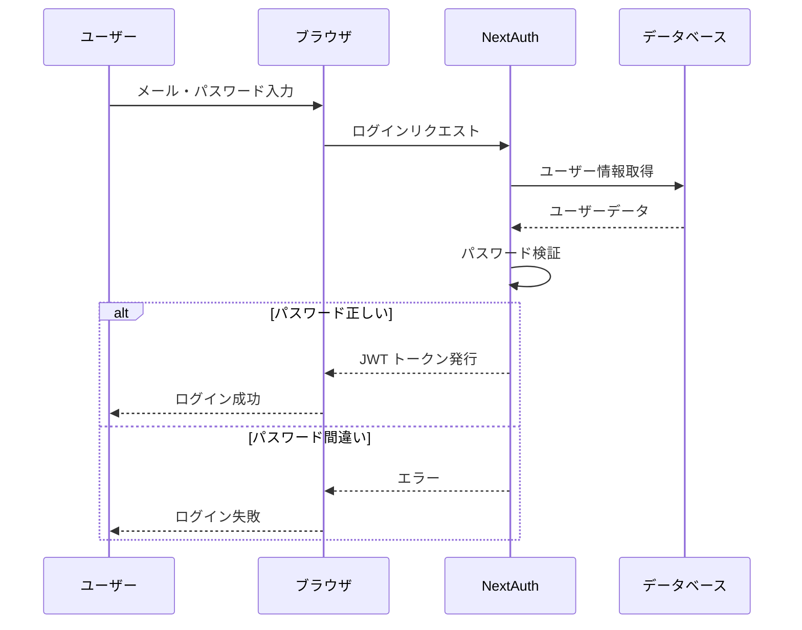

# Day 07: ログイン処理を実装しよう

## 🎯 今日のゴール

NextAuthを使って、実際のログイン処理を実装します。メールアドレスとパスワードで認証し、セッションを管理できるようになります。

【スクリーンショット: ログイン成功後のダッシュボード画面】

## 🤔 なぜこれを作るのか？

ログイン画面を作っただけでは、実際にログインできません。NextAuthを使うことで、セキュアな認証とセッション管理を簡単に実装できます。

> 💡 **例え話**: カードキーを作っただけでは、ドアは開きません。カードリーダーに通して初めて、ドアが開きます。NextAuthは、そのカードリーダーの役割を果たします。

### 📐 認証フロー図



この図は、ユーザーがログインしてから認証が完了するまでの処理の流れを示しています。

## 📊 実装ステップ一覧

| ステップ | 作業内容 | 所要時間 |
|---------|---------|---------|
| Step 1 | NextAuthの設定 | 15分 |
| Step 2 | 認証プロバイダーを作成 | 10分 |
| Step 3 | ログイン処理を実装 | 15分 |
| Step 4 | セッション確認 | 10分 |

**合計時間**: 約50分

---

### Step 1: NextAuthの設定（15分）

🎯 **ゴール**: NextAuthの基本設定を行います。

💻 **実装**:

```typescript
// filepath: src/server/auth.ts
import { PrismaAdapter } from '@next-auth/prisma-adapter';
import { type NextAuthOptions } from 'next-auth';
import CredentialsProvider from 'next-auth/providers/credentials';
import { db } from './db';
import bcrypt from 'bcryptjs';

export const authOptions: NextAuthOptions = {
  adapter: PrismaAdapter(db),
  providers: [
    CredentialsProvider({
      name: 'Credentials',
      credentials: {
        email: { label: "Email", type: "email" },
        password: { label: "Password", type: "password" }
      },
      async authorize(credentials) {
        if (!credentials?.email || !credentials?.password) {
          return null;
        }

        const user = await db.user.findUnique({
          where: { email: credentials.email }
        });

        if (!user || !user.password) {
          return null;
        }

        const isValid = await bcrypt.compare(
          credentials.password,
          user.password
        );

        if (!isValid) {
          return null;
        }

        return user;
      }
    })
  ],
  session: {
    strategy: 'jwt'
  },
  pages: {
    signIn: '/login',
  }
};
```

✅ **確認ポイント**: `src/server/auth.ts`が作成される
【スクリーンショット: 確認画面】

📝 **学んだこと**: NextAuthの設定ファイルを作成できた

---

### Step 2: 認証プロバイダーを作成（10分）

🎯 **ゴール**: アプリ全体でセッションを使えるようにします。

💻 **実装**:

```typescript
// filepath: src/app/providers.tsx
'use client';

import { SessionProvider } from 'next-auth/react';

export function Providers({ children }: { children: React.ReactNode }) {
  return <SessionProvider>{children}</SessionProvider>;
}
```

```typescript
// filepath: src/app/layout.tsx
import { Providers } from './providers';

export default function RootLayout({ children }: { children: React.ReactNode }) {
  return (
    <html lang="ja">
      <body>
        <Providers>{children}</Providers>
      </body>
    </html>
  );
}
```

✅ **確認ポイント**: アプリ全体でセッションが使えるようになる
【スクリーンショット: 確認画面】

📝 **学んだこと**: SessionProviderでアプリをラップできた

---

### Step 3: ログイン処理を実装（15分）

🎯 **ゴール**: ログイン画面にNextAuthを統合します。

💻 **実装**:

```typescript
// filepath: src/app/login/page.tsx（ログイン処理部分）
'use client';

import { signIn } from 'next-auth/react';
import { useRouter } from 'next/navigation';

export default function LoginPage() {
  const router = useRouter();

  const handleSubmit = async (e: React.FormEvent) => {
    e.preventDefault();

    const result = await signIn('credentials', {
      email,
      password,
      redirect: false,
    });

    if (result?.ok) {
      router.push('/dashboard');
    } else {
      setErrors({ ...errors, password: 'ログインに失敗しました' });
    }
  };

  // UIはDay 05で作成したものを使用
}
```

✅ **確認ポイント**: ログイン成功後にダッシュボードに遷移する
【スクリーンショット: 確認画面】

📝 **学んだこと**: signIn関数でログイン処理を実装できた

---

### Step 4: セッション確認（10分）

🎯 **ゴール**: ログイン状態を確認できるようにします。

💻 **実装**:

```typescript
// filepath: src/app/dashboard/page.tsx
'use client';

import { useSession, signOut } from 'next-auth/react';
import { Button } from '@/component/ui/button';

export default function DashboardPage() {
  const { data: session } = useSession();

  if (!session) {
    return <p className="text-muted-foreground">ログインしてください</p>;
  }

  return (
    <div>
      <h1 className="text-2xl font-bold">
        ようこそ、{session.user?.name}さん！
      </h1>
      <Button onClick={() => signOut()}>
        ログアウト
      </Button>
    </div>
  );
}
```

✅ **確認ポイント**: ログイン後にユーザー名が表示される
【スクリーンショット: 確認画面】

📝 **学んだこと**: useSessionでセッション情報を取得できた

---

## 📋 今日のまとめ

- [ ] NextAuthの設定ができた
- [ ] SessionProviderを設置できた
- [ ] ログイン処理を実装できた
- [ ] セッション確認ができた

## ⚠️ つまずきポイント

| エラー/問題 | 原因 | 解決方法 |
|------------|------|---------|
| ログインできない | パスワードハッシュが間違っている | bcrypt.compareを確認 |
| セッションが取得できない | SessionProviderがない | Providersでラップ |

## 🔗 次回予告

Day 8では、ログアウト機能と、ページの保護（未ログインユーザーをログイン画面に遷移）を実装します。
