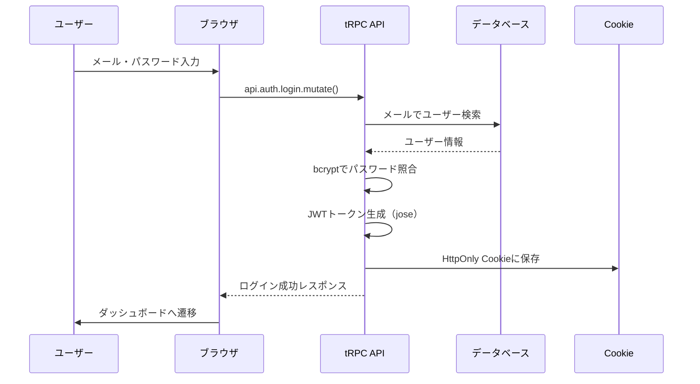

# Day 07: ログイン処理の仕組みを理解しよう

## 🎯 今日のゴール

Day 05-06 で作ったログイン・登録フォームの裏側で何が起きているかを理解します。JWT（ジェイ・ダブリュー・ティー）トークンを使った認証の仕組みと、サーバー側の処理を学びます。

【スクリーンショット: ログイン成功でダッシュボードが表示される様子】

## 🤔 なぜこれを作るのか？

Day 05-06 では「フォームからデータを送信する」部分を作りました。でも、送られたデータはサーバーでどう処理されるのでしょうか？パスワードはどうやって安全に確認するのでしょうか？

> 💡 **例え話**: JWT トークンは「遊園地のリストバンド」です。入口（ログイン）で本人確認されると、リストバンド（JWT）がもらえます。あとはリストバンドを見せるだけで各アトラクションに入れ、名前・会員種別・有効期限が記載されています。

### 📐 認証フロー全体図



### やること / やらないこと

| やること | やらないこと |
|---------|-------------|
| 認証ルーターのコードを読んで理解する | 認証コードをゼロから書く |
| JWT とCookieの仕組みを学ぶ | 暗号化の数学的な仕組み |
| bcrypt パスワード検証を理解する | 独自の暗号化を実装する |
| セッション管理の流れを追う | データベース設計（Day 01で完了） |

### 🆕 新しく学ぶ概念

| 概念 | 読み方 | 役割 | 例え |
|------|--------|------|------|
| JWT | ジェイ・ダブリュー・ティー | ユーザー情報を暗号化したトークン | 遊園地のリストバンド。名前と有効期限入り |
| bcrypt | ビークリプト | パスワードを安全にハッシュ化 | 金庫の暗証番号を暗号化して保管するシステム |
| HttpOnly Cookie | エイチティーティーピー・オンリー・クッキー | JavaScriptから読めない安全なCookie | 見えない場所に隠したリストバンド |

## 📊 実装ステップ一覧

| ステップ | 作業内容 | 所要時間 |
|---------|---------|---------|
| Step 1 | 認証の全体像を理解する | 5分 |
| Step 2 | ログイン処理の流れを読む | 7分 |
| Step 3 | パスワード検証の仕組みを理解する | 5分 |
| Step 4 | JWTトークンの生成を理解する | 7分 |
| Step 5 | Cookieにセッションを保存する流れを読む | 5分 |
| Step 6 | 登録処理の流れを読む | 7分 |
| Step 7 | セッション取得の仕組みを理解する | 5分 |
| Step 8 | tRPCコンテキストの役割を理解する | 5分 |
| Step 9 | 動作確認 | 5分 |

**合計時間**: 約51分

---

### Step 1: 認証の全体像を理解する（5分）

🎯 **ゴール**: 認証システムを構成するファイルを把握します。

このアプリの認証は、2つのファイルで構成されています。

```
// filepath: プロジェクト構成
src/
├── server/
│   └── api/
│       ├── routers/
│       │   └── auth.ts    # 認証API
│       └── trpc.ts        # tRPC設定
└── lib/
    └── session.ts         # JWT・Cookie管理
```

#### 認証ファイルの役割

| ファイル | 役割 | 例え |
|---------|------|------|
| `auth.ts` | ログイン・登録のロジック | 受付窓口。本人確認を行う |
| `session.ts` | JWT生成・Cookie管理 | リストバンド発行所。発行・確認・回収を担当 |
| `trpc.ts` | 認証チェックの共通処理 | 各アトラクション入口のスタッフ。リストバンドを確認する |

✅ **確認ポイント**:
- 3つのファイルの場所と役割を理解した
- `src/server/api/routers/auth.ts` を開いて確認した

---

### Step 2: ログイン処理の流れを読む（7分）

🎯 **ゴール**: `auth.ts` のログイン処理がどう動くか理解します。

💻 **コードを読む**:

`auth.ts` のログインプロシージャを見てみましょう。

```typescript
// filepath: src/server/api/routers/auth.ts
// ログイン処理
login: publicProcedure
  .input(loginSchema) // zodで入力チェック
  .mutation(async ({ input }) => {
    // 1. メールでユーザーを検索
    const user = await prisma.user.findUnique({
      where: { email: input.email },
    });
    // 2. ユーザーが見つからない場合
    if (!user || !user.password) {
      throw new TRPCError({
        code: 'UNAUTHORIZED',
        message: 'メールアドレスまたは'
          + 'パスワードが正しくありません',
      });
    }
```

> 💡 `publicProcedure` は「ログインしていなくても呼べるAPI」です。ログイン画面自体は、当然ログインなしでアクセスできる必要がありますよね。

✅ **確認ポイント**:
- `publicProcedure` の意味を理解した
- Prisma でメールアドレスからユーザーを検索する流れを確認した

---

### Step 3: パスワード検証の仕組みを理解する（5分）

🎯 **ゴール**: bcrypt によるパスワードの安全な照合方法を学びます。

> 💡 **例え話**: パスワードは金庫に入れる前に「ハッシュ化」されます。「password123」を保存する代わりに「$2a$10$xYz...」のような解読不能な文字列に変換して保存します。確認する時は、入力されたパスワードもハッシュ化して、結果が一致するか比較します。

💻 **コードを読む**:

```typescript
// filepath: src/server/api/routers/auth.ts
// 3. パスワードを検証
const isPasswordValid =
  await bcrypt.compare(
    input.password,  // 入力されたパスワード
    user.password    // DB保存のハッシュ値
  );

if (!isPasswordValid) {
  throw new TRPCError({
    code: 'UNAUTHORIZED',
    message: 'メールアドレスまたは'
      + 'パスワードが正しくありません',
  });
}

// 4. アカウントの有効チェック
if (!user.isActive) {
  throw new TRPCError({
    code: 'FORBIDDEN',
    message: 'このアカウントは無効化されています',
  });
}
```

#### パスワード検証の流れ

| 順番 | 処理 | 詳細 |
|------|------|------|
| 1 | ハッシュ化 | 登録時に `bcrypt.hash(password, 10)` で変換 |
| 2 | DB保存 | ハッシュ値をデータベースに保存 |
| 3 | 照合 | `bcrypt.compare(入力, ハッシュ)` で比較 |
| 4 | 結果 | true なら一致、false なら不一致 |

> 💡 `bcrypt.compare` は元のパスワードを復元するのではなく、入力値もハッシュ化して結果を比較します。

✅ **確認ポイント**:
- パスワードが平文で保存されていないことを理解した
- `bcrypt.compare` の仕組みを理解した

---

### Step 4: JWTトークンの生成を理解する（7分）

🎯 **ゴール**: ログイン成功後にJWTトークンがどう作られるか理解します。

💻 **コードを読む**:

`session.ts` の暗号化関数を見てみましょう。

```typescript
// filepath: src/lib/session.ts
import { SignJWT, jwtVerify } from 'jose';

// JWTの署名に使う秘密鍵
function getKey(): Uint8Array {
  const SECRET_KEY = env.JWT_SECRET;
  return new Uint8Array(
    new TextEncoder().encode(SECRET_KEY)
  );
}

// セッション情報の型定義
interface SessionPayload {
  userId: string;  // ユーザーID
  email: string;   // メールアドレス
  role: string;    // 権限（USER / ADMIN）
  exp: number;     // 有効期限
}
```

```typescript
// filepath: src/lib/session.ts
// JWTトークンを生成する関数
async function encrypt(
  payload: SessionPayload
): Promise<string> {
  const jwtPayload: Record<string, unknown> = {
    userId: payload.userId,
    email: payload.email,
    role: payload.role,
    exp: payload.exp,
  };
  return await new SignJWT(jwtPayload)
    .setProtectedHeader({ alg: 'HS256' })
    .setIssuedAt()
    .setExpirationTime('7d')
    .sign(getKey());
}
```

#### JWTトークンのコード解説

| コード | 意味 | 例え |
|--------|------|------|
| `jose` | JWT操作ライブラリ | リストバンド製造機 |
| `SignJWT` | 署名付きJWTを作成 | リストバンドに情報を刻印する |
| `HS256` | 署名アルゴリズム | 偽造防止の特殊インクの種類 |
| `setExpirationTime('7d')` | 7日間有効 | リストバンドの有効期限 |
| `JWT_SECRET` | 署名用の秘密鍵 | 特殊インクのレシピ（秘密） |

✅ **確認ポイント**:
- JWTにはユーザーID・メール・権限・期限が含まれることを理解した
- `jose` ライブラリで署名することを確認した

---

### Step 5: Cookieにセッションを保存する流れを読む（5分）

🎯 **ゴール**: JWTトークンがどうブラウザに保存されるか理解します。

💻 **コードを読む**:

```typescript
// filepath: src/lib/session.ts
const COOKIE_NAME = 'session';
// 7日間（秒単位）
const COOKIE_MAX_AGE = 60 * 60 * 24 * 7;

// セッション作成
async function createSession(
  user: SessionUser
): Promise<string> {
  // 有効期限を計算
  const expiresAt =
    Math.floor(Date.now() / 1000)
    + COOKIE_MAX_AGE;
  // JWTトークンを生成
  const token = await encrypt({
    userId: user.id,
    email: user.email,
    role: user.role,
    exp: expiresAt,
  });
```

続いて、生成したトークンをCookieに保存します。

```typescript
// filepath: src/lib/session.ts（続き）
  // Cookieに保存
  const cookieStore = await cookies();
  cookieStore.set(COOKIE_NAME, token, {
    httpOnly: true,     // JS読み取り不可
    secure: process.env['NODE_ENV']
      === 'production', // 本番はHTTPS必須
    sameSite: 'strict', // 同一サイトのみ
    maxAge: COOKIE_MAX_AGE,
    path: '/',
  });
  return token;
}
```

#### Cookie設定の意味

| 設定 | 値 | 理由 |
|------|-----|------|
| `httpOnly` | true | JavaScriptから読めなくしてXSS攻撃を防ぐ |
| `secure` | 本番のみtrue | HTTPSでのみ送信（盗聴防止） |
| `sameSite` | strict | 別サイトからのリクエストにCookieを付けない |
| `maxAge` | 7日 | セッションの有効期限 |

> 💡 `httpOnly: true` は非常に重要です。これにより、悪意のあるスクリプトがCookieを盗めなくなります。

✅ **確認ポイント**:
- JWTがCookieに保存されることを理解した
- `httpOnly` の重要性を理解した

【スクリーンショット: ブラウザDevToolsでsessionCookieを確認する様子】

---

### Step 6: 登録処理の流れを読む（7分）

🎯 **ゴール**: ユーザー登録時のサーバー処理を理解します。

💻 **コードを読む**:

```typescript
// filepath: src/server/api/routers/auth.ts
// 登録処理
register: publicProcedure
  .input(registerSchema) // zodで入力チェック
  .mutation(async ({ input }) => {
    // 1. メール重複チェック
    const existing =
      await prisma.user.findUnique({
        where: { email: input.email },
      });
    if (existing) {
      throw new TRPCError({
        code: 'CONFLICT',
        message: 'このメールアドレスは'
          + '既に登録されています',
      });
    }
```

```typescript
// filepath: src/server/api/routers/auth.ts
    // 2. パスワードをハッシュ化
    const hashedPassword =
      await bcrypt.hash(input.password, 10);
    // 3. ユーザーを作成
    const user = await prisma.user.create({
      data: {
        email: input.email,
        name: input.name,
        password: hashedPassword,
        role: 'USER',
        isActive: true,
      },
    });
    // 4. セッション作成（自動ログイン）
    await createSession({
      id: user.id,
      email: user.email,
      role: user.role,
    });
  }),
```

> 💡 登録が成功すると `createSession` が呼ばれ、ユーザーは自動的にログイン状態になります。登録後にわざわざログイン画面に戻る必要はありません。

✅ **確認ポイント**:
- 登録時にパスワードがハッシュ化されることを確認した
- 登録後に自動ログインされる仕組みを理解した

---

### Step 7: セッション取得の仕組みを理解する（5分）

🎯 **ゴール**: ページ表示時にセッション情報をどう取得するか理解します。

💻 **コードを読む**:

```typescript
// filepath: src/lib/session.ts
// Cookieからセッションを取得
async function getSession()
  : Promise<SessionPayload | null> {
  const cookieStore = await cookies();
  const token =
    cookieStore.get(COOKIE_NAME)?.value;
  // Cookieがなければ未ログイン
  if (!token) return null;
  // JWTを復号してユーザー情報を返す
  return await decrypt(token);
}
```

```typescript
// filepath: src/server/api/routers/auth.ts
// 認証済みユーザーの詳細情報を取得
getCurrentUser: protectedProcedure
  .query(async ({ ctx }) => {
    const user =
      await prisma.user.findUnique({
        where: { id: ctx.session.userId },
        select: {
          id: true, email: true,
          name: true, avatar: true,
          role: true, isActive: true,
          createdAt: true, updatedAt: true,
        },
      });
    if (!user) {
      throw new TRPCError({
        code: 'NOT_FOUND',
        message: 'ユーザーが見つかりません',
      });
    }
    return user;
  }),
```

> 💡 `protectedProcedure` は「ログイン済みでないと呼べないAPI」です。未ログインだと自動的にエラーになります。

✅ **確認ポイント**:
- `getSession` がCookieからJWTを読み取ることを確認した
- `protectedProcedure` と `publicProcedure` の違いを理解した

---

### Step 8: tRPCコンテキストの役割を理解する（5分）

🎯 **ゴール**: リクエストごとにセッション情報がどう渡されるか理解します。

💻 **コードを読む**:

```typescript
// filepath: src/server/api/trpc.ts
// リクエストごとにコンテキストを作成
const createTRPCContext = async (opts: {
  headers: Headers;
}) => {
  // Cookieからセッションを読み取る
  const session = await getSession();
  return {
    session,  // 全プロシージャで使える
    ...opts,
  };
};
```

```typescript
// filepath: src/server/api/trpc.ts
// 認証チェックミドルウェア
const isAuthenticated = t.middleware(
  async ({ ctx, next }) => {
    // セッションがなければエラー
    if (!ctx.session?.userId) {
      throw new TRPCError({
        code: 'UNAUTHORIZED',
        message: 'ログインが必要です',
      });
    }
    return next({ ctx: { session: ctx.session } });
  }
);

// 公開API（ログイン不要）
const publicProcedure = t.procedure;
// 保護API（ログイン必須）
const protectedProcedure =
  t.procedure.use(isAuthenticated);
```

#### publicProcedure vs protectedProcedure

| 種別 | 認証 | 用途 |
|------|------|------|
| `publicProcedure` | 不要 | ログイン、登録、セッション確認 |
| `protectedProcedure` | 必須 | ユーザー情報取得、タスク操作等 |

✅ **確認ポイント**:
- 毎リクエストで `getSession()` が実行されることを理解した
- `protectedProcedure` が内部で認証チェックしていることを確認した

---

### Step 9: 動作確認（5分）

🎯 **ゴール**: 認証の流れを実際に確認します。

以下の手順で動作を確認してください。

1. ブラウザで `/register` にアクセスし、新規登録する
2. ダッシュボードに自動遷移することを確認する
3. ブラウザの開発者ツール → Application → Cookies を開く
4. `session` という名前のCookieが存在することを確認する
5. 一度ログアウトして `/login` からログインし直す
6. ダッシュボードに遷移することを確認する

【スクリーンショット: 開発者ツールでsession Cookieを確認】

✅ **確認ポイント**:
- 登録後にダッシュボードが表示される
- Cookies に `session` が保存されている
- ログインでもダッシュボードに遷移する

---

## 📋 今日のまとめ

- [ ] 認証の全体フロー（ログイン→JWT→Cookie）を理解した
- [ ] bcrypt でパスワードを安全に検証する仕組みを学んだ
- [ ] jose でJWTトークンを生成する仕組みを学んだ
- [ ] HttpOnly Cookie でセッションを安全に保存する方法を学んだ
- [ ] publicProcedure と protectedProcedure の違いを理解した

## ⚠️ つまずきポイント

| エラー / 問題 | 原因 | 解決方法 |
|--------------|------|---------|
| ログインしても画面が変わらない | `router.refresh()` の呼び忘れ | `onSuccess` 内で `router.refresh()` を追加 |
| 「ログインが必要です」エラー | Cookie が保存されていない | ブラウザの Cookie 設定を確認 |
| JWT の期限切れエラー | 7日以上経過した | 再ログインする |
| `JWT_SECRET` エラー | 環境変数が未設定 | `.env` に `JWT_SECRET` を設定 |

## 📝 今日学んだ用語

| 用語 | 意味 |
|------|------|
| JWT | JSON Web Token。ユーザー情報を暗号化したトークン |
| bcrypt | パスワードのハッシュ化ライブラリ |
| ハッシュ化 | 元に戻せない形式に変換すること |
| HttpOnly Cookie | JavaScriptから読めない安全なCookie |
| jose | JWT の生成・検証を行うライブラリ |
| publicProcedure | 認証不要のtRPCプロシージャ |
| protectedProcedure | 認証必須のtRPCプロシージャ |
| ミドルウェア | リクエスト処理の途中に挟まる共通処理 |

## 🔗 次回予告

Day 08 では、ログアウト機能とページ保護の仕組みを学びます。未ログイン時に自動でログイン画面にリダイレクトする「認証ガード」を理解します。
