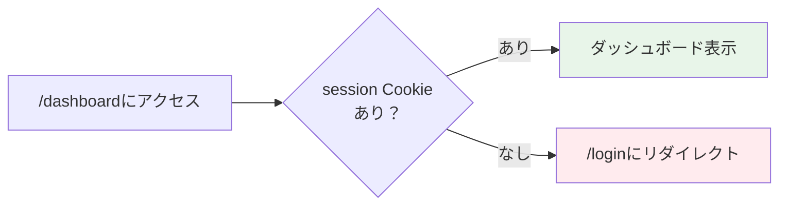

# Day 08: サイドバーの仕組みを読み解こう

## 🔙 前回の振り返り

Day 07 ではログイン成功時のトースト通知とCookieベースのセッション管理を学びました。認証の基盤が整ったので、今日はサイドバーに既に実装されているユーザー情報表示とログアウト機能のコードを読み解きます。

---

## 🎯 今日のゴール

サイドバーに既に実装されているユーザー情報ウィジェット（名前・ロールバッジ）とログアウト確認ダイアログのコードを読み解きます。認証ガード（未ログイン時のリダイレクト）の動作も体験します。

📸 スクリーンショット: サイドバー（ユーザー情報・ログアウト）


## 🤔 なぜこれを作るのか？

現在のサイドバーにはナビゲーションメニューだけがあり、「誰がログインしているか」がわかりません。

ユーザー名とロール（管理者/ユーザー）が表示される仕組みと、誤操作防止のログアウト確認ダイアログを理解しましょう。

> 💡 **例え話**: サイドバーは「オフィスの廊下」です。廊下に部屋の案内板（メニュー）があり、壁には自分の名札（ユーザー情報ウィジェット）が掲示されています。退出ボタン（ログアウト）を押すと「本当に退出しますか？」と確認されます。

### 📐 AppLayoutの構造

```mermaid
flowchart TD
    A[AppLayout] --> B{セッションチェック}
    B -->|なし| C[/loginへリダイレクト]
    B -->|あり| D[レイアウト表示]
    D --> E[サイドバー]
    D --> F[ヘッダー]
    D --> G[メインコンテンツ]
    E --> H[ナビメニュー]
    E --> I[ユーザー情報ウィジェット]
    E --> J[ログアウトボタン]

    style B fill:#fff3e0
    style C fill:#ffebee
    style D fill:#e8f5e9
```

### やること / やらないこと

| やること | やらないこと |
|---------|-------------|
| 既存のユーザー情報表示コードを読み解く | 新しいコードを追加する |
| AlertDialogの構造と使い方を理解する | 認証ロジックを変更する |
| ロールによるメニュー表示切替を理解する | 権限管理システムの設計 |
| モバイル表示をDevToolsで確認する | CSSのレスポンシブ設計をゼロから書く |

### 🆕 新しく学ぶ概念

| 概念 | 読み方 | 役割 | 例え |
|------|--------|------|------|
| useEffect | ユース・エフェクト | コンポーネント表示後に実行される処理 | ページを開いた直後の自動チェック |
| AlertDialog | アラート・ダイアログ | 確認が必要な操作の前に表示するモーダル | 「本当に退出しますか？」のポップアップ |
| 条件付き配列結合（スプレッド + 三項演算子） | — | 条件によって配列の要素を動的に追加する | 映画館で年齢制限のある映画のように、条件を満たす人だけにコンテンツを表示する仕組み。Reactの条件付きレンダリング（`{condition && <Component />}`）とは少し異なるJSテクニック |

## 📊 実装ステップ一覧

| ステップ | 作業内容 | 所要時間 | 触るファイル | 成功状態 |
|---------|---------|---------|-------------|---------|
| Step 1 | AppLayoutの構造を読む | 5分 | なし（読むのみ） | 認証ガードの流れがわかる |
| Step 2 | 認証ガードの動作を体験する | 4分 | なし | リダイレクトを確認 |
| Step 3 | AlertDialogコンポーネントを確認する | 4分 | なし（確認のみ） | コンポーネントの存在と構造を確認できた |
| Step 4 | サイドバーのユーザー情報表示を読み解く | 7分 | app-layout.tsx（読むのみ） | UserRoleBadgeの仕組みがわかる |
| Step 5 | ログアウト確認ダイアログを読み解く | 7分 | app-layout.tsx（読むのみ） | AlertDialogの構造がわかる |
| Step 6 | ロールによるメニュー切替を確認する | 4分 | app-layout.tsx（読むのみ） | ADMINメニューが見える |
| Step 7 | モバイル表示を確認する | 3分 | なし | Sheet動作を確認 |
| Step 8 | ログアウトの動作確認 | 3分 | なし | ログアウトが正常動作 |

**合計時間**: 約37分（ミニ演習を含めると約50〜55分）

---

### Step 1: AppLayoutの構造を読む（5分）

🎯 **ゴール**: AppLayoutがどうページを保護しているか理解します。

VS Codeで`src/component/layout/app-layout.tsx`を開いてください。先頭のセッションチェック部分を確認します。VS Codeの検索（`Ctrl+Shift+F`）で `useEffect` を検索すると見つけやすいです。

💻 **確認するコード**:

```typescript
// filepath: src/component/layout/app-layout.tsx
// AppLayout関数の先頭部分
export function AppLayout(
  { children }: { children: React.ReactNode }
) {
  const [mobileOpen, setMobileOpen]
    = useState(false);
  const pathname = usePathname();
  const router = useRouter();
  // サーバーからセッション情報を取得
  const { data: session, isLoading } =
    api.auth.getSession.useQuery();
```

✅ **確認ポイント**:
- `app-layout.tsx`を開けた
- `useQuery`でサーバーからセッション情報を取得していることがわかった

```typescript
// filepath: src/component/layout/app-layout.tsx
// セッションチェックとリダイレクト処理
  useEffect(() => {
    if (!isLoading && !session) {
      router.push('/login');
    }
  }, [isLoading, session, router]);
```

✅ **確認ポイント**:
- `useEffect`でセッションチェック → リダイレクトの流れがわかった

🔍 **コード解説**:

| コード | 意味 | 例え |
|--------|------|------|
| `api.auth.getSession.useQuery()` | サーバーにセッション確認を問い合わせ | 「入口でリストバンドチェック」 |
| `useEffect` | コンポーネント表示後に実行 | ページが開いた直後の自動処理 |
| `!isLoading && !session` | 読み込み完了かつセッションなし | 「リストバンドなし」確定 |
| `router.push('/login')` | ログイン画面にリダイレクト | 「受付に案内する」 |

📝 **学んだこと**: AppLayoutは全ページに共通の「認証ゲート」として機能します。これでサイドバーの仕組みが理解できたので、今後カスタマイズする時も怖くないですね！

---

### Step 2: 認証ガードの動作を体験する（4分）

🎯 **ゴール**: 未ログイン状態でページにアクセスした時の動作を確認します。

💻 **操作手順**:

1. ログインした状態で`/dashboard`が表示されることを確認
2. Cookie を削除する（以下の手順で操作）
   1. `F12` でDevToolsを開く
   2. **Application** タブをクリック
   3. 左メニューの **Cookies** を展開
   4. `localhost:3000` をクリック
   5. `session` を右クリック
   6. **Delete** をクリック
3. ブラウザで`/dashboard`にアクセス
4. 自動的に`/login`にリダイレクトされることを確認
5. 再度ログインする（`admin@example.com` / `password123`）

📸 スクリーンショット: Cookie削除後にリダイレクトされたログイン画面



✅ **確認ポイント**:
- Cookie削除後に`/dashboard`にアクセスすると`/login`に飛ばされた
- 再ログイン後は正常に`/dashboard`が表示された

📝 **学んだこと**: 認証ガードはCookieのセッションをチェックし、なければログイン画面にリダイレクトします。

---

### Step 3: AlertDialogコンポーネントを確認する（4分）

🎯 **ゴール**: shadcn/uiのAlertDialogコンポーネントがプロジェクトに存在することを確認します。

このプロジェクトには AlertDialog コンポーネントが既に用意されています。確認してみましょう。

💻 **確認**:

```bash
# filepath: ターミナル
# AlertDialogコンポーネントの存在を確認
ls src/component/ui/alert-dialog.tsx
```

✅ **確認ポイント**:
- `src/component/ui/alert-dialog.tsx`が存在する
- ファイルの中に`AlertDialog`関連のコンポーネントが定義されている

> 💡 通常は既にプロジェクトに含まれていますが、もし見つからない場合は `npx shadcn@latest add alert-dialog` で追加できます。

VS Codeで `src/component/ui/alert-dialog.tsx` を開いてみましょう。以下のコンポーネントがエクスポートされていることが確認できます。

| コンポーネント | 役割 |
|--------------|------|
| `AlertDialog` | ダイアログの外枠（開閉を管理） |
| `AlertDialogTrigger` | ダイアログを開くボタン |
| `AlertDialogContent` | ダイアログの中身 |
| `AlertDialogHeader` | タイトルと説明文 |
| `AlertDialogFooter` | キャンセル・確定ボタン |
| `AlertDialogAction` | 確定ボタン |
| `AlertDialogCancel` | キャンセルボタン |

> 💡 shadcn/uiのコンポーネントは`node_modules`ではなく`src/component/ui/`にソースコードとして配置されます。そのため、プロジェクトに合わせて自由にカスタマイズできるのが特徴です。

一般的なUIライブラリとの違いを確認しておきましょう。

| 比較項目 | shadcn/ui | 一般的なUIライブラリ |
|---------|-----------|-------------------|
| コードの場所 | `src/`にソースとして配置 | `node_modules`内 |
| カスタマイズ | 直接ソースを編集可能 | propsやテーマで制限的 |
| バンドルサイズ | 使うものだけ含まれる | ライブラリ全体が含まれがち |

📝 **学んだこと**: shadcn/uiはソースコードとしてコンポーネントを配置するため、自由にカスタマイズできます。

---

### Step 4: サイドバーのユーザー情報表示を読み解く（7分）

🎯 **ゴール**: サイドバー下部に表示されているユーザー名とロールバッジの仕組みを理解します。

`src/component/layout/app-layout.tsx`を開いてください。VS Codeの検索で `border-t p-4` を検索するとユーザー情報ウィジェットが見つかります。

💻 **確認するコード（import部分）**:

```typescript
// filepath: src/component/layout/app-layout.tsx
// ロールバッジとアバターのimport
import {
  Avatar, AvatarFallback, AvatarImage,
} from '@/component/ui/avatar';
import { UserRoleBadge }
  from '@/component/ui/user-badges';
import { USER_ROLE }
  from '@/lib/constant/roles';
```

✅ **確認ポイント**:
- `AvatarImage`（プロフィール画像表示用）と`AvatarFallback`（画像がない場合の代替表示）の両方がimportされている
- `'ADMIN'`のような文字列リテラルではなく`USER_ROLE.ADMIN`定数を使う設計方針

次に、ユーザー情報ウィジェットを確認します。

```typescript
// filepath: src/component/layout/app-layout.tsx
// サイドバー下部のユーザー情報ウィジェット
<div className="border-t p-4">
  <div className="flex items-center
    gap-3 mb-3">
    <Avatar className="h-9 w-9">
      <AvatarImage
        src={session?.user?.avatar ?? ''}
        alt={session?.user?.name ?? ''} />
      <AvatarFallback>
        {session?.user?.name?.[0] ?? 'U'}
      </AvatarFallback>
    </Avatar>
    <div className="flex flex-col min-w-0">
      <span className="text-sm font-medium
        truncate">
        {session?.user?.name}
      </span>
      <UserRoleBadge
        role={session?.user?.role} />
    </div>
  </div>
</div>
```

✅ **確認ポイント**:
- `Avatar`の中に`AvatarImage`（プロフィール画像）と`AvatarFallback`（名前の1文字目）の両方がある
- `UserRoleBadge`は`role`プロパティを受け取り、ADMINなら「管理者」（Shieldアイコン付き）、USERなら「ユーザー」と表示する

🔍 **コード解説**:

| コード | 意味 | 例え |
|--------|------|------|
| `AvatarImage` | プロフィール画像を表示 | 名札の写真 |
| `AvatarFallback` | 画像がない時の代替表示 | 名前の頭文字を表示 |
| `session?.user?.name` | ログイン中のユーザー名 | 名札に書かれた名前 |
| `UserRoleBadge` | ロール表示の専用コンポーネント | 管理者はShieldアイコン付き |

✅ **確認ポイント**:
- ブラウザのサイドバー下部にユーザー名が表示されている
- 「管理者」または「ユーザー」のバッジが表示されている
- アバター（イニシャルまたは画像）が表示されている

📸 スクリーンショット: サイドバーのユーザー情報ウィジェット

📝 **学んだこと**: `session`オブジェクトからユーザー情報を取得してUIに反映しています。ロール表示には`UserRoleBadge`という専用コンポーネントを使い、文字列リテラルではなく`USER_ROLE`定数を使うのがベストプラクティスです。

---

### Step 5: ログアウト確認ダイアログを読み解く（7分）

🎯 **ゴール**: ログアウトボタンとAlertDialog確認の仕組みを理解します。

ユーザー情報ウィジェットの下にログアウトボタンが既に実装されています。VS Codeの検索で `logoutMutation` を検索してください。

💻 **確認するコード**:

```typescript
// filepath: src/component/layout/app-layout.tsx
// ログアウトAPIを呼び出すミューテーション
  const logoutMutation =
    api.auth.logout.useMutation({
      onSuccess: () => {
        router.push('/login');
        router.refresh();
      },
    });

  // ログアウトハンドラ（asyncは不要）
  const handleLogout = () => {
    logoutMutation.mutate();
  };
```

✅ **確認ポイント**:
- `handleLogout`は`async`なしの通常関数
- `mutate()`を呼ぶだけなので`await`は不要

次に、AlertDialogで確認付きのログアウトボタン部分を確認します。VS Codeの検索で `AlertDialogTrigger` を検索してください。

```typescript
// filepath: src/component/layout/app-layout.tsx
// ログアウトボタン（確認ダイアログ付き）
<AlertDialog>
  <AlertDialogTrigger asChild>
    <Button variant="outline" size="sm"
      className="w-full gap-2">
      <LogOut className="h-4 w-4" />
      ログアウト
    </Button>
  </AlertDialogTrigger>
```

✅ **確認ポイント**:
- `AlertDialogTrigger`の`asChild`プロパティ: `asChild`なしだとAlertDialogTrigger自体がボタンになり、`asChild`ありだと中のButtonコンポーネントがトリガーになるため、デザインを自由にカスタマイズできる

```typescript
// filepath: src/component/layout/app-layout.tsx
// 確認ダイアログの中身
  <AlertDialogContent>
    <AlertDialogHeader>
      <AlertDialogTitle>
        ログアウトしますか？
      </AlertDialogTitle>
      <AlertDialogDescription>
        ログアウトすると、再度ログインが
        必要になります。
      </AlertDialogDescription>
    </AlertDialogHeader>
    <AlertDialogFooter>
      <AlertDialogCancel>
        キャンセル
      </AlertDialogCancel>
      <AlertDialogAction
        onClick={handleLogout}>
        ログアウト
      </AlertDialogAction>
    </AlertDialogFooter>
  </AlertDialogContent>
</AlertDialog>
```

✅ **確認ポイント**:
- `AlertDialogAction`の`onClick`に`handleLogout`を渡している
- サイドバーの「ログアウト」ボタンをクリックして確認ダイアログが表示される
- 「キャンセル」で閉じる → ダイアログが消える

🔍 **コード解説**:

| コード | 意味 | 例え |
|--------|------|------|
| `AlertDialogTrigger` | ダイアログを開くトリガー | ドアのノブ。押すとダイアログが開く |
| `asChild` | 子要素をそのままトリガーにする | Buttonをそのまま使う |
| `AlertDialogAction` | 確定ボタン | 「はい、退出します」ボタン |
| `AlertDialogCancel` | キャンセルボタン | 「やっぱりやめます」ボタン |

📸 スクリーンショット: ログアウト確認ダイアログ

📝 **学んだこと**: AlertDialogを使うと、`window.confirm()`よりも美しく、アクセシブルな確認ダイアログを作れます。`handleLogout`は`mutate()`を呼ぶだけなので`async`は不要です。

---

### Step 6: ロールによるメニュー切替を確認する（4分）

🎯 **ゴール**: ADMINユーザーだけに「ユーザー管理」メニューが表示される仕組みを理解します。

💻 **確認するコード**:

VS Codeの検索で `menuItems` を検索してください。

```typescript
// filepath: src/component/layout/app-layout.tsx
// 全員共通メニュー + 管理者専用メニューを結合
  const menuItems: MenuItem[] = [
    // 全員に表示する基本メニュー6項目を展開
    ...baseMenuItems,
    // session?.user?.role が ADMIN なら追加
    ...(session?.user?.role === USER_ROLE.ADMIN
      ? [{
          text: 'ユーザー管理',
          icon: <Users className="h-5 w-5" />,
          path: '/user',
        }]
      // ADMIN でなければ空配列（何も追加しない）
      : []),
  ];
```

✅ **確認ポイント**:
- `USER_ROLE.ADMIN`定数を使って比較している（`'ADMIN'`のような文字列リテラルは使わない）
- ADMINアカウント（`admin@example.com`）でサイドバーに「ユーザー管理」が表示される

🔍 **`...(条件 ? [...] : [])` パターンの解説**:

| コード部分 | 意味 |
|-----------|------|
| `...baseMenuItems` | 基本メニュー6項目を配列に展開 |
| `session?.user?.role === USER_ROLE.ADMIN` | ログインユーザーが管理者か判定 |
| `? [{ text: 'ユーザー管理', ... }]` | 管理者なら「ユーザー管理」を含む配列 |
| `: []` | 管理者でなければ空配列（何も追加しない） |
| `...( )` | 結果の配列を展開して結合 |

📝 **学んだこと**: スプレッド構文と三項演算子を組み合わせて、条件付きでメニュー項目を追加できます。

---

### Step 7: モバイル表示を確認する（3分）

🎯 **ゴール**: DevToolsでモバイル表示を確認し、Sheet（スライドメニュー）の動作を体験します。

💻 **操作手順**:

```bash
# filepath: ターミナル
# 開発サーバーが起動していることを確認
npm run dev
```

✅ **確認ポイント**:
- 開発サーバーが起動している

| 手順 | 操作 |
|------|------|
| 1 | DevToolsを開く（`F12`） |
| 2 | デバイスツールバーを有効にする（`Ctrl+Shift+M` / `Cmd+Shift+M`） |
| 3 | iPhone 14 Pro のようなモバイルデバイスを選択 |
| 4 | ハンバーガーメニュー（☰）をタップ → サイドメニューがスライドして表示される |

📸 スクリーンショット: モバイル表示のSheet（スライドメニュー）

🔍 **レスポンシブ対応の仕組み**:

| 画面サイズ | サイドバー | 実装方法 |
|-----------|----------|---------|
| デスクトップ（768px以上） | 常に表示 | `md:block` (CSSクラス) |
| モバイル（768px未満） | Sheet（スライド） | `md:hidden` + Sheet |

✅ **確認ポイント**:
- モバイル表示でハンバーガーメニューが表示される
- メニューをタップするとスライドで開く
- メニュー項目をタップするとメニューが閉じる

📝 **学んだこと**: Tailwind CSSの`md:`プレフィックスで、画面サイズに応じた表示切替ができます。

---

### Step 8: ログアウトの動作確認（3分）

🎯 **ゴール**: ログアウト機能が正しく動作することを確認します。

ブラウザで `http://localhost:3000/dashboard` を開いてください。

✅ **確認ポイント**:
- ダッシュボード画面が表示されている

💻 **操作手順**:

1. サイドバーの「ログアウト」ボタンをクリック
2. 確認ダイアログで「ログアウト」をクリック
3. `/login`画面にリダイレクトされることを確認
4. ブラウザの戻るボタンで戻れないことを確認

Step 5 で確認した `logoutMutation` と `handleLogout` が連携して動きます。

| 処理フロー | 担当コード | 例え |
|-----------|-----------|------|
| ① ボタンクリック → 確認ダイアログ表示 | `AlertDialogTrigger` | ドアノブを握る |
| ② 「ログアウト」をクリック | `AlertDialogAction` → `handleLogout` | 「退出します」と宣言 |
| ③ サーバーへログアウトAPI呼び出し（セッション削除） | `logoutMutation.mutate()` | サーバーにセッション削除を依頼 |
| ④ ログイン画面へ遷移 + 状態リフレッシュ | `router.push('/login')` + `router.refresh()` | 受付に戻される |

✅ **確認ポイント**:
- ログアウト後に`/login`に遷移した
- 戻るボタンでダッシュボードに戻れない（認証ガードがリダイレクトする）

📝 **学んだこと**: ログアウトはサーバーへのAPI呼び出し（`deleteSession`によるセッション削除）→ `/login`への遷移 → `router.refresh()`による状態リフレッシュの3ステップで完了します。

---

## 📋 今日のまとめ

- [ ] AppLayoutの認証ガード（useEffect + リダイレクト）を理解した
- [ ] Cookie削除で認証ガードの動作を体験した
- [ ] shadcn/uiのAlertDialogコンポーネントの構造を理解した
- [ ] UserRoleBadgeによるロール表示の仕組みを理解した
- [ ] ログアウト確認ダイアログの構造を理解した
- [ ] USER_ROLE定数を使ったメニュー切替の仕組みを理解した
- [ ] モバイル表示のSheet動作を確認した

## ⚠️ つまずきポイント

| エラー/問題 | 原因 | 解決方法 |
|------------|------|---------|
| `Cannot find module 'alert-dialog'` | AlertDialogが見つからない | 通常は既に含まれていますが、もし見つからない場合は`npx shadcn@latest add alert-dialog`を実行 |
| ユーザー名が`null`と表示される | seedデータにnameがない | `admin@example.com`でログインし直す |
| モバイルメニューが閉じない | `onClick`で`setMobileOpen(false)`が呼ばれていない | Sheet内のLinkに`onClick`を確認 |
| ログアウト後もページが見える | `router.refresh()`の呼び忘れ | `onSuccess`内で`router.refresh()`を追加 |

## 🔜 次回予告

Day 09では、プロジェクト一覧画面を作ります。tRPCでデータを取得し、Cardコンポーネントで一覧表示する方法を学びましょう。
