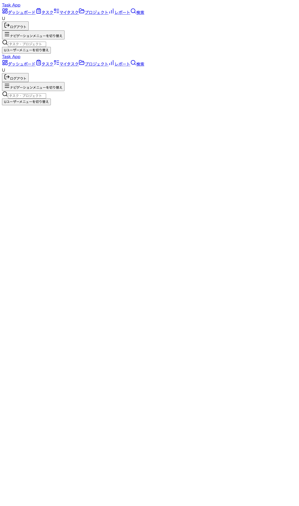
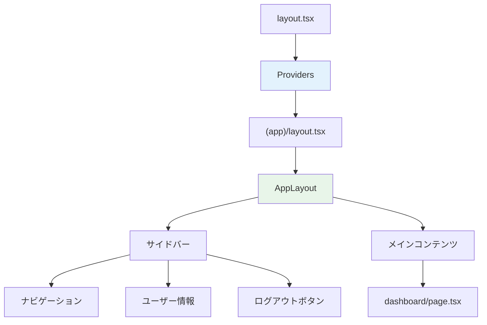
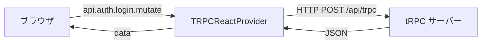
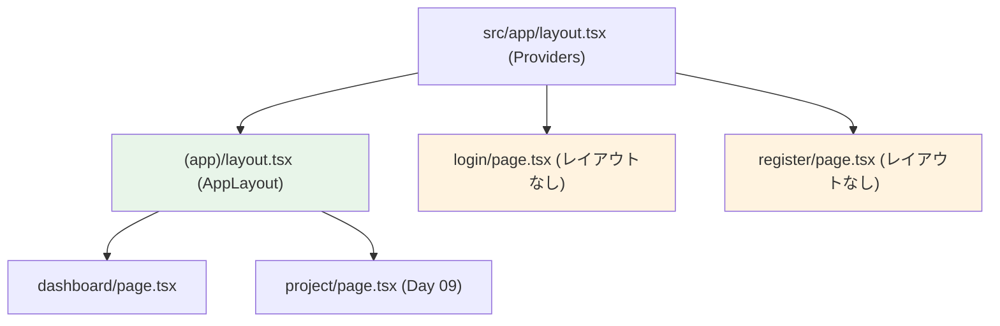

# Day 08: サイドバー付きのアプリレイアウトを作ろう



## 前回の振り返り

Day 07 で認証バックエンドを作った。
ログイン・登録・ログアウトが全部動くようになりました。

でも今のアプリ、ログインした先に何もません。
今日はサイドバーとヘッダーを自分の手で作って、
「アプリっぽい骨格」を完成させる。

---

## 今日のゴール

サイドバー付きのレイアウトを自分で作って、
ログイン後のすべてのページがこのレイアウトで表示されるようにします。

- [ ] `src/app/providers.tsx` — tRPC クライアントをアプリ全体に提供する
- [ ] `src/app/(app)/layout.tsx` — 認証済みページ用のルートグループ
- [ ] `src/component/layout/app-layout.tsx` — サイドバー + メインコンテンツ
- [ ] `src/app/(app)/dashboard/page.tsx` — レイアウトの中で動くダッシュボード
- [ ] ログアウトが動作することを確認する

## なぜこれを作るのか？

Day 07 のログイン API は動くけど、フロント側がまだ繋がっていません。
ブラウザから tRPC を呼ぶには「tRPC クライアント」をアプリ全体に設定する必要があります。
そしてログイン後のページには共通のサイドバーとヘッダーが欲しい。

> **例え話**: Day 07 で厨房（サーバー）を作った。今日は客席のレイアウト（テーブル配置・通路・メニュー看板）を作ります。客が座ったときに「ちゃんとしたお店だな」と感じる骨格。

### 今日作る構造



### やること / やらないこと

| やること | やらないこと |
|---------|-------------|
| tRPC クライアントを設定してフロントから API を呼べるようにする | tRPC サーバー側の追加（Day 07 済み） |
| サイドバー + レイアウトを自分の手で書く | モバイル対応の Sheet（Day 09 以降） |
| ログアウトを AlertDialog 付きで実装する | ユーザー編集機能 |

### 新しく学ぶ概念

| 概念 | 読み方 | 役割 | 例え |
|------|--------|------|------|
| Provider | プロバイダー | コンポーネントツリー全体に値を配る仕組み | 建物全体に電気を通す配電盤 |
| Route Group | ルートグループ | `(app)` のようにカッコで囲んだフォルダ。URL に影響しないレイアウト分岐 | 「関係者エリア」の見えない仕切り |
| use client | ユーズクライアント | ブラウザ側で動くと宣言する | 「この部品はお客さんの手元で動きます」 |
| useQuery | ユーズクエリ | サーバーからデータを取得する React Hook | 注文票を厨房に出して結果を待つ |
| useMutation | ユーズミューテーション | サーバーのデータを変更する React Hook | 注文を厨房に送信する |

## 実装ステップ一覧

| ステップ | 作業内容 | 所要時間 | 作成ファイル |
|---------|---------|---------|-------------|
| Step 1 | providers.tsx を作る（tRPC + React Query） | 8分 | `src/app/providers.tsx` |
| Step 2 | ルートレイアウトに Provider を組み込む | 5分 | `src/app/layout.tsx` 編集 |
| Step 3 | AppLayout を作る（サイドバーの骨格） | 15分 | `src/component/layout/app-layout.tsx` |
| Step 4 | ルートグループ (app) で認証レイアウトを適用する | 5分 | `src/app/(app)/layout.tsx` |
| Step 5 | ダッシュボードページを移動する | 5分 | `src/app/(app)/dashboard/page.tsx` |
| Step 6 | ログインして全体の動作を確認する | 5分 | なし |

**合計時間**: 約 43 分

---

### Step 1: providers.tsx を作る — tRPC クライアント設定（8分）

**ゴール**: フロントエンドから tRPC API を呼べるようにします。

Day 07 で作った tRPC サーバーを、ブラウザ側から呼ぶには
「クライアント」が必要。scaffold が `src/trpc/` に設定ファイルを配布済みなので、
それをアプリ全体に適用する Provider を作ります。



`src/app/providers.tsx` を新規作成します。

```tsx
// filepath: src/app/providers.tsx
'use client';

import type { ReactNode } from 'react';
import { TRPCReactProvider } from '@/trpc/react';

export function Providers({
  children,
}: {
  children: ReactNode;
}) {
  return <TRPCReactProvider>{children}</TRPCReactProvider>;
}
```

| コード | 意味 |
|--------|------|
| `'use client'` | この Provider はブラウザ側で動く |
| `TRPCReactProvider` | scaffold が用意した tRPC + React Query の設定 |
| `children` | この下に置かれる全コンポーネントが tRPC を使える |

> scaffold の `src/trpc/react.tsx` の中身が気になったら開いてみてもいいです。QueryClient と httpBatchLink の設定が入っています。

**確認ポイント**:
- [ ] `src/app/providers.tsx` が作成できた
- [ ] `'use client'` が先頭にある

---

### Step 2: ルートレイアウトに Provider を組み込む（5分）

**ゴール**: アプリ全体で tRPC が使えるように、ルートレイアウトを編集します。

`src/app/layout.tsx` を開く（scaffold が作った初期ファイル）。

```tsx
// filepath: src/app/layout.tsx
import type { Metadata } from 'next';
import './globals.css';
import { Providers } from './providers';

export const metadata: Metadata = {
  title: 'Task App',
  description: 'タスク管理アプリケーション',
};

export default function RootLayout({
  children,
}: {
  children: React.ReactNode;
}) {
  return (
    <html lang="ja">
      <body>
        <Providers>{children}</Providers>
      </body>
    </html>
  );
}
```

| 変更点 | 意味 |
|--------|------|
| `import { Providers }` | Step 1 で作った Provider を読み込む |
| `<Providers>{children}</Providers>` | 全ページを Provider で囲む |

> これでアプリのどこからでも `api.auth.login.useMutation()` のように tRPC を呼べる。

**確認ポイント**:
- [ ] `src/app/layout.tsx` に `<Providers>` が入った
- [ ] この時点で `npm run dev` してエラーが出ないことを確認

---

### Step 3: AppLayout を作る — サイドバーの骨格（15分）

**ゴール**: サイドバー + メインコンテンツのレイアウトコンポーネントを作ります。

ここが今日のメイン。認証チェック、ナビゲーション、ログアウトを一つのレイアウトに組み込む。

```mermaid
flowchart TD
    A[AppLayout マウント] --> B{セッション取得中？}
    B -->|Yes| C[ローディング表示]
    B -->|No| D{ログイン済み？}
    D -->|No| E[/login にリダイレクト]
    D -->|Yes| F[サイドバー + コンテンツ表示]

    style C fill:#fff3e0
    style E fill:#ffebee
    style F fill:#e8f5e9
```

`src/component/layout/app-layout.tsx` を新規作成します。

#### 3-1. インポートと型定義

```tsx
// filepath: src/component/layout/app-layout.tsx
'use client';

import {
  FolderOpen,
  LayoutDashboard,
  ListTodo,
  LogOut,
} from 'lucide-react';
import Link from 'next/link';
import { usePathname, useRouter } from 'next/navigation';
import { useEffect, useState } from 'react';
import {
  AlertDialog,
  AlertDialogAction,
  AlertDialogCancel,
  AlertDialogContent,
  AlertDialogDescription,
  AlertDialogFooter,
  AlertDialogHeader,
  AlertDialogTitle,
  AlertDialogTrigger,
} from '@/component/ui/alert-dialog';
```

**確認ポイント**:
- [ ] ログアウト確認に使う `AlertDialog` 一式を import している

```tsx
// filepath: src/component/layout/app-layout.tsx（続き）
import { Button } from '@/component/ui/button';
import { cn } from '@/lib/utils';
import { api } from '@/trpc/react';
```

**確認ポイント**:
- [ ] ログアウト用の `AlertDialog` を import している
- [ ] tRPC 用の `api` を import している

```tsx
// filepath: src/component/layout/app-layout.tsx（続き）
interface MenuItem {
  text: string;
  icon: React.ReactNode;
  path: string;
}

const menuItems: MenuItem[] = [
  {
    text: 'ダッシュボード',
    icon: <LayoutDashboard className="h-5 w-5" />,
    path: '/dashboard',
  },
  {
    text: 'プロジェクト',
    icon: <FolderOpen className="h-5 w-5" />,
    path: '/project',
  },
  {
    text: 'マイタスク',
    icon: <ListTodo className="h-5 w-5" />,
    path: '/my-task',
  },
];
```

| コード | 意味 |
|--------|------|
| `'use client'` | ユーザー操作（ナビゲーション、ログアウト）があるので Client Component |
| `lucide-react` | アイコンライブラリ（scaffold でインストール済み） |
| `AlertDialog` | ログアウト前の確認ダイアログ（scaffold の UI コンポーネント） |
| `menuItems` | サイドバーに表示するメニュー項目の定義 |

#### 3-2. コンポーネント本体（認証チェック + ログアウト）

```tsx
// filepath: src/component/layout/app-layout.tsx（続き）
export function AppLayout({
  children,
}: {
  children: React.ReactNode;
}) {
  const [hasMounted, setHasMounted] = useState(false);
  const pathname = usePathname();
  const router = useRouter();

  const { data: session, isLoading } =
    api.auth.getSession.useQuery();

  const logoutMutation = api.auth.logout.useMutation({
    onSuccess: () => {
      router.push('/login');
      router.refresh();
    },
  });
```

**確認ポイント**:
- [ ] `getSession` でログイン状態を取得している
- [ ] ログアウト成功後に `/login` へ戻している

```tsx
// filepath: src/component/layout/app-layout.tsx（続き）
  useEffect(() => {
    setHasMounted(true);
  }, []);

  useEffect(() => {
    if (hasMounted && !isLoading && !session) {
      router.push('/login');
    }
  }, [hasMounted, isLoading, session, router]);

  if (!hasMounted || isLoading) {
    return (
      <div className="flex h-screen items-center justify-center">
        <p className="text-muted-foreground">読み込み中...</p>
      </div>
    );
  }

  if (!session?.user) {
    return null;
  }
```

| コード | 意味 | 例え |
|--------|------|------|
| `hasMounted` | SSR と CSR のズレ防止フラグ | 店が開店してから初めて客チェックする |
| `api.auth.getSession.useQuery()` | サーバーに「今ログインしてる？」を問い合わせる | 入口でリストバンドチェック |
| `logoutMutation` | ログアウト API を呼ぶ準備 | 退出手続きのボタン |
| `router.push('/login')` | ログイン画面へ飛ばす | 受付に案内する |

> `hasMounted` が必要な理由: Next.js はサーバーで HTML を生成してからブラウザに送る（SSR）。ブラウザ側で Cookie を確認するまでは「ログイン状態不明」。このフラグで「ブラウザ側の準備ができてから判定する」ことでチラつきを防ぐ。

#### 3-3. レイアウト JSX（サイドバー + コンテンツ）

```tsx
// filepath: src/component/layout/app-layout.tsx（続き）
  return (
    <div className="flex h-screen bg-background">
      {/* サイドバー */}
      <aside className="hidden w-64 flex-col border-r bg-sidebar md:flex">
        {/* ロゴ */}
        <div className="border-b border-sidebar-border p-4">
          <h1 className="text-lg font-bold text-sidebar-foreground">
            Task App
          </h1>
        </div>
```

**確認ポイント**:
- [ ] 左側にサイドバーを作っている
- [ ] ロゴとして `Task App` を表示している

```tsx
// filepath: src/component/layout/app-layout.tsx（続き）
        {/* ナビゲーション */}
        <nav className="flex-1 p-3">
          <ul className="space-y-1">
            {menuItems.map((item) => (
              <li key={item.path}>
                <Link
                  href={item.path}
                  className={cn(
                    'flex items-center gap-3 rounded-md px-3 py-2 text-sm transition-colors',
                    pathname === item.path
                      ? 'bg-sidebar-accent text-sidebar-accent-foreground font-medium'
                      : 'text-sidebar-foreground/70 hover:bg-sidebar-accent/50 hover:text-sidebar-foreground',
                  )}
                >
                  {item.icon}
                  {item.text}
                </Link>
              </li>
            ))}
          </ul>
        </nav>
```

**確認ポイント**:
- [ ] `menuItems.map` でメニューを表示している
- [ ] 現在ページは背景色で強調している

```tsx
// filepath: src/component/layout/app-layout.tsx（続き）
        {/* ユーザー情報 + ログアウト */}
        <div className="border-t border-sidebar-border p-4">
          <div className="mb-3 flex items-center gap-3">
            <div className="flex h-9 w-9 items-center justify-center rounded-full bg-sidebar-accent text-sm font-medium text-sidebar-accent-foreground">
              {session.user.name?.[0] || 'U'}
            </div>
            <div className="flex flex-col">
              <span className="text-sm font-medium text-sidebar-foreground">
                {session.user.name}
              </span>
              <span className="text-xs text-sidebar-foreground/60">
                {session.user.role === 'ADMIN'
                  ? '管理者'
                  : 'ユーザー'}
              </span>
            </div>
          </div>
```

**確認ポイント**:
- [ ] サイドバー下部にユーザー名と権限を表示している

```tsx
// filepath: src/component/layout/app-layout.tsx（続き）
          {/* ログアウトボタン（確認ダイアログ付き） */}
          <AlertDialog>
            <AlertDialogTrigger asChild>
              <Button
                variant="outline"
                size="sm"
                className="w-full gap-2 border-sidebar-border text-sidebar-foreground/80 hover:bg-sidebar-accent hover:text-sidebar-foreground"
              >
                <LogOut className="h-4 w-4" />
                ログアウト
              </Button>
            </AlertDialogTrigger>
```

**確認ポイント**:
- [ ] ボタンを押すと確認ダイアログが開く

```tsx
// filepath: src/component/layout/app-layout.tsx（続き）
            <AlertDialogContent>
              <AlertDialogHeader>
                <AlertDialogTitle>
                  ログアウトしますか？
                </AlertDialogTitle>
                <AlertDialogDescription>
                  ログアウトすると、再度ログインが必要になります。
                </AlertDialogDescription>
              </AlertDialogHeader>
              <AlertDialogFooter>
                <AlertDialogCancel>キャンセル</AlertDialogCancel>
                <AlertDialogAction
                  onClick={() => logoutMutation.mutate()}
                >
                  ログアウト
                </AlertDialogAction>
              </AlertDialogFooter>
            </AlertDialogContent>
          </AlertDialog>
        </div>
      </aside>
```

**確認ポイント**:
- [ ] ログアウト前に確認ダイアログを表示している

```tsx
// filepath: src/component/layout/app-layout.tsx（続き）

      {/* メインコンテンツ */}
      <main className="flex-1 overflow-y-auto p-6">
        {children}
      </main>
    </div>
  );
}
```

**AlertDialog の構造**:

| パーツ | 役割 |
|--------|------|
| `AlertDialogTrigger` | ダイアログを開くボタン |
| `AlertDialogContent` | ダイアログの中身 |
| `AlertDialogAction` | 確定（ログアウト実行） |
| `AlertDialogCancel` | キャンセル（閉じるだけ） |

> `asChild` を付けると、中の `<Button>` がそのままトリガーになります。見た目を自由にカスタマイズできます。

**確認ポイント**:
- [ ] `src/component/layout/app-layout.tsx` が作成できた
- [ ] `'use client'` が先頭にある
- [ ] `menuItems` に 3 つのメニュー項目がある
- [ ] ログアウトボタンに `AlertDialog` が付いている

**学んだこと**: `useQuery` でサーバーのセッション情報を取得し、ない場合はログイン画面にリダイレクト。レイアウト全体が認証ゲートの役割を持ちます。

---

### Step 4: ルートグループ (app) で認証レイアウトを適用する（5分）

**ゴール**: 認証済みページだけに AppLayout を適用するルートグループを作ります。

Next.js の Route Group `(app)` は URL に影響しないフォルダ。
`/dashboard` は `src/app/(app)/dashboard/page.tsx` に置いても URL は `/dashboard` のまま。



`src/app/(app)/layout.tsx` を新規作成します。

```tsx
// filepath: src/app/(app)/layout.tsx
import { AppLayout } from '@/component/layout/app-layout';

export default function AppGroupLayout({
  children,
}: {
  children: React.ReactNode;
}) {
  return <AppLayout>{children}</AppLayout>;
}
```

たった 3 行。この layout.tsx の中に入るページはすべて AppLayout（サイドバー + 認証チェック）が適用される。

**確認ポイント**:
- [ ] `src/app/(app)/layout.tsx` が作成できた
- [ ] `(app)` フォルダ名にカッコが付いている（URL に影響しない）

---

### Step 5: ダッシュボードページを移動する（5分）

**ゴール**: ダッシュボードを Route Group 内に移動して、AppLayout が適用されるようにします。

`src/app/dashboard/page.tsx` を `src/app/(app)/dashboard/page.tsx` に移動します。

```bash
mkdir -p src/app/\(app\)/dashboard
mv src/app/dashboard/page.tsx src/app/\(app\)/dashboard/page.tsx
```

> もし Day 02 で作った `dashboard/page.tsx` がなければ、以下の最小版を作ります。

```tsx
// filepath: src/app/(app)/dashboard/page.tsx
export default function DashboardPage() {
  return (
    <div>
      <h1 className="text-2xl font-bold">
        ダッシュボード
      </h1>
      <p className="mt-2 text-muted-foreground">
        ようこそ Task App へ。
      </p>
    </div>
  );
}
```

**確認ポイント**:
- [ ] `src/app/(app)/dashboard/page.tsx` が存在する
- [ ] 古い `src/app/dashboard/` は削除または移動済み

---

### Step 6: ログインして全体の動作を確認する（5分）

**ゴール**: ここまでの全 Step が正しく連携して動くことを確認します。

```bash
npm run dev
```

ブラウザで `http://localhost:3000` を開きます。


**確認フロー**:

1. `/dashboard` にアクセス → middleware が `/login` にリダイレクト
2. `admin@example.com` / `password123` でログイン
3. ダッシュボードが表示される（サイドバー付き）


4. サイドバーに「ダッシュボード」「プロジェクト」「マイタスク」のメニューが見える
5. サイドバー下部に「管理者」の名前とロールが表示される
6. 「ログアウト」ボタンを押す → 確認ダイアログが出る
7. 「ログアウト」を押す → `/login` に戻る

**確認ポイント**:
- [ ] `npm run dev` でエラーが出ない
- [ ] サイドバーが左側に表示される
- [ ] ユーザー名「管理者」とロール「管理者」が見える
- [ ] ナビゲーションのアクティブ状態が正しい（現在のページがハイライト）
- [ ] ログアウト → 確認ダイアログ → ログイン画面に戻る

> **うまくいかないとき**: 「つまずきポイント」セクションを確認。

---

## Pro パターンで書こう — `use client` の影響範囲を最小化する

Step 3 では AppLayout 全体を `'use client'` にしました。
これは今日のスコープでは正しいが、プロの現場ではもう一段上を狙う。

### Before（今日書いたコード — 動くけど改善の余地あり）

```tsx
// app-layout.tsx 全体が 'use client'
// → ナビゲーションリンク（静的）まで Client Component になる
```

### After（プロが書くコード）

```tsx
// app-layout.tsx から 'use client' を外す（Server Component に）
// ログアウトボタンだけ別ファイルに分離して 'use client'
```

**強み**: 静的な枠（ロゴ、リンク一覧）は Server Component のまま。
対話が必要な部品（ログアウト、認証チェック）だけを Client Component にします。
→ バンドルサイズが小さくなり、初期表示が速いです。

> **覚えておきたいエッセンス**: `use client` はファイル全体に効くスイッチ。サイドバーでは「静的な枠は Server、押せる部品は Client」に分けるのがプロの基本。今日の段階では全体 Client で OK。この最適化は Day 09 以降で必要になったタイミングでやる。

---

## 今日のまとめ

- [ ] `src/app/providers.tsx` — tRPC Provider を作った
- [ ] `src/app/layout.tsx` — Provider を組み込んだ
- [ ] `src/component/layout/app-layout.tsx` — サイドバー付きレイアウトを作った
- [ ] `src/app/(app)/layout.tsx` — 認証済みページ用ルートグループを作った
- [ ] `src/app/(app)/dashboard/page.tsx` — レイアウト内でダッシュボードが動く
- [ ] ログイン → サイドバー表示 → ログアウトの一連の流れを確認した

## つまずきポイント

| エラー/問題 | 原因 | 解決方法 |
|------------|------|---------|
| `api is not defined` | `@/trpc/react` からの import 漏れ | `import { api } from '@/trpc/react'` を確認 |
| `Cannot find module '@/component/ui/alert-dialog'` | UI コンポーネント未配置 | scaffold の `_ui-components/` が `src/component/ui/` にあるか確認 |
| サイドバーが表示されない | `(app)/layout.tsx` で `AppLayout` を使っていない | Step 4 の layout.tsx を確認 |
| ログイン後に白い画面 | `providers.tsx` が `layout.tsx` に組み込まれていない | Step 2 を確認 |
| `useQuery` でエラー | tRPC サーバー側が動いていない | Day 07 の `src/server/api/root.ts` が存在するか確認 |
| ログアウトしてもリダイレクトされない | `router.refresh()` の呼び忘れ | `onSuccess` 内に `router.push('/login'); router.refresh();` |
| `(app)` フォルダで URL が変わってしまう | フォルダ名にカッコが付いていない | `(app)` — 丸カッコが必須 |

## 次回予告

Day 09 では、プロジェクト一覧画面を作ります。
tRPC の `useQuery` でサーバーからプロジェクト一覧を取得して、
カードコンポーネントで表示します。
今日作ったレイアウトの中に、最初の「データを表示する画面」が入ります。
