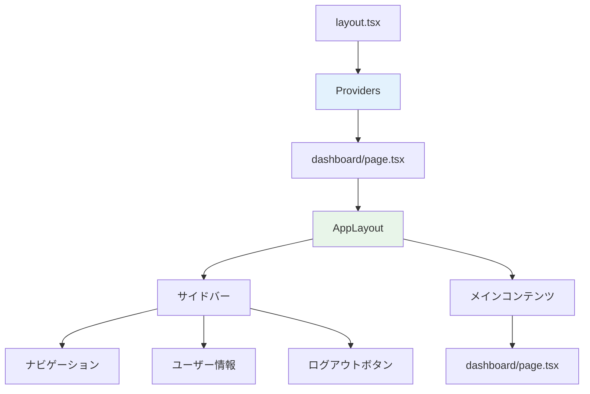
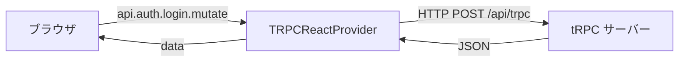
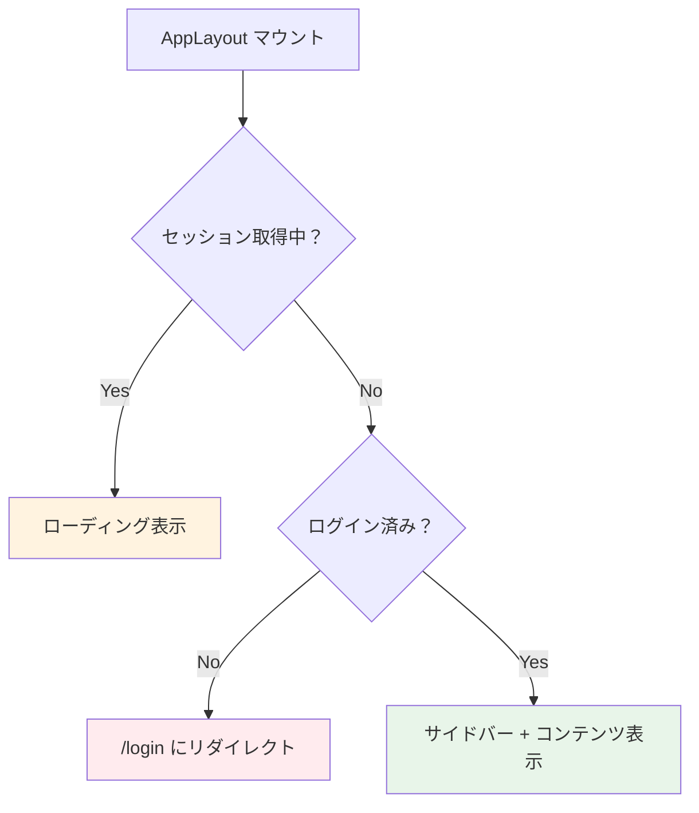
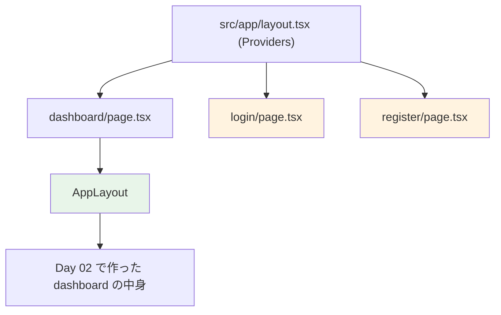

# Day 08: サイドバー付きのアプリレイアウトを作ろう


この写真はカリキュラムを最後まで進めたあとのサイドバーで、メニューが7つ並んでいます。
今日作るメニューは「ダッシュボード」「プロジェクト」「マイタスク」の3つです。
残る4つは Day 13 以降で画面を作るたびに1つずつ足していくので、今日の時点で
自分の画面のメニューが3つでも間違いではありません。

## 前回の振り返り

Day 07 で認証バックエンドを作りました。
ログイン・登録・ログアウトが全部動くようになりました。

でも今のアプリ、ログインした先に何もありません。
今日はサイドバーとヘッダーを自分の手で作って、
「アプリっぽい骨格」を完成させます。

---

## 今日のゴール

サイドバー付きのレイアウトを自分で作って、
まずダッシュボードにこのレイアウトを適用します。Day 09 以降のページには、作るたびに同じレイアウトを巻いていきます。

- [ ] `src/app/providers.tsx` — 配布済みの tRPC Provider を読んで、どこまで届くか確認する
- [ ] `src/component/layout/app-layout.tsx` — サイドバー + メインコンテンツ
- [ ] `src/app/dashboard/page.tsx` — AppLayout の中で動くダッシュボード
- [ ] ログアウトが動作することを確認する

## なぜこれを作るのか

Day 07 のログイン API は動くけど、フロント側がまだ繋がっていません。
ブラウザから tRPC を呼ぶには、「tRPC クライアント」をアプリ全体に設定します。
そしてログイン後のページには共通のサイドバーとヘッダーが必要です。

> **例え話**: Day 07 で厨房（サーバー）を作りました。今日は客席のレイアウト（テーブル配置・通路・メニュー看板）を作ります。客が座ったときに「ちゃんとしたお店だな」と感じる骨格の部分です。

### 今日作る構造


```mermaid
flowchart TD
    A[layout.tsx] --> B[Providers]
    B --> C["dashboard/page.tsx"]
    C --> D[AppLayout]
    D --> E[サイドバー]
    D --> F[メインコンテンツ]
    E --> G[ナビゲーション]
    E --> H[ユーザー情報]
    E --> I[ログアウトボタン]
    F --> J[dashboard/page.tsx]

    style B fill:#e3f2fd
    style D fill:#e8f5e9
```

図は上から下へ、部品が別の部品を包む順番を表しています。いちばん外側の `layout.tsx` は全ページ共通の枠で、その内側に `Providers` を置くと、下にぶら下がるページ全部から tRPC を呼べます。さらに内側の `AppLayout` がサイドバーとメインコンテンツに分かれ、サイドバーの中にナビゲーション・ユーザー情報・ログアウトボタンが並びます。

包む順番は、そのまま「どこまで届くか」になります。仮に `Providers` をダッシュボードの内側だけに置くと、ログイン画面から tRPC を呼び出せません。

### やること / やらないこと

| やること | やらないこと |
|---------|-------------|
| 配布済みの tRPC クライアント設定を読んで、フロントから API を呼べる理由を掴む | tRPC クライアント設定の自作（scaffold で配布済み） |
| サイドバー + レイアウトを自分の手で書く | モバイル対応のサイドバー（このカリキュラムでは扱いません） |
| ログアウトを AlertDialog 付きで実装する | ユーザー編集機能 |

### 新しく学ぶ概念

| 概念 | 読み方 | 役割 | 例え |
|------|--------|------|------|
| Provider | プロバイダー | コンポーネントツリー全体に値を配る仕組み | 建物全体に電気を通す配電盤 |
| use client（Day 02 の復習） | ユーズクライアント | ブラウザ側で動くと宣言する | 「この部品はお客さんの手元で動きます」 |
| useQuery | ユーズクエリ | サーバーからデータを取得する React Hook | 注文票を厨房に出して結果を待つ |
| useMutation | ユーズミューテーション | サーバーのデータを変更する React Hook | 注文を厨房に送信する |

## 実装ステップ一覧

| ステップ | 作業内容 | 所要時間 | 作成ファイル |
|---------|---------|---------|-------------|
| Step 1 | providers.tsx の中身を読む（tRPC + React Query） | 8分 | `src/app/providers.tsx` |
| Step 2 | ルートレイアウトのどこで Provider が囲んでいるか読む | 5分 | `src/app/layout.tsx` 確認 |
| Step 3 | AppLayout を作る（サイドバーの骨格） | 15分 | `src/component/layout/app-layout.tsx` |
| Step 4 | ダッシュボードに AppLayout を適用する | 5分 | `src/app/dashboard/page.tsx` |
| Step 5 | ログインして全体の動作を確認する | 5分 | なし |

**合計時間**: 約 38 分です。

この時間はコードを読んで理解する目安です。写経して打ち込む時間、詰まって調べる時間は別に見てください。

---

### Step 1: providers.tsx を読む（tRPC クライアント設定・8分）

**ゴール**: 配布済みの設定を読んで、フロントエンドから tRPC API を呼べる仕組みを掴みます。

Day 07 で作った tRPC サーバーを、ブラウザ側から呼ぶには
「クライアント」が必要です。scaffold は `src/trpc/` の設定ファイルと、
それをアプリ全体に適用する Provider の両方を配布済みです。
今日はどちらも書き足さず、中身を読んで仕組みを掴みます。


```mermaid
flowchart LR
    A[ブラウザ] -->|api.auth.login.mutate| B[TRPCReactProvider]
    B -->|HTTP POST /api/trpc| C[tRPC サーバー]
    C -->|JSON| B
    B -->|data| A
```

矢印は、ボタンを押してから画面が変わるまでの一往復です。ブラウザ側では `api.auth.login.mutate` のような関数呼び出しを書くだけで、`TRPCReactProvider` がそれを `/api/trpc` への HTTP リクエストに変換して送ります。返ってきた JSON も同じ道を逆にたどり、型の付いた値としてブラウザに戻ります。

この Provider が無いと `api` は送り先を知らないため、呼んだ瞬間にエラーで止まります。

`src/app/providers.tsx` は Day 01 の scaffold が配布済みです。新しく作らず、開いて中身を確認します。

```tsx
// filepath: src/app/providers.tsx
'use client';

import { Toaster } from 'react-hot-toast';
import { TRPCReactProvider } from '@/trpc/react';

export function Providers({ children }: { children: React.ReactNode }) {
  return (
    <TRPCReactProvider>
      {children}
      <Toaster />
    </TRPCReactProvider>
  );
}
```

| コード | 意味 |
|--------|------|
| `'use client'` | この Provider はブラウザ側で動く |
| `TRPCReactProvider` | scaffold が用意した tRPC + React Query の設定 |
| `Toaster` | `toast()` で出す通知の表示場所。これが無いと通知は一切出ない |
| `children` | この下に置かれる全コンポーネントが tRPC を使える |

> scaffold の `src/trpc/react.tsx` の中身が気になったら開いてみてもいいです。QueryClient と httpBatchLink の設定が入っています。

**確認ポイント**:
- [ ] `src/app/providers.tsx` の中身を確認した
- [ ] `'use client'` が先頭にある
- [ ] `<Toaster />` が入っている

---

### Step 2: ルートレイアウトのどこで Provider が囲んでいるか読む（5分）

**ゴール**: アプリ全体で tRPC が使える理由を、ルートレイアウトを読んで掴みます。

`src/app/layout.tsx` を開きます。こちらも scaffold が配布済みで、Provider はすでに組み込まれています。書き換えずに、どこで囲んでいるかを確認します。

```tsx
// filepath: src/app/layout.tsx
import type { Metadata } from 'next';
import { Inter, JetBrains_Mono, Noto_Sans_JP } from 'next/font/google';
import { Providers } from './providers';
import './globals.css';

const inter = Inter({
  subsets: ['latin'],
  variable: '--font-inter',
  display: 'swap',
});
```

同じ書き方で `JetBrains_Mono` を `--font-jetbrains-mono`、`Noto_Sans_JP` を `--font-noto-sans-jp` として読み込んでいます。続きは次のとおりです。

```tsx
// filepath: src/app/layout.tsx（続き）
export default function RootLayout({
  children,
}: {
  children: React.ReactNode;
}) {
  return (
    <html lang="ja" className={`${inter.variable} ${jetBrainsMono.variable} ${notoSansJP.variable}`}>
      <body>
        <Providers>{children}</Providers>
      </body>
    </html>
  );
}
```

| 確認する箇所 | 意味 |
|--------|------|
| `import { Providers }` | Step 1 で見た Provider を読み込む |
| `<Providers>{children}</Providers>` | 全ページを Provider で囲む |
| `className={...}` | フォントの変数を全ページへ渡す |

> `--font-inter` などの変数は、`src/app/layout.tsx` の冒頭にある `next/font/google` の import で定義しています。Day 01 で書いた `globals.css` がこの変数を参照しているので、消すとフォント指定が黙って効かなくなります。
>
> `<Providers>` で全体を囲んだので、アプリのどこからでも `api.auth.login.useMutation()` のように tRPC を呼べます。

**確認ポイント**:
- [ ] `src/app/layout.tsx` に `<Providers>` が入っていることを確認した
- [ ] この時点で `npm run dev` してエラーが出ないことを確認

---

### Step 3: AppLayout を作る（サイドバーの骨格・15分）

**ゴール**: サイドバー + メインコンテンツのレイアウトコンポーネントを作ります。

ここが今日のメインです。認証チェック、ナビゲーション、ログアウトを 1 つのレイアウトに組み込みます。


```mermaid
flowchart TD
    A[AppLayout マウント] --> B{セッション取得中？}
    B -->|Yes| C[ローディング表示]
    B -->|No| D{ログイン済み？}
    D -->|No| E["/login にリダイレクト"]
    D -->|Yes| F[サイドバー + コンテンツ表示]

    style C fill:#fff3e0
    style E fill:#ffebee
    style F fill:#e8f5e9
```

この分岐は、AppLayout が中身を描く前に必ず通る判定です。セッションの問い合わせが終わるまでは読み込み中の表示を出し、終わってからログイン済みかどうかを見ます。ログインしていなければ何も描かずに `/login` へ送るので、未ログインの人にサイドバーが一瞬でも見えることはありません。

この書き方は、問い合わせ自体が失敗したときも未ログインとして扱います。ログイン済みの人が通信の失敗でログイン画面へ送られることがある、ということです。実務では `error` も受け取り、失敗したときは再試行の案内を出してから判断します。

この判定をレイアウト側に置いたおかげで、この先に作るページは自分で認証を確認せずに済みます。

`src/component/layout/app-layout.tsx` を新規作成します。

#### 3-1. インポートと型定義

```tsx
// filepath: src/component/layout/app-layout.tsx
'use client';

import {
  FolderOpen,
  LayoutDashboard,
  ListTodo,
  LogOut,
} from 'lucide-react';
import Link from 'next/link';
import { usePathname, useRouter } from 'next/navigation';
import { useEffect, useState } from 'react';
import {
  AlertDialog,
  AlertDialogAction,
  AlertDialogCancel,
  AlertDialogContent,
  AlertDialogDescription,
  AlertDialogFooter,
  AlertDialogHeader,
  AlertDialogTitle,
  AlertDialogTrigger,
} from '@/component/ui/alert-dialog';
```

import は、このファイルで使う道具を先に並べる宣言です。`lucide-react` はサイドバーのアイコン、`Link` はページ移動、`usePathname` は今いるページの URL を取る道具で、現在のメニューを目立たせるときに使います。`useState` は画面の状態を覚えておく仕組みです。`useEffect`（画面が表示された後など、決まったタイミングで処理を走らせる React の仕組み）は、あとで「ブラウザ側の準備が終わったか」を記録するときに使います。

`AlertDialog` で始まる 9 個は、ログアウト前の確認ダイアログを組み立てる部品一式です。shadcn/ui のダイアログは 1 つの部品ではなく、枠・見出し・本文・ボタンに分かれています。だから使う分だけ名前を並べて取り込みます。1 つでも取り込み漏れがあると、その名前を書いた行で「定義されていない」というエラーが出ます。

**確認ポイント**:
- [ ] ログアウト確認に使う `AlertDialog` 一式を import している

```tsx
// filepath: src/component/layout/app-layout.tsx（続き）
import { Button } from '@/component/ui/button';
import { cn } from '@/lib/utils';
import { api } from '@/trpc/react';
```

`cn` は、条件によって変わるクラス名を1つの文字列にまとめる関数です。あとでメニューの現在地を色分けするとき、選択中と未選択のクラスを混ぜて渡します。

`+` でつないでも動きます。ただ、空白を1つ入れ忘れると `text-smfont-bold` のようにくっついて、そのクラスだけ効かなくなります。画面は崩れず、ただ色が付かないだけです。だから原因を探すのに時間がかかります。

`api` は tRPC のクライアントです。これを取り込まないと、あとで書く `api.auth.getSession` の行で「名前が見つからない」と言われて開発サーバーが止まります。

**確認ポイント**:
- [ ] ログアウト用の `AlertDialog` を import している
- [ ] tRPC 用の `api` を import している

```tsx
// filepath: src/component/layout/app-layout.tsx（続き）
interface MenuItem {
  text: string;
  icon: React.ReactNode;
  path: string;
}

const menuItems: MenuItem[] = [
  {
    text: 'ダッシュボード',
    icon: <LayoutDashboard className="h-5 w-5" />,
    path: '/dashboard',
  },
  {
    text: 'プロジェクト',
    icon: <FolderOpen className="h-5 w-5" />,
    path: '/project',
  },
  {
    text: 'マイタスク',
    icon: <ListTodo className="h-5 w-5" />,
    path: '/my-task',
  },
];
```

| コード | 意味 |
|--------|------|
| `'use client'` | ユーザー操作（ナビゲーション、ログアウト）があるので Client Component |
| `lucide-react` | アイコンライブラリ（scaffold でインストール済み） |
| `AlertDialog` | ログアウト前の確認ダイアログ（scaffold の UI コンポーネント） |
| `menuItems` | サイドバーに表示するメニュー項目の定義 |

#### 3-2. コンポーネント本体（認証チェック + ログアウト）

```tsx
// filepath: src/component/layout/app-layout.tsx（続き）
export function AppLayout({
  children,
}: {
  children: React.ReactNode;
}) {
  const [hasMounted, setHasMounted] = useState(false);
  const pathname = usePathname();
  const router = useRouter();

  const { data: session, isLoading } =
    api.auth.getSession.useQuery();

  const logoutMutation = api.auth.logout.useMutation({
    onSuccess: () => {
      router.push('/login');
      router.refresh();
    },
  });
```

状態と問い合わせを、関数の先頭でまとめて宣言しています。`useState` や `useQuery` のようなフックは、毎回同じ順番で呼ばれることを前提に作られています。`if` の中や `return` より後ろに置くと順番が変わり、React が値を取り違えてエラーになります。並べる場所には理由があります。

`logoutMutation` を関数の先頭で用意しておくのは、`useMutation` もフックだからです。フックは毎回同じ順番で呼ばれる前提なので、`onClick` の中には書けません。実際に通信が始まるのは、ボタンが押されて `mutate` が呼ばれたときです。`onSuccess` で `router.push` に加えて `router.refresh()` を呼ぶのは、サーバー側で組み立て済みの表示が残るのを防ぐためです。これを省くと、ログアウトしたのに前のユーザー名が画面に残る場合があります。

**確認ポイント**:
- [ ] `getSession` でログイン状態を取得している
- [ ] ログアウト成功後に `/login` へ戻している

```tsx
// filepath: src/component/layout/app-layout.tsx（続き）
  useEffect(() => {
    setHasMounted(true);
  }, []);

  useEffect(() => {
    if (hasMounted && !isLoading && !session) {
      router.push('/login');
    }
  }, [hasMounted, isLoading, session, router]);

  if (!hasMounted || isLoading) {
    return (
      <div className="flex h-screen items-center justify-center">
        <p className="text-muted-foreground">読み込み中...</p>
      </div>
    );
  }

  if (!session?.user) {
    return null;
  }
```

読み込み中の表示をここでは自分で書いていますが、Day 09 以降は配布済みの `PageLoadingSpinner` を使います。完成版の `AppLayout` もその部品を使っています。今日は仕組みを追いやすいように、まず素の要素で書いています。

| コード | 意味 | 例え |
|--------|------|------|
| `hasMounted` | SSR（サーバー側で先に HTML を組み立てる仕組み）と CSR（ブラウザ側で後から HTML を組み立てる仕組み）のズレ防止フラグ | 店が開店してから初めて客をチェックする |
| `api.auth.getSession.useQuery()` | サーバーに「今ログインしているか」を問い合わせる | 入口でリストバンドチェック |
| `logoutMutation` | ログアウト API を呼ぶ準備 | 退出手続きのボタン |
| `router.push('/login')` | ログイン画面へ飛ばす | 受付に案内する |

> `hasMounted` が必要な理由: Next.js はサーバーで HTML を生成してからブラウザに送ります（SSR）。session Cookie には Day 07 で `httpOnly` を付けたので、ブラウザ側の JavaScript からは中身を読めません。ログイン状態を知る道は、`api.auth.getSession.useQuery()` でサーバーに聞くことだけです。このとき Cookie はリクエストへ自動で付いて飛び、中身を開いて誰なのかを判定するのはサーバー側です。答えが返ってくるのは画面が出たあとなので、このフラグで「ブラウザ側の準備ができてから判定する」ようにして、チラつきを防ぎます。

#### 3-3. レイアウト JSX（サイドバー + コンテンツ）

```tsx
// filepath: src/component/layout/app-layout.tsx（続き）
  return (
    <div className="flex h-screen bg-background">
      {/* サイドバー */}
      <aside className="hidden w-64 flex-col border-r bg-sidebar md:flex">
        {/* ロゴ */}
        <div className="border-b border-sidebar-border p-4">
          <h1 className="text-lg font-bold text-sidebar-foreground">
            Task App
          </h1>
        </div>
```

サイドバーを `<div>` ではなく `<aside>` で書いています。見た目はどちらも同じですが、`<aside>` には「ここは本文ではなく脇の案内です」という意味が付きます。読み上げソフトを使う人は、この目印でページの主役がどこかを判断します。`<div>` で揃えてしまうと、その手がかりが消えます。

`hidden` と `md:flex` を並べているのは、画面が狭いときにサイドバーを隠すためです。`w-64` は幅 256px を指します。スマートフォンの画面にこの帯が居座ると、本文に残る幅が 100px ほどになり、文章が1文字ずつ折り返されて読めなくなります。

ここで先に断っておくことがあります。消えるのはサイドバーの帯ごとなので、幅 768px 未満では
**ナビゲーションのリンクとログアウトボタンが、まとめて画面から消えます**。
代わりのハンバーガーメニューを、このカリキュラムでは作りません。
Day 04 で公開した URL をスマートフォンから開くと、ログインした先に移動する手段の無い画面が出ます。
動作確認はパソコンのブラウザで進めてください。
スマートフォンで見るときは、ブラウザの幅を広げると帯が戻ります。自分の書き間違いではありません。

**確認ポイント**:
- [ ] 左側にサイドバーを作っている
- [ ] ロゴとして `Task App` を表示している
- [ ] 画面幅を 768px より狭くすると、サイドバーごと消えることを確認した（仕様どおりの動き）

```tsx
        {/* filepath: src/component/layout/app-layout.tsx（続き） */}
        {/* ナビゲーション */}
        <nav className="flex-1 p-3">
          <ul className="space-y-1">
            {menuItems.map((item) => (
              <li key={item.path}>
                <Link
                  href={item.path}
                  className={cn(
                    'flex items-center gap-3 rounded-md px-3 py-2 text-sm transition-colors',
                    pathname === item.path
                      ? 'bg-sidebar-accent text-sidebar-accent-foreground font-medium'
                      : 'text-sidebar-foreground/70 hover:bg-sidebar-accent/50 hover:text-sidebar-foreground',
                  )}
                >
                  {item.icon}
                  {item.text}
                </Link>
              </li>
            ))}
          </ul>
        </nav>
```

メニューを `map` で組み立てるのは、項目を増やすときに `menuItems` へ1行足すだけで済むようにするためです。`<li>` を3つ手で書き並べても今は動きます。ただし項目が増えるたびに同じクラス名を書き写すことになり、1つだけ直し忘れた項目がいずれ出ます。`key` に `item.path` を渡すのは、React が並び替えのときにどの項目が動いたかを見分けるためです。

`pathname === item.path` の比較で、今開いているページのリンクだけ背景色を変えています。この目印が無いと、読者は自分がどこにいるかを画面から判断できません。移動したかどうかも分からなくなります。

**確認ポイント**:
- [ ] `menuItems.map` でメニューを表示している
- [ ] 現在ページは背景色で強調している

```tsx
        {/* filepath: src/component/layout/app-layout.tsx（続き） */}
        {/* ユーザー情報 + ログアウト */}
        <div className="border-t border-sidebar-border p-4">
          <div className="mb-3 flex items-center gap-3">
            <div className="flex h-9 w-9 items-center justify-center rounded-full bg-sidebar-accent text-sm font-medium text-sidebar-accent-foreground">
              {session.user.name?.[0] || 'U'}
            </div>
            <div className="flex flex-col">
              <span className="text-sm font-medium text-sidebar-foreground">
                {session.user.name}
              </span>
              <span className="text-xs text-sidebar-foreground/60">
                {session.user.role === 'ADMIN'
                  ? '管理者'
                  : 'ユーザー'}
              </span>
            </div>
          </div>
```

ここはサイドバーの下に、今ログインしている人の情報を出す部分です。`session.user.name?.[0]` は名前の 1 文字目だけを取り出し、丸いアイコンの中に入れます。`?.` は途中の値が無ければそこで止めて `undefined` を返す書き方で、名前が未設定でも画面が落ちません。取り出せなかったときは `|| 'U'` が働き、丸の中は `U` になります。

この `session` は 3-2 で書いた `getSession` の結果なので、ログインした本人の名前と権限がそのまま出ます。別のユーザーでログインし直せば、ここの表示も入れ替わります。

**確認ポイント**:
- [ ] サイドバー下部にユーザー名と権限を表示している

```tsx
          {/* filepath: src/component/layout/app-layout.tsx（続き） */}
          {/* ログアウトボタン（確認ダイアログ付き） */}
          <AlertDialog>
            <AlertDialogTrigger asChild>
              <Button
                variant="outline"
                size="sm"
                className="w-full gap-2 border-sidebar-border text-sidebar-foreground/80 hover:bg-sidebar-accent hover:text-sidebar-foreground"
              >
                <LogOut className="h-4 w-4" />
                ログアウト
              </Button>
            </AlertDialogTrigger>
```

`AlertDialogTrigger` は、ダイアログを開くきっかけになる部品です。`asChild` を付けると、この部品は自分でボタンを描かず、中に置いた `<Button>` へきっかけ役だけを渡します。付け忘れるとボタンが二重に描かれ、サイドバーの見た目が崩れます。

ログアウトをすぐ実行せずダイアログを挟むのは、押し間違いで作業中の画面から追い出されるのを防ぐためです。Day 07 で作ったログアウトは、呼べばその場でセッションが消えます。取り消せない操作の手前に一段置く、という考え方はこの先の削除機能でも同じです。

**確認ポイント**:
- [ ] ボタンを押すと確認ダイアログが開く

```tsx
            {/* filepath: src/component/layout/app-layout.tsx（続き） */}
            <AlertDialogContent>
              <AlertDialogHeader>
                <AlertDialogTitle>
                  ログアウトしますか？
                </AlertDialogTitle>
                <AlertDialogDescription>
                  ログアウトすると、再度ログインが必要になります。
                </AlertDialogDescription>
              </AlertDialogHeader>
              <AlertDialogFooter>
                <AlertDialogCancel>キャンセル</AlertDialogCancel>
                <AlertDialogAction
                  onClick={() => logoutMutation.mutate()}
                >
                  ログアウト
                </AlertDialogAction>
              </AlertDialogFooter>
            </AlertDialogContent>
          </AlertDialog>
        </div>
      </aside>
```

ダイアログの中身は、見出し・説明・下部のボタンという 3 つの区画に分かれています。`AlertDialogCancel` は何もせずに閉じるだけの出口です。`AlertDialogAction` を押したときだけ `logoutMutation.mutate()` が走ります。

`mutate()` を呼ぶとサーバーのログアウト手続きが動き、成功したら 3-2 で書いた `onSuccess` が `/login` へ戻します。`onClick` を `AlertDialogCancel` の側に書いてしまうと、キャンセルのつもりでログアウトする画面になります。押した先で何が起きるかは、この 2 行のどちらに `onClick` を置くかで決まります。

**確認ポイント**:
- [ ] ログアウト前に確認ダイアログを表示している

```tsx
{/* filepath: src/component/layout/app-layout.tsx（続き） */}

      {/* 画面に main は1つだけ置くため、各ページ側では書かない */}
      <main className="flex-1 overflow-y-auto p-6">
        {children}
      </main>
    </div>
  );
}
```

**AlertDialog の構造**:

| パーツ | 役割 |
|--------|------|
| `AlertDialogTrigger` | ダイアログを開くボタン |
| `AlertDialogContent` | ダイアログの中身 |
| `AlertDialogAction` | 確定（ログアウト実行） |
| `AlertDialogCancel` | キャンセル（閉じるだけ） |

> `asChild` を付けると、中の `<Button>` がそのままトリガーになります。見た目を自由にカスタマイズできます。

**確認ポイント**:
- [ ] `src/component/layout/app-layout.tsx` が作成できた
- [ ] `'use client'` が先頭にある
- [ ] `menuItems` に 3 つのメニュー項目がある
- [ ] ログアウトボタンに `AlertDialog` が付いている

**学んだこと**: `useQuery` でサーバーのセッション情報を取得し、無ければログイン画面へ送ります。レイアウト全体が認証ゲートの役割を持ちます。

---

### Step 4: ダッシュボードに AppLayout を適用する（5分）

**ゴール**: Day 02 で作ったダッシュボードを、サイドバー付きの AppLayout で囲みます。

Day 09 以降も、各ページを同じ方法で AppLayout の中へ入れます。
ファイルは移動せず、`src/app/dashboard/page.tsx` をそのまま編集します。


```mermaid
flowchart TD
    A["src/app/layout.tsx (Providers)"] --> B["dashboard/page.tsx"]
    A --> C["login/page.tsx"]
    A --> D["register/page.tsx"]
    B --> E["AppLayout"]
    E --> F["Day 02 で作った dashboard の中身"]

    style E fill:#e8f5e9
    style C fill:#fff3e0
    style D fill:#fff3e0
```

図の左端 `src/app/layout.tsx` はすべてのページの親なので、ログイン画面と登録画面もここを通ります。一方 `AppLayout` はダッシュボードの内側にだけ置きます。サイドバーを出したい画面と出したくない画面は、この置き場所だけで分かれます。

ページを増やすときも同じで、サイドバーが要るページだけ `AppLayout` で囲みます。ログイン画面を囲んでしまうと、ログインしていない人が認証チェックに引っかかり、ログイン画面から `/login` へ送られ続けます。

`src/app/dashboard/page.tsx` の import に AppLayout を追加します。

```tsx
// filepath: src/app/dashboard/page.tsx（import に追加）
import { AppLayout } from '@/component/layout/app-layout';
```

次に、Day 02 で作った外側の `<main>...</main>` を
`<div>...</div>` に変え、その全体を
`<AppLayout>...</AppLayout>` で囲みます。
AppLayout 側が `<main>` を持つため、内側は `<div>`
にして重複を避けます。中身は消さず、そのまま残してください。

```tsx
// filepath: src/app/dashboard/page.tsx（return の外側を変更）
  return (
    <AppLayout>
      <div className="min-h-screen bg-background text-foreground">
        {/* Day 02 で作った内容は、そのままここに残す */}
      </div>
    </AppLayout>
  );
```

AppLayout がサイドバーと認証チェックを担当し、
内側の `<main>` は Day 02 のダッシュボード表示を担当します。
ログイン画面と登録画面は AppLayout で囲まないため、
認証前でもサイドバーなしで表示されます。

**確認ポイント**:
- [ ] `src/app/dashboard/page.tsx` に AppLayout の import がある
- [ ] `return` の外側が `<AppLayout>...</AppLayout>` で囲まれている
- [ ] Day 02 の外側の `<main>` を `<div>` に変え、中身が残っている

---

### Step 5: ログインして全体の動作を確認する（5分）

**ゴール**: ここまでの全 Step が正しく連携して動くことを確認します。

```bash
npm run dev
```

ここで一度ログアウトした状態に戻します。Day 07 でログインしたときの Cookie（ブラウザに保存された合言葉）は7日間有効なので、続けて進めた人はまだログイン済みです。そのままだと手順1のリダイレクトが起きません。

ブラウザのシークレットウィンドウ（Cookie を持ち込まない別ウィンドウ）を開いてください。Chrome なら Mac は `Command + Shift + N`、Windows は `Ctrl + Shift + N` です。以降の確認はこのウィンドウで行います。

シークレットウィンドウで `http://localhost:3000` を開きます。


**確認フロー**:

1. `/dashboard` へアクセス → middleware が `/login` にリダイレクト。
2. `admin@example.com` / `password123` でログイン。
3. ダッシュボードが表示される（サイドバー付き）。


4. サイドバーに「ダッシュボード」「プロジェクト」「マイタスク」の3つのメニューが見える。
   （「プロジェクト」と「マイタスク」を押すと 404 になりますが正常です。ページは Day 09 と Day 17 で作ります）
5. サイドバー下部に「管理者」の名前とロールが表示される。
6. 「ログアウト」ボタンを押す → 確認ダイアログが出る。
7. 「ログアウト」を押す → `/login` に戻る。

**確認ポイント**:
- [ ] `npm run dev` でエラーが出ない
- [ ] サイドバーが左側に表示される
- [ ] ユーザー名「管理者」とロール「管理者」が見える
- [ ] ナビゲーションのアクティブ状態が正しい（現在のページがハイライト）
- [ ] ログアウト → 確認ダイアログ → ログイン画面に戻る

> **うまくいかないとき**: 「つまずきポイント」セクションを確認してください。

---

## Pro パターンで書こう（`use client` の影響範囲を最小化する）

Step 3 では AppLayout 全体を `'use client'` にしました。
これは今日のスコープでは正しい書き方ですが、次のステップでさらに改善できます。

### Before（今日書いたコード・動くけど改善の余地あり）

```tsx
// app-layout.tsx 全体が 'use client'
// → ナビゲーションリンク（静的）まで Client Component になる
```

今日書いた `app-layout.tsx` は先頭に `'use client'` を置いたので、このファイルの中身はまとめてブラウザへ送られます。ロゴやリンク一覧のように押しても何も起きない部分まで一緒に送られるため、その分だけ読み込むファイルが増えます。動きは正しく、最初に書く形としてはこれで問題ありません。

### After（プロが書くコード）

```tsx
// app-layout.tsx から 'use client' を外す（Server Component に）
// ログアウトボタンだけ別ファイルに分離して 'use client'
```

**強み**: 静的な枠（ロゴ、リンク一覧）は Server Component のまま残せます。
対話が必要な部品（ログアウト、認証チェック）だけを Client Component にします。
→ ブラウザへ送るコードが減り、初期表示が速くなります。

> **覚えておきたいエッセンス**: `use client` はファイル全体に効くスイッチです。サイドバーでは「静的な枠は Server、押せる部品は Client」に分けるのがプロの基本です。今日の段階では全体を Client のままにしておいて問題ありません。この最適化は Day 09 以降で必要になったタイミングで取り組みます。

---

## 完成コード全体

今日は4つのファイルを触りました。断片を貼り重ねる作業が続いたので、途中でどこへ貼ったか分からなくなった場合は、以下のコードと自分のファイルを見比べてください。上から順に読めば、Step 1 から Step 4 で扱ったものが、どう1つのファイルになったかを確かめられます。

| ファイル | 役割 | 対応する Step |
|---------|------|--------------|
| `src/app/providers.tsx` | tRPC と通知の入口をアプリ全体へ配る | Step 1 |
| `src/app/layout.tsx` | 全ページを Provider で囲む土台 | Step 2 |
| `src/component/layout/app-layout.tsx` | サイドバーとログイン判定 | Step 3 |
| `src/app/dashboard/page.tsx` | AppLayout で囲んだダッシュボード | Step 4 |

### `src/app/providers.tsx`

**Provider の本体**:

```tsx
// filepath: src/app/providers.tsx
// 完成版: Provider の本体
'use client';

import { Toaster } from 'react-hot-toast';
import { TRPCReactProvider } from '@/trpc/react';

export function Providers({ children }: { children: React.ReactNode }) {
  return (
    <TRPCReactProvider>
      {children}
      <Toaster />
    </TRPCReactProvider>
  );
}
```

このファイルは Day 01 の scaffold が配布したままなので、手元と1文字も違わないはずです。`TRPCReactProvider` で囲んだ内側だけが `api` を使えます。囲みの外に置いた部品から呼ぶと、送り先が決まらずエラーになります。`<Toaster />` を `{children}` の隣に1つだけ置いているのは、通知の描画先をアプリ全体で1か所にそろえるためです。ページごとに置くと、同じ通知が置いた枚数だけ重なって出ます。

### `src/app/layout.tsx`

**取り込みとフォントの読み込み**:

```tsx
// filepath: src/app/layout.tsx
// 完成版: 取り込みとフォントの読み込み
import type { Metadata } from 'next';
import { Inter, JetBrains_Mono, Noto_Sans_JP } from 'next/font/google';
import { Providers } from './providers';
import './globals.css';

const inter = Inter({
  subsets: ['latin'],
  variable: '--font-inter',
  display: 'swap',
});

const jetBrainsMono = JetBrains_Mono({
  subsets: ['latin'],
  variable: '--font-jetbrains-mono',
  display: 'swap',
});

const notoSansJP = Noto_Sans_JP({
  subsets: ['latin'],
  weight: ['400', '500', '700'],
  variable: '--font-noto-sans-jp',
  display: 'swap',
});
```

Step 2 では `Inter` の1つ分だけを載せました。残る2つも書き方は変わりません。3つとも関数の外側で呼んでいるのは、`next/font/google` がフォントの取り寄せをビルドのときに1回だけ済ませる作りだからです。関数の中へ入れると、画面を描き直すたびに同じ指定を組み立て直すことになります。`variable` で CSS の変数名を決めておくと、`globals.css` 側はこの名前だけを見れば済みます。

**題名と全ページの外枠**:

```tsx
// filepath: src/app/layout.tsx（同じファイルの続き）
// 完成版: 題名と全ページの外枠
export const metadata: Metadata = {
  title: 'TaskApp - プロジェクト・タスク管理',
  description:
    'チームで使えるプロジェクト・タスク管理アプリケーション。プロジェクト管理、タスクトラッキング、進捗レポート機能を提供します。',
};

export default function RootLayout({ children }: { children: React.ReactNode }) {
  return (
    <html
      lang="ja"
      className={`${inter.variable} ${jetBrainsMono.variable} ${notoSansJP.variable}`}
    >
      <body>
        <Providers>{children}</Providers>
      </body>
    </html>
  );
}
```

`metadata` は Step 2 の抜粋には出てきませんが、scaffold が配った時点で入っています。ブラウザのタブに出る題名と、検索結果に出る説明文がここで決まります。`<Providers>` を `<body>` のすぐ内側に置いてあるのは、この位置より内側にある全ページへ tRPC を届けるためです。フォントの変数を `<html>` に付けているのも理由は揃っていて、いちばん外側に置けば配下のどのページからも読めます。

### `src/component/layout/app-layout.tsx`

**ブラウザ側の宣言と外部ライブラリの取り込み**:

```tsx
// filepath: src/component/layout/app-layout.tsx
// 完成版: ブラウザ側の宣言と外部ライブラリの取り込み
'use client';

import {
  FolderOpen,
  LayoutDashboard,
  ListTodo,
  LogOut,
} from 'lucide-react';
import Link from 'next/link';
import { usePathname, useRouter } from 'next/navigation';
import { useEffect, useState } from 'react';
```

1枚目は外部ライブラリの取り込みです。並びがアルファベット順になっているのは、`npm run fix` を実行すると Biome（このプロジェクトのコード整形ツール）が並べ替えるからです。自分が書いた順番と違っていても、手で直す必要はありません。`'use client'` はファイルの1行目に置きます。取り込みの後ろへ動かすと、ブラウザ側で動かす宣言として読まれず、`useState` の行でエラーになります。

**画面部品と tRPC の取り込み**:

```tsx
// filepath: src/component/layout/app-layout.tsx（同じファイルの続き）
// 完成版: 画面部品と tRPC の取り込み
import {
  AlertDialog,
  AlertDialogAction,
  AlertDialogCancel,
  AlertDialogContent,
  AlertDialogDescription,
  AlertDialogFooter,
  AlertDialogHeader,
  AlertDialogTitle,
  AlertDialogTrigger,
} from '@/component/ui/alert-dialog';
import { Button } from '@/component/ui/button';
import { cn } from '@/lib/utils';
import { api } from '@/trpc/react';
```

2枚目は自分のプロジェクトの中にある部品です。`@/` で始まる書き方は `src/` を指す近道で、ファイルの置き場所が深くなっても `../../` を数えずに済みます。`AlertDialog` で始まる名前が9個並ぶのは、shadcn/ui のダイアログが枠・見出し・本文・ボタンに分かれているからです。手元で数えて9個に足りない場合は、その足りない名前を書いた行が「定義されていません」というエラーになります。

**メニュー項目の型**:

```tsx
// filepath: src/component/layout/app-layout.tsx（同じファイルの続き）
// 完成版: メニュー項目の型
interface MenuItem {
  text: string;
  icon: React.ReactNode;
  path: string;
}
```

メニュー1件の形をここで決めておくと、項目を足すときに何を書けばよいかが決まります。`icon` の型が `React.ReactNode` になっているのは、文字列ではなく `<LayoutDashboard />` のような画面部品をそのまま入れるからです。

**メニュー項目の一覧**:

```tsx
// filepath: src/component/layout/app-layout.tsx（同じファイルの続き）
// 完成版: メニュー項目の一覧
const menuItems: MenuItem[] = [
  {
    text: 'ダッシュボード',
    icon: <LayoutDashboard className="h-5 w-5" />,
    path: '/dashboard',
  },
  {
    text: 'プロジェクト',
    icon: <FolderOpen className="h-5 w-5" />,
    path: '/project',
  },
  {
    text: 'マイタスク',
    icon: <ListTodo className="h-5 w-5" />,
    path: '/my-task',
  },
];
```

この配列を関数の外に置いてあるのは、中身が画面の状態で変わらないからです。関数の中へ入れると、画面を描き直すたびに同じ3件を作り直します。並びはそのまま画面の上から下の順になります。項目を増やすときに書き足すのはこの配列だけで、後ろに出てくる表示側は書き換えません。

**状態とサーバーへの問い合わせ**:

```tsx
// filepath: src/component/layout/app-layout.tsx（同じファイルの続き）
// 完成版: 状態とサーバーへの問い合わせ
export function AppLayout({
  children,
}: {
  children: React.ReactNode;
}) {
  const [hasMounted, setHasMounted] = useState(false);
  const pathname = usePathname();
  const router = useRouter();

  const { data: session, isLoading } =
    api.auth.getSession.useQuery();

  const logoutMutation = api.auth.logout.useMutation({
    onSuccess: () => {
      router.push('/login');
      router.refresh();
    },
  });
```

関数の先頭が道具をそろえる場所です。`useState` や `useQuery` は毎回同じ順番で呼ばれることを前提に作られているので、`if` の中や `return` の後ろへ動かすと React が値を取り違えます。`logoutMutation` をここで用意しておくのも同じ理由です。実際に通信が始まるのは、後ろのボタンから `mutate()` が呼ばれたときで、この行では準備だけをしています。

**未ログインの人を送り出す判定**:

```tsx
// filepath: src/component/layout/app-layout.tsx（同じファイルの続き）
// 完成版: 未ログインの人を送り出す判定
  useEffect(() => {
    setHasMounted(true);
  }, []);

  useEffect(() => {
    if (hasMounted && !isLoading && !session) {
      router.push('/login');
    }
  }, [hasMounted, isLoading, session, router]);

  if (!hasMounted || isLoading) {
    return (
      <div className="flex h-screen items-center justify-center">
        <p className="text-muted-foreground">読み込み中...</p>
      </div>
    );
  }

  if (!session?.user) {
    return null;
  }
```

ここが今日のいちばんの要点です。2つの `if` を `return` より前に置いてあるので、この行より下は「ログイン済みの人だけが通る場所」になります。だから後ろのサイドバーでは `session.user.name` を確かめずに読めます。判定を後ろへ動かすと、未ログインの人にサイドバーが一瞬見えてしまいます。`return null` は何も描かずに終わる書き方で、`/login` への移動が終わるまでの短い間だけ働きます。

**サイドバーの外枠とロゴ**:

```tsx
// filepath: src/component/layout/app-layout.tsx（同じファイルの続き）
// 完成版: サイドバーの外枠とロゴ
  return (
    <div className="flex h-screen bg-background">
      {/* サイドバー */}
      <aside className="hidden w-64 flex-col border-r bg-sidebar md:flex">
        {/* ロゴ */}
        <div className="border-b border-sidebar-border p-4">
          <h1 className="text-lg font-bold text-sidebar-foreground">
            Task App
          </h1>
        </div>
```

いちばん外側を `flex` にしてあるので、サイドバーと本文が左右に並びます。`h-screen` は画面の高さいっぱいを指し、これが無いとサイドバーの色帯が中身の高さで止まります。`<aside>` を使っているのは、読み上げソフトに「ここは本文ではなく脇の案内です」と伝えるためです。見た目だけなら `<div>` でも同じに見えます。

**ナビゲーション**:

```tsx
        {/* filepath: src/component/layout/app-layout.tsx（同じファイルの続き） */}
        {/* 完成版: ナビゲーション */}
        {/* ナビゲーション */}
        <nav className="flex-1 p-3">
          <ul className="space-y-1">
            {menuItems.map((item) => (
              <li key={item.path}>
                <Link
                  href={item.path}
                  className={cn(
                    'flex items-center gap-3 rounded-md px-3 py-2 text-sm transition-colors',
                    pathname === item.path
                      ? 'bg-sidebar-accent text-sidebar-accent-foreground font-medium'
                      : 'text-sidebar-foreground/70 hover:bg-sidebar-accent/50 hover:text-sidebar-foreground',
                  )}
                >
                  {item.icon}
                  {item.text}
                </Link>
              </li>
            ))}
          </ul>
        </nav>
```

`<nav>` に付けた `flex-1` が、余った高さをこの区画に全部渡します。だから下のユーザー情報は、メニューの件数が変わってもサイドバーの底に貼り付きます。`cn` に渡す2つ目の値は、開いているページかどうかで切り替わります。この切り替えが無いと、読者は自分がどこにいるかを画面から判断できません。

**ユーザー情報**:

```tsx
        {/* filepath: src/component/layout/app-layout.tsx（同じファイルの続き） */}
        {/* 完成版: ユーザー情報 */}
        {/* ユーザー情報 + ログアウト */}
        <div className="border-t border-sidebar-border p-4">
          <div className="mb-3 flex items-center gap-3">
            <div className="flex h-9 w-9 items-center justify-center rounded-full bg-sidebar-accent text-sm font-medium text-sidebar-accent-foreground">
              {session.user.name?.[0] || 'U'}
            </div>
            <div className="flex flex-col">
              <span className="text-sm font-medium text-sidebar-foreground">
                {session.user.name}
              </span>
              <span className="text-xs text-sidebar-foreground/60">
                {session.user.role === 'ADMIN'
                  ? '管理者'
                  : 'ユーザー'}
              </span>
            </div>
          </div>
```

丸の中へ `session.user.name?.[0] || 'U'` を入れています。名前が未設定の人でも、丸を空にしないためです。`?.` は途中の値が無ければそこで止める書き方です。取り出せなかったときは `|| 'U'` が働きます。ここに出る名前は、手前で受け取った `session` の中身そのものです。別のユーザーとしてログインし直せば、この表示も入れ替わります。

**ログアウトボタン**:

```tsx
          {/* filepath: src/component/layout/app-layout.tsx（同じファイルの続き） */}
          {/* 完成版: ログアウトボタン */}
          {/* ログアウトボタン（確認ダイアログ付き） */}
          <AlertDialog>
            <AlertDialogTrigger asChild>
              <Button
                variant="outline"
                size="sm"
                className="w-full gap-2 border-sidebar-border text-sidebar-foreground/80 hover:bg-sidebar-accent hover:text-sidebar-foreground"
              >
                <LogOut className="h-4 w-4" />
                ログアウト
              </Button>
            </AlertDialogTrigger>
```

`asChild` が付いていると、`AlertDialogTrigger` は自分でボタンを描かず、中に置いた `<Button>` へきっかけ役だけを渡します。付け忘れるとボタンが2つ重なって描かれ、サイドバーの見た目が崩れます。手元でボタンが二重に見えるなら、まずこの1語を確かめてください。

**ログアウトの確認ダイアログ**:

```tsx
            {/* filepath: src/component/layout/app-layout.tsx（同じファイルの続き） */}
            {/* 完成版: ログアウトの確認ダイアログ */}
            <AlertDialogContent>
              <AlertDialogHeader>
                <AlertDialogTitle>
                  ログアウトしますか？
                </AlertDialogTitle>
                <AlertDialogDescription>
                  ログアウトすると、再度ログインが必要になります。
                </AlertDialogDescription>
              </AlertDialogHeader>
              <AlertDialogFooter>
                <AlertDialogCancel>キャンセル</AlertDialogCancel>
                <AlertDialogAction
                  onClick={() => logoutMutation.mutate()}
                >
                  ログアウト
                </AlertDialogAction>
              </AlertDialogFooter>
            </AlertDialogContent>
          </AlertDialog>
        </div>
      </aside>
```

`onClick` が付いているのは `AlertDialogAction` の側だけです。ここを `AlertDialogCancel` に付け替えると、キャンセルを押した人がログアウトする画面になります。取り消せない操作の手前に一段置くという考え方は、この先の削除機能でも使います。最後の `</aside>` でサイドバー全体を閉じています。

**本文の置き場所**:

```tsx
      {/* filepath: src/component/layout/app-layout.tsx（同じファイルの続き） */}
      {/* 完成版: 本文の置き場所 */}
      {/* 画面に main は1つだけ置くため、各ページ側では書かない */}
      <main className="flex-1 overflow-y-auto p-6">
        {children}
      </main>
    </div>
  );
}
```

`{children}` が、この枠で囲んだページの中身が入る場所です。`overflow-y-auto` を本文側だけに付けてあるので、縦に長いページでもサイドバーは動かず、本文だけがスクロールします。ページ側が `<main>` を持たないのは、この行がすでに1つ持っているからです。

### `src/app/dashboard/page.tsx`

Step 4 で書き換えたのは、取り込みの1行と `return` の外枠だけです。中の表示は Day 02 で書いたものがそのまま残ります。名前や文言を自分用に書き換えている場合は、その値のまま残してください。以下は、Day 02 で書いた内容を残したまま外側を囲み直した状態です。

**取り込みと型定義**:

```tsx
// filepath: src/app/dashboard/page.tsx
// 完成版: 取り込みと型定義
import { AppLayout } from '@/component/layout/app-layout';

type DashboardOwner = {
  name: string;
  role: string;
  todayFocus: string;
  todayGoal: string;
  nextAction: string;
};

type FocusCard = {
  label: string;
  value: string;
  description: string;
};
```

Day 02 のこのファイルには取り込みが1行もありませんでした。今日ここに `AppLayout` の1行が増えます。型を2つ置いてあるのは Day 02 のままです。型はブラウザへ送られる前に消えるので、増やしても読み込みは重くなりません。

**表示する値とあいさつの組み立て**:

```tsx
// filepath: src/app/dashboard/page.tsx（同じファイルの続き）
// 完成版: 表示する値とあいさつの組み立て
const dashboardOwner: DashboardOwner = {
  name: 'Taro',
  role: 'Builder of Task App',
  todayFocus: 'ダッシュボードに自分だけのメッセージを追加する',
  todayGoal: '教材の見本ではなく、自分の画面として立つ一枚にする',
  nextAction: 'Day 03 で GitHub に保存できる状態まで持っていく',
};

function getGreetingByHour(hour: number): string {
  if (hour < 12) {
    return 'おはよう';
  }

  if (hour < 18) {
    return 'こんにちは';
  }

  return 'こんばんは';
}
```

`dashboardOwner` は、人によって変わる値を1か所へ集めた入れ物です。名前を自分のものに書き換えた人は、ここが違っていて正解です。`getGreetingByHour` を関数に分けてあるのは、時刻の判定を表示側から切り離すためです。この関数は時刻だけを受け取り、画面のことを知りません。

**画面の関数とカードの並び**:

```tsx
// filepath: src/app/dashboard/page.tsx（同じファイルの続き）
// 完成版: 画面の関数とカードの並び
function buildMainMessage(owner: DashboardOwner, hour: number): string {
  const greeting = getGreetingByHour(hour);

  return `${greeting}、${owner.name}さん。今日は ${owner.todayFocus} を前に進める日だ。`;
}

export default function DashboardPage() {
  const currentHour = new Date().getHours();
  const mainMessage = buildMainMessage(dashboardOwner, currentHour);
  const focusCards: FocusCard[] = [
    {
      label: 'Owner',
      value: dashboardOwner.name,
      description: dashboardOwner.role,
    },
```

`focusCards` の中で `dashboardOwner.name` を読んでいるのは、名前をもう一度手で書かないためです。手で書くと、`dashboardOwner` を直したのに下段のカードだけ古い名前が残ります。この配列の並び順が、そのまま画面の左から右の並びになります。

**残りのカードと外枠の開始**:

```tsx
{/* filepath: src/app/dashboard/page.tsx（同じファイルの続き） */}
{/* 完成版: 残りのカードと外枠の開始 */}
    {
      label: 'Today',
      value: 'Day 02',
      description: dashboardOwner.todayGoal,
    },
    {
      label: 'Next',
      value: 'Day 03',
      description: dashboardOwner.nextAction,
    },
  ];

  return (
    <AppLayout>
      <div className="min-h-screen bg-background text-foreground">
        <div className="mx-auto flex min-h-screen max-w-6xl flex-col px-6 py-8 lg:px-10">
```

今日の書き換えはここです。Day 02 では `return (` のすぐ後ろが `<main className="min-h-screen ...">` でした。それを `<AppLayout>` で囲み、内側は `<div>` に変えています。`<main>` を残したままにすると、`AppLayout` が持つ `<main>` と2つ重なります。読み上げソフトは本文の入れ物を2つ見つけることになり、どちらが本文なのか決められません。

**ヘッダー**:

```tsx
          {/* filepath: src/app/dashboard/page.tsx（同じファイルの続き） */}
          {/* 完成版: ヘッダー */}
          <header className="flex flex-col gap-3 rounded-2xl border border-border bg-card px-5 py-4 shadow-sm sm:flex-row sm:items-center sm:justify-between">
            <div className="space-y-1">
              <p className="text-xs font-medium uppercase tracking-[0.24em] text-muted-foreground">
                Task App
              </p>
              <h1 className="text-lg font-semibold text-card-foreground">
                My Dashboard
              </h1>
            </div>

            <div className="inline-flex w-fit items-center rounded-full bg-secondary px-3 py-1.5 text-xs font-medium text-secondary-foreground">
              Personalized Message Ready
            </div>
          </header>
```

中身は Day 02 のままです。囲みが1つ増えたぶん、字下げが2つ分だけ深くなっています。写経し直す必要はありません。エディタの整形機能を使えば、囲みを足した時点で自動的にこの位置へ揃います。

**主役のメッセージ**:

```tsx
          {/* filepath: src/app/dashboard/page.tsx（同じファイルの続き） */}
          {/* 完成版: 主役のメッセージ */}
          <section className="mt-8 grid gap-6 lg:grid-cols-[1.2fr_0.8fr]">
            <article className="overflow-hidden rounded-3xl border border-border bg-card shadow-md">
              <div className="border-b border-border px-8 py-6">
                <span className="inline-flex items-center rounded-full bg-accent px-3 py-1 text-sm font-medium text-accent-foreground">
                  Personal Message
                </span>

                <h2 className="mt-6 max-w-4xl text-4xl font-semibold tracking-tight text-card-foreground sm:text-5xl">
                  {mainMessage}
                </h2>
```

`{mainMessage}` に入るのは、手前の `buildMainMessage` が組み立てた1本の文字列です。表示側は文の作り方を知らず、受け取って出すだけです。この分かれ方ができていると、あいさつの言い回しを変えたいときに直すのは関数の側だけで済みます。

**説明文と集中テーマの帯**:

```tsx
                {/* filepath: src/app/dashboard/page.tsx（同じファイルの続き） */}
                {/* 完成版: 説明文と集中テーマの帯 */}
                <p className="mt-4 max-w-2xl text-base leading-8 text-muted-foreground">
                  今日は
                  <span className="font-semibold text-foreground"> {dashboardOwner.todayGoal}</span>
                  を意識して進める。
                  ただ文字を置くのではなくて、ダッシュボードに自分の意図が見える状態を作るのが狙いだ。
                </p>

                <div className="mt-8 inline-flex items-center rounded-full bg-primary px-4 py-2 text-sm font-semibold text-primary-foreground shadow-sm">
                  Focus: {dashboardOwner.todayFocus}
                </div>
              </div>
```

`max-w-2xl` や `max-w-4xl` で幅の上限を決めているのは、文が長くなっても決まった位置で折り返すためです。上限が無いと、画面の広い人だけ1行が端まで伸びて読みにくくなります。文字の色に `text-muted-foreground` を使っているので、主役の見出しとの強弱が保たれます。

**下段の3枚のカード**:

```tsx
              {/* filepath: src/app/dashboard/page.tsx（同じファイルの続き） */}
              {/* 完成版: 下段の3枚のカード */}
              <div className="grid gap-4 bg-secondary px-8 py-6 md:grid-cols-3">
                {focusCards.map((card) => (
                  <article
                    key={card.label}
                    className="rounded-2xl border border-border bg-background px-4 py-4 shadow-xs"
                  >
                    <p className="text-xs font-medium uppercase tracking-[0.18em] text-muted-foreground">
                      {card.label}
                    </p>
                    <p className="mt-3 text-lg font-semibold text-foreground">
                      {card.value}
                    </p>
                    <p className="mt-2 text-sm leading-7 text-muted-foreground">
                      {card.description}
                    </p>
                  </article>
                ))}
              </div>
            </article>
```

`focusCards` の要素が3つなのでカードも3枚出ます。読んでいるのは `label`・`value`・`description` の3項目で、`FocusCard` 型で決めた3つとそろっています。表示する項目を増やしたいときは、型・配列・この中身の3か所を合わせて直します。

**右側の補助カード**:

```tsx
            {/* filepath: src/app/dashboard/page.tsx（同じファイルの続き） */}
            {/* 完成版: 右側の補助カード */}
            <aside className="space-y-4">
              <article className="rounded-3xl border border-border bg-card p-6 shadow-sm">
                <p className="text-sm font-semibold text-card-foreground">
                  今日のワンフレーズ
                </p>
                <p className="mt-4 text-sm leading-8 text-muted-foreground">
                  自分の名前が入るだけでも、ダッシュボードは急に「使う画面」に変わる。
                </p>
              </article>

              <article className="rounded-3xl border border-border bg-card p-6 shadow-sm">
                <p className="text-sm font-semibold text-card-foreground">
                  ここで増えた価値
                </p>
                <p className="mt-4 text-sm leading-8 text-muted-foreground">
                  画面の主役が明確になって、次にタスク数やプロジェクト情報を足す余地も見えやすくなった。
                </p>
              </article>
```

カードの間隔は親の `space-y-4` がまとめて決めています。だから枚数が変わっても、1枚ずつ余白を書き足す作業は起きません。この `<aside>` は主役と同じ `<section>` の中にあるので、画面が狭いときは主役の下へ回ります。

**最後のカードと閉じタグ**:

```tsx
              {/* filepath: src/app/dashboard/page.tsx（同じファイルの続き） */}
              {/* 完成版: 最後のカードと閉じタグ */}
              <article className="rounded-3xl border border-border bg-card p-6 shadow-sm">
                <p className="text-sm font-semibold text-card-foreground">
                  次につながる視点
                </p>
                <p className="mt-4 text-sm leading-8 text-muted-foreground">
                  Day 03 ではこの変化を失わないように、ちゃんと履歴として残していく段階へ進む。
                </p>
              </article>
            </aside>
          </section>
        </div>
      </div>
    </AppLayout>
  );
}
```

閉じタグが `</div>` から `</AppLayout>` へ続く形になっているかを、ここで確かめてください。Day 02 の終わりは `</main>` で閉じていました。今日はその外側に囲みが1つ増えたので、閉じる順番も1段深くなります。ここが合っていれば、ブラウザで `/dashboard` を開いたときに左のサイドバーと Day 02 の中身が同時に出ます。

## 今日のまとめ

- [ ] `src/app/providers.tsx` — 配布済みの tRPC Provider の中身を確認した
- [ ] `src/app/layout.tsx` — `<Providers>` が組み込まれていることを確認した
- [ ] `src/component/layout/app-layout.tsx` — サイドバー付きレイアウトを作った
- [ ] `src/app/dashboard/page.tsx` — AppLayout で囲んだ
- [ ] ログイン → サイドバー表示 → ログアウトの一連の流れを確認した

## つまずきポイント

| エラー/問題 | 原因 | 解決方法 |
|------------|------|---------|
| `api is not defined` | `@/trpc/react` からの import 漏れ | `import { api } from '@/trpc/react'` を確認 |
| `Cannot find module '@/component/ui/alert-dialog'` | UI コンポーネント未配置 | scaffold の `_ui-components/` が `src/component/ui/` にあるか確認 |
| サイドバーが表示されない | `dashboard/page.tsx` を `AppLayout` で囲んでいない | Step 4 の import と return を確認 |
| ログイン後に白い画面 | `providers.tsx` が `layout.tsx` に組み込まれていない | Step 2 を確認 |
| `useQuery` でエラー | tRPC サーバー側が動いていない | Day 07 の `src/server/api/root.ts` が存在するか確認 |
| ログアウトしてもリダイレクトされない | `router.refresh()` の呼び忘れ | `onSuccess` 内に `router.push('/login'); router.refresh();` |

## 今日学んだ用語

| 用語 | 意味 |
|------|------|
| Provider | 内側のすべての部品へ同じ値を配る囲み。どこに置くかで届く範囲が決まる |
| useQuery | サーバーからデータを取ってくる tRPC のフック |
| AppLayout | サイドバーとメインコンテンツに画面を分ける、自作の共通レイアウト |
| aside | 「ここは本文ではなく脇の案内」という意味を持つ HTML のタグ |
| hasMounted | ブラウザ側で描画が始まったかを表す目印。サーバー側の結果とのちらつきを防ぐ |
| AlertDialog | 取り消せない操作の前に確認を求める、shadcn/ui のダイアログ |
| asChild | ダイアログの引き金を、内側に書いた自分のボタンにそのまま任せる指定 |
| md: | Tailwind CSS で「画面幅 768px 以上のときだけ効かせる」という接頭辞 |

## 理解チェック

今日書いたコードを見ながら答えてみてください。答えは各問のすぐ下にあります。

**Q1. `AppLayout` の `if (!hasMounted || isLoading)` と `if (!session?.user) { return null; }` は、何をしている2つですか。**

A. 前者は、セッションの問い合わせが終わるまで「読み込み中...」を出します。後者は、問い合わせが終わってもログインしていなければ、何も描かずに終わります。どちらも `return` で処理を打ち切ります。その結果、この2つより下の行は「ログイン済みの人だけが通る場所」になります。だからサイドバーでは `session.user.name` の有無を確かめずに書けます。

**Q2. `menuItems` に4件目を足すと、画面はどうなりますか。**

A. サイドバーのメニューが4つになります。JSX の側は1行も書き足す必要がありません。`menuItems.map` が配列をそのまま回してリンクを作っているからです。並ぶ順番は、配列に書いた順がそのまま上から下になります。

**Q3. ダッシュボード側の外側の `<main>` を `<div>` に書き換えるのは、なぜですか。**

A. `AppLayout` がすでに `<main>` を1つ持っているからです。そのまま残すと、本文の入れ物がページに2つ並びます。`<main>` は「ここがこのページの本文だ」という意味を持つタグです。2つあると、読み上げソフトはどちらを本文と判断すればよいか決められません。

## 次回予告

Day 09 では、プロジェクト一覧画面を作ります。
tRPC の `useQuery` でサーバーからプロジェクト一覧を取得して、
カードコンポーネントで表示します。
今日作ったレイアウトの中に、最初の「データを表示する画面」が入ります。

---

## 次に読むもの

- 前の日: [Day 07](./day07_ログイン体験を改善しよう.md)
- 次の日: [Day 09](./day09_プロジェクト一覧画面.md)
- 全体の地図: [学びのロードマップ](./00-1_学びのロードマップ.md)
- 目次: [カリキュラム目次](./00_カリキュラム目次.md)
- 詰まったとき: [トラブルシューティング](./appendix_トラブルシューティング.md)
- 言葉の意味: [用語集](./appendix_用語集.md)
