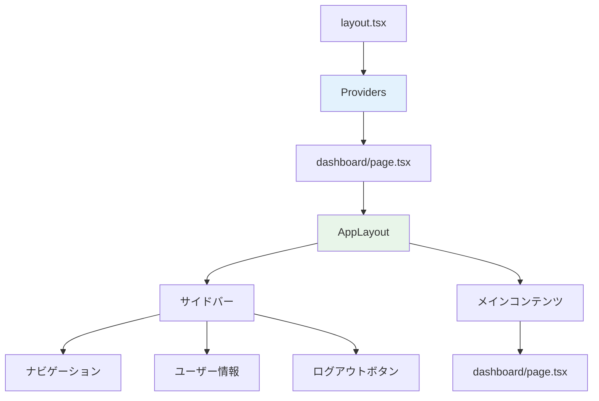
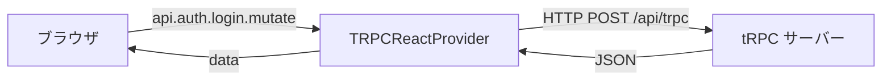
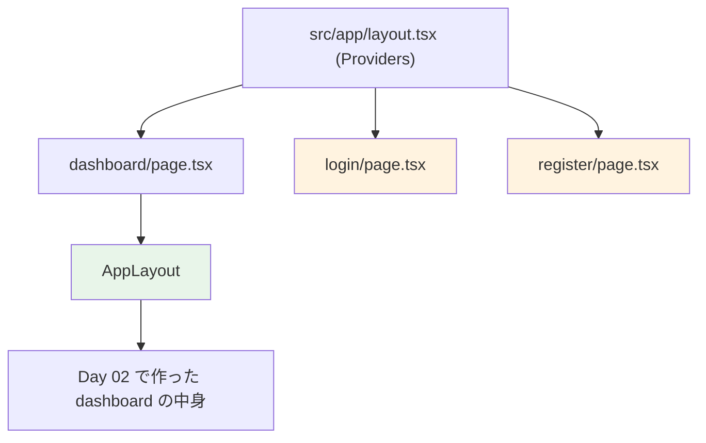

# Day 08: サイドバー付きのアプリレイアウトを作ろう


## 前回の振り返り

Day 07 で認証バックエンドを作りました。
ログイン・登録・ログアウトが全部動くようになりました。

でも今のアプリ、ログインした先に何もありません。
今日はサイドバーとヘッダーを自分の手で作って、
「アプリっぽい骨格」を完成させます。

---

## 今日のゴール

サイドバー付きのレイアウトを自分で作って、
ログイン後のすべてのページがこのレイアウトで表示されるようにします。

- [ ] `src/app/providers.tsx` — tRPC クライアントをアプリ全体に提供する
- [ ] `src/component/layout/app-layout.tsx` — サイドバー + メインコンテンツ
- [ ] `src/app/dashboard/page.tsx` — AppLayout の中で動くダッシュボード
- [ ] ログアウトが動作することを確認する

## なぜこれを作るのか

Day 07 のログイン API は動くけど、フロント側がまだ繋がっていません。
ブラウザから tRPC を呼ぶには、「tRPC クライアント」をアプリ全体に設定します。
そしてログイン後のページには共通のサイドバーとヘッダーが必要です。

> **例え話**: Day 07 で厨房（サーバー）を作りました。今日は客席のレイアウト（テーブル配置・通路・メニュー看板）を作ります。客が座ったときに「ちゃんとしたお店だな」と感じる骨格の部分です。

### 今日作る構造


```mermaid
flowchart TD
    A[layout.tsx] --> B[Providers]
    B --> C["dashboard/page.tsx"]
    C --> D[AppLayout]
    D --> E[サイドバー]
    D --> F[メインコンテンツ]
    E --> G[ナビゲーション]
    E --> H[ユーザー情報]
    E --> I[ログアウトボタン]
    F --> J[dashboard/page.tsx]

    style B fill:#e3f2fd
    style D fill:#e8f5e9
```

図は上から下へ、部品が別の部品を包む順番を表しています。いちばん外側の `layout.tsx` は全ページ共通の枠で、その内側に `Providers` を置くと、下にぶら下がるページ全部から tRPC を呼べます。さらに内側の `AppLayout` がサイドバーとメインコンテンツに分かれ、サイドバーの中にナビゲーション・ユーザー情報・ログアウトボタンが並びます。

包む順番は、そのまま「どこまで届くか」になります。仮に `Providers` をダッシュボードの内側だけに置くと、ログイン画面から tRPC を呼び出せません。

### やること / やらないこと

| やること | やらないこと |
|---------|-------------|
| tRPC クライアントを設定してフロントから API を呼べるようにする | tRPC サーバー側の追加（Day 07 済み） |
| サイドバー + レイアウトを自分の手で書く | モバイル対応の Sheet（Day 09 以降） |
| ログアウトを AlertDialog 付きで実装する | ユーザー編集機能 |

### 新しく学ぶ概念

| 概念 | 読み方 | 役割 | 例え |
|------|--------|------|------|
| Provider | プロバイダー | コンポーネントツリー全体に値を配る仕組み | 建物全体に電気を通す配電盤 |
| use client | ユーズクライアント | ブラウザ側で動くと宣言する | 「この部品はお客さんの手元で動きます」 |
| useQuery | ユーズクエリ | サーバーからデータを取得する React Hook | 注文票を厨房に出して結果を待つ |
| useMutation | ユーズミューテーション | サーバーのデータを変更する React Hook | 注文を厨房に送信する |

## 実装ステップ一覧

| ステップ | 作業内容 | 所要時間 | 作成ファイル |
|---------|---------|---------|-------------|
| Step 1 | providers.tsx を作る（tRPC + React Query） | 8分 | `src/app/providers.tsx` |
| Step 2 | ルートレイアウトに Provider を組み込む | 5分 | `src/app/layout.tsx` 編集 |
| Step 3 | AppLayout を作る（サイドバーの骨格） | 15分 | `src/component/layout/app-layout.tsx` |
| Step 4 | ダッシュボードに AppLayout を適用する | 5分 | `src/app/dashboard/page.tsx` |
| Step 5 | ログインして全体の動作を確認する | 5分 | なし |

**合計時間**: 約 38 分です。

---

### Step 1: providers.tsx を作る（tRPC クライアント設定・8分）

**ゴール**: フロントエンドから tRPC API を呼べるようにします。

Day 07 で作った tRPC サーバーを、ブラウザ側から呼ぶには
「クライアント」が必要です。scaffold が `src/trpc/` に設定ファイルを配布済みなので、
それをアプリ全体に適用する Provider を作ります。


```mermaid
flowchart LR
    A[ブラウザ] -->|api.auth.login.mutate| B[TRPCReactProvider]
    B -->|HTTP POST /api/trpc| C[tRPC サーバー]
    C -->|JSON| B
    B -->|data| A
```

矢印は、ボタンを押してから画面が変わるまでの一往復です。ブラウザ側では `api.auth.login.mutate` のような関数呼び出しを書くだけで、`TRPCReactProvider` がそれを `/api/trpc` への HTTP リクエストに変換して送ります。返ってきた JSON も同じ道を逆にたどり、型の付いた値としてブラウザに戻ります。

この Provider が無いと `api` は送り先を知らないため、呼んだ瞬間にエラーで止まります。

`src/app/providers.tsx` は Day 01 の scaffold が配布済みです。新しく作らず、開いて中身を確認します。

```tsx
// filepath: src/app/providers.tsx
'use client';

import { Toaster } from 'react-hot-toast';
import { TRPCReactProvider } from '@/trpc/react';

export function Providers({ children }: { children: React.ReactNode }) {
  return (
    <TRPCReactProvider>
      {children}
      <Toaster />
    </TRPCReactProvider>
  );
}
```

| コード | 意味 |
|--------|------|
| `'use client'` | この Provider はブラウザ側で動く |
| `TRPCReactProvider` | scaffold が用意した tRPC + React Query の設定 |
| `Toaster` | `toast()` で出す通知の表示場所。これが無いと通知は一切出ない |
| `children` | この下に置かれる全コンポーネントが tRPC を使える |

> scaffold の `src/trpc/react.tsx` の中身が気になったら開いてみてもいいです。QueryClient と httpBatchLink の設定が入っています。

**確認ポイント**:
- [ ] `src/app/providers.tsx` の中身を確認した
- [ ] `'use client'` が先頭にある
- [ ] `<Toaster />` が入っている

---

### Step 2: ルートレイアウトに Provider を組み込む（5分）

**ゴール**: アプリ全体で tRPC が使えるように、ルートレイアウトを編集します。

`src/app/layout.tsx` を開きます。こちらも scaffold が配布済みで、Provider はすでに組み込まれています。書き換えずに、どこで囲んでいるかを確認します。

```tsx
// filepath: src/app/layout.tsx
import type { Metadata } from 'next';
import { Inter, JetBrains_Mono, Noto_Sans_JP } from 'next/font/google';
import { Providers } from './providers';
import './globals.css';

const inter = Inter({
  subsets: ['latin'],
  variable: '--font-inter',
  display: 'swap',
});
```

同じ書き方で `JetBrains_Mono` を `--font-jetbrains-mono`、`Noto_Sans_JP` を `--font-noto-sans-jp` として読み込んでいます。続きは次のとおりです。

```tsx
// filepath: src/app/layout.tsx（続き）
export default function RootLayout({
  children,
}: {
  children: React.ReactNode;
}) {
  return (
    <html lang="ja" className={`${inter.variable} ${jetBrainsMono.variable} ${notoSansJP.variable}`}>
      <body>
        <Providers>{children}</Providers>
      </body>
    </html>
  );
}
```

| 確認する箇所 | 意味 |
|--------|------|
| `import { Providers }` | Step 1 で見た Provider を読み込む |
| `<Providers>{children}</Providers>` | 全ページを Provider で囲む |
| `className={...}` | フォントの変数を全ページへ渡す |

> `--font-inter` などの変数を定義しているのはこの `next/font` の行です。Day 01 で書いた `globals.css` がこの変数を参照しているので、消すとフォント指定が黙って効かなくなります。

> これでアプリのどこからでも `api.auth.login.useMutation()` のように tRPC を呼べます。

**確認ポイント**:
- [ ] `src/app/layout.tsx` に `<Providers>` が入っていることを確認した
- [ ] この時点で `npm run dev` してエラーが出ないことを確認

---

### Step 3: AppLayout を作る（サイドバーの骨格・15分）

**ゴール**: サイドバー + メインコンテンツのレイアウトコンポーネントを作ります。

ここが今日のメインです。認証チェック、ナビゲーション、ログアウトを 1 つのレイアウトに組み込みます。

```mermaid
flowchart TD
    A[AppLayout マウント] --> B{セッション取得中？}
    B -->|Yes| C[ローディング表示]
    B -->|No| D{ログイン済み？}
    D -->|No| E[/login にリダイレクト]
    D -->|Yes| F[サイドバー + コンテンツ表示]

    style C fill:#fff3e0
    style E fill:#ffebee
    style F fill:#e8f5e9
```

この分岐は、AppLayout が中身を描く前に必ず通る判定です。セッションの問い合わせが終わるまでは読み込み中の表示を出し、終わってからログイン済みかどうかを見ます。ログインしていなければ何も描かずに `/login` へ送るので、未ログインの人にサイドバーが一瞬でも見えることはありません。

この書き方は、問い合わせ自体が失敗したときも未ログインとして扱います。ログイン済みの人が通信の失敗でログイン画面へ送られることがある、ということです。実務では `error` も受け取り、失敗したときは再試行の案内を出してから判断します。

この判定をレイアウト側に置いたおかげで、この先に作るページは自分で認証を確認せずに済みます。

`src/component/layout/app-layout.tsx` を新規作成します。

#### 3-1. インポートと型定義

```tsx
// filepath: src/component/layout/app-layout.tsx
'use client';

import {
  FolderOpen,
  LayoutDashboard,
  ListTodo,
  LogOut,
} from 'lucide-react';
import Link from 'next/link';
import { usePathname, useRouter } from 'next/navigation';
import { useEffect, useState } from 'react';
import {
  AlertDialog,
  AlertDialogAction,
  AlertDialogCancel,
  AlertDialogContent,
  AlertDialogDescription,
  AlertDialogFooter,
  AlertDialogHeader,
  AlertDialogTitle,
  AlertDialogTrigger,
} from '@/component/ui/alert-dialog';
```

import は、このファイルで使う道具を先に並べる宣言です。`lucide-react` はサイドバーのアイコン、`Link` はページ移動、`usePathname` は今いるページの URL を取る道具で、現在のメニューを目立たせるときに使います。`useState` は画面の状態を覚えておく仕組みです。`useEffect`（画面が表示された後など、決まったタイミングで処理を走らせる React の仕組み）は、あとで「ブラウザ側の準備が終わったか」を記録するときに使います。

`AlertDialog` で始まる 9 個は、ログアウト前の確認ダイアログを組み立てる部品一式です。shadcn/ui のダイアログは 1 つの部品ではなく、枠・見出し・本文・ボタンに分かれています。だから使う分だけ名前を並べて取り込みます。1 つでも取り込み漏れがあると、その名前を書いた行で「定義されていない」というエラーが出ます。

**確認ポイント**:
- [ ] ログアウト確認に使う `AlertDialog` 一式を import している

```tsx
// filepath: src/component/layout/app-layout.tsx（続き）
import { Button } from '@/component/ui/button';
import { cn } from '@/lib/utils';
import { api } from '@/trpc/react';
```

**確認ポイント**:
- [ ] ログアウト用の `AlertDialog` を import している
- [ ] tRPC 用の `api` を import している

```tsx
// filepath: src/component/layout/app-layout.tsx（続き）
interface MenuItem {
  text: string;
  icon: React.ReactNode;
  path: string;
}

const menuItems: MenuItem[] = [
  {
    text: 'ダッシュボード',
    icon: <LayoutDashboard className="h-5 w-5" />,
    path: '/dashboard',
  },
  {
    text: 'プロジェクト',
    icon: <FolderOpen className="h-5 w-5" />,
    path: '/project',
  },
  {
    text: 'マイタスク',
    icon: <ListTodo className="h-5 w-5" />,
    path: '/my-task',
  },
];
```

| コード | 意味 |
|--------|------|
| `'use client'` | ユーザー操作（ナビゲーション、ログアウト）があるので Client Component |
| `lucide-react` | アイコンライブラリ（scaffold でインストール済み） |
| `AlertDialog` | ログアウト前の確認ダイアログ（scaffold の UI コンポーネント） |
| `menuItems` | サイドバーに表示するメニュー項目の定義 |

#### 3-2. コンポーネント本体（認証チェック + ログアウト）

```tsx
// filepath: src/component/layout/app-layout.tsx（続き）
export function AppLayout({
  children,
}: {
  children: React.ReactNode;
}) {
  const [hasMounted, setHasMounted] = useState(false);
  const pathname = usePathname();
  const router = useRouter();

  const { data: session, isLoading } =
    api.auth.getSession.useQuery();

  const logoutMutation = api.auth.logout.useMutation({
    onSuccess: () => {
      router.push('/login');
      router.refresh();
    },
  });
```

**確認ポイント**:
- [ ] `getSession` でログイン状態を取得している
- [ ] ログアウト成功後に `/login` へ戻している

```tsx
// filepath: src/component/layout/app-layout.tsx（続き）
  useEffect(() => {
    setHasMounted(true);
  }, []);

  useEffect(() => {
    if (hasMounted && !isLoading && !session) {
      router.push('/login');
    }
  }, [hasMounted, isLoading, session, router]);

  if (!hasMounted || isLoading) {
    return (
      <div className="flex h-screen items-center justify-center">
        <p className="text-muted-foreground">読み込み中...</p>
      </div>
    );
  }

  if (!session?.user) {
    return null;
  }
```

| コード | 意味 | 例え |
|--------|------|------|
| `hasMounted` | SSR（サーバー側で先に HTML を組み立てる仕組み）と CSR（ブラウザ側で後から HTML を組み立てる仕組み）のズレ防止フラグ | 店が開店してから初めて客チェックする |
| `api.auth.getSession.useQuery()` | サーバーに「今ログインしているか」を問い合わせる | 入口でリストバンドチェック |
| `logoutMutation` | ログアウト API を呼ぶ準備 | 退出手続きのボタン |
| `router.push('/login')` | ログイン画面へ飛ばす | 受付に案内する |

> `hasMounted` が必要な理由: Next.js はサーバーで HTML を生成してからブラウザに送ります（SSR）。session Cookie には Day 07 で `httpOnly` を付けたので、ブラウザ側の JavaScript からは中身を読めません。ログイン状態を知る道は、`api.auth.getSession.useQuery()` でサーバーに聞くことだけです。このとき Cookie はリクエストへ自動で付いて飛び、中身を開いて誰なのかを判定するのはサーバー側です。答えが返ってくるのは画面が出たあとなので、このフラグで「ブラウザ側の準備ができてから判定する」ようにして、チラつきを防ぎます。

#### 3-3. レイアウト JSX（サイドバー + コンテンツ）

```tsx
// filepath: src/component/layout/app-layout.tsx（続き）
  return (
    <div className="flex h-screen bg-background">
      {/* サイドバー */}
      <aside className="hidden w-64 flex-col border-r bg-sidebar md:flex">
        {/* ロゴ */}
        <div className="border-b border-sidebar-border p-4">
          <h1 className="text-lg font-bold text-sidebar-foreground">
            Task App
          </h1>
        </div>
```

**確認ポイント**:
- [ ] 左側にサイドバーを作っている
- [ ] ロゴとして `Task App` を表示している

```tsx
// filepath: src/component/layout/app-layout.tsx（続き）
        {/* ナビゲーション */}
        <nav className="flex-1 p-3">
          <ul className="space-y-1">
            {menuItems.map((item) => (
              <li key={item.path}>
                <Link
                  href={item.path}
                  className={cn(
                    'flex items-center gap-3 rounded-md px-3 py-2 text-sm transition-colors',
                    pathname === item.path
                      ? 'bg-sidebar-accent text-sidebar-accent-foreground font-medium'
                      : 'text-sidebar-foreground/70 hover:bg-sidebar-accent/50 hover:text-sidebar-foreground',
                  )}
                >
                  {item.icon}
                  {item.text}
                </Link>
              </li>
            ))}
          </ul>
        </nav>
```

**確認ポイント**:
- [ ] `menuItems.map` でメニューを表示している
- [ ] 現在ページは背景色で強調している

```tsx
// filepath: src/component/layout/app-layout.tsx（続き）
        {/* ユーザー情報 + ログアウト */}
        <div className="border-t border-sidebar-border p-4">
          <div className="mb-3 flex items-center gap-3">
            <div className="flex h-9 w-9 items-center justify-center rounded-full bg-sidebar-accent text-sm font-medium text-sidebar-accent-foreground">
              {session.user.name?.[0] || 'U'}
            </div>
            <div className="flex flex-col">
              <span className="text-sm font-medium text-sidebar-foreground">
                {session.user.name}
              </span>
              <span className="text-xs text-sidebar-foreground/60">
                {session.user.role === 'ADMIN'
                  ? '管理者'
                  : 'ユーザー'}
              </span>
            </div>
          </div>
```

ここはサイドバーの下に、今ログインしている人の情報を出す部分です。`session.user.name?.[0]` は名前の 1 文字目だけを取り出し、丸いアイコンの中に入れます。`?.` は途中の値が無ければそこで止めて `undefined` を返す書き方で、名前が未設定でも画面が落ちません。取り出せなかったときは `|| 'U'` が働き、丸の中は `U` になります。

この `session` は 3-2 で書いた `getSession` の結果なので、ログインした本人の名前と権限がそのまま出ます。別のユーザーでログインし直せば、ここの表示も入れ替わります。

**確認ポイント**:
- [ ] サイドバー下部にユーザー名と権限を表示している

```tsx
// filepath: src/component/layout/app-layout.tsx（続き）
          {/* ログアウトボタン（確認ダイアログ付き） */}
          <AlertDialog>
            <AlertDialogTrigger asChild>
              <Button
                variant="outline"
                size="sm"
                className="w-full gap-2 border-sidebar-border text-sidebar-foreground/80 hover:bg-sidebar-accent hover:text-sidebar-foreground"
              >
                <LogOut className="h-4 w-4" />
                ログアウト
              </Button>
            </AlertDialogTrigger>
```

`AlertDialogTrigger` は、ダイアログを開くきっかけになる部品です。`asChild` を付けると、この部品は自分でボタンを描かず、中に置いた `<Button>` へきっかけ役だけを渡します。付け忘れるとボタンが二重に描かれ、サイドバーの見た目が崩れます。

ログアウトをすぐ実行せずダイアログを挟むのは、押し間違いで作業中の画面から追い出されるのを防ぐためです。Day 07 で作ったログアウトは、呼べばその場でセッションが消えます。取り消せない操作の手前に一段置く、という考え方はこの先の削除機能でも同じです。

**確認ポイント**:
- [ ] ボタンを押すと確認ダイアログが開く

```tsx
// filepath: src/component/layout/app-layout.tsx（続き）
            <AlertDialogContent>
              <AlertDialogHeader>
                <AlertDialogTitle>
                  ログアウトしますか？
                </AlertDialogTitle>
                <AlertDialogDescription>
                  ログアウトすると、再度ログインが必要になります。
                </AlertDialogDescription>
              </AlertDialogHeader>
              <AlertDialogFooter>
                <AlertDialogCancel>キャンセル</AlertDialogCancel>
                <AlertDialogAction
                  onClick={() => logoutMutation.mutate()}
                >
                  ログアウト
                </AlertDialogAction>
              </AlertDialogFooter>
            </AlertDialogContent>
          </AlertDialog>
        </div>
      </aside>
```

ダイアログの中身は、見出し・説明・下部のボタンという 3 つの区画に分かれています。`AlertDialogCancel` は何もせずに閉じるだけの出口です。`AlertDialogAction` を押したときだけ `logoutMutation.mutate()` が走ります。

`mutate()` を呼ぶとサーバーのログアウト手続きが動き、成功したら 3-2 で書いた `onSuccess` が `/login` へ戻します。`onClick` を `AlertDialogCancel` の側に書いてしまうと、キャンセルのつもりでログアウトする画面になります。押した先で何が起きるかは、この 2 行のどちらに `onClick` を置くかで決まります。

**確認ポイント**:
- [ ] ログアウト前に確認ダイアログを表示している

```tsx
// filepath: src/component/layout/app-layout.tsx（続き）

      {/* メインコンテンツ */}
      <main className="flex-1 overflow-y-auto p-6">
        {children}
      </main>
    </div>
  );
}
```

**AlertDialog の構造**:

| パーツ | 役割 |
|--------|------|
| `AlertDialogTrigger` | ダイアログを開くボタン |
| `AlertDialogContent` | ダイアログの中身 |
| `AlertDialogAction` | 確定（ログアウト実行） |
| `AlertDialogCancel` | キャンセル（閉じるだけ） |

> `asChild` を付けると、中の `<Button>` がそのままトリガーになります。見た目を自由にカスタマイズできます。

**確認ポイント**:
- [ ] `src/component/layout/app-layout.tsx` が作成できた
- [ ] `'use client'` が先頭にある
- [ ] `menuItems` に 3 つのメニュー項目がある
- [ ] ログアウトボタンに `AlertDialog` が付いている

**学んだこと**: `useQuery` でサーバーのセッション情報を取得し、無ければログイン画面へ送ります。レイアウト全体が認証ゲートの役割を持ちます。

---

### Step 4: ダッシュボードに AppLayout を適用する（5分）

**ゴール**: Day 02 で作ったダッシュボードを、サイドバー付きの AppLayout で囲みます。

Day 09 以降も、各ページを同じ方法で AppLayout の中へ入れます。
ファイルは移動せず、`src/app/dashboard/page.tsx` をそのまま編集します。


```mermaid
flowchart TD
    A["src/app/layout.tsx (Providers)"] --> B["dashboard/page.tsx"]
    A --> C["login/page.tsx"]
    A --> D["register/page.tsx"]
    B --> E["AppLayout"]
    E --> F["Day 02 で作った dashboard の中身"]

    style E fill:#e8f5e9
    style C fill:#fff3e0
    style D fill:#fff3e0
```

図の左端 `src/app/layout.tsx` はすべてのページの親なので、ログイン画面と登録画面もここを通ります。一方 `AppLayout` はダッシュボードの内側にだけ置きます。サイドバーを出したい画面と出したくない画面は、この置き場所だけで分かれます。

ページを増やすときも同じで、サイドバーが要るページだけ `AppLayout` で囲みます。ログイン画面を囲んでしまうと、ログインしていない人が認証チェックに引っかかり、ログイン画面から `/login` へ送られ続けます。

`src/app/dashboard/page.tsx` の import に AppLayout を追加します。

```tsx
// filepath: src/app/dashboard/page.tsx（import に追加）
import { AppLayout } from '@/component/layout/app-layout';
```

次に、Day 02 で作った外側の `<main>...</main>` を
`<div>...</div>` に変え、その全体を
`<AppLayout>...</AppLayout>` で囲みます。
AppLayout 側が `<main>` を持つため、内側は `<div>`
にして重複を避けます。中身は消さず、そのまま残してください。

```tsx
// filepath: src/app/dashboard/page.tsx（return の外側を変更）
  return (
    <AppLayout>
      <div className="min-h-screen bg-background text-foreground">
        {/* Day 02 で作った内容は、そのままここに残す */}
      </div>
    </AppLayout>
  );
```

AppLayout がサイドバーと認証チェックを担当し、
内側の `<main>` は Day 02 のダッシュボード表示を担当します。
ログイン画面と登録画面は AppLayout で囲まないため、
認証前でもサイドバーなしで表示されます。

**確認ポイント**:
- [ ] `src/app/dashboard/page.tsx` に AppLayout の import がある
- [ ] `return` の外側が `<AppLayout>...</AppLayout>` で囲まれている
- [ ] Day 02 の外側の `<main>` を `<div>` に変え、中身が残っている

---

### Step 5: ログインして全体の動作を確認する（5分）

**ゴール**: ここまでの全 Step が正しく連携して動くことを確認します。

```bash
npm run dev
```

ブラウザで `http://localhost:3000` を開きます。


**確認フロー**:

1. `/dashboard` へアクセス → middleware が `/login` にリダイレクト。
2. `admin@example.com` / `password123` でログイン。
3. ダッシュボードが表示される（サイドバー付き）。


4. サイドバーに「ダッシュボード」「プロジェクト」「マイタスク」の3つのメニューが見える。
5. サイドバー下部に「管理者」の名前とロールが表示される。
6. 「ログアウト」ボタンを押す → 確認ダイアログが出る。
7. 「ログアウト」を押す → `/login` に戻る。

**確認ポイント**:
- [ ] `npm run dev` でエラーが出ない
- [ ] サイドバーが左側に表示される
- [ ] ユーザー名「管理者」とロール「管理者」が見える
- [ ] ナビゲーションのアクティブ状態が正しい（現在のページがハイライト）
- [ ] ログアウト → 確認ダイアログ → ログイン画面に戻る

> **うまくいかないとき**: 「つまずきポイント」セクションを確認してください。

---

## Pro パターンで書こう（`use client` の影響範囲を最小化する）

Step 3 では AppLayout 全体を `'use client'` にしました。
これは今日のスコープでは正しい書き方ですが、次のステップでさらに改善できます。

### Before（今日書いたコード・動くけど改善の余地あり）

```tsx
// app-layout.tsx 全体が 'use client'
// → ナビゲーションリンク（静的）まで Client Component になる
```

今日書いた `app-layout.tsx` は先頭に `'use client'` を置いたので、このファイルの中身はまとめてブラウザへ送られます。ロゴやリンク一覧のように押しても何も起きない部分まで一緒に送られるため、その分だけ読み込むファイルが増えます。動きは正しく、最初に書く形としてはこれで問題ありません。

### After（プロが書くコード）

```tsx
// app-layout.tsx から 'use client' を外す（Server Component に）
// ログアウトボタンだけ別ファイルに分離して 'use client'
```

**強み**: 静的な枠（ロゴ、リンク一覧）は Server Component のまま残せます。
対話が必要な部品（ログアウト、認証チェック）だけを Client Component にします。
→ ブラウザへ送るコードが減り、初期表示が速くなります。

> **覚えておきたいエッセンス**: `use client` はファイル全体に効くスイッチです。サイドバーでは「静的な枠は Server、押せる部品は Client」に分けるのがプロの基本です。今日の段階では全体を Client のままにしておいて問題ありません。この最適化は Day 09 以降で必要になったタイミングで取り組みます。

---

## 今日のまとめ

- [ ] `src/app/providers.tsx` — tRPC Provider を作った
- [ ] `src/app/layout.tsx` — Provider を組み込んだ
- [ ] `src/component/layout/app-layout.tsx` — サイドバー付きレイアウトを作った
- [ ] `src/app/dashboard/page.tsx` — AppLayout で囲んだ
- [ ] ログイン → サイドバー表示 → ログアウトの一連の流れを確認した

## つまずきポイント

| エラー/問題 | 原因 | 解決方法 |
|------------|------|---------|
| `api is not defined` | `@/trpc/react` からの import 漏れ | `import { api } from '@/trpc/react'` を確認 |
| `Cannot find module '@/component/ui/alert-dialog'` | UI コンポーネント未配置 | scaffold の `_ui-components/` が `src/component/ui/` にあるか確認 |
| サイドバーが表示されない | `dashboard/page.tsx` を `AppLayout` で囲んでいない | Step 4 の import と return を確認 |
| ログイン後に白い画面 | `providers.tsx` が `layout.tsx` に組み込まれていない | Step 2 を確認 |
| `useQuery` でエラー | tRPC サーバー側が動いていない | Day 07 の `src/server/api/root.ts` が存在するか確認 |
| ログアウトしてもリダイレクトされない | `router.refresh()` の呼び忘れ | `onSuccess` 内に `router.push('/login'); router.refresh();` |

## 次回予告

Day 09 では、プロジェクト一覧画面を作ります。
tRPC の `useQuery` でサーバーからプロジェクト一覧を取得して、
カードコンポーネントで表示します。
今日作ったレイアウトの中に、最初の「データを表示する画面」が入ります。
