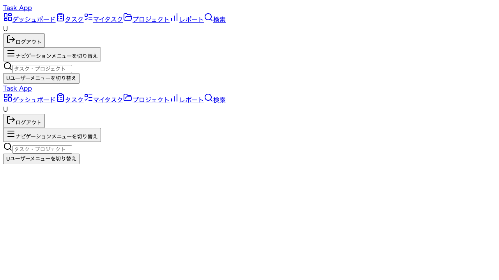
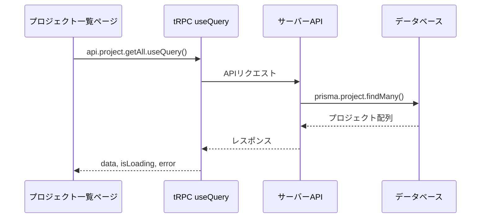
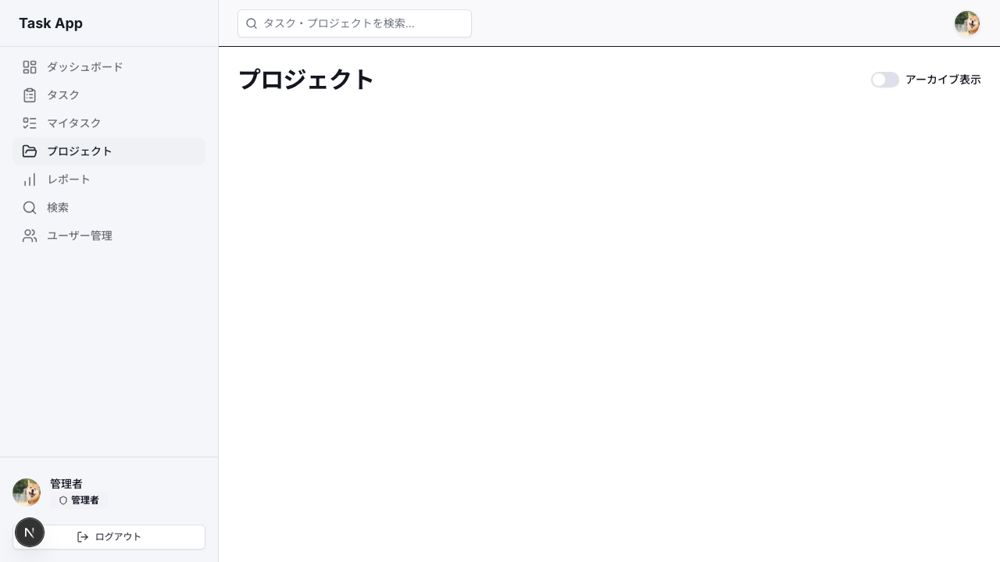
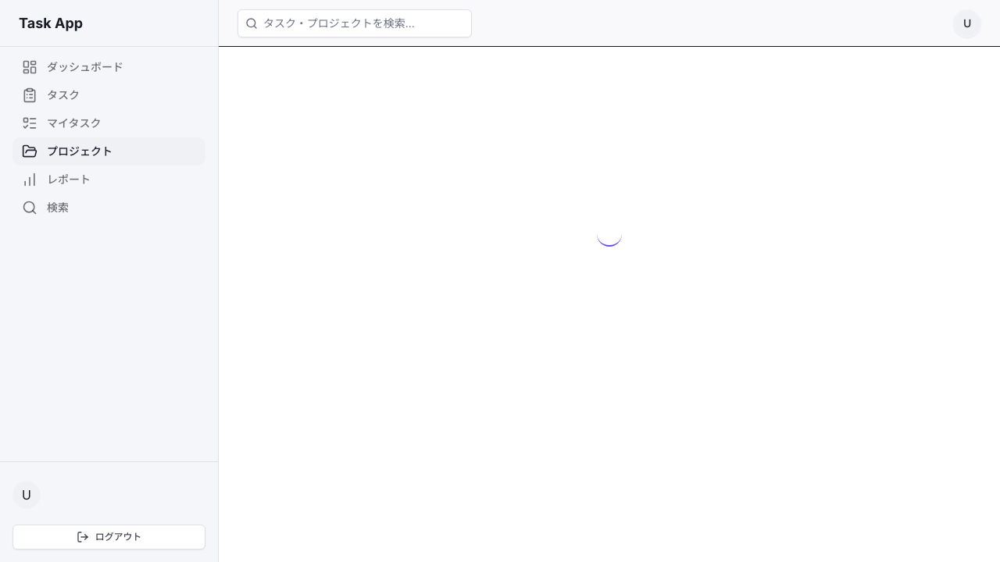
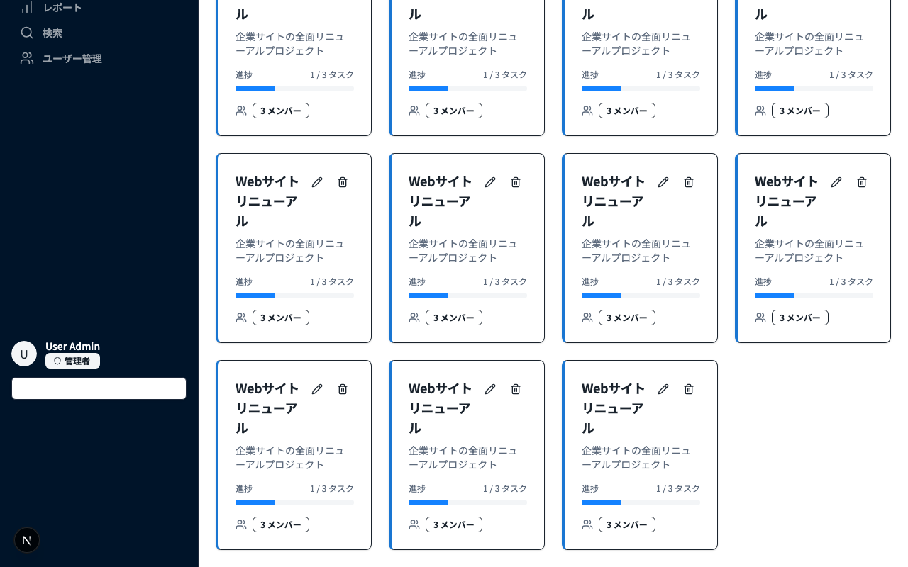
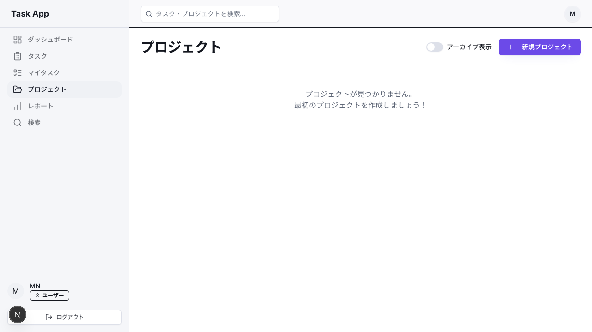
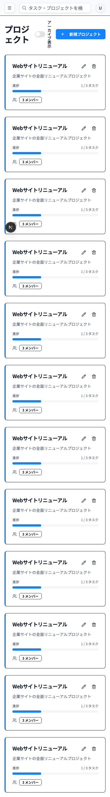

# Day 09: プロジェクト一覧画面を作ろう

## 前回の振り返り

Day 08 ではサイドバーにユーザー情報ウィジェットとログアウト確認ダイアログを実装し、認証ガードによる未ログイン時のリダイレクトも体験しました。認証まわりが完成したので、今日からアプリの中核機能であるプロジェクト管理に取り組みます。

---

## 今日のゴール

tRPC の `useQuery` を使ってサーバーからプロジェクトデータを取得し、カード形式で一覧表示します。グリッドレイアウトでレスポンシブ対応も実装します。

スクリーンショット: 完成イメージ（プロジェクト一覧画面）



## なぜこれを作るのか？

このアプリでは、タスクもメンバーも「プロジェクト」にぶら下がります。だから中身づくりの最初は、プロジェクトを一覧で見渡せて、そこから各プロジェクトへ入っていける入口を用意します。

> **例え話**: プロジェクト一覧は「本棚」です。本棚に並んだ本（プロジェクト）を一目で見渡し、1冊ずつ手に取って詳細を確認できます。まずは本棚を作りましょう。

### データ取得の流れ



### やること / やらないこと

| やること | やらないこと |
|---------|-------------|
| `useQuery` でデータ取得 | データの作成・編集（Day 10-11） |
| グリッドレイアウトで一覧表示 | 詳細ページの実装 |
| ローディング・エラー表示 | メンバー管理（Day 12） |
| ProjectCard コンポーネントの表示 | カードのデザインをゼロから作る |

### 今日触るファイル

```
src/
├── app/
│   └── project/
│       └── page.tsx          ← メイン（既存ファイルを編集）
├── component/
│   ├── project/
│   │   └── project-card.tsx  ← 今日の表示で使うカード
│   ├── layout/
│   │   └── app-layout.tsx    ← 既存（利用する）
│   └── ui/
│       └── loading-spinner.tsx ← 既存（利用する）
└── lib/
    └── constant/
        └── status.ts         ← 既存（利用する）
```

> 今日は `src/app/project/page.tsx` を **ゼロから書いていく** 方式で進めます。既にファイルがある場合は一旦中身を空にして、ステップごとにコピペしてください。

### 新しく学ぶ概念

| 概念 | 読み方 | 役割 | 例え |
|------|--------|------|------|
| useQuery | ユーズ・クエリ | サーバーからデータを取得するフック | 図書館の検索端末。リクエストすると結果が返ってくる |
| グリッドレイアウト | — | 要素を格子状に並べるCSS | 本棚の棚板。横に何冊並べるかを画面幅で変える |
| Suspense | サスペンス | コンポーネントの準備が終わるまで代わりの画面を表示するReactの仕組み | レストランの「ただいま準備中」の看板 |

### Suspenseの役割を理解する

| 用語 | 何をするか | 今日の使い方 |
|------|-----------|-------------|
| `Suspense` | 子コンポーネントが準備完了するまで `fallback` を表示する | ページ全体のローディングガード |
| `fallback` | 準備中に表示するUI | `<PageLoadingSpinner />` |
| `PageLoadingSpinner` | スピナー付きのローディング表示 | `Suspense` の `fallback` や `isLoading` 時に使う |

## 実装ステップ一覧

| ステップ | 作業内容 | 所要時間 |
|---------|---------|---------|
| Step 1 | ページの骨組みを作る | 3分 |
| Step 2 | tRPCでデータを取得する | 5分 |
| Step 3 | ローディング表示を作る | 3分 |
| Step 4 | カード表示用のimportを追加する | 3分 |
| Step 5 | イベントハンドラーを準備する | 4分 |
| Step 6 | プロジェクトカードをグリッド表示する | 5分 |
| Step 7 | 空状態のメッセージを追加する | 3分 |
| Step 8 | ヘッダーにボタンとスイッチを追加する | 5分 |
| Step 9 | ページ全体を組み立てる | 5分 |
| Step 10 | 動作確認 | 3分 |

**合計時間**: 約39分

---

### Step 0: プロジェクト API を有効化する（2分）

**ゴール**: project ルーターを root.ts に登録して、API を使えるようにします。

Day 07 で認証 API を登録したのと同じ形で、
プロジェクト用 API も `root.ts` に登録します。
`src/server/api/routers/project.ts` は、この Day から
プロジェクト管理の API として使うファイルです。

**編集**:

```typescript
// filepath: src/server/api/root.ts
import { authRouter } from './routers/auth';
import { projectRouter } from './routers/project';
import { createCallerFactory, createTRPCRouter } from './trpc';

export const appRouter = createTRPCRouter({
  auth: authRouter,
  project: projectRouter,
});

export type AppRouter = typeof appRouter;

export const createCaller = createCallerFactory(appRouter);
```

**確認ポイント**:
- [ ] `projectRouter` の import を追加した
- [ ] `appRouter` に `project: projectRouter` を追加した

> `project.ts` は Day 07 で学んだ
> `protectedProcedure` と `prisma` の延長にあります。
> API を増やすときは、まず router を登録してから
> 画面側の `useQuery` をつなぐ順番にすると迷いにくいです。

---

### Step 1 : ページの骨組みを作る（3分）

**ゴール**: プロジェクト一覧ページの基本構造を作ります。

**実装**:

`src/app/project/page.tsx` を開き、以下の内容に置き換えてください。

```typescript
// filepath: src/app/project/page.tsx
'use client';

import { Suspense } from 'react';
import { AppLayout }
  from '@/component/layout/app-layout';
import { PageLoadingSpinner }
  from '@/component/ui/loading-spinner';
```

**確認ポイント**:
- ファイルを保存した
- `'use client'` がファイル先頭にある

続けて、同じファイルの末尾に以下を追加します。

```typescript
// filepath: src/app/project/page.tsx
function ProjectPageContent() {
  return (
    <AppLayout>
      <div className="flex flex-col gap-6">
        <h1 className="text-3xl font-bold
          tracking-tight">
          プロジェクト
        </h1>
      </div>
    </AppLayout>
  );
}
```

**確認ポイント**:
- `AppLayout` でページ全体を囲んでいる

最後に、ページのエクスポートを追加します。

```typescript
// filepath: src/app/project/page.tsx
export default function ProjectPage() {
  return (
    <Suspense
      fallback={<PageLoadingSpinner />}>
      <ProjectPageContent />
    </Suspense>
  );
}
```

**確認ポイント**:
- `npm run dev` でエラーが出ていない
- ブラウザで `/project` にアクセスして「プロジェクト」と表示される
- サイドバーが表示されている

スクリーンショット: 「プロジェクト」タイトルだけが表示された初期画面



> `Suspense` は子コンポーネント（`ProjectPageContent`）が準備完了するまで、代わりに `fallback` に指定した `PageLoadingSpinner` を表示します。ローディング中はスピナーが表示され、準備が完了すると `ProjectPageContent`（`AppLayout` でラップされた本体）が表示されます。

---

### Step 2 : tRPCでデータを取得する（5分）

**ゴール**: `useQuery` でプロジェクト一覧をサーバーから取得します。

**実装**:

`src/app/project/page.tsx` の import 群に以下を追加します。

```typescript
// filepath: src/app/project/page.tsx
// import群に追加（ファイル先頭のimportの後ろ）
import { api } from '@/trpc/react';
import { useState } from 'react';
```

**確認ポイント**:
- ファイルを保存した
- `npm run dev` でエラーが出ていない

`ProjectPageContent` 関数の先頭（`return` の前）に以下を追加します。

```typescript
// filepath: src/app/project/page.tsx
// ProjectPageContent内、returnの前に追加
const [showArchived, setShowArchived] =
  useState(false);

const {
  data: projects,
  isLoading: projectsLoading,
} = api.project.getAll.useQuery({
  isArchived: showArchived,
});
```

**確認ポイント**:
- `npm run dev` でエラーが出ていない
- ブラウザの開発者ツール → コンソールにエラーが出ていない

#### useQueryの返り値

| 返り値 | 説明 |
|--------|------|
| `data` | 取得したデータ（読み込み前は`undefined`） |
| `isLoading` | 初回読み込み中かどうか |
| `error` | tRPCのエラー情報（正常時は`null`） |
| `isRefetching` | 再取得中かどうか |

> `useQuery` はページ表示時に自動でAPIを呼びます。手動で `fetch` を書く必要はありません。

---

### Step 3 : ローディング表示を作る（3分）

**ゴール**: データ読み込み中にスピナーを表示します。

**実装**:

`ProjectPageContent` 内の `return` の直前に追加します。

```typescript
// filepath: src/app/project/page.tsx
// ProjectPageContent内、returnの前に追加
if (projectsLoading) {
  return <PageLoadingSpinner />;
}
```

**確認ポイント**:
- ファイルを保存した
- `npm run dev` でエラーが出ていない
- ページ読み込み時にスピナーが一瞬表示される

スクリーンショット: ローディングスピナーの表示



> ここでの `<PageLoadingSpinner />` は `ProjectPageContent` の内側で使うため、`AppLayout` の中で呼ばれます。`AppLayout` のラップはこの `if` ブロックの外側（`return` の中）で行うので、スピナーを `AppLayout` で二重に囲む必要はありません。

---

### Step 4 : カード表示用のimportを追加する（3分）

**ゴール**: プロジェクトカードと定数のimportを追加します。

**実装**:

`src/app/project/page.tsx` の import 群に以下を追加します。

```typescript
// filepath: src/app/project/page.tsx
// import群に追加
import { ProjectCard }
  from '@/component/project/project-card';
import { TASK_STATUS }
  from '@/lib/constant/status';
```

**確認ポイント**:
- ファイルを保存した
- `npm run dev` でエラーが出ていない

#### ProjectCardのprops

| prop | 型 | 説明 |
|------|-----|------|
| `id` | `string` | プロジェクトID |
| `name` | `string` | プロジェクト名 |
| `description` | `string \| null` | 説明文（任意） |
| `color` | `string` | カラーコード（例: `#1976d2`） |
| `memberCount` | `number` | メンバー数 |
| `taskStats` | `{total, done}` | タスク進捗 |
| `onEdit` | `(id: string) => void` | 編集ボタンクリック時 |
| `onDelete` | `(id: string) => void` | 削除ボタンクリック時 |
| `onClick` | `(id: string) => void` | カードクリック時 |
| `isArchived` | `boolean` | アーカイブ済みか |

---

### Step 5 : イベントハンドラーを準備する（4分）

**ゴール**: カードのボタンに渡すハンドラー関数を準備します。

**実装**:

`ProjectPageContent` 内、`if (projectsLoading)` の前に追加します。

```typescript
// filepath: src/app/project/page.tsx
// ProjectPageContent内に追加
const handleEdit = (projectId: string) => {
  void projectId;
};
const handleDelete = (projectId: string) => {
  void projectId;
};
const handleProjectClick = (id: string) => {
  void id;
};
```

**確認ポイント**:
- ファイルを保存した
- `npm run dev` でエラーが出ていない
- 型エラーが出ていない

> **仮実装について**: `handleEdit` / `handleDelete` / `handleProjectClick` は今の時点では何もしません。Day 10 で編集ダイアログ、Day 11 で削除確認、Day 12 で詳細画面遷移を実装するので、今日はカードに渡すための「受け皿」だけ作っておきます。ボタンをクリックしても今は何も起きませんが、それで正常です。

> `void projectId` は「この引数を意図的に使わない」ことをTypeScriptに伝える書き方です。`_` プレフィックスの代わりに使えるテクニックです。

---

### Step 6 : プロジェクトカードをグリッド表示する（5分）

**ゴール**: プロジェクトをカード形式でグリッド表示します。

**実装**:

`ProjectPageContent` の `return` 内にある `<h1>` タグの後に、以下のグリッド表示を追加します。これは完成形のコードブロックです。

```typescript
// filepath: src/app/project/page.tsx
// return内、</h1>の後にグリッド開始
<div className="grid gap-6 sm:grid-cols-2
  lg:grid-cols-3 xl:grid-cols-4">
  {projects?.map((project) => {
    const taskCount =
      project.tasks?.length ?? 0;
    const doneCount =
      project.tasks?.filter(
        (t) => t.status ===
          TASK_STATUS.DONE
      ).length ?? 0;
```

**確認ポイント**:
- グリッドの開始タグとmap処理を追加した

map の中で `ProjectCard` を返します。上のコードブロックの続きです。

```typescript
// filepath: src/app/project/page.tsx
// map内のreturn（上の続き）
    return (
      <ProjectCard
        key={project.id}
        id={project.id}
        name={project.name}
        description={project.description}
        color={project.color}
        memberCount={
          project.members?.length ?? 0}
        taskStats={{
          total: taskCount,
          done: doneCount,
        }}
        onEdit={handleEdit}
        onDelete={handleDelete}
        onClick={handleProjectClick}
        isArchived={project.isArchived}
      />
    );
  })}
</div>
```

**確認ポイント**:
- ファイルを保存した
- `npm run dev` でエラーが出ていない
- プロジェクトがカード形式で表示されている

スクリーンショット: プロジェクトカードのグリッド表示



> `'DONE'` のような文字列リテラルではなく `TASK_STATUS.DONE` 定数を使います。定数を使うとタイプミスを防げて、値が変わっても一箇所直すだけで済みます。

#### グリッドの画面幅別列数

| 画面幅 | クラス | 列数 |
|--------|-------|------|
| スマホ（~640px） | デフォルト（`grid-cols-1`） | 1列 |
| タブレット（640px~） | `sm:grid-cols-2` | 2列 |
| PC（1024px~） | `lg:grid-cols-3` | 3列 |
| ワイド（1280px~） | `xl:grid-cols-4` | 4列 |

---

### Step 7 : 空状態のメッセージを追加する（3分）

**ゴール**: プロジェクトが0件の場合にメッセージを表示します。

**実装**:

Step 6 で追加したグリッドの `<div>` 内を修正します。`{projects?.map(...)}` の部分を三項演算子に書き換えます。

Step 6 のmap部分を三項演算子で囲みます。`projects.map((project) => { ... })` の**前後**にコードを追加します。

```typescript
// filepath: src/app/project/page.tsx
// グリッドdiv内を修正（mapの前に条件分岐追加）
{projects && projects.length > 0 ? (
  projects.map((project) => {
    const taskCount =
      project.tasks?.length ?? 0;
    const doneCount =
      project.tasks?.filter(
        (t) => t.status === TASK_STATUS.DONE
      ).length ?? 0;
    return (
      <ProjectCard
        key={project.id}
        id={project.id}
        name={project.name}
```

```typescript
// filepath: src/app/project/page.tsx
// ProjectCard の続き（props後半）
        description={project.description}
        color={project.color}
        memberCount={
          project.members?.length ?? 0}
        taskStats={{
          total: taskCount,
          done: doneCount,
        }}
        onEdit={handleEdit}
        onDelete={handleDelete}
        onClick={handleProjectClick}
        isArchived={project.isArchived}
      />
    );
  })
```

```typescript
// filepath: src/app/project/page.tsx
// 三項演算子の else 側（空状態メッセージ）
) : (
  <div className="col-span-full flex
    flex-col items-center justify-center
    py-12 text-center
    text-muted-foreground">
    <p>プロジェクトが
      見つかりません。</p>
    <p>最初のプロジェクトを
      作成しましょう！</p>
  </div>
)}
```

**確認ポイント**:
- ファイルを保存した
- プロジェクトが0件のときメッセージが表示される

スクリーンショット: 空状態の表示



> `col-span-full` はグリッドの全列にまたがって表示するクラスです。これがないとメッセージが1列分の幅にしか表示されません。

---

### Step 8 : ヘッダーにボタンとスイッチを追加する（5分）

**ゴール**: 新規作成ボタンとアーカイブ表示スイッチを追加します。

**実装**:

import 群に以下を追加します。

```typescript
// filepath: src/app/project/page.tsx
// import群に追加
import { Button }
  from '@/component/ui/button';
import { Switch }
  from '@/component/ui/switch';
import { Label }
  from '@/component/ui/label';
import { Plus } from 'lucide-react';
```

**確認ポイント**:
- ファイルを保存した
- `npm run dev` でエラーが出ていない

`ProjectPageContent` 内にダイアログ用stateとハンドラーを追加します。

```typescript
// filepath: src/app/project/page.tsx
// ProjectPageContent内に追加
const [dialogOpen, setDialogOpen] =
  useState(false);

const handleCreate = () => {
  setDialogOpen(true);
};
```

**確認ポイント**:
- ファイルを保存した
- `npm run dev` でエラーが出ていない

> **ボタンの動作について**: 「新規プロジェクト」ボタンをクリックすると `dialogOpen` が `true` になりますが、ダイアログ本体は Day 10 で実装します。今日の時点ではボタンを押しても画面に変化はありません。それで正常です。

---

### Step 9 : ページ全体を組み立てる（5分）

**ゴール**: ヘッダー、グリッド、空状態を組み合わせて `return` を完成させます。

**実装**:

`ProjectPageContent` の `return` 全体を以下に置き換えます。

```typescript
// filepath: src/app/project/page.tsx
// returnの開始〜ヘッダー部分
return (
  <AppLayout>
    <div className="flex flex-col gap-6">
      <div className="flex items-center
        justify-between">
        <h1 className="text-3xl font-bold
          tracking-tight">
          プロジェクト
        </h1>
        <div className="flex items-center
          gap-4">
          <div className="flex
            items-center space-x-2">
            <Switch
              id="show-archived"
              checked={showArchived}
              onCheckedChange={
                setShowArchived} />
            <Label
              htmlFor="show-archived">
              アーカイブ表示
            </Label>
          </div>
```

**確認ポイント**:
- ヘッダーのタイトルとスイッチが表示されている

続けて、ボタンとヘッダーの閉じタグを追加します。

```typescript
// filepath: src/app/project/page.tsx
// ヘッダーの続き（ボタンと閉じタグ）
          <Button onClick={handleCreate}>
            <Plus
              className="mr-2 h-4 w-4" />
            新規プロジェクト
          </Button>
        </div>
      </div>
```

**確認ポイント**:
- 「新規プロジェクト」ボタンが右上に表示されている

続けて、グリッド部分を追加します。

```typescript
// filepath: src/app/project/page.tsx
// グリッド開始〜map処理
      <div className="grid gap-6
        sm:grid-cols-2 lg:grid-cols-3
        xl:grid-cols-4">
        {projects && projects.length > 0
          ? (projects.map((project) => {
            const taskCount =
              project.tasks?.length ?? 0;
            const doneCount =
              project.tasks?.filter(
                (t) => t.status ===
                  TASK_STATUS.DONE
              ).length ?? 0;
```

**確認ポイント**:
- グリッドコンテナとmap処理が追加されている

map 内で `ProjectCard` を返します。

```typescript
// filepath: src/app/project/page.tsx
// map内のreturn（カード表示）
            return (
              <ProjectCard
                key={project.id}
                id={project.id}
                name={project.name}
                description={
                  project.description}
                color={project.color}
                memberCount={
                  project.members?.length
                    ?? 0}
                taskStats={{
                  total: taskCount,
                  done: doneCount }}
                onEdit={handleEdit}
                onDelete={handleDelete}
                onClick={
                  handleProjectClick}
                isArchived={
                  project.isArchived}
              />);
          })
```

**確認ポイント**:
- ProjectCardのpropsが正しく渡されている

続けて、空状態の表示を追加します。

```typescript
// filepath: src/app/project/page.tsx
// 空状態の分岐（上の続き）
        ) : (
          <div className="col-span-full
            flex flex-col items-center
            justify-center py-12
            text-center
            text-muted-foreground">
```

**確認ポイント**:
- 三項演算子の else 側が追加されている

最後に、空状態のメッセージと全体の閉じタグです。

```typescript
// filepath: src/app/project/page.tsx
// 空メッセージ〜全体の閉じタグ
            <p>プロジェクトが
              見つかりません。</p>
            <p>最初のプロジェクトを
              作成しましょう！</p>
          </div>
        )}
      </div>
    </div>
  </AppLayout>
);
```

**確認ポイント**:
- `npm run dev` でエラーが出ていない
- 「新規プロジェクト」ボタンが右上に表示されている
- アーカイブ表示スイッチが動作する

スクリーンショット: ヘッダー付きの完成画面


---

### Step 10 : 動作確認（3分）

**ゴール**: プロジェクト一覧の全機能を確認します。

開発サーバーを起動して確認します。

```bash
# filepath: ターミナル
# 開発サーバーを起動
PORT=3001 npm run dev
```

**確認ポイント**:
- `http://localhost:3001` にアクセスできる

以下の項目を順番に確認してください。

| # | 確認内容 | 期待される動作 |
|---|---------|--------------|
| 1 | `/project` にアクセス | カードが表示される |
| 2 | ブラウザ幅を変える | カードの列数が変わる |
| 3 | 「新規プロジェクト」ボタン | 右上に表示されている（※） |
| 4 | カードの内容 | 色帯・メンバー数・進捗がある |
| 5 | ページ読み込み時 | スピナーが一瞬表示される |
| 6 | プロジェクトが0件の場合 | 「見つかりません」メッセージが出る |

> ※「新規プロジェクト」ボタン・カードの「編集」「削除」ボタン・カードクリック時の遷移は、Day 10-12 で本実装します。今日の時点ではクリックしても何も起きませんが、正常な動作です。

スクリーンショット: 動作確認（レスポンシブ表示）



**確認ポイント**:
- カードがグリッドで並んでいる
- ローディングスピナーが表示されてからデータが出る
- レスポンシブに列数が変わる
- アーカイブ表示スイッチの切り替えで表示が変わる


---

### Pro パターンで書こう — プロジェクト一覧は `useQuery` に任せる

ここまでで動くコードは書けた。でもプロの現場ではもう一段上の書き方をします。
なぜ上の書き方をするのか、**Before/After** で見比べてみよう。

### Before（動くけど、プロは書かない）

```tsx
import { useEffect, useState } from 'react';

export function ProjectListPanel() {
  const [projects, setProjects] = useState([]);
  const [isLoading, setIsLoading] = useState(true);

  useEffect(() => {
    fetch('/api/projects')
      .then((res) => res.json())
      .then(setProjects)
      .finally(() => setIsLoading(false));
  }, []);

  return isLoading ? <p>読み込み中</p> : <ProjectList />;
}
```

**このコードの問題点**:

- `projects`、`isLoading`、`errorMessage` を自分で同期させる必要があり、状態の組み合わせが増える
- キャッシュや再取得の仕組みを毎回考えることになり、一覧画面ごとに実装がばらつく
- レスポンスの型を `as ProjectListResponse` で信じているので、APIの形が変わっても気づきにくい

### After（プロが書くコード）

```tsx
import { api } from '@/trpc/react';

export function ProjectListPanel() {
  const {
    data: projects = [],
    isLoading,
    error,
  } = api.project.getAll.useQuery({
    isArchived: false,
  });

  if (isLoading) {
    return <p>読み込み中</p>;
  }

  if (error) {
    return <p>{error.message}</p>;
  }

  return <ProjectList projects={projects} />;
}
```

**このコードの強み**:

- `data`、`isLoading`、`error` が1つのフックから揃って返るので、状態管理がまとまる
- tRPCとTanStack Queryがキャッシュ、再取得、型推論をまとめて面倒見てくれる
- `project.name` や `project.description` の型がサーバー側ルーターからつながるので、変更に強い

#### 覚えておきたいエッセンス

一覧取得は `useEffect` で手作りするより、**データ取得専用のフックに任せる** ほうが安定します。
tRPCの `useQuery` は、取得・状態・型をまとめて引き受けてくれるのです。

## 今日のまとめ

- [ ] `useQuery` でサーバーからデータを取得できた
- [ ] グリッドレイアウトでカード一覧を表示できた
- [ ] ローディング・空状態を適切に表示できた
- [ ] 新規プロジェクトボタンの準備ができた

## つまずきポイント

| エラー / 問題 | 原因 | 解決方法 |
|--------------|------|---------|
| `projects` の型が `any` になる / 型補完が効かない | Prisma のクライアント型が生成されていない | ターミナルで `npx prisma generate` を実行してから再起動 |
| データが表示されない | APIが呼ばれていない | `useQuery()` の呼び出しを確認 |
| カードが縦一列になる | グリッドクラスの指定漏れ | `sm:grid-cols-2 lg:grid-cols-3` を確認 |
| TypeScript の型エラー | ハンドラーの型不一致 | `(id: string) => void` になっているか確認 |
| `PageLoadingSpinner` が見つからない | importパスの間違い | `@/component/ui/loading-spinner` を確認 |
| `TASK_STATUS` が見つからない | importパスの間違い | `@/lib/constant/status` を確認 |
| サイドバーが二重に表示される | `AppLayout` を二重にネストしている | `ProjectPageContent` の `return` で `AppLayout` を使っていれば、`<PageLoadingSpinner />` をさらに `AppLayout` で囲まない |

## 今日学んだ用語

| 用語 | 意味 |
|------|------|
| useQuery | tRPC/React Query のデータ取得フック |
| Suspense | 子コンポーネントの準備中に代わりのUIを表示するReactの仕組み |
| グリッドレイアウト | CSS Grid で要素を格子状に配置する仕組み |
| レスポンシブ | 画面幅に応じてレイアウトを変えるデザイン手法 |

## 次回予告

Day 10 では、プロジェクトの新規作成機能を実装します。ダイアログ（モーダル）を使ったフォーム入力と、tRPC の `useMutation` でデータを保存する方法を学びます。

---

## Day 09 完成形コード（参照用）

### `src/app/project/page.tsx`

Day 09 の全 Step を完了した状態の完成形です。

```typescript
// filepath: src/app/project/page.tsx
'use client';

import { Plus } from 'lucide-react';
import { Suspense, useState } from 'react';
import { AppLayout } from '@/component/layout/app-layout';
import { ProjectCard } from '@/component/project/project-card';
import { Button } from '@/component/ui/button';
import { Label } from '@/component/ui/label';
import { PageLoadingSpinner } from '@/component/ui/loading-spinner';
import { Switch } from '@/component/ui/switch';
import { TASK_STATUS } from '@/lib/constant/status';
import { api } from '@/trpc/react';

function ProjectPageContent() {
  const [showArchived, setShowArchived] = useState(false);

  const { data: projects, isLoading: projectsLoading } = api.project.getAll.useQuery({
    isArchived: showArchived,
  });

  const handleEdit = (projectId: string) => {
    void projectId;
  };
  const handleDelete = (projectId: string) => {
    void projectId;
  };
  const handleProjectClick = (id: string) => {
    void id;
  };
  const handleCreate = () => {};

  if (projectsLoading) {
    return <PageLoadingSpinner />;
  }

  return (
    <AppLayout>
      <div className="flex flex-col gap-6">
        <div className="flex items-center justify-between">
          <h1 className="text-3xl font-bold tracking-tight">プロジェクト</h1>
          <div className="flex items-center gap-4">
            <div className="flex items-center space-x-2">
              <Switch id="show-archived" checked={showArchived} onCheckedChange={setShowArchived} />
              <Label htmlFor="show-archived">アーカイブ表示</Label>
            </div>
            <Button onClick={handleCreate}>
              <Plus className="mr-2 h-4 w-4" />
              新規プロジェクト
            </Button>
          </div>
        </div>

        <div className="grid gap-6 sm:grid-cols-2 lg:grid-cols-3 xl:grid-cols-4">
          {projects && projects.length > 0 ? (
            projects.map((project) => {
              const taskCount = project.tasks?.length ?? 0;
              const doneCount =
                project.tasks?.filter((t) => t.status === TASK_STATUS.DONE).length ?? 0;

              return (
                <ProjectCard
                  key={project.id}
                  id={project.id}
                  name={project.name}
                  description={project.description}
                  color={project.color}
                  memberCount={project.members?.length ?? 0}
                  taskStats={{ total: taskCount, done: doneCount }}
                  onEdit={handleEdit}
                  onDelete={handleDelete}
                  onClick={handleProjectClick}
                  isArchived={project.isArchived}
                />
              );
            })
          ) : (
            <div className="col-span-full flex flex-col items-center justify-center py-12 text-center text-muted-foreground">
              <p>プロジェクトが見つかりません。</p>
              <p>最初のプロジェクトを作成しましょう！</p>
            </div>
          )}
        </div>
      </div>
    </AppLayout>
  );
}

export default function ProjectPage() {
  return (
    <Suspense fallback={<PageLoadingSpinner />}>
      <ProjectPageContent />
    </Suspense>
  );
}
```

### `src/server/api/root.ts`

スキャフォルドで配布済みの全ルーター登録済み版です。Day 09 の Step 0 でプロジェクトルーターを追加した後、この状態になります。

```typescript
// filepath: src/server/api/root.ts
import { authRouter } from './routers/auth';
import { commentRouter } from './routers/comment';
import { projectRouter } from './routers/project';
import { reportRouter } from './routers/report';
import { searchRouter } from './routers/search';
import { taskRouter } from './routers/task';
import { userRouter } from './routers/user';
import { createCallerFactory, createTRPCRouter } from './trpc';

export const appRouter = createTRPCRouter({
  auth: authRouter,
  task: taskRouter,
  project: projectRouter,
  comment: commentRouter,
  user: userRouter,
  search: searchRouter,
  report: reportRouter,
});

export type AppRouter = typeof appRouter;

export const createCaller = createCallerFactory(appRouter);
```
