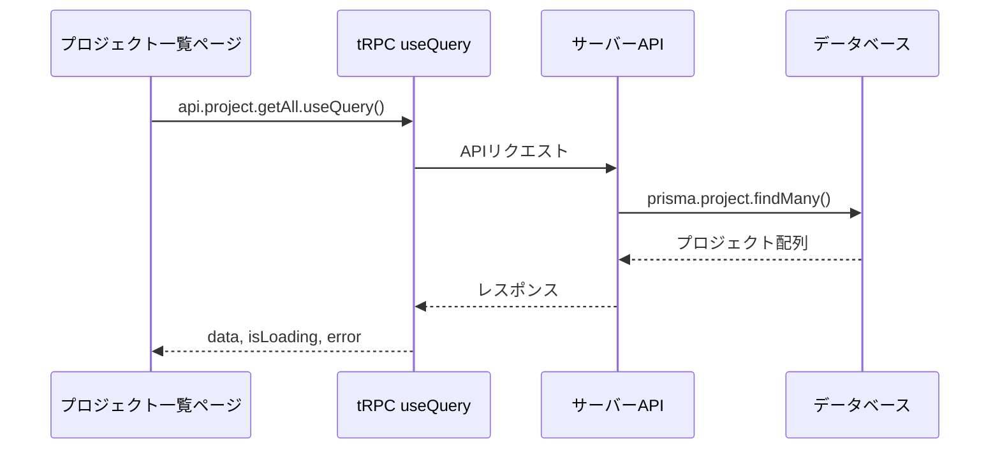

# Day 09: プロジェクト一覧画面を作ろう

## 🔙 前回の振り返り

Day 08 ではサイドバーにユーザー情報ウィジェットとログアウト確認ダイアログを実装し、認証ガードによる未ログイン時のリダイレクトも体験しました。認証まわりが完成したので、今日からアプリの中核機能であるプロジェクト管理に取り組みます。

---

## 🎯 今日のゴール

tRPC の `useQuery` を使ってサーバーからプロジェクトデータを取得し、カード形式で一覧表示します。グリッドレイアウトでレスポンシブ対応も実装します。

📸 スクリーンショット: プロジェクト一覧画面


## 🤔 なぜこれを作るのか？

ここまでで認証の仕組みを学びました。いよいよアプリの中身を作っていきます。最初の機能は「プロジェクト管理」です。

> 💡 **例え話**: プロジェクト一覧は「本棚」です。本棚に並んだ本（プロジェクト）を一目で見渡し、1冊ずつ手に取って詳細を確認できます。まずは本棚を作りましょう。

### 📐 データ取得の流れ



### やること / やらないこと

| やること | やらないこと |
|---------|-------------|
| `useQuery` でデータ取得 | データの作成・編集（Day 10-11） |
| グリッドレイアウトで一覧表示 | 詳細ページの実装 |
| ローディング・エラー表示 | メンバー管理（Day 12） |
| ProjectCard コンポーネントの表示 | カードのデザインをゼロから作る |

### 📂 今日触るファイル

```
src/
├── app/
│   └── project/
│       └── page.tsx          ← メイン（既存ファイルを編集）
├── component/
│   ├── project/
│   │   └── project-card.tsx  ← 既存（読み取り専用）
│   ├── layout/
│   │   └── app-layout.tsx    ← 既存（利用する）
│   └── ui/
│       └── loading-spinner.tsx ← 既存（利用する）
└── lib/
    └── constant/
        └── status.ts         ← 既存（利用する）
```

> 💡 今日編集するのは `src/app/project/page.tsx` の1ファイルだけです。他のファイルはすでに用意されているので、importして使います。

### 🆕 新しく学ぶ概念

| 概念 | 読み方 | 役割 | 例え |
|------|--------|------|------|
| useQuery | ユーズ・クエリ | サーバーからデータを取得するフック | 図書館の検索端末。リクエストすると結果が返ってくる |
| グリッドレイアウト | — | 要素を格子状に並べるCSS | 本棚の棚板。横に何冊並べるかを画面幅で変える |
| Suspense | サスペンス | データ読み込み中の待機画面を自動で表示してくれるReactの仕組み | レストランの「ただいま準備中」の看板。料理（データ）ができるまで待たせてくれる |

## 📊 実装ステップ一覧

| ステップ | 作業内容 | 所要時間 |
|---------|---------|---------|
| Step 1 | ページファイルを作成する | 3分 |
| Step 2 | tRPCでデータを取得する | 5分 |
| Step 3 | ローディング表示を作る | 4分 |
| Step 4 | importとハンドラーを準備する | 4分 |
| Step 5 | グリッドレイアウトでカードを表示する | 7分 |
| Step 6 | 空状態の表示を追加する | 5分 |
| Step 7 | 新規作成ボタンを追加する | 5分 |
| Step 8 | 動作確認 | 3分 |

**合計時間**: 約36分

---

### Step 1: ページファイルを作成する（3分）

🎯 **ゴール**: プロジェクト一覧ページの基本構造を作ります。

💻 **実装**:

> ⚠️ **注意**: `src/app/project/page.tsx` は既にプロジェクトに存在しています。上書きしないよう注意してください。既存のコードは削除せず、指示された部分のみ追加・修正してください。

`src/app/project/page.tsx` を既存ファイルとして開き、ファイル先頭のimport一式と基本構造を確認してください。

```typescript
// filepath: src/app/project/page.tsx
// Step 1で確認するimport一式（ファイル先頭部分）
'use client';

import { Suspense } from 'react';
import { AppLayout } from '@/component/layout/app-layout';
import { PageLoadingSpinner } from '@/component/ui/loading-spinner';
```

✅ **確認ポイント**:
- ファイルを保存した
- `'use client'` がファイル先頭にある
- `Suspense`、`AppLayout`、`PageLoadingSpinner` の3つがimportされている

`ProjectPageContent` と `ProjectPage` の基本構造を確認します。ページ本体は `Suspense` でラップされ、ローディング中に `PageLoadingSpinner` が表示されます。

```typescript
// filepath: src/app/project/page.tsx
// ProjectPageContentとProjectPageの基本構造
function ProjectPageContent() {
  return (
    <AppLayout>
      <div className="flex flex-col gap-6">
        <h1 className="text-3xl font-bold
          tracking-tight">
          プロジェクト
        </h1>
      </div>
    </AppLayout>
  );
}

export default function ProjectPage() {
  return (
    <Suspense fallback={<PageLoadingSpinner />}>
      <ProjectPageContent />
    </Suspense>
  );
}
```

✅ **確認ポイント**:
- `npm run dev` でエラーが出ていない
- ブラウザで `/project` にアクセスして「プロジェクト」と表示される
- サイドバーが表示されている

📸 スクリーンショット: 「プロジェクト」タイトルだけが表示された初期画面


---

### Step 2: tRPCでデータを取得する（5分）

🎯 **ゴール**: `useQuery` でプロジェクト一覧を取得します。

💻 **実装**:

`src/app/project/page.tsx` の import 群に以下を追加します。

```typescript
// filepath: src/app/project/page.tsx
// import群に追加
import { api } from '@/trpc/react';
import { useState } from 'react';
```

✅ **確認ポイント**:
- ファイルを保存した
- `npm run dev` でエラーが出ていない

`ProjectPageContent()` の `{` の直後、`return` の前に以下を追加します。

```typescript
// filepath: src/app/project/page.tsx
// ProjectPageContent内、returnの前に追加
const [showArchived, setShowArchived] =
  useState(false);

// プロジェクト一覧をサーバーから取得
const {
  data: projects,
  isLoading: projectsLoading,
} = api.project.getAll.useQuery({
  isArchived: showArchived,
});
```

✅ **確認ポイント**:
- `npm run dev` でエラーが出ていない
- ブラウザの開発者ツール → コンソールにエラーが出ていない

#### useQueryの返り値

| 返り値 | 説明 |
|--------|------|
| `data` | 取得したデータ（読み込み前は`undefined`） |
| `isLoading` | 初回読み込み中かどうか |
| `error` | tRPCのエラー情報（正常時は`null`） |
| `isRefetching` | 再取得中かどうか |

> 💡 `useQuery` はページ表示時に自動でAPIを呼びます。手動で `fetch` を書く必要はありません。

---

### Step 3: ローディング表示を作る（4分）

🎯 **ゴール**: データ読み込み中にスピナーを表示します。

💻 **実装**:

`ProjectPageContent` 内の `return` の前に追加します。実際のソースコードでは `AppLayout` で囲んで使用しています。

```typescript
// filepath: src/app/project/page.tsx
// ProjectPageContent内、returnの前に追加
// ローディング中はスピナーを表示
if (projectsLoading) {
  return (
    <AppLayout>
      <PageLoadingSpinner />
    </AppLayout>
  );
}
```

✅ **確認ポイント**:
- ファイルを保存した
- `npm run dev` でエラーが出ていない
- ページ読み込み時にスピナーが表示される

📸 スクリーンショット: ローディングスピナーの表示


---

### Step 4: importとハンドラーを準備する（4分）

🎯 **ゴール**: カード表示に必要なimportとイベントハンドラーを準備します。

💻 **実装**:

`src/app/project/page.tsx` の import 群に以下を追加します。

```typescript
// filepath: src/app/project/page.tsx
// import群に追加
import { ProjectCard }
  from '@/component/project/project-card';
import { TASK_STATUS }
  from '@/lib/constant/status';
```

✅ **確認ポイント**:
- ファイルを保存した
- `npm run dev` でエラーが出ていない

次に、イベントハンドラーを `ProjectPageContent` 内の `return` の前に追加します。Day 10-11 で本実装に差し替えます。

```typescript
// filepath: src/app/project/page.tsx
// ProjectPageContent内、returnの前に追加
// Day 10-11 で本実装に差し替え（仮実装）
const handleEdit = (_id: string) => {
  // TODO: Day 10 でプロジェクト編集ダイアログを開く
};
const handleDelete = (_id: string) => {
  // TODO: Day 11 で削除確認ダイアログを開く
};
const handleProjectClick = (id: string) => {
  // TODO: Day 12 でプロジェクト詳細画面に遷移する
  void id;
};
```

✅ **確認ポイント**:
- ファイルを保存した
- `npm run dev` でエラーが出ていない
- 型エラーが出ていない

#### ProjectCardのprops

| prop | 型 | 説明 |
|------|-----|------|
| `id` | `string` | プロジェクトID |
| `name` | `string` | プロジェクト名 |
| `description` | `string \| null` | 説明文（任意） |
| `color` | `string` | カラーコード（例: `#1976d2`） |
| `memberCount` | `number` | メンバー数 |
| `taskStats` | `{total: number, done: number}` | タスク進捗 |
| `onEdit` | `(id: string) => void` | 編集ボタンクリック時 |
| `onDelete` | `(id: string) => void` | 削除ボタンクリック時 |
| `onClick` | `(id: string) => void` | カードクリック時（任意） |
| `isArchived` | `boolean` | アーカイブ済みか（任意） |

---

### Step 5: グリッドレイアウトでカードを表示する（7分）

🎯 **ゴール**: プロジェクトをカード形式でグリッド表示し、空状態も処理します。

💻 **実装**:

`ProjectPageContent` の `return` 内にある `<h1>` の後に、グリッドコンテナとmap処理を追加します。

```typescript
// filepath: src/app/project/page.tsx
// ProjectPageContent の return 内、<h1> の直後に追加
// グリッドコンテナとプロジェクトのmap処理
<div className="grid gap-6
  sm:grid-cols-2 lg:grid-cols-3
  xl:grid-cols-4">
  {projects && projects.length > 0 ? (
    projects.map((project) => {
      const taskCount =
        project.tasks?.length ?? 0;
      const doneCount =
        project.tasks?.filter(
          (t) => t.status === TASK_STATUS.DONE
        ).length ?? 0;
```

✅ **確認ポイント**:
- ファイルを保存した
- `npm run dev` でエラーが出ていない

map の内側で `ProjectCard` コンポーネントを返します。**上のコードブロックの `length ?? 0;` の直後に続けて追加してください。**

```typescript
// filepath: src/app/project/page.tsx
// 前のコードブロックの続き（map内のreturn）
      return (
        <ProjectCard
          key={project.id}
          id={project.id}
          name={project.name}
          description={project.description}
          color={project.color}
          memberCount={project.members?.length ?? 0}
          taskStats={{
            total: taskCount,
            done: doneCount,
          }}
          onEdit={handleEdit}
          onDelete={handleDelete}
          onClick={handleProjectClick}
          isArchived={project.isArchived}
        />
      );
    })
```

✅ **確認ポイント**:
- プロジェクトがカード形式で表示されている

> 💡 `'DONE'` のような文字列リテラルではなく `TASK_STATUS.DONE` 定数を使います。定数を使うとタイプミスを防げて、値が変わっても一箇所直すだけで済みます。

📸 スクリーンショット: プロジェクトカードの表示


---

### Step 6: 空状態の表示を追加する（5分）

🎯 **ゴール**: データがない時のメッセージを追加し、グリッドを閉じます。

💻 **実装**:

Step 5 の `projects.map(...)` の直後に、空状態の表示と `<div>` の閉じタグを追加します。

```typescript
// filepath: src/app/project/page.tsx
// 前のコードブロックの続き（<h1>後のgrid divの内側）
// projects.map(...) の直後に続けて追加
  ) : (
    <div className="col-span-full flex
      flex-col items-center justify-center
      py-12 text-center
      text-muted-foreground">
      <p>プロジェクトが見つかりません。</p>
      <p>最初のプロジェクトを作成しましょう！</p>
    </div>
  )}
</div>
```

✅ **確認ポイント**:
- プロジェクトがない場合にメッセージが表示される
- ブラウザ幅を変えるとカードの列数が変わる

📸 スクリーンショット: 空状態の表示


#### グリッドの画面幅別列数

| 画面幅 | クラス | 列数 |
|--------|-------|------|
| スマホ（~640px） | デフォルト（`grid-cols-1`） | 1列 |
| タブレット（640px~） | `sm:grid-cols-2` | 2列 |
| PC（1024px~） | `lg:grid-cols-3` | 3列 |
| ワイド（1280px~） | `xl:grid-cols-4` | 4列 |

---

### Step 7: 新規作成ボタンを追加する（5分）

🎯 **ゴール**: プロジェクト作成ダイアログを開くボタンを配置します。

💻 **実装**:

`src/app/project/page.tsx` の import 群に以下を追加します。

```typescript
// filepath: src/app/project/page.tsx
// import群に追加
import { Button } from '@/component/ui/button';
import { Switch } from '@/component/ui/switch';
import { Label } from '@/component/ui/label';
import { Plus } from 'lucide-react';
```

✅ **確認ポイント**:
- ファイルを保存した
- `npm run dev` でエラーが出ていない

ダイアログの開閉を管理するstateを `ProjectPageContent` 内に追加します。

```typescript
// filepath: src/app/project/page.tsx
// ProjectPageContent内に追加
const [dialogOpen, setDialogOpen] =
  useState(false);

// 新規作成モードでダイアログを開く
const handleCreate = () => {
  setDialogOpen(true);
};
```

✅ **確認ポイント**:
- ファイルを保存した
- `npm run dev` でエラーが出ていない

`return` 文の中にある `<h1>` を含む部分を、以下のボタン付きヘッダーに置き換えます。

```typescript
// filepath: src/app/project/page.tsx
// <h1>だけの部分をヘッダーに変更
<div className="flex items-center
  justify-between">
  <h1 className="text-3xl font-bold
    tracking-tight">
    プロジェクト
  </h1>
  <div className="flex items-center gap-4">
    <div className="flex items-center
      space-x-2">
      <Switch id="show-archived"
        checked={showArchived}
        onCheckedChange={setShowArchived} />
      <Label htmlFor="show-archived">
        アーカイブ表示
      </Label>
    </div>
    <Button onClick={handleCreate}>
      <Plus className="mr-2 h-4 w-4" />
      新規プロジェクト
    </Button>
  </div>
</div>
```

✅ **確認ポイント**:
- 「新規プロジェクト」ボタンが右上に表示されている
- ボタンをクリックしてもエラーが出ない

> 💡 Day 10 で `ProjectDialog` コンポーネントを作成すると、このボタンと `dialogOpen` state が連携してダイアログが開くようになります。

---

### Step 8: 動作確認（3分）

🎯 **ゴール**: プロジェクト一覧の全機能を確認します。

開発サーバーを起動して確認します。

```bash
# filepath: ターミナル
# 開発サーバーを起動
npm run dev
```

✅ **確認ポイント**:
- `http://localhost:3000` にアクセスできる

以下の項目を順番に確認してください。

| # | 確認内容 | 期待される動作 |
|---|---------|--------------|
| 1 | `/project` にアクセス | カードが表示される |
| 2 | ブラウザ幅を変える | カードの列数が変わる |
| 3 | 「新規プロジェクト」ボタン | 右上に表示されている |
| 4 | カードの内容 | 色帯・メンバー数・進捗がある |
| 5 | ページ読み込み時 | スピナーが一瞬表示される |
| 6 | プロジェクトが0件の場合 | 「見つかりません」メッセージが出る |

📸 スクリーンショット: 完成したプロジェクト一覧画面


✅ **確認ポイント**:
- カードがグリッドで並んでいる
- ローディングスピナーが表示されてからデータが出る
- レスポンシブに列数が変わる
- アーカイブ済みプロジェクトにバッジが付いている

## 📋 今日のまとめ

- [ ] `useQuery` でサーバーからデータを取得できた
- [ ] グリッドレイアウトでカード一覧を表示できた
- [ ] ローディング・空状態を適切に表示できた
- [ ] 新規プロジェクトボタンの準備ができた

## ⚠️ つまずきポイント

| エラー / 問題 | 原因 | 解決方法 |
|--------------|------|---------|
| データが表示されない | APIが呼ばれていない | `useQuery()` の呼び出しを確認 |
| カードが縦一列になる | グリッドクラスの指定漏れ | `sm:grid-cols-2 lg:grid-cols-3` を確認 |
| TypeScript の型エラー | ハンドラーの型不一致 | `(id: string) => void` になっているか確認 |
| `PageLoadingSpinner` が見つからない | importパスの間違い | `@/component/ui/loading-spinner` を確認 |
| `TASK_STATUS` が見つからない | importパスの間違い | `@/lib/constant/status` を確認 |
| サイドバーが二重に表示される | `PageLoadingSpinner`が二重にAppLayoutで囲まれている | 実コードの構造に合わせて `<AppLayout><PageLoadingSpinner /></AppLayout>` で囲む |

## 📝 今日学んだ用語

| 用語 | 意味 |
|------|------|
| useQuery | tRPC/React Query のデータ取得フック |
| Suspense | データ読み込み中の待機画面を自動で表示するReactの仕組み |
| グリッドレイアウト | CSS Grid で要素を格子状に配置する仕組み |
| レスポンシブ | 画面幅に応じてレイアウトを変えるデザイン手法 |

## 🔜 次回予告

Day 10 では、プロジェクトの新規作成機能を実装します。ダイアログ（モーダル）を使ったフォーム入力と、tRPC の `useMutation` でデータを保存する方法を学びます。
