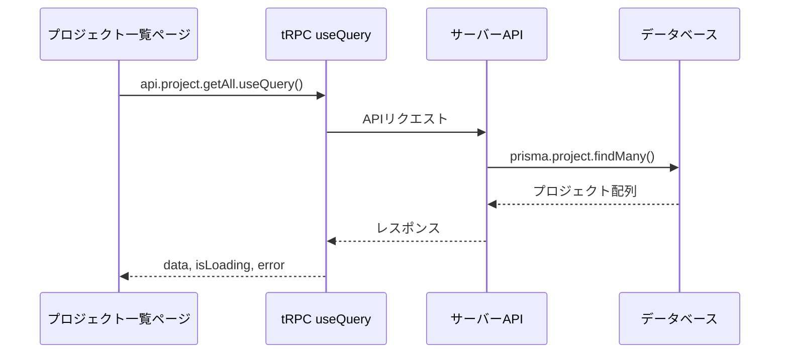

# Day 09: プロジェクト一覧画面を作ろう

## 前回の振り返り

Day 08 ではサイドバーにユーザー情報ウィジェットとログアウト確認ダイアログを実装し、認証ガードによる未ログイン時のリダイレクトも体験しました。認証まわりが完成したので、今日からアプリの中核機能であるプロジェクト管理に取り組みます。

---

## 今日のゴール

tRPC の `useQuery` を使ってサーバーからプロジェクトデータを取得し、カード形式で一覧表示します。グリッドレイアウトでレスポンシブ対応も実装します。

スクリーンショット: 完成イメージ（プロジェクト一覧画面）


## なぜこれを作るのか

このアプリでは、タスクとメンバーが「プロジェクト」にぶら下がります。だから中身づくりの最初は、プロジェクトを一覧で見渡せて、そこから各プロジェクトへ入っていける入口を用意します。

> **例え話**: プロジェクト一覧は「本棚」です。本棚に並んだ本（プロジェクト）を一目で見渡し、1冊ずつ手に取って詳細を確認できます。まずは本棚を作りましょう。

### データ取得の流れ



### やること / やらないこと

| やること | やらないこと |
|---------|-------------|
| `useQuery` でデータ取得 | データの作成・編集（Day 10-11） |
| グリッドレイアウトで一覧表示 | 詳細ページの実装 |
| ローディング・エラー表示 | メンバー管理（Day 12） |
| ProjectCard コンポーネントの表示 | カードのデザインをゼロから作る |

### 今日触るファイル

```
src/
├── app/
│   └── project/
│       └── page.tsx          ← メイン（既存ファイルを編集）
├── component/
│   ├── project/
│   │   └── project-card.tsx  ← 今日の表示で使うカード
│   ├── layout/
│   │   └── app-layout.tsx    ← 既存（利用する）
│   └── ui/
│       └── loading-spinner.tsx ← 既存（利用する）
└── lib/
    └── constant/
        └── status.ts         ← 既存（利用する）
```

> 今日は `src/app/project/page.tsx` を **ゼロから書いていく** 方式で進めます。既にファイルがある場合は一旦中身を空にして、ステップごとにコピペしてください。

### 新しく学ぶ概念

| 概念 | 読み方 | 役割 | 例え |
|------|--------|------|------|
| useQuery | ユーズ・クエリ | サーバーからデータを取得するフック | 図書館の検索端末。リクエストすると結果が返ってくる |
| グリッドレイアウト | — | 要素を格子状に並べるCSS | 本棚の棚板。横に何冊並べるかを画面幅で変える |
| Suspense | サスペンス | コンポーネントの準備が終わるまで代わりの画面を表示するReactの仕組み | レストランの「ただいま準備中」の看板 |

### Suspenseの役割を理解する

| 用語 | 何をするか | 今日の使い方 |
|------|-----------|-------------|
| `Suspense` | 子コンポーネントが準備完了するまで `fallback` を表示する | ページ全体のローディングガード |
| `fallback` | 準備中に表示するUI | `<PageLoadingSpinner />` |
| `PageLoadingSpinner` | スピナー付きのローディング表示 | `Suspense` の `fallback` や `isLoading` 時に使う |

## 実装ステップ一覧

| ステップ | 作業内容 | 所要時間 |
|---------|---------|---------|
| Step 0 | プロジェクト一覧 API（getAll）を自分で書く | 15分 |
| Step 1 | ページの骨組みを作る | 3分 |
| Step 2 | tRPCでデータを取得する | 5分 |
| Step 3 | ローディング表示を作る | 3分 |
| Step 4 | カード表示用のimportを追加する | 3分 |
| Step 5 | イベントハンドラーを準備する | 4分 |
| Step 6 | プロジェクトカードをグリッド表示する | 5分 |
| Step 7 | 空状態のメッセージを追加する | 3分 |
| Step 8 | ヘッダーにボタンとスイッチを追加する | 5分 |
| Step 9 | ページ全体を組み立てる | 5分 |
| Step 10 | 動作確認 | 3分 |

**合計時間**: 約54分。

---

### Step 0: プロジェクト一覧 API を自分の手で書く（15分）

**ゴール**: プロジェクト一覧を返す `getAll` を自分で書き、`root.ts` に登録して、画面から `api.project.getAll` を呼べる状態にします。

一覧画面には、サーバーが持っているプロジェクトを画面まで運んでくる入口が必要です。その入口を、今日は自分の手で1つ作ります。Day 07 で認証 API（`auth.ts`）を1から書いたのと同じ流れです。

#### tRPC の手続きは3つの部品でできている

これから書く `getAll` に限らず、tRPC の手続き（procedure）はいつも同じ3部品の組み合わせです。この形を先に頭へ入れておくと、Day 10 以降で `create` や `update` を書くときも、同じ型に当てはめるだけで済みます。

| 部品 | 役割 | `getAll` での中身 |
|------|------|------------------|
| 入力（input） | クライアントから何を受け取るか。`z` で形を検証する | アーカイブを含めるか、などの絞り込み条件 |
| 処理（query / mutation） | 受け取った条件で DB に問い合わせる | Prisma でプロジェクトを検索する |
| 戻り値（return） | 画面に返すデータ | プロジェクトの配列 |

今日はこの3部品のうち、一覧取得の `getAll` だけを書きます。`create` や `update` は、それを実際に使う Day 10 以降で1つずつ足していきます。1日で全部書く必要はありません。

#### 0-1. まず import から

`src/server/api/routers/project.ts` を新規作成し、先頭に import を書きます。

```typescript
// filepath: src/server/api/routers/project.ts
import type { Prisma } from '@prisma/client';
import { TRPCError } from '@trpc/server';
import { z } from 'zod';
import { USER_ROLE } from '@/lib/constant/roles';
import { prisma } from '@/lib/prisma';
import { createTRPCRouter, protectedProcedure } from '../trpc';
import { USER_SELECT } from './_helpers/select';
```

import は「これから使う道具を最初に並べておく」宣言です。先頭の `import type`（型だけを取り込み、実行時には消える書き方）で `Prisma` を入れているのは、値としてではなく `where` の型注釈にだけ使うためです。`protectedProcedure` はログイン済みの人だけが呼べる手続きを作る道具、`z` は入力の形を検証する道具、`prisma` は DB に問い合わせる道具です。`USER_SELECT` は Day 07 で作った `_helpers/select.ts` にある「ユーザーのどの項目を返すか」の指定です。パスワードなど返してはいけない項目を毎回書かずに済むよう、まとめてあります。

#### 0-2. 手続きの骨組みと入力を書く

`getAll` の骨組みを書きます。`protectedProcedure` で始めると、ログインしていない人がこの API を呼んだときに自動で弾かれます。`.input(...)` では受け取る条件を定義します。

```typescript
// filepath: src/server/api/routers/project.ts（続き）
export const projectRouter = createTRPCRouter({
  getAll: protectedProcedure
    .input(
      z
        .object({
          userId: z.string().cuid().optional(),
          isArchived: z.boolean().optional(),
        })
        .optional(),
    )
    .query(async ({ ctx, input }) => {
      const where: Prisma.ProjectWhereInput = {};
```

`userId` と `isArchived` の各項目に `.optional()` が付いているのは、その項目だけ省略してよいという意味です。いちばん外側にも `.optional()` があるので、条件オブジェクトごと渡さずに呼ぶこともできます。何も渡さなければ「ログイン中の自分のプロジェクトを全部」返します。`.query(...)` の中の `ctx` にはログイン中のユーザー情報が入り、`input` には今定義した条件が入ってきます。`where` は、このあと組み立てる「どのプロジェクトを探すか」の検索条件を入れておく変数です。

#### 0-3. ここが一番のヤマ場（誰の一覧を返すかを守る）

ここが `getAll` で最も気をつける部分です。もし他人の `userId` を渡すだけで他人のプロジェクトを覗けてしまうと、見えてはいけないものが見えてしまいます。そこで「自分以外の `userId` を指定できるのは管理者だけ」という制限を入れます。

```typescript
// filepath: src/server/api/routers/project.ts（続き）
      if (input?.userId && input.userId !== ctx.session.userId) {
        if (ctx.session.role !== USER_ROLE.ADMIN) {
          throw new TRPCError({
            code: 'FORBIDDEN',
            message: '管理者権限が必要です',
          });
        }
      }
```

`input.userId !== ctx.session.userId` は「渡された userId が自分自身ではない」という意味です。手前の `input?.userId` にある `?.`（オプショナルチェーン、途中の値が無ければそこで止めて undefined を返す書き方）は、条件オブジェクトごと省略して呼ばれても落ちないようにするためです。それが管理者以外だったときに `TRPCError` を `throw` すると、処理はここで止まり、画面には権限がないというエラーが返ります。`throw` は「これ以上は進めない」とその場で処理を打ち切る命令です。

#### 0-4. 検索条件を組み立てる

弾く条件を通過したら、実際に「どのプロジェクトを探すか」を `where` に組み立てます。

```typescript
// filepath: src/server/api/routers/project.ts（続き）
      if (!input?.userId) {
        where.members = {
          some: { userId: ctx.session.userId },
        };
      } else {
        where.members = {
          some: { userId: input.userId },
        };
      }

      if (input?.isArchived !== undefined) {
        where.isArchived = input.isArchived;
      }
```

`members.some` は「メンバーにこのユーザーが含まれるプロジェクト」という条件です。`some` は Prisma で「関連の中に条件を満たすものが1つでもあれば対象にする」という書き方です。`userId` を渡さなければ自分がメンバーのものを、渡せば（管理者なので）その人がメンバーのものを探します。`isArchived` は指定されたときだけ条件に足すので、未指定のときはアーカイブ済みも含めた全部が対象になります。

#### 0-5. Prisma でプロジェクトを取得して返す

組み立てた `where` を使って、Prisma で一覧を取得します。画面はメンバー数とタスク進捗を表示するので、関連するメンバーとタスクも `include` で一緒に取ってきます。

```typescript
// filepath: src/server/api/routers/project.ts（続き）
      return await prisma.project.findMany({
        where,
        include: {
          members: {
            include: {
              user: {
                select: USER_SELECT,
              },
            },
          },
          tasks: {
            select: {
              id: true,
              status: true,
            },
          },
        },
        orderBy: { createdAt: 'desc' },
      });
    }),
});
```

このコードで一番わかりにくいのは、`include` が3階層も入れ子になっているところです。ここは1つずつ分解すれば読めます。まず Prisma では `include` と `select` の役割が違うことを押さえます。

| キーワード | 役割 | このコードでの使い方 |
|---|---|---|
| `include` | 関連するデータも一緒に取ってくる | プロジェクトに紐づくメンバーとタスクを取る |
| `select` | 取ってきたデータのうち、返す項目だけに絞る | ユーザーは名前やアイコンだけ、タスクは `id` と `status` だけ |

入れ子が3階層になるのは、関連をたどってさらにその先の関連を取るからです。プロジェクト →（`include: members`）そのメンバー →（`include: user`）メンバーが誰なのかを表すユーザー、と2回たどるので `include` の中に `include` が入ります。一番内側のユーザーは `select: USER_SELECT` で必要な項目だけに絞り、パスワードなどは返しません。`tasks` は進捗の集計にしか使わないので、`select` で `id` と `status` の2つだけ取ります。全項目を取ると通信が重くなるからです。

こうしてメンバーとタスクを一緒に取っておくと、画面側はメンバー数やタスクの進捗を追加の通信なしで表示できます。`orderBy: { createdAt: 'desc' }` は作成日の新しい順に並べる指定です。最後の `}),` で `getAll` を閉じ、`});` で `projectRouter` 全体を閉じます。

#### 0-6. root.ts に project ルーターを登録する

`getAll` を書いただけでは、まだ画面から呼べません。作った `projectRouter` を `root.ts` に登録して、初めて `api.project.getAll` という呼び名が生まれます。Day 07 で `auth` を登録したのと同じ形です。

```typescript
// filepath: src/server/api/root.ts
import { authRouter } from './routers/auth';
import { projectRouter } from './routers/project';
import { createCallerFactory, createTRPCRouter } from './trpc';

export const appRouter = createTRPCRouter({
  auth: authRouter,
  project: projectRouter,
});

export type AppRouter = typeof appRouter;

export const createCaller = createCallerFactory(appRouter);
```

`appRouter` に `project: projectRouter` を足したことで、フロント側の `api.project.getAll` がこの手続きにつながります。今の `root.ts` には Day 07 の `auth` と今日の `project` の2つだけが並びます。`comment` や `task` などは、それを使う Day で1つずつ足していきます。

次の Day 10 で書く `create` も、今日と同じ3部品（入力・処理・戻り値）でできています。違うのは、処理が「探す（`.query`）」ではなく「作る（`.mutation`）」になる点です。だから今日 `getAll` の形をつかんでおけば、Day 10 は同じ骨組みに中身を入れ替えるだけになります。

**確認ポイント**:
- `src/server/api/routers/project.ts` に `getAll` を書き、`}),` と `});` まで閉じた
- `root.ts` に `projectRouter` の import と `project: projectRouter` の2行を追加した
- `npm run dev` で型エラーが出ていない（この API を画面から呼ぶのは Step 2 以降なので、今は起動時にエラーが出なければよい）

---

### Step 1 : ページの骨組みを作る（3分）

**ゴール**: プロジェクト一覧ページの基本構造を作ります。

**実装**:

`src/app/project/page.tsx` を開き、以下の内容に置き換えてください。

```typescript
// filepath: src/app/project/page.tsx
'use client';

import { Suspense } from 'react';
import { AppLayout }
  from '@/component/layout/app-layout';
import { PageLoadingSpinner }
  from '@/component/ui/loading-spinner';
```

先頭の `'use client'`（このファイルをブラウザ側で動かす宣言）は、あとで `useState` などのフックをこのページで使うために必要です。続く取り込みは、ページを組み立てる部品です。`Suspense` は準備が終わるまで仮の表示に差し替える仕組み、`AppLayout` はサイドバー付きの共通枠、`PageLoadingSpinner` は読み込み中に出すスピナーです。

**確認ポイント**:
- ファイルを保存した
- `'use client'` がファイル先頭にある

続けて、同じファイルの末尾に以下を追加します。

```typescript
// filepath: src/app/project/page.tsx
function ProjectPageContent() {
  return (
    <AppLayout>
      <div className="flex flex-col gap-6">
        <h1 className="text-3xl font-bold
          tracking-tight">
          プロジェクト
        </h1>
      </div>
    </AppLayout>
  );
}
```

ここではまず、中身のない骨組みを作ります。`AppLayout` で全体を囲むと、このページにもサイドバーやヘッダーが付きます。内側の `<div>` は縦並びの入れ物で、いまは見出しの `<h1>` だけを置き、カード一覧はあとのステップで足していきます。

**確認ポイント**:
- `AppLayout` でページ全体を囲んでいる

最後に、ページのエクスポートを追加します。

```typescript
// filepath: src/app/project/page.tsx
export default function ProjectPage() {
  return (
    <Suspense
      fallback={<PageLoadingSpinner />}>
      <ProjectPageContent />
    </Suspense>
  );
}
```

この `ProjectPage` が、実際に画面へ表示されるコンポーネントです。本体の `ProjectPageContent` を `Suspense` で包むのは、次のステップでデータ取得を足したときに、読み込み中の表示を1か所で受け止められるようにするためです。

**確認ポイント**:
- `npm run dev` でエラーが出ていない
- ブラウザで `/project` にアクセスして「プロジェクト」と表示される
- サイドバーが表示されている

スクリーンショット: 「プロジェクト」タイトルだけが表示された初期画面。


> `Suspense` は子コンポーネント（`ProjectPageContent`）が準備完了するまで、代わりに `fallback` に指定した `PageLoadingSpinner` を表示します。ローディング中はスピナーが表示され、準備が完了すると `ProjectPageContent`（`AppLayout` でラップされた本体）が表示されます。

---

### Step 2 : tRPCでデータを取得する（5分）

**ゴール**: `useQuery` でプロジェクト一覧をサーバーから取得します。

**実装**:

`src/app/project/page.tsx` の import 群に以下を追加します。

```typescript
// filepath: src/app/project/page.tsx
// import群に追加（ファイル先頭のimportの後ろ）
import { api } from '@/trpc/react';
import { useState } from 'react';
```

**確認ポイント**:
- ファイルを保存した
- `npm run dev` でエラーが出ていない

`ProjectPageContent` 関数の先頭（`return` の前）に以下を追加します。

```typescript
// filepath: src/app/project/page.tsx
// ProjectPageContent内、returnの前に追加
const [showArchived, setShowArchived] =
  useState(false);

const {
  data: projects,
  isLoading: projectsLoading,
} = api.project.getAll.useQuery({
  isArchived: showArchived,
});
```

**確認ポイント**:
- `npm run dev` でエラーが出ていない
- ブラウザの開発者ツール → コンソールにエラーが出ていない

#### useQueryの返り値

| 返り値 | 説明 |
|--------|------|
| `data` | 取得したデータ（読み込み前は`undefined`） |
| `isLoading` | 初回読み込み中かどうか |
| `error` | tRPCのエラー情報（正常時は`null`） |
| `isRefetching` | 再取得中かどうか |

> `useQuery` はページ表示時に自動でAPIを呼びます。手動で `fetch` を書く必要はありません。

---

### Step 3 : ローディング表示を作る（3分）

**ゴール**: データ読み込み中にスピナーを表示します。

**実装**:

`ProjectPageContent` 内の `return` の直前に追加します。

```typescript
// filepath: src/app/project/page.tsx
// ProjectPageContent内、returnの前に追加
if (projectsLoading) {
  return <PageLoadingSpinner />;
}
```

**確認ポイント**:
- ファイルを保存した
- `npm run dev` でエラーが出ていない
- ページ読み込み時にスピナーが一瞬表示される

スクリーンショット: ローディングスピナーの表示。


> ここでの `<PageLoadingSpinner />` は `ProjectPageContent` の内側で使うため、`AppLayout` の中で呼ばれます。`AppLayout` のラップはこの `if` ブロックの外側（`return` の中）で行うので、スピナーを `AppLayout` で二重に囲む必要はありません。

---

### Step 4 : カード表示用のimportを追加する（3分）

**ゴール**: プロジェクトカードと定数のimportを追加します。

**実装**:

`src/app/project/page.tsx` の import 群に以下を追加します。

```typescript
// filepath: src/app/project/page.tsx
// import群に追加
import { ProjectCard }
  from '@/component/project/project-card';
import { TASK_STATUS }
  from '@/lib/constant/status';
```

**確認ポイント**:
- ファイルを保存した
- `npm run dev` でエラーが出ていない

#### ProjectCardのprops

| prop | 型 | 説明 |
|------|-----|------|
| `id` | `string` | プロジェクトID |
| `name` | `string` | プロジェクト名 |
| `description` | `string \| null` | 説明文（任意） |
| `color` | `string` | カラーコード（例: `#1976d2`） |
| `memberCount` | `number` | メンバー数 |
| `taskStats` | `{total, done}` | タスク進捗 |
| `onEdit` | `(id: string) => void` | 編集ボタンクリック時 |
| `onDelete` | `(id: string) => void` | 削除ボタンクリック時 |
| `onClick` | `(id: string) => void` | カードクリック時 |
| `isArchived` | `boolean` | アーカイブ済みか |

---

### Step 5 : イベントハンドラーを準備する（4分）

**ゴール**: カードのボタンに渡すハンドラー関数を準備します。

**実装**:

`ProjectPageContent` 内、`if (projectsLoading)` の前に追加します。

```typescript
// filepath: src/app/project/page.tsx
// ProjectPageContent内に追加
const handleEdit = (projectId: string) => {
  void projectId;
};
const handleDelete = (projectId: string) => {
  void projectId;
};
const handleProjectClick = (id: string) => {
  void id;
};
```

**確認ポイント**:
- ファイルを保存した
- `npm run dev` でエラーが出ていない
- 型エラーが出ていない

> **仮実装について**: `handleEdit` / `handleDelete` / `handleProjectClick` は今の時点では何もしません。Day 10 で編集ダイアログ、Day 11 で削除確認、Day 12 で詳細画面遷移を実装するので、今日はカードに渡すための「受け皿」だけ作っておきます。ボタンをクリックしても今は何も起きませんが、それで正常です。
>
> `void projectId` は「この引数を意図的に使わない」ことをTypeScriptに伝える書き方です。`_` プレフィックスの代わりに使えるテクニックです。

---

### Step 6 : プロジェクトカードをグリッド表示する（5分）

**ゴール**: プロジェクトをカード形式でグリッド表示します。

**実装**:

`ProjectPageContent` の `return` 内にある `<h1>` タグの後に、以下のグリッド表示を追加します。これは完成形のコードブロックです。

```typescript
// filepath: src/app/project/page.tsx
// return内、</h1>の後にグリッド開始
<div className="grid gap-6 sm:grid-cols-2
  lg:grid-cols-3 xl:grid-cols-4">
  {projects?.map((project) => {
    const taskCount =
      project.tasks?.length ?? 0;
    const doneCount =
      project.tasks?.filter(
        (t) => t.status ===
          TASK_STATUS.DONE
      ).length ?? 0;
```

`grid` のクラスは、画面の幅に応じた列数を指定します。中の `.map()` は、プロジェクトの配列を1件ずつカードに変換する繰り返しです。`?? 0`（左が null や undefined のときだけ 0 を使う書き方）を付けているのは、タスクが1件も無いプロジェクトでも件数を 0 として数えられるようにするためです。

**確認ポイント**:
- グリッドの開始タグとmap処理を追加した

map の中で `ProjectCard` を返します。上のコードブロックの続きです。

```typescript
// filepath: src/app/project/page.tsx
// map内のreturn（上の続き）
    return (
      <ProjectCard
        key={project.id}
        id={project.id}
        name={project.name}
        description={project.description}
        color={project.color}
        memberCount={
          project.members?.length ?? 0}
        taskStats={{
          total: taskCount,
          done: doneCount,
        }}
        onEdit={handleEdit}
        onDelete={handleDelete}
        onClick={handleProjectClick}
        isArchived={project.isArchived}
      />
    );
  })}
</div>
```

map の中で、各プロジェクトの値を `ProjectCard` に渡してカードを表示します。`key`（React がリストの要素を見分けるための印）に `project.id` を渡すのは、再描画のときにどのカードがどれか React が追跡できるようにするためです。

**確認ポイント**:
- ファイルを保存した
- `npm run dev` でエラーが出ていない
- プロジェクトがカード形式で表示されている

この時点の画面は、後で作るページヘッダー（アーカイブ表示の切り替えや新規プロジェクトボタン）がまだ無い状態で、タイトルとカードのグリッドだけが並びます。

スクリーンショット: ヘッダー実装前のプロジェクトカードのグリッド表示。


> `'DONE'` のような文字列リテラルではなく `TASK_STATUS.DONE` 定数を使います。定数を使うとタイプミスを防げて、値が変わっても一箇所直すだけで済みます。

#### グリッドの画面幅別列数

| 画面幅 | クラス | 列数 |
|--------|-------|------|
| スマホ（~640px） | デフォルト（`grid-cols-1`） | 1列 |
| タブレット（640px~） | `sm:grid-cols-2` | 2列 |
| PC（1024px~） | `lg:grid-cols-3` | 3列 |
| ワイド（1280px~） | `xl:grid-cols-4` | 4列 |

---

### Step 7 : 空状態のメッセージを追加する（3分）

**ゴール**: プロジェクトが0件の場合にメッセージを表示します。

**実装**:

Step 6 で追加したグリッドの `<div>` 内を修正します。`{projects?.map(...)}` の部分を三項演算子に書き換えます。

Step 6 のmap部分を三項演算子で囲みます。`projects.map((project) => { ... })` の**前後**にコードを追加します。

```typescript
// filepath: src/app/project/page.tsx
// グリッドdiv内を修正（mapの前に条件分岐追加）
{projects && projects.length > 0 ? (
  projects.map((project) => {
    const taskCount =
      project.tasks?.length ?? 0;
    const doneCount =
      project.tasks?.filter(
        (t) => t.status === TASK_STATUS.DONE
      ).length ?? 0;
    return (
      <ProjectCard
        key={project.id}
        id={project.id}
        name={project.name}
```

```typescript
// filepath: src/app/project/page.tsx
// ProjectCard の続き（props後半）
        description={project.description}
        color={project.color}
        memberCount={
          project.members?.length ?? 0}
        taskStats={{
          total: taskCount,
          done: doneCount,
        }}
        onEdit={handleEdit}
        onDelete={handleDelete}
        onClick={handleProjectClick}
        isArchived={project.isArchived}
      />
    );
  })
```

```typescript
// filepath: src/app/project/page.tsx
// 三項演算子の else 側（空状態メッセージ）
) : (
  <div className="col-span-full flex
    flex-col items-center justify-center
    py-12 text-center
    text-muted-foreground">
    <p>プロジェクトが
      見つかりません。</p>
    <p>最初のプロジェクトを
      作成しましょう！</p>
  </div>
)}
```

**確認ポイント**:
- ファイルを保存した
- プロジェクトが0件のときメッセージが表示される

スクリーンショット: 空状態の表示。


> `col-span-full` はグリッドの全列にまたがって表示するクラスです。これがないとメッセージが1列分の幅にしか表示されません。

---

### Step 8 : ヘッダーにボタンとスイッチを追加する（5分）

**ゴール**: 新規作成ボタンとアーカイブ表示スイッチを追加します。

**実装**:

import 群に以下を追加します。

```typescript
// filepath: src/app/project/page.tsx
// import群に追加
import { Button }
  from '@/component/ui/button';
import { Switch }
  from '@/component/ui/switch';
import { Label }
  from '@/component/ui/label';
import { Plus } from 'lucide-react';
```

ここで足す4つは、ヘッダーに置く操作部品です。`Button` は新規作成ボタン、`Switch` はアーカイブ表示を切り替えるスイッチ、`Label` はそのスイッチの見出し、`Plus` はボタンに添える「+」アイコンです。

**確認ポイント**:
- ファイルを保存した
- `npm run dev` でエラーが出ていない

`ProjectPageContent` 内にダイアログ用stateとハンドラーを追加します。

```typescript
// filepath: src/app/project/page.tsx
// ProjectPageContent内に追加
const [dialogOpen, setDialogOpen] =
  useState(false);

const handleCreate = () => {
  setDialogOpen(true);
};
```

`dialogOpen` は、新規作成ダイアログを開いているかどうかを覚えておく状態です。`handleCreate` はボタンが押されたときに呼ばれ、この状態を `true` にします。ダイアログ本体はまだ無いので、いまは状態が変わるだけです。

**確認ポイント**:
- ファイルを保存した
- `npm run dev` でエラーが出ていない

> **ボタンの動作について**: 「新規プロジェクト」ボタンをクリックすると `dialogOpen` が `true` になりますが、ダイアログ本体は Day 10 で実装します。今日の時点ではボタンを押しても画面に変化はありません。それで正常です。

---

### Step 9 : ページ全体を組み立てる（5分）

**ゴール**: ヘッダー、グリッド、空状態を組み合わせて `return` を完成させます。

**実装**:

`ProjectPageContent` の `return` 全体を以下に置き換えます。

```typescript
// filepath: src/app/project/page.tsx
// returnの開始〜ヘッダー部分
return (
  <AppLayout>
    <div className="flex flex-col gap-6">
      <div className="flex items-center
        justify-between">
        <h1 className="text-3xl font-bold
          tracking-tight">
          プロジェクト
        </h1>
        <div className="flex items-center
          gap-4">
          <div className="flex
            items-center space-x-2">
            <Switch
              id="show-archived"
              checked={showArchived}
              onCheckedChange={
                setShowArchived} />
            <Label
              htmlFor="show-archived">
              アーカイブ表示
            </Label>
          </div>
```

Step 1 で作った骨組みに、ヘッダーの中身を足していきます。見出しの横に操作エリアを `flex` で横並びにし、そこへアーカイブ表示スイッチを置きます。`checked` と `onCheckedChange` でスイッチを `showArchived` とつなぐと、切り替えが一覧の絞り込みに伝わります。

**確認ポイント**:
- ヘッダーのタイトルとスイッチが表示されている

続けて、ボタンとヘッダーの閉じタグを追加します。

```typescript
// filepath: src/app/project/page.tsx
// ヘッダーの続き（ボタンと閉じタグ）
          <Button onClick={handleCreate}>
            <Plus
              className="mr-2 h-4 w-4" />
            新規プロジェクト
          </Button>
        </div>
      </div>
```

右側に新規作成ボタンを置き、開いていたヘッダーの `<div>` を閉じます。ボタンとスイッチを同じ行にまとめると、操作が画面の右上にそろいます。

**確認ポイント**:
- 「新規プロジェクト」ボタンが右上に表示されている

続けて、グリッド部分を追加します。

```typescript
// filepath: src/app/project/page.tsx
// グリッド開始〜map処理
      <div className="grid gap-6
        sm:grid-cols-2 lg:grid-cols-3
        xl:grid-cols-4">
        {projects && projects.length > 0
          ? (projects.map((project) => {
            const taskCount =
              project.tasks?.length ?? 0;
            const doneCount =
              project.tasks?.filter(
                (t) => t.status ===
                  TASK_STATUS.DONE
              ).length ?? 0;
```

ヘッダーの下に、カードを並べるグリッドを置きます。`projects` が空でないときだけ `.map()` に進むよう、三項演算子で分けています。中身は Step 6・7 で書いたものを、完成形の位置に組み直しています。

**確認ポイント**:
- グリッドコンテナとmap処理が追加されている

map 内で `ProjectCard` を返します。

```typescript
// filepath: src/app/project/page.tsx
// map内のreturn（カード表示）
            return (
              <ProjectCard
                key={project.id}
                id={project.id}
                name={project.name}
                description={
                  project.description}
                color={project.color}
                memberCount={
                  project.members?.length
                    ?? 0}
                taskStats={{
                  total: taskCount,
                  done: doneCount }}
                onEdit={handleEdit}
                onDelete={handleDelete}
                onClick={
                  handleProjectClick}
                isArchived={
                  project.isArchived}
              />);
          })
```

map の中身は Step 6 と同じで、1件ずつ `ProjectCard` に変換します。ここで書き直すのは、ヘッダーやグリッドと同じ `return` の中に、正しい入れ子で収めるためです。

**確認ポイント**:
- ProjectCardのpropsが正しく渡されている

続けて、空状態の表示を追加します。

```typescript
// filepath: src/app/project/page.tsx
// 空状態の分岐（上の続き）
        ) : (
          <div className="col-span-full
            flex flex-col items-center
            justify-center py-12
            text-center
            text-muted-foreground">
```

三項演算子の else 側は、プロジェクトが0件のときに表示する入れ物です。`col-span-full` でグリッドの全幅を使い、メッセージを中央に寄せます。

**確認ポイント**:
- 三項演算子の else 側が追加されている

最後に、空状態のメッセージと全体の閉じタグです。

```typescript
// filepath: src/app/project/page.tsx
// 空メッセージ〜全体の閉じタグ
            <p>プロジェクトが
              見つかりません。</p>
            <p>最初のプロジェクトを
              作成しましょう！</p>
          </div>
        )}
      </div>
    </div>
  </AppLayout>
);
```

最後に空状態のメッセージを入れ、開いていた `<div>` と `AppLayout` を順に閉じます。これで `return` が完成し、ヘッダー・一覧・空状態が1つの画面にそろいます。

**確認ポイント**:
- `npm run dev` でエラーが出ていない
- 「新規プロジェクト」ボタンが右上に表示されている
- アーカイブ表示スイッチが動作する

スクリーンショット: ヘッダー付きの完成画面。


---

### Step 10 : 動作確認（3分）

**ゴール**: プロジェクト一覧の全機能を確認します。

開発サーバーを起動して確認します。

```bash
# filepath: ターミナル
# 開発サーバーを起動
PORT=3001 npm run dev
```

**確認ポイント**:
- `http://localhost:3001` にアクセスできる

以下の項目を順番に確認してください。

| # | 確認内容 | 期待される動作 |
|---|---------|--------------|
| 1 | `/project` にアクセス | カードが表示される |
| 2 | ブラウザ幅を変える | カードの列数が変わる |
| 3 | 「新規プロジェクト」ボタン | 右上に表示されている（※） |
| 4 | カードの内容 | 色帯・メンバー数・進捗がある |
| 5 | ページ読み込み時 | スピナーが一瞬表示される |
| 6 | プロジェクトが0件の場合 | 「見つかりません」メッセージが出る |

> ※「新規プロジェクト」ボタン・カードの「編集」「削除」ボタン・カードクリック時の遷移は、Day 10-12 で本実装します。今日の時点ではクリックしても何も起きませんが、正常な動作です。

スクリーンショット: 動作確認（レスポンシブ表示）


**確認ポイント**:
- カードがグリッドで並んでいる
- ローディングスピナーが表示されてからデータが出る
- レスポンシブに列数が変わる
- アーカイブ表示スイッチの切り替えで表示が変わる


---

### Pro パターンで書こう（プロジェクト一覧は `useQuery` に任せる）

データ・読み込み中・エラーの3状態を `useQuery` にまとめると、状態の同期漏れが起きなくなります。
なぜ上の書き方をするのか、**Before/After** で見比べてみましょう。

### Before（改善前のコード）

```tsx
// filepath: src/app/project/page.tsx（参考）
import { useEffect, useState } from 'react';

export function ProjectListPanel() {
  const [projects, setProjects] = useState([]);
  const [isLoading, setIsLoading] = useState(true);

  useEffect(() => {
    fetch('/api/projects')
      .then((res) => res.json())
      .then(setProjects)
      .finally(() => setIsLoading(false));
  }, []);

  return isLoading ? <p>読み込み中</p> : <ProjectList />;
}
```

**このコードの問題点**:

- `projects`、`isLoading`、`errorMessage` を自分で同期させる必要があり、状態の組み合わせが増える
- キャッシュや再取得の仕組みを毎回考えることになり、一覧画面ごとに実装がばらつく
- レスポンスの型を `as ProjectListResponse` で信じているので、APIの形が変わっても気づきにくい

### After（プロが書くコード）

```tsx
// filepath: src/app/project/page.tsx（参考）
import { api } from '@/trpc/react';

export function ProjectListPanel() {
  const {
    data: projects = [],
    isLoading,
    error,
  } = api.project.getAll.useQuery({
    isArchived: false,
  });

  if (isLoading) {
    return <p>読み込み中</p>;
  }

  if (error) {
    return <p>{error.message}</p>;
  }

  return <ProjectList projects={projects} />;
}
```

**このコードの強み**:

- `data`、`isLoading`、`error` が1つのフックから揃って返るので、状態管理がまとまる
- tRPCとTanStack Queryがキャッシュ、再取得、型推論（型を書かなくても TypeScript が自動で型を割り出してくれる仕組み）をまとめて面倒見てくれる
- `project.name` や `project.description` の型がサーバー側ルーターからつながるので、変更に強い

#### 覚えておきたいエッセンス

一覧取得は `useEffect`（画面の表示が終わった後に処理を実行する React の機能）で手作りするより、**データ取得専用のフックに任せる** ほうが安定します。
tRPCの `useQuery` は、取得・状態・型をまとめて引き受けてくれるのです。

## 今日のまとめ

- [ ] `useQuery` でサーバーからデータを取得できた
- [ ] グリッドレイアウトでカード一覧を表示できた
- [ ] ローディング・空状態を適切に表示できた
- [ ] 新規プロジェクトボタンの準備ができた

## つまずきポイント

| エラー / 問題 | 原因 | 解決方法 |
|--------------|------|---------|
| `projects` の型が `any` になる / 型補完が効かない | Prisma のクライアント型が生成されていない | ターミナルで `npx prisma generate` を実行してから再起動 |
| データが表示されない | APIが呼ばれていない | `useQuery()` の呼び出しを確認 |
| カードが縦一列になる | グリッドクラスの指定漏れ | `sm:grid-cols-2 lg:grid-cols-3` を確認 |
| TypeScript の型エラー | ハンドラーの型不一致 | `(id: string) => void` になっているか確認 |
| `PageLoadingSpinner` が見つからない | importパスの間違い | `@/component/ui/loading-spinner` を確認 |
| `TASK_STATUS` が見つからない | importパスの間違い | `@/lib/constant/status` を確認 |
| サイドバーが二重に表示される | `AppLayout` を二重にネストしている | `ProjectPageContent` の `return` で `AppLayout` を使っていれば、`<PageLoadingSpinner />` をさらに `AppLayout` で囲まない |

## 今日学んだ用語

| 用語 | 意味 |
|------|------|
| useQuery | tRPC/React Query のデータ取得フック |
| Suspense | 子コンポーネントの準備中に代わりのUIを表示するReactの仕組み |
| グリッドレイアウト | CSS Grid で要素を格子状に配置する仕組み |
| レスポンシブ | 画面幅に応じてレイアウトを変えるデザイン手法 |

## 次回予告

Day 10 では、プロジェクトの新規作成機能を実装します。ダイアログ（モーダル）を使ったフォーム入力と、tRPC の `useMutation` でデータを保存する方法を学びます。

---

## Day 09 完成形コード（参照用）

### `src/app/project/page.tsx`

Day 09 の全 Step を完了した状態は、このリポジトリの `src/app/project/page.tsx` と同じです。手元のコードと見比べて確認してください。

### `src/server/api/root.ts`

Day 09 を終えた時点の `root.ts` は、Day 07 で登録した `auth` と、今日 Step 0-6 で登録した `project` の2つだけです。`comment` や `task` などは、それを使う Day で1つずつ足していくので、今はまだ登場しません。

```typescript
// filepath: src/server/api/root.ts
import { authRouter } from './routers/auth';
import { projectRouter } from './routers/project';
import { createCallerFactory, createTRPCRouter } from './trpc';

export const appRouter = createTRPCRouter({
  auth: authRouter,
  project: projectRouter,
});

export type AppRouter = typeof appRouter;

export const createCaller = createCallerFactory(appRouter);
```
