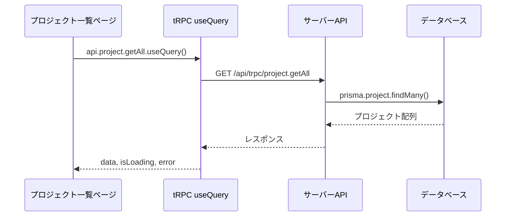

# Day 09: プロジェクト一覧画面を作ろう

## 🎯 今日のゴール

tRPC の `useQuery` を使ってサーバーからプロジェクトデータを取得し、カード形式で一覧表示します。グリッドレイアウトでレスポンシブ対応も実装します。


## 🤔 なぜこれを作るのか？

ここまでで認証の仕組みを学びました。いよいよアプリの中身を作っていきます。最初の機能は「プロジェクト管理」です。

> 💡 **例え話**: プロジェクト一覧は「本棚」です。本棚に並んだ本（プロジェクト）を一目で見渡し、1冊ずつ手に取って詳細を確認できます。まずは本棚を作りましょう。

### 📐 データ取得の流れ



### やること / やらないこと

| やること | やらないこと |
|---------|-------------|
| `useQuery` でデータ取得 | データの作成・編集（Day 10-11） |
| グリッドレイアウトで一覧表示 | 詳細ページの実装 |
| ローディング・エラー表示 | メンバー管理（Day 12） |
| ProjectCard コンポーネントの表示 | カードのデザインをゼロから作る |

### 🆕 新しく学ぶ概念

| 概念 | 読み方 | 役割 | 例え |
|------|--------|------|------|
| useQuery | ユーズ・クエリ | サーバーからデータを取得するフック | 図書館の検索端末。リクエストすると結果が返ってくる |
| グリッドレイアウト | — | 要素を格子状に並べるCSS | 本棚の棚板。横に何冊並べるかを画面幅で変える |

## 📊 実装ステップ一覧

| ステップ | 作業内容 | 所要時間 |
|---------|---------|---------|
| Step 1 | ページファイルを作成する | 3分 |
| Step 2 | tRPCでデータを取得する | 5分 |
| Step 3 | ローディング表示を作る | 3分 |
| Step 4 | プロジェクトカードを表示する | 7分 |
| Step 5 | グリッドレイアウトを適用する | 5分 |
| Step 6 | 空の状態を表示する | 3分 |
| Step 7 | 新規作成ボタンを追加する | 5分 |
| Step 8 | クエリパラメータで詳細を開く | 7分 |
| Step 9 | 動作確認 | 3分 |

**合計時間**: 約41分

---

### Step 1: ページファイルを作成する（3分）

🎯 **ゴール**: プロジェクト一覧ページの基本構造を作ります。

💻 **実装**:

```typescript
// filepath: src/app/project/page.tsx
// クライアントコンポーネント宣言とimport
'use client';

import { AppLayout } from
  '@/component/layout/app-layout';
import { Suspense } from 'react';

// メインコンテンツ
function ProjectPageContent() {
  return (
    <div className="space-y-6">
      <h1 className="text-3xl font-bold
        tracking-tight">
        プロジェクト
      </h1>
    </div>
  );
}
```

続いて、ページ本体をAppLayoutとSuspenseでラップして定義します。

```typescript
// filepath: src/app/project/page.tsx
// ページ本体
export default function ProjectPage() {
  return (
    <AppLayout>
      <Suspense fallback={
        <div className="flex h-[60vh]
          items-center justify-center">
          <div className="animate-spin
            rounded-full h-8 w-8
            border-b-2 border-primary" />
        </div>
      }>
        <ProjectPageContent />
      </Suspense>
    </AppLayout>
  );
}
```

> 💡 `AppLayout` で包むことで、サイドバーと認証ガードが自動で適用されます。Day 08 で学んだ仕組みですね。

✅ **確認ポイント**:
- ブラウザで `/project` にアクセスできる
- サイドバーが表示されている

---

### Step 2: tRPCでデータを取得する（5分）

🎯 **ゴール**: `useQuery` でプロジェクト一覧を取得します。

💻 **実装**:

```typescript
// filepath: src/app/project/page.tsx
import { api } from '@/trpc/react';

// ProjectPageContent内に追加
const {
  data: projects,  // プロジェクト配列
  isLoading,       // 読み込み中フラグ
  error,           // エラー情報
} = api.project.getAll.useQuery();
```

#### useQueryの返り値

| 返り値 | 型 | 説明 |
|--------|-----|------|
| `data` | `Project[] \| undefined` | 取得したデータ |
| `isLoading` | `boolean` | 初回読み込み中か |
| `error` | `TRPCClientError \| null` | エラー情報 |
| `isRefetching` | `boolean` | 再取得中か |

> 💡 `useQuery` はページ表示時に自動でAPIを呼びます。手動で `fetch` を書く必要はありません。

✅ **確認ポイント**:
- `npm run dev` でエラーが出ていない
- ブラウザのコンソールにデータが表示される（`console.log(projects)` で確認）

---

### Step 3: ローディング表示を作る（3分）

🎯 **ゴール**: データ読み込み中にスピナーを表示します。

💻 **実装**:

```typescript
// filepath: src/app/project/page.tsx
// ProjectPageContent内のreturnの前に追加
if (isLoading) {
  return (
    <AppLayout>
      <div className="flex h-[60vh]
        items-center justify-center">
        <div className="animate-spin
          rounded-full h-8 w-8
          border-b-2 border-primary" />
      </div>
    </AppLayout>
  );
}
```

> 💡 `animate-spin` は Tailwind CSS のクラスで、要素をくるくる回転させます。ローディングスピナーにぴったりです。

✅ **確認ポイント**:
- ページ読み込み時にスピナーが一瞬表示される
- データ取得後にスピナーが消える

---

### Step 4: プロジェクトカードを表示する（7分）

🎯 **ゴール**: 各プロジェクトをカード形式で表示します。

💻 **実装**:

```typescript
// filepath: src/app/project/page.tsx
import {
  ProjectCard,
} from '@/component/project/project-card';

// ProjectPageContent内のreturnに追加
{projects?.map((project) => (
  <ProjectCard
    key={project.id}
    id={project.id}
    name={project.name}
    description={project.description}
    color={project.color}
    memberCount={
      project.members?.length || 0}
    taskStats={{
      total:
        project.tasks?.length || 0,
      done:
        project.tasks?.filter(
          (t) => t.status === 'DONE'
        ).length || 0,
    }}
    onEdit={handleEdit}
    onDelete={handleDelete}
    onClick={handleProjectClick}
  />
))}
```

#### ProjectCardのprops

| prop | 型 | 説明 |
|------|-----|------|
| `name` | string | プロジェクト名 |
| `color` | string | カラーコード（`#1976d2` など） |
| `memberCount` | number | メンバー数 |
| `taskStats` | `{total, done}` | タスク進捗 |
| `onEdit` | function | 編集ボタンクリック時 |
| `onDelete` | function | 削除ボタンクリック時 |
| `onClick` | function | カードクリック時 |

✅ **確認ポイント**:
- プロジェクトがカード形式で表示されている
- カードに色帯・メンバー数・進捗が表示されている


---

### Step 5: グリッドレイアウトを適用する（5分）

🎯 **ゴール**: カードをレスポンシブなグリッドで配置します。

💻 **実装**:

```typescript
// filepath: src/app/project/page.tsx
// カードの親要素にグリッドを適用
<div className="grid gap-6
  sm:grid-cols-2
  lg:grid-cols-3
  xl:grid-cols-4">
  {projects?.map((project) => (
    <ProjectCard
      key={project.id}
      {/* ...props省略（Step4参照） */}
    />
  ))}
</div>
```

#### グリッドの画面幅別列数

| 画面幅 | クラス | 列数 |
|--------|-------|------|
| スマホ（~640px） | `grid-cols-1` | 1列 |
| タブレット（640px~） | `sm:grid-cols-2` | 2列 |
| PC（1024px~） | `lg:grid-cols-3` | 3列 |
| ワイド（1280px~） | `xl:grid-cols-4` | 4列 |

✅ **確認ポイント**:
- ブラウザ幅を変えるとカードの列数が変わる
- カード間に適切な余白がある

---

### Step 6: 空の状態を表示する（3分）

🎯 **ゴール**: プロジェクトがない場合のメッセージを表示します。

💻 **実装**:

```typescript
// filepath: src/app/project/page.tsx
// グリッドの前に条件分岐を追加
{projects && projects.length > 0 ? (
  <div className="grid gap-6 ...">
    {/* カード表示 */}
  </div>
) : (
  <div className="col-span-full flex
    flex-col items-center justify-center
    py-12 text-center
    text-muted-foreground">
    <p>プロジェクトが見つかりません。</p>
    <p>最初のプロジェクトを
      作成しましょう！</p>
  </div>
)}
```

✅ **確認ポイント**:
- プロジェクトがない場合にメッセージが表示される
- プロジェクトがある場合はカードが表示される

---

### Step 7: 新規作成ボタンを追加する（5分）

🎯 **ゴール**: プロジェクト作成ダイアログを開くボタンを配置します。

💻 **実装**:

```typescript
// filepath: src/app/project/page.tsx
import { Button } from '@/component/ui/button';
import { Plus } from 'lucide-react';
import { useState } from 'react';

// ProjectPageContent内にstateを追加
const [dialogOpen, setDialogOpen] =
  useState(false);

// ヘッダー部分に追加
<div className="flex justify-between
  items-center">
  <h1 className="text-3xl font-bold
    tracking-tight">
    プロジェクト
  </h1>
  <Button onClick={handleCreate}>
    <Plus className="mr-2 h-4 w-4" />
    新規プロジェクト
  </Button>
</div>
```

> 💡 Day 10 で `ProjectDialog` コンポーネントを追加して、このボタンと連携させます。

✅ **確認ポイント**:
- 「新規作成」ボタンが右上に表示されている
- ボタンをクリックすると `dialogOpen` が true になる

---

### Step 8: クエリパラメータで詳細を開く（7分）

🎯 **ゴール**: URL の `?projectId=xxx` でプロジェクトの詳細を直接開けるようにします。

💻 **実装**:

```typescript
// filepath: src/app/project/page.tsx
import { useSearchParams } from
  'next/navigation';

// ProjectPageContent内に追加
const searchParams = useSearchParams();
const projectIdParam =
  searchParams.get('projectId');

// URLにprojectIdがあれば詳細を開く
useEffect(() => {
  if (projectIdParam) {
    setSelectedProject(projectIdParam);
    setDetailOpen(true);
  }
}, [projectIdParam]);
```

> 💡 `/project?projectId=abc123` のようなURLでアクセスすると、自動的にそのプロジェクトの詳細が開きます。他のページからリンクする時に便利です。

✅ **確認ポイント**:
- `/project?projectId=xxx` でアクセスすると詳細が開く
- `/project` だけでアクセスすると一覧が表示される

---

### Step 9: 動作確認（3分）

🎯 **ゴール**: プロジェクト一覧の全機能を確認します。

以下の手順で確認してください。

1. `/project` にアクセスし、カードが表示されることを確認
2. ブラウザ幅を変えてレスポンシブ動作を確認
3. 「新規作成」ボタンが表示されていることを確認
4. プロジェクトカードに色帯・メンバー数・進捗が表示されることを確認


✅ **確認ポイント**:
- カードがグリッドで並んでいる
- ローディングスピナーが表示されてからデータが出る
- レスポンシブに列数が変わる

---

## 📋 今日のまとめ

- [ ] `useQuery` でサーバーからデータを取得できた
- [ ] グリッドレイアウトでカード一覧を表示できた
- [ ] ローディング・空状態を適切に表示できた
- [ ] クエリパラメータでURLから直接操作できた

## ⚠️ つまずきポイント

| エラー / 問題 | 原因 | 解決方法 |
|--------------|------|---------|
| データが表示されない | APIが呼ばれていない | `useQuery()` の呼び出しを確認 |
| `useSearchParams` エラー | Suspense 不足 | ページを `<Suspense>` でラップ |
| カードが縦一列になる | グリッドクラスの指定漏れ | `grid-cols-1 sm:grid-cols-2 ...` を確認 |
| TypeScript の型エラー | project の型が合わない | `api.project.getAll` の返り値の型を確認 |

## 📝 今日学んだ用語

| 用語 | 意味 |
|------|------|
| useQuery | tRPC/React Query のデータ取得フック |
| グリッドレイアウト | CSS Grid で要素を格子状に配置する仕組み |
| レスポンシブ | 画面幅に応じてレイアウトを変えるデザイン手法 |
| クエリパラメータ | URL の `?key=value` 形式のパラメータ |

## 🔜 次回予告

Day 10 では、プロジェクトの新規作成機能を実装します。ダイアログ（モーダル）を使ったフォーム入力と、tRPC の `useMutation` でデータを保存する方法を学びます。
