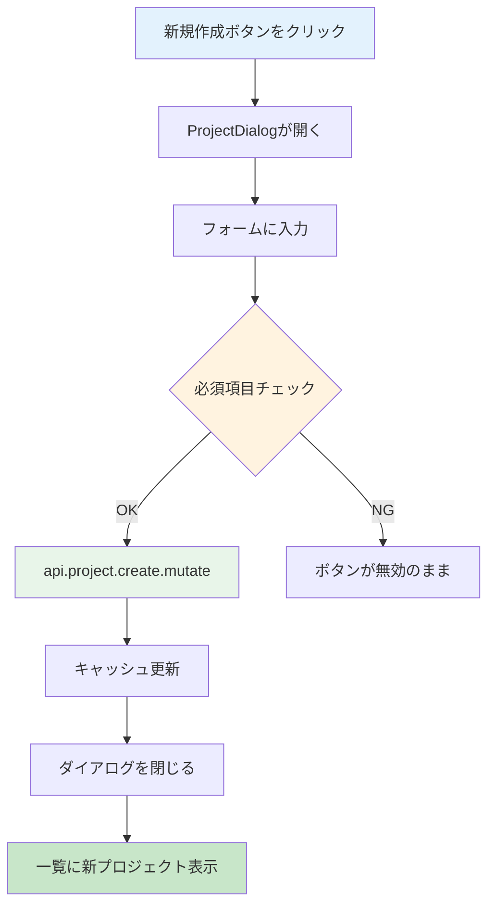

# Day 10: プロジェクト新規作成を実装しよう

## 🎯 今日のゴール

ダイアログ（モーダル）形式のフォームで、新しいプロジェクトを作成できるようにします。useState でフォーム状態を管理し、tRPC の `useMutation` でサーバーに保存します。


## 🤔 なぜこれを作るのか？

プロジェクトがなければタスクも管理できません。ここでは「ダイアログ」という新しいUIパターンを学びます。

> 💡 **例え話**: ダイアログは「付箋」のようなものです。ページ全体を移動せずに、今いる画面の上にメモ用紙をペタッと貼って書き込みます。書き終わったら付箋をはがすと、元の画面がそのまま残っています。

### 📐 プロジェクト作成の流れ



### やること / やらないこと

| やること | やらないこと |
|---------|-------------|
| ProjectDialog コンポーネントを作る | 別ページでフォームを作る |
| useState でフォーム状態を管理 | 外部ライブラリ（react-hook-form） |
| useMutation でサーバーに保存 | fetch を手書きする |
| キャッシュ無効化で一覧を自動更新 | 手動でページリロード |

### 🆕 新しく学ぶ概念

| 概念 | 読み方 | 役割 | 例え |
|------|--------|------|------|
| Dialog | ダイアログ | 画面上に重なるモーダル | 付箋。今の画面の上に貼って書き込む |
| キャッシュ無効化 | — | データ変更後に一覧を自動で再取得 | 掲示板の更新ボタン。新しい投稿を反映する |
| handleChange | ハンドル・チェンジ | 入力欄の値を state に反映する関数 | メモ用紙に書いた文字を記録する係 |

## 📊 実装ステップ一覧

| ステップ | 作業内容 | 所要時間 |
|---------|---------|---------|
| Step 1 | ProjectDialogの骨格を作る | 5分 |
| Step 2 | フォームの状態管理を設定する | 5分 |
| Step 3 | useEffectでフォームリセットを実装する | 5分 |
| Step 4 | 名前・説明の入力欄を作る | 7分 |
| Step 5 | カラーピッカーと日付欄を作る | 7分 |
| Step 6 | 送信処理を実装する | 5分 |
| Step 7 | ページにDialogを組み込む | 7分 |
| Step 8 | 動作確認 | 3分 |

**合計時間**: 約44分

---

### Step 1: ProjectDialogの骨格を作る（5分）

🎯 **ゴール**: ダイアログの基本構造を作ります。

> 💡 **例え話**: AppLayout は「建物の共通設備」でしたが、Dialog は「部屋の中で開く小窓」です。中に入力フォームを置いて、書き終わったら閉じます。

💻 **実装**:

```typescript
// filepath: src/component/project/project-dialog.tsx
'use client';

import { useEffect, useState } from 'react';
import { Button } from '@/component/ui/button';
import {
  Dialog,
  DialogContent,
  DialogDescription,
  DialogFooter,
  DialogHeader,
  DialogTitle,
} from '@/component/ui/dialog';
import { Input } from '@/component/ui/input';
import { Label } from '@/component/ui/label';
import { Textarea }
  from '@/component/ui/textarea';
```

続いて、Props の型定義を行います。

```typescript
// filepath: src/component/project/project-dialog.tsx
// Props の型定義
interface ProjectDialogProps {
  open: boolean;
  onClose: () => void;
  onSubmit: (data: ProjectFormData) => void;
  initialData?: ProjectFormData | undefined;
}

// フォームデータの型
export interface ProjectFormData {
  id?: string;
  name: string;
  description?: string;
  color: string;
  startDate?: string;
  endDate?: string;
}
```

> 💡 `onClose` は「ダイアログを閉じる」ためのコールバックです。親コンポーネントが `setDialogOpen(false)` を渡します。

✅ **確認ポイント**:
- `src/component/project/project-dialog.tsx` を作成した
- `ProjectDialogProps` と `ProjectFormData` を定義した

---

### Step 2: フォームの状態管理を設定する（5分）

🎯 **ゴール**: useState を使ってフォームの各入力値を管理します。

💻 **実装**:

```typescript
// filepath: src/component/project/project-dialog.tsx
// コンポーネント本体
export function ProjectDialog({
  open, onClose, onSubmit, initialData,
}: ProjectDialogProps) {
  const [formData, setFormData] =
    useState<ProjectFormData>({
      name: '',
      description: '',
      color: '#1976d2',
      ...initialData,
    });
```

```typescript
// filepath: src/component/project/project-dialog.tsx
  // 汎用の変更ハンドラー
  const handleChange =
    (field: keyof ProjectFormData) =>
    (e: React.ChangeEvent<
      HTMLInputElement | HTMLTextAreaElement
    >) => {
      setFormData({
        ...formData,
        [field]: e.target.value,
      });
    };
```

#### handleChange の仕組み

| 式 | 意味 |
|-----|------|
| `(field: keyof ProjectFormData)` | どのフィールドを更新するか |
| `(e: React.ChangeEvent<...>)` | 入力イベントの情報 |
| `{ ...formData, [field]: e.target.value }` | 既存データをコピーし、該当フィールドだけ上書き |

> 💡 これは**カリー化**というパターンです。`handleChange('name')` と呼ぶと、「name フィールドを更新する関数」が返ります。これを `onChange` に渡すことで、入力のたびに state が更新されます。

✅ **確認ポイント**:
- `useState` でフォーム状態を初期化した
- `handleChange` で任意のフィールドを更新できる仕組みを理解した

---

### Step 3: useEffectでフォームリセットを実装する（5分）

🎯 **ゴール**: ダイアログが開くたびに、フォームの値を適切にリセットします。

💻 **実装**:

```typescript
// filepath: src/component/project/project-dialog.tsx
// initialDataが変わったらフォームをリセット
useEffect(() => {
  if (initialData) {
    setFormData({ ...initialData });
  } else {
    setFormData({
      name: '',
      description: '',
      color: '#1976d2',
    });
  }
}, [initialData]);
```

> 💡 `useEffect` の依存配列に `[initialData]` を指定しています。「編集モード」では既存データがセットされ、「新規作成モード」では空の状態にリセットされます。

#### フォームリセットの動作

| モード | initialData | フォームの状態 |
|--------|------------|--------------|
| 新規作成 | undefined | 空（name: '', color: '#1976d2'） |
| 編集 | `{id:'...', name:'既存プロジェクト', ...}` | 既存データで埋まる |

✅ **確認ポイント**:
- 新規作成時はフォームが空になる
- 編集時は既存データが入る

---

### Step 4: 名前・説明の入力欄を作る（7分）

🎯 **ゴール**: プロジェクト名と説明の入力フォームを追加します。

💻 **実装**:

まず、フォーム送信ハンドラーを作ります。

```typescript
// filepath: src/component/project/project-dialog.tsx
// フォーム送信ハンドラー
const handleSubmit = (e: React.FormEvent) => {
  e.preventDefault();
  onSubmit(formData);
};
```

続いて、JSX を返します。Dialog の中にフォームを配置します。

```typescript
// filepath: src/component/project/project-dialog.tsx
return (
  <Dialog open={open}
    onOpenChange={(isOpen) =>
      !isOpen && onClose()}>
    <DialogContent
      className="sm:max-w-[600px]">
      <DialogHeader>
        <DialogTitle>
          {initialData?.id
            ? 'プロジェクト編集'
            : 'プロジェクト作成'}
        </DialogTitle>
        <DialogDescription>
          {initialData?.id
            ? 'プロジェクトの詳細を更新します。'
            : '新しいプロジェクトを作成します。'}
        </DialogDescription>
      </DialogHeader>
```

```typescript
// filepath: src/component/project/project-dialog.tsx
      <form onSubmit={handleSubmit}>
        <div className="grid gap-4 py-4">
          <div className="grid gap-2">
            <Label htmlFor="name">
              プロジェクト名
            </Label>
            <Input
              id="name"
              value={formData.name}
              onChange={handleChange('name')}
              placeholder="プロジェクト名を入力"
              required
            />
          </div>
```

説明欄を追加します。

```typescript
// filepath: src/component/project/project-dialog.tsx
          <div className="grid gap-2">
            <Label htmlFor="description">
              説明
            </Label>
            <Textarea
              id="description"
              value={
                formData.description || ''
              }
              onChange={
                handleChange('description')
              }
              placeholder=
                "プロジェクトの説明..."
              rows={4}
            />
          </div>
```

> 💡 `value` と `onChange` の組み合わせが「制御コンポーネント」です。React が入力値を管理するので、いつでも `formData.name` で最新の値を取得できます。`required` 属性を付けると、ブラウザが空欄チェックをしてくれます。

✅ **確認ポイント**:
- プロジェクト名の入力欄が表示される
- DialogDescription でモードに応じた説明文が表示される

---

### Step 5: カラーピッカーと日付欄を作る（7分）

🎯 **ゴール**: プロジェクトの色と期間を設定できるようにします。

💻 **実装**:

カラー・開始日・終了日を横並び3列で配置します。

```typescript
// filepath: src/component/project/project-dialog.tsx
          <div className=
            "grid grid-cols-3 gap-4">
            <div className="grid gap-2">
              <Label htmlFor="color">
                カラー
              </Label>
              <Input
                id="color"
                type="color"
                value={formData.color}
                onChange={
                  handleChange('color')
                }
                className="h-10"
              />
            </div>
```

```typescript
// filepath: src/component/project/project-dialog.tsx
            <div className="grid gap-2">
              <Label htmlFor="startDate">
                開始日
              </Label>
              <Input
                id="startDate"
                type="date"
                value={
                  formData.startDate || ''
                }
                onChange={
                  handleChange('startDate')
                }
              />
            </div>
```

続いて、終了日フィールドとフォーム全体の閉じタグを追加します。

```typescript
            <div className="grid gap-2">
              <Label htmlFor="endDate">
                終了日
              </Label>
              <Input
                id="endDate"
                type="date"
                value={
                  formData.endDate || ''
                }
                onChange={
                  handleChange('endDate')
                }
              />
            </div>
          </div>
        </div>
```

> 💡 `type="color"` を指定すると、ブラウザ標準のカラーピッカーが表示されます。`className="h-10"` で他の入力欄と高さを揃えています。

✅ **確認ポイント**:
- カラーピッカーで色を選べる
- 開始日・終了日を入力できる


---

### Step 6: 送信処理を実装する（5分）

🎯 **ゴール**: 送信ボタンとキャンセルボタンを追加します。

💻 **実装**:

```typescript
// filepath: src/component/project/project-dialog.tsx
        <DialogFooter>
          <Button type="button"
            variant="outline"
            onClick={onClose}>
            キャンセル
          </Button>
          <Button type="submit"
            disabled={!formData.name}>
            {initialData?.id
              ? '更新' : '作成'}
          </Button>
        </DialogFooter>
      </form>
    </DialogContent>
  </Dialog>
);
```

> 💡 `type="button"` を指定しないと、キャンセルボタンでもフォーム送信が実行されてしまいます。`disabled={!formData.name}` でプロジェクト名が空のときは送信ボタンを無効にしています。

#### ボタンの役割

| ボタン | type | 動作 |
|--------|------|------|
| キャンセル | `button` | ダイアログを閉じる（`onClose` を呼ぶ） |
| 作成 / 更新 | `submit` | フォーム送信（`handleSubmit` → `onSubmit`） |

✅ **確認ポイント**:
- 作成ボタンとキャンセルボタンが表示される
- プロジェクト名が空だと作成ボタンが無効になる
- キャンセルでダイアログが閉じる

---

### Step 7: ページにDialogを組み込む（7分）

🎯 **ゴール**: プロジェクト一覧ページにダイアログを組み込み、作成処理を実装します。

💻 **実装**:

```typescript
// filepath: src/app/project/page.tsx
import {
  ProjectDialog,
} from
  '@/component/project/project-dialog';
import type {
  ProjectFormData,
} from
  '@/component/project/project-dialog';
```

```typescript
// filepath: src/app/project/page.tsx
// ProjectPageContent内に追加
const utils = api.useUtils();
const createMutation =
  api.project.create.useMutation({
    onSuccess: () => {
      // 一覧を自動更新
      utils.project.getAll.invalidate();
      setDialogOpen(false);
    },
  });
```

送信ハンドラーを作ります。

```typescript
// filepath: src/app/project/page.tsx
// 送信ハンドラー
const handleSubmit = (
  data: ProjectFormData
) => {
  createMutation.mutate({
    name: data.name,
    description: data.description,
    color: data.color,
  });
};
```

JSX 内にダイアログを追加します。

```typescript
// filepath: src/app/project/page.tsx
// JSX内にダイアログを追加
<ProjectDialog
  open={dialogOpen}
  onClose={() => setDialogOpen(false)}
  onSubmit={handleSubmit}
/>
```

> 💡 `utils.project.getAll.invalidate()` はキャッシュ無効化です。これにより、作成後に一覧が自動で再取得され、新しいプロジェクトが表示されます。`onClose` には `setDialogOpen(false)` を渡して、ダイアログの開閉を管理します。

✅ **確認ポイント**:
- 新規作成ボタンでダイアログが開く
- フォーム送信でプロジェクトが作成される
- 一覧に新しいプロジェクトが表示される


---

### Step 8: 動作確認（3分）

🎯 **ゴール**: プロジェクト作成の全体フローを確認します。

1. 「新規プロジェクト」ボタンをクリック
2. プロジェクト名を入力し、色を選択
3. 「作成」ボタンをクリック
4. ダイアログが閉じ、一覧に新プロジェクトが表示される

✅ **確認ポイント**:
- プロジェクトが作成できる
- 一覧が自動で更新される
- カードに選んだ色が反映されている

---

## 📋 今日のまとめ

- [ ] Dialog コンポーネントでモーダルフォームを作れた
- [ ] useState + handleChange でフォーム状態を管理できた
- [ ] `useMutation` でサーバーにデータを保存できた
- [ ] `invalidate()` でキャッシュを自動更新できた

## ⚠️ つまずきポイント

| エラー / 問題 | 原因 | 解決方法 |
|--------------|------|---------|
| ダイアログが開かない | `open` prop が渡されていない | `open={dialogOpen}` を確認 |
| 作成後に一覧が更新されない | キャッシュ無効化の呼び忘れ | `utils.project.getAll.invalidate()` を追加 |
| カラーが保存されない | `handleChange('color')` の接続漏れ | Input に value と onChange を設定 |
| 入力しても値が変わらない | handleChange が正しく呼ばれていない | `onChange={handleChange('name')}` の形式を確認 |

## 📝 今日学んだ用語

| 用語 | 意味 |
|------|------|
| Dialog | 画面の上に重なるモーダルウィンドウ |
| useMutation | データの作成・更新・削除に使う tRPC フック |
| invalidate | キャッシュを無効にして再取得させる操作 |
| useUtils | tRPC のキャッシュ操作ユーティリティ |
| カリー化 | 引数を段階的に受け取る関数パターン |

## 🔜 次回予告

Day 11 では、プロジェクトの編集・削除機能を実装します。Day 10 で作った ProjectDialog を「編集モード」で再利用する方法を学びます。
