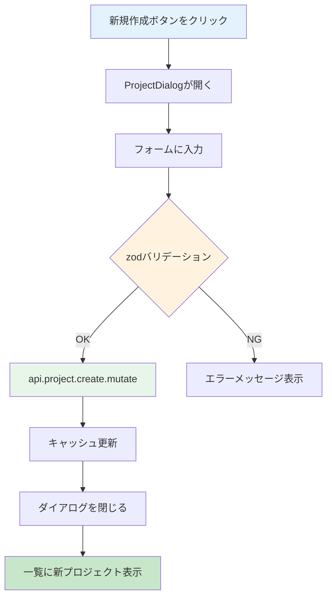

# Day 10: プロジェクト新規作成を実装しよう

## 🎯 今日のゴール

ダイアログ（モーダル）形式のフォームで、新しいプロジェクトを作成できるようにします。react-hook-form + zod でバリデーションを行い、tRPC の `useMutation` でサーバーに保存します。

【スクリーンショット: プロジェクト作成ダイアログ】

## 🤔 なぜこれを作るのか？

プロジェクトがなければタスクも管理できません。ここでは「ダイアログ」という新しいUIパターンを学びます。

> 💡 **例え話**: ダイアログは「付箋」のようなものです。ページ全体を移動せずに、今いる画面の上にメモ用紙をペタッと貼って書き込みます。書き終わったら付箋をはがすと、元の画面がそのまま残っています。

### 📐 プロジェクト作成の流れ



### やること / やらないこと

| やること | やらないこと |
|---------|-------------|
| ProjectDialog コンポーネントを作る | 別ページでフォームを作る |
| react-hook-form + zod でバリデーション | useState で個別管理 |
| useMutation でサーバーに保存 | fetch を手書きする |
| キャッシュ無効化で一覧を自動更新 | 手動でページリロード |

### 🆕 新しく学ぶ概念

| 概念 | 読み方 | 役割 | 例え |
|------|--------|------|------|
| Dialog | ダイアログ | 画面上に重なるモーダル | 付箋。今の画面の上に貼って書き込む |
| キャッシュ無効化 | — | データ変更後に一覧を自動で再取得 | 掲示板の更新ボタン。新しい投稿を反映する |

## 📊 実装ステップ一覧

| ステップ | 作業内容 | 所要時間 |
|---------|---------|---------|
| Step 1 | ProjectDialogの骨格を作る | 5分 |
| Step 2 | zodスキーマを定義する | 5分 |
| Step 3 | react-hook-formを設定する | 5分 |
| Step 4 | 名前・説明の入力欄を作る | 7分 |
| Step 5 | カラーピッカーと日付欄を作る | 7分 |
| Step 6 | 送信処理を実装する | 5分 |
| Step 7 | ページにDialogを組み込む | 7分 |
| Step 8 | 動作確認 | 3分 |

**合計時間**: 約44分

---

### Step 1: ProjectDialogの骨格を作る（5分）

🎯 **ゴール**: ダイアログの基本構造を作ります。

💻 **実装**:

```typescript
// filepath: src/component/project/project-dialog.tsx
'use client';

import {
  Dialog,
  DialogContent,
  DialogHeader,
  DialogTitle,
} from '@/component/ui/dialog';
import { Button } from '@/component/ui/button';

interface ProjectDialogProps {
  open: boolean;
  onOpenChange: (open: boolean) => void;
  onSubmit: (data: ProjectFormData) => void;
  initialData?: ProjectFormData;
}
```

```typescript
// filepath: src/component/project/project-dialog.tsx
// ダイアログコンポーネント
export function ProjectDialog({
  open, onOpenChange, onSubmit, initialData,
}: ProjectDialogProps) {
  return (
    <Dialog
      open={open}
      onOpenChange={onOpenChange}>
      <DialogContent>
        <DialogHeader>
          <DialogTitle>
            {initialData
              ? 'プロジェクト編集'
              : 'プロジェクト作成'}
          </DialogTitle>
        </DialogHeader>
        {/* フォームはStep3以降で追加 */}
      </DialogContent>
    </Dialog>
  );
}
```

> 💡 `initialData` があれば「編集モード」、なければ「作成モード」として動作します。1つのコンポーネントで両方に対応できます。

✅ **確認ポイント**:
- `src/component/project/project-dialog.tsx` を作成した
- `npm run dev` でエラーが出ていない

---

### Step 2: zodスキーマを定義する（5分）

🎯 **ゴール**: プロジェクトフォームのバリデーションルールを定義します。

💻 **実装**:

```typescript
// filepath: src/component/project/project-dialog.tsx
import { zodResolver } from
  '@hookform/resolvers/zod';
import { useForm } from 'react-hook-form';
import { z } from 'zod';

// バリデーションスキーマ
const projectSchema = z.object({
  name: z.string()
    .min(1, 'プロジェクト名は必須です'),
  description: z.string().optional(),
  color: z.string()
    .regex(/^#[0-9A-Fa-f]{6}$/)
    .default('#1976d2'),
  startDate: z.string().optional(),
  endDate: z.string().optional(),
});
```

```typescript
// filepath: src/component/project/project-dialog.tsx
// フォームデータの型
export interface ProjectFormData {
  id?: string;
  name: string;
  description?: string;
  color: string;
  startDate?: string;
  endDate?: string;
}
```

✅ **確認ポイント**:
- `projectSchema` を定義した
- `ProjectFormData` 型をエクスポートした

---

### Step 3: react-hook-formを設定する（5分）

🎯 **ゴール**: useForm を設定し、初期値を反映します。

💻 **実装**:

```typescript
// filepath: src/component/project/project-dialog.tsx
// ProjectDialog内に追加
const {
  register,
  handleSubmit,
  reset,
  formState: { errors },
} = useForm<ProjectFormData>({
  resolver: zodResolver(projectSchema),
  defaultValues: initialData || {
    name: '',
    description: '',
    color: '#1976d2',
  },
});
```

```typescript
// filepath: src/component/project/project-dialog.tsx
import { useEffect } from 'react';

// initialDataが変わったらフォームをリセット
useEffect(() => {
  if (initialData) {
    reset(initialData);
  } else {
    reset({
      name: '', description: '',
      color: '#1976d2',
    });
  }
}, [initialData, reset]);
```

> 💡 `reset` 関数で、ダイアログが開くたびにフォームの値をリセットします。編集時は既存データ、新規作成時は空の状態にします。

✅ **確認ポイント**:
- `useForm` に `resolver` と `defaultValues` を設定した
- `useEffect` でフォームリセットを実装した

---

### Step 4: 名前・説明の入力欄を作る（7分）

🎯 **ゴール**: プロジェクト名と説明の入力フォームを追加します。

💻 **実装**:

```typescript
// filepath: src/component/project/project-dialog.tsx
// UIコンポーネントのimport
import { Input } from '@/component/ui/input';
import { Label } from '@/component/ui/label';
import { Textarea } from
  '@/component/ui/textarea';
```

DialogContent内にフォームを追加し、プロジェクト名の入力欄を配置します。

```typescript
// filepath: src/component/project/project-dialog.tsx
// DialogContent内にフォームを追加
<form onSubmit={handleSubmit(onSubmit)}
  className="space-y-4">
  <div className="space-y-2">
    <Label htmlFor="name">
      プロジェクト名
      <span className="text-destructive">
        *
      </span>
    </Label>
    <Input
      id="name"
      {...register('name')}
    />
    {errors.name && (
      <p className="text-sm text-destructive">
        {errors.name.message}
      </p>
    )}
  </div>
</form>
```

説明欄を追加します。

```typescript
// filepath: src/component/project/project-dialog.tsx
// 名前入力欄の下に追加
<div className="space-y-2">
  <Label htmlFor="description">
    説明（任意）
  </Label>
  <Textarea
    id="description"
    {...register('description')}
    rows={3}
  />
</div>
```

✅ **確認ポイント**:
- プロジェクト名の入力欄が表示される
- 空で送信するとエラーメッセージが出る

---

### Step 5: カラーピッカーと日付欄を作る（7分）

🎯 **ゴール**: プロジェクトの色と期間を設定できるようにします。

💻 **実装**:

```typescript
// filepath: src/component/project/project-dialog.tsx
// 説明欄の下に追加
<div className="space-y-2">
  <Label htmlFor="color">カラー</Label>
  <div className="flex items-center gap-2">
    <input
      type="color"
      id="color"
      {...register('color')}
      className="w-10 h-10 rounded
        cursor-pointer"
    />
    <Input
      {...register('color')}
      className="flex-1"
    />
  </div>
</div>
```

```typescript
// filepath: src/component/project/project-dialog.tsx
// カラーの下に期間入力を追加
<div className="grid grid-cols-2 gap-4">
  <div className="space-y-2">
    <Label htmlFor="startDate">開始日</Label>
    <Input
      id="startDate"
      type="date"
      {...register('startDate')}
    />
  </div>
  <div className="space-y-2">
    <Label htmlFor="endDate">終了日</Label>
    <Input
      id="endDate"
      type="date"
      {...register('endDate')}
    />
  </div>
</div>
```

✅ **確認ポイント**:
- カラーピッカーで色を選べる
- 開始日・終了日を入力できる

【スクリーンショット: フォーム入力中のダイアログ】

---

### Step 6: 送信処理を実装する（5分）

🎯 **ゴール**: 送信ボタンとキャンセルボタンを追加します。

💻 **実装**:

```typescript
// filepath: src/component/project/project-dialog.tsx
// フォームの最後に追加
<div className="flex justify-end gap-2 pt-4">
  <Button
    type="button"
    variant="outline"
    onClick={() => onOpenChange(false)}>
    キャンセル
  </Button>
  <Button type="submit">
    {initialData ? '更新' : '作成'}
  </Button>
</div>
```

> 💡 `type="button"` を指定しないと、キャンセルボタンでもフォーム送信が実行されてしまいます。`type="button"` は明示的に「送信しない」ことを示します。

✅ **確認ポイント**:
- 作成ボタンとキャンセルボタンが表示される
- キャンセルでダイアログが閉じる

---

### Step 7: ページにDialogを組み込む（7分）

🎯 **ゴール**: プロジェクト一覧ページにダイアログを組み込み、作成処理を実装します。

💻 **実装**:

```typescript
// filepath: src/app/project/page.tsx
import {
  ProjectDialog,
} from '@/component/project/project-dialog';
import type {
  ProjectFormData,
} from '@/component/project/project-dialog';

// ProjectPageContent内に追加
const utils = api.useUtils();
const createMutation =
  api.project.create.useMutation({
    onSuccess: () => {
      // 一覧を自動更新
      utils.project.getAll.invalidate();
      setDialogOpen(false);
    },
  });
```

```typescript
// filepath: src/app/project/page.tsx
// 送信ハンドラー
const handleCreate = (
  data: ProjectFormData
) => {
  createMutation.mutate({
    name: data.name,
    description: data.description,
    color: data.color || '#1976d2',
    ownerId: session?.user?.id || '',
  });
};

// JSX内にダイアログを追加
<ProjectDialog
  open={dialogOpen}
  onOpenChange={setDialogOpen}
  onSubmit={handleCreate}
/>
```

> 💡 `utils.project.getAll.invalidate()` はキャッシュ無効化です。これにより、作成後に一覧が自動で再取得され、新しいプロジェクトが表示されます。

✅ **確認ポイント**:
- 新規作成ボタンでダイアログが開く
- フォーム送信でプロジェクトが作成される
- 一覧に新しいプロジェクトが表示される

【スクリーンショット: 作成後に一覧に追加されたプロジェクト】

---

### Step 8: 動作確認（3分）

🎯 **ゴール**: プロジェクト作成の全体フローを確認します。

1. 「新規作成」ボタンをクリック
2. プロジェクト名を入力し、色を選択
3. 「作成」ボタンをクリック
4. ダイアログが閉じ、一覧に新プロジェクトが表示される

✅ **確認ポイント**:
- プロジェクトが作成できる
- 一覧が自動で更新される
- カードに選んだ色が反映されている

---

## 📋 今日のまとめ

- [ ] Dialog コンポーネントでモーダルフォームを作れた
- [ ] react-hook-form + zod でバリデーションできた
- [ ] `useMutation` でサーバーにデータを保存できた
- [ ] `invalidate()` でキャッシュを自動更新できた

## ⚠️ つまずきポイント

| エラー / 問題 | 原因 | 解決方法 |
|--------------|------|---------|
| ダイアログが開かない | `open` prop が渡されていない | `open={dialogOpen}` を確認 |
| 作成後に一覧が更新されない | キャッシュ無効化の呼び忘れ | `utils.project.getAll.invalidate()` を追加 |
| カラーが保存されない | `register('color')` の接続漏れ | Input と color input の両方に register を設定 |
| `ownerId` エラー | セッション情報が取得できていない | `api.auth.getSession.useQuery()` を確認 |

## 📝 今日学んだ用語

| 用語 | 意味 |
|------|------|
| Dialog | 画面の上に重なるモーダルウィンドウ |
| useMutation | データの作成・更新・削除に使う tRPC フック |
| invalidate | キャッシュを無効にして再取得させる操作 |
| useUtils | tRPC のキャッシュ操作ユーティリティ |

## 🔗 次回予告

Day 11 では、プロジェクトの編集・削除機能を実装します。Day 10 で作った ProjectDialog を「編集モード」で再利用する方法を学びます。
