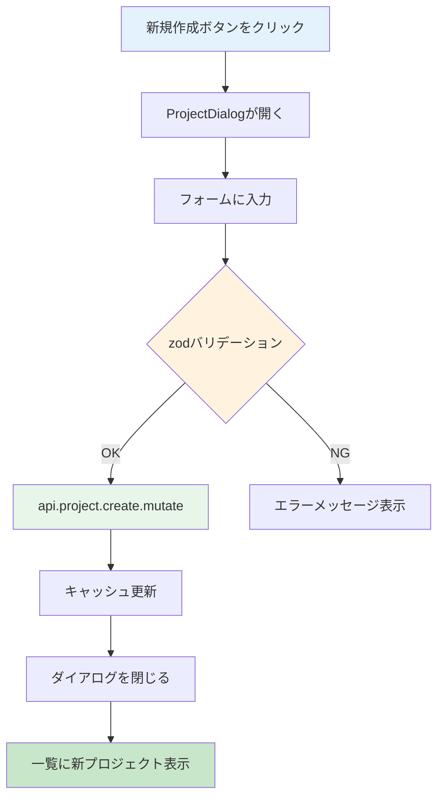

# Day 10: プロジェクト新規作成を実装しよう

## 前回の振り返り

Day 09 では tRPC の `useQuery` を使ってサーバーからプロジェクトデータを取得しました。あわせて `PageLoadingSpinner` によるローディング表示、グリッドレイアウトでのカード一覧、クエリパラメータによる詳細画面の自動オープンも実装しました。データの「読み取り」ができるようになったので、今日は「作成」に進みます。

---

## 今日のゴール

ダイアログ（モーダル）形式のフォームで、新しいプロジェクトを作成できるようにします。react-hook-form と zod でフォームのバリデーションと状態管理を担当し、tRPC の `useMutation` でサーバーに保存します。

【スクリーンショット】プロジェクト作成ダイアログ。


## なぜこれを作るのか

プロジェクトがなければタスクも管理できません。ここでは「ダイアログ」という新しいUIパターンを学びます。

> **例え話**: ダイアログは「付箋」のようなものです。ページ全体を移動せずに、今いる画面の上にメモ用紙をペタッと貼って書き込みます。書き終わったら付箋をはがすと、元の画面がそのまま残っています。

### プロジェクト作成の流れ



### やること / やらないこと

| やること | やらないこと |
|---------|-------------|
| ProjectDialog コンポーネントを作る | 別ページでフォームを作る |
| react-hook-form + zod でフォーム管理 | useState で手動管理 |
| useMutation でサーバーに保存 | fetch を手書きする |
| キャッシュ無効化で一覧を自動更新 | 手動でページリロード |

### 今日触るファイル

```
src/
├── app/
│   └── project/
│       └── page.tsx              ← 編集（Day 09 で作ったページに機能を追加）
├── component/
│   └── project/
│       └── project-dialog.tsx    ← 既存（今日内容を理解する）
└── lib/
    └── constant/
        └── project.ts            ← 既存（定数を利用する）
```

> 今日は Day 09 で作った `src/app/project/page.tsx` に、プロジェクト作成・編集機能を追加します。`project-dialog.tsx` はリポジトリに配布済みの scaffold ファイルで、中身を読み解きながら `page.tsx` と連携させます。

> **今日のゴールライン**: 既存コードを「全部理解する」必要はありません。「この部品がこう動く」が見えたら十分。細かい型やユーティリティは使いながら慣れていきます。

### 新しく学ぶ概念

| 概念 | 読み方 | 役割 | 例え |
|------|--------|------|------|
| Dialog | ダイアログ | 画面上に重なるモーダル | 付箋。今の画面の上に貼って書き込む |
| zodResolver | ゾッド・リゾルバー | zod スキーマで入力値を自動検証する仕組み | 記入用紙のチェック係。書き漏れがあれば教えてくれる |
| register | レジスター | 入力欄を react-hook-form に登録する関数 | 記入欄に名札を付けて、どの欄かを管理する |
| キャッシュ無効化 | — | データ変更後に一覧を自動で再取得 | 掲示板の更新ボタン。新しい投稿を反映する |

> **今日のゴールライン**: 今日は既存のコードを読む場面が多いです。「なぜこう書いてあるか」は全部わからなくて OK。「ダイアログでプロジェクトを作成できた」という結果が出たら今日の勝ち。読解力は Day 11 以降で同じパターンを繰り返すうちについてきます。

## 実装ステップ一覧

| ステップ | 作業内容 | 所要時間 |
|---------|---------|---------|
| Step 0 | プロジェクト作成 API（create）を自分で書く | 12分 |
| Step 1 | ProjectDialogの骨格を作る | 5分 |
| Step 2 | zodスキーマとフォーム設定を作る | 5分 |
| Step 3 | values propで初期値を自動同期する | 5分 |
| Step 4 | 名前・説明の入力欄を作る | 7分 |
| Step 5 | カラーピッカーと日付欄を作る | 7分 |
| Step 6 | 送信処理を実装する | 5分 |
| Step 7 | ページにDialogを組み込む | 7分 |
| Step 8 | 動作確認 | 3分 |

**合計時間**は約56分です。

---

### Step 0: プロジェクト作成 API（create）を自分で書く（12分）

**ゴール**: `src/server/api/routers/project.ts` に `create` を追加し、`api.project.create` を呼べる状態にします。

Day 09 で書いた `getAll` は、3部品（入力・処理・戻り値）のうち処理が「探す（`.query`）」でした。今日の `create` は「作る（`.mutation`）」になるだけで、骨組みは同じです。

#### 0-1. 入力スキーマを追加する

まず、受け取るデータの形を zod で定義します。`project.ts` の `USER_SELECT` の import の下に追加します。

```typescript
// filepath: src/server/api/routers/project.ts（続き）
import { DEFAULT_PROJECT_COLOR } from '@/lib/constant/project';
import { PROJECT_MEMBER_ROLE } from '@/lib/constant/roles';

const projectCreateSchema = z.object({
  name: z.string().min(1, 'プロジェクト名は必須です'),
  description: z.string().optional(),
  color: z
    .string()
    .regex(/^#[0-9A-F]{6}$/i)
    .default(DEFAULT_PROJECT_COLOR),
  startDate: z.string().datetime().optional(),
  endDate: z.string().datetime().optional(),
});
```

`name` に `.min(1, ...)` が付いているのは、空文字のプロジェクト名を作れないようにするためです。`color` の `.regex(/^#[0-9A-F]{6}$/i)` は「`#` に続いて英数字6桁」という色コードの形をチェックします。これが無いと、フロント側のバリデーションを迂回して変な文字列が color に入ってしまいます。`.default(DEFAULT_PROJECT_COLOR)` は、色を指定しなかったときに使う既定色です。

#### 0-2. ここが一番のヤマ場（作った本人をメンバーに入れる）

`create` の処理本体です。ここで一番大事なのは、プロジェクトを作るのと同時に、作った本人をメンバーとして登録する部分です。

```typescript
// filepath: src/server/api/routers/project.ts（続き）
  create: protectedProcedure.input(projectCreateSchema).mutation(async ({ ctx, input }) => {
    const createData: Prisma.ProjectCreateInput = {
      name: input.name,
      color: input.color,
      startDate: input.startDate ? new Date(input.startDate) : null,
      endDate: input.endDate ? new Date(input.endDate) : null,
      members: {
        create: {
          userId: ctx.session.userId,
          role: PROJECT_MEMBER_ROLE.OWNER,
        },
      },
    };
```

`members: { create: { ... } }` は、プロジェクト本体を作るのと同時に、関連する `ProjectMember` の行も1件同時に作る書き方です。プロジェクトとメンバーは別々のテーブルなので、放っておくと2回に分けて書き込む必要がありますが、Prisma はこの入れ子の `create` でまとめて1回の書き込みにできます。

なぜここが一番のヤマ場かというと、Day 09 で書いた `getAll` を思い出すと分かります。`getAll` は「自分がメンバーのプロジェクトだけ」を返す条件になっていました。もしここで `members.create` を忘れると、プロジェクトは作成されるのに、作った本人がメンバーに入っていないので `getAll` の一覧には表示されません。「作ったのに一覧に出てこない」という不具合の原因は、たいていこの登録漏れです。`role: PROJECT_MEMBER_ROLE.OWNER` で、作成者にはオーナー権限を与えます。

#### 0-3. description は値があるときだけ入れる

`description` は入力が任意なので、扱い方を分けます。

```typescript
// filepath: src/server/api/routers/project.ts（続き）
    if (input.description) {
      createData.description = input.description;
    }

    return await prisma.project.create({
      data: createData,
      include: {
        members: {
          include: {
            user: {
              select: USER_SELECT,
            },
          },
        },
      },
    });
  }),
```

最初に作る `createData` には `description` を含めず、値が入力されているときだけ後から足しています。空文字や未入力のまま `description: input.description` と書いてしまうと、データが無いことを表す値（空文字や `undefined`）がわざわざ DB に書き込まれてしまいます。値があるときだけキー自体を足すと、無いものは無いまま扱われます。これは Day 09 の `update` パターン（値がある項目だけ更新オブジェクトに足す書き方）と同じ考え方です。`include` は `getAll` と同じ形にしています。API を呼ぶ側は、一覧で見るデータと作成直後に返るデータの形が揃っているほうが扱いやすいからです。最後の `}),` で `create` を閉じます。

`root.ts` は Day 09 で `project` を登録済みなので、今日は変更しません。

**確認ポイント**:
- `projectCreateSchema` と `create` を追加し、`getAll` の直後に `}),` `});` まで閉じた
- `members.create` で `userId` と `role: PROJECT_MEMBER_ROLE.OWNER` を渡している
- `npm run dev` で型エラーが出ていない

---

### Step 1: ProjectDialogの骨格を作る（5分）

**ゴール**: ダイアログの基本構造を作ります。

> **例え話**: AppLayout は「建物の共通設備」でしたが、Dialog は「部屋の中で開く小窓」です。中に入力フォームを置いて、書き終わったら閉じます。

**実装**:

```typescript
// filepath: src/component/project/project-dialog.tsx
'use client';

// フォームバリデーション関連
import { zodResolver }
  from '@hookform/resolvers/zod';
import { useForm } from 'react-hook-form';
import { z } from 'zod';
// shadcn/uiコンポーネント
import { Button }
  from '@/component/ui/button';
import {
  Dialog, DialogContent,
  DialogDescription, DialogFooter,
  DialogHeader, DialogTitle,
} from '@/component/ui/dialog';
import { Input }
  from '@/component/ui/input';
import { Label }
  from '@/component/ui/label';
import { Textarea }
  from '@/component/ui/textarea';
// プロジェクトのデフォルト色
import { DEFAULT_PROJECT_COLOR }
  from '@/lib/constant/project';
```

**確認ポイント**:
- コードの内容を確認した
- 全てのimportが確認できた

続いて、Props の型定義を確認します。

```typescript
// filepath: src/component/project/project-dialog.tsx
// Props の型定義
interface ProjectDialogProps {
  open: boolean;
  onClose: () => void;
  onSubmit: (data: ProjectFormData) => void;
  initialData?:
    ProjectFormData | undefined;
}

// フォームデータの型
export interface ProjectFormData {
  id?: string;
  name: string;
  description?: string;
  color: string;
  startDate?: string;
  endDate?: string;
}
```

> `onClose` は「ダイアログを閉じる」ためのコールバックです。親コンポーネントが `setDialogOpen(false)` を渡します。

**確認ポイント**:
- `src/component/project/project-dialog.tsx` の内容を確認した
- `ProjectDialogProps` と `ProjectFormData` の定義を理解した

---

### Step 2: zodスキーマとフォーム設定を作る（5分）

**ゴール**: zod でバリデーションルールを定義し、react-hook-form で入力管理します。

**実装**:

```typescript
// filepath: src/component/project/project-dialog.tsx
// zodスキーマでバリデーションルールを定義
const projectFormSchema = z.object({
  id: z.string().optional(),
  name: z.string().min(1,
    'プロジェクト名は必須です'),
  description: z.string().optional(),
  color: z.string(),
  startDate: z.string().optional(),
  endDate: z.string().optional(),
});

// スキーマから型を自動生成
type ProjectFormValues =
  z.infer<typeof projectFormSchema>;
```

**確認ポイント**:
- `projectFormSchema` を定義した
- `name` フィールドに `min(1)` バリデーションが設定されている

#### zodスキーマの各フィールド

| フィールド | バリデーション | 意味 |
|-----------|-------------|------|
| `name` | `z.string().min(1, ...)` | 1文字以上必須 |
| `description` | `z.string().optional()` | 入力は任意 |
| `color` | `z.string()` | 色コード（必須） |
| `startDate` | `z.string().optional()` | 開始日（任意） |
| `endDate` | `z.string().optional()` | 終了日（任意） |

> `z.infer<typeof projectFormSchema>` は、zod スキーマから TypeScript の型を自動生成する機能です。スキーマと型が常に一致するので、ズレが起きません。

---

### Step 3: defaultValues と reset で初期値を同期する（5分）

**ゴール**: `useForm` の `defaultValues` と `useEffect(reset)` を使って、ダイアログが開くたびにフォームの初期値を同期します。

**実装**:

```typescript
// filepath: src/component/project/project-dialog.tsx
// コンポーネント本体
export function ProjectDialog({
  open, onClose, onSubmit, initialData,
}: ProjectDialogProps) {
  const {
    register, handleSubmit, reset,
    formState: { errors },
  } = useForm<ProjectFormValues>({
    resolver: zodResolver(
      projectFormSchema),
    defaultValues:
      buildProjectFormValues(initialData),
  });

  useEffect(() => {
    if (!open) {
      return;
    }

    reset(
      buildProjectFormValues(initialData)
    );
  }, [initialData, open, reset]);
```

**確認ポイント**:
- `useForm` に `resolver` と `defaultValues` が設定されている
- ダイアログが開いていて `initialData` が変わったときに `reset(...)` を呼んでいる
- `register`, `handleSubmit`, `reset`, `errors` を取得している

#### useForm の設定

| 設定 | 役割 |
|------|------|
| `resolver: zodResolver(...)` | zodスキーマでバリデーションを実行 |
| `defaultValues` | フォームを最初に作るときの初期値 |
| `reset(...)` | ダイアログを開き直して `initialData` が変わったとき、フォームの値を同期 |
| `buildProjectFormValues(...)` | 作成・編集どちらでも同じ形のフォーム初期値を作る関数 |

> `defaultValues` はフォーム作成時の初期値です。ただし同じダイアログを別プロジェクトで開き直すと `initialData` が変わるため、`useEffect` の中で `reset(...)` を呼んで再同期します。`setState` で入力値を1つずつ持つのではなく、react-hook-form にまとめて管理させるのがポイントです。`DEFAULT_PROJECT_COLOR` がカラーの初期値として使われている点にも注目してください。

---

### Step 4: 名前・説明の入力欄を作る（7分）

**ゴール**: プロジェクト名と説明の入力フォームを追加します。

**実装**:

まず、ダイアログを閉じるハンドラーと送信ハンドラーを作ります。

```typescript
// filepath: src/component/project/project-dialog.tsx
// ダイアログを閉じるハンドラー
const handleClose = () => {
  reset();
  onClose();
};

// フォーム送信ハンドラー
const handleFormSubmit =
  (data: ProjectFormValues) => {
    const submitData: ProjectFormData = {
      ...(data.id !== undefined
        && { id: data.id }),
      name: data.name,
      color: data.color,
      ...(data.description
        && { description:
          data.description }),
      ...(data.startDate
        && { startDate: data.startDate }),
      ...(data.endDate
        && { endDate: data.endDate }),
    };
    onSubmit(submitData);
  };
```

**確認ポイント**:
- `handleClose` でフォームのリセットとダイアログの閉じが両方行われる
- `...(data.description && { description: data.description })` は「description が入力されている場合だけプロパティを含める」条件付きスプレッド。`&&` はこの場面で null/undefined を埋める働きとは違い、「真なら含める」という意味で使う。`??` とは用途が異なる

続いて、JSX を返します。Dialog の中にフォームを配置します。

```typescript
// filepath: src/component/project/project-dialog.tsx
return (
  <Dialog open={open}
    onOpenChange={(isOpen) =>
      !isOpen && handleClose()}>
    <DialogContent
      className="sm:max-w-[600px]">
      <DialogHeader>
        <DialogTitle>
          {initialData?.id
            ? 'プロジェクト編集'
            : 'プロジェクト作成'}
        </DialogTitle>
        <DialogDescription>
          {initialData?.id
            ? 'プロジェクトの詳細を更新します。'
            : '新しいプロジェクトを作成します。'}
        </DialogDescription>
      </DialogHeader>
```

**確認ポイント**:
- `Dialog` の `onOpenChange` で閉じ動作をハンドリングしている
- `initialData?.id` の有無でタイトルが「作成」と「編集」に切り替わる

プロジェクト名の入力欄です。`{...register('name')}` でフォームに登録します。

```typescript
// filepath: src/component/project/project-dialog.tsx
      <form onSubmit={
        handleSubmit(handleFormSubmit)}>
        <div className="grid gap-4 py-4">
          <div className="grid gap-2">
            <Label htmlFor="name">
              プロジェクト名
            </Label>
            <Input id="name"
              placeholder=
                "プロジェクト名を入力"
              {...register('name')} />
            {errors.name && (
              <p className=
                "text-sm text-destructive">
                {errors.name.message}
              </p>
            )}
          </div>
```

**確認ポイント**:
- `{...register('name')}` でフォームに登録されている
- `errors.name` でバリデーションエラーを表示している

説明欄を追加します。

```typescript
// filepath: src/component/project/project-dialog.tsx
          <div className="grid gap-2">
            <Label htmlFor="description">
              説明
            </Label>
            <Textarea
              id="description"
              placeholder=
                "プロジェクトの説明..."
              rows={4}
              {...register('description')}
            />
          </div>
```

**確認ポイント**:
- `Textarea` に `{...register('description')}` が設定されている

> `{...register('name')}` は、入力欄に `name`, `onChange`, `onBlur`, `ref` をまとめて設定するスプレッド構文です。`value` と `onChange` を手動で書く必要がなくなります。

**確認ポイント**:
- プロジェクト名の入力欄が表示される
- 名前が空のまま送信するとエラーメッセージが表示される
- DialogDescription でモードに応じた説明文が表示される

---

### Step 5: カラーピッカーと日付欄を作る（7分）

**ゴール**: プロジェクトの色と期間を設定できるようにします。

**実装**:

カラー・開始日・終了日を横並び3列で配置します。

```typescript
// filepath: src/component/project/project-dialog.tsx
          <div className=
            "grid grid-cols-3 gap-4">
            <div className="grid gap-2">
              <Label htmlFor="color">
                カラー
              </Label>
              <Input id="color"
                type="color"
                className="h-10"
                {...register('color')} />
            </div>
```

**確認ポイント**:
- `type="color"` でカラーピッカーが表示される

```typescript
// filepath: src/component/project/project-dialog.tsx
            <div className="grid gap-2">
              <Label htmlFor="startDate">
                開始日
              </Label>
              <Input id="startDate"
                type="date"
                {...register('startDate')}
              />
            </div>
```

**確認ポイント**:
- `type="date"` で日付ピッカーが表示される

続いて、終了日フィールドとフォーム全体の閉じタグを追加します。

```typescript
// filepath: src/component/project/project-dialog.tsx
            <div className="grid gap-2">
              <Label htmlFor="endDate">
                終了日
              </Label>
              <Input id="endDate"
                type="date"
                {...register('endDate')}
              />
            </div>
          </div>
        </div>
```

> `type="color"` を指定すると、ブラウザ標準のカラーピッカーが表示されます。`className="h-10"` で他の入力欄と高さを揃えています。`{...register('color')}` で、選んだ色が自動的にフォームの値として管理されます。

**確認ポイント**:
- カラーピッカーで色を選べる
- 開始日・終了日を入力できる

【スクリーンショット】フォーム入力中のダイアログ。


---

### Step 6: 送信処理を実装する（5分）

**ゴール**: 送信ボタンとキャンセルボタンを追加します。

**実装**:

```typescript
// filepath: src/component/project/project-dialog.tsx
        <DialogFooter>
          <Button type="button"
            variant="outline"
            onClick={handleClose}>
            キャンセル
          </Button>
          <Button type="submit">
            {initialData?.id
              ? '更新' : '作成'}
          </Button>
        </DialogFooter>
      </form>
    </DialogContent>
  </Dialog>
);
```

**確認ポイント**:
- 作成ボタンとキャンセルボタンが表示される
- プロジェクト名が空のまま送信するとzodのエラーメッセージが表示される
- キャンセルでダイアログが閉じ、フォームがリセットされる
- キャンセル後にダイアログを再度開くと、前回の入力内容がクリアされている

#### ボタンの役割

| ボタン | type | 動作 |
|--------|------|------|
| キャンセル | `button` | `handleClose` でフォームをリセットし、ダイアログを閉じる |
| 作成 / 更新 | `submit` | `handleSubmit` → zodバリデーション → `handleFormSubmit` |

> `type="button"` を指定しないと、キャンセルボタンでもフォーム送信が実行されてしまいます。キャンセル時は `handleClose` で `reset()` を呼び、フォームの入力内容をクリアしてから閉じます。

---

### Step 7: ページにDialogを組み込む（7分）

**ゴール**: プロジェクト一覧ページにダイアログを組み込み、作成処理を実装します。

Day 09 では「新規プロジェクト」ボタンを押すと
`dialogOpen` が `true` になるところまで作りました。
今日はその state に `ProjectDialog` をつなぎます。

**実装**:

```typescript
// filepath: src/app/project/page.tsx
// import群に追加
import {
  ProjectDialog,
  type ProjectFormData,
} from
  '@/component/project/project-dialog';
import {
  dateOnlyToUtcStartIso,
} from '@/lib/date';
```

**確認ポイント**:
- importを追加した

```typescript
// filepath: src/app/project/page.tsx
// ProjectPageContent内、dialogOpen state の下に追加
// tRPCのキャッシュ操作ユーティリティ
const utils = api.useUtils();

// プロジェクト作成mutation
const createMutation =
  api.project.create.useMutation({
    onSuccess: () => {
      // 一覧キャッシュを無効化して再取得
      utils.project.getAll.invalidate();
      setDialogOpen(false);
    },
  });
```

**確認ポイント**:
- `useUtils` でキャッシュ操作ユーティリティを取得している
- `onSuccess` でキャッシュ無効化とダイアログ閉じを行っている

次に、送信ハンドラーを追加します。
Day 10 では新規作成だけを扱います。
編集処理は Day 11 で追加します。

```typescript
// filepath: src/app/project/page.tsx
// createMutation の下に追加
const handleSubmit = (
  data: ProjectFormData
) => {
  createMutation.mutate({
    name: data.name,
    description: data.description,
    color: data.color,
    startDate: data.startDate
      ? dateOnlyToUtcStartIso(
          data.startDate)
      : undefined,
    endDate: data.endDate
      ? dateOnlyToUtcStartIso(
          data.endDate)
      : undefined,
  });
};
```

**確認ポイント**:
- `handleSubmit` が `createMutation.mutate` を呼んでいる
- 日付未入力は `undefined` で渡している

> `new Date(data.startDate).toISOString()` のように日付文字列をそのまま変換すると、ローカルの 00:00 として作られた Date が UTC へ変換され、タイムゾーン差で別の日付になることがあります。日付だけを扱う入力では、`dateOnlyToUtcStartIso` のような専用ヘルパーで UTC の時刻を明示します。

最後に JSX 内へ `ProjectDialog` を組み込みます。

```typescript
// filepath: src/app/project/page.tsx
// JSX内（AppLayoutの閉じタグの前）
<ProjectDialog
  open={dialogOpen}
  onClose={() => setDialogOpen(false)}
  onSubmit={handleSubmit}
/>
```

> `utils.project.getAll.invalidate()` はキャッシュの無効化です。これを呼ぶと、作成後に一覧が自動で取り直され、新しいプロジェクトが表示されます。Day 11 では `initialData` に編集対象のプロジェクトを渡して、同じダイアログを編集にも再利用します。

**確認ポイント**:
- 新規作成ボタンでダイアログが開く
- フォーム送信でプロジェクトが作成される
- 一覧に新しいプロジェクトが表示される

【スクリーンショット】作成後の一覧に追加されたプロジェクト。


---

### Step 8: 動作確認（3分）

**ゴール**: プロジェクト作成の全体フローを確認します。

開発サーバーを起動します。

```bash
# filepath: ターミナル
# 開発サーバーを起動
PORT=3001 npm run dev
```

**確認ポイント**:
- `http://localhost:3001` にアクセスできる

以下の手順で動作を確認してください。

| # | 操作 | 期待される結果 |
|---|------|--------------|
| 1 | 「新規プロジェクト」ボタンをクリック | ダイアログが開く |
| 2 | プロジェクト名を空のまま「作成」 | エラーメッセージが表示される |
| 3 | プロジェクト名を入力し、色を選択 | エラーが消える |
| 4 | 「作成」ボタンをクリック | ダイアログが閉じる |
| 5 | 一覧を確認 | 新しいプロジェクトが追加されている |
| 6 | カードの色帯を確認 | 選んだ色が反映されている |

【スクリーンショット】完成した作成フロー。


**確認ポイント**:
- プロジェクトが作成できる
- 一覧が自動で更新される（ページリロードなし）
- カードに選んだ色が反映されている
- キャンセルで入力がリセットされる


---

### Pro パターンで書こう（作成後はリロードせず一覧キャッシュを更新する）

ここまでで動くコードは書けました。でもプロの現場では、もう一段上の書き方をします。
なぜ上の書き方をするのか、**Before/After** で見比べてみましょう。

### Before（動くけど、プロは書かない）

```typescript
'use client';

import { api } from '@/trpc/react';

type ProjectFormData = {
  name: string;
  description?: string;
  color: string;
  startDate?: string;
  endDate?: string;
};

export function useCreateProjectSubmit(onClose: () => void) {
  const createMutation = api.project.create.useMutation({
    onSuccess: () => {
      onClose();
      window.location.reload();
    },
  });

  const submitProject = (data: ProjectFormData) => {
    createMutation.mutate({
      name: data.name,
      description: data.description,
```

**読み比べ用**: ここは写経しません。続けてコードを読み進めましょう。

```typescript
// filepath: 続き
      color: data.color,
      startDate: data.startDate,
      endDate: data.endDate,
    });
  };

  return {
    submitProject,
    isPending: createMutation.isPending,
  };
}
```

**このコードの問題点**:

- 作成後にページ全体をリロードするので、一覧以外の状態まで全部リセットされる
- フィルターやスクロール位置が消えて、ユーザーが今いた場所を見失いやすい
- tRPCのキャッシュを使っているのに、ブラウザ再読み込みで力技の更新になっている

### After（プロが書くコード）

```typescript
'use client';

import { api } from '@/trpc/react';

type ProjectFormData = {
  name: string;
  description?: string;
  color: string;
  startDate?: string;
  endDate?: string;
};

export function useCreateProjectSubmit(onClose: () => void) {
  const utils = api.useUtils();

  const createMutation = api.project.create.useMutation({
    onSuccess: () => {
      void utils.project.getAll.invalidate();
      onClose();
    },
  });

  const submitProject = (data: ProjectFormData) => {
    createMutation.mutate({
```

**読み比べ用**: ここは写経しません。続けてコードを読み進めましょう。

```typescript
// filepath: 続き
      name: data.name,
      description: data.description,
      color: data.color,
      startDate: data.startDate,
      endDate: data.endDate,
    });
  };

  return {
    submitProject,
    isPending: createMutation.isPending,
  };
}
```

**このコードの強み**:

- `project.getAll` のキャッシュだけを無効化するので、必要な一覧だけ再取得できる
- ダイアログを閉じてもページ全体は残るため、表示条件や操作中の流れが途切れにくい
- 作成、更新、削除でも同じ `mutation + invalidate` の型を使い回せる

#### 覚えておきたいエッセンス

データを変えた後は、ページを丸ごとリロードするより **変わった一覧だけ再取得する** ほうが自然です。
tRPCでは `mutation` の成功時に `invalidate()` を呼ぶ、この形を覚えておきましょう。

## 今日のまとめ

- [ ] Dialog コンポーネントでモーダルフォームを作れた
- [ ] react-hook-form + zodResolver でフォームのバリデーションを実装できた
- [ ] `register` で入力欄をフォームに登録できた
- [ ] `useMutation` でサーバーにデータを保存できた
- [ ] `invalidate()` でキャッシュを自動更新できた

## つまずきポイント

| エラー / 問題 | 原因 | 解決方法 |
|--------------|------|---------|
| ダイアログが開かない | `open` prop が渡されていない | `open={dialogOpen}` を確認 |
| `dialogOpen is not defined` | state 宣言が漏れている | Day 09 Step 7 で `useState(false)` を宣言したか確認 |
| 作成後に一覧が更新されない | キャッシュ無効化の呼び忘れ | `utils.project.getAll.invalidate()` を追加 |
| バリデーションが効かない | `resolver` の設定漏れ | `resolver: zodResolver(projectFormSchema)` を確認 |
| 入力しても値が反映されない | `register` の接続漏れ | `{...register('name')}` のスプレッド構文を確認 |
| 作成ボタンを押しても何も起きない | `currentUser` が null | ログイン状態を確認 |

## 今日学んだ用語

| 用語 | 意味 |
|------|------|
| Dialog | 画面の上に重なるモーダルウィンドウ |
| useMutation | データの作成・更新・削除に使う tRPC フック |
| invalidate | キャッシュを無効にして再取得させる操作 |
| useUtils | tRPC のキャッシュ操作ユーティリティ |
| zodResolver | zod スキーマを react-hook-form に接続するアダプター |
| register | 入力欄を react-hook-form に登録する関数 |

## 次回予告

Day 11 では、プロジェクトの編集・削除機能を実装します。Day 10 で作った ProjectDialog を「編集モード」で再利用する方法を学びます。

---

## Day 10 完成形コード（参照用）

Day 10 終了時点の各ファイルの完成形です。

### `src/server/api/routers/project.ts`

Day 10 終了時点の状態は、このリポジトリの `src/server/api/routers/project.ts` の `getAll` と `create` の部分と同じです。`update` 以降は Day 11 で追加するので、まだ存在しません。

### `src/component/project/project-dialog.tsx`

Day 10 終了時点の状態は、このリポジトリの `src/component/project/project-dialog.tsx` と同じです。手元のコードと見比べて確認してください。

### `src/app/project/page.tsx`

Day 10 終了時点の状態は、このリポジトリの `src/app/project/page.tsx` と同じです。手元のコードと見比べて確認してください。
