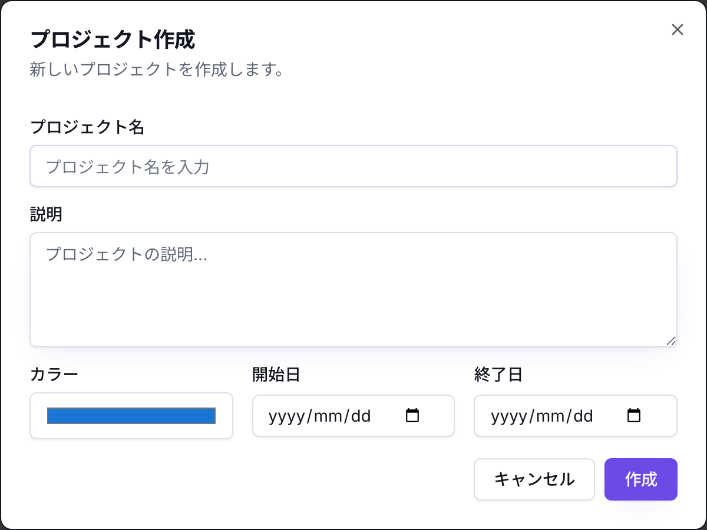
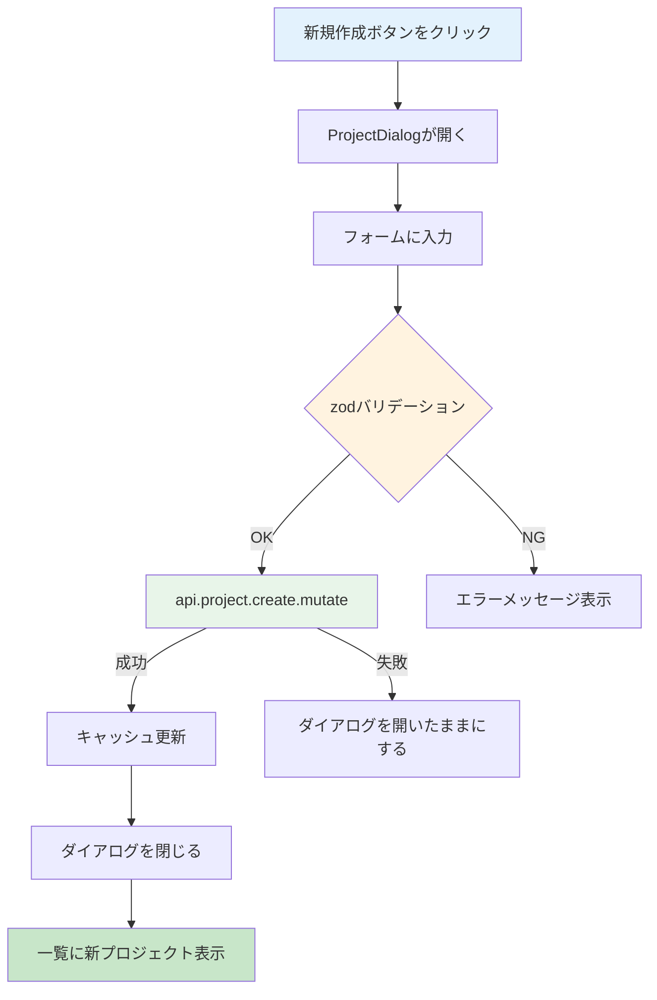
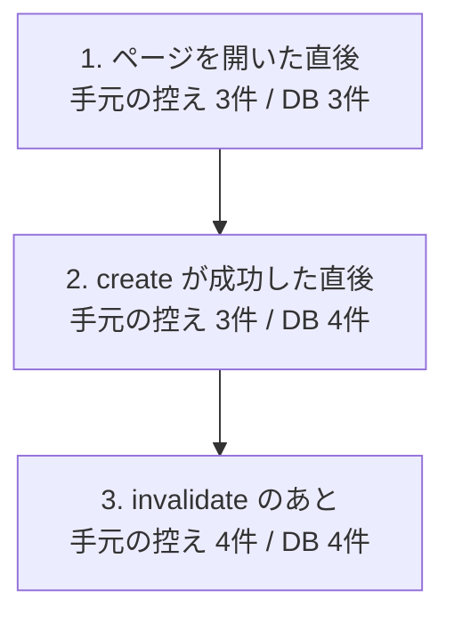
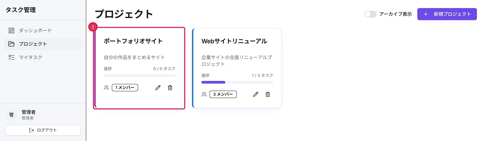
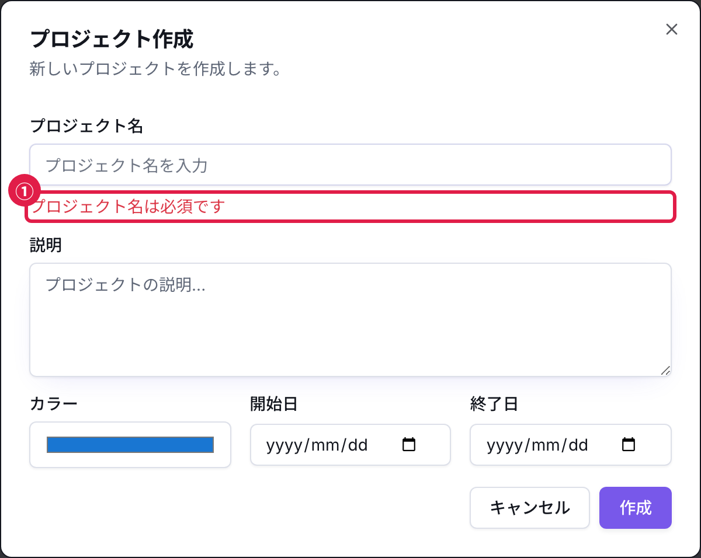

# Day 10: プロジェクト新規作成を実装しよう

## 前回の振り返り

Day 09 では tRPC の `useQuery` を使ってサーバーからプロジェクトデータを取得しました。あわせて `PageLoadingSpinner` によるローディング表示と、グリッドレイアウトでのカード一覧も実装しました。データの「読み取り」ができるようになったので今日は「作成」に進みます。

---

## 今日のゴール

ダイアログ（モーダル）形式のフォームで、新しいプロジェクトを作成できるようにします。react-hook-form と zod でフォームのバリデーションと状態管理を担当し、tRPC の `useMutation` でサーバーに保存します。

スクリーンショット: 今日の最後に目指す表示です。まだ自分の画面には出せません。



画像の日付欄には `yyyy/mm/dd` と出ていますが日本語版のブラウザでは `年/月/日` と表示されます。並び順は同じで、書かれている文字だけが違います。

## なぜこれを作るのか

プロジェクトがなければタスクも管理できません。ここでは「ダイアログ」という新しいUIパターンを学びます。

> **例え話**: ダイアログは「付箋」のようなものです。ページ全体を移動せずに、今いる画面の上にメモ用紙をペタッと貼って書き込みます。書き終わったら付箋をはがすと元の画面がそのまま残っています。

### プロジェクト作成の流れ


```mermaid
flowchart TD
    A[新規作成ボタンをクリック] --> B[ProjectDialogが開く]
    B --> C[フォームに入力]
    C --> D{zodバリデーション}
    D -->|OK| E[api.project.create.mutate]
    D -->|NG| F[エラーメッセージ表示]
    E -->|成功| G[キャッシュ更新]
    E -->|失敗| J[ダイアログを開いたままにする]
    G --> H[ダイアログを閉じる]
    H --> I[一覧に新プロジェクト表示]

    style A fill:#e3f2fd
    style D fill:#fff3e0
    style E fill:#e8f5e9
    style I fill:#c8e6c9
```

この図で目を留めてほしいのはD の分岐と G の位置です。D の zod はまだサーバーへ出発する前の、ブラウザ側の門番です。名前が空なら E へ進まず F のエラー表示で折り返すので通信が1回も起きません。ただしこの門番はブラウザの中にしか居ません。開発者ツールから直接 API を呼ばれれば素通りされるのでStep 0 ではサーバー側にもう1枚同じ門を立てます。

図では G の「キャッシュ更新」を H の手前に置いていますが大事なのは並び順ではありません。E の保存が成功した時点では画面が抱えている一覧のデータはまだ作成前のままです。G で取り直しを始めておかないとH でダイアログを閉じても I の「一覧に新プロジェクト表示」までたどり着けません。ただし G は取り直しを始めるだけで、終わるのを待ちません。ダイアログが閉じた直後の一瞬はまだ前の一覧が見えていることもあります。この2つは成功したときにどちらも走ればよく、どちらを先に書いても結果は同じです。保存に失敗した場合は G と H のどちらも通らず、入力した内容を残したままダイアログが開き続けます。今日はこの D と G の2か所を、それぞれ Step 0 と Step 7 で手を動かして埋めます。

### やること / やらないこと

| やること | やらないこと |
|---------|-------------|
| ProjectDialog コンポーネントを作る | 別ページでフォームを作る |
| react-hook-form + zod でフォーム管理 | useState で手動管理 |
| useMutation でサーバーに保存 | fetch を手書きする |
| キャッシュ無効化で一覧を自動更新 | 手動でページリロード |

### 今日触るファイル

```
src/
├── app/
│   └── project/
│       └── page.tsx              ← Day 09 のページに追加
├── component/
│   └── project/
│       └── project-dialog.tsx    ← Step 1〜6 で中身を書き直す
├── server/
│   └── api/
│       └── routers/
│           └── project.ts        ← Step 0 で create を追加
└── lib/
    └── constant/
        └── project.ts            ← 既存（定数を利用する）
```

> 今日は Day 09 で作った `src/app/project/page.tsx` にプロジェクト作成機能を追加します。編集機能は Day 11 で追加します。`project-dialog.tsx` は配布済みですが今日は Step 1 から Step 6 で中身を自分の手で書き直します。そのあと `page.tsx` と連携させます。
>
> **今日のゴールライン**: 既存コードを「全部理解する」必要はありません。「この部品がこう動く」が見えたら十分です。細かい型やユーティリティは使いながら慣れていきます。

### 新しく学ぶ概念

| 概念 | 読み方 | 役割 | 例え |
|------|--------|------|------|
| Dialog | ダイアログ | 画面上に重なるモーダル | 付箋。今の画面の上に貼って書き込む |
| zodResolver（Day 05 の復習） | ゾッド・リゾルバー | zod スキーマで入力値を自動検証する仕組み | 記入用紙のチェック係。書き漏れがあれば教えてくれる |
| register | レジスター | 入力欄を react-hook-form に登録する関数 | 記入欄に名札を付けてどの欄かを管理する |
| キャッシュ無効化 | — | データ変更後に一覧を自動で再取得 | 掲示板の更新ボタン。新しい投稿を反映する |

> **今日のゴールライン**: 今日は既存のコードを読む場面が多いです。「なぜこう書いてあるか」は全部わからなくて大丈夫です。「ダイアログでプロジェクトを作成できた」という結果が出れば今日は上出来です。読解力は Day 11 以降で同じパターンを繰り返すうちについてきます。

## 実装ステップ一覧

| ステップ | 作業内容 | 所要時間 |
|---------|---------|---------|
| Step 0 | プロジェクト作成 API（create）を自分で書く | 12分 |
| Step 1 | ProjectDialogの骨格を作る | 5分 |
| Step 2 | zodスキーマとフォーム設定を作る | 5分 |
| Step 3 | defaultValues と reset で初期値を同期する | 5分 |
| Step 4 | 名前・説明の入力欄を作る | 7分 |
| Step 5 | カラーピッカーと日付欄を作る | 7分 |
| Step 6 | 送信処理を実装する | 5分 |
| Step 7 | ページにDialogを組み込む | 7分 |
| Step 8 | 動作確認 | 3分 |

**合計時間**は約56分です。

この時間はコードを読んで理解する目安です。写経して打ち込む時間、詰まって調べる時間は別に見てください。

---

### Step 0: プロジェクト作成 API（create）を自分で書く（12分）

**ゴール**: `src/server/api/routers/project.ts` に `create` を追加し、`api.project.create` を呼べる状態にします。

Day 09 で書いた `getAll` は3部品（入力・処理・戻り値）のうち処理が「探す（`.query`）」でした。今日の `create` は「作る（`.mutation`）」になるだけで、骨組みは同じです。

#### 0-1. 入力スキーマを追加する

まず受け取るデータの形を zod で定義します。`project.ts` の `USER_SELECT` の import の下に追加します。

```typescript
// filepath: src/server/api/routers/project.ts（続き）
import { DEFAULT_PROJECT_COLOR } from '@/lib/constant/project';
import { PROJECT_MEMBER_ROLE } from '@/lib/constant/roles';

const projectCreateSchema = z.object({
  name: z.string().min(1, 'プロジェクト名は必須です'),
  description: z.string().optional(),
  color: z
    .string()
    .regex(/^#[0-9A-F]{6}$/i)
    .default(DEFAULT_PROJECT_COLOR),
  startDate: z.string().datetime().optional(),
  endDate: z.string().datetime().optional(),
});
```

`name` に `.min(1, ...)` が付いているのは空文字のプロジェクト名を作れないようにするためです。`color` の `.regex(/^#[0-9A-F]{6}$/i)` は「`#` に続いて16進数6桁」という色コードの形をチェックします。16進数で使うのは `0` から `9` と `A` から `F` です。末尾の `i` があるため小文字の `a` から `f` も通ります。`type="color"` の入力欄は小文字を返すので、この `i` が無いとブラウザで選んだ色まで弾いてしまいます。`#GGGGGG` のような文字列は通りません。これが無いとフロント側のバリデーションを迂回して変な文字列が color に入ってしまいます。`.default(DEFAULT_PROJECT_COLOR)` は色を指定しなかったときに使う既定色です。

このスキーマが本当に効くのは画面のフォームを通らずに呼ばれたときです。ブラウザの開発者ツールから `api.project.create` を空の名前で叩いても`.min(1, ...)` に引っかかった時点で `mutation` の中身は1行も動きません。`prisma.project.create` まで届かないので名前の無い行がテーブルに残ることはありません。色も同じで、`red` や `<script>` のような文字列は `.regex(...)` が弾きます。

つまりフォーム側の zod は入力中の読者へ赤字を返すためのものでデータベースを守っているのはこちら側です。Day 09 の `getAll` で「他人の userId は管理者しか渡せない」と決めたのと同じ考え方で、画面は親切のためサーバーは防御のために検証します。この二重化を面倒だと感じたらフォームを1行も通らない呼び出しが世の中には存在する、と思い出してください。

#### 0-2. ここが一番のヤマ場（作った本人をメンバーに入れる）

`create` の処理本体です。ここで一番大事なのはプロジェクトを作るのと同時に、作った本人をメンバーとして登録する部分です。

ここから先の「（続き）」のブロックは`project.ts` の**末尾にある `});` の1行上**へ貼ります。ファイルの一番下に足すとルーターの外に出てしまい、英語のエラーで止まります。`});` は増やしません。

```typescript
// filepath: src/server/api/routers/project.ts（続き）
  create: protectedProcedure.input(projectCreateSchema).mutation(async ({ ctx, input }) => {
    const createData: Prisma.ProjectCreateInput = {
      name: input.name,
      color: input.color,
      startDate: input.startDate ? new Date(input.startDate) : null,
      endDate: input.endDate ? new Date(input.endDate) : null,
      members: {
        create: {
          userId: ctx.session.userId,
          role: PROJECT_MEMBER_ROLE.OWNER,
        },
      },
    };
```

`members: { create: { ... } }` はプロジェクト本体を作るのと同時に、関連する `ProjectMember` の行も1件同時に作る書き方です。プロジェクトとメンバーは別々のテーブルなので通常は操作も分かれます。Prisma はこの入れ子の `create` で1つのトランザクション（途中で失敗したら全体を取り消す一連の処理）にまとめます。

なぜここが一番のヤマ場かというとDay 09 で書いた `getAll` を思い出すと分かります。`getAll` は「自分がメンバーのプロジェクトだけ」を返す条件になっていました。もしここで `members.create` を忘れるとプロジェクトは作成されるのに作った本人がメンバーに入っていないので `getAll` の一覧には表示されません。「作ったのに一覧に出てこない」という不具合の原因はたいていこの登録漏れです。`role: PROJECT_MEMBER_ROLE.OWNER` で、作成者にはオーナー権限を与えます。

#### 0-3. description は値があるときだけ入れる

`description` は入力が任意なので扱い方を分けます。

```typescript
// filepath: src/server/api/routers/project.ts（続き）
    if (input.description) {
      createData.description = input.description;
    }

    return await prisma.project.create({
      data: createData,
      include: {
        members: {
          include: {
            user: {
              select: USER_SELECT,
            },
          },
        },
      },
    });
  }),
```

最初に作る `createData` には `description` を含めず、値が入力されているときだけ後から足しています。説明欄を空のまま送ると `input.description` は空文字になります。ここで `description: input.description` と書いてしまうとその空文字がそのまま DB へ書き込まれます。空文字は「説明が無い」ではなく「長さ 0 の説明がある」という値なのであとで「説明なし」だけを選び出したいときに数が合わなくなります。なお `undefined` のほうは書き込まれません。Prisma は `undefined` を「この項目には何もしない」という指示として読むためです。値があるときだけキー自体を足すと無いものは無いまま扱われます。この「値がある項目だけオブジェクトに足す」書き方はDay 11 で編集の手続きを書くときにもう一度出てきます。`include` の `members` は `getAll` と同じ形にしています。新規作成直後の `tasks` は空なので、`create` の返り値には含めません。最後の `}),` で `create` を閉じます。

`root.ts` は Day 09 で `project` を登録済みなので今日は変更しません。

**確認ポイント**:
- `projectCreateSchema` と `create` を追加し、`getAll` の直後に `}),` `});` まで閉じた
- `members.create` で `userId` と `role: PROJECT_MEMBER_ROLE.OWNER` を渡している
- ここまでのコードの綴りと括弧の対応を確認した

---

### Step 1: ProjectDialogの骨格を作る（5分）

**ゴール**: ダイアログの基本構造を作ります。

> **例え話**: AppLayout は「建物の共通設備」でしたがDialog は「部屋の中で開く小窓」です。中に入力フォームを置いて書き終わったら閉じます。

**実装**:

```typescript
// filepath: src/component/project/project-dialog.tsx
'use client';

// React と フォームバリデーション関連
import { useEffect } from 'react';
import { zodResolver }
  from '@hookform/resolvers/zod';
import { useForm } from 'react-hook-form';
import { z } from 'zod';
```

この4つがフォームの中身を預かる組です。`useEffect` は Step 3 で、ダイアログを開くたびに初期値を入れ直すときに使います。ここで取り込んでおかないとStep 3 で `Cannot find name 'useEffect'` というエラーになります。

続けて画面の部品を取り込みます。

```typescript
// filepath: src/component/project/project-dialog.tsx（続き）
// shadcn/uiコンポーネント
import { Button }
  from '@/component/ui/button';
import {
  Dialog, DialogContent,
  DialogDescription, DialogFooter,
  DialogHeader, DialogTitle,
} from '@/component/ui/dialog';
import { Input }
  from '@/component/ui/input';
import { Label }
  from '@/component/ui/label';
import { Textarea }
  from '@/component/ui/textarea';
// プロジェクトのデフォルト色
import { DEFAULT_PROJECT_COLOR }
  from '@/lib/constant/project';
```

取り込んだ部品は3つの役割に分かれます。`zodResolver`、`useForm`、`z` はフォームの中身を預かる組で、入力値の保持と検証をこの3つが引き受けます。`Dialog` から `DialogTitle` までの6つはshadcn/ui が用意した1つのダイアログを段ごとに分けたものです。枠、本体、見出し、説明文、足元のボタン置き場、と役割が分かれているので必要な段だけを重ねて組み立てられます。

import の `@/component/ui/...` は `components` ではなく、単数形の `component` です。複数形で書くとファイルが見つからないというエラーが出てページを表示できません。

残りは入力欄と定数です。`Input`、`Textarea`、`Label` が実際に文字を打つ場所、`DEFAULT_PROJECT_COLOR` は色を選ばなかったときに入る既定色で、Step 0 のサーバー側スキーマと同じ値を見ています。Day 09 の一覧ページで `Button` や `Switch` を先に取り込んでから組み立てたのと、進め方は変わりません。

**確認ポイント**:
- コードの内容を確認した
- すべてのimportが確認できた

続いてProps（親から子のコンポーネントへ渡す値、読み方はプロップス）の型定義を確認します。

```typescript
// filepath: src/component/project/project-dialog.tsx
// Props の型定義
interface ProjectDialogProps {
  open: boolean;
  onClose: () => void;
  onSubmit: (data: ProjectFormData) => void;
  initialData?:
    ProjectFormData | undefined;
}

// フォームデータの型
export interface ProjectFormData {
  id?: string;
  name: string;
  description?: string;
  color: string;
  startDate?: string;
  endDate?: string;
}
```

この2つの型がダイアログと呼び出し側の約束事です。`open` を親から受け取っているのはダイアログ自身に開閉を覚えさせないためです。Day 09 で `page.tsx` に置いた `dialogOpen` がその値の持ち主で、開けたい側が開き、閉じたい側が閉じます。`onSubmit` も同じ考え方で、入力の終わったデータを外へ渡すだけにしておくと保存の中身をダイアログが知らずに済みます。

だからこの1つの部品を、今日の作成にも Day 11 の編集にも使い回せます。`initialData` に `?` が付いているのはそのためで、新規作成では初期値そのものが存在しません。もし型から `?` を外すと今日の呼び出しで「値が足りない」と TypeScript に止められます。

> `onClose` は「ダイアログを閉じる」ためのコールバックです。親コンポーネントが `setDialogOpen(false)` を渡します。

**確認ポイント**:
- ここまでのコードの綴りと括弧の対応を確認した
- `ProjectDialogProps` と `ProjectFormData` の定義を理解した

---

### Step 2: zodスキーマとフォーム設定を作る（5分）

**ゴール**: zod でバリデーションルールを定義し、react-hook-form で入力管理します。

**実装**:

```typescript
// filepath: src/component/project/project-dialog.tsx
// zodスキーマでバリデーションルールを定義
const projectFormSchema = z.object({
  id: z.string().optional(),
  name: z.string().min(1,
    'プロジェクト名は必須です'),
  description: z.string().optional(),
  color: z.string(),
  startDate: z.string().optional(),
  endDate: z.string().optional(),
});

// スキーマから型を自動生成
type ProjectFormValues =
  z.infer<typeof projectFormSchema>;
```

画面側のスキーマはサーバーへ送る前にブラウザで入力を確かめるためのものです。`id` を `optional` にしているのは新規作成の時点ではまだ ID が無いためです。

続けて初期値を作る関数を同じファイルへ書きます。

```typescript
// filepath: src/component/project/project-dialog.tsx（同じファイルの続き）
// 作成でも編集でも同じ形の初期値を作る
function buildProjectFormValues(
  initialData: ProjectFormData | undefined,
): ProjectFormValues {
  return {
    id: initialData?.id,
    name: initialData?.name ?? '',
    description:
      initialData?.description ?? '',
    color: initialData?.color
      ?? DEFAULT_PROJECT_COLOR,
    startDate:
      initialData?.startDate ?? '',
    endDate: initialData?.endDate ?? '',
  };
}
```

`buildProjectFormValues` はフォームの初期値を1か所で作る関数です。新規作成のときは
`initialData` が `undefined` なので`??` の右側が使われて空文字と既定の色が入ります。
編集のときは渡された値がそのまま入ります。この関数が無いと作成と編集で初期値の作り方が
2通りに分かれ、片方だけ直して食い違う原因になります。

Step 0 で書いたサーバー側のスキーマと、ここで書く画面側のスキーマは見た目がよく似ています。ただし役割は別です。サーバー側は保存してよいかどうかの最終判定で、こちらは入力中の読者へ赤字を返すための下書きチェックです。だから `color` は `z.string()` だけにしてあり、色コードの形までは見ていません。形の検査はサーバー側の `.regex(...)` が持っているのでここで二重に厳しくしても防げる事故が増えないためです。

`id` が `optional` なのは新規作成の時点ではまだ ID が存在しないからです。ID はサーバーがデータベースへ書き込んだ瞬間に決まります。Day 11 の編集で初めてここに値が入り、同じスキーマが編集フォームにも使えるようになります。

**確認ポイント**:
- ここまでのコードの綴りと括弧の対応を確認した
- `name` フィールドに `min(1)` バリデーションが設定されている

#### zodスキーマの各フィールド

| フィールド | バリデーション | 意味 |
|-----------|-------------|------|
| `name` | `z.string().min(1, ...)` | 1文字以上必須 |
| `description` | `z.string().optional()` | 入力は任意 |
| `color` | `z.string()` | 色コード（必須） |
| `startDate` | `z.string().optional()` | 開始日（任意） |
| `endDate` | `z.string().optional()` | 終了日（任意） |

> `z.infer<typeof projectFormSchema>` はzod スキーマから TypeScript の型を自動生成する機能です。スキーマと型が常に一致するのでズレが起きません。

---

### Step 3: defaultValues と reset で初期値を同期する（5分）

**ゴール**: `useForm` の `defaultValues` と `useEffect(reset)` を使ってダイアログが開くたびにフォームの初期値を同期します。

**実装**:

```typescript
// filepath: src/component/project/project-dialog.tsx
// コンポーネント本体
export function ProjectDialog({
  open, onClose, onSubmit, initialData,
}: ProjectDialogProps) {
  const {
    register, handleSubmit, reset,
    formState: { errors },
  } = useForm<ProjectFormValues>({
    resolver: zodResolver(
      projectFormSchema),
    defaultValues:
      buildProjectFormValues(initialData),
  });

  useEffect(() => {
    if (!open) {
      return;
    }

    reset(
      buildProjectFormValues(initialData)
    );
  }, [initialData, open, reset]);
```

`useForm` を1回呼ぶと入力欄の値・エラー・送信処理をまとめて預けられます。`useState` で欄ごとに変数を持つ書き方だと欄が5つあれば宣言も5つ必要でした。ここでは欄が増えても宣言は1つのままです。`resolver` に `zodResolver(projectFormSchema)` を渡してあるので送信のたびにスキーマの検査が自動で走り、`errors` に結果が入ります。

`useEffect` の中で `reset(...)` を呼んでいるのは`defaultValues` がフォームを最初に作る一度きりしか効かないためです。同じダイアログを閉じて別のプロジェクトで開き直しても`defaultValues` は読み直されません。何もしないと前回打った文字がそのまま残るので開いた瞬間に `reset` で入れ替えます。先頭の `if (!open)` は閉じているあいだの無駄な入れ替えを止める見張りです。

**確認ポイント**:
- `useForm` に `resolver` と `defaultValues` が設定されている
- ダイアログが開いていて `initialData` が変わったときに `reset(...)` を呼んでいる
- `register`, `handleSubmit`, `reset`, `errors` を取得している
- ここまでのコードの綴りと括弧の対応を確認した

#### useForm の設定

| 設定 | 役割 |
|------|------|
| `resolver: zodResolver(...)` | zodスキーマでバリデーションを実行 |
| `defaultValues` | フォームを最初に作るときの初期値 |
| `reset(...)` | ダイアログを開き直して `initialData` が変わったときフォームの値を同期 |
| `buildProjectFormValues(...)` | 作成・編集どちらでも同じ形のフォーム初期値を作る関数 |

> `defaultValues` はフォーム作成時の初期値です。ただし同じダイアログを別プロジェクトで開き直すと `initialData` が変わるため`useEffect` の中で `reset(...)` を呼んで再同期します。`useState` で入力値を1つずつ持つのではなく、react-hook-form にまとめて管理させるのがポイントです。`DEFAULT_PROJECT_COLOR` がカラーの初期値として使われている点にも注目してください。

---

### Step 4: 名前・説明の入力欄を作る（7分）

**ゴール**: プロジェクト名と説明の入力フォームを追加します。

**実装**:

まずダイアログを閉じるハンドラーと送信ハンドラーを作ります。

```typescript
// filepath: src/component/project/project-dialog.tsx
// ダイアログを閉じるハンドラー
const handleClose = () => {
  reset();
  onClose();
};

// フォーム送信ハンドラー
const handleFormSubmit =
  (data: ProjectFormValues) => {
    const submitData: ProjectFormData = {
      ...(data.id !== undefined
        && { id: data.id }),
      name: data.name,
      color: data.color,
      ...(data.description
        && { description:
          data.description }),
      ...(data.startDate
        && { startDate: data.startDate }),
      ...(data.endDate
        && { endDate: data.endDate }),
    };
    onSubmit(submitData);
  };
```

`handleClose` が `reset()` と `onClose()` を両方呼んでいるのはダイアログを閉じても入力欄の中身はそのまま残るためです。閉じるだけにすると次に「新規プロジェクト」を押したとき前回書きかけた名前が入ったまま開きます。読者から見ると自分が入力した覚えのない文字が最初から入っている画面になります。

送信する側で `...(data.description && { ... })` と書いているのは空欄の項目をそもそも送らないためです。Step 0 のサーバー側は送られてこなかった項目には何もしません。空文字を送るとそちらは「長さ0の説明がある」という値として保存されます。

**確認ポイント**:
- `handleClose` でフォームのリセットとダイアログの閉じが両方行われる
- `...(data.description && { description: data.description })` は「description が入力されている場合だけプロパティを含める」条件付きスプレッド。`&&` はこの場面で null/undefined を埋める働きとは違い、「真なら含める」という意味で使う。`??` とは用途が異なる

続いてJSX を返します。Dialog の中にフォームを配置します。

```typescript
// filepath: src/component/project/project-dialog.tsx
return (
  <Dialog open={open}
    onOpenChange={(isOpen) =>
      !isOpen && handleClose()}>
    <DialogContent
      className="sm:max-w-[600px]">
      <DialogHeader>
        <DialogTitle>
          {initialData?.id
            ? 'プロジェクト編集'
            : 'プロジェクト作成'}
        </DialogTitle>
        <DialogDescription>
          {initialData?.id
            ? 'プロジェクトの詳細を更新します。'
            : '新しいプロジェクトを作成します。'}
        </DialogDescription>
      </DialogHeader>
```

`Dialog` は `open` が `true` のあいだだけ画面に出ます。`onOpenChange` は Esc キー、背景クリック、右上の × など、`open` が変わるすべての出口を受け取ります。`!isOpen && handleClose()` と書いておけばどの閉じ方でも必ず `handleClose` を通るので入力欄のリセット漏れが起きません。ここを `onClose` に直結させるとリセットを飛ばした閉じ方が生まれます。

見出しと説明文を `initialData?.id` で切り替えているのはこの1つのダイアログを作成と編集の両方で使うためです。今日は `initialData` を渡さないので`initialData?.id` は `undefined` になり、常に「プロジェクト作成」側が表示されます。編集側の文言が出るのは Day 11 からです。

**確認ポイント**:
- `Dialog` の `onOpenChange` で閉じ動作をハンドリングしている
- `initialData?.id` の有無でタイトルが「作成」と「編集」に切り替わる

プロジェクト名の入力欄です。`{...register('name')}` でフォームに登録します。

```typescript
      {/* filepath: src/component/project/project-dialog.tsx */}
      <form onSubmit={
        handleSubmit(handleFormSubmit)}>
        <div className="grid gap-4 py-4">
          <div className="grid gap-2">
            <Label htmlFor="name">
              プロジェクト名
            </Label>
            <Input id="name"
              placeholder=
                "プロジェクト名を入力"
              aria-invalid={!!errors.name}
              aria-describedby={errors.name ? 'name-error' : undefined}
              {...register('name')} />
            {errors.name && (
              <p id="name-error"
                className=
                "text-sm text-destructive">
                {errors.name.message}
              </p>
            )}
          </div>
```

`{...register('name')}` の1行で、この入力欄は react-hook-form の管理下に入ります。`value` と `onChange` を自分で書かなくても打った文字はフォームの内側に貯まっていきます。`Label` の `htmlFor="name"` と `Input` の `id="name"` をそろえてあるのはラベルの文字をクリックしたときにカーソルが入力欄へ移るようにするためです。読み上げソフトも、この対応関係を見てどの欄の見出しかを判断します。

`errors.name` は zod が出したエラーの置き場で、`min(1)` に引っかかったときだけ中身が入ります。`&&` で囲ってあるのでエラーが無いあいだは赤字の `<p>` そのものが描かれません。名前を空のまま「作成」を押すと通信は起きずにこの1行が現れます。Step 0 のサーバー側まで届く前に、画面の中で折り返しているためです。

`aria-invalid` と `aria-describedby` は赤い文字を「見えている人」以外にも届けるための指定です。色の違いを見分けにくい人や、画面を読み上げて使う人には赤字というだけでは何も伝わりません。`aria-describedby` をエラーのあるときだけ付けているのは`id="name-error"` の `<p>` がエラーのないあいだは描かれないからです。無い相手を指したままにしません。この2つを書いておくと読み上げソフトは入力欄へ戻ったときに「入力に誤りがあります」と伝え、その文言をそのまま読みます。Day 14 のタスク作成フォームでも同じ形で書きます。

**確認ポイント**:
- `{...register('name')}` でフォームに登録されている
- `errors.name` でバリデーションエラーを表示している
- `aria-describedby` の値と、エラーの `<p>` の `id` が同じ文字列になっている

説明欄を追加します。

```typescript
          {/* filepath: src/component/project/project-dialog.tsx */}
          <div className="grid gap-2">
            <Label htmlFor="description">
              説明
            </Label>
            <Textarea
              id="description"
              placeholder=
                "プロジェクトの説明..."
              rows={4}
              {...register('description')}
            />
          </div>
```

**確認ポイント**:
- `Textarea` に `{...register('description')}` が設定されている

> `{...register('name')}` は入力欄に `name`, `onChange`, `onBlur`, `ref` をまとめて設定するスプレッド構文です。`value` と `onChange` を手動で書く必要がなくなります。

**確認ポイント**:
- プロジェクト名の入力欄と、エラーを出すコードを書いた
- DialogDescription の説明文を作成・編集で切り替えるコードを書いた
- 表示と送信の確認はページへ組み込む Step 7 のあとに行う

---

### Step 5: カラーピッカーと日付欄を作る（7分）

**ゴール**: プロジェクトの色と期間を設定できるようにします。

**実装**:

カラー・開始日・終了日を横並び3列で配置します。

```typescript
          {/* filepath: src/component/project/project-dialog.tsx */}
          <div className=
            "grid grid-cols-3 gap-4">
            <div className="grid gap-2">
              <Label htmlFor="color">
                カラー
              </Label>
              <Input id="color"
                type="color"
                className="h-10"
                {...register('color')} />
            </div>
```

ここから先の3つは `grid-cols-3` で横一列に並べます。カラー・開始日・終了日はどれも幅の狭い欄なので縦に積むとダイアログが間延びして名前と説明の欄が画面の上へ押し出されます。Day 09 の一覧でカードを格子状に並べたときと同じ考え方で、横幅の余りを列に変えています。

色の欄が Step 4 の名前欄と違うのは`placeholder` を持たない点です。色には「まだ何も入っていない」という状態がなく、`DEFAULT_PROJECT_COLOR` が最初から入っています。読者がカラーピッカーに触らなくても必ず何かの色を持ったまま送信されます。だから Step 0 のサーバー側でも、`color` に付けているのは形を確かめる `.regex(...)` と既定値を用意する `.default(...)` の2つで、空を弾く `.min(1)` は付けていません。

**確認ポイント**:
- カラー欄に `type="color"` を書いた

選んだ色はあとで Day 29 のユーザー詳細ページでバッジの背景になります。そのバッジは文字を白で描くので明るい色を選ぶと白い文字が背景に溶けて読めなくなります。`#1E3A8A`（濃い青）、`#166534`（濃い緑）、`#7C2D12`（濃い茶）のように暗めの色を選んでください。既定値の `#1976d2` も白文字が読める明るさですが余裕はわずかです。

```typescript
            {/* filepath: src/component/project/project-dialog.tsx */}
            <div className="grid gap-2">
              <Label htmlFor="startDate">
                開始日
              </Label>
              <Input id="startDate"
                type="date"
                {...register('startDate')}
              />
            </div>
```

開始日の欄に `type="date"` を指定するとブラウザ標準の日付ピッカー（カレンダーから日を選ぶ小窓）が開きます。ここでフォームに入る値は `2026-04-01` のような文字列で、時刻は含みません。

この「時刻を持たない文字列」という性質を覚えておいてください。Step 7 で日付をわざわざ変換するのはこれが理由です。`2026-04-01` のような日付だけの文字列を `new Date(...)` に渡すとJavaScript の仕様では世界共通の基準時刻（UTC）の0時として読まれます。ところが `2026-04-01T00:00:00` のように時刻まで書いて末尾に `Z` が無い文字列は動かしているパソコンの時間帯の0時として読まれます。同じ「0時」でも、文字列の書き方によって指す瞬間が変わります。この違いを覚え違えたまま自前で変換すると保存された日付が1日ずれます。入力の見た目は正しいのに保存だけが狂うので原因を探しにくい種類の不具合です。Step 7 で使う `dateOnlyToUtcStartIso` は`2026-04-01T00:00:00.000Z` のように `Z` を付けてUTCだと書き切る関数です。どちらの読まれ方になるかを毎回思い出さなくても狙った瞬間で保存できます。

**確認ポイント**:
- 開始日欄に `type="date"` を書いた

続いて終了日フィールドとフォーム全体の閉じタグを追加します。

```typescript
            {/* filepath: src/component/project/project-dialog.tsx */}
            <div className="grid gap-2">
              <Label htmlFor="endDate">
                終了日
              </Label>
              <Input id="endDate"
                type="date"
                {...register('endDate')}
              />
            </div>
          </div>
        </div>
```

> `type="color"` を指定するとブラウザ標準のカラーピッカーが表示されます。`className="h-10"` で他の入力欄と高さを揃えています。`{...register('color')}` で、選んだ色が自動的にフォームの値として管理されます。

**確認ポイント**:
- カラー・開始日・終了日の3つの欄を書いた
- 選択や入力の確認はページへ組み込む Step 7 のあとに行う

スクリーンショット: 入力欄がそろったダイアログの完成形です。この時点ではまだ画面に出せません。`</Dialog>` を閉じるのは Step 6、一覧へ組み込むのは Step 7 なので、いまは書いたコードと見比べる用に見てください。


---

### Step 6: 送信処理を実装する（5分）

**ゴール**: 送信ボタンとキャンセルボタンを追加します。

**実装**:

```typescript
        {/* filepath: src/component/project/project-dialog.tsx */}
        <DialogFooter>
          <Button type="button"
            variant="outline"
            onClick={handleClose}>
            キャンセル
          </Button>
          <Button type="submit">
            {initialData?.id
              ? '更新' : '作成'}
          </Button>
        </DialogFooter>
      </form>
    </DialogContent>
  </Dialog>
);
}
```

`DialogFooter` はボタンをそろえる置き場です。幅 640px 以上ではボタンが右下に横並びです。狭い画面では縦に並びます。キャンセルに `type="button"` を書いているのは`<form>` の内側にあるボタンが指定しないかぎり送信ボタンとして扱われるからです。この1語を落とすとキャンセルを押した瞬間に送信が走り、名前が空なら zod のエラーまで出ます。閉じたいだけなのに赤字が出る、という妙な挙動の正体はこれです。

作成ボタンの `type="submit"` は逆に、押されたら `handleSubmit` に検証を回してもらう指定です。検証を通ったときだけ `handleFormSubmit` へ値が渡り、通らなければ何も起きません。文言を `initialData?.id` で「作成」と「更新」に切り替えてあるのでDay 11 で編集を足すときも、この部分は1文字も書き換えずに済みます。

**確認ポイント**:
- 作成ボタンを `type="submit"`、キャンセルを `type="button"` で書いた
- キャンセルに `handleClose` をつないだ
- `</form>` からコンポーネント末尾までを閉じた
- 実際の表示・送信・キャンセルは Step 7 でページへ組み込んだあとに確認する

#### ボタンの役割

| ボタン | type | 動作 |
|--------|------|------|
| キャンセル | `button` | `handleClose` でフォームをリセットし、ダイアログを閉じる |
| 作成 / 更新 | `submit` | `handleSubmit` → zodバリデーション → `handleFormSubmit` |

> `type="button"` を指定しないとキャンセルボタンでもフォーム送信が実行されてしまいます。キャンセル時は `handleClose` で `reset()` を呼び、フォームの入力内容をクリアしてから閉じます。

---

### Step 7: ページにDialogを組み込む（7分）

**ゴール**: プロジェクト一覧ページにダイアログを組み込み、作成処理を実装します。

Day 09 では「新規プロジェクト」ボタンを押すと
`dialogOpen` が `true` になるところまで作りました。
今日はその state に `ProjectDialog` をつなぎます。

**実装**:

```typescript
// filepath: src/app/project/page.tsx
// import群に追加
import {
  ProjectDialog,
  type ProjectFormData,
} from
  '@/component/project/project-dialog';
import {
  dateOnlyToUtcStartIso,
} from '@/lib/date';
```

取り込む3つはどれも今日つなぎ込む相手です。`ProjectDialog` は Step 1 から Step 6 で読んできたダイアログ本体、`ProjectFormData` はそのダイアログが送信時に渡してくるデータの型です。`ProjectFormData` の前だけ `type` が付いているのはこれが型の情報しか持たず、動くコードとしては何も残らないためです。

`dateOnlyToUtcStartIso` はStep 5 で触れた読まれ方の違いを吸収する関数です。`2026-04-01` のような日付だけの文字列を受け取り、世界共通の基準時刻の0時として組み立て直します。パソコンの時間帯を見ないのでどの国で操作しても同じ値が保存されます。

**確認ポイント**:
- importを追加した

```typescript
// filepath: src/app/project/page.tsx
// ProjectPageContent内、getAll の useQuery の下に追加
// tRPCのキャッシュ操作ユーティリティ
const utils = api.useUtils();

// プロジェクト作成mutation
const createMutation =
  api.project.create.useMutation({
    onSuccess: () => {
      // 一覧キャッシュを無効化して再取得
      void utils.project.getAll.invalidate();
      setDialogOpen(false);
    },
  });
```

`api.useUtils()` はtRPC が裏で抱えているキャッシュ（一度取ったデータの控え）に触るための取っ手です。`useMutation` は Day 09 の `useQuery` と対をなす道具です。違うのは走り出すきっかけです。`useQuery` はページを開いた時点で取得が始まりますが`useMutation` は `mutate` を呼ぶまで動きません。作成や更新は読者がボタンを押して初めて起こることなのでこの差がそのまま使い分けになります。

`onSuccess` はサーバーが成功を返したあとだけ通る場所です。名前が空だったりログインが切れていたりして `create` が失敗すればここは呼ばれません。だから「保存できていないのにダイアログだけ閉じる」という食い違いが起きません。閉じる処理をこの中に置いているのはそれを保証するためです。

`void` は一覧の取り直しが終わるまで待たず、ダイアログを閉じる処理へ進むという印です。取り直しは始まっているので、届いた結果はあとから一覧へ反映されます。

ただしサーバーへの保存に失敗したとき、ダイアログは入力内容を残したまま開き続けますが理由は画面に表示されません。Day 15 ではタスク更新の失敗を `toast.error` で表示しますが、プロジェクト作成の `createMutation` には追加しません。今日のコードで原因を確かめるときはブラウザの開発者ツールで Network タブを開き、失敗した `/api/trpc/project.create` の応答を確認します。

**確認ポイント**:
- `useUtils` でキャッシュ操作ユーティリティを取得している
- `onSuccess` でキャッシュ無効化とダイアログ閉じを行っている

次に送信ハンドラーを追加します。
Day 10 では新規作成だけを扱います。
編集処理は Day 11 で追加します。

```typescript
// filepath: src/app/project/page.tsx
// createMutation の下に追加
const handleSubmit = (
  data: ProjectFormData
) => {
  createMutation.mutate({
    name: data.name,
    description: data.description,
    color: data.color,
    startDate: data.startDate
      ? dateOnlyToUtcStartIso(
          data.startDate)
      : undefined,
    endDate: data.endDate
      ? dateOnlyToUtcStartIso(
          data.endDate)
      : undefined,
  });
};
```

**確認ポイント**:
- `handleSubmit` が `createMutation.mutate` を呼んでいる
- 日付未入力は `undefined` で渡している

> `new Date(data.startDate)` の読まれ方は渡す文字列の形で変わります。日付だけなら UTC の 00:00、時刻まで書いて末尾に `Z` が無ければローカルの 00:00 です。自前で組み立てるとこの差を取り違えて別の日付を保存してしまいます。日付だけを扱う入力では`dateOnlyToUtcStartIso` のような専用ヘルパーで UTC の時刻を明示します。

最後に JSX 内へ `ProjectDialog` を組み込みます。一覧カードを並べるグリッドの閉じタグ直後、外側の `<div className="flex flex-col gap-6">` を閉じる前に追加します。

```typescript
{/* filepath: src/app/project/page.tsx */}
{/* JSX内（AppLayoutの閉じタグの前） */}
<ProjectDialog
  open={dialogOpen}
  onClose={() => setDialogOpen(false)}
  onSubmit={handleSubmit}
/>
```

渡している値は3つだけです。`open` に `dialogOpen` をつなぐとDay 09 で置いた「新規プロジェクト」ボタンが今日から本当にダイアログを開きます。`onClose` はダイアログ側の `handleClose` から呼ばれて `dialogOpen` を `false` に戻し、`onSubmit` は入力済みのデータを `handleSubmit` へ運びます。Day 09 では受け皿だけ作って何も起きなかった部分がこれで最後までつながります。

一覧の取り直しが要る理由も、この形から見えます。`useQuery` が返している `projects` はページを開いた時点でサーバーから受け取った配列の控えです。`create` の返り値はその控えに自動では足されません。だから `invalidate()` を呼ばないと保存は済んでいるのに一覧は作成前のまま止まります。読者からは「作成ボタンが効いていない」ように見えてページを再読み込みすると新しいカードが現れます。この症状が出たらまず `onSuccess` の中身を疑ってください。


```mermaid
flowchart TB
    A["1. ページを開いた直後<br/>手元の控え 3件 / DB 3件"]
    B["2. create が成功した直後<br/>手元の控え 3件 / DB 4件"]
    C["3. invalidate のあと<br/>手元の控え 4件 / DB 4件"]
    A --> B --> C
```

2コマ目だけ数が食い違います。保存は終わっているのに画面が変わらないのはこの状態で、ブラウザを再読み込みすると3コマ目に飛ぶため直ったように見えます。`invalidate()` はこの食い違いを待たずに解消する呼び出しです。

> `utils.project.getAll.invalidate()` はキャッシュの無効化です。これを呼ぶと作成後に一覧が自動で取り直されます。アーカイブ表示が OFF なら、新しいプロジェクトが表示されます。ON の一覧はアーカイブ済みだけを表示するため、作成直後のプロジェクトは出ません。Day 11 では `initialData` に編集対象のプロジェクトを渡して同じダイアログを編集にも再利用します。

**確認ポイント**:
- 新規作成ボタンでダイアログが開く
- フォーム送信でプロジェクトが作成される
- 一覧に新しいプロジェクトが表示される

スクリーンショット: 下の画像では名前に「ポートフォリオサイト」と入れて作っています。名前は本文で指定していないので自分が入れた名前のカードが増えていれば同じ結果です。



---

### Step 8: 動作確認（3分）

**ゴール**: プロジェクト作成の全体フローを確認します。

開発サーバーを起動します。

```bash
# filepath: ターミナル
# 開発サーバーを起動
PORT=3001 npm run dev
```

**確認ポイント**:
- `http://localhost:3001` にアクセスできる

以下の手順で動作を確認してください。

| # | 操作 | 期待される結果 |
|---|------|--------------|
| 1 | 「新規プロジェクト」ボタンをクリック | ダイアログが開く |
| 2 | プロジェクト名を空のまま「作成」 | エラーメッセージが表示される |
| 3 | プロジェクト名を入力し、色を選択 | エラーが消える |
| 4 | 「作成」ボタンをクリック | 保存に成功するとダイアログが閉じる |
| 5 | アーカイブ表示が OFF の一覧を確認 | 新しいプロジェクトが追加されている |
| 6 | カードの色帯を確認 | 選んだ色が反映されている |

スクリーンショット: 下の画像はプロジェクト名を空のまま「作成」を押したときのエラー表示です。



**確認ポイント**:
- プロジェクトが作成できる
- 一覧が自動で更新される（ページリロードなし）
- カードに選んだ色が反映されている
- 名前を入力してキャンセルし、もう一度開くと入力欄が空になっている


---

### Pro パターンで書こう（作成後はリロードせず一覧キャッシュを更新する）

一覧クエリを無効化して再取得するとフィルターやスクロール位置を維持したまま、現在のフィルターに合うデータを最新の状態に保てます。
なぜ直前の1文の書き方をするのか、**Before/After** で見比べてみましょう。

### Before（改善前のコード）

```typescript
'use client';

import { api } from '@/trpc/react';

type ProjectFormData = {
  name: string;
  description?: string;
  color: string;
  startDate?: string;
  endDate?: string;
};

export function useCreateProjectSubmit(onClose: () => void) {
  const createMutation = api.project.create.useMutation({
    onSuccess: () => {
      onClose();
      window.location.reload();
    },
  });

  const submitProject = (data: ProjectFormData) => {
    createMutation.mutate({
      name: data.name,
      description: data.description,
```

**読み比べ用**: ここは写経しません。続けてコードを読み進めましょう。

ここまでが Before の前半です。`onSuccess` の中の `window.location.reload()` に目を留めてください。この1行はページを丸ごと読み込み直すので一覧は確かに新しくなります。ただし戻ってくるのは開いた直後の画面です。Day 09 で作ったアーカイブ表示スイッチも、途中まで下げていたスクロール位置も既定へ戻ります。作ったばかりのプロジェクトを自分で探し直すことになるので1件作るたびに読者の手が止まります。後半ではこの関数がサーバーへ何を送っているかを見ます。

```typescript
// filepath: 読み比べ用サンプル（続き・実ファイルには対応しません）
      color: data.color,
      startDate: data.startDate,
      endDate: data.endDate,
    });
  };

  return {
    submitProject,
    isPending: createMutation.isPending,
  };
}
```

**このコードの問題点**:

- 作成後にページ全体をリロードするので一覧以外の状態まで全部リセットされる
- フィルターやスクロール位置が消えてユーザーが今いた場所を見失いやすい
- tRPCのキャッシュを使っているのにブラウザ再読み込みで力技の更新になっている

3つとも、作成そのものは成功しているのに使い勝手だけが落ちる種類の問題です。画面にエラーが出ないので書いた本人は気づけません。気づくのはアーカイブ表示を切り替えてから新規作成した読者で、そのたびに条件を入れ直すことになります。tRPC はキャッシュを一覧ごとに捨てる手段を持っているのでページ全体を捨てる必要はありません。

### After（プロが書くコード）

```typescript
'use client';

import { api } from '@/trpc/react';

type ProjectFormData = {
  name: string;
  description?: string;
  color: string;
  startDate?: string;
  endDate?: string;
};

export function useCreateProjectSubmit(onClose: () => void) {
  const utils = api.useUtils();

  const createMutation = api.project.create.useMutation({
    onSuccess: () => {
      void utils.project.getAll.invalidate();
      onClose();
    },
  });

  const submitProject = (data: ProjectFormData) => {
    createMutation.mutate({
```

**読み比べ用**: ここは写経しません。続けてコードを読み進めましょう。

ここまでが After の前半です。Before との違いは `void utils.project.getAll.invalidate()` の1行に集まっています。`invalidate` は「この一覧の控えはもう古い」と印を付ける操作で、印の付いたクエリを今表示しているページだけが取り直します。ページそのものは生き残るのでスイッチとスクロール位置はそのまま残ります。頭の `void` は取り直しの完了を待たずに次の `onClose()` へ進むという意思表示です。ダイアログは先に閉じてよく、取り直した結果は届き次第あとから反映されます。アーカイブ表示が ON なら作成直後のプロジェクトは条件に合わないため並びません。後半は Before と同じ送信部分なので見比べる箇所はここまでです。

```typescript
// filepath: 読み比べ用サンプル（続き・実ファイルには対応しません）
      name: data.name,
      description: data.description,
      color: data.color,
      startDate: data.startDate,
      endDate: data.endDate,
    });
  };

  return {
    submitProject,
    isPending: createMutation.isPending,
  };
}
```

**このコードの強み**:

- `project.getAll` のキャッシュだけを無効化するので必要な一覧だけ再取得できる
- ダイアログを閉じてもページ全体は残るため表示条件や操作中の流れが途切れにくい
- 作成、更新、削除でも同じ `mutation + invalidate` の型を使い回せる

3つ目が今日いちばん持ち帰ってほしい形です。Day 11 で足す編集と削除は`mutation` の名前が変わるだけで、`onSuccess` で一覧を無効化する部分はそのまま使い回せます。作成のうちにこの骨組みをつかんでおくと次の似た手続きは説明を読まずに自分で書けます。

#### 覚えておきたいエッセンス

データを変えた後はページを丸ごとリロードするより **変わった一覧だけ再取得する** ほうが自然です。
tRPCでは `mutation` の成功時に `invalidate()` を呼ぶ、この形を覚えておきましょう。

## 完成コード全体

今日は3つのファイルを触りました。断片を貼り重ねる作業が続いたので途中でどこへ貼ったか分からなくなった場合は以下のコードを上から順に貼り付けて各ファイルを置き換えてください。1つのファイルが複数のブロックに分かれている場合はそのファイルの見出しの下にあるブロックを、出てくる順につなげたものが全文です。`project.ts` と `page.tsx` は Day 09 で作り始めたファイルなのでDay 09 で書いた部分もあわせて載せています。

| ファイル | 役割 | 対応する Step |
|---------|------|--------------|
| `src/server/api/routers/project.ts` | プロジェクトの取得と作成を受け持つサーバー側の手続き | Step 0（Day 09 の `getAll` を含む） |
| `src/component/project/project-dialog.tsx` | 作成フォームを載せるダイアログ本体 | Step 1 から Step 6 |
| `src/app/project/page.tsx` | 一覧ページとダイアログの配線 | Step 7（Day 09 の一覧を含む） |

### `src/server/api/routers/project.ts`

**import と作成用スキーマ**:

```typescript
// filepath: src/server/api/routers/project.ts
// 完成版: import と作成用スキーマ
import type { Prisma } from '@prisma/client';
import { TRPCError } from '@trpc/server';
import { z } from 'zod';
import { DEFAULT_PROJECT_COLOR } from '@/lib/constant/project';
import { PROJECT_MEMBER_ROLE, USER_ROLE } from '@/lib/constant/roles';
import { prisma } from '@/lib/prisma';
import { createTRPCRouter, protectedProcedure } from '../trpc';
import { USER_SELECT } from './_helpers/select';

const projectCreateSchema = z.object({
  name: z.string().min(1, 'プロジェクト名は必須です'),
  description: z.string().optional(),
  color: z
    .string()
    .regex(/^#[0-9A-F]{6}$/i)
    .default(DEFAULT_PROJECT_COLOR),
  startDate: z.string().datetime().optional(),
  endDate: z.string().datetime().optional(),
});
```

Step 0 では `PROJECT_MEMBER_ROLE` を別の行で取り込みましたがここでは Day 09 の `USER_ROLE` と1行にまとめてあります。`npm run fix` を実行するとBiome（このプロジェクトのコード整形ツール）が同じファイルからの取り込みを1行へ寄せるためです。手元が2行のままでも中身は変わりません。スキーマをルーターの外に置いてあるのは`create` の `.input(...)` から名前で参照するだけで足りるからです。

**getAll の入口と権限チェック**:

```typescript
// filepath: src/server/api/routers/project.ts
// 完成版: getAll の入口と権限チェック
export const projectRouter = createTRPCRouter({
  getAll: protectedProcedure
    .input(
      z
        .object({
          userId: z.string().cuid().optional(),
          isArchived: z.boolean().optional(),
        })
        .optional(),
    )
    .query(async ({ ctx, input }) => {
      const where: Prisma.ProjectWhereInput = {};

      if (input?.userId && input.userId !== ctx.session.userId) {
        if (ctx.session.role !== USER_ROLE.ADMIN) {
          throw new TRPCError({
            code: 'FORBIDDEN',
            message: '管理者権限が必要です',
          });
        }
      }
```

`where` を空のオブジェクトから始めているのは条件を後から足していく形にするためです。条件の有無で `findMany` の呼び出しを何通りも書き分けずに済みます。権限の確認を検索条件の組み立てより前に置いてあるのは弾く判断を先に済ませるためです。あとに回すと断るはずの相手のために検索条件を組み立てる無駄が生まれます。

**getAll の検索条件**:

```typescript
// filepath: src/server/api/routers/project.ts
// 完成版: getAll の検索条件
      if (!input?.userId) {
        where.members = {
          some: { userId: ctx.session.userId },
        };
      } else {
        where.members = {
          some: { userId: input.userId },
        };
      }

      if (input?.isArchived !== undefined) {
        where.isArchived = input.isArchived;
      }
```

`isArchived` の判定を `!== undefined` にしてあるのは`false` が渡された場合と何も渡されなかった場合を分けるためです。`if (input?.isArchived)` と書くと`false` は偽として扱われて条件が足されません。その結果、アーカイブ済みを外したいのに全件が返ります。この一覧ページのスイッチは `false` を送る場面が普通にあるのでこの書き分けが効きます。

**getAll が返すデータ**:

```typescript
// filepath: src/server/api/routers/project.ts
// 完成版: getAll が返すデータ
      return await prisma.project.findMany({
        where,
        include: {
          members: {
            include: {
              user: {
                select: USER_SELECT,
              },
            },
          },
          tasks: {
            select: {
              id: true,
              status: true,
            },
          },
        },
        orderBy: { createdAt: 'desc' },
      });
    }),
```

`tasks` に `select` を付けて `id` と `status` だけに絞っているのは画面で使うのは件数と完了数だけだからです。全項目を取ると本文や期日まで毎回運ぶことになります。ユーザー側を `USER_SELECT` に任せているのも同じ理由で、パスワードのように返してはいけない項目を毎回書き並べずに済みます。

**create の作成データ**:

```typescript
// filepath: src/server/api/routers/project.ts
// 完成版: create の作成データ
  create: protectedProcedure.input(projectCreateSchema).mutation(async ({ ctx, input }) => {
    const createData: Prisma.ProjectCreateInput = {
      name: input.name,
      color: input.color,
      startDate: input.startDate ? new Date(input.startDate) : null,
      endDate: input.endDate ? new Date(input.endDate) : null,
      members: {
        create: {
          userId: ctx.session.userId,
          role: PROJECT_MEMBER_ROLE.OWNER,
        },
      },
    };
```

持ち主になる `userId` を `input` からではなく `ctx.session.userId` から取っている点がこの手続きの要です。画面から送られてきた値を持ち主にすると他人の ID を書いたリクエストで他人名義のプロジェクトを作れてしまいます。`ctx.session` はサーバーが Cookie から組み立てた情報なので画面側から書き換えられません。

**create の保存と戻り値**:

```typescript
// filepath: src/server/api/routers/project.ts
// 完成版: create の保存と戻り値
    if (input.description) {
      createData.description = input.description;
    }

    return await prisma.project.create({
      data: createData,
      include: {
        members: {
          include: {
            user: {
              select: USER_SELECT,
            },
          },
        },
      },
    });
  }),
});
```

`include` の `members` は `getAll` と同じ形です。新規作成直後の `tasks` は空なので、`create` の返り値には含めていません。最後の `}),` が `create` を閉じ、`});` が `projectRouter` 全体を閉じます。この2行が1つでも欠けると英語のエラーで起動が止まります。

### `src/component/project/project-dialog.tsx`

**import**:

```typescript
// filepath: src/component/project/project-dialog.tsx
// 完成版: import
'use client';

import { useEffect } from 'react';
import { zodResolver }
  from '@hookform/resolvers/zod';
import { useForm } from 'react-hook-form';
import { z } from 'zod';
import { Button }
  from '@/component/ui/button';
import {
  Dialog, DialogContent,
  DialogDescription, DialogFooter,
  DialogHeader, DialogTitle,
} from '@/component/ui/dialog';
import { Input }
  from '@/component/ui/input';
import { Label }
  from '@/component/ui/label';
import { Textarea }
  from '@/component/ui/textarea';
import { DEFAULT_PROJECT_COLOR }
  from '@/lib/constant/project';
```

先頭の `'use client'` が要るのはこのファイルが `useForm` と `useEffect` を使うからです。この宣言が無いとサーバー側で描こうとしてフックが使えないというエラーになります。`@/component/ui/...` が単数形である点は Step 1 の注意書きのとおりで、複数形で書くとファイルが見つからないという英語のエラーが起動時に出ます。

**Props とフォームデータの型**:

```typescript
// filepath: src/component/project/project-dialog.tsx
// 完成版: Props とフォームデータの型
interface ProjectDialogProps {
  open: boolean;
  onClose: () => void;
  onSubmit: (data: ProjectFormData) => void;
  initialData?:
    ProjectFormData | undefined;
}

export interface ProjectFormData {
  id?: string;
  name: string;
  description?: string;
  color: string;
  startDate?: string;
  endDate?: string;
}
```

`ProjectFormData` にだけ `export` が付いているのはこの型を `page.tsx` が取り込むからです。`ProjectDialogProps` はこのファイルの中でしか使わないので外へ出していません。外へ出す範囲を絞っておくとあとから型を直すときに影響の届く先がファイルの中だけに収まります。

**zodスキーマと型**:

```typescript
// filepath: src/component/project/project-dialog.tsx
// 完成版: zodスキーマと型
const projectFormSchema = z.object({
  id: z.string().optional(),
  name: z.string().min(1,
    'プロジェクト名は必須です'),
  description: z.string().optional(),
  color: z.string(),
  startDate: z.string().optional(),
  endDate: z.string().optional(),
});

type ProjectFormValues =
  z.infer<typeof projectFormSchema>;
```

`ProjectFormValues` を手で書かずに `z.infer` から起こしているのはスキーマと型が食い違う余地を消すためです。手書きだとスキーマに項目を足したときに型の更新を忘れられます。`color` を `z.string()` だけにしてあるのは色コードの形を確かめる仕事をサーバー側の `.regex(...)` が持っているからです。

**初期値を作る関数**:

```typescript
// filepath: src/component/project/project-dialog.tsx
// 完成版: 初期値を作る関数
function buildProjectFormValues(
  initialData: ProjectFormData | undefined,
): ProjectFormValues {
  return {
    id: initialData?.id,
    name: initialData?.name ?? '',
    description:
      initialData?.description ?? '',
    color: initialData?.color
      ?? DEFAULT_PROJECT_COLOR,
    startDate:
      initialData?.startDate ?? '',
    endDate: initialData?.endDate ?? '',
  };
}
```

空文字を埋めているのは入力欄の初期表示と react-hook-form が持つ値をそろえるためです。説明と日付は空欄から始め、値があるときだけ送信データへ加えます。カラーピッカーには空という表示がないため、色だけは `DEFAULT_PROJECT_COLOR` から始めます。

**useForm の設定と reset**:

```typescript
// filepath: src/component/project/project-dialog.tsx
// 完成版: useForm の設定と reset
export function ProjectDialog({
  open, onClose, onSubmit, initialData,
}: ProjectDialogProps) {
  const {
    register, handleSubmit, reset,
    formState: { errors },
  } = useForm<ProjectFormValues>({
    resolver: zodResolver(
      projectFormSchema),
    defaultValues:
      buildProjectFormValues(initialData),
  });

  useEffect(() => {
    if (!open) {
      return;
    }

    reset(
      buildProjectFormValues(initialData)
    );
  }, [initialData, open, reset]);
```

`defaultValues` と `reset(...)` の両方に同じ関数を渡してあるのは初期値の作り方を1か所に集めるためです。片方だけ書き換えると最初に開いたときと開き直したときで値が変わります。依存配列に `initialData` と `open` を並べてあるのはこの2つが変わった瞬間だけ入れ直したいからです。

**閉じる処理と送信データの組み立て**:

```typescript
// filepath: src/component/project/project-dialog.tsx
// 完成版: 閉じる処理と送信データの組み立て
  const handleClose = () => {
    reset();
    onClose();
  };

  const handleFormSubmit =
    (data: ProjectFormValues) => {
      const submitData: ProjectFormData = {
        ...(data.id !== undefined
          && { id: data.id }),
        name: data.name,
        color: data.color,
        ...(data.description
          && { description:
            data.description }),
        ...(data.startDate
          && { startDate: data.startDate }),
        ...(data.endDate
          && { endDate: data.endDate }),
      };
      onSubmit(submitData);
    };
```

`name` と `color` だけを条件なしで詰めているのはこの2つが必ず値を持つからです。`name` は zod が空を弾き、`color` は既定色が最初から入っています。残りの4項目は空欄のまま送られる場面があるので値があるときだけキーを足す形にしてあります。

**ダイアログの外枠と見出し**:

```typescript
// filepath: src/component/project/project-dialog.tsx
// 完成版: ダイアログの外枠と見出し
  return (
    <Dialog open={open}
      onOpenChange={(isOpen) =>
        !isOpen && handleClose()}>
      <DialogContent
        className="sm:max-w-[600px]">
        <DialogHeader>
          <DialogTitle>
            {initialData?.id
              ? 'プロジェクト編集'
              : 'プロジェクト作成'}
          </DialogTitle>
          <DialogDescription>
            {initialData?.id
              ? 'プロジェクトの詳細を更新します。'
              : '新しいプロジェクトを作成します。'}
          </DialogDescription>
        </DialogHeader>
```

見出しの切り替えを `initialData?.id` で判定しているのは`initialData` そのものの有無で見ると足りない場面があるからです。編集の入口を作る Day 11 では値の一部が欠けた `initialData` を渡すことも起こり得ます。ID が入っているかどうかで見れば保存済みのデータを開いたときだけ編集の文言になります。

**プロジェクト名の入力欄**:

```typescript
        {/* filepath: src/component/project/project-dialog.tsx */}
        {/* 完成版: プロジェクト名の入力欄 */}
        <form onSubmit={
          handleSubmit(handleFormSubmit)}>
          <div className="grid gap-4 py-4">
            <div className="grid gap-2">
              <Label htmlFor="name">
                プロジェクト名
              </Label>
              <Input id="name"
                placeholder=
                  "プロジェクト名を入力"
                aria-invalid={!!errors.name}
                aria-describedby={errors.name ? 'name-error' : undefined}
                {...register('name')} />
              {errors.name && (
                <p id="name-error"
                  className=
                  "text-sm text-destructive">
                  {errors.name.message}
                </p>
              )}
            </div>
```

`onSubmit` に `handleSubmit(handleFormSubmit)` を渡しているのは検証を通った値だけを受け取るためです。`handleFormSubmit` を直接つなぐと名前が空でもサーバーへ飛びます。`aria-describedby` をエラーのあるときだけ付けているのは`id="name-error"` の要素がエラーの無いあいだは描かれないからです。存在しない相手を指したままにしません。

**説明欄とカラー欄**:

```typescript
            {/* filepath: src/component/project/project-dialog.tsx */}
            {/* 完成版: 説明欄とカラー欄 */}
            <div className="grid gap-2">
              <Label htmlFor="description">
                説明
              </Label>
              <Textarea
                id="description"
                placeholder=
                  "プロジェクトの説明..."
                rows={4}
                {...register('description')}
              />
            </div>
            <div className=
              "grid grid-cols-3 gap-4">
              <div className="grid gap-2">
                <Label htmlFor="color">
                  カラー
                </Label>
                <Input id="color"
                  type="color"
                  className="h-10"
                  {...register('color')} />
              </div>
```

説明欄に赤字の表示を付けていないのはこの項目が任意だからです。検証で落ちる条件を持たないので`errors.description` に値の入る場面はありません。カラー欄に `className="h-10"` を足してあるのは`type="color"` の入力欄がブラウザごとに違う既定の高さを持つためです。そのままだと隣の日付欄と高さがそろいません。

**開始日と終了日の欄**:

```typescript
              {/* filepath: src/component/project/project-dialog.tsx */}
              {/* 完成版: 開始日と終了日の欄 */}
              <div className="grid gap-2">
                <Label htmlFor="startDate">
                  開始日
                </Label>
                <Input id="startDate"
                  type="date"
                  {...register('startDate')}
                />
              </div>
              <div className="grid gap-2">
                <Label htmlFor="endDate">
                  終了日
                </Label>
                <Input id="endDate"
                  type="date"
                  {...register('endDate')}
                />
              </div>
            </div>
          </div>
```

日付の2つを `type="date"` にしてあるのでフォームに入る値は `2026-04-01` のような日付だけの文字列です。時刻を持たないためそのまま `new Date(...)` へ渡すと読まれ方が場面によって変わります。この変換を画面側でやらず、`page.tsx` の `dateOnlyToUtcStartIso` に任せているのは変換の作法を1か所へ集めておくためです。末尾の `</div>` 2つで、3列の枠と入力欄全体の枠を順に閉じます。

**足元のボタンと閉じタグ**:

```typescript
          {/* filepath: src/component/project/project-dialog.tsx */}
          {/* 完成版: 足元のボタンと閉じタグ */}
          <DialogFooter>
            <Button type="button"
              variant="outline"
              onClick={handleClose}>
              キャンセル
            </Button>
            <Button type="submit">
              {initialData?.id
                ? '更新' : '作成'}
            </Button>
          </DialogFooter>
        </form>
      </DialogContent>
    </Dialog>
  );
}
```

キャンセルの `type="button"` は押しても送信を起こさないための指定です。`<form>` の中のボタンは指定しないかぎり送信ボタンとして扱われます。この1語を落とすと閉じたいだけなのに検証まで走ります。名前が空なら赤字も出ます。

### `src/app/project/page.tsx`

**React と画面の部品の import**:

```typescript
// filepath: src/app/project/page.tsx
// 完成版: React と画面の部品の import
'use client';

import { Plus } from 'lucide-react';
import { Suspense, useState } from 'react';
import { AppLayout }
  from '@/component/layout/app-layout';
import { ProjectCard }
  from '@/component/project/project-card';
import {
  ProjectDialog,
  type ProjectFormData,
} from
  '@/component/project/project-dialog';
```

`ProjectFormData` の前だけ `type` が付いているのはこれが型の情報しか持たないからです。`type` を付けておくとビルドの時点で取り込みごと消えます。並びがアルファベット順になっているのは Biome が並べ替えるためで、自分が書いた順番と違っていても手で直す必要はありません。

**UI部品と定数の import**:

```typescript
// filepath: src/app/project/page.tsx
// 完成版: UI部品と定数の import
import { Button }
  from '@/component/ui/button';
import { Label }
  from '@/component/ui/label';
import { PageLoadingSpinner }
  from '@/component/ui/loading-spinner';
import { Switch }
  from '@/component/ui/switch';
import { TASK_STATUS }
  from '@/lib/constant/status';
import { dateOnlyToUtcStartIso }
  from '@/lib/date';
import { api } from '@/trpc/react';
```

`TASK_STATUS` を取り込んでいるのは完了件数を数えるときに `'DONE'` という文字列を直接書かないためです。定数にしておくと打ち間違いをエディタが赤い波線で教えてくれます。`dateOnlyToUtcStartIso` は Step 7 で使う日付の変換で、`api` はサーバー側のルーターへつながる入口です。

**state とデータ取得**:

```typescript
// filepath: src/app/project/page.tsx
// 完成版: state とデータ取得
function ProjectPageContent() {
  const [showArchived, setShowArchived] =
    useState(false);
  const [dialogOpen, setDialogOpen] =
    useState(false);

  const {
    data: projects,
    isLoading: projectsLoading,
  } = api.project.getAll.useQuery({
    isArchived: showArchived,
  });

  const utils = api.useUtils();
```

`useQuery` に `showArchived` をそのまま渡してあるのでスイッチを切り替えると tRPC が別の問い合わせとして扱って取り直します。取り直す関数を自分で呼ぶ形にすると呼び忘れた場所だけ古い一覧が残ります。`isLoading` を別に受け取っているのは返事が届く前の `undefined` と、届いたけれど0件だった場合を分けて扱うためです。

**作成 mutation とボタンのハンドラー**:

```typescript
// filepath: src/app/project/page.tsx
// 完成版: 作成 mutation とボタンのハンドラー
  const createMutation =
    api.project.create.useMutation({
      onSuccess: () => {
        void utils.project.getAll.invalidate();
        setDialogOpen(false);
      },
    });

  const handleCreate = () => {
    setDialogOpen(true);
  };

  const handleEdit = (projectId: string) => {
    void projectId;
  };
  const handleDelete = (projectId: string) => {
    void projectId;
  };
  const handleProjectClick = (id: string) => {
    void id;
  };
```

ダイアログを閉じる処理を `onSuccess` の中に置いてあるのは保存が通ったときだけ閉じたいからです。`mutate` の直後に閉じるとサーバーが断った場合でも閉じてしまい、保存できていないのに終わったように見えます。`handleEdit` から下の3つは Day 09 で置いた受け皿で、中身は Day 11 と Day 12 で埋めます。

**送信ハンドラーと読み込み中の表示**:

```typescript
// filepath: src/app/project/page.tsx
// 完成版: 送信ハンドラーと読み込み中の表示
  const handleSubmit = (
    data: ProjectFormData
  ) => {
    createMutation.mutate({
      name: data.name,
      description: data.description,
      color: data.color,
      startDate: data.startDate
        ? dateOnlyToUtcStartIso(
            data.startDate)
        : undefined,
      endDate: data.endDate
        ? dateOnlyToUtcStartIso(
            data.endDate)
        : undefined,
    });
  };
```

日付が空のときに `undefined` を渡しているのはStep 0 のサーバー側が「送られてこなかった項目には何もしない」と決めてあるからです。空文字を渡すと `z.string().datetime()` の検証に落ちて作成そのものが断られます。

**読み込み中の表示**:

```typescript
// filepath: src/app/project/page.tsx（同じファイルの続き）
// 完成版: 読み込み中の表示
  if (projectsLoading) {
    return (
      <AppLayout>
        <PageLoadingSpinner />
      </AppLayout>
    );
  }
```

この分岐をここへ置いてあるのは`projects` がまだ `undefined` の状態で下の描画へ進ませないためです。スピナーも `AppLayout` で囲むのは読み込み中だけサイドバーとログイン確認が画面から消えないようにするためです。

**ページ見出しと操作エリア**:

```typescript
// filepath: src/app/project/page.tsx
// 完成版: ページ見出しと操作エリア
  return (
    <AppLayout>
      <div className="flex flex-col gap-6">
        <div className="flex items-center
          justify-between">
          <h1 className="text-3xl font-bold
            tracking-tight">
            プロジェクト
          </h1>
          <div className="flex items-center
            gap-4">
            <div className="flex
              items-center space-x-2">
              <Switch
                id="show-archived"
                checked={showArchived}
                onCheckedChange={
                  setShowArchived} />
              <Label
                htmlFor="show-archived">
                アーカイブ表示
              </Label>
            </div>
```

`justify-between` を使って見出しと操作エリアを両端へ寄せてあるのは画面幅が変わっても見出しが左、操作が右という位置関係を保つためです。`Switch` の `id` と `Label` の `htmlFor` をそろえてあるので文字をクリックしてもスイッチが切り替わります。

**新規作成ボタンとグリッドの開始**:

```typescript
            {/* filepath: src/app/project/page.tsx */}
            {/* 完成版: 新規作成ボタンとグリッドの開始 */}
            <Button onClick={handleCreate}>
              <Plus
                className="mr-2 h-4 w-4" />
              新規プロジェクト
            </Button>
          </div>
        </div>

        <div className="grid gap-6
          sm:grid-cols-2 lg:grid-cols-3
          xl:grid-cols-4">
          {projects && projects.length > 0
            ? (projects.map((project) => {
              // キャンセル済みは進捗の母数に含めない
              let taskCount = 0;
              let doneCount = 0;
              for (const t of project.tasks ?? []) {
                if (t.status === TASK_STATUS.CANCELLED)
                  continue;
                taskCount++;
                if (t.status === TASK_STATUS.DONE)
                  doneCount++;
              }
```

`projects && projects.length > 0` と2つ並べてあるのは確かめたいことが2つあるからです。手前の `projects &&` が無いと中身の無い `undefined` から `length` を読みに行って画面が真っ白になります。件数の数え方は Day 09 のままです。キャンセルしたタスクを `continue` で飛ばすのは、消した予定を進捗の分母に入れると達成率が実際より低く出るためです。

**プロジェクトカードの描画**:

```typescript
// filepath: src/app/project/page.tsx
// 完成版: プロジェクトカードの描画
              return (
                <ProjectCard
                  key={project.id}
                  id={project.id}
                  name={project.name}
                  description={
                    project.description}
                  color={project.color}
                  memberCount={
                    project.members?.length
                      ?? 0}
                  taskStats={{
                    total: taskCount,
                    done: doneCount }}
                  onEdit={handleEdit}
                  onDelete={handleDelete}
                  onClick={
                    handleProjectClick}
                  isArchived={
                    project.isArchived}
                />);
            })
```

`key` に `project.id` を渡しているのはReact がどのカードがどれかを追いかけられるようにするためです。並び順が変わったときに印が無いと React は中身を差し替える形で描き直します。ID を印にしておけば増えた1枚だけを足す形で済みます。

**空状態とダイアログの配置**:

```typescript
// filepath: src/app/project/page.tsx
// 完成版: 空状態とダイアログの配置
            ) : (
              <div className="col-span-full
                flex flex-col items-center
                justify-center py-12
                text-center
                text-muted-foreground">
                <p>プロジェクトが見つかりません。</p>
                <p>最初のプロジェクトを作成しましょう！</p>
              </div>
            )}
        </div>

        <ProjectDialog
          open={dialogOpen}
          onClose={() => setDialogOpen(false)}
          onSubmit={handleSubmit}
        />
      </div>
    </AppLayout>
  );
}
```

空状態の入れ物に `col-span-full` を付けてあるのはこの要素がグリッドの中にいるからです。付けないと1列分の幅に押し込まれ、文字が縦に折り返します。`ProjectDialog` をグリッドの外へ出してあるのはダイアログが一覧の1枚として並ぶものではないためです。

**ページのエクスポート**:

```typescript
// filepath: src/app/project/page.tsx
// 完成版: ページのエクスポート
export default function ProjectPage() {
  return (
    <Suspense
      fallback={<PageLoadingSpinner />}>
      <ProjectPageContent />
    </Suspense>
  );
}
```

この `Suspense` は Day 09 から残している囲みです。いまの `ProjectPageContent` は処理を中断して待つコンポーネントではないため`fallback` は表示されません。データの取得待ちは本体の `projectsLoading` の分岐が担当します。

完成コードを書き終えたらターミナルで `npm run type-check` を実行してください。
型のエラーが出た場合は表示されたファイル名と行番号を確認して直します。
画面の動作は本文の操作手順で別に確かめます。

## 今日のまとめ

- [ ] Dialog コンポーネントでモーダルフォームを作れた
- [ ] react-hook-form + zodResolver でフォームのバリデーションを実装できた
- [ ] `register` で入力欄をフォームに登録できた
- [ ] `useMutation` でサーバーにデータを保存できた
- [ ] `invalidate()` でキャッシュを自動更新できた

## つまずきポイント

| エラー / 問題 | 原因 | 解決方法 |
|--------------|------|---------|
| ダイアログが開かない | `open` prop が渡されていない | `open={dialogOpen}` を確認 |
| `dialogOpen is not defined` | state 宣言が漏れている | Day 09 Step 8 で `useState(false)` を宣言したか確認 |
| 作成後に一覧が更新されない | キャッシュ無効化の呼び忘れ | `void utils.project.getAll.invalidate()` を追加 |
| バリデーションが効かない | `resolver` の設定漏れ | `resolver: zodResolver(projectFormSchema)` を確認 |
| 入力しても値が反映されない | `register` の接続漏れ | `{...register('name')}` のスプレッド構文を確認 |
| 作成ボタンを押しても何も起きない | 入力がバリデーションで止まっているか、サーバーがエラーを返している | まず名前欄が空でないか確認する。Day 10 の `createMutation` には `onError` を書いていないのでサーバー側で失敗しても画面には何も出ない。ブラウザの開発者ツールで Network タブを開き、失敗した `/api/trpc/project.create` の応答を見る |

## 今日学んだ用語

| 用語 | 意味 |
|------|------|
| Dialog | 画面の上に重なるモーダルウィンドウ |
| useMutation | データの作成・更新・削除に使う tRPC フック |
| invalidate | キャッシュを無効にして再取得させる操作 |
| useUtils | tRPC のキャッシュ操作ユーティリティ |
| zodResolver | zod スキーマを react-hook-form に接続するアダプター |
| register | 入力欄を react-hook-form に登録する関数 |

## 応用課題: キャンセルで各入力を初期化する

名前以外の入力も、次の新規作成へ残らないか確かめましょう。フォーム全体を初期化する `reset` の対象を確認します。


（1）新規プロジェクトを開き、最初のカラーをメモします。名前・説明・カラー・開始日・終了日の5項目を変更します。日付は開始日より後の日を終了日に選びます。

（2）作成を押さずにキャンセルし、もう一度新規プロジェクトを開きます。

（3）名前・説明・日付2つが空で、カラーがメモした値へ戻れば成功です。値が残る場合は`project-dialog.tsx` の `handleClose` と、開いたときに `reset` を呼ぶ箇所を確認します。

（4）キャンセルで閉じます。一覧の件数が変わっていないことを確認して終わります。作成していないのでデータを削除する操作は不要です。

## 理解チェック

今日書いたコードを見ながら答えてみてください。答えは各問のすぐ下にあります。

**Q1. `create` の中の `members: { create: { userId: ctx.session.userId, role: OWNER } }` は何をしている指定ですか。**

A. プロジェクト本体を作るのと同時に、作った本人をメンバーの行として1件登録しています。役割は OWNER です。Prisma はこの書き方で、2つのテーブルへの書き込みをまとめて1回の操作にします。プロジェクトだけ先に作り、あとからメンバーを足す書き方より途中で失敗したときの取りこぼしが起きません。

**Q2. その `members.create` の部分を消すと何が起きますか。**

A. プロジェクト自体は作られます。ところが作った本人がメンバーになりません。`getAll` は自分がメンバーのものだけを返す条件で書いてあります。そのため作ったはずのプロジェクトが一覧に出てきません。画面上は「作成しても何も増えない」という見え方になります。

**Q3. キャンセルボタンに `type="button"` を書くのはなぜですか。**

A. `<form>` の中のボタンは何も指定しないと送信ボタンとして扱われるからです。付け忘れるとキャンセルを押した瞬間に送信が走ります。名前欄が空なら zod のエラーが出ます。閉じるつもりで押したのに赤い文字が増えるという結果になります。

## 次回予告

Day 11 ではプロジェクトの編集・削除機能を実装します。Day 10 で作った ProjectDialog を「編集モード」で再利用する方法を学びます。

---

## Day 10 終了時点の状態（完成版との違い）

Day 10 を終えた時点で、手元のファイルがどこまで書けていればよいかをまとめます。完成版との違いもここに書きます。

### `src/server/api/routers/project.ts`

Day 10 終了時点の状態は完成版の `src/server/api/routers/project.ts` の `getAll` と `create` の部分と同じです。`update` 以降は Day 11 で追加するのでまだ存在しません（販売用 ZIP に完成版の `src/` は入っていません。教材内のコードと確認ポイントが正本です）。

### `src/component/project/project-dialog.tsx`

Day 10 終了時点のダイアログは完成版の `src/component/project/project-dialog.tsx` と同じ考え方で作ってあります。ただし必須マークの付け方や列の分け方は違います。フォームの組み立て方は Step 3 から Step 6 に載せたコードのほうを正としてください（販売用 ZIP に完成版の `src/` は入っていません。教材内のコードと確認ポイントが正本です）。

### `src/app/project/page.tsx`

完成版の `src/app/project/page.tsx` はDay 12 と Day 27 まで書き足した後の姿です。削除確認、アーカイブ、詳細表示が入っているので今日の終わりの手元のコードより長くなります。今日の時点では一覧の取得と作成ダイアログの配線まで書けていれば大丈夫です（販売用 ZIP に完成版の `src/` は入っていません。教材内のコードと確認ポイントが正本です）。

---

## 次に読むもの

- 前の日: [Day 09](./day09_プロジェクト一覧画面.md)
- 次の日: [Day 11](./day11_プロジェクト編集・削除.md)
- 全体の地図: [学びのロードマップ](./00-1_学びのロードマップ.md)
- 目次: [カリキュラム目次](./00_カリキュラム目次.md)
- 詰まったとき: [トラブルシューティング](./appendix_トラブルシューティング.md)
- 言葉の意味: [用語集](./appendix_用語集.md)
