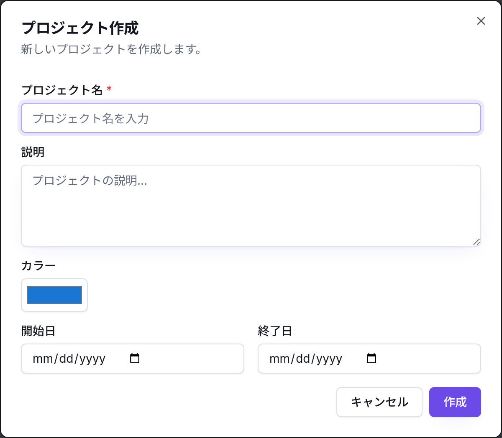
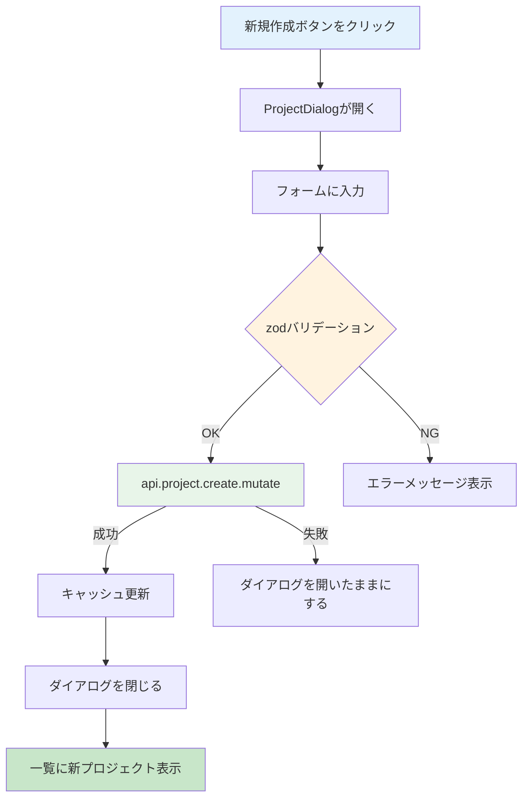
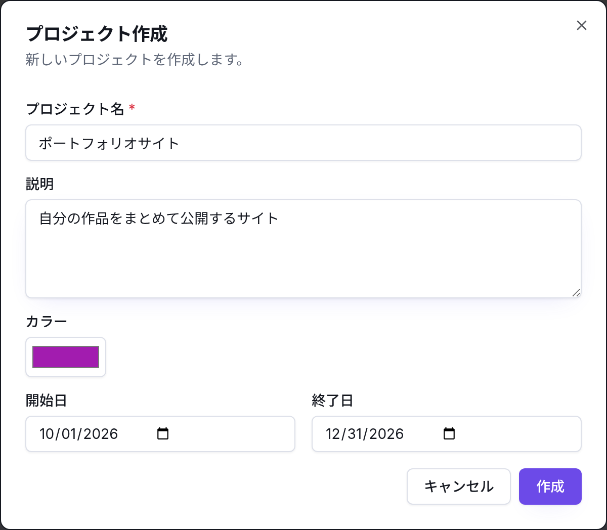
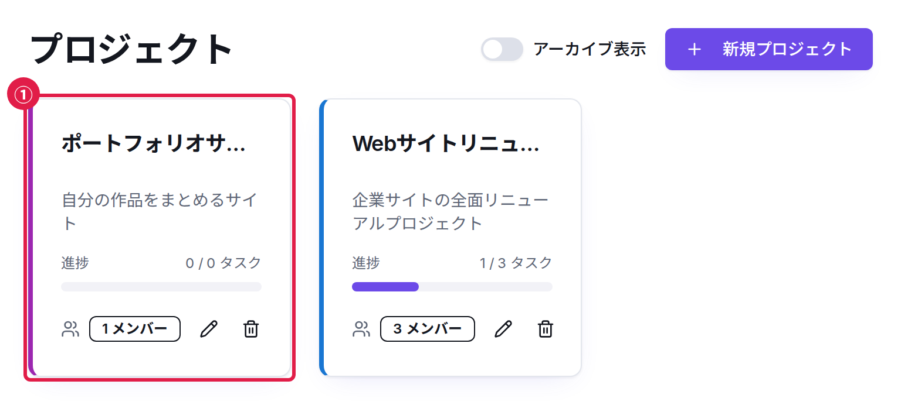
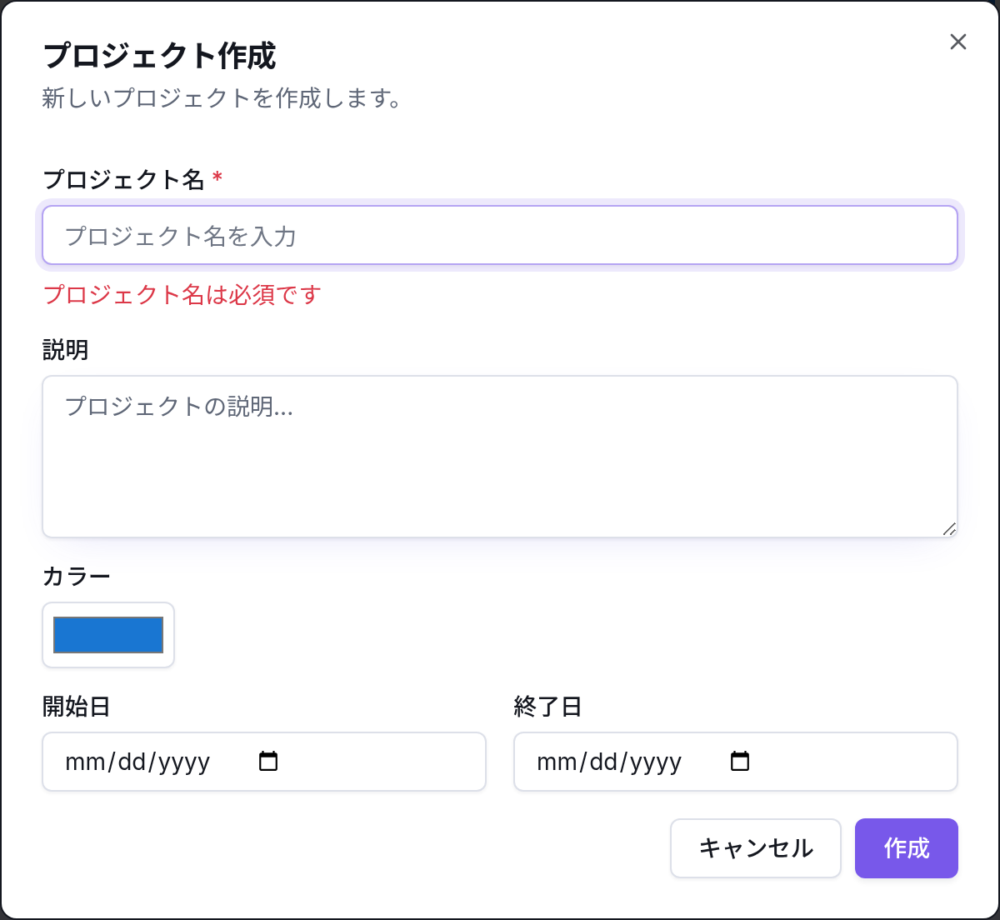

# Day 10: プロジェクト新規作成を実装しよう

## 前回の振り返り

Day 09 では tRPC の `useQuery` を使ってサーバーからプロジェクトデータを取得しました。あわせて `PageLoadingSpinner` によるローディング表示と、グリッドレイアウトでのカード一覧も実装しました。データの「読み取り」ができるようになったので今日は「作成」に進みます。

---

## 今日のゴール

ダイアログ（モーダル）形式のフォームで、新しいプロジェクトを作成できるようにします。react-hook-form と zod でフォームのバリデーションと状態管理を担当し、tRPC の `useMutation` でサーバーに保存します。

スクリーンショット: 今日の最後に目指す表示です。まだ自分の画面には出せません。



ブラウザの言語設定によって、日付欄の表示や年月日の並び順は変わります。画像と表示が違う場合は、カレンダーから日付を選んで確認します。

## なぜこれを作るのか

プロジェクトがなければタスクも管理できません。ここでは「ダイアログ」という新しいUIパターンを学びます。

> **例え話**: ダイアログは「付箋」のようなものです。ページ全体を移動せずに、今いる画面の上にメモ用紙をペタッと貼って書き込みます。書き終わったら付箋をはがすと元の画面がそのまま残っています。

### プロジェクト作成の流れ


```mermaid
flowchart TD
    A[新規作成ボタンをクリック] --> B[ProjectDialogが開く]
    B --> C[フォームに入力]
    C --> D{zodバリデーション}
    D -->|OK| E[api.project.create.mutate]
    D -->|NG| F[エラーメッセージ表示]
    E -->|成功| G[キャッシュ更新]
    E -->|失敗| J[ダイアログを開いたままにする]
    G --> H[ダイアログを閉じる]
    H --> I[一覧に新プロジェクト表示]

    style A fill:#e3f2fd
    style D fill:#fff3e0
    style E fill:#e8f5e9
    style I fill:#c8e6c9
```

この図で目を留めてほしいのはD の分岐と G の位置です。D の zod はまだサーバーへ出発する前の、ブラウザ側の門番です。名前が空なら E へ進まず F のエラー表示で折り返すので通信が1回も起きません。ただしこの門番はブラウザの中にしか居ません。開発者ツールから直接 API を呼ばれれば素通りされるのでStep 0 ではサーバー側にもう1枚同じ門を立てます。

図では G の「キャッシュ更新」を H の手前に置いていますが大事なのは並び順ではありません。E の保存が成功した時点では画面が抱えている一覧のデータはまだ作成前のままです。G で取り直しを始めておかないとH でダイアログを閉じても I の「一覧に新プロジェクト表示」までたどり着けません。ただし G は取り直しを始めるだけで、終わるのを待ちません。ダイアログが閉じた直後の一瞬はまだ前の一覧が見えていることもあります。この2つは成功したときにどちらも走ればよく、どちらを先に書いても結果は同じです。保存結果が不明な場合も G で一覧を確認します。H では閉じず、入力内容と結果確認の案内を残します。ログイン切れのときはフォームを隠します。今日はこの D と G の2か所を、それぞれ Step 0 と Step 7 で手を動かして埋めます。

### やること / やらないこと

| やること | やらないこと |
|---------|-------------|
| ProjectDialog コンポーネントを作る | 別ページでフォームを作る |
| react-hook-form + zod でフォーム管理 | useState で手動管理 |
| useMutation でサーバーに保存 | fetch を手書きする |
| キャッシュ無効化で一覧を自動更新 | 手動でページリロード |

### 今日触るファイル

```
src/
├── app/
│   └── project/
│       └── page.tsx              ← Day 09 のページに追加
├── component/
│   └── project/
│       └── project-dialog.tsx    ← Step 1〜6 で中身を書き直す
├── server/
│   └── api/
│       └── routers/
│           └── project.ts        ← Step 0 で create を追加
└── lib/
    └── constant/
        └── project.ts            ← 既存（定数を利用する）
```

> 今日は Day 09 で作った `src/app/project/page.tsx` にプロジェクト作成機能を追加します。編集機能は Day 11 で追加します。`project-dialog.tsx` は配布済みですが今日は Step 1 から Step 6 で中身を自分の手で書き直します。そのあと `page.tsx` と連携させます。
>
> **今日のゴールライン**: 既存コードを「全部理解する」必要はありません。「この部品がこう動く」が見えたら十分です。細かい型やユーティリティは使いながら慣れていきます。

### 新しく学ぶ概念

| 概念 | 読み方 | 役割 | 例え |
|------|--------|------|------|
| Dialog | ダイアログ | 画面上に重なるモーダル | 付箋。今の画面の上に貼って書き込む |
| zodResolver（Day 05 の復習） | ゾッド・リゾルバー | zod スキーマで入力値を自動検証する仕組み | 記入用紙のチェック係。書き漏れがあれば教えてくれる |
| register | レジスター | 入力欄を react-hook-form に登録する関数 | 記入欄に名札を付けてどの欄かを管理する |
| キャッシュ無効化 | — | データ変更後に一覧を自動で再取得 | 掲示板の更新ボタン。新しい投稿を反映する |

> **今日のゴールライン**: 今日は既存のコードを読む場面が多いです。「なぜこう書いてあるか」は全部わからなくて大丈夫です。「ダイアログでプロジェクトを作成できた」という結果が出れば今日は上出来です。読解力は Day 11 以降で同じパターンを繰り返すうちについてきます。

開発サーバーは前の Day から動かしたまま使います。止めてあるときは `npm run dev` で起動してから `http://localhost:3000` を開きます。

## 実装ステップ一覧

| ステップ | 作業内容 | 読む時間の目安 |
|---------|---------|---------|
| Step 0 | プロジェクト作成 API（create）を自分で書く | 12分 |
| Step 1 | ProjectDialogの骨格を作る | 5分 |
| Step 2 | zodスキーマとフォーム設定を作る | 5分 |
| Step 3 | defaultValues と reset で初期値を同期する | 5分 |
| Step 4 | 名前・説明の入力欄を作る | 7分 |
| Step 5 | カラーピッカーと日付欄を作る | 7分 |
| Step 6 | 送信処理を実装する | 5分 |
| Step 7 | ページにDialogを組み込む | 15分 |
| Step 8 | 動作確認 | 10分 |

**読む時間の合計（仮）**: 約71分です。

表と各 Step に記した時間は、説明とコードを読む時間の仮の目安です。実測した値ではありません。コードの入力、動作確認、ダウンロードや起動の待ち時間、調べものには別に時間を取ってください。

---

### Step 0: プロジェクト作成 API（create）を自分で書く（読む目安: 12分）

**ゴール**: `src/server/api/routers/project.ts` に `create` を追加し、`api.project.create` を呼べる状態にします。

Day 09 で書いた `getAll` は3部品（入力・処理・戻り値）のうち処理が「探す（`.query`）」でした。今日の `create` は「作る（`.mutation`）」になるだけで、骨組みは同じです。

#### 0-1. 入力スキーマを追加する

まず受け取るデータの形を zod で定義します。`project.ts` の `USER_SELECT` の import の下に追加します。

```typescript
// filepath: src/server/api/routers/project.ts（続き）
import { DEFAULT_PROJECT_COLOR } from '@/lib/constant/project';
import { PROJECT_MEMBER_ROLE } from '@/lib/constant/roles';

const projectCreateSchema = z.object({
  name: z.string().min(1, 'プロジェクト名は必須です'),
  description: z.string().optional(),
  color: z
    .string()
    .regex(/^#[0-9A-F]{6}$/i)
    .default(DEFAULT_PROJECT_COLOR),
  startDate: z.string().datetime().optional(),
  endDate: z.string().datetime().optional(),
});

const assertProjectDateOrder = (startDate: Date | null, endDate: Date | null) => {
  if (startDate && endDate && startDate > endDate) {
    throw new TRPCError({
      code: 'BAD_REQUEST',
      message: '終了日は開始日以降の日付にしてください',
    });
  }
};
```

`name` に `.min(1, ...)` が付いているのは空文字のプロジェクト名を作れないようにするためです。`color` の `.regex(/^#[0-9A-F]{6}$/i)` は「`#` に続いて16進数6桁」という色コードの形をチェックします。16進数で使うのは `0` から `9` と `A` から `F` です。末尾の `i` があるため小文字の `a` から `f` も通ります。`type="color"` の入力欄は小文字を返すので、この `i` が無いとブラウザで選んだ色まで弾いてしまいます。`#GGGGGG` のような文字列は通りません。これが無いとフロント側のバリデーションを迂回して変な文字列が color に入ってしまいます。`.default(DEFAULT_PROJECT_COLOR)` は色を指定しなかったときに使う既定色です。

`assertProjectDateOrder` は両方の日付がある場合だけ順序を確認し、終了日が開始日より前なら保存を止めます。開始日と終了日が同じ場合は有効です。

このスキーマが本当に効くのは画面のフォームを通らずに呼ばれたときです。ブラウザの開発者ツールから `api.project.create` を空の名前で叩いても`.min(1, ...)` に引っかかった時点で `mutation` の中身は1行も動きません。`prisma.project.create` まで届かないので名前の無い行がテーブルに残ることはありません。色も同じで、`red` や `<script>` のような文字列は `.regex(...)` が弾きます。

つまりフォーム側の zod は入力中の読者へ赤字を返すためのものでデータベースを守っているのはこちら側です。Day 09 の `getAll` で「他人の userId は管理者しか渡せない」と決めたのと同じ考え方で、画面は親切のためサーバーは防御のために検証します。この二重化を面倒だと感じたらフォームを1行も通らない呼び出しが世の中には存在する、と思い出してください。

#### 0-2. ここが一番のヤマ場（作った本人をメンバーに入れる）

`create` の処理本体です。ここで一番大事なのはプロジェクトを作るのと同時に、作った本人をメンバーとして登録する部分です。

ここから先の「（続き）」のブロックは`project.ts` の**末尾にある `});` の1行上**へ貼ります。ファイルの一番下に足すとルーターの外に出てしまい、英語のエラーで止まります。`});` は増やしません。

```typescript
// filepath: src/server/api/routers/project.ts（続き）
  create: protectedProcedure.input(projectCreateSchema).mutation(async ({ ctx, input }) => {
    const startDate = input.startDate ? new Date(input.startDate) : null;
    const endDate = input.endDate ? new Date(input.endDate) : null;
    assertProjectDateOrder(startDate, endDate);

    const createData: Prisma.ProjectCreateInput = {
      name: input.name,
      color: input.color,
      startDate,
      endDate,
      members: {
        create: {
          userId: ctx.session.userId,
          role: PROJECT_MEMBER_ROLE.OWNER,
        },
      },
    };
```

`members: { create: { ... } }` はプロジェクト本体を作るのと同時に、関連する `ProjectMember` の行も1件同時に作る書き方です。プロジェクトとメンバーは別々のテーブルなので通常は操作も分かれます。Prisma はこの入れ子の `create` で1つのトランザクション（途中で失敗したら全体を取り消す一連の処理）にまとめます。

なぜここが一番のヤマ場かというとDay 09 で書いた `getAll` を思い出すと分かります。`getAll` は「自分がメンバーのプロジェクトだけ」を返す条件になっていました。もしここで `members.create` を忘れるとプロジェクトは作成されるのに作った本人がメンバーに入っていないので `getAll` の一覧には表示されません。「作ったのに一覧に出てこない」という不具合の原因はたいていこの登録漏れです。`role: PROJECT_MEMBER_ROLE.OWNER` で、作成者にはオーナー権限を与えます。

#### 0-3. description は値があるときだけ入れる

`description` は入力が任意なので扱い方を分けます。

```typescript
// filepath: src/server/api/routers/project.ts（続き）
    if (input.description) {
      createData.description = input.description;
    }

    return await prisma.project.create({
      data: createData,
      include: {
        members: {
          include: {
            user: {
              select: USER_SELECT,
            },
          },
        },
      },
    });
  }),
```

最初に作る `createData` には `description` を含めず、値が入力されているときだけ後から足しています。説明欄を空のまま送ると `input.description` は空文字になります。ここで `description: input.description` と書いてしまうとその空文字がそのまま DB へ書き込まれます。空文字は「説明が無い」ではなく「長さ 0 の説明がある」という値なのであとで「説明なし」だけを選び出したいときに数が合わなくなります。なお `undefined` のほうは書き込まれません。Prisma は `undefined` を「この項目には何もしない」という指示として読むためです。値があるときだけキー自体を足すと無いものは無いまま扱われます。この「値がある項目だけオブジェクトに足す」書き方はDay 11 で編集の手続きを書くときにもう一度出てきます。`include` の `members` は `getAll` と同じ形にしています。新規作成直後の `tasks` は空なので、`create` の返り値には含めません。最後の `}),` で `create` を閉じます。

`root.ts` は Day 09 で `project` を登録済みなので今日は変更しません。

**確認ポイント**:
- `projectCreateSchema` と `create` を追加し、`getAll` の直後に `}),` `});` まで閉じました。
- `members.create` で `userId` と `role: PROJECT_MEMBER_ROLE.OWNER` を渡しています。
- ここまでのコードの綴りと括弧の対応を確認しました。

---

### Step 1: ProjectDialogの骨格を作る（読む目安: 5分）

**ゴール**: ダイアログの基本構造を作ります。

> **例え話**: AppLayout は「建物の共通設備」でしたがDialog は「部屋の中で開く小窓」です。中に入力フォームを置いて書き終わったら閉じます。

**実装**:

```typescript
// filepath: src/component/project/project-dialog.tsx
'use client';

// React と フォームバリデーション関連
import { useEffect, useRef } from 'react';
import { zodResolver }
  from '@hookform/resolvers/zod';
import { useForm } from 'react-hook-form';
import { z } from 'zod';
```

`useRef`（ユーズレフ）は再描画を待たずに値を記録するフックです。`submitLocked.current` に送信中かを覚え、連続した送信を止めます。

この4つがフォームの中身を預かる組です。`useEffect` は Step 3 で、ダイアログを開くたびに初期値を入れ直すときに使います。ここで取り込んでおかないとStep 3 で `Cannot find name 'useEffect'` というエラーになります。

続けて画面の部品を取り込みます。

```typescript
// filepath: src/component/project/project-dialog.tsx（続き）
// shadcn/uiコンポーネント
import { Button }
  from '@/component/ui/button';
import {
  Dialog, DialogContent,
  DialogDescription, DialogFooter,
  DialogHeader, DialogTitle,
} from '@/component/ui/dialog';
import { Input }
  from '@/component/ui/input';
import { Label }
  from '@/component/ui/label';
import { Textarea }
  from '@/component/ui/textarea';
// プロジェクトのデフォルト色
import { DEFAULT_PROJECT_COLOR }
  from '@/lib/constant/project';
```

取り込んだ部品は3つの役割に分かれます。`zodResolver`、`useForm`、`z` はフォームの中身を預かる組で、入力値の保持と検証をこの3つが引き受けます。`Dialog` から `DialogTitle` までの6つはshadcn/ui が用意した1つのダイアログを段ごとに分けたものです。枠、本体、見出し、説明文、足元のボタン置き場、と役割が分かれているので必要な段だけを重ねて組み立てられます。

import の `@/component/ui/...` は `components` ではなく、単数形の `component` です。複数形で書くとファイルが見つからないというエラーが出てページを表示できません。

残りは入力欄と定数です。`Input`、`Textarea`、`Label` が実際に文字を打つ場所、`DEFAULT_PROJECT_COLOR` は色を選ばなかったときに入る既定色で、Step 0 のサーバー側スキーマと同じ値を見ています。Day 09 の一覧ページで `Button` や `Switch` を先に取り込んでから組み立てたのと、進め方は変わりません。

**確認ポイント**:
- コードの内容を確認しました。
- すべてのimportが確認できました。

続いてProps（親から子のコンポーネントへ渡す値、読み方はプロップス）の型定義を確認します。

```typescript
// filepath: src/component/project/project-dialog.tsx
// Props の型定義
interface ProjectDialogProps {
  open: boolean;
  onClose: () => void;
  onSubmit: (data: ProjectFormData) => void | Promise<void>;
  isPending?: boolean;
  initialData?:
    ProjectFormData | undefined;
}

// フォームデータの型
export interface ProjectFormData {
  id?: string;
  name: string;
  description?: string;
  color: string;
  startDate?: string;
  endDate?: string;
}
```

この2つの型がダイアログと呼び出し側の約束事です。`open` を親から受け取っているのはダイアログ自身に開閉を覚えさせないためです。Day 09 で `page.tsx` に置いた `dialogOpen` がその値の持ち主で、開けたい側が開き、閉じたい側が閉じます。`onSubmit` も同じ考え方で、入力の終わったデータを外へ渡すだけにしておくと保存の中身をダイアログが知らずに済みます。

だからこの1つの部品を、今日の作成にも Day 11 の編集にも使い回せます。`initialData` に `?` が付いているのはそのためで、新規作成では初期値そのものが存在しません。もし型から `?` を外すと今日の呼び出しで「値が足りない」と TypeScript に止められます。

> `onClose` は閉じる操作を親へ伝えます。Step 7 では開いた回数も更新する `closeProjectDialog` を渡します。`onSubmit` は保存結果を待つ Promise（あとで結果が決まる値）も返せます。`isPending` は保存中に送信ボタンを押せなくする値です。

**確認ポイント**:
- ここまでのコードの綴りと括弧の対応を確認しました。
- `ProjectDialogProps` と `ProjectFormData` の定義を理解しました。

---

### Step 2: zodスキーマとフォーム設定を作る（読む目安: 5分）

**ゴール**: zod でバリデーションルールを定義し、react-hook-form で入力管理します。

**実装**:

```typescript
// filepath: src/component/project/project-dialog.tsx
// zodスキーマでバリデーションルールを定義
const projectFormSchema = z
  .object({
    id: z.string().optional(),
    name: z.string().min(1,
      'プロジェクト名は必須です'),
    description: z.string().optional(),
    color: z.string(),
    startDate: z.string().optional(),
    endDate: z.string().optional(),
  })
  .superRefine((data, ctx) => {
    if (data.startDate && data.endDate && data.startDate > data.endDate) {
      ctx.addIssue({
        code: 'custom',
        path: ['endDate'],
        message: '終了日は開始日以降の日付にしてください',
      });
    }
  });

// スキーマから型を自動生成
type ProjectFormValues =
  z.infer<typeof projectFormSchema>;
```

画面側のスキーマはサーバーへ送る前にブラウザで入力を確かめるためのものです。`id` を `optional` にしているのは新規作成の時点ではまだ ID が無いためです。 `superRefine`（複数の項目をまとめて検査する方法）は開始日と終了日がそろったときだけ順序を確認し、逆転していれば終了日欄へエラーを表示します。サーバーにも同じ確認を置くため、画面を通らない呼び出しでも保存できません。

続けて初期値を作る関数を同じファイルへ書きます。

```typescript
// filepath: src/component/project/project-dialog.tsx（同じファイルの続き）
// 作成でも編集でも同じ形の初期値を作る
function buildProjectFormValues(
  initialData: ProjectFormData | undefined,
): ProjectFormValues {
  return {
    id: initialData?.id,
    name: initialData?.name ?? '',
    description:
      initialData?.description ?? '',
    color: initialData?.color
      ?? DEFAULT_PROJECT_COLOR,
    startDate:
      initialData?.startDate ?? '',
    endDate: initialData?.endDate ?? '',
  };
}
```

`buildProjectFormValues` はフォームの初期値を1か所で作る関数です。新規作成のときは
`initialData` が `undefined` なので`??` の右側が使われて空文字と既定の色が入ります。
編集のときは渡された値がそのまま入ります。この関数が無いと作成と編集で初期値の作り方が
2通りに分かれ、片方だけ直して食い違う原因になります。

Step 0 で書いたサーバー側のスキーマと、ここで書く画面側のスキーマは見た目がよく似ています。ただし役割は別です。サーバー側は保存してよいかどうかの最終判定で、こちらは入力中の読者へ赤字を返すための下書きチェックです。だから `color` は `z.string()` だけにしてあり、色コードの形までは見ていません。形の検査はサーバー側の `.regex(...)` が持っているのでここで二重に厳しくしても防げる事故が増えないためです。

`id` が `optional` なのは新規作成の時点ではまだ ID が存在しないからです。ID はサーバーがデータベースへ書き込んだ瞬間に決まります。Day 11 の編集で初めてここに値が入り、同じスキーマが編集フォームにも使えるようになります。

**確認ポイント**:
- ここまでのコードの綴りと括弧の対応を確認しました。
- `name` フィールドに `min(1)` バリデーションが設定されています。

#### zodスキーマの各フィールド

| フィールド | バリデーション | 意味 |
|-----------|-------------|------|
| `name` | `z.string().min(1, ...)` | 1文字以上必須 |
| `description` | `z.string().optional()` | 入力は任意 |
| `color` | `z.string()` | 色コード（必須） |
| `startDate` | `z.string().optional()` | 開始日（任意） |
| `endDate` | `z.string().optional()` | 終了日（任意） |

> `z.infer<typeof projectFormSchema>` はzod スキーマから TypeScript の型を自動生成する機能です。スキーマと型が常に一致するのでズレが起きません。

---

### Step 3: defaultValues と reset で初期値を同期する（読む目安: 5分）

**ゴール**: `useForm` の `defaultValues` と `useEffect(reset)` を使ってダイアログが開くたびにフォームの初期値を同期します。

**実装**:

```typescript
// filepath: src/component/project/project-dialog.tsx
// コンポーネント本体
export function ProjectDialog({
  open, onClose, onSubmit, initialData, isPending = false,
}: ProjectDialogProps) {
  const submitLocked = useRef(false);
  const {
    register, handleSubmit, reset,
    formState: { errors },
  } = useForm<ProjectFormValues>({
    resolver: zodResolver(
      projectFormSchema),
    defaultValues:
      buildProjectFormValues(initialData),
  });
```

`useForm` で入力欄の管理を始めました。続けて同じ関数の中へ、開くたびに初期値を入れ直す処理を書きます。ここで閉じずに続けるのは、次の処理も同じフォームの `reset` を使うためです。

```typescript
// filepath: src/component/project/project-dialog.tsx（続き）
  useEffect(() => {
    if (!open) {
      return;
    }

    reset(
      buildProjectFormValues(initialData)
    );
  }, [initialData, open, reset]);

  return (
    <Dialog open={open}
      onOpenChange={(isOpen) =>
        !isOpen && onClose()}>
      <DialogContent
        className="sm:max-w-[600px]">
        {/* Step 4 の見出しを入れる位置です。 */}
        <form>
          <div className="grid gap-4 py-4">
            {/* Step 4 の名前欄を入れる位置です。 */}
            {/* Step 4 の説明欄を入れる位置です。 */}
```

ここでは入力欄を置く場所だけ決めます。閉じタグまで先に書くと、次の Step で各コメントを入力欄へ置き換えても、ファイル全体の括弧が崩れません。

```typescript
{/* filepath: src/component/project/project-dialog.tsx（続き） */}
            <div className="grid grid-cols-2 gap-4">
              {/* Step 5 のカラー欄を入れる位置です。 */}
              {/* Step 5 の開始日欄を入れる位置です。 */}
              {/* Step 5 の終了日欄を入れる位置です。 */}
            </div>
          </div>
          {/* Step 6 の操作ボタンを入れる位置です。 */}
        </form>
      </DialogContent>
    </Dialog>
  );
}
```

`useForm` を1回呼ぶと入力欄の値・エラー・送信処理をまとめて預けられます。`useState` で欄ごとに変数を持つ書き方だと欄が5つあれば宣言も5つ必要でした。ここでは欄が増えても宣言は1つのままです。`resolver` に `zodResolver(projectFormSchema)` を渡してあるので送信のたびにスキーマの検査が自動で走り、`errors` に結果が入ります。

`useEffect` の中で `reset(...)` を呼んでいるのは`defaultValues` がフォームを最初に作る一度きりしか効かないためです。同じダイアログを閉じて別のプロジェクトで開き直しても`defaultValues` は読み直されません。何もしないと前回打った文字がそのまま残るので開いた瞬間に `reset` で入れ替えます。先頭の `if (!open)` は閉じているあいだの無駄な入れ替えを止める見張りです。

**確認ポイント**:
- `useForm` に `resolver` と `defaultValues` が設定されています。
- ダイアログが開いていて `initialData` が変わったときに `reset(...)` を呼んでいます。
- `register`, `handleSubmit`, `reset`, `errors` を取得しています。
- ここまでのファイルを保存しても TypeScript のエラーが出ません。
- 入力欄の位置を示すコメントと、フォーム末尾の閉じタグがそろっています。

この時点のダイアログは空のフォームだけを持ちます。まだページへ組み込んでいないため画面には出ませんが、ファイル単体では TypeScript の検査を通せます。Step 4 から Step 6 では閉じタグを動かさず、位置を示すコメントだけを完成コードへ置き換えます。

#### useForm の設定

| 設定 | 役割 |
|------|------|
| `resolver: zodResolver(...)` | zodスキーマでバリデーションを実行 |
| `defaultValues` | フォームを最初に作るときの初期値 |
| `reset(...)` | ダイアログを開き直して `initialData` が変わったときフォームの値を同期 |
| `buildProjectFormValues(...)` | 作成・編集どちらでも同じ形のフォーム初期値を作る関数 |

> `defaultValues` はフォーム作成時の初期値です。ただし同じダイアログを別プロジェクトで開き直すと `initialData` が変わるため`useEffect` の中で `reset(...)` を呼んで再同期します。`useState` で入力値を1つずつ持つのではなく、react-hook-form にまとめて管理させるのがポイントです。`DEFAULT_PROJECT_COLOR` がカラーの初期値として使われている点にも注目してください。

---

### Step 4: 名前・説明の入力欄を作る（読む目安: 7分）

**ゴール**: プロジェクト名と説明の入力フォームを追加します。

**実装**:

Step 3 の `return (` の直前へ、ダイアログを閉じるハンドラーと送信ハンドラーを追加します。先にハンドラーだけを追加して保存しても、下にあるダイアログの閉じタグは残るため TypeScript のエラーになりません。

```typescript
// filepath: src/component/project/project-dialog.tsx
const handleClose = () => {
  reset(buildProjectFormValues(undefined));
  onClose();
};
const handleFormSubmit = async (data: ProjectFormValues) => {
  if (isPending || submitLocked.current) return;
  submitLocked.current = true;
  const submitData: ProjectFormData = {
    ...(data.id !== undefined && { id: data.id }),
    name: data.name,
    color: data.color,
    ...(data.description && { description: data.description }),
    ...(data.startDate && { startDate: data.startDate }),
    ...(data.endDate && { endDate: data.endDate }),
  };
  try {
    await onSubmit(submitData);
  } finally {
    submitLocked.current = false;
  }
};
```

Step 3 の `onOpenChange` にある次の2行を、同じ位置へ置き換えます。これで Escape キーや背景クリックでも、入力欄を消してから閉じます。

```typescript
// filepath: src/component/project/project-dialog.tsx
      onOpenChange={(isOpen) =>
        !isOpen && handleClose()}>
```

`handleClose` が `reset(...)` と `onClose()` を両方呼んでいるのはダイアログを閉じても入力欄の中身はそのまま残るためです。閉じるだけにすると次に「新規プロジェクト」を押したとき前回書きかけた名前が入ったまま開きます。読者から見ると自分が入力した覚えのない文字が最初から入っている画面になります。

`await onSubmit(...)` は親の保存処理を待ちます。`finally`（成功と失敗のどちらでも最後に行う処理）で送信中の記録を戻します。失敗時にはフォームの値を消しません。

送信する側で `...(data.description && { ... })` と書いているのは空欄の項目をそもそも送らないためです。Step 0 のサーバー側は送られてこなかった項目には何もしません。空文字を送るとそちらは「長さ0の説明がある」という値として保存されます。

**確認ポイント**:
- `handleClose` でフォームのリセットとダイアログの閉じが両方行われます。
- `...(data.description && { description: data.description })` は「description が入力されている場合だけプロパティを含める」条件付きスプレッド。`&&` はこの場面で null/undefined を埋める働きとは違い、「真なら含める」という意味で使います。`??` とは用途が異なります。

続いて、Step 3 の `{/* Step 4 の見出しを入れる位置です。 */}` の1行を削除し、同じ位置へダイアログの見出しを追加します。

```typescript
{/* filepath: src/component/project/project-dialog.tsx */}
      <DialogHeader>
        <DialogTitle>
          {initialData?.id
            ? 'プロジェクト編集'
            : 'プロジェクト作成'}
        </DialogTitle>
        <DialogDescription>
          {initialData?.id
            ? 'プロジェクトの詳細を更新します。'
            : '新しいプロジェクトを作成します。'}
        </DialogDescription>
      </DialogHeader>
```

`Dialog` は `open` が `true` のあいだだけ画面に出ます。`onOpenChange` は Esc キー、背景クリック、右上の × など、`open` が変わるすべての出口を受け取ります。`!isOpen && handleClose()` と書いておけばどの閉じ方でも必ず `handleClose` を通るので入力欄のリセット漏れが起きません。ここを `onClose` に直結させるとリセットを飛ばした閉じ方が生まれます。

見出しと説明文を `initialData?.id` で切り替えているのはこの1つのダイアログを作成と編集の両方で使うためです。今日は `initialData` を渡さないので`initialData?.id` は `undefined` になり、常に「プロジェクト作成」側が表示されます。編集側の文言が出るのは Day 11 からです。

**確認ポイント**:
- `Dialog` の `onOpenChange` で閉じ動作をハンドリングしています。
- `initialData?.id` の有無でタイトルが「作成」と「編集」に切り替わります。

送信時に検証を通すため、Step 3 の `<form>` 1行を次のコードへ置き換えます。

```typescript
      {/* filepath: src/component/project/project-dialog.tsx */}
      <form onSubmit={
        handleSubmit(handleFormSubmit)}>
```

次に `{/* Step 4 の名前欄を入れる位置です。 */}` の1行を削除し、同じ位置へプロジェクト名の入力欄を追加します。`{...register('name')}` でフォームに登録します。

```typescript
          {/* filepath: src/component/project/project-dialog.tsx */}
          <div className="grid gap-2">
            <Label htmlFor="name">
              プロジェクト名{' '}
              <span aria-hidden="true"
                className="text-destructive">
                *
              </span>
            </Label>
            <Input id="name"
              placeholder=
                "プロジェクト名を入力"
              aria-required="true"
              aria-invalid={!!errors.name}
              aria-describedby={errors.name ? 'name-error' : undefined}
              {...register('name')} />
            {errors.name && (
              <p id="name-error"
                className=
                "text-sm text-destructive">
                {errors.name.message}
              </p>
            )}
          </div>
```

`{...register('name')}` の1行で、この入力欄は react-hook-form の管理下に入ります。`value` と `onChange` を自分で書かなくても打った文字はフォームの内側に貯まっていきます。`Label` の `htmlFor="name"` と `Input` の `id="name"` をそろえてあるのはラベルの文字をクリックしたときにカーソルが入力欄へ移るようにするためです。読み上げソフトも、この対応関係を見てどの欄の見出しかを判断します。

`errors.name` は zod が出したエラーの置き場で、`min(1)` に引っかかったときだけ中身が入ります。`&&` で囲ってあるのでエラーが無いあいだは赤字の `<p>` そのものが描かれません。名前を空のまま「作成」を押すと通信は起きずにこの1行が現れます。Step 0 のサーバー側まで届く前に、画面の中で折り返しているためです。

必須を伝える方法は2つに分けます。赤い `*` は画面を見る人へ送信前から必須だと知らせます。`aria-hidden="true"` で読み上げ対象から外すのは、入力欄自身の `aria-required="true"` が読み上げソフトへ必須状態を伝えるためです。同じ意味を二重に読ませません。

`aria-invalid` と `aria-describedby` は赤い文字を「見えている人」以外にも届けるための指定です。色の違いを見分けにくい人や、画面を読み上げて使う人には赤字というだけでは何も伝わりません。`aria-describedby` をエラーのあるときだけ付けているのは`id="name-error"` の `<p>` がエラーのないあいだは描かれないからです。無い相手を指したままにしません。この2つを書いておくと読み上げソフトは入力欄へ戻ったときに「入力に誤りがあります」と伝え、その文言をそのまま読みます。Day 14 のタスク作成フォームでも同じ形で書きます。

**確認ポイント**:
- `{...register('name')}` でフォームに登録されています。
- `errors.name` でバリデーションエラーを表示しています。
- 必須マークの `*` に `aria-hidden="true"` が設定されています。
- 名前欄に `aria-required="true"` が設定されています。
- `aria-describedby` の値と、エラーの `<p>` の `id` が同じ文字列になっています。

`{/* Step 4 の説明欄を入れる位置です。 */}` の1行を削除し、同じ位置へ説明欄を追加します。

```typescript
          {/* filepath: src/component/project/project-dialog.tsx */}
          <div className="grid gap-2">
            <Label htmlFor="description">
              説明
            </Label>
            <Textarea
              id="description"
              placeholder=
                "プロジェクトの説明..."
              rows={4}
              {...register('description')}
            />
          </div>
```

Step 4 の3つの位置コメントを、見出し・名前欄・説明欄へ置き換えました。Step 5 と Step 6 の位置コメントと閉じタグは残っているため、この時点で保存しても TypeScript のエラーは出ません。

**確認ポイント**:
- `Textarea` に `{...register('description')}` が設定されています。

> `{...register('name')}` は入力欄に `name`, `onChange`, `onBlur`, `ref` をまとめて設定するスプレッド構文です。`value` と `onChange` を手動で書く必要がなくなります。

**確認ポイント**:
- プロジェクト名の入力欄と、エラーを出すコードを書きました。
- DialogDescription の説明文を作成・編集で切り替えるコードを書きました。
- 表示と送信の確認はページへ組み込む Step 7 のあとに行います。

---

### Step 5: カラーピッカーと日付欄を作る（読む目安: 7分）

**ゴール**: プロジェクトの色と期間を設定できるようにします。

**実装**:

Step 3 で書いた `{/* Step 5 のカラー欄を入れる位置です。 */}` の1行を削除し、同じ位置へカラー欄を追加します。2列の外枠はすでにあるため、1欄ずつ置き換えてもファイルを保存できます。

```typescript
          {/* filepath: src/component/project/project-dialog.tsx */}
            <div className=
              "col-span-2 grid gap-2">
              <Label htmlFor="color">
                カラー
              </Label>
              <Input id="color"
                type="color"
                className=
                  "h-10 w-20 cursor-pointer p-1"
                {...register('color')} />
            </div>
```

この3つの欄は `grid-cols-2` で2列に並べます。カラー欄には `col-span-2` を付けて1行目を横いっぱいに使い、開始日と終了日は2行目で左右に分けます。狭い画面でも日付欄の横幅を確保し、カレンダーのアイコンと入力値が重なりにくくするためです。

色の欄が Step 4 の名前欄と違うのは`placeholder` を持たない点です。色には「まだ何も入っていない」という状態がなく、`DEFAULT_PROJECT_COLOR` が最初から入っています。読者がカラーピッカーに触らなくても必ず何かの色を持ったまま送信されます。だから Step 0 のサーバー側でも、`color` に付けているのは形を確かめる `.regex(...)` と既定値を用意する `.default(...)` の2つで、空を弾く `.min(1)` は付けていません。`w-20` は色見本だけを見やすい幅に絞り、`cursor-pointer` はクリックできる欄だとポインターで示します。`p-1` は色見本と入力欄の枠の間に余白を作ります。

**確認ポイント**:
- カラー欄に `type="color"` を書きました。

選んだ色はあとで Day 29 のユーザー詳細ページでバッジの背景になります。そのバッジは文字を白で描くので明るい色を選ぶと白い文字が背景に溶けて読めなくなります。`#1E3A8A`（濃い青）、`#166534`（濃い緑）、`#7C2D12`（濃い茶）のように暗めの色を選んでください。既定値の `#1976d2` も白文字が読める明るさですが余裕はわずかです。

次に `{/* Step 5 の開始日欄を入れる位置です。 */}` の1行を削除し、同じ位置へ開始日欄を追加します。

```typescript
            {/* filepath: src/component/project/project-dialog.tsx */}
            <div className="grid gap-2">
              <Label htmlFor="startDate">
                開始日
              </Label>
              <Input id="startDate"
                type="date"
                {...register('startDate')}
              />
            </div>
```

開始日の欄に `type="date"` を指定するとブラウザ標準の日付ピッカー（カレンダーから日を選ぶ小窓）が開きます。ここでフォームに入る値は `2026-04-01` のような文字列で、時刻は含みません。

この「時刻を持たない文字列」という性質を覚えておいてください。Step 7 で日付をわざわざ変換するのはこれが理由です。`2026-04-01` のような日付だけの文字列を `new Date(...)` に渡すとJavaScript の仕様では世界共通の基準時刻（UTC）の0時として読まれます。ところが `2026-04-01T00:00:00` のように時刻まで書いて末尾に `Z` が無い文字列は動かしているパソコンの時間帯の0時として読まれます。同じ「0時」でも、文字列の書き方によって指す瞬間が変わります。この違いを覚え違えたまま自前で変換すると保存された日付が1日ずれます。入力の見た目は正しいのに保存だけが狂うので原因を探しにくい種類の不具合です。Step 7 で使う `dateOnlyToUtcStartIso` は`2026-04-01T00:00:00.000Z` のように `Z` を付けてUTCだと書き切る関数です。どちらの読まれ方になるかを毎回思い出さなくても狙った瞬間で保存できます。

**確認ポイント**:
- 開始日欄に `type="date"` を書きました。

続いて `{/* Step 5 の終了日欄を入れる位置です。 */}` の1行を削除し、同じ位置へ終了日欄を追加します。2列のまとまりとフォーム全体の閉じタグは Step 3 ですでに書いたため、そのまま残します。

```typescript
            {/* filepath: src/component/project/project-dialog.tsx */}
            <div className="grid gap-2">
              <Label htmlFor="endDate">
                終了日
              </Label>
              <Input
                id="endDate"
                type="date"
                aria-invalid={!!errors.endDate}
                aria-describedby={errors.endDate ? 'end-date-error' : undefined}
                {...register('endDate')}
              />
              {errors.endDate && (
                <p id="end-date-error" className="text-sm text-destructive">
                  {errors.endDate.message}
                </p>
              )}
            </div>
```

> `type="color"` を指定するとブラウザ標準のカラーピッカーが表示されます。`className="h-10"` で他の入力欄と高さを揃えています。`{...register('color')}` で、選んだ色が自動的にフォームの値として管理されます。

**確認ポイント**:
- カラー・開始日・終了日の3つの欄を書き、終了日エラーの表示も追加しました。
- 選択や入力の確認はページへ組み込む Step 7 のあとに行います。

スクリーンショット: 入力欄がそろったダイアログの完成形です。`</Dialog>` まで閉じてありますが、一覧へ組み込むのは Step 7 なので、この時点ではまだ画面に出ません。いまは書いたコードと見比べる用に見てください。



---

### Step 6: 送信処理を実装する（読む目安: 5分）

**ゴール**: 送信ボタンとキャンセルボタンを追加します。

**実装**:

Step 3 で書いた `{/* Step 6 の操作ボタンを入れる位置です。 */}` の1行を削除し、同じ位置へ次のボタンを追加します。

```typescript
        {/* filepath: src/component/project/project-dialog.tsx */}
        <DialogFooter>
          <Button type="button"
            variant="outline"
            onClick={handleClose}>
            キャンセル
          </Button>
          <Button type="submit" disabled={isPending}>
            {initialData?.id
              ? '更新' : '作成'}
          </Button>
        </DialogFooter>
```

`DialogFooter` はボタンをそろえる置き場です。幅 640px 以上ではボタンが右下に横並びです。狭い画面では縦に並びます。キャンセルに `type="button"` を書いているのは`<form>` の内側にあるボタンが指定しないかぎり送信ボタンとして扱われるからです。この1語を落とすとキャンセルを押した瞬間に送信が走り、名前が空なら zod のエラーまで出ます。閉じたいだけなのに赤字が出る、という妙な挙動の正体はこれです。

作成ボタンの `type="submit"` は逆に、押されたら `handleSubmit` に検証を回してもらう指定です。検証を通ったときだけ `handleFormSubmit` へ値が渡り、通らなければ何も起きません。文言を `initialData?.id` で「作成」と「更新」に切り替えてあるのでDay 11 で編集を足すときも、この部分は1文字も書き換えずに済みます。

**確認ポイント**:
- 作成ボタンを `type="submit"`、キャンセルを `type="button"` で書きました。
- キャンセルに `handleClose` をつなぎました。
- Step 3 で先に書いた `</form>` からコンポーネント末尾までの閉じタグが残っています。
- ファイルを保存しても TypeScript のエラーが出ません。
- 実際の表示・送信・キャンセルは Step 7 でページへ組み込んだあとに確認します。

#### ボタンの役割

| ボタン | type | 動作 |
|--------|------|------|
| キャンセル | `button` | `handleClose` でフォームをリセットし、ダイアログを閉じる |
| 作成 / 更新 | `submit` | `handleSubmit` → zodバリデーション → `handleFormSubmit` |

> `type="button"` を指定しないとキャンセルボタンでもフォーム送信が実行されてしまいます。キャンセル時は `handleClose` で `reset()` を呼び、フォームの入力内容をクリアしてから閉じます。

---

### Step 7: ページにDialogを組み込む（読む目安: 15分）

**ゴール**: 作成結果を画面へ知らせ、保存中の連続送信と古い応答によるダイアログ閉じを防ぎます。

通信が切れてもサーバーでは作成済みの場合があります。そのときは結果を不明と表示し、一覧を確かめてから必要な場合だけ再実行します。キャンセルで閉じた入力は消えるため、確認前に必要な内容を控えてください。

配布済みの `src/lib/project-write-error.ts` と `src/lib/query-error.ts` があるか確認します。前者の `classifyProjectWriteError` は操作名とエラー番号から表示文を選びます。サーバーの内部メッセージはそのまま表示しません。後者はログイン切れの判定に使います。ファイルが無い場合は、販売用 ZIP を展開したフォルダの `scripts/_lib-base/project-write-error.ts` と `scripts/_lib-base/query-error.ts` を確認します。それぞれを、作業中のアプリの `src/lib/project-write-error.ts` と `src/lib/query-error.ts` へコピーしてください。コピー元には下線付きの `_lib-base`、コピー先には `lib` を使います。

`page.tsx` は Day 09 の一覧に作成処理を足します。既存の import 群を次の内容へそろえます。新しい部品は `ProjectDialog`、結果の短い通知を出す `toast`、ログイン画面へ移動する `useRouter` です。

```typescript
// filepath: src/app/project/page.tsx
'use client';

import { Plus } from 'lucide-react';
import { Suspense, useEffect, useRef, useState } from 'react';
import { AppLayout }
  from '@/component/layout/app-layout';
import { ProjectCard }
  from '@/component/project/project-card';
import {
  ProjectDialog,
  type ProjectFormData,
} from
  '@/component/project/project-dialog';
import { Button }
  from '@/component/ui/button';
import { Label }
  from '@/component/ui/label';
import { PageLoadingSpinner }
  from '@/component/ui/loading-spinner';
import { Switch }
  from '@/component/ui/switch';
import { TASK_STATUS }
  from '@/lib/constant/status';
```

画面の部品は、一覧を残したままダイアログを重ねるために取り込みます。次のブロックでは日付の変換と結果の通知を追加し、フォームの値をサーバーへ送れる形にそろえます。

```typescript
// filepath: src/app/project/page.tsx
import { dateOnlyToUtcStartIso }
  from '@/lib/date';
import { api } from '@/trpc/react';
import { useRouter } from 'next/navigation';
import toast from 'react-hot-toast';
import { classifyProjectWriteError } from '@/lib/project-write-error';
import { isAuthError, shouldRetryQuery } from '@/lib/query-error';
```

通知の文面は配布済みの分類関数が選びます。日付変換は Day 10 のサーバーが受け取る UTC の日時にそろえるためです。

`ProjectPageContent` の先頭にある `showArchived` と `dialogOpen` の宣言を次へ置き換え、続く ref と関数を追加します。

```typescript
// filepath: src/app/project/page.tsx
const [showArchived, setShowArchived] = useState(false);
const [dialogOpen, setDialogOpen] = useState(false);
const router = useRouter();
const authExpiredRef = useRef(false);
const [authExpired, setAuthExpired] = useState(false);
const formSession = useRef({ generation: 0, target: null as string | null });
const notifiedWriteErrors = useRef(new Set<unknown>());
const formSubmitting = useRef(false);
const closeProjectDialog = () => {
    formSession.current = { generation: formSession.current.generation + 1, target: null };
    setDialogOpen(false);
  };
const utils = api.useUtils();
```

`useRef` の `.current` は同じ操作の処理からすぐ読み直せます。`formSubmitting` は送信開始直後の二度押しを止めます。`generation`（世代番号）は開閉するたびに増やす数です。保存中に閉じて開き直したら、前の応答は新しいダイアログを閉じません。今日は作成だけなので `target` は常に null です。Day 11 で編集対象の ID も記録します。

`notifiedWriteErrors` は Set（同じ値を重複して入れない集合）です。通知済みのエラーを記録し、送信側ではそのエラーだけを受け止めます。

既存の `getAll.useQuery` の宣言を次へ置き換えます。エラーを受け取る名前は Day 09 の `projectsError` のままです。`projectAccessDenied` の宣言、取得失敗時の `if`、一覧の上にある再取得失敗の注意は残してください。

```typescript
// filepath: src/app/project/page.tsx
const { data: projects, isLoading: projectsLoading, error: projectsError } = api.project.getAll.useQuery(
    { isArchived: showArchived },
    { enabled: !authExpired, retry: shouldRetryQuery },
  );
  const queryAuthFailed = isAuthError(projectsError);
  useEffect(() => {
    if (!queryAuthFailed) return;
    authExpiredRef.current = true;
    setAuthExpired(true);
  }, [queryAuthFailed]);
```

認証切れが分かったら ref と state の両方に記録します。あとから一覧取得が成功しても、そのページではフォームや一覧を表示し直しません。

その直下へ、一覧を取り直す関数を追加します。

案内文はPDFで文字列の途中が折れないよう、括弧の中で複数の文字列に分けます。`+` は文字列を前後の順でつなぐ演算子なので、画面に出る文は変わりません。

```typescript
// filepath: src/app/project/page.tsx
const refreshProject = async () => {
    // 認証切れの後に届いた成功はキャッシュだけを無効にし、再通信しません。
    const filters = {
      refetchType: authExpiredRef.current ? ('none' as const) : ('active' as const),
    };
    try {
      const updates = [utils.project.getAll.invalidate(undefined, filters)];
      await Promise.all(updates);
    } catch (error) {
      // 表示更新の失敗を、書き込みの失敗として通知しないためです。
      console.error('プロジェクトの表示更新に失敗しました。', error);
      if (!authExpiredRef.current)
        toast.error(('最新の表示を取得できませんでした。' +
          '再表示して' +
          '操作結果を確認してください。'));
    }
  };
```

`invalidate` はキャッシュ（一度取得したデータの控え）が古いことを知らせます。通常は一覧を取り直しますが、認証切れのあとには `refetchType: 'none'` で通信を止めます。

その下へ作成用の mutation を追加します。

```typescript
// filepath: src/app/project/page.tsx
const createMutation = api.project.create.useMutation({
    retry: false,
    onSuccess: () => { void refreshProject(); },
    onError: (error) => {
      notifiedWriteErrors.current.add(error);
      const result = classifyProjectWriteError(error, 'create');
      if (result.kind === 'auth') {
        authExpiredRef.current = true;
        setAuthExpired(true);
        return;
      }
      toast.error(result.message);
      void refreshProject();
    },
  });
```

`retry: false` は保存の自動再送を止めます。401ならログイン画面へのボタンを出し、他の失敗なら固定文を表示します。失敗を表す `onError` と成功を表す `onSuccess` で案内を分けます。

既存の `handleCreate` を次へ置き換えます。

```typescript
// filepath: src/app/project/page.tsx
const handleCreate = () => {
    if (authExpiredRef.current) return;
    formSession.current = { generation: formSession.current.generation + 1, target: null };
    setDialogOpen(true);
  };
```

開くたびに世代を進め、前に開いたフォームの応答と区別します。今日は編集・削除・詳細表示の受け皿を変更しません。

その下へ送信ハンドラーを追加します。

```typescript
// filepath: src/app/project/page.tsx
const handleSubmit = async (data: ProjectFormData) => {
    if (authExpiredRef.current || formSubmitting.current) return;
    const session = { ...formSession.current };
    if (session.target !== (data.id ?? null)) return;
    const payload = {
      name: data.name,
      description: data.description,
      color: data.color,
      startDate: data.startDate ? dateOnlyToUtcStartIso(data.startDate) : undefined,
      endDate: data.endDate ? dateOnlyToUtcStartIso(data.endDate) : undefined,
    };
    formSubmitting.current = true;
    try {
      await createMutation.mutateAsync(payload);
    } catch (error) {
      if (!notifiedWriteErrors.current.delete(error)) throw error;
      return;
    } finally {
      formSubmitting.current = false;
    }
    if (
      !authExpiredRef.current &&
      formSession.current.generation === session.generation &&
```

送信前に入力値を組み立て、保存待ちの間は同じハンドラーからの再送を止めます。結果が返ったら世代を確かめるため、開き直したフォームに古い応答を適用せずに済みます。

```typescript
// filepath: src/app/project/page.tsx
      formSession.current.target === session.target
    ) {
      closeProjectDialog();
    }
  };
```

`mutateAsync`（ミューテート・アシンク）は保存の結果を Promise で返します。送信前の世代を控え、成功後も一致している場合だけ閉じます。認証切れが判明したあとの古い成功では閉じません。

`if (projectsLoading)` の直前へ次の分岐を追加します。読み込み表示より先にログイン切れを案内するためです。

```typescript
// filepath: src/app/project/page.tsx
if (authExpired || queryAuthFailed) {
    return <AppLayout><div className="py-24 text-center">
      <p>ログインの有効期限が切れました</p>
      <p>入力内容はログイン後に入力し直してください。</p>
      <Button onClick={() => router.push('/login')}>ログイン画面へ</Button>
    </div></AppLayout>;
  }
```

ログインボタンを押したときだけ移動します。古い問い合わせが待機中でも、このボタンは押せます。Day 09 の取得失敗表示も残っています。403なら前回の一覧を隠し、一時的な取得失敗で前回の一覧があれば、カードと注意を一緒に表示します。401は今回追加した分岐で先に止めます。

一覧グリッドを閉じるタグの直後へ次のタグを追加します。

```typescript
{/* filepath: src/app/project/page.tsx */}
<ProjectDialog
  open={dialogOpen}
  onClose={closeProjectDialog}
  onSubmit={handleSubmit}
  isPending={createMutation.isPending}
/>
```

`isPending` は通信中に送信ボタンを押せなくする指定です。保存待ちでもキャンセルや Escape キーで閉じられます。閉じても送信済みの保存は取り消されません。配置や括弧が分からない場合は、後ろの「完成コード全体」の `src/app/project/page.tsx` と照合してください。販売用 ZIP に完成版の `src/` は入っていません。参照先はこの教材内のコードです。

**確認ポイント**:
- `page.tsx` が呼ぶ保存処理は `create` だけになっています。
- 作成ボタンの連打で二重送信せず、保存成功時に一覧を取り直します。
- 保存の結果が不明なら入力を残して案内を表示します。
- Day 09 の `projectsError` と `projectAccessDenied` の参照が残り、取得失敗を0件と表示しません。
- 型の確認は Step 8 の起動後に行います。

スクリーンショット: 作成成功後に、入力した名前のカードが一覧へ増えます。



---

### Step 8: 動作確認（読む目安: 10分）

**ゴール**: プロジェクト作成の全体フローを確認します。

開発サーバーの状態を確認します。

開発サーバーが動いていればそのまま使います。止めてあるときだけ次のコマンドで起動します。

```bash
# filepath: ターミナル
# 停止している場合だけ起動する
npm run dev
```

**確認ポイント**:
- `http://localhost:3000` にアクセスできます。

以下の手順で動作を確認してください。

| # | 操作 | 期待される結果 |
|---|------|--------------|
| 1 | 「新規プロジェクト」ボタンをクリック | ダイアログが開く |
| 2 | プロジェクト名を空のまま「作成」 | エラーメッセージが表示される |
| 3 | プロジェクト名を入力し、色を選択 | エラーが消える |
| 4 | 「作成」ボタンをクリック | 保存に成功するとダイアログが閉じる |
| 5 | アーカイブ表示が OFF の一覧を確認 | 新しいプロジェクトが追加されている |
| 6 | カードの色帯を確認 | 選んだ色が反映されている |

スクリーンショット: 下の画像はプロジェクト名を空のまま「作成」を押したときのエラー表示です。



**確認ポイント**:
- プロジェクトが作成できます。
- 一覧が自動で更新されます（ページリロードなし）。
- カードに選んだ色が反映されています。
- 名前を入力してキャンセルし、もう一度開くと入力欄が空になっています。

続いて、通信が遅い場合の3つの境界を確認します。Chrome DevTools（ブラウザに組み込まれた開発者向け画面）を開き、**Network** タブの速度を **Slow 3G** にします。確認が終わったら必ず **No throttling** に戻してください。

**二重送信**

ダイアログへ重複しない名前を入力し、「作成」を素早く2回押します。Network タブに出る `project.create` のリクエストが1件だけで、カードも1枚だけ増えることを確認します。1回目を押した直後にボタンが無効になるため、同じ送信を重ねません。

**閉じてから開き直した入力**

名前を `遅延確認A` にして送信し、通信中にキャンセルします。すぐ開き直して `遅延確認B` と入力し、A の通信完了を待ちます。A が成功しても、開き直したダイアログと B の入力が残ることを確認します。古い送信の完了が新しい入力欄を閉じないためです。A がカードへ追加された場合は、確認後に残った B のダイアログをキャンセルで閉じます。

**結果を確認できない通信**

重複しない名前を入力して送信します。Network タブで `project.create` が通信中になったら **Offline** へ切り替えます。結果を確認できない案内が表示され、入力した名前が残ることを確認します。この場合は作成済みと未作成のどちらもあり得ます。**No throttling** に戻してページを再読み込みし、同じ名前のカードがあるか確かめてから再送信してください。

これらは通信を意図的に遅らせて確認する手順です。アプリのコードへ `setTimeout` を追加する必要はありません。

---

### Pro パターンで書こう（作成後はリロードせず一覧キャッシュを更新する）

一覧クエリを無効化して再取得するとフィルターやスクロール位置を維持したまま、現在のフィルターに合うデータを最新の状態に保てます。
なぜ直前の1文の書き方をするのか、**Before/After** で見比べてみましょう。

比較するのは一覧の更新方法だけです。次の Before と After は貼り付け用ではありません。世代の確認とエラー表示は Step 7 の実装を使います。

### Before（改善前のコード）

```typescript
'use client';

import { api } from '@/trpc/react';

type ProjectFormData = {
  name: string;
  description?: string;
  color: string;
  startDate?: string;
  endDate?: string;
};

export function useCreateProjectSubmit(onClose: () => void) {
  const createMutation = api.project.create.useMutation({
    onSuccess: () => {
      onClose();
      window.location.reload();
    },
  });

  const submitProject = (data: ProjectFormData) => {
    createMutation.mutate({
      name: data.name,
      description: data.description,
```

**読み比べ用**: ここは写経しません。続けてコードを読み進めましょう。

ここまでが Before の前半です。`onSuccess` の中の `window.location.reload()` に目を留めてください。この1行はページを丸ごと読み込み直すので一覧は確かに新しくなります。ただし戻ってくるのは開いた直後の画面です。Day 09 で作ったアーカイブ表示スイッチも、途中まで下げていたスクロール位置も既定へ戻ります。作ったばかりのプロジェクトを自分で探し直すことになるので1件作るたびに読者の手が止まります。後半ではこの関数がサーバーへ何を送っているかを見ます。

```typescript
// filepath: 読み比べ用サンプル（続き・実ファイルには対応しません）
      color: data.color,
      startDate: data.startDate,
      endDate: data.endDate,
    });
  };

  return {
    submitProject,
    isPending: createMutation.isPending,
  };
}
```

**このコードの問題点**:

- 作成後にページ全体をリロードするので一覧以外の状態まで全部リセットされます。
- フィルターやスクロール位置が消えてユーザーが今いた場所を見失いやすいです。
- tRPCのキャッシュを使っているのにブラウザ再読み込みで力技の更新になっています。

3つとも、作成そのものは成功しているのに使い勝手だけが落ちる種類の問題です。画面にエラーが出ないので書いた本人は気づけません。気づくのはアーカイブ表示を切り替えてから新規作成した読者で、そのたびに条件を入れ直すことになります。tRPC はキャッシュを一覧ごとに捨てる手段を持っているのでページ全体を捨てる必要はありません。

### After（プロが書くコード）

```typescript
'use client';

import { api } from '@/trpc/react';

type ProjectFormData = {
  name: string;
  description?: string;
  color: string;
  startDate?: string;
  endDate?: string;
};

export function useCreateProjectSubmit(onClose: () => void) {
  const utils = api.useUtils();

  const createMutation = api.project.create.useMutation({
    onSuccess: () => {
      void utils.project.getAll.invalidate();
      onClose();
    },
  });

  const submitProject = (data: ProjectFormData) => {
    createMutation.mutate({
```

**読み比べ用**: ここは写経しません。続けてコードを読み進めましょう。

ここまでが After の前半です。Before との違いは `void utils.project.getAll.invalidate()` の1行に集まっています。`invalidate` は「この一覧の控えはもう古い」と印を付ける操作で、印の付いたクエリを今表示しているページだけが取り直します。ページそのものは生き残るのでスイッチとスクロール位置はそのまま残ります。頭の `void` は取り直しの完了を待たずに次の `onClose()` へ進むという意思表示です。ダイアログは先に閉じてよく、取り直した結果は届き次第あとから反映されます。アーカイブ表示が ON なら作成直後のプロジェクトは条件に合わないため並びません。後半は Before と同じ送信部分なので見比べる箇所はここまでです。

```typescript
// filepath: 読み比べ用サンプル（続き・実ファイルには対応しません）
      name: data.name,
      description: data.description,
      color: data.color,
      startDate: data.startDate,
      endDate: data.endDate,
    });
  };

  return {
    submitProject,
    isPending: createMutation.isPending,
  };
}
```

**このコードの強み**:

- `project.getAll` のキャッシュだけを無効化するので必要な一覧だけ再取得できます。
- ダイアログを閉じてもページ全体は残るため表示条件や操作中の流れが途切れにくいです。
- 作成、更新、削除でも同じ `mutation + invalidate` の型を使い回せます。

3つ目が今日いちばん持ち帰ってほしい形です。Day 11 で足す編集と削除は`mutation` の名前が変わるだけで、`onSuccess` で一覧を無効化する部分はそのまま使い回せます。作成のうちにこの骨組みをつかんでおくと次の似た手続きは説明を読まずに自分で書けます。

#### 覚えておきたいエッセンス

データを変えた後はページを丸ごとリロードするより **変わった一覧だけ再取得する** ほうが自然です。
tRPCでは `mutation` の成功時に `invalidate()` を呼ぶ、この形を覚えておきましょう。

## 完成コード全体

今日は3つのファイルを触りました。断片を貼り重ねる作業が続いたので途中でどこへ貼ったか分からなくなった場合は以下のコードを上から順に貼り付けて各ファイルを置き換えてください。1つのファイルが複数のブロックに分かれている場合はそのファイルの見出しの下にあるブロックを、出てくる順につなげたものが全文です。`project.ts` と `page.tsx` は Day 09 で作り始めたファイルなのでDay 09 で書いた部分もあわせて載せています。

| ファイル | 役割 | 対応する Step |
|---------|------|--------------|
| `src/server/api/routers/project.ts` | プロジェクトの取得と作成を受け持つサーバー側の手続き | Step 0（Day 09 の `getAll` を含む） |
| `src/component/project/project-dialog.tsx` | 作成フォームを載せるダイアログ本体 | Step 1 から Step 6 |
| `src/app/project/page.tsx` | 一覧ページとダイアログの配線 | Step 7（Day 09 の一覧を含む） |

### `src/server/api/routers/project.ts`

**import と作成用スキーマ**:

```typescript
// filepath: src/server/api/routers/project.ts
// 完成版: import と作成用スキーマ
import type { Prisma } from '@prisma/client';
import { TRPCError } from '@trpc/server';
import { z } from 'zod';
import { DEFAULT_PROJECT_COLOR } from '@/lib/constant/project';
import { PROJECT_MEMBER_ROLE, USER_ROLE } from '@/lib/constant/roles';
import { prisma } from '@/lib/prisma';
import { createTRPCRouter, protectedProcedure } from '../trpc';
import { USER_SELECT } from './_helpers/select';

const projectCreateSchema = z.object({
  name: z.string().min(1, 'プロジェクト名は必須です'),
  description: z.string().optional(),
  color: z
    .string()
    .regex(/^#[0-9A-F]{6}$/i)
    .default(DEFAULT_PROJECT_COLOR),
  startDate: z.string().datetime().optional(),
  endDate: z.string().datetime().optional(),
});

```

作成用スキーマは、それぞれの日付が正しい形式かを検査します。ただし、2つの日付の前後関係は別の検査が必要です。スキーマを閉じたら、開始日と終了日を比較する関数を続けて書きます。

```typescript
// filepath: src/server/api/routers/project.ts（同じファイルの続き）
// 完成版: import と作成用スキーマ（続き）
const assertProjectDateOrder = (startDate: Date | null, endDate: Date | null) => {
  if (startDate && endDate && startDate > endDate) {
    throw new TRPCError({
      code: 'BAD_REQUEST',
      message: '終了日は開始日以降の日付にしてください',
    });
  }
};
```

Step 0 では `PROJECT_MEMBER_ROLE` を別の行で取り込みましたがここでは Day 09 の `USER_ROLE` と1行にまとめてあります。`npm run fix` を実行するとBiome（このプロジェクトのコード整形ツール）が同じファイルからの取り込みを1行へ寄せるためです。手元が2行のままでも中身は変わりません。スキーマをルーターの外に置いてあるのは`create` の `.input(...)` から名前で参照するだけで足りるからです。

**getAll の入口と権限チェック**:

```typescript
// filepath: src/server/api/routers/project.ts
// 完成版: getAll の入口と権限チェック
export const projectRouter = createTRPCRouter({
  getAll: protectedProcedure
    .input(
      z
        .object({
          userId: z.string().cuid().optional(),
          isArchived: z.boolean().optional(),
        })
        .optional(),
    )
    .query(async ({ ctx, input }) => {
      const where: Prisma.ProjectWhereInput = {};

      if (input?.userId && input.userId !== ctx.session.userId) {
        if (ctx.session.role !== USER_ROLE.ADMIN) {
          throw new TRPCError({
            code: 'FORBIDDEN',
            message: '管理者権限が必要です',
          });
        }
      }
```

`where` を空のオブジェクトから始めているのは条件を後から足していく形にするためです。条件の有無で `findMany` の呼び出しを何通りも書き分けずに済みます。権限の確認を検索条件の組み立てより前に置いてあるのは弾く判断を先に済ませるためです。あとに回すと断るはずの相手のために検索条件を組み立てる無駄が生まれます。

**getAll の検索条件**:

```typescript
// filepath: src/server/api/routers/project.ts
// 完成版: getAll の検索条件
      if (!input?.userId) {
        where.members = {
          some: { userId: ctx.session.userId },
        };
      } else {
        where.members = {
          some: { userId: input.userId },
        };
      }

      if (input?.isArchived !== undefined) {
        where.isArchived = input.isArchived;
      }
```

`isArchived` の判定を `!== undefined` にしてあるのは`false` が渡された場合と何も渡されなかった場合を分けるためです。`if (input?.isArchived)` と書くと`false` は偽として扱われて条件が足されません。その結果、アーカイブ済みを外したいのに全件が返ります。この一覧ページのスイッチは `false` を送る場面が普通にあるのでこの書き分けが効きます。

**getAll が返すデータ**:

```typescript
// filepath: src/server/api/routers/project.ts
// 完成版: getAll が返すデータ
      return await prisma.project.findMany({
        where,
        include: {
          members: {
            include: {
              user: {
                select: USER_SELECT,
              },
            },
          },
          tasks: {
            select: {
              id: true,
              status: true,
            },
          },
        },
        orderBy: { createdAt: 'desc' },
      });
    }),
```

`tasks` に `select` を付けて `id` と `status` だけに絞っているのは画面で使うのは件数と完了数だけだからです。全項目を取ると本文や期日まで毎回運ぶことになります。ユーザー側を `USER_SELECT` に任せているのも同じ理由で、パスワードのように返してはいけない項目を毎回書き並べずに済みます。

**create の作成データ**:

```typescript
// filepath: src/server/api/routers/project.ts
// 完成版: create の作成データ
  create: protectedProcedure.input(projectCreateSchema).mutation(async ({ ctx, input }) => {
    const startDate = input.startDate ? new Date(input.startDate) : null;
    const endDate = input.endDate ? new Date(input.endDate) : null;
    assertProjectDateOrder(startDate, endDate);

    const createData: Prisma.ProjectCreateInput = {
      name: input.name,
      color: input.color,
      startDate,
      endDate,
      members: {
        create: {
          userId: ctx.session.userId,
          role: PROJECT_MEMBER_ROLE.OWNER,
        },
      },
    };
```

持ち主になる `userId` を `input` からではなく `ctx.session.userId` から取っている点がこの手続きの要です。画面から送られてきた値を持ち主にすると他人の ID を書いたリクエストで他人名義のプロジェクトを作れてしまいます。`ctx.session` はサーバーが Cookie から組み立てた情報なので画面側から書き換えられません。

**create の保存と戻り値**:

```typescript
// filepath: src/server/api/routers/project.ts
// 完成版: create の保存と戻り値
    if (input.description) {
      createData.description = input.description;
    }

    return await prisma.project.create({
      data: createData,
      include: {
        members: {
          include: {
            user: {
              select: USER_SELECT,
            },
          },
        },
      },
    });
  }),
});
```

`include` の `members` は `getAll` と同じ形です。新規作成直後の `tasks` は空なので、`create` の返り値には含めていません。最後の `}),` が `create` を閉じ、`});` が `projectRouter` 全体を閉じます。この2行が1つでも欠けると英語のエラーで起動が止まります。

### `src/component/project/project-dialog.tsx`

以下のブロックを上から順に結合すると1ファイルになります。各 `filepath` コメントもそのままコピーできます。

```typescript
// filepath: src/component/project/project-dialog.tsx
// 完成版: 1
'use client';

import { useEffect, useRef } from 'react';
import { zodResolver }
  from '@hookform/resolvers/zod';
import { useForm } from 'react-hook-form';
import { z } from 'zod';
import { Button }
  from '@/component/ui/button';
import {
  Dialog, DialogContent,
  DialogDescription, DialogFooter,
  DialogHeader, DialogTitle,
} from '@/component/ui/dialog';
import { Input }
  from '@/component/ui/input';
import { Label }
  from '@/component/ui/label';
import { Textarea }
  from '@/component/ui/textarea';
import { DEFAULT_PROJECT_COLOR }
  from '@/lib/constant/project';
interface ProjectDialogProps {
```

フォームの検証と入力欄の部品を取り込みます。見た目を作る部品と値を検証する関数を分けることで、入力欄を追加しても保存の処理をダイアログの中へ持ち込まずに済みます。

```typescript
// filepath: src/component/project/project-dialog.tsx
// 完成版: 2
  open: boolean;
  onClose: () => void;
  onSubmit: (data: ProjectFormData) => void | Promise<void>;
  isPending?: boolean;
  initialData?:
    ProjectFormData | undefined;
}

export interface ProjectFormData {
  id?: string;
  name: string;
  description?: string;
  color: string;
  startDate?: string;
  endDate?: string;
}
```

`ProjectFormData` は送信する値の型です。型だけでは空の名前や期間の逆転を止められないため、次にフォームの入力条件を定義します。型の定義を閉じた直後へ続けてください。

```typescript
// filepath: src/component/project/project-dialog.tsx（同じファイルの続き）
// 完成版: 2（続き）
const projectFormSchema = z
  .object({
    id: z.string().optional(),
    name: z.string().min(1,
      'プロジェクト名は必須です'),
    description: z.string().optional(),
    color: z.string(),
    startDate: z.string().optional(),
```

親から受け取る値とフォームの検証条件を定義します。保存結果を待てる型と通信中の値を受け取れる型にすることで、親の通信が終わる前に次の送信を始めることを防ぎます。

```typescript
// filepath: src/component/project/project-dialog.tsx
// 完成版: 3
    endDate: z.string().optional(),
  })
  .superRefine((data, ctx) => {
    if (data.startDate && data.endDate && data.startDate > data.endDate) {
      ctx.addIssue({
        code: 'custom',
        path: ['endDate'],
        message: '終了日は開始日以降の日付にしてください',
      });
    }
  });

type ProjectFormValues =
  z.infer<typeof projectFormSchema>;
```

`superRefine` が開始日と終了日を比較し、逆転した場合は終了日の欄へエラーを付けます。続く関数は、新規作成と編集で異なる初期値をそろえるためのものです。フォームの型の直後へ追加します。

```typescript
// filepath: src/component/project/project-dialog.tsx（同じファイルの続き）
// 完成版: 3（続き）
function buildProjectFormValues(
  initialData: ProjectFormData | undefined,
): ProjectFormValues {
  return {
    id: initialData?.id,
    name: initialData?.name ?? '',
    description:
      initialData?.description ?? '',
    color: initialData?.color
      ?? DEFAULT_PROJECT_COLOR,
    startDate:
      initialData?.startDate ?? '',
    endDate: initialData?.endDate ?? '',
  };
}
export function ProjectDialog({
  open, onClose, onSubmit, initialData, isPending = false,
}: ProjectDialogProps) {
```

未入力の欄には空文字、色には既定値を使って初期値を作ります。作成と編集で同じ関数を使うため、開くたびの初期値を1か所で決められます。

```typescript
// filepath: src/component/project/project-dialog.tsx
// 完成版: 4
  const submitLocked = useRef(false);
  const {
    register, handleSubmit, reset,
    formState: { errors },
  } = useForm<ProjectFormValues>({
    resolver: zodResolver(
      projectFormSchema),
    defaultValues:
      buildProjectFormValues(initialData),
  });

  useEffect(() => {
    if (!open) {
      return;
    }

    reset(
      buildProjectFormValues(initialData)
    );
  }, [initialData, open, reset]);
const handleClose = () => {
  reset(buildProjectFormValues(undefined));
  onClose();
```

開いたときに初期値を反映し、明示的に閉じたときは空の値へ戻します。送信に失敗したときにはこの閉じる処理を呼ばないため、入力した名前や日付をそのまま残せます。

```typescript
// filepath: src/component/project/project-dialog.tsx
// 完成版: 5
};
const handleFormSubmit = async (data: ProjectFormValues) => {
  if (isPending || submitLocked.current) return;
  submitLocked.current = true;
  const submitData: ProjectFormData = {
    ...(data.id !== undefined && { id: data.id }),
    name: data.name,
    color: data.color,
    ...(data.description && { description: data.description }),
    ...(data.startDate && { startDate: data.startDate }),
    ...(data.endDate && { endDate: data.endDate }),
  };
  try {
    await onSubmit(submitData);
  } finally {
    submitLocked.current = false;
  }
};
  return (
    <Dialog open={open}
      onOpenChange={(isOpen) =>
        !isOpen && handleClose()}>
      <DialogContent
```

親の送信処理が終わるまで ref の記録を保持します。結果が決まると記録を解除します。一度エラーになっただけで次の送信が永久に止まる状態を防ぐためです。

```typescript
// filepath: src/component/project/project-dialog.tsx
// 完成版: 6
        className="sm:max-w-[600px]">
        <DialogHeader>
          <DialogTitle>
            {initialData?.id
              ? 'プロジェクト編集'
              : 'プロジェクト作成'}
          </DialogTitle>
          <DialogDescription>
            {initialData?.id
              ? 'プロジェクトの詳細を更新します。'
              : '新しいプロジェクトを作成します。'}
          </DialogDescription>
        </DialogHeader>
        <form onSubmit={
          handleSubmit(handleFormSubmit)}>
          <div className="grid gap-4 py-4">
            <div className="grid gap-2">
              <Label htmlFor="name">
                プロジェクト名{' '}
                <span aria-hidden="true" className="text-destructive">
                  *</span>
              </Label>
              <Input id="name" placeholder="プロジェクト名を入力"
```

初期データの ID に応じて見出しを切り替えます。フォームの送信先には検証用の handleSubmit を渡し、名前が空なら保存処理へ進む前に入力欄の近くで知らせます。

```typescript
// filepath: src/component/project/project-dialog.tsx
// 完成版: 7
                aria-required="true"
                aria-invalid={!!errors.name}
                aria-describedby={errors.name ? 'name-error' : undefined}
                {...register('name')} />
              {errors.name && (
                <p id="name-error"
                  className=
                  "text-sm text-destructive">
                  {errors.name.message}
                </p>
              )}
            </div>
            <div className="grid gap-2">
              <Label htmlFor="description">
                説明
              </Label>
              <Textarea id="description"
                placeholder="プロジェクトの説明..."
                rows={4}
                {...register('description')}
              />
            </div>
```

赤い `*` は画面を見る人へ必須だと知らせ、`aria-required` は読み上げソフトへ同じ状態を伝えます。エラーは該当する入力欄と関連付けて表示します。説明欄も register でフォームへ登録することで、送信時には名前と説明を同じ入力データとして受け取れます。

```typescript
{/* filepath: src/component/project/project-dialog.tsx */}
{/* 完成版: 8 */}
            <div className="grid grid-cols-2 gap-4">
              <div className="col-span-2 grid gap-2">
                <Label htmlFor="color">
                  カラー
                </Label>
                <Input id="color"
                  type="color"
                  className=
                    "h-10 w-20 cursor-pointer p-1"
                  {...register('color')} />
              </div>
              <div className="grid gap-2">
                <Label htmlFor="startDate">
                  開始日
                </Label>
                <Input id="startDate"
                  type="date"
                  {...register('startDate')}
                />
              </div>
              <div className="grid gap-2">
                <Label htmlFor="endDate">
                  終了日
```

カラー欄は2列分を使い、幅を `w-20` に絞った色見本を1行目へ置きます。開始日と終了日は2行目で1列ずつ使います。日付の入力値は時刻を含まない文字列なので、この画面ではそのまま保持し、サーバーへ送る直前にページ側で変換します。

```typescript
{/* filepath: src/component/project/project-dialog.tsx */}
{/* 完成版: 9 */}
                </Label>
                <Input
                  id="endDate"
                  type="date"
                  aria-invalid={!!errors.endDate}
                  aria-describedby={errors.endDate ? 'end-date-error' : undefined}
                  {...register('endDate')}
                />
                {errors.endDate && (
                  <p id="end-date-error" className="text-sm text-destructive">
                    {errors.endDate.message}
                  </p>
                )}
              </div>
            </div>
          </div>
```

終了日のエラーは入力欄のすぐ下に表示し、どの日付を直す必要があるか伝えます。`aria-describedby` もそのエラー文を参照しています。入力欄を閉じたら、キャンセルと送信のボタンを追加します。

```typescript
{/* filepath: src/component/project/project-dialog.tsx（同じファイルの続き） */}
{/* 完成版: 9（続き） */}
          <DialogFooter>
            <Button type="button"
              variant="outline"
              onClick={handleClose}>
              キャンセル
            </Button>
            <Button type="submit" disabled={isPending}>
              {initialData?.id
                ? '更新' : '作成'}
            </Button>
          </DialogFooter>
        </form>
      </DialogContent>
    </Dialog>
  );
```

通信中の送信ボタンを無効にします。キャンセルは押せるままです。キャンセルはフォームの送信を起こさずに閉じるため、type に button を指定して役割を分けます。

```typescript
// filepath: src/component/project/project-dialog.tsx
// 完成版: 10
}
```

送信中の記録は Promise が完了するまで保持します。キャンセルで閉じた場合は初期値へ戻します。

### `src/app/project/page.tsx`

上から順に結合して1ファイルとして書きます。`getAll` で一覧を読み、`create` だけで保存します。

```typescript
// filepath: src/app/project/page.tsx
// 完成版: 1
'use client';

import { Plus } from 'lucide-react';
import { Suspense, useEffect, useRef, useState } from 'react';
import { AppLayout }
  from '@/component/layout/app-layout';
import { ProjectCard }
  from '@/component/project/project-card';
import {
  ProjectDialog,
  type ProjectFormData,
} from
  '@/component/project/project-dialog';
import { Button }
  from '@/component/ui/button';
import { Label }
  from '@/component/ui/label';
import { PageLoadingSpinner }
  from '@/component/ui/loading-spinner';
import { Switch }
  from '@/component/ui/switch';
import { TASK_STATUS }
  from '@/lib/constant/status';
```

一覧とダイアログで使う部品を取り込みます。ページ全体を再読み込みせずに作成結果を一覧へ反映するため、同じページの中で一覧の表示とフォームの開閉を組み合わせます。

```typescript
// filepath: src/app/project/page.tsx
// 完成版: 2
import { dateOnlyToUtcStartIso }
  from '@/lib/date';
import { api } from '@/trpc/react';
import { useRouter } from 'next/navigation';
import toast from 'react-hot-toast';
import { classifyProjectWriteError } from '@/lib/project-write-error';
import { isAuthError, shouldRetryQuery } from '@/lib/query-error';
function ProjectPageContent() {
const [showArchived, setShowArchived] = useState(false);

const [dialogOpen, setDialogOpen] = useState(false);

const router = useRouter();

const authExpiredRef = useRef(false);

const [authExpired, setAuthExpired] = useState(false);

const formSession = useRef({ generation: 0, target: null as string | null });

const notifiedWriteErrors = useRef(new Set<unknown>());

const formSubmitting = useRef(false);
```

認証切れと送信中の記録は用途を分けて持ちます。前者はログインし直すまで保護された表示を止め、後者は1つの送信が終われば解除して次の入力を送れるようにします。

```typescript
// filepath: src/app/project/page.tsx
// 完成版: 3

const closeProjectDialog = () => {
    formSession.current = { generation: formSession.current.generation + 1, target: null };
    setDialogOpen(false);
  };

const utils = api.useUtils();

const { data: projects, isLoading: projectsLoading, error: projectsError } = api.project.getAll.useQuery(
    { isArchived: showArchived },
    { enabled: !authExpired, retry: shouldRetryQuery },
  );
  const queryAuthFailed = isAuthError(projectsError);
  useEffect(() => {
    if (!queryAuthFailed) return;
    authExpiredRef.current = true;
    setAuthExpired(true);
  }, [queryAuthFailed]);

const refreshProject = async () => {
    // 認証切れの後に届いた成功はキャッシュだけを無効にし、再通信しません。
    const filters = {
      refetchType: authExpiredRef.current ? ('none' as const) : ('active' as const),
```

閉じるたびに世代を更新し、前のフォームの応答と区別します。一覧取得で認証切れが分かった場合も同じ記録を使うため、別の問い合わせが成功しても一覧は再表示しません。

```typescript
// filepath: src/app/project/page.tsx
// 完成版: 4
    };
    try {
      const updates = [utils.project.getAll.invalidate(undefined, filters)];
      await Promise.all(updates);
    } catch (error) {
      // 表示更新の失敗を、書き込みの失敗として通知しないためです。
      console.error('プロジェクトの表示更新に失敗しました。', error);
      if (!authExpiredRef.current)
        toast.error(('最新の表示を取得できませんでした。' +
          '再表示して' +
          '操作結果を確認してください。'));
    }
  };
```

ここまでで一覧の再取得と認証切れ時の通信抑止を完了させます。次の `createMutation` は、この更新処理を作成成功後に呼び、保存結果と表示更新の失敗を別々に扱います。

```typescript
// filepath: src/app/project/page.tsx（同じファイルの続き）

const createMutation = api.project.create.useMutation({
    retry: false,
    onSuccess: () => { void refreshProject(); },
    onError: (error) => {
      notifiedWriteErrors.current.add(error);
      const result = classifyProjectWriteError(error, 'create');
      if (result.kind === 'auth') {
        authExpiredRef.current = true;
        setAuthExpired(true);
        return;
      }
```

一覧の表示更新と作成の結果通知を分けます。表示の取り直しが失敗しても、すでに成功した作成まで失敗と案内すると再送を誘うため、別の固定文で結果の確認を促します。

```typescript
// filepath: src/app/project/page.tsx
// 完成版: 5
      toast.error(result.message);
      void refreshProject();
    },
  });

const handleCreate = () => {
    if (authExpiredRef.current) return;
    formSession.current = { generation: formSession.current.generation + 1, target: null };
    setDialogOpen(true);
  };

const handleEdit = (projectId: string) => {
    void projectId;
  };

const handleDelete = (projectId: string) => {
    void projectId;
  };

const handleProjectClick = (id: string) => {
    void id;
  };
```

作成を開くと新しい世代になります。編集や削除の受け皿はまだ何もしないため、今日のページから未実装の保存手続きを呼ばず、作成だけを確かめられる状態に保ちます。

```typescript
// filepath: src/app/project/page.tsx
// 完成版: 6
const handleSubmit = async (data: ProjectFormData) => {
    if (authExpiredRef.current || formSubmitting.current) return;
    const session = { ...formSession.current };
    if (session.target !== (data.id ?? null)) return;
    const payload = {
      name: data.name,
      description: data.description,
      color: data.color,
      startDate: data.startDate ? dateOnlyToUtcStartIso(data.startDate) : undefined,
      endDate: data.endDate ? dateOnlyToUtcStartIso(data.endDate) : undefined,
    };
    formSubmitting.current = true;
    try {
      await createMutation.mutateAsync(payload);
    } catch (error) {
      if (!notifiedWriteErrors.current.delete(error)) throw error;
      return;
    } finally {
      formSubmitting.current = false;
    }
    if (
      !authExpiredRef.current &&
      formSession.current.generation === session.generation &&
```

送信する日付は UTC の日時へ変換します。保存の応答を待ってから対象と世代を照合するため、待機中にキャンセルして開き直した入力を前の成功で消さずに済みます。

```typescript
// filepath: src/app/project/page.tsx
// 完成版: 7
      formSession.current.target === session.target
    ) {
      closeProjectDialog();
    }
  };

if (authExpired || queryAuthFailed) {
    return <AppLayout><div className="py-24 text-center">
      <p>ログインの有効期限が切れました</p>
      <p>入力内容はログイン後に入力し直してください。</p>
      <Button onClick={() => router.push('/login')}>ログイン画面へ</Button>
    </div></AppLayout>;
  }

if (projectsLoading) {
    return (
      <AppLayout>
        <PageLoadingSpinner />
      </AppLayout>
    );
  }

```

認証切れは読み込み表示より先に判定します。古い通信が待機していてもログインボタンを出せるため、スピナーのままログインし直せない状態を避けられます。

```typescript
// filepath: src/app/project/page.tsx
// 完成版: 取得失敗の表示
const projectAccessDenied =
  projectsError?.data?.code === 'UNAUTHORIZED' ||
  projectsError?.data?.code === 'FORBIDDEN';

if (projectsError && (!projects || projectAccessDenied)) {
  return (
    <AppLayout>
      <p role="alert">
        {projectAccessDenied
          ? 'この一覧を表示する権限がありません。'
          : 'プロジェクトを読み込めませんでした。'}
      </p>
    </AppLayout>
  );
}
```

Day 09 の取得失敗表示です。403では取得済みのカードも隠し、最初の取得に失敗した場合はエラーを表示します。0件とは別の画面にすることで、取得できなかった結果を空の一覧と誤認せずに済みます。

```typescript
// filepath: src/app/project/page.tsx
return (
    <AppLayout>
      <div className="flex flex-col gap-6">
        <div className="flex items-center
          justify-between">
          <h1 className="text-3xl font-bold
            tracking-tight">
            プロジェクト
          </h1>
          <div className="flex items-center
            gap-4">
            <div className="flex
              items-center space-x-2">
              <Switch
                id="show-archived"
                checked={showArchived}
                onCheckedChange={
                  setShowArchived} />
              <Label
                htmlFor="show-archived">
                アーカイブ表示
              </Label>
            </div>
            <Button onClick={handleCreate}>
```

見出しの横へアーカイブ表示のスイッチを置きます。この値を一覧の問い合わせへ渡すため、フィルターを切り替えたあとはその条件で取得したカードが並びます。

```typescript
{/* filepath: src/app/project/page.tsx */}
{/* 完成版: 9 */}
              <Plus
                className="mr-2 h-4 w-4" />
              新規プロジェクト
            </Button>
          </div>
        </div>

```

ここまでで一覧のヘッダーを閉じました。取得済みの一覧を表示できる通信エラーでは、次のブロックでカードの前に注意を出します。画面にカードがあっても最新の情報とは限らないことを知らせるためです。

```typescript
{/* filepath: src/app/project/page.tsx */}
{projectsError && projects && !projectAccessDenied && (
  <p role="alert" className="text-sm text-destructive">
    最新の一覧を取得できませんでした。
    前回の一覧を表示しています。
  </p>
)}
```

この下に Day 09 のカード一覧を続けます。一覧の取得に成功したときと同じカードを使い、再取得だけが失敗したときも前回の名前や件数を確認できるようにします。

```typescript
{/* filepath: src/app/project/page.tsx */}
        <div className="grid gap-6
          sm:grid-cols-2 lg:grid-cols-3
          xl:grid-cols-4">
          {projects && projects.length > 0
            ? (projects.map((project) => {
              let taskCount = 0;
              let doneCount = 0;
              for (const task of
                project.tasks ?? []) {
                if (task.status ===
                  TASK_STATUS.CANCELLED) continue;
                taskCount++;
                if (task.status ===
                  TASK_STATUS.DONE) doneCount++;
              }
              return (
                <ProjectCard
                  key={project.id}
                  id={project.id}
```

キャンセル済みのタスクは進捗の分母から外します。たとえば完了1件とキャンセル1件なら、カードへ渡す進捗は `1 / 1` です。

新規作成ボタンはフォームを開く処理へつなぎます。一覧ではプロジェクトごとに件数を求めてカードを作るため、1つのカードに別のプロジェクトの件数が混ざりません。

```typescript
// filepath: src/app/project/page.tsx
// 完成版: 10
                  name={project.name}
                  description={
                    project.description}
                  color={project.color}
                  memberCount={
                    project.members?.length
                      ?? 0}
                  taskStats={{
                    total: taskCount,
                    done: doneCount }}
                  onEdit={handleEdit}
                  onDelete={handleDelete}
                  onClick={
                    handleProjectClick}
                  isArchived={
                    project.isArchived}
                />);
            })
```

カードには表示する値とクリック時のハンドラーを分けて渡します。今日の編集・削除・詳細のハンドラーは受け皿なので、まだ存在しない API をカードから呼びません。

```typescript
// filepath: src/app/project/page.tsx
// 完成版: 11
            ) : (
              <div className="col-span-full
                flex flex-col items-center
                justify-center py-12
                text-center
                text-muted-foreground">
                <p>{showArchived ? 'アーカイブ済みのプロジェクトはありません。'
                  : '進行中のプロジェクトはありません。'}</p>
              </div>
            )}
        </div>
        <ProjectDialog
          open={dialogOpen}
          onClose={closeProjectDialog}
          onSubmit={handleSubmit}
          isPending={createMutation.isPending}
        />
      </div>
    </AppLayout>
  );
}
export default function ProjectPage() {
```

一覧が空なら、スイッチに合わせて進行中かアーカイブ済みのどちらが0件なのかを伝え、その下へダイアログを置きます。通信中の値を親から渡すため、ダイアログ内の送信ボタンも同じ保存処理の待機状態に合わせて無効になります。

```typescript
// filepath: src/app/project/page.tsx
// 完成版: 12
  return (
    <Suspense
      fallback={<PageLoadingSpinner />}>
      <ProjectPageContent />
    </Suspense>
  );
}
```

保存結果が不明なときは案内に従って一覧を確認します。401のあとに一覧取得が成功しても、保護された内容は表示し直しません。

## 今日のまとめ

- [ ] Dialog コンポーネントでモーダルフォームを作れました。
- [ ] react-hook-form + zodResolver でフォームのバリデーションを実装できました。
- [ ] `register` で入力欄をフォームに登録できました。
- [ ] `useMutation` でサーバーにデータを保存できました。
- [ ] `invalidate()` でキャッシュを自動更新できました。

## つまずきポイント

#### ダイアログが開かない

**原因**

`open` prop が渡されていません。

**解決方法**

`open={dialogOpen}` を確認します。

#### `dialogOpen is not defined`

**原因**

state の宣言が漏れています。

**解決方法**

Day 09 Step 8 で `useState(false)` を宣言したか確認します。

#### 作成後に一覧が更新されない

**原因**

キャッシュ無効化の呼び出しを忘れています。

**解決方法**

`onSuccess: () => { void refreshProject(); }` があるか確認します。次に `refreshProject` の中で `utils.project.getAll.invalidate(...)` を呼んでいるか確認します。認証切れや再取得失敗も同じ関数で扱うため、ここへ直接 `invalidate()` を追加しません。

#### バリデーションが効かない

**原因**

`resolver` の設定を忘れています。

**解決方法**

`resolver: zodResolver(projectFormSchema)` を確認します。

#### 入力しても値が反映されない

**原因**

`register` の接続が漏れています。

**解決方法**

`{...register('name')}` のスプレッド構文を確認します。

#### 作成ボタンを押しても何も起きない

**原因**

入力がバリデーションで止まっているか、サーバーがエラーを返しています。

**解決方法**

まず名前欄が空でないか確認します。通信後の案内に従い、認証切れならログインし直します。結果が不明なら一覧で作成済みか確認し、必要な場合だけ再実行してください。

## 今日学んだ用語

| 用語 | 意味 |
|------|------|
| Dialog | 画面の上に重なるモーダルウィンドウ |
| useMutation | データの作成・更新・削除に使う tRPC フック |
| invalidate | キャッシュを無効にして再取得させる操作 |
| useUtils | tRPC のキャッシュ操作ユーティリティ |
| zodResolver | zod スキーマを react-hook-form に接続するアダプター |
| register | 入力欄を react-hook-form に登録する関数 |

## 応用課題: キャンセルで各入力を初期化する

名前以外の入力も、次の新規作成へ残らないか確かめましょう。フォーム全体を初期化する `reset` の対象を確認します。


（1）新規プロジェクトを開き、最初のカラーをメモします。名前・説明・カラー・開始日・終了日の5項目を変更します。日付は開始日より後の日を終了日に選びます。

（2）作成を押さずにキャンセルし、もう一度新規プロジェクトを開きます。

（3）名前・説明・日付2つが空で、カラーがメモした値へ戻れば成功です。値が残る場合は`project-dialog.tsx` の `handleClose` と、開いたときに `reset` を呼ぶ箇所を確認します。

（4）キャンセルで閉じます。一覧の件数が変わっていないことを確認して終わります。作成していないのでデータを削除する操作は不要です。

## 理解チェック

今日書いたコードを見ながら答えてみてください。答えは各問のすぐ下にあります。

**Q1. `create` の中の `members: { create: { userId: ctx.session.userId, role: OWNER } }` は何をしている指定ですか。**

A. プロジェクト本体を作るのと同時に、作った本人をメンバーの行として1件登録しています。役割は OWNER です。Prisma はこの書き方で、2つのテーブルへの書き込みをまとめて1回の操作にします。プロジェクトだけ先に作り、あとからメンバーを足す書き方より途中で失敗したときの取りこぼしが起きません。

**Q2. その `members.create` の部分を消すと何が起きますか。**

A. プロジェクト自体は作られます。ところが作った本人がメンバーになりません。`getAll` は自分がメンバーのものだけを返す条件で書いてあります。そのため作ったはずのプロジェクトが一覧に出てきません。画面上は「作成しても何も増えない」という見え方になります。

**Q3. キャンセルボタンに `type="button"` を書くのはなぜですか。**

A. `<form>` の中のボタンは何も指定しないと送信ボタンとして扱われるからです。付け忘れるとキャンセルを押した瞬間に送信が走ります。名前欄が空なら zod のエラーが出ます。閉じるつもりで押したのに赤い文字が増えるという結果になります。

## 次回予告

Day 11 ではプロジェクトの編集・削除機能を実装します。Day 10 で作った ProjectDialog を「編集モード」で再利用する方法を学びます。

---

## Day 10 終了時点の状態（完成版との違い）

Day 10 を終えた時点で、手元のファイルがどこまで書けていればよいかをまとめます。完成版との違いもここに書きます。

### `src/server/api/routers/project.ts`

Day 10 終了時点の状態は完成版の `src/server/api/routers/project.ts` の `getAll` と `create` の部分と同じです。`update` 以降は Day 11 で追加するのでまだ存在しません（販売用 ZIP に完成版の `src/` は入っていません。教材内のコードと確認ポイントが正本です）。

### `src/component/project/project-dialog.tsx`

Day 10 終了時点のダイアログは完成版の `src/component/project/project-dialog.tsx` と同じ入力項目・必須表示・2列配置です。教材では保存途中も型検査を通せるように Step 3 から Step 6 へ分けています。販売用 ZIP に完成版の `src/` は入っていないため、教材内のコードと確認ポイントを正本として順番に組み立ててください。

### `src/app/project/page.tsx`

完成版の `src/app/project/page.tsx` はDay 12 と Day 27 まで書き足した後の姿です。削除確認、アーカイブ、詳細表示が入っているので今日の終わりの手元のコードより長くなります。今日の時点では一覧の取得と作成ダイアログの配線まで書けていれば大丈夫です（販売用 ZIP に完成版の `src/` は入っていません。教材内のコードと確認ポイントが正本です）。

---

## 次に読むもの

- 前の日: [Day 09](./day09_プロジェクト一覧画面.md)
- 次の日: [Day 11](./day11_プロジェクト編集・削除.md)
- 全体の地図: [学びのロードマップ](./00-1_学びのロードマップ.md)
- 目次: [カリキュラム目次](./00_カリキュラム目次.md)
- 詰まったとき: [トラブルシューティング](./appendix_トラブルシューティング.md)
- 言葉の意味: [用語集](./appendix_用語集.md)

<!-- textlint-disable ja-technical-writing/ja-no-mixed-period, ja-technical-writing/no-doubled-conjunction, ja-technical-writing/no-exclamation-question-mark -->

---

## 奥付

| | |
|---|---|
| タイトル | Day 10: プロジェクト新規作成を実装しよう |
| 著者 | 磯貝光佑 |
| 版 | 第1版（2026年9月19日） |

© 2026 磯貝光佑

本書は購入者個人の利用に限ります。本書に掲載されたコードの写経、および自分のプロジェクトへの転用・改変は自由です。本書（PDF・Markdown）および付属コードの再配布・転売・第三者との共有は、形態を問わず禁止します。

<!-- textlint-enable ja-technical-writing/ja-no-mixed-period, ja-technical-writing/no-doubled-conjunction, ja-technical-writing/no-exclamation-question-mark -->
